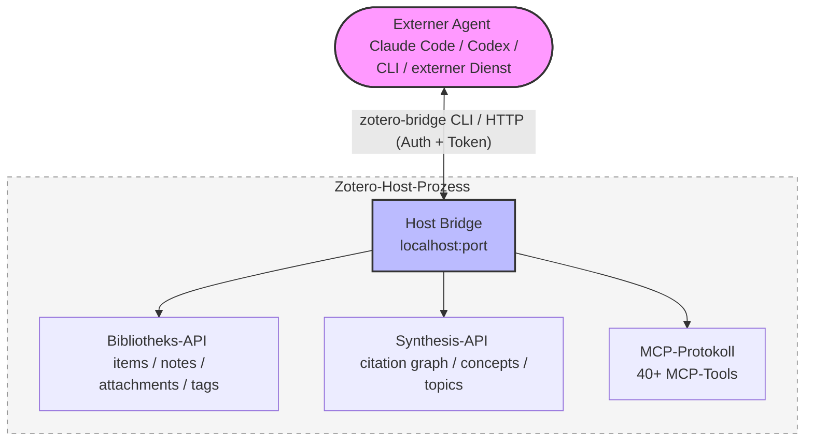
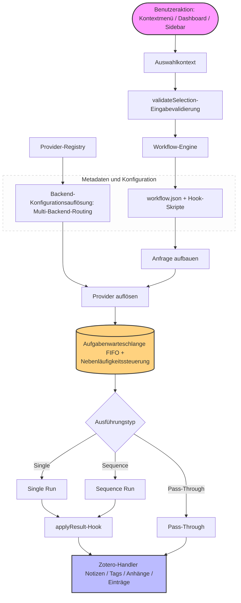

<!-- hero banner -->
<p align="center">
  
</p>

<p align="center">
  
</p>

<h1 align="center">Zotero Agents</h1>

<p align="center">
  <a href="https://github.com/leike0813/zotero-agents/releases"></a>
  
  <a href="https://github.com/leike0813/zotero-agents/blob/main/LICENSE"></a>
  
</p>

<p align="center">
  <a href="README.md">English</a> · <a href="README-zhCN.md">简体中文</a> · <a href="README-zhTW.md">繁體中文</a> · <a href="README-jaJP.md">日本語</a> · <a href="README-frFR.md">Français</a> · <strong>Deutsch</strong> · <a href="README-esES.md">Español</a> · <a href="README-ptBR.md">Português</a> · <a href="README-koKR.md">한국어</a> · <a href="README-itIT.md">Italiano</a> · <a href="README-ruRU.md">Русский</a> · <a href="https://leike0813.github.io/zotero-agents/">📖 Dokumentation</a> · <a href="https://github.com/leike0813/zotero-agents">GitHub</a> · <a href="https://gitee.com/leike0813/zotero-agents">Gitee</a>
</p>

> **Repository-Historie:** Zotero Agents hieß früher **Zotero Skills**. Das alte Repository bleibt unter https://github.com/leike0813/Zotero-Skills für historische Releases und Migrationsaufzeichnungen erhalten.

---

<p align="center">
  <strong>Ihre Zotero-Bibliothek, jetzt von KI-Agenten angetrieben.</strong><br/>
  <sub>Machen Sie Literatursuche, -analyse, -verwaltung, -synthese und Schreibvorbereitung zu überprüfbarem, nachvollziehbarem und wiederverwendbarem Forschungswissen.</sub>
</p>

<p align="center">
  <a href="https://leike0813.github.io/zotero-agents/getting-started">
    
  </a>
  &nbsp;
  <a href="https://github.com/leike0813/zotero-agents/releases">
    
  </a>
</p>

---

Zotero Agents ist die **All-in-One-Agent-Arbeitsplattform** für Ihre Zotero-Bibliothek — kein Frage-Antwort-Chat-Assistent, sondern ein System, in dem KI-Agenten direkt in Ihrer Bibliothek arbeiten und Artikel aus „gelesenen und vergessenen PDFs" in ein **erkundbares, überprüfbares und anreicherbares Forschungs-Wissensnetzwerk** verwandeln.

**Überlassen Sie die Literatur den Agenten — Sie treffen nur die Entscheidungen.** Literaturanalyse — die KI extrahiert automatisch Zusammenfassungen, Referenzen und Zitationsmeinungen und erzeugt in einem Durchgang drei strukturierte Notizen; Literatursuche und -aufnahme — der Agent recherchiert online, filtert Kandidaten und übernimmt nach Ihrer Bestätigung Stück für Stück in Ihre Bibliothek; Tag-Normalisierung — organisiert und ergänzt Tags automatisch auf Basis Ihres definierten kontrollierten Vokabulars; Tiefenlektüre — erzeugt eine ansprechende HTML-Lesansicht, angereichert um das Wissen Ihrer Bibliothek; Themen-Synthese — strukturiert zu einer Forschungsrichtung Grundlagenliteratur, Spitzenforschung, zentrale Argumente und methodische Unterschiede und erzeugt einen dauerhaft nutzbaren Übersichtsbericht.

Im Hintergrund wirken drei zusammenarbeitende Teilsysteme: eine **plug-in-fähige Workflow-Engine** (sämtliche Geschäftslogik wird als unabhängige Pakete veröffentlicht und installiert, das Plugin selbst bleibt völlig entkoppelt), die **Synthesis Workbench** (Zitationsgraph, Konzept-Wissensbasis, Themakarte — sie bündelt Einzelanalysen zu einer dauerhaften Wissensschicht) und die **Host Bridge** (über CLI + MCP können externe Agenten Ihre Zotero-Bibliothek lesen und schreiben und Forschungsaufgaben an automatisierte, im Hintergrund laufende Pipelines delegieren).

---

| 🔧 | 💬 | 🔬 | 🔌 |
|:--:|:--:|:--:|:--:|
| **Plug-in-fähige Workflows** | **Assistenten-Sidebar** | **Synthesis Workbench** | **Host Bridge** |
| Dokumentenanalyse, Tiefenlektüre, Tag-Normalisierung, Themen-Synthese — organisiert in erweiterbaren Workflows | Verbinden Sie sich über ACP mit einem Agenten, um über Dokumente, Einträge und die Bibliothek zu dialogisieren | Verwalten Sie Zitationsnetzwerke, Konzepte, Tags und Themen-Synthese; die Wissensschicht wächst kontinuierlich | CLI + MCP ermöglicht externen Agenten das Lesen von Zotero-Kontext und das Schreiben von Analyseergebnissen |

---

## Schnelle Orientierung

| Sie sind…                           | Starten Sie hier                                                     |
| ------------------------------- | ------------------------------------------------------------- |
| 🔰 Neueinsteiger und möchten wissen, was möglich ist       | → [Schnellstart in 3 Schritten](#schnellstart-in-3-schritten)                                  |
| 📄 Möchten Paper schnell verarbeiten (Zusammenfassungen, Erläuterungen) | → [Kernworkflows](#kernworkflows)                                      |
| 📊 Erstellen eine Literaturübersicht und benötigen systematisches Wissen | → [Literatur-Synthese-Workbench](#literatur-synthese-workbench)                              |
| 💬 Möchten mit der KI über Literatur sprechen         | → [KI-Interaktionspanel](#ki-interaktionspanel)                                  |
| 💰 Interessieren sich für KI-Kosten und Motorauswahl       | → [KI-Engines und Kosten](#ki-engines-und-kosten)                               |
| 🔌 Möchten externe Anbindung, damit ein Agent Ihre Bibliothek liest  | → [Host Bridge und MCP](#host-bridge--mcp-server)               |
| 🛠 Entwicklerin und möchten erweitern oder beitragen         | → [Architekturübersicht](#architekturübersicht) · [Entwicklerdokumentation](#entwicklerdokumentation)              |
| 📚 Benötigen das vollständige Handbuch             | → [Dokumentationswebsite](https://leike0813.github.io/zotero-agents/)     |

---

## Installation und Konfiguration

### Systemvoraussetzungen

- [Zotero 9](https://www.zotero.org/download/) oder [Zotero 7](https://www.zotero.org/download/) (Version ≥ 6.999)
- Bei Verwendung des ACP-Backends: Das passende Agent-CLI-Tool muss lokal installiert sein (automatische Installation über `npx` ist ebenfalls möglich)
- Bei Verwendung des Skill-Runner-Backends: Eine [Skill-Runner](https://github.com/leike0813/Skill-Runner)-Instanz muss bereitgestellt sein

> **Hinweis zu Zotero-Versionen**: Dieses Plugin wird auf Zotero 9 entwickelt und getestet. Zotero 8 sollte ebenfalls vollständig unterstützt werden (das Plugin-Framework von Zotero 8/9 hat sich nicht wesentlich geändert); Zotero 7 ist theoretisch ebenfalls kompatibel, wurde jedoch aus Zeitmangel nicht intensiv getestet, und die zukünftige Wartung wird sich auf Zotero 9 konzentrieren. Falls Sie unter Zotero 7 auf Probleme stoßen, melden Sie diese bitte über [Issues](https://github.com/leike0813/zotero-agents/issues).

### Backend-Typen

| Backend-Typ | Empfehlung | Verwendung | Konfiguration |
|---------|--------|------|---------|
| **ACP** | 🥇 Erste Wahl | Direkte Verbindung zu Agent CLI (Codex, OpenCode, Claude Code, Gemini CLI, Qwen Code), ohne Konfigurationsaufwand | Im Backend Manager aus Voreinstellungen hinzufügen |
| **Skill-Runner (Docker)** | 🥈 Empfohlen | Dauerhaft laufender Dienst, unabhängig vom Zotero-Start, unterstützt LAN-Freigabe | Docker compose up, dann URL im Backend Manager eintragen |
| **Skill-Runner (Ein-Klick-Deployment)** | 🥉 Notfall | Folgt dem Plugin-Lebenszyklus; Schließen von Zotero beendet alle Aufgaben | Ein-Klick-Deploy in den Einstellungen |

> Zusätzlich sind die beiden Backend-Typen **Generic HTTP** (beliebige HTTP-APIs aufrufen, z. B. den MinerU-Dienst) und **Pass-Through** (rein lokale Vorgänge wie Notiz-Export/Import) integriert, die in bestimmten Workflows automatisch verwendet werden und normalerweise keine Beachtung erfordern.

---

## Schnellstart in 3 Schritten

### 1️⃣ Plugin installieren

Laden Sie die `.xpi`-Datei von den [Releases](https://github.com/leike0813/zotero-agents/releases) herunter → Zotero `Extras` → `Add-ons` → ⚙️ → `Add-on aus Datei installieren…` → Zotero neu starten.

### 2️⃣ KI-Backend konfigurieren

> 🥇 **ACP zuerst** — wenn Sie lokal über ACP-kompatible Agent-Tools wie Codex / OpenCode / Claude Code verfügen, können Sie diese direkt ohne Konfiguration nutzen.

**Methode A — Direktverbindung zu einem ACP-Agenten (empfohlen)**

`Extras` → `Backend Manager` → ACP-Tab → wählen Sie Ihr Agent-Tool aus **Add from Preset** → Speichern. Keine Parameter erforderlich.

**Methode B — Skill-Runner mit Docker bereitstellen (für dauerhaften Hintergrundbetrieb)**

[Stellen Sie Skill-Runner mit Docker bereit](https://leike0813.github.io/zotero-agents/backends/skill-runner#推荐docker-常驻部署) und fügen Sie dann im Backend Manager die SkillRunner-Instanz hinzu, indem Sie die Base URL eintragen.

> Hinweis: Das Ein-Klick-Deployment des lokalen Backends ist nur für Nutzer geeignet, die weder Agent noch Docker installieren können. Das Schließen von Zotero beendet alle Aufgaben.

### 3️⃣ Rechtsklick zum Ausführen

**Klicken Sie in der Zotero-Literaturliste mit der rechten Maustaste auf einen Artikel** und wählen Sie `Zotero Agents` → `Literaturanalyse`. Nach wenigen Minuten sehen Sie im Notizen-Panel die von der KI erzeugte Zusammenfassung, das Literaturverzeichnis und die Zitationsanalyse.

> Ausführliche Konfigurations- und Nutzungshinweise finden Sie auf der [Dokumentationswebsite](https://leike0813.github.io/zotero-agents/).

---

## Kernworkflows

Funktionen für den täglichen Gebrauch, per Rechtsklick auf einen Artikel auslösbar.

| Funktion | Beschreibung | Auslösung |
|------|------|----------|
| 📊 **Literaturanalyse** | Die KI erzeugt automatisch eine Artikelzusammenfassung, extrahiert Referenzen und gibt einen Zitationsanalysebericht aus. Kann mit Tag-Normalisierung verkettet werden | Rechtsklick auf Artikel → `Literaturanalyse` |
| 💬 **Interaktive Literaturerklärung** | Mehrstufiger Dialog zum tiefen Verständnis eines Artikels. KI-Antworten durchlaufen ein Validierungstor; unsichere Antworten werden explizit gekennzeichnet, sodass Sie sich keine Sorgen über Halluzinationen machen müssen. Gesprächsverläufe können als Lernnotizen erzeugt werden | Rechtsklick auf Artikel → `Literaturerklärung` |
| 📖 **Tiefenlektüre** | Erzeugt eine strukturierte Lesansicht mit Unterstützung für mehrstufige Übersetzung und Konzeptanalyse | Rechtsklick auf Artikel → `Tiefenlektüre` |
| 🌱 **Tag-Vokabular-Initialisierung** | Erstellt im Dialog mit der KI ein kontrolliertes Tag-Vokabular für Ihr Forschungsgebiet. Empfohlen vor Beginn der Literaturanalyse | Dashboard → `Tag Bootstrapper` |
| 🏷️ **Tag-Normalisierung** | Organisiert Tags automatisch nach dem kontrollierten Vokabular; die KI schlägt neue Tags vor, die auf Prüfung warten | Rechtsklick auf Eintrag → `Tag-Normalisierung` |
| 🔎 **Literatursuche und -aufnahme** | Der Agent hilft Ihnen, Ihre Bibliothek schnell zu erweitern: Suchen, Filtern, nach Bestätigung direkt übernehmen | Dashboard → `Literatursuche und -aufnahme` |
| 📋 **PDF-Analyse** | Konvertiert PDF in Markdown (über den MinerU-Dienst) | Rechtsklick auf PDF → `MinerU` |
| 📤 **Notizen exportieren/importieren** | Batch-Export von Zusammenfassungen und Notizen als Markdown, oder Import externer Notizen | Rechtsklick auf ausgewählte Einträge → Export/Import |

> **💡 Zu den erzeugten Notizen**: Die Ergebnisse der Literaturanalyse (Zusammenfassung, Referenzen, Zitationsanalyse) werden als Note-Anhang am übergeordneten Eintrag hinzugefügt. Der in der Notiz angezeigte Inhalt wird aus den Backend-Daten **gerendert**; ein direktes Bearbeiten der Notiz ändert die Backend-Daten nicht. Zum Bearbeiten bitte „Notizen exportieren" → bearbeiten → „Notizen importieren" verwenden.

<p align="center">
<table>
<tr>
<td width="33%" align="center"><br/><sub>Digest — Literaturliche Zusammenfassung</sub></td>
<td width="33%" align="center"><br/><sub>References — Referenzen</sub></td>
<td width="33%" align="center"><br/><sub>Citation Analysis — Zitationsanalyse</sub></td>
</tr>
</table>
</p>

---

## Empfohlene Workflows

Um von null bis zur Literaturreview zu gelangen, empfehlen wir die folgende Reihenfolge:

### 📋 Schritt 1: Tag-Vokabular aufbauen

Bevor Sie mit der Literaturanalyse beginnen, empfiehlt es sich, mit dem **Tag Bootstrapper** ein kontrolliertes Tag-Vokabular für Ihr Forschungsgebiet zu initialisieren. So können die nachfolgenden Literaturlanalysen die Tags jedes Artikels automatisch ordnen.

```
Dashboard → Tag Bootstrapper → Im Dialog mit der KI Ihr Tag-System für das Forschungsgebiet definieren
```

### 📥 Schritt 2: Aufnahme und Analyse

**Die Literaturanalyse ist das Herzstück des agentengestützten Literaturmanagements** — jede aufgenommene Literatur sollte einmal damit verarbeitet werden.

```
Original-PDF besorgen
  → Rechtsklick auf PDF → MinerU (in Markdown umwandeln, beste Qualität)
  → Rechtsklick auf Artikel → Literaturanalyse
     └── KI erzeugt automatisch Zusammenfassung + Referenzen + Zitationsanalyse
     └── Gleichzeitig wird die Tag-Normalisierung ausgeführt (standardmäßig aktiviert, empfohlen beizubehalten)
```

> **💡 Bibliothek erweitern**: Sie müssen schnell viele verwandte Artikel ergänzen? Nutzen Sie **Literatursuche und -aufnahme**, damit der Agent für Sie sucht, filtert und im Batch aufnimmt.

### 🔗 Schritt 3: Zitations-Deduplizierung und Graph

Sobald Ihre Bibliothek eine gewisse Größe erreicht hat und alle Analysen durchgelaufen sind:

```
Öffnen Sie die Synthesis Workbench → Seite Index
  → Advance Matching ausführen (fortschrittlicher Matching-Algorithmus zur Deduplizierung zitierter Literatur)
  → Wechseln Sie zur Seite Review, um ausstehende Prüfungen zu bearbeiten (unsichere Treffer müssen manuell bestätigt werden)
  → ⚠️ Nicht vergessen, die ausstehenden Entscheidungen zu „Anwenden"!
  → Öffnen Sie die Seite Graph → Sie sehen einen vollständigen, genauen Zitationsgraphen ✨
```

> Präzise Graphbeziehungen helfen, die Bedeutung einzelner Artikel zu berechnen (PageRank, Frontier Score usw.), was die Qualität der späteren Themen-Synthese unmittelbar beeinflusst.

### 📊 Schritt 4: Themen-Synthese erstellen

Wenn Sie der Meinung sind, dass genügend Literatur vorhanden ist und alle Analysen sowie das Advance Matching durchgelaufen sind:

```
Dashboard → Create Topic Synthesis → Thema-Seed eingeben
  → Der Agent führt automatisch eine 3-Stufen-Pipeline aus (Vorbereitung → Kernverstärkung → Finalisierung)
  → Öffnen Sie die Synthesis Workbench → Seite Topics
  → Betrachten Sie eine professionelle, detaillierte und ansprechende Themenübersicht ✨
```

<p align="center">
  
</p>

### ✍️ Schritt 5: Literaturübersicht erzeugen

Wenn Sie eine Forschungsidee haben und den Stand der Forschung in einem Gebiet verstehen und zusammenfassen möchten:

```
Literatur sammeln und aufnehmen → Literaturanalyse ausführen → einige Themen erstellen
  → Dashboard → Manuscript Literature Framing
  → Im Dialog mit dem Agenten die Positionierung und den Schreibstil des Papers festlegen
  → LaTeX-Entwurf für Introduction + Related Work erzeugen
  → Ergebnisse im Ergebnisbereich des Dashboards herunterladen
  → Direkt in das LaTeX-Manuskript übernehmen oder exportieren und weiterverarbeiten
```

### 💡 Weitere Szenarien

<details>
<summary><b>Fragen zu einem Artikel? Interaktive Literaturerklärung</b></summary>

Rechtsklick auf den Artikel → `Literaturerklärung` → im Dashboard mit der KI interaktiv diskutieren. Keine Sorge vor Halluzinationen — die Antworten der KI müssen ein **Validierungstor** passieren; unsichere Antworten werden explizit gekennzeichnet. Nach Gesprächsende kann das Q&A-Protokoll als Lernnotiz erzeugt und als Note-Anhang gespeichert werden.

</details>

<details>
<summary><b>Freier Dialog mit der KI auf Basis der Literatur</b></summary>

Artikel auswählen → ACP Chat in der Sidebar öffnen → Backend auswählen → frei über den Inhalt des Artikels dialogisieren. Die Host Bridge stellt automatisch den Literaturkontext bereit und unterstützt Modell-/Moduswechsel.

</details>

<details>
<summary><b>Zitationsverfolgung und Graphanalyse</b></summary>

Öffnen Sie die Synthesis Workbench → Seite Graph → suchen Sie nach einem wichtigen Artikel → wechseln Sie in das radiale Layout, um ihn im Zentrum zu entfalten → prüfen Sie Zitations-/Zitiert-Beziehungen sowie PageRank- und Frontier-Score-Kennzahlen.

</details>

<details>
<summary><b>Teamweite Tag-Normierung</b></summary>

Tag Bootstrapper initialisiert das Vokabular → eine Auswahl an Artikeln markieren → Tag-Normalisierung → von der KI vorgeschlagene Tags werden im Staged-Modus geprüft und ins Vokabular aufgenommen → das Vokabular wird per WebDAV an Teammitglieder synchronisiert.

</details>

---

## Literatur-Synthese-Workbench

Verwandelt vereinzelte Artikel in ein **erkundbares Wissensnetzwerk**. Dies ist der grundlegende Unterschied zwischen diesem Plugin und anderen Zotero-KI-Werkzeugen.

> Die Kernworkflows helfen Ihnen beim **Lesen** der Artikel, die Literatur-Synthese-Workbench hilft Ihnen beim **Ordnen** des Wissens.

Die Workbench ist ein vollständiger Workspace-Tab in Zotero mit 8 Oberflächen:

| Oberfläche | Funktion |
|---------|------|
| **Home** | Bibliotheksübersicht-Dashboard: Bibliotheks-Insight-Karten, Synchronisationsstatus, Prüfungsübersicht, Einstiege zu beliebten Themen |
| **Topics** | Themenverwaltung (erstellen / aktualisieren / durchsuchen), mit drei Ansichten: Graph, Raster, Liste |
| **Index** | Index normalisierter Referenzen: Artikelregister + Zitationsverknüpfung + Zusammenführung / Deduplizierung / Umleitung |
| **Review** | Prüfzentrum: Zitations-Matching-, Konzept- und Themen-Graph-Prüfungen (Annehmen / Ablehnen / Batch-Operationen) |
| **Graph** | Visualisierung des Zitationsgraphen (Force-Directed / Radial / Komponenten-Layout), mit Themenfilter und Kennzahlenanalyse |
| **Tags** | Verwaltung des kontrollierten Tag-Vokabulars + Prüfung der KI-Tag-Vorschläge (Promote / Discard) |
| **Concepts** | Konzept-Wissensbasis: vierstufige Struktur Konzepte / Bedeutungen / Aliase / Beziehungen, überlagerbar auf Themen-Graph und Reader |
| **Reader** | Themen-Tiefenleser: Overview / Taxonomy / Claims / Compare / Future Directions / Coverage / References / Report |

Die Workbench enthält eine **WebDAV-Synchronisation**, die strukturierte Daten wie Tag-Vokabulare, Themen-Synthesen und die Konzept-Wissensbasis über das WebDAV-Protokoll mit einem Server abgleicht und so eine leichte geräteübergreifende Synchronisation und Sicherung ermöglicht.

<table>
<tr>
<td width="50%"></td>
<td width="50%"></td>
</tr>
</table>

---

## KI-Interaktionspanel

v0.5.0 führt eine vollständige KI-Interaktions-Sidebar mit drei Interaktionsmodi ein:

<table>
<tr>
<td width="33%" align="center"><br/><sub>💬 ACP Chat — Fortlaufender Dialog mit der Bibliothek als Kontext</sub></td>
<td width="33%" align="center"><br/><sub>⚙️ ACP Skills — Verbindung zu lokalen Agenten über das ACP-Protokoll zur Ausführung von Workflows</sub></td>
<td width="33%" align="center"><br/><sub>🔧 SkillRunner — Kommunikation mit dem gehosteten Skill-Runner-Dienst-Backend</sub></td>
</tr>
</table>

---

## Host Bridge & MCP Server

Beim Start von Zotero führt das Plugin automatisch einen lokalen Host-Bridge-Dienst aus. Externe KI-Werkzeuge (Codex, OpenCode usw.) können **direkt auf Ihre Zotero-Bibliothek zugreifen** — Artikel lesen, Einträge durchsuchen, Tags verwalten und sogar Workflows auslösen.

| Fähigkeit | Beschreibung |
|------|------|
| 🔌 **Bibliothekszugriff** | Externe Agenten lesen direkt Zotero-Einträge, Notizen, Anhänge, Tags und Sammlungen |
| ⚡ **Workflow-Auslösung** | Lösen Sie KI-Workflow-Ausführungen remote über die Bridge-API aus |
| 📊 **Synthesis-Abfragen** | Fragen Sie Zitationsgraph, Themen, Konzept-Wissensbasis und Referenzindex ab |
| 🖥 **MCP-Werkzeuge** | Eingebauter MCP-Server stellt ACP-Agenten strukturierte Zotero-Aktionswerkzeuge bereit |
| 🔒 **Sicherheit** | Token-Authentifizierung + Freigabe von Schreibvorgängen; Daten verlassen die lokale Maschine nicht |



Die Host-Bridge-CLI (`zotero-bridge`) bietet über 20 Unterbefehle und unterstützt Windows / macOS / Linux (inklusive ARM).

---

## Plug-in-fähige Workflow-Engine

Das Plugin selbst enthält keine konkrete Geschäftslogik — alle KI-Fähigkeiten werden über **externe Workflow-Pakete** eingebunden.

- 📦 **Plug-and-Play**: Workflow-Paket in ein Verzeichnis ablegen, sofort nutzbar, kein Neuaufbau erforderlich
- 📝 **Deklarative Definition**: Beschreiben Sie das „Was" über ein `workflow.json`-Manifest und wenige Hook-Skripte
- 🔗 **Sequenz-Orchestrierung**: Mehrere Skills nacheinander verketten, mit Unterstützung für Handoff, Workspace-Isolation und vorzeitigen Abbruch
- 🌐 **Multi-Backend-Routing**: Derselbe Workflow kann auf Skill-Runner, ACP, HTTP und anderen Backends ausgeführt werden
- 🌍 **Mehrsprachig**: Workflows bringen eine i18n-Unterstützung mit; UI-Texte passen sich automatisch an die Zotero-Sprache an
- ✅ **Deklarative Eingabevalidierung**: `validateSelection` — beschränken Sie Eingabebedingungen ohne JS-Code

> Die vollständige Anleitung zur Entwicklung benutzerdefinierter Workflows finden Sie auf der [Dokumentationswebsite](https://leike0813.github.io/zotero-agents/workflows/custom/).

---

## Eingebauter Markdown-Reader

Das Plugin enthält einen leichten Markdown-Reader. **Doppelklicken Sie in Zotero auf einen beliebigen `.md`-Anhang**, um ihn im eingebauten Reader zu öffnen, ohne zu einer externen Anwendung wechseln zu müssen.

| Funktion | Beschreibung |
|------|------|
| 📑 **Gliederungsnavigation** | Analysiert automatisch die Überschriftenhierarchie (h1–h4) und zeigt eine navigierbare Gliederung in der Seitenleiste |
| 🔍 **Suche** | Volltext-Keywordsuche, Treffer werden hervorgehoben |
| 📐 **Mathematische Formeln** | LaTeX-Formelwiedergabe mit KaTeX, unterstützt Inline- und Blockformeln |
| 💻 **Code-Hervorhebung** | Syntaxhervorhebung mit highlight.js, unterstützt gängige Programmiersprachen |
| 🔤 **Schriftgrößenanpassung** | 12px–24px einstellbar, passend zu verschiedenen Bildschirmen und Lesegewohnheiten |
| 📏 **Spaltenbreite** | Unterstützt zwei Lesebreiten: schmal (860px) und breit (1160px) |
| 📋 **Kopieren** | Unterstützt das Kopieren des Markdown-Originaltexts in die Zwischenablage sowie das Kopieren des Dateipfads |
| 📂 **Systemweit öffnen** | Öffnet die Datei mit einem Klick in der Standardanwendung des Systems |
| 🌗 **Automatisches Thema** | Passt sich automatisch dem hellen/dunklen Zotero-Design an, kein manuelles Umschalten nötig |

Der Reader wird mit `markdown-it` gerendert und durch einen eingebauten HTML-Reiniger für sicheres Rendering abgesichert. Sie können diese Funktion in den Einstellungen deaktivieren und wieder zur Standard-Öffnungsmethode des Systems zurückkehren.

<p align="center">
  
</p>

---

## Die wichtigsten Änderungen in v0.5.0

> Von v0.4.0 zu v0.5.0 wurden **42 Commits** umgesetzt — eine vollständige Evolution vom „Skill-Runner-Frontend" zum „universellen Agent-Ausführungsframework".

<table>
<tr>
<td width="50%">

### ✨ Neu

- **ACP-Backend** — Direkte Verbindung zu Agent-CLIs wie Codex, OpenCode, Claude Code, Gemini CLI, Qwen Code
- **ACP-Chat-Panel** — Fortlaufender Dialog mit Literatur als Kontext, unterstützt Modell-/Moduswechsel und Token-Nutzungsvisualisierung
- **ACP-Skill-Runs-Panel** — Überwachung des gesamten Skill-Ausführungsverlaufs mit Transkript, Berechtigungsfreigabe und Ausgabevorschau
- **Literatur-Synthese-Workbench** — Vollständige Synthesis Workbench mit 8 Oberflächen
- **Zitationsgraph** — Force-Directed / Radial / Komponenten-Layout, mit Themenfilter und Kennzahlenberechnung
- **Konzept-Wissensbasis** — vierstufige Struktur Konzepte / Bedeutungen / Aliase / Beziehungen, überlagerbar auf dem Themen-Graph
- **Tiefenlektüre** — Strukturierte Lesansicht mit Konzeptabdeckung und Zitationskontext
- **Host Bridge + MCP-Server** — Macht Zotero zu einem programmierbaren Dienst
- **Eingebauter Markdown-Reader** — Doppelklick auf `.md`-Anhänge öffnet den eingebauten Reader, mit Gliederung, Suche, Formeln und Code-Hervorhebung
- **Sequenzausführung** — Mehrere Skills nacheinander verketten, mit Übergabe von Zwischenergebnissen
- **Backend-Manager-Dialog** — Zentrale Verwaltung aller Backend-Konfigurationen
- **WebDAV-Synchronisation** — Leichte geräteübergreifende Synchronisation von Synthesis-Daten

</td>
<td width="50%">

### ♻️ Verbesserungen

- **Dashboard komplett überarbeitet** — Neue Backend-Ansichten, Ergebnis-Browser, Skill-Feedback, Export von Protokoll-Diagnosen
- **Deklarative Auswahlvalidierung** — `validateSelection` ersetzt das imperative `filterInputs`, definiert Eingabebedingungen ohne JS
- **SkillRunner-Verbindungs-Governance** — Optimierung der Verbindungsdichte, Visualisierung des Vorab-Status, verbesserte Fehlerbehebung
- **Mehrsprachige Benutzeroberfläche** — Synthesis Workbench und Workflow-System unterstützen Englisch / Chinesisch / Französisch / Deutsch
- **Plattformübergreifende CLI** — Host-Bridge-CLI jetzt mit vorkompilierten Binärdateien für Linux ARM/ARM64/x86
- **Laufzeitdatenverwaltung** — In den Einstellungen können Sie den Speicherverbrauch einsehen und verschiedene Cache-Daten bereinigen
- **Skill-Ausführungs-Feedback** — Automatische Erfassung von KI-Feedback-Berichten nach erfolgreicher Ausführung

</td>
</tr>
</table>

---

## Offizielle Workflows

<details>
<summary>Vollständige Workflow-Liste aufklappen</summary>

### Literaturverarbeitung

| Workflow | Backend | Beschreibung |
|----------|------|------|
| **Literaturanalyse** ⭐ | `skillrunner` | Erzeugt Zusammenfassungs-, Referenz- und Zitationsanalyenotizen. Kann mit Tag-Normalisierung verkettet werden (standardmäßig aktiviert) |
| **Literaturerklärung** | `skillrunner` | Mehrstufiges Dialogverständnis der Literatur; Antworten werden validiert, um Halluzinationen zu vermeiden. Protokolle können als Lernnotizen gespeichert werden |
| **Tiefenlektüre** | `acp` | Strukturierte Lesansicht (HTML) mit Konzeptabdeckung und Zitationskontext |
| **Literatursuche und -aufnahme** | `acp` | Der Agent sucht, filtert und übernimmt Literatur nach Bestätigung direkt |
| **MinerU** | `generic-http` | PDF → Markdown-Konvertierung (über den MinerU-Dienst) |

### Synthese und Organisation

| Workflow | Backend | Beschreibung |
|----------|------|------|
| **Themen-Synthese** | `acp` | 3-Stufen-Sequenz: Vorbereitung → Kernverstärkung → Finalisierung. Vollständig automatisiert durch den Agenten |
| **Manuskript-Literaturrahmen** | `acp` | Interaktives Erzeugen eines LaTeX-Entwurfs für Introduction + Related Work |
| **Tag-Vokabular-Initialisierung** | `skillrunner` | Erstellt im Dialog mit der KI ein kontrolliertes Tag-Vokabular für das Forschungsgebiet. Empfohlen als erster Schritt |
| **Tag-Normalisierung** | `skillrunner` | LLM-gestützte Tag-Inferenz + kontrollierte Vokabularorganisation |

### Werkzeuge

| Workflow | Backend | Beschreibung |
|----------|------|------|
| **Notizexport** | `pass-through` | Batch-Export von Zusammenfassungen/Notizen als Markdown (kann nach Bearbeitung wieder importiert werden) |
| **Notizimport** | `pass-through` | Import externer Markdown-Dateien als Zotero-Notizen |
| **Debug Probe** | verschiedene | 13 Debug-Sonden zur Überprüfung von Sequenzausführung, Apply-Verträgen, Host-Bridge-Konnektivität usw. |

</details>

---

## KI-Engines und Kosten

Dieses Plugin bindet Sie an keinen KI-Anbieter. Sie verwenden Ihr eigenes Abonnement, Ihren Coding Plan oder Ihren API-Schlüssel, um sich direkt mit dem Backend zu verbinden — **keine Zwischenhändler, keine Aufschläge pro Token**.

### Sorge um zu teure Tokens?

Gute Nachricht: Alle Skills dieses Projekts wurden sorgfältig gestaltet, sodass **auch schwächere Modelle (sogar lokal betriebene!) beeindruckende Ausführungsergebnisse liefern können**. Sie benötigen nicht das teuerste Modell, um hervorragende Resultate zu erzielen.

### Kostenübersicht

| Verfahren | Kosten | Beschreibung |
|------|------|------|
| **DeepSeek V4 Flash** | ca. ￥2/Artikel | Pay-per-Use. Die Literaturanalyse pro Artikel kostet weniger als ￥2 |
| **Coding Plan** | Monatlicher Festpreis | Wenn Sie einen nutzungsbasierten Coding Plan (Bailian, Zhipu usw.) ergattern konnten, können Sie damit günstig und im Batch Literatur verarbeiten — wir rufen über einen Coding Agent auf, **vollständig konform** |
| **[OpenCode Go](https://opencode.ai/go?ref=SZDFT9GZKW)** | \$10/Monat (erster Monat \$5) | Praktisch unbegrenztes DeepSeek-V4-Flash-Kontingent. Wenn Sie über [diesen Link](https://opencode.ai/go?ref=SZDFT9GZKW) abonnieren, erhalten Sie und der Autor jeweils \$5 Guthaben |
| **Kilo Code Auto Free** | Kostenlos | Integrierter Auto-Free-Modus leitet jede Anfrage automatisch an ein geeignetes kostenloses Modell weiter. Kein API-Key oder Konto erforderlich |
| **OpenCode Zen / OpenRouter Free** | Kostenlos | OpenCode Zen bietet integrierte kostenlose Modelle; OpenRouter stellt ebenfalls kostenlose Modelle (z. B. Gemini 2.5 Flash, DeepSeek V3) bereit. Ratenbegrenzt, aber kostenfrei |

### Einschränkungen der kostenlosen Stufe

Kostenlose Modelle sind ein großartiger Einstieg, haben aber Kompromisse:

| Einschränkung | Auswirkung |
|---------------|------------|
| **Ratenbegrenzung** | Anfragen können gedrosselt werden — je nach Anbieterlast 5–20 Anfragen pro Minute. Batch-Verarbeitung kann stark verlangsamt werden |
| **Parallelität** | Üblicherweise nur eine gleichzeitige Anfrage. Mehrere gleichzeitige Workflows können in die Warteschlange gestellt werden oder fehlschlagen |
| **Modellverfügbarkeit** | Der Pool kostenloser Modelle kann während Spitzenzeiten erschöpft sein. Fehlermeldungen wie „Modell nicht verfügbar" oder „Kapazität überschritten" können auftreten |
| **Modellwechsel** | Anbieter können kostenlose Modelle ohne Vorankündigung austauschen. Die Ausgabequalität kann zwischen Durchläufen variieren |
| **Keine SLA** | Kostenlose Stufen bieten keine Verfügbarkeitsgarantie. Dienste können vorübergehend nicht verfügbar sein oder eingestellt werden |

> Wenn Sie zuverlässige Batch-Verarbeitung oder Produktionsnutzung benötigen, sollten Sie einen kostenpflichtigen Plan (OpenCode Go oder Coding Plan) in Betracht ziehen — die Kosten pro Artikel sind im Vergleich zur Zeitersparnis vernachlässigbar.

### Engine-Vergleich

| Engine | Geeignet für | Kosten | Empfehlung |
|------|---------|------|--------|
| **Codex** | Beste Gesamtleistung, Geschwindigkeit und Qualität. Unterstützt Anzeige des Gedankenflusses | Kostenlos verfügbar (Modell eingeschränkt) | ⭐⭐⭐ Erste Wahl |
| **Kilo Code** | Integrierter Auto-Free-Modus — leitet automatisch zu verfügbaren kostenlosen Modellen weiter, ohne Einrichtung. Unterstützt Konfigurationsisolation via XDG-Umgebungsvariablen. Funktioniert auch mit kostenpflichtigen API-Schlüsseln | **Kostenlos** (Auto Free) | ⭐⭐⭐ Hervorragende kostenlose Option |
| **Opencode** | Qwen3.5-Plus / Kimi-K2.5 / GLM-5 und andere Modelle glänzen bei Literaturaufgaben. [OpenCode Go](https://opencode.ai/go?ref=SZDFT9GZKW) bietet günstiges Kontingent; Zen-Edition enthält integrierte kostenlose Modelle; kann auch OpenRouter's kostenlose Modelle nutzen | Kostenlos (Zen / OpenRouter) oder günstig (Go) | ⭐⭐⭐ Stark empfohlen |
| **Qwen Code** | Für Nutzer im Alibaba-Ökosystem, zusammen mit dem Bailian Coding Plan | Gratis-Kontingent beendet, abhängig vom Plan | ⭐⭐ Optional |
| **Gemini CLI** | Für einfache Aufgaben | Kostenlos verfügbar | ⭐ Durchschnittlich |
| **Claude Code** | Hohe Qualität der Anweisungsausführung, aber geringere Effizienz | Kostenpflichtig | Nach Bedarf |

> Ausführliche Bereitstellungsanleitungen für jede Engine finden Sie auf der [Dokumentationswebsite](https://leike0813.github.io/zotero-agents/backends/skill-runner#引擎系统).

---

## Architekturübersicht

<details>
<summary>Architekturdiagramm aufklappen</summary>



Kerngestaltungsprinzip: Das Plugin selbst ist eine **Ausführungshülle** ohne konkrete Geschäftslogik. Sie definieren das „Was" über ein deklaratives `workflow.json`-Manifest und Hook-Skripte, das Plugin kümmert sich um das „Wie".

</details>

Weitere ArchitekturDetails finden Sie auf der [Dokumentationswebsite: Benutzerdefinierte Workflows](https://leike0813.github.io/zotero-agents/workflows/custom/).

---

## Hinweis zur Übergangsversion

> **v0.5.0 ist der erste wichtige Meilenstein nach der Umbenennung in „Zotero Agents".** Ausgehend von v0.4.0 (reines Skill-Runner-Frontend) hat v0.5.0 die vollständige Transformation zu einem universellen Agent-Ausführungsframework vollzogen — mit ACP-Backend-Unterstützung, Literatur-Synthese-Workbench, Zitationsgraph, Konzept-Wissensbasis, Host Bridge, MCP-Server und weiteren Kernfunktionen, die bereits im täglichen Forschungseinsatz stabil laufen.

### ⚠️ Bekannte Einschränkungen

| Einschränkung | Beschreibung | Plan |
|------|------|------|
| **Synthesis-Neuberechnungen blockieren die Benutzeroberfläche** | Operationen wie Indexaktualisierung, Wiederaufbau des Zitationsgraphen und Advance Matching sind rechenintensiv und können unter der Single-Host-Prozess-Architektur von Zotero zu einem kurzen Einfrieren der UI führen. Bitte haben Sie während der Ausführung Geduld | Geplant für eine spätere Überarbeitung |
| **WebDAV-Synchronisation noch nicht vollständig getestet** | Die automatische Synchronisation ist noch nicht ausführlich getestet; wenn Sie sie nutzen, verwenden Sie bitte möglichst nur die manuelle Synchronisation | Wird in einer kommenden Version vervollständigt |
| **Leistung bei großen Bibliotheken** | Es wurden noch keine umfassenden Leistungstests an großen Literaturbibliotheken durchgeführt | Wird in einem späteren Update behandelt |

### Geplante nächste Schritte

- Verbesserung der Mehrsprachigkeit und Benutzerführung
- Erhöhung der Konsistenz der Erfahrung über Backends hinweg
- Optimierung der UI-Reaktion während Synthesis-Neuberechnungen
- Kontinuierliche Verfeinerung von Stabilität und Leistung

> Falls Sie auf Probleme stoßen, melden Sie diese bitte über [Issues](https://github.com/leike0813/zotero-agents/issues).

---

## Entwicklerdokumentation

<details>
<summary>Entwicklerleitfaden aufklappen</summary>

### Lokale Entwicklung

```bash
npm install          # Abhängigkeiten installieren
npm start            # Entwicklungsserver starten
npm test             # Lite-Tests ausführen
npm run test:full    # Vollständige Tests ausführen
npm run build        # Produktions-Build
```

### Dokumentationsindex

| Dokumentation | Beschreibung |
|------|------|
| [Architekturablauf](doc/architecture-flow.md) | Überblick über die Ausführungspipeline (inkl. Mermaid-Flussdiagramm) |
| [Entwicklerleitfaden](doc/dev_guide.md) | Kernkomponenten, Konfigurationsmodell, Ausführungskette |
| [Workflow-Komponenten](doc/components/workflows.md) | Manifest-Schema, Hooks, Eingabefilterung, Ausführungssyntax |
| [Provider-Komponenten](doc/components/providers.md) | Provider-Vertragssystem, Anfragetypen |
| [Teststrategie](doc/testing-framework.md) | Zwei Laufzeitumgebungen, Lite/Full-Modi, CI-Schwellen |
| [Synthesis-Schicht](doc/synthesis-layer/README.md) | Internes Design von Wissensgraph, Zitationsgraph und Konzept-Wissensbasis |

</details>

---

## Benutzerdokumentation

Das vollständige Benutzerhandbuch finden Sie auf der Onlinedokumentation: [https://leike0813.github.io/zotero-agents/](https://leike0813.github.io/zotero-agents/)

Sie behandelt: Installation, Backend-Konfiguration, Backend Manager, Workflow-Aufruf, Dashboard, Sidebar (ACP Chat / ACP Skills / SkillRunner), Synthesis Workbench, WebDAV-Synchronisation, Einstellungen, Entwicklung benutzerdefinierter Workflows und sämtliche Funktionen.

---

## Lizenz

[AGPL-3.0-or-later](LICENSE)

## Danksagung

- Basierend auf [Zotero Plugin Template](https://github.com/windingwind/zotero-plugin-template) gebaut
- Verwendet [zotero-plugin-toolkit](https://github.com/windingwind/zotero-plugin-toolkit)
- Unterstützt durch das Plugin-Ökosystem von [@windingwind](https://github.com/windingwind)
