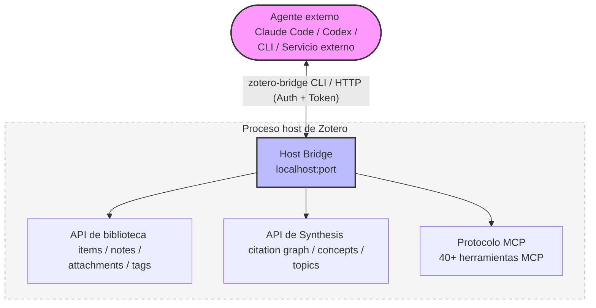
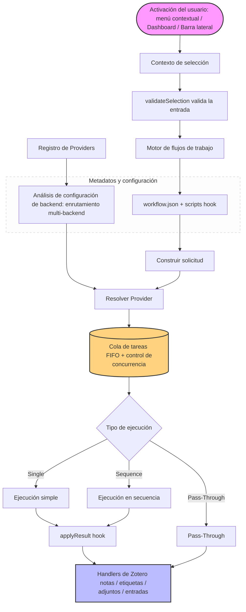

<!-- hero banner -->
<p align="center">
  
</p>

<p align="center">
  
</p>

<h1 align="center">Zotero Agents</h1>

<p align="center">
  <a href="https://github.com/leike0813/zotero-agents/releases"></a>
  
  <a href="https://github.com/leike0813/zotero-agents/blob/main/LICENSE"></a>
  
</p>

<p align="center">
  <a href="README.md">English</a> ·
  <a href="README-zhCN.md">简体中文</a> ·
  <a href="README-zhTW.md">繁體中文</a> ·
  <a href="README-jaJP.md">日本語</a> ·
  <a href="README-frFR.md">Français</a> ·
  <a href="README-de.md">Deutsch</a> ·
  <strong>Español</strong> ·
  <a href="README-ptBR.md">Português</a> ·
  <a href="README-koKR.md">한국어</a> ·
  <a href="README-itIT.md">Italiano</a> ·
  <a href="README-ruRU.md">Русский</a> ·
  <a href="https://leike0813.github.io/zotero-agents/">📖 Documentación</a> ·
  <a href="https://github.com/leike0813/zotero-agents">GitHub</a> ·
  <a href="https://gitee.com/leike0813/zotero-agents">Gitee</a>
</p>

> 💡 A partir de v0.5.0-alpha, este complemento ha pasado de llamarse **Zotero Skills** a **Zotero Agents**.

---

<p align="center">
  <strong>Su biblioteca Zotero, ahora impulsada por agentes de IA.</strong><br/>
  <sub>Transforme la búsqueda, el análisis, la gestión, la síntesis y la preparación de escritos en conocimiento de investigación auditable, trazable y reutilizable.</sub>
</p>

<p align="center">
  <a href="https://leike0813.github.io/zotero-agents/getting-started">
    
  </a>
  &nbsp;
  <a href="https://github.com/leike0813/zotero-agents/releases">
    
  </a>
</p>

---

Zotero Agents es un **banco de trabajo agéntico integral** para su biblioteca Zotero — no es un asistente de chat que responde preguntas puntuales, sino un sistema que permite a los agentes de IA trabajar directamente en su biblioteca, transformando los artículos de «PDFs que se leen y se olvidan» en una **red de conocimiento de investigación explorable, auditable y acumulativa**.

**Deje los artículos en manos del agente; usted solo toma las decisiones.** Análisis de literatura — la IA extrae automáticamente resúmenes, referencias e informes de citas, generando tres notas estructuradas en cada ejecución; búsqueda e ingreso de literatura — el agente busca en línea, filtra candidatos y los incorpora uno a uno tras su confirmación; normalización de etiquetas — organiza e infiere etiquetas automáticamente según un vocabulario controlado que usted define; lectura profunda — genera documentos HTML de lectura detallada enriquecidos con el conocimiento de su biblioteca; síntesis por temas — en torno a una línea de investigación, organiza la bibliografía fundamental, los trabajos de vanguardia, los argumentos clave y las divergencias metodológicas, produciendo informes de revisión definitivos.

Detrás de todo esto hay tres subsistemas que trabajan en conjunto: un **motor de flujos de trabajo conectable** (toda la lógica de negocio se publica e instala como paquetes independientes, sin acoplamiento en el complemento), el **Synthesis Workbench** (grafo de citas, base de conocimiento conceptual, mapa temático — que converte los análisis individuales en una capa de conocimiento a largo plazo), y el **Host Bridge** (CLI + MCP para que agentes externos lean y escriban en su biblioteca Zotero, delegando tareas de investigación a canalizaciones automatizadas que se ejecutan en segundo plano).

---

| 🔧 | 💬 | 🔬 | 🔌 |
|:--:|:--:|:--:|:--:|
| **Flujos de trabajo conectables** | **Barra lateral del asistente** | **Synthesis Workbench** | **Host Bridge** |
| Análisis de artículos, lectura profunda, normalización de etiquetas, síntesis temática — organizados en flujos extensibles | Conéctese a agentes mediante ACP para colaborar en artículos, entradas y bibliotecas | Gestione redes de citas, conceptos, etiquetas y síntesis temática; la capa de conocimiento se consolida con el tiempo | CLI + MCP para que agentes externos lean el contexto de Zotero y escriban los resultados del análisis |

---

## Navegación rápida

| Usted es…                         | Comience aquí                                                  |
| --------------------------------- | -------------------------------------------------------------- |
| 🔰 Usuario nuevo, quiere saber qué puede hacer | → [Inicio rápido en 3 pasos](#inicio-rápido-en-3-pasos)       |
| 📄 Quiere procesar artículos rápidamente (resúmenes, análisis) | → [Flujos de trabajo principales](#flujos-de-trabajo-principales) |
| 📊 Está haciendo una revisión bibliográfica y necesita conocimiento sistematizado | → [Banco de trabajo de síntesis](#banco-de-trabajo-de-síntesis) |
| 💬 Quiere dialogar con la IA sobre la literatura | → [Paneles de interacción con IA](#paneles-de-interacción-con-ia) |
| 💰 Le preocupan los costes de IA y la elección del motor | → [Motores de IA y costes](#motores-de-ia-y-costes) |
| 🔌 Quiere integración externa para que los agentes lean su biblioteca | → [Host Bridge y servidor MCP](#host-bridge--servidor-mcp) |
| 🛠 Es desarrollador y quiere ampliar o contribuir | → [Resumen de arquitectura](#resumen-de-arquitectura) · [Documentación para desarrolladores](#documentación-para-desarrolladores) |
| 📚 Necesita el manual de uso completo | → [Sitio de documentación](https://leike0813.github.io/zotero-agents/) |

---

## Instalación y configuración

### Requisitos del sistema

- [Zotero 9](https://www.zotero.org/download/) o [Zotero 7](https://www.zotero.org/download/) (versión ≥ 6.999)
- Si utiliza el backend ACP: debe tener instalada localmente la herramienta CLI del agente correspondiente (también vale la uso de `npx` para instalación automática)
- Si utiliza el backend Skill-Runner: debe tener desplegada una instancia de [Skill-Runner](https://github.com/leike0813/Skill-Runner)

> **Sobre la versión de Zotero**: Este complemento se desarrolla y prueba en Zotero 9. Zotero 8 debería ser totalmente compatible (el marco de complementos de Zotero 8/9 no ha cambiado significativamente); Zotero 7 también debería funcionar en teoría, pero no se ha probado a fondo por limitaciones de capacidad, y el mantenimiento futuro se centrará en Zotero 9. Si encuentra problemas en Zotero 7, infórmelos en [Issues](https://github.com/leike0813/zotero-agents/issues).

### Tipos de backend

| Tipo de backend | Recomendación | Uso | Configuración |
|-----------------|---------------|-----|---------------|
| **ACP** | 🥇 Preferido | Conexión directa a CLI de agentes (Codex, OpenCode, Claude Code, Gemini CLI, Qwen Code), sin configuración adicional | Añadir desde presets en el Backend Manager |
| **Skill-Runner (Docker)** | 🥈 Recomendado | Servicio persistente, independiente del ciclo de Zotero, compatible con uso en red local | Docker compose up, luego introducir la URL en el Backend Manager |
| **Skill-Runner (despliegue con un clic)** | 🥉 Emergencia | Se inicia y detiene con el complemento; al cerrar Zotero se cancelan todas las tareas | Despliegue con un clic en Preferencias |

> Además, el complemento incluye dos tipos de backend adicionales: **Generic HTTP** (para llamar a cualquier API HTTP, como servicios MinerU) y **Pass-Through** (para operaciones puramente locales, como exportar e importar notas), que se utilizan automáticamente en flujos de trabajo específicos y no requieren atención adicional.

---

## Inicio rápido en 3 pasos

### 1️⃣ Instalar el complemento

Descargue el archivo `.xpi` desde [Releases](https://github.com/leike0813/zotero-agents/releases) → Zotero `Herramientas` → `Complementos` → ⚙️ → `Instalar complemento desde archivo…` → Reinicie Zotero.

### 2️⃣ Configurar el backend de IA

> 🥇 **ACP es la opción preferida** — Si dispone de herramientas de agente compatibles con ACP como Codex / OpenCode / Claude Code instaladas localmente, puede usarlas directamente sin configuración.

**Opción A — Conexión directa a agente ACP (recomendada)**

`Herramientas` → `Backend Manager` → Pestaña ACP → Seleccione su herramienta de agente desde **Add from Preset** → Guardar. No es necesario introducir ningún parámetro.

**Opción B — Despliegue de Skill-Runner con Docker (para uso persistente en segundo plano)**

[Despliegue Skill-Runner con Docker](https://leike0813.github.io/zotero-agents/backends/skill-runner#推荐docker-常驻部署) en su equipo y, a continuación, añada la instancia de SkillRunner en el Backend Manager e introduzca la URL base.

> Nota: El despliegue local con un clic solo es adecuado para usuarios que no saben instalar agentes ni Docker. Al cerrar Zotero se cancelan todas las tareas.

### 3️⃣ Ejecutar con clic derecho

En la lista de literatura de Zotero, haga **clic derecho sobre un artículo** y seleccione `Zotero Agents` → `Análisis de literatura`. En unos minutos, verá en el panel de notas el resumen generado por IA, la lista de referencias y el análisis de citas.

> Para instrucciones detalladas de configuración y uso, consulte el [sitio de documentación](https://leike0813.github.io/zotero-agents/).

---

## Flujos de trabajo principales

Funciones de uso diario, accesibles con clic derecho sobre un artículo.

| Función | Descripción | Activación |
|---------|-------------|------------|
| 📊 **Análisis de literatura** | La IA genera automáticamente el resumen del artículo, extrae las referencias y produce un informe de análisis de citas. Puede ejecutar en cascada la normalización de etiquetas | Clic derecho en el artículo → `Análisis de literatura` |
| 💬 **Interpretación interactiva de literatura** | Diálogo en varias rondas para comprender a fondo el artículo. Las respuestas de la IA pasan por una verificación; las respuestas dudosas se señalan explícitamente, sin preocuparse por las alucinaciones. El registro de la conversación puede convertirse en notas de estudio | Clic derecho en el artículo → `Interpretación de literatura` |
| 📖 **Lectura profunda** | Genera una vista de lectura estructurada, con soporte para traducción por segmentos y explicación de conceptos | Clic derecho en el artículo → `Lectura profunda` |
| 🌱 **Inicialización del vocabulario de etiquetas** | Cree interactivamente con la IA un vocabulario controlado de etiquetas para su campo de investigación. Se recomienda inicializar antes de empezar el análisis de literatura | Dashboard → `Tag Bootstrapper` |
| 🏷️ **Normalización de etiquetas** | Organiza automáticamente las etiquetas según un vocabulario controlado; la IA infiere etiquetas nuevas y las envía a revisión | Clic derecho en la entrada → `Normalización de etiquetas` |
| 🔎 **Búsqueda e ingreso de literatura** | Permita que el agente le ayude a ampliar rápidamente su biblioteca: buscar, filtrar e incorporar directamente tras la confirmación | Dashboard → `Búsqueda e ingreso de literatura` |
| 📋 **Análisis de PDF** | Convierte PDF a Markdown (llamando al servicio MinerU) | Clic derecho en el PDF → `MinerU` |
| 📤 **Exportación/importación de notas** | Exporte en lotes resúmenes y notas como Markdown, o importe notas externas | Clic derecho en las entradas seleccionadas → Exportar/Importar |

> **💡 Sobre las notas resultantes**: Los productos del análisis de literatura (resumen, referencias, análisis de citas) se añaden como adjuntos de nota a la entrada principal. El contenido que se muestra en las notas se **renderiza** a partir de los datos del backend; modificar directamente el contenido de la nota no altera los datos del backend. Para editar, utilice «Exportar notas» para exportar → modificar → y luego «Importar notas» para volver a importar.

<p align="center">
<table>
<tr>
<td width="33%" align="center"><br/><sub>Digest — Resumen del artículo</sub></td>
<td width="33%" align="center"><br/><sub>References — Referencias</sub></td>
<td width="33%" align="center"><br/><sub>Citation Analysis — Análisis de citas</sub></td>
</tr>
</table>
</p>

---

## Flujos de trabajo recomendados

Desde cero hasta la redacción de una revisión bibliográfica, se recomienda avanzar en el siguiente orden:

### 📋 Paso 1: Crear un vocabulario de etiquetas

Antes de comenzar el análisis de literatura, se recomienda utilizar primero el **Tag Bootstrapper** para inicializar un vocabulario controlado de etiquetas para su campo de investigación. Así, los análisis posteriores podrán organizar automáticamente las etiquetas de cada artículo.

```
Dashboard → Tag Bootstrapper → Defina interactivamente con la IA su sistema de etiquetas para el campo de investigación
```

### 📥 Paso 2: Ingreso y análisis

**El Análisis de literatura es el núcleo de la gestión agéntica de literatura** — Debería ejecutarse para toda la literatura incorporada.

```
Obtener el PDF del artículo
  → Clic derecho en el PDF → MinerU (convierte a Markdown, mejor resultado)
  → Clic derecho en el artículo → Análisis de literatura
     └── La IA genera automáticamente resumen + referencias + análisis de citas
     └── También ejecuta la normalización de etiquetas (activada por defecto, se recomienda mantener)
```

> **💡 Ampliar la biblioteca de literatura**: ¿Necesita incorporar rápidamente una gran cantidad de literatura relacionada? Use **Búsqueda e ingreso de literatura** para que el agente busque, filtre e incorpore en lote por usted.

### 🔗 Paso 3: Deduplicación de citas y grafo

Cuando la biblioteca tenga un tamaño considerable y todos los artículos hayan pasado por el Análisis:

```
Abrir Synthesis Workbench → Página Index
  → Ejecutar Advance Matching (algoritmo avanzado de coincidencia para deduplicar citas)
  → Ir a la página Review para gestionar las aprobaciones (las coincidencias inciertas requieren confirmación manual)
  → ⚠️ ¡No olvide «Aplicar» las decisiones pendientes!
  → Abrir la página Graph → Verá un grafo de citas completo y preciso ✨
```

> Las relaciones de grafo precisas ayudan a calcular la importancia de cada artículo (PageRank, puntuación frontier, etc.), lo que afecta directamente a la calidad de la síntesis temática posterior.

### 📊 Paso 4: Crear síntesis temática

Cuando considere que tiene literatura suficiente y todo ha pasado por Análisis y Advance Matching:

```
Dashboard → Create Topic Synthesis → Introduzca la semilla del tema
  → El agente ejecuta automáticamente la canalización de 3 pasos (preparación → mejora central → versión final)
  → Abrir Synthesis Workbench → Página Topics
  → Explore la guía temática profesional, detallada y elegante ✨
```

<p align="center">
  
</p>

### ✍️ Paso 5: Generar revisión bibliográfica

Cuando tenga una idea de investigación y desee conocer y resumir los avances del campo:

```
Recopilar e incorporar literatura → Ejecutar análisis de literatura → Crear algunos temas
  → Dashboard → Manuscript Literature Framing
  → Dialogar con el agente para definir el enfoque y el estilo de redacción
  → Generar borradores LaTeX de Introduction + Related Work
  → Descargar los productos desde el área de productos del Dashboard
  → Incorporar directamente al documento LaTeX o exportar para procesamiento adicional
```

### 💡 Más escenarios

<details>
<summary><b>¿Tiene preguntas sobre un artículo? Interpretación interactiva de literatura</b></summary>

Clic derecho en el artículo → `Interpretación de literatura` → Dialogue con la IA en el Dashboard. No se preocupe por las alucinaciones — las respuestas de la IA deben pasar por una **verificación**; las respuestas dudosas se señalan explícitamente. Al finalizar la conversación, puede generar notas de estudio a partir del registro de preguntas y respuestas, guardadas como adjunto de nota.

</details>

<details>
<summary><b>Diálogo libre con la IA usando la literatura como contexto</b></summary>

Seleccione un artículo → Abra ACP Chat en la barra lateral → Seleccione el backend → Dialogue libremente sobre el contenido del artículo. El Host Bridge proporciona automáticamente el contexto de la literatura, con soporte para cambiar de modelo y de modo.

</details>

<details>
<summary><b>Rastreo de citas y análisis del grafo</b></summary>

Abra Synthesis Workbench → Página Graph → Busque artículos clave → Cambie al diseño Radial para desplegar el grafo centrado en ese artículo → Examine las relaciones de citación, PageRank y las métricas de puntuación frontier.

</details>

<details>
<summary><b>Normas de etiquetado del equipo</b></summary>

El Tag Bootstrapper inicializa el vocabulario → Seleccione un grupo de artículos → Normalización de etiquetas → Las etiquetas sugeridas por la IA se añaden al vocabulario tras la revisión en modo Staged → El vocabulario se sincroniza con los miembros del equipo vía WebDAV.

</details>

---

## Banco de trabajo de síntesis

Transforme artículos dispersos en una **red de conocimiento explorable**. Esta es la diferencia fundamental entre este complemento y otras herramientas de IA para Zotero.

> Los flujos de trabajo principales le ayudan a **leer** artículos; el banco de trabajo de síntesis le ayuda a **organizar** el conocimiento.

El banco de trabajo es una pestaña de espacio de trabajo completa en Zotero, que contiene 8 superficies:

| Superficie | Función |
|------------|---------|
| **Home** | Panel de resumen de la biblioteca: tarjetas de información, panel de estado de sincronización, resumen de elementos a revisar, acceso rápido a temas populares |
| **Topics** | Gestión de temas (crear/actualizar/explorar), con tres vistas: grafo, cuadrícula y lista |
| **Index** | Índice de referencias canónicas: registro de artículos + vinculación de citas + fusión/deduplicación/redirección |
| **Review** | Centro de revisión: aprobación de coincidencias de citas, aprobación de conceptos, aprobación de relaciones temáticas (aceptar/rechazar/operaciones en lote) |
| **Graph** | Visualización del grafo de citas (diseños force-directed/radial/componentes), con filtrado por tema y análisis de métricas |
| **Tags** | Gestión de vocabularios controlados de etiquetas + aprobación de sugerencias de etiquetas de la IA (Promote/Discard) |
| **Concepts** | Base de conocimiento conceptual: estructura de cuatro niveles (concepto/sentido/alias/relaciones), aplicable sobre mapas temáticos y el lector |
| **Reader** | Lector profundo de temas: Overview / Taxonomy / Claims / Compare / Future Directions / Coverage / References / Report |

El banco de trabajo incluye **sincronización WebDAV**, que permite sincronizar datos estructurados como vocabularios de etiquetas, síntesis temáticas y bases de conocimiento conceptuales mediante el protocolo WebDAV, para una sincronización y copia de seguridad ligera entre dispositivos.

<table>
<tr>
<td width="50%"></td>
<td width="50%"></td>
</tr>
</table>

---

## Paneles de interacción con IA

La v0.5.0 incorpora una barra lateral completa de interacción con IA, con tres modos de interacción:

<table>
<tr>
<td width="33%" align="center"><br/><sub>💬 ACP Chat — Diálogo continuo con la biblioteca como contexto</sub></td>
<td width="33%" align="center"><br/><sub>⚙️ ACP Skills — Conexión a agentes locales mediante el protocolo ACP para ejecutar flujos de trabajo</sub></td>
<td width="33%" align="center"><br/><sub>🔧 SkillRunner — Comunicación con el backend del servicio Skill-Runner alojado</sub></td>
</tr>
</table>

---

## Host Bridge & Servidor MCP

Al iniciar Zotero, el complemento ejecuta automáticamente un servicio Host Bridge local. Las herramientas externas de IA (Codex, OpenCode, etc.) pueden **acceder directamente a su biblioteca Zotero** — leer artículos, buscar entradas, gestionar etiquetas e incluso ejecutar flujos de trabajo.

| Capacidad | Descripción |
|-----------|-------------|
| 🔌 **Acceso a la biblioteca** | Los agentes externos leen directamente entradas, notas, adjuntos, etiquetas y colecciones de Zotero |
| ⚡ **Ejecución de flujos de trabajo** | Ejecute flujos de trabajo de IA de forma remota a través de la API del Bridge |
| 📊 **Consultas de Synthesis** | Consulte el grafo de citas, temas, base de conocimiento conceptual e índice de referencias |
| 🖥 **Herramientas MCP** | Servidor MCP integrado que proporciona herramientas estructuradas de operaciones Zotero para agentes ACP |
| 🔒 **Seguridad** | Autenticación por token + aprobación de operaciones de escritura; los datos no salen del equipo local |



La CLI del Host Bridge (`zotero-bridge`) ofrece más de 20 subcomandos, compatibles con Windows / macOS / Linux (incluido ARM).

---

## Motor de flujos de trabajo conectable

El complemento en sí no contiene lógica de negocio concreta — toda la capacidad de IA se incorpora mediante **paquetes de flujos de trabajo externos**.

- 📦 **Conectar y usar**: Coloque el paquete de flujo de trabajo en el directorio y estará disponible de inmediato, sin necesidad de recompilar
- 📝 **Declarativo**: Describa «qué hacer» mediante el manifiesto `workflow.json` + unos pocos scripts hook
- 🔗 **Orquestación Sequence**: Encadene varios Skills en secuencia, con soporte para handoff, aislamiento del espacio de trabajo y terminación anticipada
- 🌐 **Enrutamiento multi-backend**: El mismo flujo de trabajo puede ejecutarse en distintos backends como Skill-Runner, ACP, HTTP
- 🌍 **Multiidioma**: Los flujos de trabajo incluyen soporte i18n; los textos de la interfaz cambian automáticamente según el idioma de Zotero
- ✅ **Validación declarativa de entradas**: `validateSelection` — Restrinja las condiciones de entrada sin escribir JS

> La guía completa para desarrollar flujos de trabajo personalizados está disponible en el [sitio de documentación](https://leike0813.github.io/zotero-agents/workflows/custom/).

---

## Lector de Markdown integrado

El complemento incluye un lector ligero de Markdown. Haga **doble clic en cualquier adjunto `.md`** en Zotero para abrirlo en el lector integrado, sin necesidad de cambiar a una aplicación externa.

| Función | Descripción |
|---------|-------------|
| 📑 **Navegación por esquema** | Analiza automáticamente la jerarquía de encabezados (h1-h4) y muestra un esquema navegable en la barra lateral |
| 🔍 **Búsqueda** | Búsqueda por palabras clave en todo el texto, con resaltado de coincidencias |
| 📐 **Fórmulas matemáticas** | KaTeX renderiza fórmulas LaTeX, con soporte para fórmulas en línea y en bloque |
| 💻 **Resaltado de código** | Resaltado de sintaxis con highlight.js, compatible con los principales lenguajes de programación |
| 🔤 **Ajuste de tamaño de fuente** | Ajustable de 12px a 24px, adecuado para diferentes pantallas y hábitos de lectura |
| 📏 **Cambio de ancho** | Admite dos anchos de lectura: columna estrecha (860px) y columna ancha (1160px) |
| 📋 **Copiar** | Permite copiar el texto Markdown original al portapapeles, así como copiar la ruta del archivo |
| 📂 **Abrir con el sistema** | Abra el archivo con un clic usando la aplicación predeterminada del sistema |
| 🌗 **Tema automático** | Se adapta al tema claro/oscuro de Zotero, sin necesidad de cambio manual |

El lector se renderiza con `markdown-it` y cuenta con un saneador de HTML integrado para garantizar una visualización segura. Puede desactivar esta función en las preferencias y volver al modo de apertura predeterminado del sistema.

<p align="center">
  
</p>

---

## Principales cambios en la v0.5.0

> De v0.4.0 a v0.5.0 se han realizado **42 commits**, marcando una evolución completa de «frontal de Skill-Runner» a «marco de ejecución de agentes universal».

<table>
<tr>
<td width="50%">

### ✨ Novedades

- **Backend ACP** — Conexión directa a CLI de agentes como Codex, OpenCode, Claude Code, Gemini CLI, Qwen Code
- **Panel ACP Chat** — Diálogo continuo con la literatura como contexto, con soporte para cambiar de modelo y de modo, y visualización del uso de tokens
- **Panel ACP Skill Runs** — Supervise la ejecución completa de habilidades, con transcripción, aprobación de permisos y vista previa de resultados
- **Synthesis Workbench** — Banco de trabajo de síntesis completo con 8 superficies
- **Grafo de citas** — Diseños force-directed/radial/componentes, con filtrado por tema y cálculo de métricas
- **Base de conocimiento conceptual** — Estructura de cuatro niveles (concepto/sentido/alias/relaciones), aplicable sobre mapas temáticos
- **Lectura profunda** — Vista de lectura estructurada con cobertura conceptual y contexto de citas
- **Host Bridge + Servidor MCP** — Convierta Zotero en un servicio programable
- **Lector de Markdown integrado** — Abra adjuntos `.md` con doble clic en el lector integrado, con soporte para navegación por esquema, búsqueda, fórmulas matemáticas y resaltado de código
- **Ejecución Sequence** — Encadene varios Skills en secuencia con soporte para pasar resultados intermedios
- **Diálogo Backend Manager** — Gestione de forma unificada toda la configuración de backends
- **Sincronización WebDAV** — Sincronización ligera de datos de Synthesis entre dispositivos

</td>
<td width="50%">

### ♻️ Mejoras

- **Rediseño completo del Dashboard** — Nuevas vistas de backend, explorador de productos, Skill Feedback y exportación de diagnósticos de registro
- **Validación declarativa de selección** — `validateSelection` sustituye al imperativo `filterInputs`; defina restricciones de entrada sin JS
- **Gestión de conexiones de SkillRunner** — Optimización de la densidad de conexiones, visualización del estado previo a la solicitud y mejora de la recuperación ante fallos
- **Interfaz multiidioma** — El Synthesis Workbench y el sistema de flujos de trabajo admiten chino/inglés/francés/japonés
- **CLI multiplataforma** — Nuevas compilaciones precompiladas de Host Bridge CLI para Linux ARM/ARM64/x86
- **Gestión de datos de ejecución** — Consulte el uso de almacenamiento y limpie datos de caché en las preferencias
- **Skill Run Feedback** — Recopite automáticamente informes de retroalimentación de IA tras ejecuciones exitosas

</td>
</tr>
</table>

---

## Flujos de trabajo oficiales

<details>
<summary>Desplegar la lista completa de flujos de trabajo</summary>

### Procesamiento de literatura

| Flujo de trabajo | Backend | Descripción |
|------------------|---------|-------------|
| **Análisis de literatura** ⭐ | `skillrunner` | Genera notas de resumen + referencias + análisis de citas. Puede ejecutar en cascada la normalización de etiquetas (activada por defecto) |
| **Interpretación de literatura** | `skillrunner` | Comprensión de literatura mediante diálogo en varias rondas, con verificación anti-alucinaciones. El registro puede guardarse como notas de estudio |
| **Lectura profunda** | `acp` | Vista de lectura estructurada (HTML), con cobertura conceptual y contexto de citas |
| **Búsqueda e ingreso de literatura** | `acp` | Permita que el agente busque y filtre la literatura por usted, incorporándola directamente tras la confirmación |
| **MinerU** | `generic-http` | Conversión de PDF a Markdown (llamando al servicio MinerU) |

### Síntesis y organización

| Flujo de trabajo | Backend | Descripción |
|------------------|---------|-------------|
| **Síntesis temática** | `acp` | Sequence de 3 pasos: preparación → mejora central → versión final. El agente lo procesa todo automáticamente |
| **Marco literario del manuscrito** | `acp` | Genere de forma interactiva borradores LaTeX de Introduction + Related Work |
| **Inicialización del vocabulario de etiquetas** | `skillrunner` | Cree interactivamente con la IA un vocabulario controlado de etiquetas para su campo de investigación. Se recomienda ejecutar primero |
| **Normalización de etiquetas** | `skillrunner` | Inferencia de etiquetas mediante LLM + organización según vocabulario controlado |

### Herramientas

| Flujo de trabajo | Backend | Descripción |
|------------------|---------|-------------|
| **Exportación de notas** | `pass-through` | Exporte en lotes resúmenes y notas como Markdown (modifíquelas y vuelva a importarlas) |
| **Importación de notas** | `pass-through` | Importe Markdown externo como notas de Zotero |
| **Debug Probe** | Varios | 13 sondas de depuración para verificar la ejecución de secuencias, el contrato de apply, la conectividad del Host Bridge, etc. |

</details>

---

## Motores de IA y costes

Este complemento no está vinculado a ningún proveedor de IA. Usted utiliza su propia suscripción, Coding Plan o clave API para conectarse directamente al backend — **sin intermediarios, sin recargo por token**.

### ¿Le preocupan los costes de tokens?

Buenas noticias: todas las habilidades de este proyecto se han diseñado cuidadosamente para que **incluso modelos más modestos (¡incluso modelos desplegados localmente!) logren resultados de ejecución sorprendentes**. No necesita el modelo más caro para obtener resultados excelentes.

### Referencia de costes

| Opción | Coste | Descripción |
|--------|-------|-------------|
| **DeepSeek V4 Flash** | Aprox. ￥2/artículo | Pago por uso. Cada análisis de literatura cuesta menos de ￥2 |
| **Coding Plan** | Precio fijo mensual | Si consigue un Coding Plan por uso (Bailian, Zhipu, etc.), podrá procesar literatura de forma económica y en lote — lo hacemos a través de Coding Agent, **totalmente conforme** |
| **[OpenCode Go](https://opencode.ai/go?ref=SZDFT9GZKW)** | \$10/mes (primer mes \$5) | Cuota de DeepSeek V4 Flash prácticamente ilimitada. Suscríbase a través de [este enlace](https://opencode.ai/go?ref=SZDFT9GZKW) y tanto usted como el autor recibirán \$5 de descuento |
| **Versión gratuita de Codex** | Gratuita | Modelo limitado, pero sigue produciendo muy buenos resultados |

### Comparación de motores

| Motor | Escenario adecuado | Coste | Recomendación |
|-------|-------------------|-------|---------------|
| **Codex** | Mejor equilibrio general, velocidad y calidad. Admite visualización del flujo de pensamiento | Disponible en versión gratuita (modelo limitado) | ⭐⭐⭐ Preferido |
| **Opencode** | Con Coding Plan o [OpenCode Go](https://opencode.ai/go?ref=SZDFT9GZKW), modelos como Qwen3.5-Plus / Kimi-K2.5 / GLM-5 ofrecen un excelente rendimiento en tareas de literatura | Bajo coste | ⭐⭐⭐ Muy recomendado |
| **Qwen Code** | Para usuarios del ecosistema Alibaba, con Coding Plan de Bailian | Las cuotas gratuitas se han agotado; depende del Plan | ⭐⭐ Opcional |
| **Gemini CLI** | Tareas sencillas | Disponible en versión gratuita | ⭐ Normal |
| **Claude Code** | Alta calidad de ejecución de instrucciones, pero menor eficiencia | De pago | Según necesidad |

> Las guías detalladas de despliegue de cada motor están disponibles en el [sitio de documentación](https://leike0813.github.io/zotero-agents/backends/skill-runner#引擎系统).

---

## Resumen de arquitectura

<details>
<summary>Desplegar el diagrama de arquitectura</summary>



Concepto de diseño central: el complemento es una **cáscara de ejecución** que no contiene lógica de negocio concreta. El manifiesto declarativo `workflow.json` y los scripts hook definen «qué hacer»; el complemento se encarga de «cómo ejecutarlo».

</details>

Para más detalles de arquitectura, consulte el [sitio de documentación: Flujos de trabajo personalizados](https://leike0813.github.io/zotero-agents/workflows/custom/).

---

## Nota sobre la versión de transición

> **v0.5.0-alpha es el primer hito importante tras el cambio de nombre a «Zotero Agents».** En comparación con v0.4.0 (frontal puro de Skill-Runner), v0.5.0 completa la transformación hacia un marco de ejecución de agentes universal — se añaden capacidades fundamentales como el backend ACP, el Synthesis Workbench, el grafo de citas, la base de conocimiento conceptual, el Host Bridge y el servidor MCP, y ya puede utilizarse de forma estable en la investigación cotidiana.

### ⚠️ Limitaciones conocidas

| Limitación | Descripción | Plan |
|------------|-------------|------|
| **Los recalculos de Synthesis bloquean la interfaz** | Operaciones como actualizar el índice, reconstruir el grafo de citas o ejecutar Advance Matching requieren gran capacidad de cálculo y, bajo la arquitectura de proceso host único de Zotero, pueden causar bloqueos breves de la interfaz. Tenga paciencia durante la ejecución | Se prevé resolver en futuras refactorizaciones |
| **La sincronización WebDAV no se ha probado completamente** | La función de sincronización automática no se ha probado a fondo; si la utiliza, procure usar solo sincronización manual | Se mejorará en versiones posteriores |
| **Rendimiento con bibliotecas grandes** | No se han realizado pruebas de rendimiento exhaustivas en bibliotecas de gran tamaño | Se abordará en futuras actualizaciones |

### Planes futuros

- Mejorar el soporte multiidioma y la guía del usuario
- Mejorar la coherencia de la experiencia entre backends
- Optimizar la capacidad de respuesta de la interfaz durante los recalculos de Synthesis
- Continuar mejorando la estabilidad y el rendimiento

> Si encuentra problemas, infórmelos en [Issues](https://github.com/leike0813/zotero-agents/issues).

---

## Documentación para desarrolladores

<details>
<summary>Desplegar la guía de desarrollo</summary>

### Desarrollo local

```bash
npm install          # Instalar dependencias
npm start            # Iniciar servidor de desarrollo
npm test             # Ejecutar pruebas lite
npm run test:full    # Ejecutar pruebas completas
npm run build        # Compilación para producción
```

### Índice de documentación

| Documento | Descripción |
|-----------|-------------|
| [Flujo de arquitectura](doc/architecture-flow.md) | Resumen de la canalización de ejecución (con diagrama de flujo Mermaid) |
| [Guía de desarrollo](doc/dev_guide.md) | Componentes principales, modelo de configuración, cadena de ejecución |
| [Componentes de flujos de trabajo](doc/components/workflows.md) | Esquema del manifiesto, hooks, filtrado de entrada, semántica de ejecución |
| [Componentes de Provider](doc/components/providers.md) | Sistema de contrato de Provider, tipos de solicitud |
| [Estrategia de pruebas](doc/testing-framework.md) | Entornos de ejecución duales, modos lite/full, barreras de CI |
| [Capa Synthesis](doc/synthesis-layer/README.md) | Diseño interno del grafo de conocimiento, grafo de citas y base de conocimiento conceptual |

</details>

---

## Documentación de usuario

El manual de uso completo está disponible en el sitio de documentación: [https://leike0813.github.io/zotero-agents/](https://leike0813.github.io/zotero-agents/)

Cubre: instalación, configuración de backends, Backend Manager, ejecución de flujos de trabajo, Dashboard, barra lateral (ACP Chat / ACP Skills / SkillRunner), Synthesis Workbench, sincronización WebDAV, preferencias, desarrollo de flujos de trabajo personalizados y todas las funciones.

---

## Licencia

[AGPL-3.0-or-later](LICENSE)

## Reconocimientos

- Construido sobre [Zotero Plugin Template](https://github.com/windingwind/zotero-plugin-template)
- Utiliza [zotero-plugin-toolkit](https://github.com/windingwind/zotero-plugin-toolkit)
- Con el apoyo del ecosistema de complementos de [@windingwind](https://github.com/windingwind)
