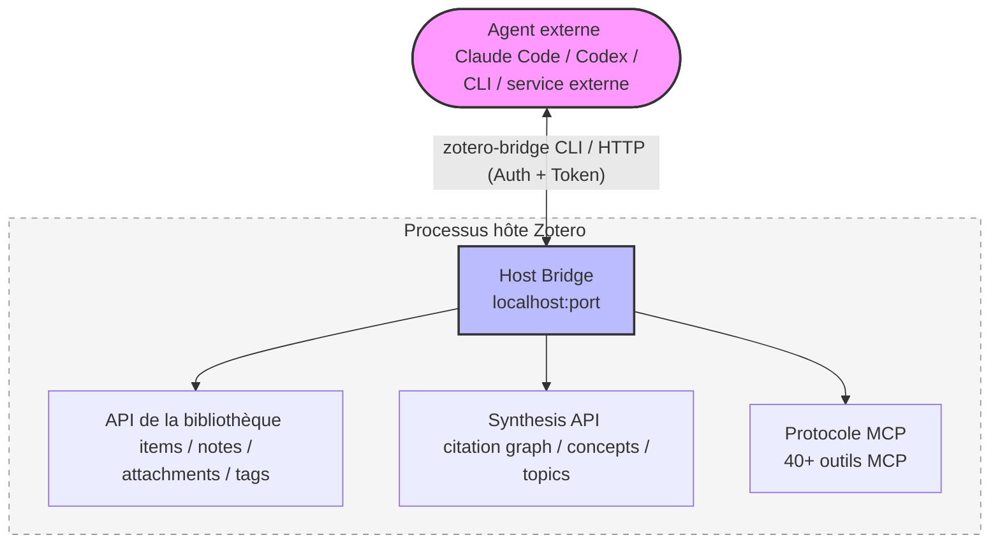
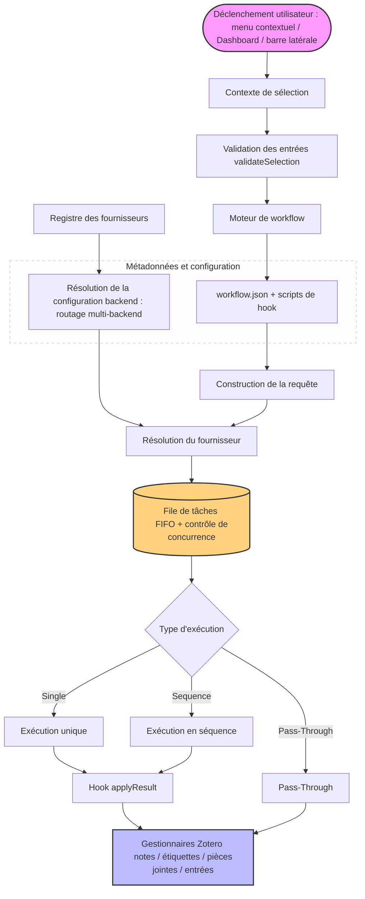

<!-- hero banner -->
<p align="center">
  
</p>

<p align="center">
  
</p>

<h1 align="center">Zotero Agents</h1>

<p align="center">
  <a href="https://github.com/leike0813/zotero-agents/releases"></a>
  
  <a href="https://github.com/leike0813/zotero-agents/blob/main/LICENSE"></a>
  
</p>

<p align="center">
  <a href="README.md">English</a> · <a href="README-zhCN.md">简体中文</a> · <a href="README-zhTW.md">繁體中文</a> · <a href="README-jaJP.md">日本語</a> · <strong>Français</strong> · <a href="README-de.md">Deutsch</a> · <a href="README-esES.md">Español</a> · <a href="README-ptBR.md">Português</a> · <a href="README-koKR.md">한국어</a> · <a href="README-itIT.md">Italiano</a> · <a href="README-ruRU.md">Русский</a> · <a href="https://leike0813.github.io/zotero-agents/">📖 Documentation</a> · <a href="https://github.com/leike0813/zotero-agents">GitHub</a> · <a href="https://gitee.com/leike0813/zotero-agents">Gitee</a>
</p>

> **Historique du dépôt :** Zotero Agents s'appelait auparavant **Zotero Skills**. L'ancien dépôt est conservé à l'adresse https://github.com/leike0813/Zotero-Skills pour les versions historiques et les traces de migration.

---

<p align="center">
  <strong>Votre bibliothèque Zotero, désormais pilotée par des agents IA.</strong><br/>
  <sub>Transformez la recherche, l'analyse, la gestion, la synthèse et la préparation à la rédaction en connaissances de recherche vérifiables, traçables et réutilisables.</sub>
</p>

<p align="center">
  <a href="https://leike0813.github.io/zotero-agents/getting-started">
    
  </a>
  &nbsp;
  <a href="https://github.com/leike0813/zotero-agents/releases">
    
  </a>
</p>

---

Zotero Agents est la **plateforme de travail agentique tout-en-un** pour votre bibliothèque Zotero — bien plus qu'un assistant conversationnel qui répond à vos questions, il laisse les agents IA travailler directement dans votre bibliothèque, transformant les articles de « PDF oubliés après lecture » en un **réseau de connaissances de recherche explorable, vérifiable et cumulable**.

**Confiez la littérature aux agents, vous n'avez plus qu'à prendre les décisions.** Analyse de la littérature — l'IA génère automatiquement des résumés, extrait les références et les avis de citation, produisant trois notes structurées en une seule exécution ; Recherche et intégration — l'agent effectue des recherches en ligne, filtre les candidats et les intègre une par une après votre validation ; Normalisation des étiquettes — organise et infère automatiquement les étiquettes selon le vocabulaire contrôlé que vous avez défini ; Lecture approfondie — génère un document HTML de lecture détaillée enrichi par les connaissances de votre bibliothèque ; Synthèse thématique — autour d'un axe de recherche, organise la littérature fondamentale, les travaux de pointe, les arguments clés et les divergences méthodologiques pour produire un rapport de synthèse réutilisable.

Trois sous-systèmes coordonnés opèrent en arrière-plan : un **moteur de workflow enfichable** (toute la logique métier est publiée et installée sous forme de paquets indépendants, le plugin lui-même reste entièrement découplé), le **Synthesis Workbench** (graph de citations, base de connaissances conceptuelles, carte thématique — il agrège les analyses ponctuelles en une couche de connaissance durable), et le **Host Bridge** (CLI + MCP permettant à des agents externes de lire et écrire dans votre bibliothèque Zotero, et de déléguer des tâches de recherche à des pipelines automatisés tournant en arrière-plan).

---

| 🔧 | 💬 | 🔬 | 🔌 |
|:--:|:--:|:--:|:--:|
| **Workflow enfichable** | **Barre latérale d'assistance** | **Synthesis Workbench** | **Host Bridge** |
| Analyse de documents, lecture approfondie, normalisation des étiquettes, synthèse thématique — organisés en flux extensibles | Connectez-vous à un agent via ACP pour dialoguer autour des documents, des entrées et de la bibliothèque | Gérez le réseau de citations, les concepts, les étiquettes et la synthèse thématique ; la couche de connaissance se consolide continuellement | Le CLI + MCP permet à des agents externes de lire le contexte Zotero et d'écrire les résultats d'analyse |

---

## Navigation rapide

| Vous êtes…                           | Commencez ici                                                     |
| ------------------------------- | ------------------------------------------------------------- |
| 🔰 Nouvel utilisateur, souhaitez découvrir les fonctionnalités       | → [Démarrage rapide en 3 étapes](#démarrage-rapide-en-3-étapes)                                  |
| 📄 Traiter rapidement des articles (résumés, explications) | → [Workflows essentiels](#workflows-essentiels)                                      |
| 📊 Réaliser une revue de littérature et avoir besoin de connaissances systématiques | → [Plateforme de synthèse de la littérature](#plateforme-de-synthèse-de-la-littérature)                              |
| 💬 Dialoguer avec l'IA autour de la littérature         | → [Panneau d'interaction IA](#panneau-dinteraction-ia)                                  |
| 💰 Vous souciez du coût de l'IA et du choix du moteur       | → [Moteurs IA et coûts](#moteurs-ia-et-coûts)                               |
| 🔌 Intégration externe, laisser l'agent lire votre bibliothèque  | → [Host Bridge et MCP](#host-bridge--mcp-server)               |
| 🛠 Développeur, souhaitez étendre ou contribuer         | → [Vue d'ensemble de l'architecture](#vue-densemble-de-larchitecture) · [Documentation développeur](#documentation-développeur)              |
| 📚 Besoin du manuel complet             | → [Site de documentation](https://leike0813.github.io/zotero-agents/)     |

---

## Installation et configuration

### Configuration requise

- [Zotero 9](https://www.zotero.org/download/) ou [Zotero 7](https://www.zotero.org/download/) (version ≥ 6.999)
- Si vous utilisez le backend ACP : l'outil CLI d'agent correspondant doit être installé localement (l'installation automatique via `npx` est également prise en charge)
- Si vous utilisez le backend Skill-Runner : une instance [Skill-Runner](https://github.com/leike0813/Skill-Runner) doit être déployée

> **À propos des versions de Zotero** : ce plugin est développé et testé sur Zotero 9. Zotero 8 devrait également être entièrement pris en charge (le framework de plugin Zotero 8/9 n'a pas sensiblement changé) ; Zotero 7 est théoriquement compatible, mais faute de temps, des tests approfondis n'ont pas été réalisés, et la maintenance future se concentrera sur Zotero 9. Si vous rencontrez des problèmes sur Zotero 7, merci de les signaler sur [Issues](https://github.com/leike0813/zotero-agents/issues).

### Types de backend

| Type de backend | Recommandation | Usage | Configuration |
|---------|--------|------|---------|
| **ACP** | 🥇 Premier choix | Connexion directe à l'Agent CLI (Codex, OpenCode, Claude Code, Gemini CLI, Qwen Code), sans configuration | Ajouter depuis un préréglage dans le Backend Manager |
| **Skill-Runner (Docker)** | 🥈 Recommandé | Service persistant, indépendant de l'état de Zotero, prend en charge le partage sur le réseau local | Docker compose up, puis saisir l'URL dans le Backend Manager |
| **Skill-Runner (déploiement en un clic)** | 🥉 Dépannage | Suit le cycle de vie du plugin, la fermeture de Zotero arrête toutes les tâches | Déploiement en un clic dans les préférences |

> De plus, le plugin intègre également deux types de backend : **Generic HTTP** (appeler n'importe quelle API HTTP, comme le service MinerU) et **Pass-Through** (opérations purement locales, comme l'export/import de notes), utilisés automatiquement dans certains workflows, sans attention particulière de votre part.

---

## Démarrage rapide en 3 étapes

### 1️⃣ Installer le plugin

Téléchargez le fichier `.xpi` depuis les [Releases](https://github.com/leike0813/zotero-agents/releases) → Zotero `Outils` → `Modules complémentaires` → ⚙️ → `Installer un module complémentaire depuis le fichier…` → redémarrez Zotero.

### 2️⃣ Configurer le backend IA

> 🥇 **ACP en premier** — si vous disposez localement d'outils d'agent compatibles ACP tels que Codex / OpenCode / Claude Code, vous pouvez les utiliser directement sans configuration.

**Méthode A — Connexion directe à un agent ACP (recommandée)**

`Outils` → `Backend Manager` → onglet ACP → sélectionnez votre outil d'agent depuis **Add from Preset** → Enregistrer. Aucun paramètre à saisir.

**Méthode B — Déployer Skill-Runner avec Docker (pour un fonctionnement en arrière-plan)**

[Déployez Skill-Runner avec Docker](https://leike0813.github.io/zotero-agents/backends/skill-runner#推荐docker-常驻部署) sur votre machine, puis ajoutez l'instance SkillRunner dans le Backend Manager et renseignez l'URL de base.

> Remarque : le déploiement local en un clic est réservé aux utilisateurs qui ne peuvent pas installer d'agent ni Docker. Fermer Zotero arrête toutes les tâches.

### 3️⃣ Clic droit pour exécuter

Dans la liste des documents Zotero, faites un **clic droit sur un article**, puis sélectionnez `Zotero Agents` → `Analyse de la littérature`. En quelques minutes, vous verrez dans le panneau des notes le résumé généré par l'IA, la liste des références et l'analyse des citations.

> Pour une configuration et une utilisation détaillées, consultez le [site de documentation](https://leike0813.github.io/zotero-agents/).

---

## Workflows essentiels

Les fonctions à utiliser quotidiennement, déclenchables par un clic droit sur un article.

| Fonction | Description | Déclencheur |
|------|------|----------|
| 📊 **Analyse de la littérature** | L'IA génère automatiquement un résumé de l'article, extrait les références et produit un rapport d'analyse des citations. Peut enchaîner avec la normalisation des étiquettes | Clic droit sur l'article → `Analyse de la littérature` |
| 💬 **Explication interactive de la littérature** | Dialogue en plusieurs tours pour comprendre en profondeur un article. Les réponses de l'IA sont validées par une porte de vérification ; les réponses incertaines sont explicitement signalées, pas d'inquiétude sur les hallucinations. Le journal de conversation peut être converti en notes d'étude | Clic droit sur l'article → `Explication de la littérature` |
| 📖 **Lecture approfondie** | Génère une vue de lecture structurée, prend en charge la traduction par segments et l'analyse conceptuelle | Clic droit sur l'article → `Lecture approfondie` |
| 🌱 **Initialisation du vocabulaire d'étiquettes** | Crée de manière interactive avec l'IA un vocabulaire contrôlé d'étiquettes pour votre domaine de recherche. Il est conseillé d'initialiser avant de lancer l'analyse de la littérature | Dashboard → `Tag Bootstrapper` |
| 🏷️ **Normalisation des étiquettes** | Organise automatiquement les étiquettes selon le vocabulaire contrôlé, l'IA infère de nouvelles étiquettes et les soumet à validation | Clic droit sur l'entrée → `Normalisation des étiquettes` |
| 🔎 **Recherche et intégration de littérature** | Laissez l'agent enrichir rapidement votre bibliothèque : recherche, filtrage, intégration après validation | Dashboard → `Recherche et intégration de littérature` |
| 📋 **Analyse de PDF** | Convertit le PDF en Markdown (via le service MinerU) | Clic droit sur le PDF → `MinerU` |
| 📤 **Export/Import de notes** | Exporte en masse les résumés et notes au format Markdown, ou importe des notes externes | Clic droit sur les entrées sélectionnées → Export/Import |

> **💡 À propos des notes produites** : les résultats de l'analyse de la littérature (résumé, références, analyse des citations) sont ajoutés à l'entrée parente sous forme de pièce jointe Note. Le contenu affiché dans la note est **rendu** à partir des données en arrière-plan ; modifier directement la note ne change pas les données en arrière-plan. Pour éditer, veuillez utiliser « Exporter les notes » pour exporter → modifier → puis « Importer les notes » pour réimporter.

<p align="center">
<table>
<tr>
<td width="33%" align="center"><br/><sub>Digest — Résumé de la littérature</sub></td>
<td width="33%" align="center"><br/><sub>References — Références</sub></td>
<td width="33%" align="center"><br/><sub>Citation Analysis — Analyse des citations</sub></td>
</tr>
</table>
</p>

---

## Workflows recommandés

Pour partir de zéro et rédiger une revue de littérature, il est recommandé de suivre l'ordre ci-dessous :

### 📋 Étape 1 : Constituer un vocabulaire d'étiquettes

Avant de commencer l'analyse de la littérature, il est conseillé d'utiliser **Tag Bootstrapper** pour initialiser un vocabulaire contrôlé d'étiquettes pour votre domaine de recherche. Ainsi, l'analyse de la littérature pourra automatiquement organiser les étiquettes de chaque article.

```
Dashboard → Tag Bootstrapper → Dialogue avec l'IA pour définir votre système d'étiquettes de recherche
```

### 📥 Étape 2 : Intégration et analyse

**Literature Analysis est au cœur de la gestion agentique de la littérature** — chaque document intégré devrait être analysé une fois.

```
Obtenir le PDF de l'article
  → Clic droit sur le PDF → MinerU (conversion en Markdown, meilleure qualité)
  → Clic droit sur l'article → Analyse de la littérature
     └── L'IA génère automatiquement résumé + références + analyse des citations
     └── Exécute également la normalisation des étiquettes (activée par défaut, recommandée)
```

> **💡 Enrichir votre bibliothèque** : vous avez besoin de compléter rapidement votre bibliothèque avec un grand nombre d'articles connexes ? Utilisez **Literature Search & Ingest** pour laisser l'agent rechercher, filtrer et intégrer en masse.

### 🔗 Étape 3 : Déduplication des citations et graphes

Une fois que votre bibliothèque est d'une taille suffisante et que toutes les analyses ont été exécutées :

```
Ouvrez le Synthesis Workbench → page Index
  → Exécutez Advance Matching (algorithme de correspondance avancé pour dédupliquer les références citées)
  → Rendez-vous dans la page Review pour traiter les validations en attente (les correspondances incertaines nécessitent votre confirmation manuelle)
  → ⚠️ N'oubliez pas d'« Appliquer » les décisions en attente !
  → Ouvrez la page Graph → vous verrez un graph de citations complet et précis ✨
```

> Des relations de graphe précises aident à calculer l'importance de chaque article (PageRank, frontier score, etc.), ce qui affecte directement la qualité de la synthèse thématique ultérieure.

### 📊 Étape 4 : Créer une synthèse thématique

Lorsque vous estimez que la quantité de littérature est suffisante et que tout a été analysé et dédupliqué :

```
Dashboard → Create Topic Synthesis → saisissez le sujet
  → L'agent exécute automatiquement un pipeline en 3 étapes (préparation → renforcement central → finalisation)
  → Ouvrez le Synthesis Workbench → page Topics
  → Consultez une présentation thématique professionnelle, détaillée et soignée ✨
```

<p align="center">
  
</p>

### ✍️ Étape 5 : Générer une revue de littérature

Lorsque vous avez une idée de recherche et souhaitez comprendre et résumer l'état de l'art dans un domaine :

```
Collectez et intégrez la littérature → Exécutez l'analyse de la littérature → Créez quelques sujets
  → Dashboard → Manuscript Literature Framing
  → Dialogue avec l'agent pour déterminer le positionnement et le style d'écriture
  → Génération d'un brouillon LaTeX pour Introduction + Related Work
  → Téléchargez les productions depuis la zone de productions du Dashboard
  → Intégrez directement dans votre manuscrit LaTeX, ou exportez pour un traitement ultérieur
```

### 💡 Autres cas d'usage

<details>
<summary><b>Des questions sur un article ? Explication interactive</b></summary>

Clic droit sur l'article → `Explication de la littérature` → discutez interactivement avec l'IA dans le Dashboard. Pas d'inquiétude sur les hallucinations — les réponses de l'IA doivent passer par une **porte de vérification**, et les réponses incertaines sont explicitement signalées. À la fin de la conversation, le journal Q&R peut être converti en notes d'étude et enregistré comme pièce jointe Note.

</details>

<details>
<summary><b>Dialoguer librement avec l'IA autour de la littérature</b></summary>

Sélectionnez un article → ouvrez l'ACP Chat dans la barre latérale → choisissez le backend → dialoguez librement autour du contenu de l'article. Le Host Bridge fournit automatiquement le contexte de la littérature et prend en charge le changement de modèle et de mode.

</details>

<details>
<summary><b>Traçabilité des citations et analyse de graphe</b></summary>

Ouvrez le Synthesis Workbench → page Graph → recherchez un article clé → passez en disposition Radial pour le déplier autour de cet article → examinez les relations de citation / être cité, les métriques PageRank et frontier score.

</details>

<details>
<summary><b>Normalisation des étiquettes en équipe</b></summary>

Tag Bootstrapper initialise le vocabulaire → sélectionnez un lot d'articles → Normalisation des étiquettes → les étiquettes proposées par l'IA sont ajoutées au vocabulaire après validation en mode Staged → le vocabulaire est synchronisé avec les membres de l'équipe via WebDAV.

</details>

---

## Plateforme de synthèse de la littérature

Transformez des articles disparates en un **réseau de connaissances explorable**. C'est la différence fondamentale entre ce plugin et les autres outils IA pour Zotero.

> Les workflows essentiels vous aident à **lire** les articles, la plateforme de synthèse vous aide à **organiser** les connaissances.

La plateforme est un onglet Workspace complet dans Zotero, comprenant 8 surfaces :

| Surface | Fonction |
|---------|------|
| **Home** | Tableau de bord de la bibliothèque : cartes d'aperçu, panneau d'état de synchronisation, résumé des validations en attente, accès rapide aux sujets populaires |
| **Topics** | Gestion des sujets (créer / mettre à jour / parcourir), avec trois vues : graphe, grille, liste |
| **Index** | Index des références normalisées : registre des articles + liaison des citations + fusion / déduplication / redirection |
| **Review** | Centre de validation : correspondances de citations, concepts, relations de graphe thématique (accepter / refuser / opérations groupées) |
| **Graph** | Visualisation du graphe de citations (dispositions Force-Directed / Radiale / Composantes), avec filtrage thématique et analyse de métriques |
| **Tags** | Gestion du vocabulaire contrôlé d'étiquettes + validation des suggestions d'étiquettes par l'IA (Promote / Discard) |
| **Concepts** | Base de connaissances conceptuelle : structure en quatre niveaux concepts / sens / alias / relations, superposable au graphe thématique et au lecteur |
| **Reader** | Lecteur approfondi des sujets : Overview / Taxonomy / Claims / Compare / Future Directions / Coverage / References / Report |

La plateforme intègre une fonction de **synchronisation WebDAV**, permettant de synchroniser les données structurées (vocabulaires d'étiquettes, synthèses thématiques, base de connaissances conceptuelle) vers un serveur distant via le protocole WebDAV, pour une synchronisation inter-appareils légère et une sauvegarde.

<table>
<tr>
<td width="50%"></td>
<td width="50%"></td>
</tr>
</table>

---

## Panneau d'interaction IA

La version v0.5.0 introduit une barre latérale d'interaction IA complète, offrant trois modes d'interaction :

<table>
<tr>
<td width="33%" align="center"><br/><sub>💬 ACP Chat — Dialogue continu avec la bibliothèque pour contexte</sub></td>
<td width="33%" align="center"><br/><sub>⚙️ ACP Skills — Connexion aux agents locaux via le protocole ACP pour exécuter des workflows</sub></td>
<td width="33%" align="center"><br/><sub>🔧 SkillRunner — Communication avec le backend de service Skill-Runner hébergé</sub></td>
</tr>
</table>

---

## Host Bridge & MCP Server

Au démarrage de Zotero, le plugin lance automatiquement un service Host Bridge local. Les outils IA externes (Codex, OpenCode, etc.) peuvent **accéder directement à votre bibliothèque Zotero** — lire les articles, rechercher des entrées, gérer les étiquettes, voire déclencher des workflows.

| Capacité | Description |
|------|------|
| 🔌 **Accès à la bibliothèque** | Les agents externes lisent directement les entrées, notes, pièces jointes, étiquettes et collections Zotero |
| ⚡ **Déclenchement de workflows** | Déclenchez à distance l'exécution de workflows IA via l'API Bridge |
| 📊 **Requêtes Synthesis** | Interrogez le graphe de citations, les sujets, la base de connaissances conceptuelle, l'index des références |
| 🖥 **Outils MCP** | Serveur MCP intégré fournissant aux agents ACP des outils structurés pour les opérations Zotero |
| 🔒 **Sécurité** | Authentification par jeton + approbation des opérations d'écriture, les données ne quittent pas la machine locale |



Le CLI Host Bridge (`zotero-bridge`) fournit plus de 20 sous-commandes et prend en charge Windows / macOS / Linux (ARM inclus).

---

## Moteur de workflow enfichable

Le plugin lui-même ne contient aucune logique métier — toutes les capacités IA sont intégrées via des **paquets de workflow externes**.

- 📦 **Plug-and-play** : placez le paquet de workflow dans un répertoire, immédiatement utilisable, sans reconstruction
- 📝 **Définition déclarative** : décrivez le « quoi » via un manifeste `workflow.json` et quelques scripts de hook
- 🔗 **Orchestration par séquence** : enchaînez plusieurs Skills, avec prise en charge du handoff, de l'isolation d'espace de travail et de l'arrêt anticipé
- 🌐 **Routage multi-backend** : le même workflow peut s'exécuter sur Skill-Runner, ACP, HTTP, etc.
- 🌍 **Multilingue** : le workflow intègre le support i18n, les textes de l'interface s'adaptent automatiquement à la langue de Zotero
- ✅ **Validation déclarative des entrées** : `validateSelection` — contraint les conditions d'entrée sans écrire de JS

> Le guide complet de développement de workflows personnalisés est disponible sur le [site de documentation](https://leike0813.github.io/zotero-agents/workflows/custom/).

---

## Lecteur Markdown intégré

Le plugin intègre un lecteur Markdown léger. Dans Zotero, **double-cliquez sur n'importe quelle pièce jointe `.md`** pour l'ouvrir dans le lecteur intégré, sans basculer vers une application externe.

| Fonction | Description |
|------|------|
| 📑 **Navigation par plan** : analyse automatiquement la hiérarchie des titres (h1–h4), affiche un plan navigable dans la barre latérale |
| 🔍 **Recherche** : recherche par mots-clés dans le texte intégral, surligne les correspondances |
| 📐 **Formules mathématiques** : rendu LaTeX via KaTeX, prend en charge les formules en ligne et en bloc |
| 💻 **Coloration syntaxique** : coloration highlight.js, prend en charge les principaux langages de programmation |
| 🔤 **Taille de police** : ajustable de 12px à 24px, adaptée à différents écrans et habitudes de lecture |
| 📏 **Largeur de colonne** : prend en charge deux largeurs de lecture : étroite (860px) et large (1160px) |
| 📋 **Copie** : prend en charge la copie du texte Markdown original dans le presse-papiers, ainsi que la copie du chemin du fichier |
| 📂 **Ouvrir avec le système** : ouvre le fichier en un clic avec l'application système par défaut |
| 🌗 **Thème automatique** : s'adapte automatiquement au thème clair/sombre de Zotero, sans intervention manuelle |

Le lecteur est propulsé par `markdown-it` et combiné à un épurateur HTML intégré pour garantir un rendu sûr. Vous pouvez désactiver cette fonctionnalité dans les préférences pour revenir au comportement système par défaut.

<p align="center">
  
</p>

---

## Principales évolutions de la v0.5.0

> De la v0.4.0 à la v0.5.0, **42 commits** ont été réalisés, marquant une évolution complète d'un « frontend Skill-Runner » vers un « framework d'exécution d'agents universel ».

<table>
<tr>
<td width="50%">

### ✨ Nouveautés

- **Backend ACP** — Connexion directe aux agents CLI Codex, OpenCode, Claude Code, Gemini CLI, Qwen Code
- **Panneau ACP Chat** — Dialogue continu avec la littérature pour contexte, prise en charge du changement de modèle/mode et de la visualisation de l'utilisation des jetons
- **Panneau ACP Skill Runs** — Suivi complet des exécutions de compétences, avec transcription, approbation des permissions et aperçu des sorties
- **Plateforme de synthèse de la littérature** — Synthesis Workbench complet avec 8 surfaces
- **Graphe de citations** — Dispositions Force-Directed / Radiale / Composantes, filtrage thématique et calcul de métriques
- **Base de connaissances conceptuelle** — Structure à quatre niveaux concepts / sens / alias / relations, superposable au graphe thématique
- **Lecture approfondie** — Vue de lecture structurée avec couverture conceptuelle et contexte de citation
- **Host Bridge + MCP Server** — Transforme Zotero en un service programmable
- **Lecteur Markdown intégré** — Double-clic sur les pièces jointes `.md` pour ouvrir le lecteur intégré, avec plan, recherche, formules et coloration syntaxique
- **Exécution en séquence** — Enchaîne plusieurs Skills avec transmission des résultats intermédiaires
- **Dialogue Backend Manager** — Gestion centralisée de toutes les configurations de backend
- **Synchronisation WebDAV** — Synchronisation inter-appareils légère des données de synthèse

</td>
<td width="50%">

### ♻️ Améliorations

- **Dashboard entièrement repensé** — Ajout des vues backend, explorateur de productions, retour de Skill, export des diagnostics de journaux
- **Validation déclarative des sélections** — `validateSelection` remplace `filterInputs` impératif, définissez des contraintes d'entrée sans JS
- **Gouvernance des connexions SkillRunner** — Optimisation de la densité de connexions, visualisation de l'état avant requête, récupération aux pannes renforcée
- **Interface multilingue** — Le Synthesis Workbench et le système de Workflow prennent en charge l'anglais / le chinois / le français / l'allemand
- **CLI multiplateforme** — Ajout de binaires précompilés Linux ARM/ARM64/x86 pour le Host Bridge CLI
- **Gestion des données d'exécution** — Consultez l'utilisation du stockage et nettoyez les données de cache dans les préférences
- **Retour d'exécution de Skill** — Collecte automatique de rapports de retour IA après une exécution réussie

</td>
</tr>
</table>

---

## Workflows officiels

<details>
<summary>Déployer la liste complète des workflows</summary>

### Traitement de la littérature

| Workflow | Backend | Description |
|----------|------|------|
| **Analyse de la littérature** ⭐ | `skillrunner` | Génère des notes de résumé + références + analyse des citations. Peut enchaîner avec la normalisation des étiquettes (activée par défaut) |
| **Explication de la littérature** | `skillrunner` | Compréhension de la littérature en dialogue multi-tours, réponses validées pour éviter les hallucinations. Le journal peut être enregistré comme note d'étude |
| **Lecture approfondie** | `acp` | Vue de lecture structurée (HTML) avec couverture conceptuelle et contexte de citation |
| **Recherche et intégration de littérature** | `acp` | L'agent recherche, filtre et intègre directement les documents après validation |
| **MinerU** | `generic-http` | Conversion PDF → Markdown (via le service MinerU) |

### Synthèse et organisation

| Workflow | Backend | Description |
|----------|------|------|
| **Synthèse thématique** | `acp` | Séquence en 3 étapes : préparation → renforcement central → finalisation. Entièrement automatisée par l'agent |
| **Cadrage de la littérature pour manuscrit** | `acp` | Génération interactive d'un brouillon LaTeX pour Introduction + Related Work |
| **Initialisation du vocabulaire d'étiquettes** | `skillrunner` | Crée interactivement avec l'IA un vocabulaire contrôlé pour le domaine de recherche. Recommandé à exécuter en premier |
| **Normalisation des étiquettes** | `skillrunner` | Inférence d'étiquettes par LLM + organisation par vocabulaire contrôlé |

### Outils

| Workflow | Backend | Description |
|----------|------|------|
| **Export de notes** | `pass-through` | Exporte en masse les résumés/notes au format Markdown (modifiables puis réimportables) |
| **Import de notes** | `pass-through` | Importe des fichiers Markdown externes comme notes Zotero |
| **Debug Probe** | multiples | 13 sondes de débogage pour valider l'exécution de séquences, les contrats apply, la connectivité du Host Bridge, etc. |

</details>

---

## Moteurs IA et coûts

Ce plugin n'est lié à aucun fournisseur de services IA. Vous utilisez votre propre abonnement, votre Coding Plan ou votre clé API pour vous connecter directement au backend — **pas d'intermédiaire, pas de majoration par jeton**.

### Vous craignez que les jetons ne coûtent trop cher ?

Bonne nouvelle : toutes les compétences de ce projet ont été soigneusement conçues pour que **même des modèles modestes (voire des modèles déployés localement !) puissent obtenir des résultats d'exécution impressionnants**. Vous n'avez pas besoin du modèle le plus cher pour obtenir d'excellents résultats.

### Référence de coûts

| Méthode | Coût | Description |
|------|------|------|
| **DeepSeek V4 Flash** | Environ ￥2/article | Paiement à l'usage. L'analyse de littérature par article coûte moins de ￥2 |
| **Coding Plan** | Forfait mensuel | Si vous avez la chance d'avoir souscrit à un Coding Plan à la demande (Bailian, Zhipu, etc.), vous pouvez traiter la littérature en masse à moindre coût — nous passons par un Coding Agent, **entièrement conforme** |
| **[OpenCode Go](https://opencode.ai/go?ref=SZDFT9GZKW)** | \$10/mois (premier mois \$5) | Quota DeepSeek V4 Flash quasi illimité. En vous abonnant via [ce lien](https://opencode.ai/go?ref=SZDFT9GZKW), vous et l'auteur recevez chacun \$5 de crédit |
| **Kilo Code Auto Free** | Gratuit | Le mode Auto Free intégré achemine automatiquement chaque requête vers un modèle gratuit approprié. Aucune clé API ni compte requis |
| **OpenCode Zen / OpenRouter Free** | Gratuit | OpenCode Zen inclut des modèles gratuits intégrés ; OpenRouter propose également des modèles gratuits (Gemini 2.5 Flash, DeepSeek V3). Limité en débit mais sans frais |

### Limitations de l'offre gratuite

Les modèles gratuits sont un excellent point de départ, mais comportent des compromis :

| Limitation | À quoi s'attendre |
|------------|-------------------|
| **Limitation de débit** | Les requêtes peuvent être restreintes — 5 à 20 requêtes par minute selon la charge du fournisseur. Le traitement par lots ralentit considérablement |
| **Concurrence** | Généralement une seule requête simultanée. L'envoi de plusieurs workflows en parallèle peut être mis en file d'attente ou échouer |
| **Disponibilité des modèles** | Le pool de modèles gratuits peut être épuisé aux heures de pointe. Des erreurs « modèle indisponible » ou « capacité dépassée » peuvent survenir |
| **Changement de modèle** | Les fournisseurs peuvent remplacer silencieusement les modèles gratuits sans préavis. La qualité de sortie peut varier d'une exécution à l'autre |
| **Aucune SLA** | Les offres gratuites ne garantissent aucune disponibilité. Les services peuvent être temporairement indisponibles ou arrêtés |

> Si vous avez besoin d'un traitement par lots fiable ou d'une utilisation en production, envisagez un plan payant (OpenCode Go ou Coding Plan) — le coût par article est négligeable par rapport au temps gagné.

### Comparaison des moteurs

| Moteur | Cas d'usage | Coût | Recommandation |
|------|---------|------|--------|
| **Codex** | Meilleur compromis, vitesse et qualité. Prend en charge l'affichage du flux de pensée | Version gratuite disponible (modèle limité) | ⭐⭐⭐ Premier choix |
| **Kilo Code** | Mode Auto Free intégré — achemine automatiquement vers les modèles gratuits disponibles sans configuration. Prend en charge l'isolation de configuration via variables XDG. Fonctionne aussi avec des clés API payantes | **Gratuit** (Auto Free) | ⭐⭐⭐ Excellente option gratuite |
| **Opencode** | Qwen3.5-Plus / Kimi-K2.5 / GLM-5 et autres modèles excellent dans les tâches de littérature. [OpenCode Go](https://opencode.ai/go?ref=SZDFT9GZKW) offre un quota économique ; l'édition Zen inclut des modèles gratuits intégrés ; peut aussi utiliser les modèles gratuits d'OpenRouter | Gratuit (Zen / OpenRouter) ou économique (Go) | ⭐⭐⭐ Fortement recommandé |
| **Qwen Code** | Utilisateurs de l'écosystème Alibaba, combiné au Coding Plan Bailian | Quota gratuit terminé, dépend du Plan | ⭐⭐ Au choix |
| **Gemini CLI** | Tâches simples | Version gratuite disponible | ⭐ Standard |
| **Claude Code** | Haute qualité d'exécution des instructions, mais moins efficace | Payant | Selon les besoins |

> Les guides de déploiement détaillés pour chaque moteur sont disponibles sur le [site de documentation](https://leike0813.github.io/zotero-agents/backends/skill-runner#引擎系统).

---

## Vue d'ensemble de l'architecture

<details>
<summary>Déployer le diagramme d'architecture</summary>



Concept de conception central : le plugin lui-même est une **coquille d'exécution**, sans logique métier. Vous définissez le « quoi » via un manifeste déclaratif `workflow.json` et des scripts de hook, le plugin s'occupe du « comment exécuter ».

</details>

Pour plus de détails sur l'architecture, consultez le [site de documentation : Workflow personnalisé](https://leike0813.github.io/zotero-agents/workflows/custom/).

---

## Note sur la version de transition

> **La v0.5.0 est la première étape majeure après le renommage en « Zotero Agents ».** Par rapport à la v0.4.0 (simple frontend Skill-Runner), la v0.5.0 a accompli une transformation complète vers un framework d'exécution d'agents universel — ajout du support du backend ACP, de la plateforme de synthèse de la littérature, du graphe de citations, de la base de connaissances conceptuelle, du Host Bridge, du serveur MCP, etc. ; le plugin est désormais stable pour un usage quotidien en recherche.

### ⚠️ Limitations connues

| Limitation | Description | Plan |
|------|------|------|
| **Les recalculs Synthesis bloquent l'interface** | Les opérations telles que l'actualisation de l'index, la reconstruction du graphe de citations et l'Advance Matching sont intensives et, dans l'architecture de processus unique de Zotero, peuvent provoquer un gel temporaire de l'interface. Merci de patienter pendant l'exécution | Prévu dans une refonte ultérieure |
| **La synchronisation WebDAV n'est pas encore entièrement testée** | La synchronisation automatique n'a pas été suffisamment testée ; si vous l'utilisez, privilégiez la synchronisation manuelle | Amélioré dans une prochaine version |
| **Performance sur les grandes bibliothèques** | Aucun test de performance approfondi n'a été mené sur des bibliothèques de grande taille | À traiter dans une prochaine mise à jour |

### Prochaines étapes

- Améliorer le support multilingue et l'accueil des nouveaux utilisateurs
- Améliorer la cohérence de l'expérience entre les backends
- Optimiser la réactivité de l'interface pendant les recalculs Synthesis
- Affiner continuellement la stabilité et les performances

> En cas de problème, merci de le signaler sur [Issues](https://github.com/leike0813/zotero-agents/issues).

---

## Documentation développeur

<details>
<summary>Déployer le guide de développement</summary>

### Développement local

```bash
npm install          # Installer les dépendances
npm start            # Démarrer le serveur de développement
npm test             # Exécuter les tests légers
npm run test:full    # Exécuter tous les tests
npm run build        # Build de production
```

### Index de documentation

| Documentation | Description |
|------|------|
| [Flux d'architecture](doc/architecture-flow.md) | Vue d'ensemble du pipeline d'exécution (avec diagramme Mermaid) |
| [Guide de développement](doc/dev_guide.md) | Composants principaux, modèle de configuration, chaîne d'exécution |
| [Composants de workflow](doc/components/workflows.md) | Schéma du manifeste, hooks, filtrage des entrées, sémantique d'exécution |
| [Composants de fournisseur](doc/components/providers.md) | Système de contrat des fournisseurs, types de requêtes |
| [Stratégie de test](doc/testing-framework.md) | Double environnement d'exécution, modes lite/full, barrières CI |
| [Couche Synthesis](doc/synthesis-layer/README.md) | Conception interne du graphe de connaissances, du graphe de citations et de la base de connaissances conceptuelle |

</details>

---

## Documentation utilisateur

Le manuel d'utilisation complet est disponible sur le site de documentation en ligne : [https://leike0813.github.io/zotero-agents/](https://leike0813.github.io/zotero-agents/)

Il couvre : installation, configuration des backends, Backend Manager, appel des workflows, Dashboard, barre latérale (ACP Chat / ACP Skills / SkillRunner), Synthesis Workbench, synchronisation WebDAV, préférences, développement de workflows personnalisés, etc.

---

## Licence

[AGPL-3.0-or-later](LICENSE)

## Remerciements

- Construit à partir de [Zotero Plugin Template](https://github.com/windingwind/zotero-plugin-template)
- Utilise [zotero-plugin-toolkit](https://github.com/windingwind/zotero-plugin-toolkit)
- Soutenu par l'écosystème de plugins de [@windingwind](https://github.com/windingwind)
