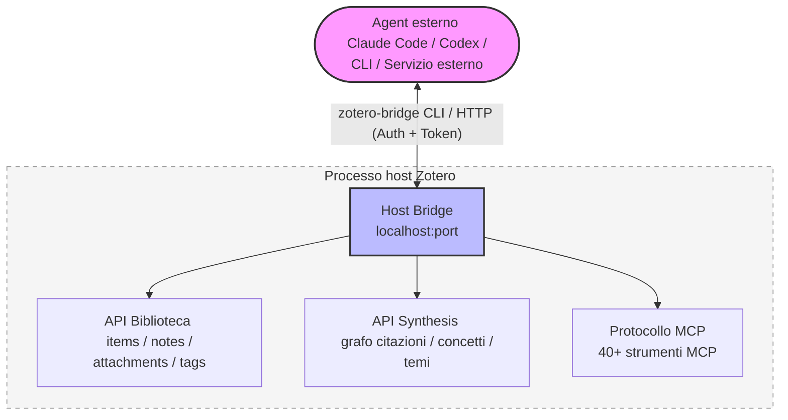
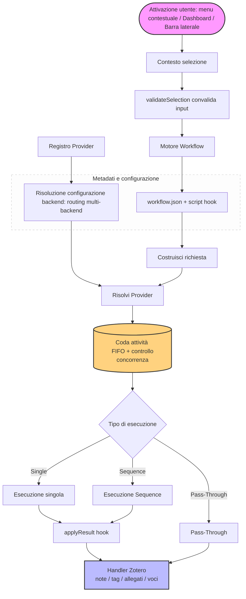

<!-- hero banner -->
<p align="center">
  
</p>

<p align="center">
  
</p>

<h1 align="center">Zotero Agents</h1>

<p align="center">
  <a href="https://github.com/leike0813/zotero-agents/releases"></a>
  
  <a href="https://github.com/leike0813/zotero-agents/blob/main/LICENSE"></a>
  
</p>

<p align="center">
  <a href="README.md">English</a> ·
  <a href="README-zhCN.md">简体中文</a> ·
  <a href="README-zhTW.md">繁體中文</a> ·
  <a href="README-jaJP.md">日本語</a> ·
  <a href="README-frFR.md">Français</a> ·
  <a href="README-de.md">Deutsch</a> ·
  <a href="README-esES.md">Español</a> ·
  <a href="README-ptBR.md">Português</a> ·
  <a href="README-koKR.md">한국어</a> ·
  <strong>Italiano</strong> ·
  <a href="README-ruRU.md">Русский</a> ·
  <a href="https://leike0813.github.io/zotero-agents/">📖 Documentazione</a> ·
  <a href="https://github.com/leike0813/zotero-agents">GitHub</a> ·
  <a href="https://gitee.com/leike0813/zotero-agents">Gitee</a>
</p>

> **Cronologia del repository:** Zotero Agents in precedenza si chiamava **Zotero Skills**. Il vecchio repository è conservato su https://github.com/leike0813/Zotero-Skills per le versioni storiche e i registri di migrazione.

---

<p align="center">
  <strong>La tua biblioteca Zotero, ora potenziata dagli AI Agent.</strong><br/>
  <sub>Trasforma la ricerca, l'analisi, la gestione, la sintesi e la preparazione alla scrittura in conoscenza di ricerca verificabile, tracciabile e riutilizzabile.</sub>
</p>

<p align="center">
  <a href="https://leike0813.github.io/zotero-agents/getting-started">
    
  </a>
  &nbsp;
  <a href="https://github.com/leike0813/zotero-agents/releases">
    
  </a>
</p>

---

Zotero Agents è una **piattaforma agentic all-in-one** per la biblioteca Zotero — non è un assistente chat che risponde alle tue domande, ma permette agli AI Agent di lavorare direttamente nella tua biblioteca, trasformando gli articoli da "PDF letti e dimenticati" in una **rete di conoscenza di ricerca esplorabile, verificabile e accumulabile**.

**Affida la letteratura all'Agent, tu devi solo prendere decisioni.** Analisi della letteratura — l'IA estrae automaticamente riassunti, riferimenti bibliografici e analisi delle citazioni, producendo tre set di note strutturate in un'unica esecuzione; Ricerca e acquisizione della letteratura — l'Agent cerca in rete, filtra i candidati e li inserisce uno per uno dopo la tua conferma; Normalizzazione dei tag — organizza e deduci automaticamente i tag in base a un vocabolario controllato da te definito; Lettura approfondita — genera documenti HTML di lettura approfondita, arricchiti con la conoscenza della tua biblioteca; Sintesi tematica — attorno a una direzione di ricerca, organizza letteratura di base, lavori all'avanguardia, argomentazioni chiave e divergenze metodologiche, producendo report di revisione definitivi.

Alla base di tutto ciò ci sono tre sottosistemi che lavorano in sinergia: un **motore di flusso di lavoro plug-in** (tutta la logica di business viene pubblicata e installata come pacchetti indipendenti, il plugin stesso è privo di accoppiamenti), **Synthesis Workbench** (grafo delle citazioni, base di conoscenza concettuale, mappa tematica — converte le analisi singole in uno strato di conoscenza a lungo termine) e **Host Bridge** (CLI + MCP permettono agli Agent esterni di leggere e scrivere nella tua biblioteca Zotero, delegando le attività di ricerca a pipeline di automazione eseguibili in background).

---

| 🔧 | 💬 | 🔬 | 🔌 |
|:--:|:--:|:--:|:--:|
| **Flusso di lavoro plug-in** | **Assistant Sidebar** | **Synthesis Workbench** | **Host Bridge** |
| Analisi articoli, lettura approfondita, normalizzazione tag, sintesi tematica — organizzati in flussi estendibili | Connettiti agli Agent tramite ACP, dialoga e collabora su articoli, voci e biblioteche | Gestisci reti di citazioni, concetti, tag e sintesi tematica, con accumulo continuo dello strato di conoscenza | CLI + MCP permettono agli Agent esterni di leggere il contesto Zotero e scrivere i risultati dell'analisi |

---

## Navigazione rapida

| Chi sei…                              | Inizia da qui                                                    |
| ------------------------------------- | ---------------------------------------------------------------- |
| 🔰 Nuovo utente, vuoi sapere cosa puoi fare | → [Inizia in 3 passi](#inizia-in-3-passi)                    |
| 📄 Vuoi elaborare rapidamente articoli (riassunti, analisi) | → [Flussi di lavoro principali](#flussi-di-lavoro-principali) |
| 📊 Stai facendo una revisione della letteratura e hai bisogno di conoscenza sistematica | → [Workbench di sintesi della letteratura](#workbench-di-sintesi-della-letteratura) |
| 💬 Vuoi dialogare con l'IA sugli articoli | → [Pannelli di interazione IA](#pannelli-di-interazione-ia) |
| 💰 Ti preoccupi dei costi dell'IA e della scelta del motore | → [Motori IA e costi](#motori-ia-e-costi) |
| 🔌 Integrazioni esterne, per far leggere la tua biblioteca all'Agent | → [Host Bridge e MCP](#host-bridge--mcp-server) |
| 🛠 Sviluppatore, vuoi estendere o contribuire | → [Panoramica dell'architettura](#panoramica-dellarchitettura) · [Documentazione per sviluppatori](#documentazione-per-sviluppatori) |
| 📚 Hai bisogno del manuale completo | → [Documentazione utente](https://leike0813.github.io/zotero-agents/) |

---

## Installazione e configurazione

### Requisiti di sistema

- [Zotero 9](https://www.zotero.org/download/) o [Zotero 7](https://www.zotero.org/download/) (versione ≥ 6.999)
- Se si utilizza il backend ACP: gli strumenti CLI Agent corrispondenti devono essere installati in locale (va bene anche l'installazione automatica tramite `npx`)
- Se si utilizza il backend Skill-Runner: deve essere stata distribuita un'istanza di [Skill-Runner](https://github.com/leike0813/Skill-Runner)

> **Nota sulla versione di Zotero**: questo plugin è sviluppato e testato su Zotero 9. In teoria, Zotero 8 dovrebbe essere completamente supportato (il framework dei plugin di Zotero 8/9 non è cambiato in modo significativo); anche Zotero 7 dovrebbe essere supportato in teoria, ma per mancanza di tempo non sono stati condotti test approfonditi, e la manutenzione futura sarà focalizzata su Zotero 9. Se riscontri problemi utilizzando Zotero 7, segnalali su [Issues](https://github.com/leike0813/zotero-agents/issues).

### Tipi di backend

| Tipo di backend | Raccomandazione | Utilizzo | Modalità di configurazione |
|-----------------|-----------------|----------|----------------------------|
| **ACP** | 🥇 Prima scelta | Connessione diretta agli Agent CLI (Codex, OpenCode, Claude Code, Gemini CLI, Qwen Code), senza configurazione aggiuntiva | Aggiungi da preset nel Backend Manager |
| **Skill-Runner (Docker)** | 🥈 Consigliato | Servizio persistente, indipendente dall'avvio/arresto di Zotero, supporta la condivisione in rete locale | Docker compose up, poi inserisci l'URL nel Backend Manager |
| **Skill-Runner (distribuzione con un clic)** | 🥉 Emergenza | Si avvia e arresta con il plugin, chiudendo Zotero si terminano tutte le attività | Distribuzione con un clic nelle Preferenze |

> Inoltre, il plugin include anche due tipi di backend: **Generic HTTP** (per chiamare qualsiasi API HTTP, come il servizio MinerU) e **Pass-Through** (per operazioni puramente locali, come esportazione/importazione di note), utilizzati automaticamente in flussi di lavoro specifici, senza necessità di configurazione aggiuntiva.

---

## Inizia in 3 passi

### 1️⃣ Installa il plugin

Scarica il file `.xpi` da [Releases](https://github.com/leike0813/zotero-agents/releases) → Zotero `Strumenti` → `Componenti aggiuntivi` → ⚙️ → `Installa componente aggiuntivo da file…` → Riavvia Zotero.

### 2️⃣ Configura il backend IA

> 🥇 **Prima scelta ACP** — Se sul tuo computer hai strumenti Agent che supportano ACP come Codex / OpenCode / Claude Code, puoi usarli direttamente senza configurazione.

**Opzione A — Connessione diretta a Agent ACP (consigliata)**

`Strumenti` → `Backend Manager` → Scheda ACP → Seleziona il tuo strumento Agent da **Add from Preset** → Salva. Non è necessario inserire alcun parametro.

**Opzione B — Distribuzione Docker di Skill-Runner (per esecuzione persistente in background)**

[Distribuisci Skill-Runner con Docker](https://leike0813.github.io/zotero-agents/backends/skill-runner#推荐docker-常驻部署) sulla tua macchina, poi aggiungi l'istanza SkillRunner nel Backend Manager e inserisci l'URL di base.

> Nota: la distribuzione locale con un clic è adatta solo agli utenti che non sanno installare Agent / Docker. Chiudendo Zotero si terminano tutte le attività.

### 3️⃣ Esegui con il tasto destro

Nell'elenco della letteratura di Zotero, fai **clic destro su un articolo** e seleziona `Zotero Agents` → `Analisi della letteratura`. Dopo pochi minuti, vedrai nel pannello delle note il riassunto generato dall'IA, l'elenco dei riferimenti bibliografici e l'analisi delle citazioni.

> Per istruzioni dettagliate sulla configurazione e l'uso, consulta la [Documentazione online](https://leike0813.github.io/zotero-agents/).

---

## Flussi di lavoro principali

Le funzioni da utilizzare quotidianamente, attivabili con il clic destro su un articolo.

| Funzione | Descrizione | Come attivarla |
|----------|-------------|----------------|
| 📊 **Analisi della letteratura** | L'IA genera automaticamente riassunti, estrae riferimenti bibliografici e produce report di analisi delle citazioni. Può eseguire in cascata la normalizzazione dei tag | Clic destro sull'articolo → `Analisi della letteratura` |
| 💬 **Interpretazione interattiva della letteratura** | Dialogo a più turni per comprendere a fondo gli articoli. Le risposte dell'IA superano un cancelletto di verifica, le risposte incerte vengono segnalate esplicitamente, senza preoccupazioni sulle allucinazioni. I dialoghi possono essere generati come note di studio | Clic destro sull'articolo → `Interpretazione della letteratura` |
| 📖 **Lettura approfondita** | Genera una vista di lettura approfondita strutturata, con supporto per traduzione di più segmenti e spiegazione dei concetti | Clic destro sull'articolo → `Lettura approfondita` |
| 🌱 **Inizializzazione del vocabolario dei tag** | Crea interattivamente con l'IA un vocabolario controllato di tag per il tuo campo di ricerca. Si consiglia di inizializzare prima di iniziare l'analisi della letteratura | Dashboard → `Tag Bootstrapper` |
| 🏷️ **Normalizzazione dei tag** | Organizza automaticamente i tag in base al vocabolario controllato, l'IA deduce nuovi tag e attende la revisione | Clic destro sulla voce → `Normalizzazione dei tag` |
| 🔎 **Ricerca e acquisizione della letteratura** | Lascia che l'Agent ti aiuti ad ampliare rapidamente la tua biblioteca: cerca, filtra e, dopo la conferma, inserisci direttamente | Dashboard → `Ricerca e acquisizione della letteratura` |
| 📋 **Analisi PDF** | Converti i PDF in Markdown (chiama il servizio MinerU) | Clic destro sul PDF → `MinerU` |
| 📤 **Esportazione/Importazione note** | Esporta in batch riassunti e note in Markdown, o importa note esterne | Clic destro sulle voci selezionate → Esporta/Importa |

> **💡 Nota sulle note prodotte**: I prodotti dell'analisi della letteratura (riassunti, riferimenti bibliografici, analisi delle citazioni) vengono aggiunti come allegati Note alla voce genitore. Il contenuto visualizzato nelle note è **renderizzato** dai dati di backend, modificare direttamente il contenuto della nota non cambia i dati di backend. Per modificare, utilizza «Esporta note» per esportare → modifica → poi reimporta tramite «Importa note».

<p align="center">
<table>
<tr>
<td width="33%" align="center"><br/><sub>Digest — Riassunto della letteratura</sub></td>
<td width="33%" align="center"><br/><sub>References — Riferimenti bibliografici</sub></td>
<td width="33%" align="center"><br/><sub>Citation Analysis — Analisi delle citazioni</sub></td>
</tr>
</table>
</p>

---

## Flussi di lavoro consigliati

Dall'inizio alla stesura della revisione della letteratura, si consiglia di procedere nel seguente ordine:

### 📋 Passo 1: Stabilisci il vocabolario dei tag

Prima di iniziare l'analisi della letteratura, si consiglia di utilizzare **Tag Bootstrapper** per inizializzare un vocabolario controllato di tag per il tuo campo di ricerca. In questo modo, le successive analisi della letteratura potranno organizzare automaticamente i tag per ogni articolo.

```
Dashboard → Tag Bootstrapper → Interagisci con l'IA per definire il tuo sistema di tag per il campo di ricerca
```

### 📥 Passo 2: Acquisizione e analisi

**L'analisi della letteratura è il cuore della gestione della letteratura Agentic** — tutta la letteratura acquisita dovrebbe essere elaborata.

```
Ottieni il PDF originale
  → Clic destro sul PDF → MinerU (conversione in Markdown, risultato ottimale)
  → Clic destro sull'articolo → Analisi della letteratura
     └── L'IA genera automaticamente riassunto + riferimenti bibliografici + analisi delle citazioni
     └── Esegue anche automaticamente la normalizzazione dei tag (attivata di default, si consiglia di mantenerla)
```

> **💡 Per ampliare la biblioteca**: Hai bisogno di integrare rapidamente molta letteratura correlata? Utilizza **Ricerca e acquisizione della letteratura** per far cercare, filtrare e acquisire in batch all'Agent.

### 🔗 Passo 3: Deduplicazione delle citazioni e grafo

Quando la biblioteca ha una certa dimensione e sono state tutte elaborate con l'Analisi:

```
Apri Synthesis Workbench → Pagina Index
  → Esegui Advance Matching (algoritmo di corrispondenza avanzato per deduplicare le citazioni)
  → Vai alla pagina Review per gestire le voci in approvazione (le corrispondenze incerte richiedono conferma manuale)
  → ⚠️ Non dimenticare di «Applicare» le decisioni in sospeso!
  → Apri la pagina Graph → Vedrai un grafo delle citazioni completo e accurato ✨
```

> Relazioni di grafo accurate aiutano a calcolare l'importanza di ogni articolo (PageRank, frontier score, ecc.), il che influenzerà direttamente la qualità della successiva sintesi tematica.

### 📊 Passo 4: Crea sintesi tematica

Quando ritieni che la letteratura sia sufficiente e sia stata tutta elaborata con Analisi e Advance Matching:

```
Dashboard → Create Topic Synthesis → Inserisci il seme dell'argomento
  → L'Agent esegue automaticamente la pipeline in 3 fasi (preparazione → potenziamento del nucleo → stesura definitiva)
  → Apri Synthesis Workbench → Pagina Topics
  → Visualizza la panoramica tematica professionale, dettagliata e raffinata ✨
```

<p align="center">
  
</p>

### ✍️ Passo 5: Genera la revisione della letteratura

Quando hai un'idea di ricerca e vuoi comprendere e riassumere i progressi della ricerca nel campo correlato:

```
Raccogli e acquisisci letteratura → Esegui l'analisi della letteratura → Crea alcuni Topic
  → Dashboard → Manuscript Literature Framing
  → Interagisci con l'Agent per determinare il posizionamento dell'articolo e lo stile di scrittura
  → Genera la bozza LaTeX di Introduction + Related Work
  → I prodotti si scaricano nell'area prodotti della Dashboard
  → Inseriscili direttamente nel documento LaTeX, o esportali per elaborarli ulteriormente
```

### 💡 Altri scenari

<details>
<summary><b>Hai domande su un articolo? Interpretazione interattiva della letteratura</b></summary>

Clic destro sull'articolo → `Interpretazione della letteratura` → Discuti interattivamente con l'IA nella Dashboard. Non preoccuparti delle allucinazioni — le risposte dell'IA devono superare un **cancelletto di verifica**, le risposte incerte vengono segnalate esplicitamente. Al termine del dialogo, puoi generare le domande e risposte come note di studio, salvate come allegato Note.

</details>

<details>
<summary><b>Dialoga liberamente con l'IA utilizzando la letteratura come contesto</b></summary>

Seleziona un articolo → Apri ACP Chat nella barra laterale → Seleziona il backend → Dialoga liberamente sul contenuto dell'articolo. Host Bridge fornisce automaticamente il contesto della letteratura, con supporto per il cambio di modello/modalità.

</details>

<details>
<summary><b>Tracciamento delle citazioni e analisi del grafo</b></summary>

Apri Synthesis Workbench → Pagina Graph → Cerca articoli chiave → Passa al layout Radial per espandere attorno a quell'articolo → Visualizza le relazioni di citazione/citato, i metrici PageRank e frontier score.

</details>

<details>
<summary><b>Normalizzazione dei tag per il team</b></summary>

Tag Bootstrapper inizializza il vocabolario → Seleziona un gruppo di articoli → Normalizzazione dei tag → I tag suggeriti dall'IA vengono aggiunti al vocabolario dopo la revisione Staged → Il vocabolario viene sincronizzato ai membri del team tramite WebDAV.

</details>

---

## Workbench di sintesi della letteratura

Trasforma articoli sparsi in una **rete di conoscenza esplorabile**. Questa è la differenza fondamentale tra questo plugin e altri strumenti IA per Zotero.

> I flussi di lavoro principali ti aiutano a **leggere** gli articoli, il workbench di sintesi della letteratura ti aiuta a **organizzare** la conoscenza.

Il workbench è una scheda Workspace completa in Zotero, composta da 8 Surface:

| Surface | Funzione |
|---------|----------|
| **Home** | Panoramica della biblioteca: schede di approfondimento, pannello stato sincronizzazione, riepilogo voci da revisionare, accesso rapido ai temi principali |
| **Topics** | Gestione dei temi (creazione/aggiornamento/esplorazione), con tre viste: grafo, griglia, elenco |
| **Index** | Indice di riferimenti bibliografici canonici: registro degli articoli + associazione citazioni + unione/deduplicazione/reindirizzamento |
| **Review** | Centro di revisione: revisione corrispondenze citazioni, revisione concetti, revisione relazioni della mappa tematica (accetta/rifiuta/operazioni in batch) |
| **Graph** | Visualizzazione del grafo delle citazioni (layout forza-direzionale/radiale/componenti), con filtro tematico e analisi dei metrici |
| **Tags** | Gestione del vocabolario controllato dei tag + approvazione suggerimenti tag IA (Promote/Discard) |
| **Concepts** | Base di conoscenza concettuale: struttura a quattro livelli concetto/significato/alias/relazioni, sovrapponibile alla mappa tematica e al lettore |
| **Reader** | Lettore approfondito tematico: Overview / Taxonomy / Claims / Compare / Future Directions / Coverage / References / Report |

Il workbench include la funzionalità di **sincronizzazione WebDAV**, che permette di sincronizzare vocabolari dei tag, sintesi tematiche, base di conoscenza concettuale e altri dati strutturati tramite protocollo WebDAV verso il remoto, realizzando una sincronizzazione e un backup leggeri tra dispositivi.

<table>
<tr>
<td width="50%"></td>
<td width="50%"></td>
</tr>
</table>

---

## Pannelli di interazione IA

La v0.5.0 introduce una completa barra laterale di interazione IA, con tre modalità di interazione:

<table>
<tr>
<td width="33%" align="center"><br/><sub>💬 ACP Chat — Dialogo continuo con la biblioteca come contesto</sub></td>
<td width="33%" align="center"><br/><sub>⚙️ ACP Skills — Esecuzione di flussi di lavoro con Agent locali tramite protocollo ACP</sub></td>
<td width="33%" align="center"><br/><sub>🔧 SkillRunner — Comunicazione con il backend del servizio Skill-Runner gestito</sub></td>
</tr>
</table>

---

## Host Bridge & MCP Server

All'avvio di Zotero, il plugin esegue automaticamente un servizio Host Bridge locale. Strumenti IA esterni (Codex, OpenCode, ecc.) possono **accedere direttamente alla tua biblioteca Zotero** — leggere articoli, cercare voci, gestire tag e persino attivare flussi di lavoro.

| Capacità | Descrizione |
|----------|-------------|
| 🔌 **Accesso alla biblioteca** | Gli Agent esterni leggono direttamente voci, note, allegati, tag, collezioni di Zotero |
| ⚡ **Attivazione flussi di lavoro** | Attiva da remoto l'esecuzione di flussi di lavoro IA tramite Bridge API |
| 📊 **Query Synthesis** | Interroga il grafo delle citazioni, temi, base di conoscenza concettuale, indice dei riferimenti bibliografici |
| 🖥 **Strumenti MCP** | Server MCP integrato, fornisce strumenti strutturati per operazioni Zotero agli Agent ACP |
| 🔒 **Sicurezza** | Autenticazione Token + approvazione operazioni di scrittura, i dati non lasciano il locale |



La CLI Host Bridge (`zotero-bridge`) fornisce oltre 20 sottocomandi, con supporto per Windows / macOS / Linux (incluso ARM).

---

## Motore di flusso di lavoro plug-in

Il plugin stesso non contiene logica di business specifica — tutte le capacità IA sono integrate tramite **pacchetti di flusso di lavoro esterni**.

- 📦 **Plug-and-play**: Inserisci i pacchetti di flusso di lavoro nella directory, subito disponibili, senza necessità di ricostruzione
- 📝 **Definizione dichiarativa**: Descrivi "cosa fare" tramite il manifest `workflow.json` + pochi script hook
- 🔗 **Orchestrazione Sequence**: Più Skill concatenate in ordine, con supporto per handoff, isolamento dell'area di lavoro e terminazione anticipata
- 🌐 **Routing multi-backend**: Lo stesso flusso di lavoro può essere eseguito su backend diversi come Skill-Runner, ACP, HTTP, ecc.
- 🌍 **Multilingua**: I flussi di lavoro includono supporto i18n integrato, i testi dell'interfaccia utente cambiano automaticamente in base alla lingua di Zotero
- ✅ **Validazione input dichiarativa**: `validateSelection` — Vincola le condizioni di input senza scrivere JS

> La guida completa per lo sviluppo di flussi di lavoro personalizzati è disponibile nella [Documentazione utente](https://leike0813.github.io/zotero-agents/workflows/custom/).

---

## Lettore Markdown integrato

Il plugin include un lettore Markdown leggero. In Zotero, **fai doppio clic su qualsiasi allegato `.md`** per aprirlo nel lettore integrato, senza dover passare a un'applicazione esterna.

| Funzione | Descrizione |
|----------|-------------|
| 📑 **Navigazione struttura** | Analizza automaticamente la gerarchia dei titoli (h1-h4), mostra una struttura navigabile nella barra laterale sinistra |
| 🔍 **Ricerca** | Ricerca di parole chiave nel testo completo, con evidenziazione dei risultati |
| 📐 **Formule matematiche** | Rendering di formule LaTeX con KaTeX, con supporto per formule inline e a blocco |
| 💻 **Evidenziazione codice** | Evidenziazione sintassi con highlight.js, con supporto per i principali linguaggi di programmazione |
| 🔤 **Regolazione dimensione carattere** | Regolabile da 12px a 24px, adatto a diversi schermi e abitudini di lettura |
| 📏 **Cambio larghezza** | Supporta due larghezze di lettura: colonna stretta (860px) e colonna larga (1160px) |
| 📋 **Copia** | Supporta la copia del testo Markdown originale negli appunti, così come la copia del percorso del file |
| 📂 **Apri nel sistema** | Apri il file con un clic nell'applicazione predefinita del sistema |
| 🌗 **Tema automatico** | Si adatta al tema chiaro/scuro di Zotero, senza necessità di cambio manuale |

Il lettore è basato su `markdown-it` per il rendering, combinato con un depuratore HTML integrato per garantire un rendering sicuro. Puoi disattivare questa funzione nelle Preferenze, tornando al metodo di apertura predefinito del sistema.

<p align="center">
  
</p>

---

## Principali novità della v0.5.0

> Da v0.4.0 a v0.5.0 ci sono stati **42 commit**, rappresentando un'evoluzione completa da "frontend Skill-Runner" a "framework di esecuzione Agent universale".

<table>
<tr>
<td width="50%">

### ✨ Novità

- **Backend ACP** — Connessione diretta a Codex, OpenCode, Claude Code, Gemini CLI, Qwen Code e altri Agent CLI
- **Pannello ACP Chat** — Dialogo continuo con la letteratura come contesto, con supporto per cambio modello/modalità e visualizzazione consumo Token
- **Pannello ACP Skill Runs** — Monitora l'intera esecuzione delle skill, con trascrizione, approvazione permessi, anteprima output
- **Workbench di sintesi della letteratura** — Synthesis Workbench completo, con 8 Surface
- **Grafo delle citazioni** — Layout forza-direzionale/radiale/componenti, con filtro tematico e calcolo metrici
- **Base di conoscenza concettuale** — Struttura a quattro livelli concetto/significato/alias/relazioni, sovrapponibile alla mappa tematica
- **Lettura approfondita** — Vista di lettura approfondita strutturata, con copertura concettuale e contesto citazioni
- **Host Bridge + MCP Server** — Trasforma Zotero in un servizio programmabile
- **Lettore Markdown integrato** — Doppio clic sugli allegati `.md` per aprirli nel lettore integrato, con navigazione struttura, ricerca, formule matematiche, evidenziazione codice
- **Esecuzione Sequence** — Più Skill concatenate in ordine, con supporto per passaggio risultati intermedi
- **Finestra Backend Manager** — Gestione unificata di tutte le configurazioni backend
- **Sincronizzazione WebDAV** — Sincronizzazione leggera dei dati Synthesis tra dispositivi

</td>
<td width="50%">

### ♻️ Miglioramenti

- **Dashboard completamente ristrutturata** — Nuove viste backend, esploratore prodotti, Skill Feedback, esportazione diagnostica log
- **Validazione selezione dichiarativa** — `validateSelection` sostituisce `filterInputs` imperativo, zero JS per definire vincoli di input
- **Governance connessione SkillRunner** — Ottimizzazione densità connessione, visualizzazione stato pre-richiesta, recupero guasti potenziato
- **Interfaccia utente multilingua** — Synthesis Workbench e sistema Workflow supportano cinese/inglese/francese/giapponese
- **Cross-platform CLI** — Host Bridge CLI aggiunge precompilati Linux ARM/ARM64/x86
- **Gestione dati runtime** — Nelle Preferenze è possibile visualizzare l'utilizzo dello spazio, pulire vari dati cache
- **Skill Run Feedback** — Dopo un'esecuzione riuscita, è possibile raccogliere automaticamente report di feedback IA

</td>
</tr>
</table>

---

## Flussi di lavoro ufficiali

<details>
<summary>Espandi l'elenco completo dei flussi di lavoro</summary>

### Elaborazione letteratura

| Flusso di lavoro | Backend | Descrizione |
|------------------|---------|-------------|
| **Analisi della letteratura** ⭐ | `skillrunner` | Genera riassunto + riferimenti bibliografici + note di analisi delle citazioni. Può eseguire in cascata la normalizzazione dei tag (attivata di default) |
| **Interpretazione della letteratura** | `skillrunner` | Comprensione della letteratura a più turni, con cancelletto di verifica delle risposte anti-allucinazioni. I dialoghi possono essere salvati come note di studio |
| **Lettura approfondita** | `acp` | Vista di lettura approfondita strutturata (HTML), con copertura concettuale e contesto citazioni |
| **Ricerca e acquisizione della letteratura** | `acp` | Lascia che l'Agent cerchi e filtri la letteratura per te, con inserimento diretto dopo conferma |
| **MinerU** | `generic-http` | Conversione PDF → Markdown (chiama il servizio MinerU) |

### Sintesi e organizzazione

| Flusso di lavoro | Backend | Descrizione |
|------------------|---------|-------------|
| **Sintesi tematica** | `acp` | Sequence in 3 fasi: preparazione → potenziamento del nucleo → stesura definitiva. Completamente automatizzata dall'Agent |
| **Cornice letteratura manoscritto** | `acp` | Generazione interattiva della bozza LaTeX di Introduction + Related Work |
| **Inizializzazione vocabolario tag** | `skillrunner` | Crea interattivamente con l'IA un vocabolario controllato di tag per il campo di ricerca. Si consiglia di eseguirlo per primo |
| **Normalizzazione dei tag** | `skillrunner` | Deduzione tag basata su LLM + organizzazione vocabolario controllato |

### Strumenti

| Flusso di lavoro | Backend | Descrizione |
|------------------|---------|-------------|
| **Esportazione note** | `pass-through` | Esporta in batch riassunti/note in Markdown (modificabili e poi reimportabili) |
| **Importazione note** | `pass-through` | Importa Markdown esterni come note Zotero |
| **Debug Probe** | Vari | 13 sonde di debug, per verificare esecuzione sequence, contratti apply, connettività Host Bridge, ecc. |

</details>

---

## Motori IA e costi

Questo plugin non è legato a nessun fornitore di servizi IA. Utilizzi il tuo abbonamento, il tuo Coding Plan o la tua API Key per connetterti direttamente al backend — **nessun intermediario, nessun sovrapprezzo per token**.

### Preoccupato per il costo dei Token?

Buone notizie: tutte le Skill di questo progetto sono state progettate con cura, **anche modelli più deboli (o persino modelli distribuiti in locale!) possono ottenere risultati di esecuzione sorprendenti**. Non hai bisogno del modello più costoso per ottenere risultati eccellenti.

### Riferimento costi

| Piano | Costo | Descrizione |
|-------|-------|-------------|
| **DeepSeek V4 Flash** | Circa ￥2/articolo | Pagamento a consumo. Ogni articolo per l'Analisi della letteratura costa meno di ￥2 |
| **Coding Plan** | Prezzo fisso mensile | Se hai la fortuna di aver acquistato un Coding Plan a consumo (Bailian, Zhipu, ecc.), puoi elaborare letteratura in modo economico e in batch — lo chiamiamo tramite Coding Agent, **completamente conforme** |
| **[OpenCode Go](https://opencode.ai/go?ref=SZDFT9GZKW)** | $10/mese (primo mese $5) | Quota DeepSeek V4 Flash quasi illimitata. Iscrivendoti tramite [questo link](https://opencode.ai/go?ref=SZDFT9GZKW), tu e l'autore ricevete ciascuno $5 di sconto |
| **Kilo Code Auto Free** | Gratuito | La modalit? Auto Free integrata instrada automaticamente ogni richiesta a un modello gratuito appropriato. Nessuna chiave API o account richiesto |
| **OpenCode Zen / OpenRouter Free** | Gratuito | OpenCode Zen include modelli gratuiti integrati; OpenRouter offre anche modelli gratuiti (Gemini 2.5 Flash, DeepSeek V3). Con limiti di velocit? ma a costo zero |


### Limitazioni della versione gratuita

| Limitazione | Cosa aspettarsi |
|------------|----------------|
| **Limitazione di velocit?** | Le richieste possono essere rallentate ? da 5 a 20 richieste al minuto a seconda del carico del provider. L'elaborazione in batch pu? rallentare notevolmente |
| **Concorrenza** | Di solito una singola richiesta concorrente. L'invio di pi? workflow simultaneamente pu? essere messo in coda o fallire |
| **Disponibilit? dei modelli** | Il pool di modelli gratuiti pu? esaurirsi nelle ore di punta. Potresti vedere errori come "modello non disponibile" o "capacit? superata" |
| **Rotazione dei modelli** | I provider possono cambiare silenziosamente i modelli gratuiti senza preavviso. La qualit? dell'output pu? variare tra un'esecuzione e l'altra |
| **Nessun SLA** | I piani gratuiti non offrono garanzie di disponibilit?. I servizi potrebbero essere temporaneamente non disponibili o interrotti |

> Se hai bisogno di elaborazione batch affidabile o uso in produzione, considera un piano a pagamento (OpenCode Go o Coding Plan) ? il costo per articolo ? trascurabile rispetto al tempo risparmiato.

### Limitazioni della versione gratuita

I modelli gratuiti sono un ottimo punto di partenza, ma comportano dei compromessi:

| Limitazione | Cosa aspettarsi |
|-------------|-----------------|
| **Limitazione di velocità** | Le richieste possono essere rallentate — da 5 a 20 richieste al minuto a seconda del carico del provider. L'elaborazione in batch può rallentare notevolmente |
| **Concorrenza** | Di solito una singola richiesta concorrente. L'invio di più workflow simultaneamente può essere messo in coda o fallire |
| **Disponibilità dei modelli** | Il pool di modelli gratuiti può esaurirsi nelle ore di punta. Potresti vedere errori come "modello non disponibile" o "capacità superata" |
| **Rotazione dei modelli** | I provider possono cambiare silenziosamente i modelli gratuiti senza preavviso. La qualità dell'output può variare tra un'esecuzione e l'altra |
| **Nessun SLA** | I piani gratuiti non offrono garanzie di disponibilità. I servizi potrebbero essere temporaneamente non disponibili o interrotti |

> Se hai bisogno di elaborazione batch affidabile o uso in produzione, considera un piano a pagamento (OpenCode Go o Coding Plan) — il costo per articolo è trascurabile rispetto al tempo risparmiato.

### Confronto motori

| Motore | Scenari adatti | Costo | Raccomandazione |
|--------|----------------|-------|-----------------|
| **Codex** | Il migliore in assoluto, velocità e qualità. Supporta la visualizzazione del flusso di pensiero | Disponibile versione gratuita (modello limitato) | ⭐⭐⭐ Prima scelta |
| **Kilo Code** | Modalità Auto Free integrata — instrada automaticamente ai modelli gratuiti disponibili senza configurazione. Supporta l'isolamento della configurazione tramite variabili XDG. Funziona anche con chiavi API a pagamento | **Gratuito** (Auto Free) | ⭐⭐⭐ Eccellente opzione gratuita |
| **Opencode** | Qwen3.5-Plus / Kimi-K2.5 / GLM-5 e altri modelli eccellono nei compiti di letteratura. [OpenCode Go](https://opencode.ai/go?ref=SZDFT9GZKW) offre una quota economica; l'edizione Zen include modelli gratuiti integrati; può anche usare i modelli gratuiti di OpenRouter | Gratuito (Zen / OpenRouter) o basso costo (Go) | ⭐⭐⭐ Fortemente consigliato |
| **Qwen Code** | Per utenti dell'ecosistema Alibaba, con Bailian Coding Plan | Quota inclusa terminata, dipende dal Plan | ⭐⭐ Opzionale |
| **Gemini CLI** | Per compiti semplici | Disponibile versione gratuita | ⭐ Normale |
| **Claude Code** | Alta qualità di esecuzione delle istruzioni, ma minore efficienza | A pagamento | A seconda delle necessità |

> Le guide dettagliate per la distribuzione di ogni motore sono disponibili nella [Documentazione utente](https://leike0813.github.io/zotero-agents/backends/skill-runner#引擎系统).

---

## Panoramica dell'architettura

<details>
<summary>Espandi il diagramma dell'architettura</summary>



Concetto di progettazione fondamentale: il plugin stesso è un **guscio di esecuzione**, non contiene logica di business specifica. Tramite il manifest dichiarativo `workflow.json` e gli script hook si definisce "cosa fare", il plugin si occupa di "come eseguire".

</details>

Per maggiori dettagli sull'architettura, consulta [Documentazione utente: Flusso di lavoro personalizzato](https://leike0813.github.io/zotero-agents/workflows/custom/).

---

## Note sulla versione di transizione

> **v0.5.0 è la prima tappa importante dopo la rinominazione in "Zotero Agents".** Rispetto a v0.4.0 (puramente frontend Skill-Runner), v0.5.0 ha completato la trasformazione completa verso un framework di esecuzione Agent universale — aggiungendo supporto backend ACP, Workbench di sintesi della letteratura, grafo delle citazioni, base di conoscenza concettuale, Host Bridge, MCP Server e altre capacità fondamentali, già utilizzabile in modo stabile nella ricerca quotidiana.

### ⚠️ Limitazioni note

| Limitazione | Descrizione | Piano |
|-------------|-------------|-------|
| **Il ricalcolo Synthesis blocca l'interfaccia utente** | Operazioni come l'aggiornamento dell'indice, la ricostruzione del grafo delle citazioni e Advance Matching richiedono molta computazione, e nell'architettura a processo host singolo di Zotero causano un breve blocco dell'interfaccia utente. Durante l'esecuzione, attendere pazientemente | Pianificato per la risoluzione in una successiva ristrutturazione |
| **La sincronizzazione WebDAV non è ancora stata testata completamente** | La funzione di sincronizzazione automatica non è stata testata a sufficienza, se la utilizzi cerca di usare solo la sincronizzazione manuale | Miglioramenti nelle versioni successive |
| **Prestazioni per biblioteche di grandi dimensioni** | Non sono stati ancora condotti test approfonditi sulle prestazioni in biblioteche di letteratura su larga scala | Da risolvere nei prossimi aggiornamenti |

### Piani futuri

- Migliorare il supporto multilingua e la guida utente
- Migliorare la coerenza dell'esperienza tra i vari backend
- Ottimizzare la reattività dell'interfaccia utente durante il ricalcolo Synthesis
- Continuare a migliorare stabilità e prestazioni

> Se riscontri problemi, segnalali su [Issues](https://github.com/leike0813/zotero-agents/issues).

---

## Documentazione per sviluppatori

<details>
<summary>Espandi la guida per sviluppatori</summary>

### Sviluppo locale

```bash
npm install          # Installa le dipendenze
npm start            # Avvia il server di sviluppo
npm test             # Esegui i test lite
npm run test:full    # Esegui tutti i test
npm run build        # Build di produzione
```

### Indice documentazione

| Documento | Descrizione |
|-----------|-------------|
| [Flusso architetturale](doc/architecture-flow.md) | Panoramica della pipeline di esecuzione (con diagramma di flusso Mermaid) |
| [Guida per sviluppatori](doc/dev_guide.md) | Componenti principali, modello di configurazione, catena di esecuzione |
| [Componenti flusso di lavoro](doc/components/workflows.md) | Schema manifest, hook, filtro input, semantica di esecuzione |
| [Componenti Provider](doc/components/providers.md) | Sistema di contratti Provider, tipi di richiesta |
| [Strategia di test](doc/testing-framework.md) | Ambiente di esecuzione doppio, modalità lite/full, cancelletto CI |
| [Livello Synthesis](doc/synthesis-layer/README.md) | Design interno di grafo della conoscenza, grafo delle citazioni, base di conoscenza concettuale |

</details>

---

## Documentazione utente

Il manuale completo è disponibile nella documentazione online: [https://leike0813.github.io/zotero-agents/](https://leike0813.github.io/zotero-agents/)

Argomenti trattati: installazione, configurazione backend, Backend Manager, chiamata flussi di lavoro, Dashboard, barra laterale (ACP Chat / ACP Skills / SkillRunner), Synthesis Workbench, sincronizzazione WebDAV, preferenze, sviluppo di flussi di lavoro personalizzati e tutte le altre funzionalità.

---

## Licenza

[AGPL-3.0-or-later](LICENSE)

## Ringraziamenti

- Basato su [Zotero Plugin Template](https://github.com/windingwind/zotero-plugin-template)
- Utilizza [zotero-plugin-toolkit](https://github.com/windingwind/zotero-plugin-toolkit)
- Supportato dall'ecosistema di plugin di [@windingwind](https://github.com/windingwind)
