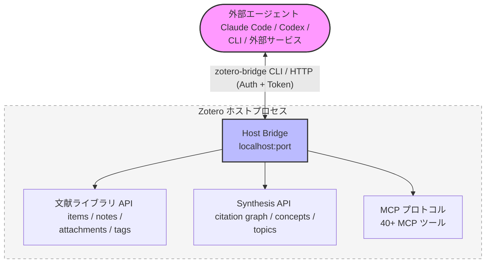
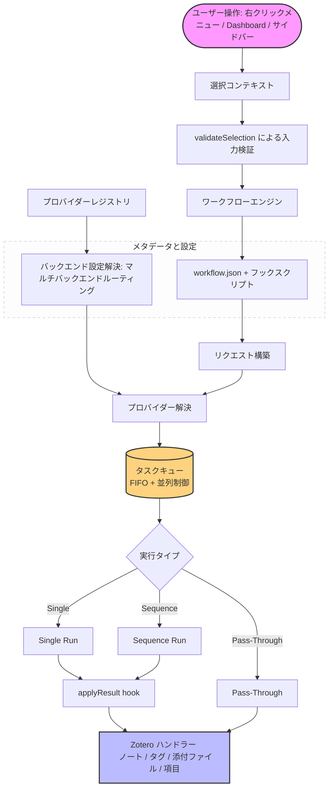

<!-- hero banner -->
<p align="center">
  
</p>

<p align="center">
  
</p>

<h1 align="center">Zotero Agents</h1>

<p align="center">
  <a href="https://github.com/leike0813/zotero-agents/releases"></a>
  
  <a href="https://github.com/leike0813/zotero-agents/blob/main/LICENSE"></a>
  
</p>

<p align="center">
  <a href="README.md">English</a> · <a href="README-zhCN.md">简体中文</a> · <a href="README-zhTW.md">繁體中文</a> · <strong>日本語</strong> · <a href="README-frFR.md">Français</a> · <a href="README-de.md">Deutsch</a> · <a href="README-esES.md">Español</a> · <a href="README-ptBR.md">Português</a> · <a href="README-koKR.md">한국어</a> · <a href="README-itIT.md">Italiano</a> · <a href="README-ruRU.md">Русский</a> · <a href="https://leike0813.github.io/zotero-agents/">📖 ドキュメント</a> · <a href="https://github.com/leike0813/zotero-agents">GitHub</a> · <a href="https://gitee.com/leike0813/zotero-agents">Gitee</a>
</p>

> **リポジトリ履歴:** Zotero Agents は以前 **Zotero Skills** という名称でした。旧リポジトリは履歴リリースと移行記録のため https://github.com/leike0813/Zotero-Skills に残しています。

---

<p align="center">
  <strong>あなたの Zotero 文献ライブラリが、AI Agent によって駆動されます。</strong><br/>
  <sub>文献の検索、分析、管理、統合、執筆準備を、審査可能で追跡可能かつ再利用可能な研究知識として蓄積します。</sub>
</p>

<p align="center">
  <a href="https://leike0813.github.io/zotero-agents/getting-started">
    
  </a>
  &nbsp;
  <a href="https://github.com/leike0813/zotero-agents/releases">
    
  </a>
</p>

---

Zotero Agents は、Zotero 文献ライブラリのための**オールインワン Agent ワークベンチ**です。一問一答型のチャットアシスタントではなく、AI Agent があなたの文献ライブラリ内で直接作業し、論文を「読んだら忘れる PDF」から**探索可能、審査可能、蓄積可能な研究知識ネットワーク**へと変換します。

**文献は Agent に任せ、あなたは意思決定だけ行えばよい。** 文献分析 — AI が要約、参考文献、引用意見を自動抽出し、1回の実行で3つの構造化ノートを作成。文献検索と取り込み — Agent がウェブ検索で候補を絞り込み、あなたの確認を経て1件ずつライブラリに登録。タグ正規化 — あなたが定義した統制語彙に基づいてタグを自動整理・推測。深読 — あなたの文献ライブラリの知識を重ね合わせた、美しい HTML の精読ドキュメントを生成。トピック統合 — ある研究方向をめぐる基礎文献、最先端の研究、重要な論点、方法論的分岐を整理し、再利用可能な綜説レポートを作成。

背景には3つの連携するサブシステムがあります。**プラガブルワークフローエンジン**（すべてのビジネスロジックは独立したパッケージとして公開・インストールされ、プラグイン自体は完全に分離）、**Synthesis Workbench**（引用グラフ、概念ナレッジベース、トピックマップ — 個別の分析を長期的な知識層に集約）、そして **Host Bridge**（CLI + MCP により、外部エージェントがあなたの Zotero ライブラリを読み書きし、研究タスクをバックグラウンドで持続実行される自動化パイプラインに委譲）。

---

| 🔧 | 💬 | 🔬 | 🔌 |
|:--:|:--:|:--:|:--:|
| **プラガブルワークフロー** | **アシスタントサイドバー** | **Synthesis Workbench** | **Host Bridge** |
| 論文解析、深読、タグ正規化、トピック統合 — 拡張可能なワークフローとして整理 | ACP 経由でエージェントに接続し、文献・項目・ライブラリについて対話的に協業 | 引用ネットワーク、概念、タグ、トピック統合を管理し、知識層を継続的に構築 | CLI + MCP により、外部エージェントが Zotero コンテキストの読み取りと分析結果の書き込みを行う |

---

## クイックナビゲーション

| あなたは…                           | ここからどうぞ                                                     |
| ------------------------------- | ------------------------------------------------------------- |
| 🔰 新規ユーザーで、できることを知りたい       | → [3ステップクイックスタート](#3ステップクイックスタート)                                  |
| 📄 論文を素早く処理したい（要約、解説） | → [コアワークフロー](#コアワークフロー)                                      |
| 📊 文献レビューに取り組んでいて、体系的な知識が必要 | → [文献統合ワークベンチ](#文献統合ワークベンチ)                              |
| 💬 AI と文献について対話したい         | → [AI インタラクションパネル](#ai-インタラクションパネル)                                  |
| 💰 AI コストとエンジン選択に関心がある       | → [AI エンジンとコスト](#ai-エンジンとコスト)                               |
| 🔌 外部統合でエージェントにライブラリを読み取らせたい  | → [Host Bridge と MCP](#host-bridge--mcp-server)               |
| 🛠 拡張や貢献を考え中の開発者         | → [アーキテクチャ概要](#アーキテクチャ概要) · [開発者ドキュメント](#開発者ドキュメント)              |
| 📚 完全なマニュアルが必要             | → [ドキュメントサイト](https://leike0813.github.io/zotero-agents/)     |

---

## インストールと設定

### システム要件

- [Zotero 9](https://www.zotero.org/download/) または [Zotero 7](https://www.zotero.org/download/)（バージョン ≥ 6.999）
- ACP バックエンドを使用する場合：対応する Agent CLI ツールがローカルにインストールされていること（`npx` による自動インストールも可）
- Skill-Runner バックエンドを使用する場合：[Skill-Runner](https://github.com/leike0813/Skill-Runner) インスタンスがデプロイされていること

> **Zotero バージョンについて**：本プラグインは Zotero 9 で開発・テストされています。Zotero 8 も理論上は完全に対応可能です（Zotero 8/9 のプラグインフレームワークに大きな変更はありません）。Zotero 7 も理論上はサポート可能ですが、十分なテストができていないため、今後のメンテナンスの重点は Zotero 9 に置かれます。Zotero 7 で問題が発生した場合は、[Issues](https://github.com/leike0813/zotero-agents/issues) からご報告ください。

### バックエンドの種類

| バックエンドの種類 | おすすめ度 | 用途 | 設定方法 |
|---------|--------|------|---------|
| **ACP** | 🥇 第一選択 | Agent CLI（Codex、OpenCode、Claude Code、Gemini CLI、Qwen Code）に直接接続、設定不要 | Backend Manager でプリセットから追加 |
| **Skill-Runner (Docker)** | 🥈 推奨 | 常駐サービス、Zotero の起動状態に依存せず、LAN 共有にも対応 | Docker compose up の後、Backend Manager で URL を入力 |
| **Skill-Runner (ワンクリックデプロイ)** | 🥉 緊急用 | プラグインの起動に連動、Zotero を閉じると全タスクが終了 | 設定画面からワンクリック Deploy |

> さらに、**Generic HTTP**（任意の HTTP API、例：MinerU サービスを呼び出す）と **Pass-Through**（ノートエクスポート/インポートなどのローカル操作のみ）の2種類の組み込みバックエンドがあり、特定のワークフローで自動的に使用されるため、通常は意識する必要はありません。

---

## 3ステップクイックスタート

### 1️⃣ プラグインのインストール

[Releases](https://github.com/leike0813/zotero-agents/releases) から `.xpi` ファイルをダウンロード → Zotero `ツール` → `アドオン` → ⚙️ → `ファイルからアドオンをインストール…` → Zotero を再起動。

### 2️⃣ AI バックエンドの設定

> 🥇 **ACP を推奨** — ローカルに Codex / OpenCode / Claude Code などの ACP 対応 Agent ツールがあれば、設定なしで直接使用できます。

**方法 A — ACP Agent に直接接続（推奨）**

`ツール` → `Backend Manager` → ACP タブ → **Add from Preset** から Agent ツールを選択 → 保存。パラメータの入力は不要です。

**方法 B — Docker で Skill-Runner をデプロイ（常時バックグラウンドで動作させる場合）**

マシンに [Skill-Runner を Docker デプロイ](https://leike0813.github.io/zotero-agents/backends/skill-runner#推荐docker-常驻部署)し、Backend Manager で SkillRunner インスタンスを追加して Base URL を入力します。

> 注：ローカルバックエンドのワンクリックデプロイは、Agent / Docker を全くインストールできないユーザー向けです。Zotero を閉じると全タスクが終了します。

### 3️⃣ 右クリックで実行

Zotero の文献一覧で**論文を右クリック**し、`Zotero Agents` → `文献分析` を選択します。数分で、ノートパネルに AI が生成した要約、参考文献リスト、引用分析が確認できます。

> 詳細な設定と使用方法は [ドキュメントサイト](https://leike0813.github.io/zotero-agents/) をご覧ください。

---

## コアワークフロー

日常的に使う機能です。論文を右クリックするだけで起動できます。

| 機能 | 説明 | 起動方法 |
|------|------|----------|
| 📊 **文献分析** | AI が論文の要約を自動生成し、参考文献を抽出、引用分析レポートを出力します。タグ正規化を連続実行可能 | 論文を右クリック → `文献分析` |
| 💬 **インタラクティブ文献解説** | 対話型のやりとりで論文を深く理解。AI の回答は検証ゲートを通過し、不確かな回答には明示的に警告が表示されるため、幻覚の心配はありません。対話記録は学習ノートとして生成可能 | 論文を右クリック → `文献解説` |
| 📖 **深読** | 構造化された精読ビューを生成し、多段翻訳と概念解析に対応 | 論文を右クリック → `深読` |
| 🌱 **タグ語彙の初期化** | AI と対話しながら研究分野の統制タグ語彙を作成。文献分析の前に初期化することをお勧めします | Dashboard → `Tag Bootstrapper` |
| 🏷️ **タグ正規化** | 統制語彙に基づいてタグを自動整理し、AI が新タグを推測して審査待ちとなります | 項目を右クリック → `タグ正規化` |
| 🔎 **文献検索と取り込み** | Agent が文献ライブラリの素早い拡充をサポート：検索、フィルタリング、確認後に直接取り込み | Dashboard → `文献検索と取り込み` |
| 📋 **PDF 解析** | PDF を Markdown に変換（MinerU サービスを呼び出し） | PDF を右クリック → `MinerU` |
| 📤 **ノートのエクスポート/インポート** | 要約やノートを Markdown として一括エクスポート、または外部ノートをインポート | 選択項目を右クリック → エクスポート/インポート |

> **💡 成果物ノートについて**：文献分析の成果物（要約、参考文献、引用分析）は Note 添付ファイルとして親項目に追加されます。ノートに表示される内容はバックエンドデータから**レンダリング**されたもので、ノートを直接編集してもバックエンドデータは変更されません。編集する場合は、「ノートをエクスポート」で書き出し → 修正 → 「ノートをインポート」で再取り込みしてください。

<p align="center">
<table>
<tr>
<td width="33%" align="center"><br/><sub>Digest — 文献要約</sub></td>
<td width="33%" align="center"><br/><sub>References — 参考文献</sub></td>
<td width="33%" align="center"><br/><sub>Citation Analysis — 引用分析</sub></td>
</tr>
</table>
</p>

---

## 推奨ワークフロー

ゼロから文献レビューを執筆するまで、以下の順序で進めることをお勧めします。

### 📋 ステップ1：タグ語彙の構築

文献分析を始める前に、まず **Tag Bootstrapper** で研究分野の統制タグ語彙を初期化することをお勧めします。これにより、以降の文献分析で各論文のタグが自動的に整理されます。

```
Dashboard → Tag Bootstrapper → AI と対話しながら研究分野のタグ体系を定義
```

### 📥 ステップ2：取り込みと分析

**Literature Analysis は Agent 駆動の文献管理の中核** — ライブラリに取り込んだ文献は、すべて一度は実行すべきです。

```
論文の PDF を入手
  → PDF を右クリック → MinerU（Markdown に変換、最高品質）
  → 論文を右クリック → 文献分析
     └── AI が要約 + 参考文献 + 引用分析を自動生成
     └── タグ正規化も同時に自動実行（デフォルト有効、維持を推奨）
```

> **💡 文献ライブラリの拡充**：関連文献を大量に素早く補充したい場合は、**Literature Search & Ingest** を使って、Agent に検索・フィルタリング・一括取り込みを任せましょう。

### 🔗 ステップ3：引用の重複排除とグラフ

文献ライブラリがある程度の規模になり、すべて Analysis を実行した後：

```
Synthesis Workbench → Index ページを開く
  → Advance Matching を実行（高度なマッチングアルゴリズムで引用文献の重複排除）
  → Review ページで承認待ち項目を処理（不確かなマッチは手動確認が必要）
  → ⚠️ 保留中の判断を「適用」するのを忘れずに！
  → Graph ページを開く → 完全で正確な引用グラフが確認できます ✨
```

> グラフの関係が正確であることは、各文献の重要度（PageRank、frontier score など）の計算に役立ち、以降のトピック統合の品質に直接影響します。

### 📊 ステップ4：トピック統合の作成

文献が十分に揃い、すべて Analysis と Advance Matching を完了したと思ったら：

```
Dashboard → Create Topic Synthesis → トピックシードを入力
  → Agent が3段階パイプラインを自動実行（準備 → コア強化 → 最終化）
  → Synthesis Workbench → Topics ページを開く
  → 専門的で詳細、美しいトピックoverviewを閲覧 ✨
```

<p align="center">
  
</p>

### ✍️ ステップ5：文献レビューの生成

研究アイデアがあり、関連分野の研究動向を把握・要約したい場合：

```
文献を収集して取り込み → 文献分析を実行 → いくつかのトピックを作成
  → Dashboard → Manuscript Literature Framing
  → Agent と対話しながら論文の位置づけと文体を決定
  → Introduction + Related Work の LaTeX 下書きを生成
  → 成果物は Dashboard の成果物エリアからダウンロード
  → LaTeX 原稿に直接組み込むか、エクスポートしてさらに加工
```

### 💡 その他の活用例

<details>
<summary><b>論文について質問がある場合は？インタラクティブな文献解説</b></summary>

論文を右クリック → `文献解説` → Dashboard で AI と対話的に討論します。幻覚の心配は無用です — AI の回答は**検証ゲート**を通過する必要があり、不確かな回答には明示的に警告が表示されます。対話終了後、Q&A 記録を学習ノートとして生成し、Note 添付ファイルとして保存できます。

</details>

<details>
<summary><b>文献をコンテキストに AI と自由に会話</b></summary>

論文を選択 → サイドバーの ACP Chat を開く → バックエンドを選択 → 論文の内容について自由に会話。Host Bridge が自動的に文献コンテキストを提供し、モデル/モードの切り替えに対応しています。

</details>

<details>
<summary><b>引用の系譜追跡とグラフ分析</b></summary>

Synthesis Workbench → Graph ページを開く → 重要な論文を検索 → Radial レイアウトに切り替えてその論文を中心に展開 → 引用/被引用関係、PageRank、frontier score の各指標を確認。

</details>

<details>
<summary><b>チームでのタグ運用</b></summary>

Tag Bootstrapper で語彙を初期化 → 論文をまとめて選択 → タグ正規化を実行 → AI が提案したタグは Staged 審査を経て語彙に追加 → 語彙は WebDAV 経由でチームメンバーに同期。

</details>

---

## 文献統合ワークベンチ

ばらばらの論文を**探索可能な知識ネットワーク**に変換します。これが、本プラグインを他の Zotero AI ツールと根本的に分かつ特徴です。

> コアワークフローは論文を**読む**ためのもの、文献統合ワークベンチは知識を**体系化**するためのものです。

ワークベンチは、Zotero 内の完全な Workspace タブで、8 つの Surface で構成されます。

| Surface | 機能 |
|---------|------|
| **Home** | 文献ライブラリの概要ダッシュボード：ライブラリインサイトカード、同期状態パネル、審査項目サマリー、人気トピックへの入口 |
| **Topics** | トピック管理（作成/更新/閲覧）、グラフ/グリッド/リストの3つのビューに対応 |
| **Index** | 正規化参考文献インデックス：論文レジストリ + 引用バインディング + マージ/重複排除/リダイレクト |
| **Review** | 審査センター：引用マッチング、概念、トピックグラフ関係の審査（承認/却下/一括操作） |
| **Graph** | 引用グラフの可視化（Force-Directed/Radial/Component レイアウト）、トピックフィルタリングとメトリクス分析に対応 |
| **Tags** | 統制タグ語彙の管理 + AI によるタグ提案の審査（Promote/Discard） |
| **Concepts** | 概念ナレッジベース：概念/義項/エイリアス/関係の4層構造、トピックグラフやリーダーに重畳可能 |
| **Reader** | トピック詳細リーダー：Overview / Taxonomy / Claims / Compare / Future Directions / Coverage / References / Report |

ワークベンチには **WebDAV 同期**機能が組み込まれており、タグ語彙、トピック統合、概念ナレッジベースなどの構造化データを WebDAV プロトコルでリモートに同期し、軽量なクロスデバイス同期とバックアップを実現します。

<table>
<tr>
<td width="50%"></td>
<td width="50%"></td>
</tr>
</table>

---

## AI インタラクションパネル

v0.5.0 では、完全な AI インタラクションサイドバーが追加され、3 つのインタラクションモードを提供します。

<table>
<tr>
<td width="33%" align="center"><br/><sub>💬 ACP Chat — 文献ライブラリをコンテキストとする継続的な対話</sub></td>
<td width="33%" align="center"><br/><sub>⚙️ ACP Skills — ACP プロトコルでローカルエージェントを接続しワークフローを実行</sub></td>
<td width="33%" align="center"><br/><sub>🔧 SkillRunner — ホスト型の Skill-Runner サービスバックエンドと通信</sub></td>
</tr>
</table>

---

## Host Bridge & MCP Server

Zotero の起動時に、プラグインは自動的にローカルの Host Bridge サービスを実行します。外部 AI ツール（Codex、OpenCode など）が**あなたの Zotero 文献ライブラリに直接アクセス** — 論文の読み取り、項目の検索、タグの管理、さらにはワークフローのトリガーまで。

| 機能 | 説明 |
|------|------|
| 🔌 **ライブラリアクセス** | 外部エージェントが Zotero の項目、ノート、添付ファイル、タグ、コレクションを直接読み取り |
| ⚡ **ワークフローのトリガー** | Bridge API 経由で AI ワークフローの実行をリモートトリガー |
| 📊 **Synthesis 照会** | 引用グラフ、トピック、概念ナレッジベース、参考文献インデックスの照会 |
| 🖥 **MCP ツール** | 組み込み MCP サーバーが ACP エージェントに構造化された Zotero 操作ツールを提供 |
| 🔒 **セキュリティ** | トークン認証 + 書き込み操作の承認、データはローカルから外出しない |



Host Bridge CLI (`zotero-bridge`) は 20+ のサブコマンドを提供し、Windows / macOS / Linux（ARM 含む）に対応しています。

---

## プラグブルワークフローエンジン

プラグイン自体には具体的なビジネスロジックは含まれていません — すべての AI 機能は**外部ワークフローパッケージ**経由で取り込まれます。

- 📦 **プラグアンドプレイ**：ワークフローパッケージをディレクトリに配置するだけで、再構築なしに即座に使用可能
- 📝 **宣言的な定義**：`workflow.json` マニフェストと少数のフックスクリプトで「何を」を記述
- 🔗 **シーケンスオーケストレーション**：複数の Skill を順次連結、handoff、ワークスペース分離、早期終了に対応
- 🌐 **マルチバックエンドルーティング**：同じワークフローを Skill-Runner、ACP、HTTP など異なるバックエンドで実行可能
- 🌍 **多言語対応**：ワークフローは i18n を内蔵、UI テキストは Zotero の言語設定に応じて自動切替
- ✅ **宣言的な入力検証**：`validateSelection` — JS を書かずに入力条件を制約

> カスタムワークフロー開発の完全なガイドは[ドキュメントサイト](https://leike0813.github.io/zotero-agents/workflows/custom/)をご覧ください。

---

## 組み込み Markdown リーダー

プラグインには軽量な Markdown リーダーが組み込まれています。Zotero 内で**任意の `.md` 添付ファイルをダブルクリック**するだけで、内蔵リーダーで開き、外部アプリケーションに切り替える必要はありません。

| 機能 | 説明 |
|------|------|
| 📑 **アウトラインナビゲーション** | 見出し階層（h1–h4）を自動解析、左サイドバーにジャンプ可能なアウトラインを表示 |
| 🔍 **検索** | フルテキストキーワード検索、一致箇所をハイライト |
| 📐 **数式** | KaTeX により LaTeX 数式をレンダリング、インラインおよびブロック数式に対応 |
| 💻 **コードハイライト** | highlight.js による構文ハイライト、主要プログラミング言語に対応 |
| 🔤 **フォントサイズ調整** | 12px–24px まで調整可能、さまざまな画面と閲覧習慣に対応 |
| 📏 **幅の切替** | ナロー（860px）とワイド（1160px）の2つの閲覧幅に対応 |
| 📋 **コピー** | Markdown 原文のクリップボードへのコピー、ファイルパスのコピーに対応 |
| 📂 **システムで開く** | ワンクリックでシステムのデフォルトアプリケーションでファイルを開く |
| 🌗 **自動テーマ** | Zotero のライト/ダークテーマに自動適応、手動切替不要 |

リーダーは `markdown-it` でレンダリングされ、組み込みの HTML サニタイザーにより安全な描画を保証します。設定でこの機能を無効にして、システムのデフォルトの開き方に戻すこともできます。

<p align="center">
  
</p>

---

## v0.5.0 の主な変更点

> v0.4.0 から v0.5.0 にかけて **42 コミット**を積み重ね、「Skill-Runner フロントエンド」から「汎用 Agent 実行フレームワーク」への全面的な進化を遂げました。

<table>
<tr>
<td width="50%">

### ✨ 新機能

- **ACP バックエンド** — Codex、OpenCode、Claude Code、Gemini CLI、Qwen Code などの Agent CLI に直接接続
- **ACP Chat パネル** — 文献をコンテキストとする継続的な対話、モデル/モード切替、Token 使用量の可視化に対応
- **ACP Skill Runs パネル** — スキル実行の全過程を監視、トランスクリプト、権限承認、出力プレビューを含む
- **文献統合ワークベンチ** — 8 つの Surface を備えた完全な Synthesis Workbench
- **引用グラフ** — Force-Directed/Radial/Component レイアウト、トピックフィルタリングとメトリクス計算に対応
- **概念ナレッジベース** — 概念/義項/エイリアス/関係の4層構造、トピックグラフに重畳可能
- **深読** — 概念カバレッジと引用コンテキストを備えた構造化精読ビュー
- **Host Bridge + MCP Server** — Zotero をプログラム可能なサービスに進化
- **組み込み Markdown リーダー** — `.md` 添付ファイルをダブルクリックで内蔵リーダー起動、アウトラインナビゲーション、検索、数式、コードハイライトに対応
- **シーケンス実行** — 複数の Skill を順次連結、中間結果の受け渡しに対応
- **Backend Manager ダイアログ** — すべてのバックエンド設定を一括管理
- **WebDAV 同期** — 軽量な Synthesis データのクロスデバイス同期

</td>
<td width="50%">

### ♻️ 改善

- **Dashboard の全面的再設計** — バックエンドビュー、成果物ブラウザ、Skill Feedback、ログ診断エクスポートを追加
- **宣言的な選択検証** — `validateSelection` が命令型の `filterInputs` に代わり、JS ゼロで入力制約を定義
- **SkillRunner 接続ガバナンス** — 接続密度の最適化、プリリクエスト状態の可視化、障害回復の強化
- **多言語 UI** — Synthesis Workbench と Workflow システムが英/中/仏/独に対応
- **クロスプラットフォーム CLI** — Host Bridge CLI に Linux ARM/ARM64/x86 のプリコンパイルバイナリを追加
- **ランタイムデータ管理** — 設定画面でストレージ使用量の確認、各種キャッシュデータのクリーンアップが可能に
- **Skill Run Feedback** — 実行成功後に AI フィードバックレポートを自動収集

</td>
</tr>
</table>

---

## 公式ワークフロー

<details>
<summary>ワークフロー一覧を展開</summary>

### 文献処理

| ワークフロー | バックエンド | 説明 |
|----------|------|------|
| **文献分析** ⭐ | `skillrunner` | 要約 + 参考文献 + 引用分析ノートを生成。タグ正規化を連続実行可能（デフォルト有効） |
| **文献解説** | `skillrunner` | 多輪対話型の文献理解、回答は検証ゲートにより幻覚を防止。記録は学習ノートとして保存可能 |
| **深読** | `acp` | 概念カバレッジと引用コンテキストを備えた構造化精読ビュー（HTML） |
| **文献検索と取り込み** | `acp` | Agent が文献を検索・フィルタリング、確認後に直接ライブラリに取り込み |
| **MinerU** | `generic-http` | PDF → Markdown 変換（MinerU サービスを呼び出し） |

### 統合と整理

| ワークフロー | バックエンド | 説明 |
|----------|------|------|
| **トピック統合** | `acp` | 3段階シーケンス：準備 → コア強化 → 最終化。Agent が全自动で処理 |
| ** manuscript 文献フレームワーク** | `acp` | Introduction + Related Work の LaTeX 下書きを対話的に生成 |
| **タグ語彙の初期化** | `skillrunner` | AI と対話しながら研究分野の統制タグ語彙を作成。最初に実行することを推奨 |
| **タグ正規化** | `skillrunner` | LLM 駆動のタグ推論 + 統制語彙による整理 |

### ツール

| ワークフロー | バックエンド | 説明 |
|----------|------|------|
| **ノートエクスポート** | `pass-through` | 要約/ノートを Markdown として一括エクスポート（修正後に再インポート可能） |
| **ノートインポート** | `pass-through` | 外部 Markdown を Zotero ノートとしてインポート |
| **Debug Probe** | 複数 | 13 種のデバッグプローブで、シーケンス実行、apply 契約、Host Bridge 接続などを検証 |

</details>

---

## AI エンジンとコスト

本プラグインは、いかなる AI サービスプロバイダーにも依存しません。ご自身のサブスクリプション、Coding Plan、または API キーでバックエンドに直接接続 — **仲介者はなく、トークンごとの上乗せもありません**。

### トークンコストが心配？

朗報です：本プロジェクトのすべての Skill は慎重に設計されており、**控えめなモデル（あるいはローカルで動作するモデル！）でも素晴らしい実行結果を実現できます**。最高価なモデルを使わずとも、優れた結果が得られます。

### コスト目安

| 方法 | コスト | 説明 |
|------|------|------|
| **DeepSeek V4 Flash** | 約 ￥2/編 | 従量課金。文献1件あたりの Literature Analysis は約 ￥2 以下 |
| **Coding Plan** | 月額固定 | 回数制の Coding Plan（百炼、智譜など）を入手できれば、安価に文献を一括処理 — Coding Agent 経由で呼び出すため**完全に規約準拠** |
| **[OpenCode Go](https://opencode.ai/go?ref=SZDFT9GZKW)** | \$10/月（初月 \$5） | DeepSeek V4 Flash をほぼ無制限に利用可能。[このリンク](https://opencode.ai/go?ref=SZDFT9GZKW)から購読すると、あなたと著者に各 $5 の控除 |
| **Codex 無料版** | 無料 | モデルは制限されるものの、良好な結果が得られる |

### エンジン比較

| エンジン | 推奨用途 | コスト | おすすめ度 |
|------|---------|------|--------|
| **Codex** | 総合最適、速度と品質を両立。思考のストリーミング表示に対応 | 無料版で利用可能（モデル制限あり） | ⭐⭐⭐ 第一選択 |
| **Opencode** | Coding Plan または [OpenCode Go](https://opencode.ai/go?ref=SZDFT9GZKW) と組み合わせ、Qwen3.5-Plus / Kimi-K2.5 / GLM-5 などのモデルが文献タスクに優れる | 低コスト | ⭐⭐⭐ 強く推奨 |
| **Qwen Code** | Alibaba エコシステムのユーザー、百炼 Coding Plan と組み合わせ | 無料枠は終了、Plan への依存 | ⭐⭐ 選択肢 |
| **Gemini CLI** | 簡単なタスク向け | 無料版で利用可能 | ⭐ 普通 |
| **Claude Code** | 指示実行の品質は高いが、効率は劣る | 有料 | 必要に応じて |

> 各エンジンの詳細なデプロイガイドは[ドキュメントサイト](https://leike0813.github.io/zotero-agents/backends/skill-runner#引擎系统)をご覧ください。

---

## アーキテクチャ概要

<details>
<summary>アーキテクチャ図を展開</summary>



中核となる設計思想：プラグイン自体は**実行シェル**であり、具体的なビジネスロジックは含まれていません。宣言的な `workflow.json` マニフェストとフックスクリプトで「何を」を定義し、プラグインが「どう実行するか」を担当します。

</details>

アーキテクチャの詳細は[ドキュメントサイト：カスタムワークフロー](https://leike0813.github.io/zotero-agents/workflows/custom/)をご覧ください。

---

## 移行バージョンについて

> **v0.5.0 は「Zotero Agents」への名称変更後初の重要なマイルストーンです。** v0.4.0（純粋な Skill-Runner フロントエンド）から、v0.5.0 では汎用 Agent 実行フレームワークへの全面的な移行を達成 — ACP バックエンド、文献統合ワークベンチ、引用グラフ、概念ナレッジベース、Host Bridge、MCP Server などの主要機能を追加し、日常の研究で安定して使用できる段階にあります。

### ⚠️ 既知の制限

| 制限 | 説明 | 予定 |
|------|------|------|
| **Synthesis の重い再計算が UI をブロッキング** | インデックス更新、Citation Graph 再構築、Advance Matching などは計算負荷が高く、Zotero の単一ホストプロセス構成下で UI が一時的に固まることがあります。実行中はお待ちください | 今後のリファクタリングで対処予定 |
| **WebDAV 同期は未検証** | 自動同期は十分なテストを経ていないため、使用する場合は手動同期のみにしてください | 次期バージョンで整備 |
| **大規模ライブラリのパフォーマンス** | 大規模文献ライブラリでの十分な性能テストは未実施 | 次期アップデートで対応予定 |

### 今後の予定

- 多言語サポートとユーザーオンボーディングの充実
- クロスバックエンド間の一貫性向上
- Synthesis 再計算中の UI 応答性の最適化
- 安定性とパフォーマンスの継続的な改善

> 問題に遭遇した場合は、[Issues](https://github.com/leike0813/zotero-agents/issues) からご報告ください。

---

## 開発者ドキュメント

<details>
<summary>開発ガイドを展開</summary>

### ローカル開発

```bash
npm install          # 依存関係のインストール
npm start            # 開発サーバーの起動
npm test             # lite テストの実行
npm run test:full    # 全テストの実行
npm run build        # 本番ビルド
```

### ドキュメントインデックス

| ドキュメント | 説明 |
|------|------|
| [アーキテクチャフロー](doc/architecture-flow.md) | 実行パイプラインの概要（Mermaid フロー図付き） |
| [開発ガイド](doc/dev_guide.md) | コアコンポーネント、設定モデル、実行チェーン |
| [ワークフローコンポーネント](doc/components/workflows.md) | マニフェストスキーマ、フック、入力フィルタリング、実行セマンティクス |
| [プロバイダーコンポーネント](doc/components/providers.md) | プロバイダー契約システム、リクエストタイプ |
| [テスト戦略](doc/testing-framework.md) | 二つの実行環境、lite/full モード、CI ゲート |
| [Synthesis レイヤー](doc/synthesis-layer/README.md) | ナレッジグラフ、引用グラフ、概念ナレッジベースの内部設計 |

</details>

---

## ユーザードキュメント

完全なマニュアルはオンラインドキュメントサイトをご覧ください：[https://leike0813.github.io/zotero-agents/](https://leike0813.github.io/zotero-agents/)

インストール、バックエンド設定、Backend Manager、ワークフロー実行、Dashboard、サイドバー（ACP Chat / ACP Skills / SkillRunner）、Synthesis Workbench、WebDAV 同期、設定、カスタムワークフロー開発など、全機能を解説しています。

---

## ライセンス

[AGPL-3.0-or-later](LICENSE)

## 謝辞

- [Zotero Plugin Template](https://github.com/windingwind/zotero-plugin-template) をベースに構築
- [zotero-plugin-toolkit](https://github.com/windingwind/zotero-plugin-toolkit) を使用
- [@windingwind](https://github.com/windingwind) によるプラグインエコシステムのサポート
