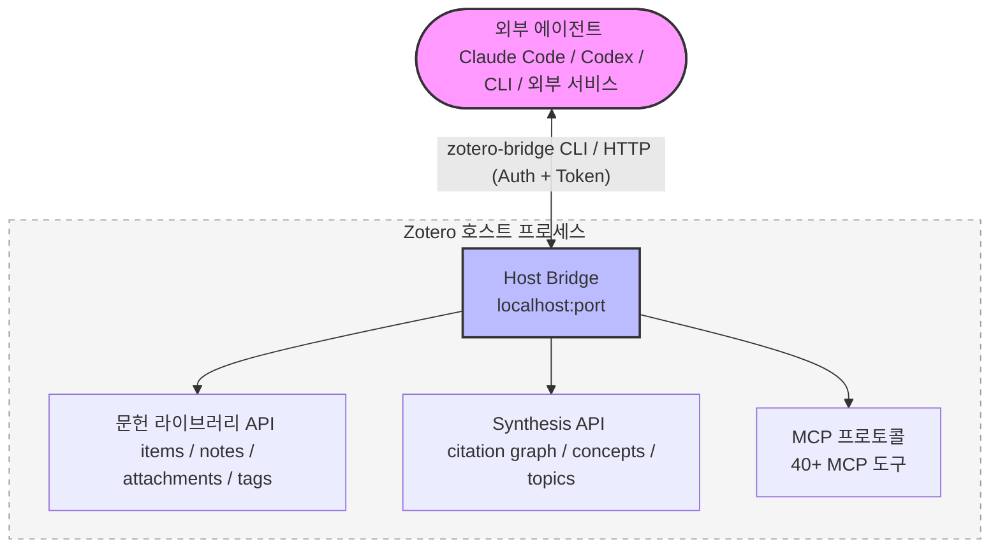
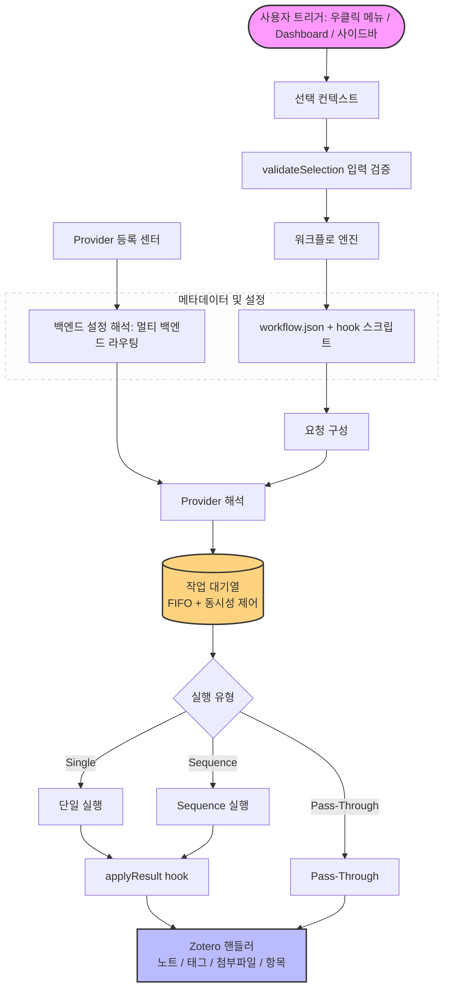

<!-- hero banner -->
<p align="center">
  
</p>

<p align="center">
  
</p>

<h1 align="center">Zotero Agents</h1>

<p align="center">
  <a href="https://github.com/leike0813/zotero-agents/releases"></a>
  
  <a href="https://github.com/leike0813/zotero-agents/blob/main/LICENSE"></a>
  
</p>

<p align="center">
  <a href="README.md">English</a> ·
  <a href="README-zhCN.md">简体中文</a> ·
  <a href="README-zhTW.md">繁體中文</a> ·
  <a href="README-jaJP.md">日本語</a> ·
  <a href="README-frFR.md">Français</a> ·
  <a href="README-de.md">Deutsch</a> ·
  <a href="README-esES.md">Español</a> ·
  <a href="README-ptBR.md">Português</a> ·
  <strong>한국어</strong> ·
  <a href="README-itIT.md">Italiano</a> ·
  <a href="README-ruRU.md">Русский</a> ·
  <a href="https://leike0813.github.io/zotero-agents/">📖 문서</a> ·
  <a href="https://github.com/leike0813/zotero-agents">GitHub</a> ·
  <a href="https://gitee.com/leike0813/zotero-agents">Gitee</a>
</p>

> 💡 v0.5.0-alpha부터 본 플러그인의 이름이 **Zotero Skills**에서 **Zotero Agents**로 변경되었습니다.

---

<p align="center">
  <strong>당신의 Zotero 문헌 컬렉션, 이제 AI 에이전트가 구동합니다.</strong><br/>
  <sub>문헌 검색, 분석, 관리, 종합, 글쓰기 준비를 감사 가능하고 추적 가능하며 재사용 가능한 연구 지식으로 체계화합니다.</sub>
</p>

<p align="center">
  <a href="https://leike0813.github.io/zotero-agents/getting-started">
    
  </a>
  &nbsp;
  <a href="https://github.com/leike0813/zotero-agents/releases">
    
  </a>
</p>

---

Zotero Agents는 Zotero 문헌 컬렉션을 위한 **올인원 에이전트 워크벤치**입니다. 질문하고 답하는 방식의 챗 어시스턴트가 아니라, AI 에이전트가 직접 당신의 문헌 컬렉션에서 작업하여, 논문을 '읽고 잊는 PDF'에서 **탐색 가능하고, 감사 가능하고, 축적 가능한 연구 지식 네트워크**로 변환합니다.

**문헌은 에이전트에게 맡기세요. 당신은 의사결정만 하면 됩니다.** 문헌 분석 — AI가 자동으로 초록, 참고문헌, 인용 분석을 추출하여 한 번의 실행으로 3개의 구조화된 노트를 생성합니다. 문헌 검색 및 등록 — 에이전트가 온라인에서 검색하고, 후보를 선별하고, 확인 후 하나씩 등록합니다. 태그 정규화 — 당신이 정의한 통제 어휘에 기반하여 태그를 자동으로 정리하고 추론합니다. 심층 읽기 — 당신의 문헌 컬렉션 지식을 더해 정교한 HTML 정독 문서를 생성합니다. 주제 종합 — 하나의 연구 방향을 기반으로 기초 문헌, 최전선 연구, 핵심 논점, 방법론적 차이를 정리하여 한 번으로 끝나는 종합 보고서를 산출합니다.

이 뒤에는 세 개의 연계 작동 하위 시스템이 있습니다: **플러그인 가능한 워크플로 엔진**(모든 비즈니스 로직이 독립 패키지로 게시·설치되며, 플러그인 자체는 결합되지 않음), **Synthesis Workbench**(인용 그래프, 개념 지식 베이스, 주제 맵 — 개별 분석을 장기 지식층으로 통합), 그리고 **Host Bridge**(CLI + MCP로 외부 에이전트가 Zotero 라이브러리를 읽고 쓸 수 있으며, 연구 작업을 백그라운드에서 지속적으로 실행되는 자동화 파이프라인에 위임).

---

| 🔧 | 💬 | 🔬 | 🔌 |
|:--:|:--:|:--:|:--:|
| **플러그인 가능한 워크플로** | **어시스턴트 사이드바** | **Synthesis Workbench** | **Host Bridge** |
| 논문 분석, 심층 읽기, 태그 정규화, 주제 종합 — 확장 가능한 흐름으로 구성 | ACP를 통해 에이전트와 연결하여 문헌, 항목, 라이브러리에서 협력 | 인용 네트워크, 개념, 태그, 주제 종합을 관리하고 지식층을 지속적으로 축적 | CLI + MCP로 외부 에이전트가 Zotero 컨텍스트를 읽고 분석 결과를 기록 |

---

## 빠른 탐색

| 당신은…                           | 여기서 시작하세요                                              |
| --------------------------------- | -------------------------------------------------------------- |
| 🔰 신규 사용자, 기능을 알고 싶음 | → [3단계 빠른 시작](#3단계-빠른-시작)                          |
| 📄 논문을 빠르게 처리하고 싶음 (초록, 해설) | → [핵심 워크플로](#핵심-워크플로)                              |
| 📊 문헌 리뷰를 하고 있으며 체계적 지식이 필요함 | → [문헌 종합 워크벤치](#문헌-종합-워크벤치)                    |
| 💬 AI와 문헌에 관해 대화하고 싶음 | → [AI 상호작용 패널](#ai-상호작용-패널)                        |
| 💰 AI 비용 및 엔진 선택이 concern | → [AI 엔진 및 비용](#ai-엔진-및-비용)                          |
| 🔌 외부 통합, 에이전트가 라이브러리를 읽게 하고 싶음 | → [Host Bridge 및 MCP 서버](#host-bridge--mcp-서버)        |
| 🛠 개발자, 확장 또는 기여를 원함 | → [아키텍처 개요](#아키텍처-개요) · [개발자 문서](#개발자-문서) |
| 📚 전체 사용 매뉴얼이 필요함 | → [사용자 문서 사이트](https://leike0813.github.io/zotero-agents/) |

---

## 설치 및 설정

### 시스템 요구 사항

- [Zotero 9](https://www.zotero.org/download/) 또는 [Zotero 7](https://www.zotero.org/download/) (버전 ≥ 6.999)
- ACP 백엔드 사용 시: 해당 Agent CLI 도구가 로컬에 설치되어 있어야 함 (`npx` 자동 설치도 가능)
- Skill-Runner 백엔드 사용 시: [Skill-Runner](https://github.com/leike0813/Skill-Runner) 인스턴스가 배포되어 있어야 함

> **Zotero 버전에 대하여**: 본 플러그인은 Zotero 9에서 개발 및 테스트됩니다. Zotero 8은 이론상 완전 지원 가능합니다 (Zotero 8/9의 플러그인 프레임워크에 큰 변화가 없음). Zotero 7도 이론상 지원 가능하나, 인력 관계로 심층 테스트를 진행하지 않았으며 향후 유지보수 중점은 Zotero 9에 있을 예정입니다. Zotero 7에서 문제 발생 시 [Issues](https://github.com/leike0813/zotero-agents/issues)에 보고해 주십시오.

### 백엔드 유형

| 백엔드 유형 | 추천도 | 용도 | 설정 방법 |
|------------|--------|------|----------|
| **ACP** | 🥇首選 | Agent CLI (Codex, OpenCode, Claude Code, Gemini CLI, Qwen Code)에 직접 연결, 추가 설정 불필요 | Backend Manager에서 프리셋으로 추가 |
| **Skill-Runner (Docker)** | 🥈권장 | 상주 서비스, Zotero 시작/종료와 무관, LAN 공유 지원 | Docker compose up 후 Backend Manager에서 URL 입력 |
| **Skill-Runner (원클릭 배포)** | 🥉비상 | 플러그인과 함께 시작/종료, Zotero 종료 시 모든 작업 중단 | 기본 설정에서 원클릭 Deploy |

> 또한 플러그인은 **Generic HTTP**(임의의 HTTP API 호출, 예: MinerU 서비스)와 **Pass-Through**(순수 로컬 작업, 예: 노트 내보내기/가져오기) 두 가지 백엔드 유형을 내장하고 있으며, 특정 워크플로에서 자동으로 사용되므로 별도로 신경쓸 필요가 없습니다.

---

## 3단계 빠른 시작

### 1️⃣ 플러그인 설치

[Releases](https://github.com/leike0813/zotero-agents/releases)에서 `.xpi` 파일을 다운로드 → Zotero `도구` → `부가기능` → ⚙️ → `파일로부터 부가기능 설치…` → Zotero 재시작.

### 2️⃣ AI 백엔드 설정

> 🥇 **ACP를 권장합니다** — Codex / OpenCode / Claude Code 등 ACP를 지원하는 Agent 도구가 로컬에 설치되어 있다면, 제로 설정으로 바로 사용할 수 있습니다.

**방법 A — ACP 에이전트 직접 연결 (권장)**

`도구` → `Backend Manager` → ACP 탭 → **Add from Preset**에서 Agent 도구 선택 → 저장. 어떤 파라미터도 입력할 필요가 없습니다.

**방법 B — Docker로 Skill-Runner 배포 (백그라운드 상주가 필요할 때)**

사용자 머신에 [Skill-Runner를 Docker로 배포](https://leike0813.github.io/zotero-agents/backends/skill-runner#推荐docker-常驻部署)한 후, 백엔드 관리자에 SkillRunner 인스턴스를 추가하고 Base URL을 입력합니다.

> 참고: 원클릭 배포 로컬 백엔드는 Agent / Docker 설치를 전혀 모르는 사용자에게만 적합합니다. Zotero를 닫으면 모든 작업이 중단됩니다.

### 3️⃣ 우클릭으로 실행

Zotero 문헌 목록에서 **논문을 우클릭**하고 `Zotero Agents` → `문헌 분석`을 선택합니다. 몇 분 후, 노트 패널에서 AI가 생성한 초록, 참고문헌 목록, 인용 분석을 확인할 수 있습니다.

> 자세한 설정 및 사용 방법은 [온라인 문서 사이트](https://leike0813.github.io/zotero-agents/)를 참조하십시오.

---

## 핵심 워크플로

매일 사용하는 기능, 논문에서 우클릭으로 실행합니다.

| 기능 | 설명 | 실행 방법 |
|------|------|----------|
| 📊 **문헌 분석** | AI가 자동으로 논문 초록을 생성하고, 참고문헌을 추출하고, 인용 분석 보고서를 출력합니다. 태그 정규화를 캐스케이드 실행할 수 있습니다 | 논문 우클릭 → `문헌 분석` |
| 💬 **대화형 문헌 해설** | 다단계 대화를 통해 논문을 심층 이해합니다. AI 답변은 검증 게이트를 통과하며, 불확실한 답변은 명시적으로 알림 처리되어 환각 문제를 걱정할 필요가 없습니다. 대화 기록을 학습 노트로 생성할 수 있습니다 | 논문 우클릭 → `문헌 해설` |
| 📖 **심층 읽기** | 구조화된 정독 뷰를 생성하며, 다단계 번역과 개념 해석을 지원합니다 | 논문 우클릭 → `심층 읽기` |
| 🌱 **태그 어휘 초기화** | AI와 대화식으로 연구 분야의 통제 태그 어휘를 생성합니다. 문헌 분석을 시작하기 전에 먼저 초기화하는 것을 권장합니다 | Dashboard → `Tag Bootstrapper` |
| 🏷️ **태그 정규화** | 통제 어휘에 기반하여 태그를 자동으로 정리하고, AI가 새 태그를 추론한 후 검토를 기다립니다 | 항목 우클릭 → `태그 정규화` |
| 🔎 **문헌 검색 및 등록** | 에이전트가 문헌 라이브러리를 빠르게 확장하도록 합니다: 검색, 선별, 확인 후 직접 등록 | Dashboard → `문헌 검색 및 등록` |
| 📋 **PDF 파싱** | PDF를 Markdown으로 변환 (MinerU 서비스 호출) | PDF 우클릭 → `MinerU` |
| 📤 **노트 내보내기/가져오기** | 초록과 노트를 Markdown으로 일괄 내보내기하거나, 외부 노트를 가져옵니다 | 선택한 항목 우클릭 → 내보내기/가져오기 |

> **💡 산출물 노트에 대하여**: 문헌 분석의 산출물(초록, 참고문헌, 인용 분석)은 Note 첨부파일 형태로 상위 항목에 추가됩니다. 노트에 표시되는 내용은 백엔드 데이터에서 **렌더링**된 것이므로, 노트 내용을 직접 수정해도 백엔드 데이터는 변경되지 않습니다. 편집이 필요한 경우 '노트 내보내기'로 내보내기 → 수정 → '노트 가져오기'로 다시 가져오기 하십시오.

<p align="center">
<table>
<tr>
<td width="33%" align="center"><br/><sub>Digest — 문헌 초록</sub></td>
<td width="33%" align="center"><br/><sub>References — 참고문헌</sub></td>
<td width="33%" align="center"><br/><sub>Citation Analysis — 인용 분석</sub></td>
</tr>
</table>
</p>

---

## 권장 워크플로

처음부터 문헌 리뷰를 작성하기까지, 다음 순서로 진행하는 것을 권장합니다:

### 📋 1단계: 태그 어휘 구축

문헌 분석을 시작하기 전에, 먼저 **Tag Bootstrapper**로 연구 분야의 통제 태그 어휘를 초기화하는 것을 권장합니다. 이렇게 하면 이후 문헌 분석에서 각 논문의 태그를 자동으로 정리할 수 있습니다.

```
Dashboard → Tag Bootstrapper → AI와 대화식으로 연구 분야 태그 체계 정의
```

### 📥 2단계: 등록 및 분석

**문헌 분석은 에이전트 기반 문헌 관리의 핵심**입니다 — 등록된 모든 문헌에 대해 실행해야 합니다.

```
원문 PDF 입수
  → PDF 우클릭 → MinerU (Markdown으로 변환, 최상의 효과)
  → 논문 우클릭 → 문헌 분석
     └── AI가 자동으로 초록 + 참고문헌 + 인용 분석 생성
     └── 동시에 태그 정규화 자동 실행 (기본 활성화, 유지 권장)
```

> **💡 문헌 라이브러리 확장**: 대량의 관련 문헌을 빠르게 보충해야 하나요? **문헌 검색 및 등록**을 사용하여 에이전트가 검색, 선별, 일괄 등록하도록 하십시오.

### 🔗 3단계: 인용 중복 제거 및 그래프

문헌 라이브러리가 일정 규모에 도달하고 모두 분석을 완료한 후:

```
Synthesis Workbench → Index 페이지 열기
  → Advance Matching 실행 (고급 매칭 알고리즘으로 인용 문헌 중복 제거)
  → Review 페이지로 이동하여 승인 항목 처리 (불확실한 매칭은 수동 확인 필요)
  → ⚠️ 보류 중인 결정을 '적용'하는 것을 잊지 마십시오!
  → Graph 페이지 열기 → 완전하고 정확한 인용 그래프를 확인할 수 있습니다 ✨
```

> 정확한 그래프 관계는 각 문헌의 중요도(Pagerank, frontier score 등)를 계산하는 데 도움이 되며, 이는 이후 주제 종합의 품질에 직접적인 영향을 미칩니다.

### 📊 4단계: 주제 종합 생성

문헌이 충분히 확보되고 모두 분석과 Advance Matching을 완료했다고 판단되면:

```
Dashboard → Create Topic Synthesis → 주제 시드 입력
  → 에이전트가 자동으로 3단계 파이프라인 실행 (준비 → 핵심 보강 → 최종본)
  → Synthesis Workbench → Topics 페이지 열기
  → 전문적이고 세밀하며 정교한 주제 가이드 확인 ✨
```

<p align="center">
  
</p>

### ✍️ 5단계: 문헌 리뷰 생성

연구 아이디어가 있고 관련 분야의 연구 동향을 파악하고 요약하고 싶을 때:

```
문헌 수집 및 등록 → 문헌 분석 실행 → 여러 주제 생성
  → Dashboard → Manuscript Literature Framing
  → 에이전트와 대화하여 논문 포지셔닝과 글쓰기 스타일 결정
  → Introduction + Related Work의 LaTeX 초안 생성
  → Dashboard의 산출물 영역에서 다운로드
  → LaTeX 원고에 직접 삽입하거나 내보내기 후 추가 가공
```

### 💡 더 많은 시나리오

<details>
<summary><b>논문에 대해 궁금한 점이 있나요? 대화형 문헌 해설</b></summary>

논문 우클릭 → `문헌 해설` → Dashboard에서 AI와 대화식 토론. 환각 문제를 걱정하지 마십시오 — AI의 답변은 반드시 **검증 게이트**를 통과하며, 불확실한 답변은 명시적으로 알림 처리됩니다. 대화 종료 후 질의응답 기록을 학습 노트로 생성하여 Note 첨부파일로 저장할 수 있습니다.

</details>

<details>
<summary><b>문헌을 컨텍스트로 AI와 자유 대화</b></summary>

논문 선택 → 사이드바 ACP Chat 열기 → 백엔드 선택 → 논문 내용을 중심으로 자유 대화. Host Bridge가 자동으로 문헌 컨텍스트를 제공하며, 모델/모드 전환을 지원합니다.

</details>

<details>
<summary><b>인용 추적 및 그래프 분석</b></summary>

Synthesis Workbench → Graph 페이지 열기 → 핵심 논문 검색 → Radial 레이아웃으로 전환하여 해당 논문을 중심으로 전개 → 인용/피인용 관계, PageRank, frontier score 지표 확인.

</details>

<details>
<summary><b>팀 태그 규범</b></summary>

Tag Bootstrapper로 어휘 초기화 → 논문 일괄 선택 → 태그 정규화 → AI가 제안한 태그는 Staged 검토를 통해 어휘에 추가 → 어휘를 WebDAV를 통해 팀원에게 동기화.

</details>

---

## 문헌 종합 워크벤치

흩어진 논문을 **탐색 가능한 지식 네트워크**로 변환합니다. 이것이 본 플러그인이 다른 Zotero AI 도구와 근본적으로 다른 점입니다.

> 핵심 워크플로는 논문을 **읽는** 것을 돕고, 문헌 종합 워크벤치는 지식을 **조직하는** 것을 돕습니다.

워크벤치는 Zotero의 완전한 Workspace 탭으로, 8개의 Surface를 포함합니다:

| Surface | 기능 |
|---------|------|
| **Home** | 문헌 라이브러리 개요 대시보드: 라이브러리 인사이트 카드, 동기화 상태 패널, 검토 항목 요약, 인기 주제 진입점 |
| **Topics** | 주제 관리 (생성/업데이트/탐색), 그래프/그리드/리스트 세 가지 뷰 지원 |
| **Index** | 정규 참고문헌 색인: 논문 등록부 + 인용 바인딩 + 병합/중복 제거/리다이렉트 |
| **Review** | 검토 센터: 인용 매칭 검토, 개념 검토, 주제 그래프 관계 검토 (수락/거절/일괄 작업) |
| **Graph** | 인용 그래프 시각화 (force-directed/radial/component 레이아웃), 주제 필터링 및 지표 분석 지원 |
| **Tags** | 통제 태그 어휘 관리 + AI 태그 제안 승인 (Promote/Discard) |
| **Concepts** | 개념 지식 베이스: 개념/의미/별칭/관계 4계층 구조, 주제 그래프와 리더에 중첩 가능 |
| **Reader** | 주제 심층 리더: Overview / Taxonomy / Claims / Compare / Future Directions / Coverage / References / Report |

워크벤치는 **WebDAV 동기화**를 내장하고 있어, 태그 어휘, 주제 종합, 개념 지식 베이스 등의 구조화된 데이터를 WebDAV 프로토콜을 통해 원격으로 동기화하여 경량 크로스 디바이스 동기화 및 백업을 구현합니다.

<table>
<tr>
<td width="50%"></td>
<td width="50%"></td>
</tr>
</table>

---

## AI 상호작용 패널

v0.5.0에서는 완전한 AI 상호작용 사이드바가 추가되었으며, 세 가지 상호작용 모드를 제공합니다:

<table>
<tr>
<td width="33%" align="center"><br/><sub>💬 ACP Chat — 문헌 라이브러리를 컨텍스트로 한 지속 대화</sub></td>
<td width="33%" align="center"><br/><sub>⚙️ ACP Skills — ACP 프로토콜로 로컬 에이전트를 연결하여 워크플로 실행</sub></td>
<td width="33%" align="center"><br/><sub>🔧 SkillRunner — 호스팅 Skill-Runner 서비스 백엔드와 통신</sub></td>
</tr>
</table>

---

## Host Bridge & MCP 서버

Zotero가 시작되면 플러그인이 자동으로 로컬 Host Bridge 서비스를 실행합니다. 외부 AI 도구(Codex, OpenCode 등)가 **직접 Zotero 문헌 라이브러리에 접근**할 수 있습니다 — 논문 읽기, 항목 검색, 태그 관리, 워크플로 트리거까지.

| 기능 | 설명 |
|------|------|
| 🔌 **라이브러리 접근** | 외부 에이전트가 Zotero 항목, 노트, 첨부파일, 태그, 컬렉션을 직접 읽음 |
| ⚡ **워크플로 트리거** | Bridge API를 통해 AI 워크플로를 원격 트리거 |
| 📊 **Synthesis 조회** | 인용 그래프, 주제, 개념 지식 베이스, 참고문헌 색인 조회 |
| 🖥 **MCP 도구** | 내장 MCP 서버로 ACP 에이전트에 구조화된 Zotero 작업 도구 제공 |
| 🔒 **보안** | 토큰 인증 + 쓰기 작업 승인, 데이터는 로컬을 떠나지 않음 |



Host Bridge CLI(`zotero-bridge`)는 20개 이상의 서브커맨드를 제공하며, Windows / macOS / Linux(ARM 포함)를 지원합니다.

---

## 플러그인 가능한 워크플로 엔진

플러그인 자체는 구체적인 비즈니스 로직을 포함하지 않습니다 — 모든 AI 기능은 **외부 워크플로 패키지**를 통해 통합됩니다.

- 📦 **플러그 앤 플레이**: 워크플로 패키지를 디렉터리에 넣으면 바로 사용 가능, 재빌드 불필요
- 📝 **선언적 정의**: `workflow.json` 매니페스트 + 소수의 hook 스크립트로 '무엇을 할지' 기술
- 🔗 **Sequence 오케스트레이션**: 여러 Skill을 순차적으로 연결하며, handoff, 작업 공간 격리, 조기 종료를 지원
- 🌐 **멀티 백엔드 라우팅**: 동일한 워크플로를 Skill-Runner, ACP, HTTP 등 다양한 백엔드에서 실행 가능
- 🌍 **다국어**: 워크플로는 i18n을 내장하여, UI 텍스트가 Zotero 언어에 따라 자동 전환
- ✅ **선언적 입력 검증**: `validateSelection` — JS 작성 없이 입력 조건을 제약

> 완전한 커스텀 워크플로 개발 가이드는 [사용자 문서 사이트](https://leike0813.github.io/zotero-agents/workflows/custom/)에서 확인할 수 있습니다.

---

## 내장 Markdown 리더

플러그인은 경량 Markdown 리더를 내장하고 있습니다. Zotero에서 **`.md` 첨부파일을 더블클릭**하면 내장 리더에서 열리며, 외부 애플리케이션으로 전환할 필요가 없습니다.

| 기능 | 설명 |
|------|------|
| 📑 **개요 탐색** | 제목 계층(h1-h4)을 자동 분석하여 사이드바에 탐색 가능한 개요 표시 |
| 🔍 **검색** | 전문 키워드 검색, 적중 부위를 하이라이트 |
| 📐 **수학 공식** | KaTeX로 LaTeX 공식을 렌더링, 인라인 및 블록 수준 공식 지원 |
| 💻 **코드 하이라이팅** | highlight.js 구문 하이라이팅, 주요 프로그래밍 언어 지원 |
| 🔤 **글꼴 크기 조절** | 12px-24px 조절 가능, 다양한 화면과 독서 습관에 적합 |
| 📏 **너비 전환** | 좁은 열(860px)과 넓은 열(1160px) 두 가지 읽기 너비 지원 |
| 📋 **복사** | Markdown 원문을 클립보드로 복사 및 파일 경로 복사 지원 |
| 📂 **시스템에서 열기** | 원클릭으로 시스템 기본 애플리케이션으로 해당 파일 열기 |
| 🌗 **자동 테마** | Zotero의 라이트/다크 테마에 자동 적응, 수동 전환 불필요 |

리더는 `markdown-it`로 렌더링되며, 내장 HTML 새니타이저가 안전한 렌더링을 보장합니다. 기본 설정에서 이 기능을 끄고 시스템 기본 열기 방식으로 되돌릴 수 있습니다.

<p align="center">
  
</p>

---

## v0.5.0 주요 변경 사항

> v0.4.0에서 v0.5.0까지 **42개 커밋**을 거쳐, 'Skill-Runner 프론트엔드'에서 '범용 에이전트 실행 프레임워크'로의 전면적 진화를 이루었습니다.

<table>
<tr>
<td width="50%">

### ✨ 신규

- **ACP 백엔드** — Codex, OpenCode, Claude Code, Gemini CLI, Qwen Code 등 Agent CLI에 직접 연결
- **ACP Chat 패널** — 문헌을 컨텍스트로 한 지속 대화, 모델/모드 전환 및 Token 사용량 시각화 지원
- **ACP Skill Runs 패널** — 스킬 실행 전 과정 모니터링, 트랜스크립트, 권한 승인, 출력 미리보기 포함
- **문헌 종합 워크벤치** — 완전한 Synthesis Workbench, 8대 Surface
- **인용 그래프** — force-directed/radial/component 레이아웃, 주제 필터링 및 지표 계산 지원
- **개념 지식 베이스** — 개념/의미/별칭/관계 4계층 구조, 주제 그래프에 중첩 가능
- **심층 읽기** — 개념 커버리지와 인용 컨텍스트가 포함된 구조화된 정독 뷰
- **Host Bridge + MCP 서버** — Zotero를 프로그래밍 가능한 서비스로 전환
- **내장 Markdown 리더** — `.md` 첨부파일 더블클릭으로 내장 리더에서 열기, 개요 탐색, 검색, 수학 공식, 코드 하이라이팅 지원
- **Sequence 실행** — 여러 Skill을 순차적으로 연결, 중간 결과 전달 지원
- **Backend Manager 대화상자** — 모든 백엔드 설정을 통합 관리
- **WebDAV 동기화** — 경량 Synthesis 데이터 크로스 디바이스 동기화

</td>
<td width="50%">

### ♻️ 개선

- **Dashboard 전면 재설계** — 백엔드 뷰, 산출물 탐색기, Skill Feedback, 로그 진단 내보내기 추가
- **선언적 선택 검증** — `validateSelection`이 명령형 `filterInputs`를 대체, JS 없이 입력 제약 정의
- **SkillRunner 연결 거버넌스** — 연결 밀도 최적화, 사전 요청 상태 시각화, 장애 복구 강화
- **다국어 UI** — Synthesis Workbench와 워크플로 시스템이 중/영/프/일을 지원
- **크로스 플랫폼 CLI** — Host Bridge CLI에 Linux ARM/ARM64/x86 사전 컴파일 추가
- **런타임 데이터 관리** — 기본 설정에서 저장 용량 확인 및 다양한 캐시 데이터 정리 가능
- **Skill Run Feedback** — 성공적인 실행 후 AI 피드백 보고서 자동 수집

</td>
</tr>
</table>

---

## 공식 워크플로

<details>
<summary>전체 워크플로 목록 펼치기</summary>

### 문헌 처리

| 워크플로 | 백엔드 | 설명 |
|---------|--------|------|
| **문헌 분석** ⭐ | `skillrunner` | 초록 + 참고문헌 + 인용 분석 노트 생성. 태그 정규화를 캐스케이드 실행할 수 있음 (기본 활성화) |
| **문헌 해설** | `skillrunner` | 다단계 대화형 문헌 이해, 답변은 검증 게이트를 통과하여 환각 방지. 기록을 학습 노트로 저장 가능 |
| **심층 읽기** | `acp` | 구조화된 정독 뷰(HTML), 개념 커버리지와 인용 컨텍스트 포함 |
| **문헌 검색 및 등록** | `acp` | 에이전트가 문헌을 검색, 선별하며, 확인 후 직접 등록 |
| **MinerU** | `generic-http` | PDF → Markdown 변환 (MinerU 서비스 호출) |

### 종합 및 정리

| 워크플로 | 백엔드 | 설명 |
|---------|--------|------|
| **주제 종합** | `acp` | 3단계 Sequence: 준비 → 핵심 보강 → 최종본. 에이전트가全自动 처리 |
| **원고 문헌 프레이밍** | `acp` | 대화식으로 Introduction + Related Work의 LaTeX 초안 생성 |
| **태그 어휘 초기화** | `skillrunner` | AI와 대화식으로 연구 분야의 통제 태그 어휘 생성. 먼저 실행하는 것을 권장 |
| **태그 정규화** | `skillrunner` | LLM 기반 태그 추론 + 통제 어휘 정규화 |

### 도구

| 워크플로 | 백엔드 | 설명 |
|---------|--------|------|
| **노트 내보내기** | `pass-through` | 초록/노트를 Markdown으로 일괄 내보내기 (수정 후 다시 가져오기 가능) |
| **노트 가져오기** | `pass-through` | 외부 Markdown을 Zotero 노트로 가져오기 |
| **Debug Probe** | 다수 | 13개의 디버그 프로브로 Sequence 실행, apply 계약, Host Bridge 연결 등을 검증 |

</details>

---

## AI 엔진 및 비용

본 플러그인은 어떤 AI 서비스 제공업체에도 종속되지 않습니다. 사용자의 구독额度, Coding Plan 또는 API Key를 사용하여 백엔드에 직접 연결합니다 — **중간 마진 없음, 토큰 추가 요금 없음**.

### Token 비용이 부담되나요?

좋은 소식: 본 프로젝트의 모든 Skill은 신중하게 설계되어 **약한 모델(심지어 로컬 배포 모델!)로도 놀라운 실행 결과를 달성**할 수 있습니다. 최고의 결과를 얻기 위해 가장 비싼 모델이 필요하지 않습니다.

### 비용 참고

| 방안 | 비용 | 설명 |
|------|------|------|
| **DeepSeek V4 Flash** | 약 ￥2/편 | 종량제. 문헌 분석 1편당 약 ￥2 미만 |
| **Coding Plan** | 월 고정 가격 | 운 좋게 종량제 Coding Plan(바이링, 즈푸 등)을 구매했다면, 저렴하게 문헌을 일괄 처리할 수 있습니다 — Coding Agent를 통해 호출하므로 **완전히 규정 준수** |
| **[OpenCode Go](https://opencode.ai/go?ref=SZDFT9GZKW)** | \$10/월 (첫 달 \$5) | 거의 무제한 DeepSeek V4 Flash配额. [이 링크](https://opencode.ai/go?ref=SZDFT9GZKW)를 통해 구독하면 사용자와 개발자 각각 \$5 할인 |
| **Codex 무료 버전** | 무료 | 모델은 제한되지만 여전히 우수한 결과를 도출 |

### 엔진 비교

| 엔진 | 적합한 시나리오 | 비용 | 추천도 |
|------|---------------|------|--------|
| **Codex** | 종합 최적, 속도와 품질을 겸비. 사고 흐름 시각화 지원 | 무료 버전 사용 가능 (모델 제한) | ⭐⭐⭐首选 |
| **Opencode** | Coding Plan 또는 [OpenCode Go](https://opencode.ai/go?ref=SZDFT9GZKW)와 함께, Qwen3.5-Plus / Kimi-K2.5 / GLM-5 등 모델이 문헌 작업에서 우수한 성능 | 저비용 | ⭐⭐³ 강력 추천 |
| **Qwen Code** | 알리바바 생태계 사용자, 바이링 Coding Plan과 함께 | 무료配额 종료, Plan에 의존 | ⭐² 선택 사항 |
| **Gemini CLI** | 간단한 작업 | 무료 버전 사용 가능 | ⭐ 보통 |
| **Claude Code** | 지시 실행 품질이 높으나, 효율성이 낮음 | 유료 | 필요에 따라 선택 |

> 각 엔진의 상세 배포 가이드는 [사용자 문서 사이트](https://leike0813.github.io/zotero-agents/backends/skill-runner#引擎系统)에서 확인할 수 있습니다.

---

## 아키텍처 개요

<details>
<summary>아키텍처 다이어그램 펼치기</summary>



핵심 설계 이념: 플러그인 자체는 구체적인 비즈니스 로직을 포함하지 않는 **실행 셸**입니다. 선언적 `workflow.json` 매니페스트와 hook 스크립트로 '무엇을 할지'를 정의하고, 플러그인이 '어떻게 실행할지'를 담당합니다.

</details>

더 자세한 아키텍처 세부 정보는 [사용자 문서 사이트: 커스텀 워크플로](https://leike0813.github.io/zotero-agents/workflows/custom/)를 참조하십시오.

---

## 전환 버전 안내

> **v0.5.0-alpha는 'Zotero Agents'로 개명 후 첫 번째 중요한 마일스톤입니다.** v0.4.0(순수 Skill-Runner 프론트엔드)에 비해, v0.5.0은 범용 에이전트 실행 프레임워크로의 전면적 전환을 완성했습니다 — ACP 백엔드 지원, 문헌 종합 워크벤치, 인용 그래프, 개념 지식 베이스, Host Bridge, MCP 서버 등 핵심 기능이 추가되었으며, 일상 연구에서 안정적으로 사용할 수 있습니다.

### ⚠️ 알려진 제한 사항

| 제한 사항 | 설명 | 계획 |
|----------|------|------|
| **Synthesis 재계산이 UI를 블로킹** | 색인 갱신, Citation Graph 재구축, Advance Matching 등의 작업은 계산량이 많아 Zotero 단일 호스트 프로세스 아키텍처에서 UI가 일시적으로 멈출 수 있습니다. 실행 시 기다려 주십시오 | 향후 리팩토링에서 해결 예정 |
| **WebDAV 동기화는 아직 완전히 테스트되지 않음** | 자동 동기화 기능은 아직 충분히 테스트되지 않았으며, 사용할 경우 수동 동기화만 사용하십시오 | 이후 버전에서 개선 예정 |
| **대형 문헌 라이브러리 성능** | 대규모 문헌 라이브러리에서 충분한 성능 테스트를 아직 진행하지 않았습니다 | 이후 업데이트에서 해결 예정 |

### 향후 계획

- 다국어 지원 및 사용자 가이드 개선
- 크로스 백엔드 일관성 경험 향상
- Synthesis 재계산 UI 응답성 최적화
- 안정성과 성능 지속 개선

> 문제가 발생하면 [Issues](https://github.com/leike0813/zotero-agents/issues)에 보고해 주십시오.

---

## 개발자 문서

<details>
<summary>개발 가이드 펼치기</summary>

### 로컬 개발

```bash
npm install          # 의존성 설치
npm start            # 개발 서버 시작
npm test             # lite 테스트 실행
npm run test:full    # 전체 테스트 실행
npm run build        # 프로덕션 빌드
```

### 문서 색인

| 문서 | 설명 |
|------|------|
| [아키텍처 흐름](doc/architecture-flow.md) | 실행 파이프라인 개요 (Mermaid 흐름도 포함) |
| [개발 가이드](doc/dev_guide.md) | 핵심 컴포넌트, 설정 모델, 실행 체인 |
| [워크플로 컴포넌트](doc/components/workflows.md) | 매니페스트 스키마, hook, 입력 필터링, 실행 시맨틱 |
| [Provider 컴포넌트](doc/components/providers.md) | Provider 계약 시스템, 요청 유형 |
| [테스트 전략](doc/testing-framework.md) | 이중 실행 환경, lite/full 모드, CI 게이트 |
| [Synthesis 레이어](doc/synthesis-layer/README.md) | 지식 그래프, 인용 그래프, 개념 지식 베이스의 내부 설계 |

</details>

---

## 사용자 문서

전체 사용 매뉴얼은 온라인 문서 사이트를 참조하십시오: [https://leike0813.github.io/zotero-agents/](https://leike0813.github.io/zotero-agents/)

다음을 포함합니다: 설치, 백엔드 설정, Backend Manager, 워크플로 호출, Dashboard, 사이드바(ACP Chat / ACP Skills / SkillRunner), Synthesis Workbench, WebDAV 동기화, 기본 설정, 커스텀 워크플로 개발 등 모든 기능.

---

## 라이선스

[AGPL-3.0-or-later](LICENSE)

## 감사의 말

- [Zotero Plugin Template](https://github.com/windingwind/zotero-plugin-template)을 기반으로 구축
- [zotero-plugin-toolkit](https://github.com/windingwind/zotero-plugin-toolkit) 사용
- [@windingwind](https://github.com/windingwind)의 플러그인 생태계 지원
