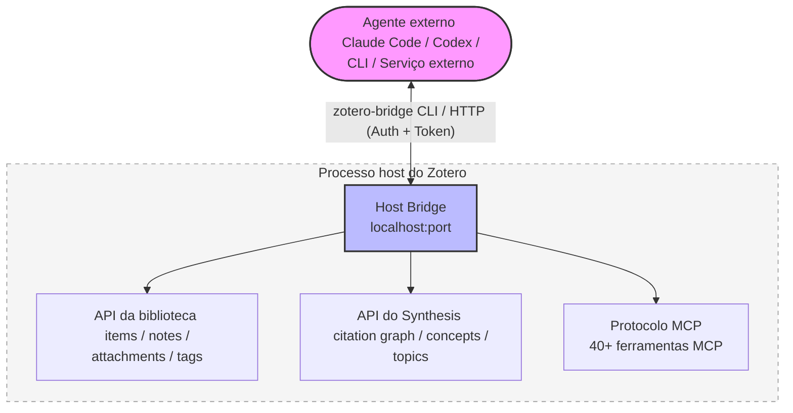
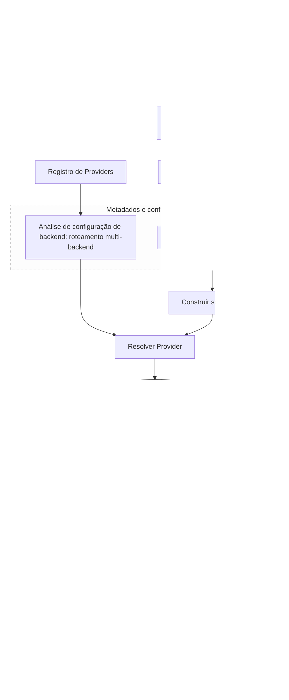

<!-- hero banner -->
<p align="center">
  
</p>

<p align="center">
  
</p>

<h1 align="center">Zotero Agents</h1>

<p align="center">
  <a href="https://github.com/leike0813/zotero-agents/releases"></a>
  
  <a href="https://github.com/leike0813/zotero-agents/blob/main/LICENSE"></a>
  
</p>

<p align="center">
  <a href="README.md">English</a> ·
  <a href="README-zhCN.md">简体中文</a> ·
  <a href="README-zhTW.md">繁體中文</a> ·
  <a href="README-jaJP.md">日本語</a> ·
  <a href="README-frFR.md">Français</a> ·
  <a href="README-de.md">Deutsch</a> ·
  <a href="README-esES.md">Español</a> ·
  <strong>Português</strong> ·
  <a href="README-koKR.md">한국어</a> ·
  <a href="README-itIT.md">Italiano</a> ·
  <a href="README-ruRU.md">Русский</a> ·
  <a href="https://leike0813.github.io/zotero-agents/">📖 Documentação</a> ·
  <a href="https://github.com/leike0813/zotero-agents">GitHub</a> ·
  <a href="https://gitee.com/leike0813/zotero-agents">Gitee</a>
</p>

> 💡 A partir da v0.5.0-alpha, este plugin passou de **Zotero Skills** para **Zotero Agents**.

---

<p align="center">
  <strong>Sua biblioteca Zotero, agora impulsionada por agentes de IA.</strong><br/>
  <sub>Transforme a busca, análise, gestão, síntese e preparação de textos em conhecimento de pesquisa auditável, rastreável e reutilizável.</sub>
</p>

<p align="center">
  <a href="https://leike0813.github.io/zotero-agents/getting-started">
    
  </a>
  &nbsp;
  <a href="https://github.com/leike0813/zotero-agents/releases">
    
  </a>
</p>

---

O Zotero Agents é uma **bancada de trabalho agêntica completa** para a sua biblioteca Zotero — não é um assistente de chat que responde perguntas pontuais, mas um sistema que permite aos agentes de IA trabalhar diretamente na sua biblioteca, transformando artigos de «PDFs lidos e esquecidos» em uma **rede de conhecimento de pesquisa explorável, auditável e acumulativa**.

**Deixe os artigos nas mãos do agente; você só toma as decisões.** Análise de literatura — a IA extrai automaticamente resumos, referências e relatórios de citações, gerando três notas estruturadas a cada execução; busca e ingresso de literatura — o agente pesquisa online, filtra candidatos e os incorpora um a um após sua confirmação; normalização de tags — organiza e infere tags automaticamente com base em um vocabulário controlado que você define; leitura profunda — gera documentos HTML de leitura detalhada enriquecidos com o conhecimento da sua biblioteca; síntese por tópicos — em torno de uma linha de pesquisa, organiza a bibliografia fundamental, os trabalhos de vanguarda, os argumentos-chave e as divergências metodológicas, produzindo relatórios de revisão definitivos.

Por trás de tudo isso estão três subsistemas que trabalham em conjunto: um **motor de fluxos de trabalho conectável** (toda a lógica de negócio é publicada e instalada como pacotes independentes, sem acoplamento no plugin), o **Synthesis Workbench** (grafo de citações, base de conhecimento conceitual, mapa temático — que converte análises individuais em uma camada de conhecimento de longo prazo), e o **Host Bridge** (CLI + MCP para agentes externos lerem e escreverem na sua biblioteca Zotero, delegando tarefas de pesquisa a pipelines automatizados executados em segundo plano).

---

| 🔧 | 💬 | 🔬 | 🔌 |
|:--:|:--:|:--:|:--:|
| **Fluxos de trabalho conectáveis** | **Barra lateral do assistente** | **Synthesis Workbench** | **Host Bridge** |
| Análise de artigos, leitura profunda, normalização de tags, síntese temática — organizados em fluxos extensíveis | Conecte-se a agentes via ACP para colaborar em artigos, itens e bibliotecas | Gerencie redes de citações, conceitos, tags e síntese temática; a camada de conhecimento se consolida ao longo do tempo | CLI + MCP para agentes externos lerem o contexto do Zotero e escreverem os resultados da análise |

---

## Navegação rápida

| Você é…                           | Comece por aqui                                                |
| --------------------------------- | -------------------------------------------------------------- |
| 🔰 Novo usuário, quer saber o que é possível fazer | → [Início rápido em 3 passos](#início-rápido-em-3-passos) |
| 📄 Quer processar artigos rapidamente (resumos, análises) | → [Fluxos de trabalho principais](#fluxos-de-trabalho-principais) |
| 📊 Está fazendo uma revisão bibliográfica e precisa de conhecimento sistematizado | → [Bancada de trabalho de síntese](#bancada-de-trabalho-de-síntese) |
| 💬 Quer dialogar com a IA sobre a literatura | → [Painéis de interação com IA](#painéis-de-interação-com-ia) |
| 💰 Preocupa-se com custos de IA e escolha de motor | → [Motores de IA e custos](#motores-de-ia-e-custos) |
| 🔌 Quer integração externa para agentes lerem sua biblioteca | → [Host Bridge e servidor MCP](#host-bridge--servidor-mcp) |
| 🛠 É desenvolvedor e quer expandir ou contribuir | → [Visão geral da arquitetura](#visão-geral-da-arquitetura) · [Documentação para desenvolvedores](#documentação-para-desenvolvedores) |
| 📚 Precisa do manual de uso completo | → [Site de documentação](https://leike0813.github.io/zotero-agents/) |

---

## Instalação e configuração

### Requisitos do sistema

- [Zotero 9](https://www.zotero.org/download/) ou [Zotero 7](https://www.zotero.org/download/) (versão ≥ 6.999)
- Se usar o backend ACP: é necessário ter instalada localmente a ferramenta CLI do agente correspondente (também funciona com `npx` para instalação automática)
- Se usar o backend Skill-Runner: é necessário ter implantada uma instância do [Skill-Runner](https://github.com/leike0813/Skill-Runner)

> **Sobre a versão do Zotero**: Este plugin é desenvolvido e testado no Zotero 9. O Zotero 8 deve ser totalmente compatível (o framework de plugins do Zotero 8/9 não mudou significativamente); o Zotero 7 também deve funcionar em teoria, mas não foi testado a fundo por limitações de capacidade, e a manutenção futura se concentrará no Zotero 9. Se encontrar problemas no Zotero 7, relate-os em [Issues](https://github.com/leike0813/zotero-agents/issues).

### Tipos de backend

| Tipo de backend | Recomendação | Uso | Configuração |
|-----------------|--------------|-----|--------------|
| **ACP** | 🥇 Preferido | Conexão direta a CLI de agentes (Codex, OpenCode, Claude Code, Gemini CLI, Qwen Code), sem configuração adicional | Adicionar a partir de presets no Backend Manager |
| **Skill-Runner (Docker)** | 🥈 Recomendado | Serviço persistente, independente do ciclo do Zotero, compatível com uso em rede local | Docker compose up; em seguida, preencher a URL no Backend Manager |
| **Skill-Runner (implantação com um clique)** | 🥉 Emergência | Inicia e para com o plugin; ao fechar o Zotero, todas as tarefas são canceladas | Implantação com um clique nas Preferências |

> Além disso, o plugin inclui dois tipos adicionais de backend: **Generic HTTP** (para chamar qualquer API HTTP, como serviços MinerU) e **Pass-Through** (para operações puramente locais, como exportar e importar notas), que são usados automaticamente em fluxos de trabalho específicos e não requerem atenção adicional.

---

## Início rápido em 3 passos

### 1️⃣ Instalar o plugin

Baixe o arquivo `.xpi` em [Releases](https://github.com/leike0813/zotero-agents/releases) → Zotero `Ferramentas` → `Complementos` → ⚙️ → `Instalar complemento a partir de arquivo…` → Reinicie o Zotero.

### 2️⃣ Configurar o backend de IA

> 🥇 **ACP é a opção preferida** — Se você dispõe de ferramentas de agente compatíveis com ACP, como Codex / OpenCode / Claude Code, instaladas localmente, pode usá-las diretamente sem configuração.

**Opção A — Conexão direta a agente ACP (recomendada)**

`Ferramentas` → `Backend Manager` → Aba ACP → Selecione sua ferramenta de agente em **Add from Preset** → Salvar. Não é necessário preencher nenhum parâmetro.

**Opção B — Implantação do Skill-Runner com Docker (para uso persistente em segundo plano)**

[Implante o Skill-Runner com Docker](https://leike0813.github.io/zotero-agents/backends/skill-runner#推荐docker-常驻部署) em sua máquina e, em seguida, adicione a instância do SkillRunner no Backend Manager e preencha a URL base.

> Nota: A implantação local com um clique é adequada apenas para usuários que não sabem instalar agentes nem Docker. Ao fechar o Zotero, todas as tarefas são canceladas.

### 3️⃣ Executar com clique direito

Na lista de literatura do Zotero, **clique com o botão direito em um artigo** e selecione `Zotero Agents` → `Análise de literatura`. Em poucos minutos, você verá no painel de notas o resumo gerado por IA, a lista de referências e a análise de citações.

> Para instruções detalhadas de configuração e uso, consulte o [site de documentação](https://leike0813.github.io/zotero-agents/).

---

## Fluxos de trabalho principais

Funções de uso diário, acessíveis com clique direito em um artigo.

| Função | Descrição | Ativação |
|--------|-----------|----------|
| 📊 **Análise de literatura** | A IA gera automaticamente o resumo do artigo, extrai as referências e produz um relatório de análise de citações. Pode executar em cascata a normalização de tags | Clique direito no artigo → `Análise de literatura` |
| 💬 **Interpretação interativa de literatura** | Diálogo em várias rodadas para compreender a fundo o artigo. As respostas da IA passam por verificação; as respostas duvidosas são sinalizadas explicitamente, sem preocupação com alucinações. O registro da conversa pode ser convertido em notas de estudo | Clique direito no artigo → `Interpretação de literatura` |
| 📖 **Leitura profunda** | Gera uma vista de leitura estruturada, com suporte a tradução por segmentos e explicação de conceitos | Clique direito no artigo → `Leitura profunda` |
| 🌱 **Inicialização do vocabulário de tags** | Crie interativamente com a IA um vocabulário controlado de tags para sua área de pesquisa. Recomenda-se inicializar antes de iniciar a análise de literatura | Dashboard → `Tag Bootstrapper` |
| 🏷️ **Normalização de tags** | Organiza automaticamente as tags segundo um vocabulário controlado; a IA infere novas tags e as envia para revisão | Clique direito no item → `Normalização de tags` |
| 🔎 **Busca e ingresso de literatura** | Permita que o agente ajude você a ampliar rapidamente sua biblioteca: buscar, filtrar e incorporar diretamente após confirmação | Dashboard → `Busca e ingresso de literatura` |
| 📋 **Análise de PDF** | Converte PDF para Markdown (chamando o serviço MinerU) | Clique direito no PDF → `MinerU` |
| 📤 **Exportação/importação de notas** | Exporte em lote resumos e notas como Markdown, ou importe notas externas | Clique direito nos itens selecionados → Exportar/Importar |

> **💡 Sobre as notas resultantes**: Os produtos da análise de literatura (resumo, referências, análise de citações) são adicionados como anexos de nota ao item pai. O conteúdo exibido nas notas é **renderizado** a partir dos dados do backend; modificar diretamente o conteúdo da nota não altera os dados do backend. Para editar, use «Exportar notas» para exportar → modificar → e depois «Importar notas» para reimportar.

<p align="center">
<table>
<tr>
<td width="33%" align="center"><br/><sub>Digest — Resumo do artigo</sub></td>
<td width="33%" align="center"><br/><sub>References — Referências</sub></td>
<td width="33%" align="center"><br/><sub>Citation Analysis — Análise de citações</sub></td>
</tr>
</table>
</p>

---

## Fluxos de trabalho recomendados

Do zero à redação de uma revisão bibliográfica, recomenda-se avançar na seguinte ordem:

### 📋 Passo 1: Criar um vocabulário de tags

Antes de iniciar a análise de literatura, recomenda-se usar primeiro o **Tag Bootstrapper** para inicializar um vocabulário controlado de tags para sua área de pesquisa. Assim, as análises posteriores poderão organizar automaticamente as tags de cada artigo.

```
Dashboard → Tag Bootstrapper → Defina interativamente com a IA seu sistema de tags para a área de pesquisa
```

### 📥 Passo 2: Ingresso e análise

**A Análise de literatura é o núcleo da gestão agêntica de literatura** — Deve ser executada para toda a literatura incorporada.

```
Obter o PDF do artigo
  → Clique direito no PDF → MinerU (converte para Markdown, melhor resultado)
  → Clique direito no artigo → Análise de literatura
     └── A IA gera automaticamente resumo + referências + análise de citações
     └── Também executa a normalização de tags (ativada por padrão, recomenda-se manter)
```

> **💡 Ampliar a biblioteca de literatura**: Precisa incorporar rapidamente grande quantidade de literatura relacionada? Use **Busca e ingresso de literatura** para que o agente busque, filtre e incorpore em lote para você.

### 🔗 Passo 3: Deduplicação de citações e grafo

Quando a biblioteca tiver tamanho considerável e todos os artigos tiverem passado pela Análise:

```
Abrir Synthesis Workbench → Página Index
  → Executar Advance Matching (algoritmo avançado de correspondência para deduplicar citações)
  → Ir para a página Review para gerenciar as aprovações (correspondências incertas requerem confirmação manual)
  → ⚠️ Não se esqueça de «Aplicar» as decisões pendentes!
  → Abrir a página Graph → Você verá um grafo de citações completo e preciso ✨
```

> As relações de grafo precisas ajudam a calcular a importância de cada artigo (PageRank, pontuação frontier etc.), o que afeta diretamente a qualidade da síntese temática posterior.

### 📊 Passo 4: Criar síntese temática

Quando você considerar que há literatura suficiente e tudo tiver passado por Análise e Advance Matching:

```
Dashboard → Create Topic Synthesis → Insira a semente do tema
  → O agente executa automaticamente o pipeline de 3 etapas (preparação → aprimoramento central → versão final)
  → Abrir Synthesis Workbench → Página Topics
  → Explore o guia temático profissional, detalhado e elegante ✨
```

<p align="center">
  
</p>

### ✍️ Passo 5: Gerar revisão bibliográfica

Quando você tiver uma ideia de pesquisa e quiser conhecer e resumir os avanços da área:

```
Reunir e incorporar literatura → Executar análise de literatura → Criar alguns tópicos
  → Dashboard → Manuscript Literature Framing
  → Dialogar com o agente para definir o enfoque e o estilo de redação
  → Gerar rascunhos LaTeX de Introduction + Related Work
  → Baixar os produtos na área de produtos do Dashboard
  → Incorporar diretamente ao documento LaTeX ou exportar para processamento adicional
```

### 💡 Mais cenários

<details>
<summary><b>Tem perguntas sobre um artigo? Interpretação interativa de literatura</b></summary>

Clique direito no artigo → `Interpretação de literatura` → Dialogue com a IA no Dashboard. Não se preocupe com alucinações — as respostas da IA devem passar por uma **verificação**; as respostas duvidosas são sinalizadas explicitamente. Ao final da conversa, você pode gerar notas de estudo a partir do registro de perguntas e respostas, salvas como anexo de nota.

</details>

<details>
<summary><b>Diálogo livre com a IA usando a literatura como contexto</b></summary>

Selecione um artigo → Abra o ACP Chat na barra lateral → Selecione o backend → Dialogue livremente sobre o conteúdo do artigo. O Host Bridge fornece automaticamente o contexto da literatura, com suporte para troca de modelo e de modo.

</details>

<details>
<summary><b>Rastreamento de citações e análise do grafo</b></summary>

Abra o Synthesis Workbench → Página Graph → Pesquise artigos-chave → Mude para o layout Radial para expandir o grafo centralizado nesse artigo → Examine as relações de citação, PageRank e as métricas de pontuação frontier.

</details>

<details>
<summary><b>Normas de tags da equipe</b></summary>

O Tag Bootstrapper inicializa o vocabulário → Selecione um grupo de artigos → Normalização de tags → As tags sugeridas pela IA são adicionadas ao vocabulário após revisão no modo Staged → O vocabulário é sincronizado com os membros da equipe via WebDAV.

</details>

---

## Bancada de trabalho de síntese

Transforme artigos dispersos em uma **rede de conhecimento explorável**. Esta é a diferença fundamental entre este plugin e outras ferramentas de IA para Zotero.

> Os fluxos de trabalho principais ajudam você a **ler** artigos; a bancada de trabalho de síntese ajuda você a **organizar** o conhecimento.

A bancada é uma aba de espaço de trabalho completa no Zotero, contendo 8 superfícies:

| Superfície | Função |
|------------|--------|
| **Home** | Painel da biblioteca: cartões de informações, painel de status de sincronização, resumo de itens para revisão, acesso rápido a tópicos populares |
| **Topics** | Gestão de tópicos (criar/atualizar/explorar), com três vistas: grafo, grade e lista |
| **Index** | Índice de referências canônicas: registro de artigos + vinculação de citações + fusão/deduplicação/redirecionamento |
| **Review** | Central de revisão: aprovação de correspondências de citações, aprovação de conceitos, aprovação de relações temáticas (aceitar/rejeitar/operações em lote) |
| **Graph** | Visualização do grafo de citações (layouts force-directed/radial/componentes), com filtragem por tema e análise de métricas |
| **Tags** | Gestão de vocabulários controlados de tags + aprovação de sugestões de tags da IA (Promote/Discard) |
| **Concepts** | Base de conhecimento conceitual: estrutura de quatro níveis (conceito/sentido/alias/relações), aplicável sobre mapas temáticos e o leitor |
| **Reader** | Leitor aprofundado de temas: Overview / Taxonomy / Claims / Compare / Future Directions / Coverage / References / Report |

A bancada inclui **sincronização WebDAV**, que permite sincronizar dados estruturados como vocabulários de tags, sínteses temáticas e bases de conhecimento conceituais por meio do protocolo WebDAV, para sincronização leve e backup entre dispositivos.

<table>
<tr>
<td width="50%"></td>
<td width="50%"></td>
</tr>
</table>

---

## Painéis de interação com IA

A v0.5.0 inclui uma barra lateral completa de interação com IA, com três modos de interação:

<table>
<tr>
<td width="33%" align="center"><br/><sub>💬 ACP Chat — Diálogo contínuo com a biblioteca como contexto</sub></td>
<td width="33%" align="center"><br/><sub>⚙️ ACP Skills — Conexão a agentes locais via protocolo ACP para executar fluxos de trabalho</sub></td>
<td width="33%" align="center"><br/><sub>🔧 SkillRunner — Comunicação com o backend do serviço Skill-Runner hospedado</sub></td>
</tr>
</table>

---

## Host Bridge & Servidor MCP

Ao iniciar o Zotero, o plugin executa automaticamente um serviço Host Bridge local. Ferramentas externas de IA (Codex, OpenCode etc.) podem **acessar diretamente sua biblioteca Zotero** — ler artigos, pesquisar itens, gerenciar tags e até executar fluxos de trabalho.

| Capacidade | Descrição |
|------------|-----------|
| 🔌 **Acesso à biblioteca** | Agentes externos leem diretamente itens, notas, anexos, tags e coleções do Zotero |
| ⚡ **Execução de fluxos de trabalho** | Execute fluxos de trabalho de IA remotamente por meio da API do Bridge |
| 📊 **Consultas de Synthesis** | Consulte o grafo de citações, tópicos, base de conhecimento conceitual e índice de referências |
| 🖥 **Ferramentas MCP** | Servidor MCP integrado que fornece ferramentas estruturadas de operações Zotero para agentes ACP |
| 🔒 **Segurança** | Autenticação por token + aprovação de operações de escrita; os dados não saem do computador local |



A CLI do Host Bridge (`zotero-bridge`) oferece mais de 20 subcomandos, compatíveis com Windows / macOS / Linux (incluindo ARM).

---

## Motor de fluxos de trabalho conectável

O plugin em si não contém lógica de negócio concreta — toda a capacidade de IA é incorporada por meio de **pacotes de fluxos de trabalho externos**.

- 📦 **Conectar e usar**: Coloque o pacote de fluxo de trabalho no diretório e estará disponível imediatamente, sem necessidade de recompilar
- 📝 **Declarativo**: Descreva «o que fazer» por meio do manifesto `workflow.json` + alguns scripts hook
- 🔗 **Orquestração Sequence**: Encadeie vários Skills em sequência, com suporte para handoff, isolamento do espaço de trabalho e terminação antecipada
- 🌐 **Roteamento multi-backend**: O mesmo fluxo de trabalho pode ser executado em diferentes backends como Skill-Runner, ACP, HTTP
- 🌍 **Multi-idioma**: Os fluxos de trabalho incluem suporte i18n; os textos da interface mudam automaticamente conforme o idioma do Zotero
- ✅ **Validação declarativa de entradas**: `validateSelection` — Restrinja as condições de entrada sem escrever JS

> O guia completo para desenvolver fluxos de trabalho personalizados está disponível no [site de documentação](https://leike0813.github.io/zotero-agents/workflows/custom/).

---

## Leitor de Markdown integrado

O plugin inclui um leitor leve de Markdown. **Clique duas vezes em qualquer anexo `.md`** no Zotero para abri-lo no leitor integrado, sem necessidade de trocar para um aplicativo externo.

| Função | Descrição |
|--------|-----------|
| 📑 **Navegação por sumário** | Analisa automaticamente a hierarquia de cabeçalhos (h1-h4) e exibe um sumário navegável na barra lateral |
| 🔍 **Busca** | Busca por palavras-chave em todo o texto, com destaque das ocorrências |
| 📐 **Fórmulas matemáticas** | KaTeX renderiza fórmulas LaTeX, com suporte a fórmulas inline e em bloco |
| 💻 **Destaque de código** | Destaque de sintaxe com highlight.js, compatível com as principais linguagens de programação |
| 🔤 **Ajuste de tamanho de fonte** | Ajustável de 12px a 24px, adequado para diferentes telas e hábitos de leitura |
| 📏 **Alternância de largura** | Suporta duas larguras de leitura: coluna estreita (860px) e coluna larga (1160px) |
| 📋 **Copiar** | Permite copiar o texto Markdown original para a área de transferência, bem como copiar o caminho do arquivo |
| 📂 **Abrir com o sistema** | Abra o arquivo com um clique usando o aplicativo padrão do sistema |
| 🌗 **Tema automático** | Adapta-se ao tema claro/escuro do Zotero, sem necessidade de ajuste manual |

O leitor é renderizado com `markdown-it` e conta com um saneador de HTML integrado para garantir visualização segura. Você pode desativar esta função nas preferências e voltar ao modo de abertura padrão do sistema.

<p align="center">
  
</p>

---

## Principais mudanças na v0.5.0

> De v0.4.0 para v0.5.0 foram realizados **42 commits**, marcando uma evolução completa de «frontend do Skill-Runner» para «framework de execução de agentes universal».

<table>
<tr>
<td width="50%">

### ✨ Novidades

- **Backend ACP** — Conexão direta a CLIs de agentes como Codex, OpenCode, Claude Code, Gemini CLI, Qwen Code
- **Painel ACP Chat** — Diálogo contínuo com a literatura como contexto, com suporte para troca de modelo e de modo, e visualização do uso de tokens
- **Painel ACP Skill Runs** — Monitore a execução completa de habilidades, com transcrição, aprovação de permissões e pré-visualização de saídas
- **Synthesis Workbench** — Bancada de trabalho de síntese completa com 8 superfícies
- **Grafo de citações** — Layouts force-directed/radial/componentes, com filtragem por tema e cálculo de métricas
- **Base de conhecimento conceitual** — Estrutura de quatro níveis (conceito/sentido/alias/relações), aplicável sobre mapas temáticos
- **Leitura profunda** — Vista de leitura estruturada com cobertura conceitual e contexto de citações
- **Host Bridge + Servidor MCP** — Transforme o Zotero em um serviço programável
- **Leitor de Markdown integrado** — Abra anexos `.md` com duplo clique no leitor integrado, com suporte a navegação por sumário, busca, fórmulas matemáticas e destaque de código
- **Execução Sequence** — Encadeie vários Skills em sequência com suporte para passar resultados intermediários
- **Diálogo Backend Manager** — Gerencie de forma unificada toda a configuração de backends
- **Sincronização WebDAV** — Sincronização leve de dados de Synthesis entre dispositivos

</td>
<td width="50%">

### ♻️ Melhorias

- **Redesign completo do Dashboard** — Novas vistas de backend, explorador de produtos, Skill Feedback e exportação de diagnósticos de log
- **Validação declarativa de seleção** — `validateSelection` substitui o imperativo `filterInputs`; defina restrições de entrada sem JS
- **Gestão de conexões do SkillRunner** — Otimização da densidade de conexões, visualização do estado pré-solicitação e melhoria da recuperação de falhas
- **Interface multi-idioma** — O Synthesis Workbench e o sistema de fluxos de trabalho suportam chinês/inglês/francês/japonês
- **CLI multiplataforma** — Novas compilações pré-compiladas do Host Bridge CLI para Linux ARM/ARM64/x86
- **Gestão de dados de execução** — Consulte o uso de armazenamento e limpe dados de cache nas preferências
- **Skill Run Feedback** — Coleta automaticamente relatórios de feedback de IA após execuções bem-sucedidas

</td>
</tr>
</table>

---

## Fluxos de trabalho oficiais

<details>
<summary>Exibir a lista completa de fluxos de trabalho</summary>

### Processamento de literatura

| Fluxo de trabalho | Backend | Descrição |
|-------------------|---------|-----------|
| **Análise de literatura** ⭐ | `skillrunner` | Gera notas de resumo + referências + análise de citações. Pode executar em cascata a normalização de tags (ativada por padrão) |
| **Interpretação de literatura** | `skillrunner` | Compreensão de literatura por meio de diálogo em várias rodadas, com verificação anti-alucinações. O registro pode ser salvo como notas de estudo |
| **Leitura profunda** | `acp` | Vista de leitura estruturada (HTML), com cobertura conceitual e contexto de citações |
| **Busca e ingresso de literatura** | `acp` | Permita que o agente busque e filtre a literatura para você, incorporando-a diretamente após confirmação |
| **MinerU** | `generic-http` | Conversão de PDF para Markdown (chamando o serviço MinerU) |

### Síntese e organização

| Fluxo de trabalho | Backend | Descrição |
|-------------------|---------|-----------|
| **Síntese temática** | `acp` | Sequence de 3 etapas: preparação → aprimoramento central → versão final. O agente processa tudo automaticamente |
| **Marco literário do manuscrito** | `acp` | Gere interativamente rascunhos LaTeX de Introduction + Related Work |
| **Inicialização do vocabulário de tags** | `skillrunner` | Crie interativamente com a IA um vocabulário controlado de tags para sua área de pesquisa. Recomenda-se executar primeiro |
| **Normalização de tags** | `skillrunner` | Inferência de tags por LLM + organização segundo vocabulário controlado |

### Ferramentas

| Fluxo de trabalho | Backend | Descrição |
|-------------------|---------|-----------|
| **Exportação de notas** | `pass-through` | Exporte em lote resumos e notas como Markdown (modifique e reimporte) |
| **Importação de notas** | `pass-through` | Importe Markdown externo como notas do Zotero |
| **Debug Probe** | Vários | 13 sondas de depuração para verificar execução de sequências, contrato de apply, conectividade do Host Bridge etc. |

</details>

---

## Motores de IA e custos

Este plugin não está vinculado a nenhum provedor de IA. Você usa sua própria assinatura, Coding Plan ou chave API para se conectar diretamente ao backend — **sem intermediários, sem acréscimo por token**.

### Preocupado com o custo dos tokens?

Boas notícias: todas as habilidades deste projeto foram cuidadosamente projetadas para que **mesmo modelos mais simples (até mesmo modelos implantados localmente!) obtenham resultados de execução impressionantes**. Você não precisa do modelo mais caro para obter resultados excelentes.

### Referência de custos

| Opção | Custo | Descrição |
|-------|-------|-----------|
| **DeepSeek V4 Flash** | Aprox. ￥2/artigo | Pagamento por uso. Cada análise de literatura custa menos de ￥2 |
| **Coding Plan** | Preço fixo mensal | Se você conseguir um Coding Plan por uso (Bailian, Zhipu etc.), poderá processar literatura de forma econômica e em lote — fazemos isso via Coding Agent, **totalmente em conformidade** |
| **[OpenCode Go](https://opencode.ai/go?ref=SZDFT9GZKW)** | \$10/mês (primeiro mês \$5) | Cota de DeepSeek V4 Flash praticamente ilimitada. Assine por [este link](https://opencode.ai/go?ref=SZDFT9GZKW) e tanto você quanto o autor recebem \$5 de desconto |
| **Versão gratuita do Codex** | Gratuita | Modelo limitado, mas ainda produz resultados muito bons |

### Comparação de motores

| Motor | Cenário adequado | Custo | Recomendação |
|-------|-----------------|-------|--------------|
| **Codex** | Melhor equilíbrio geral, velocidade e qualidade. Suporta visualização do fluxo de pensamento | Disponível na versão gratuita (modelo limitado) | ⭐⭐⭐ Preferido |
| **Opencode** | Com Coding Plan ou [OpenCode Go](https://opencode.ai/go?ref=SZDFT9GZKW), modelos como Qwen3.5-Plus / Kimi-K2.5 / GLM-5 oferecem excelente desempenho em tarefas de literatura | Baixo custo | ⭐⭐⭐ Altamente recomendado |
| **Qwen Code** | Para usuários do ecossistema Alibaba, com Coding Plan do Bailian | As cotas gratuitas se esgotaram; depende do Plan | ⭐⭐ Opcional |
| **Gemini CLI** | Tarefas simples | Disponível na versão gratuita | ⭐ Normal |
| **Claude Code** | Alta qualidade de execução de instruções, mas menor eficiência | Pago | Conforme necessidade |

> Os guias detalhados de implantação de cada motor estão disponíveis no [site de documentação](https://leike0813.github.io/zotero-agents/backends/skill-runner#引擎系统).

---

## Visão geral da arquitetura

<details>
<summary>Exibir o diagrama de arquitetura</summary>



Conceito de design central: o plugin é uma **casca de execução** que não contém lógica de negócio concreta. O manifesto declarativo `workflow.json` e os scripts hook definem «o que fazer»; o plugin se encarrega de «como executar».

</details>

Para mais detalhes de arquitetura, consulte o [site de documentação: Fluxos de trabalho personalizados](https://leike0813.github.io/zotero-agents/workflows/custom/).

---

## Nota sobre a versão de transição

> **A v0.5.0-alpha é o primeiro marco importante após a mudança de nome para «Zotero Agents».** Em comparação com a v0.4.0 (frontend puro do Skill-Runner), a v0.5.0 completa a transformação para um framework de execução de agentes universal — são adicionadas capacidades fundamentais como o backend ACP, o Synthesis Workbench, o grafo de citações, a base de conhecimento conceitual, o Host Bridge e o servidor MCP, e já pode ser usado de forma estável na pesquisa cotidiana.

### ⚠️ Limitações conhecidas

| Limitação | Descrição | Plano |
|-----------|-----------|-------|
| **Recalculos do Synthesis bloqueiam a interface** | Operações como atualizar o índice, reconstruir o grafo de citações ou executar Advance Matching exigem grande capacidade de cálculo e, na arquitetura de processo host único do Zotero, podem causar bloqueios breves da interface. Tenha paciência durante a execução | Prevê-se resolver em futuras refatorações |
| **Sincronização WebDAV não foi testada completamente** | O recurso de sincronização automática não foi testado a fundo; se usá-lo, procure usar apenas sincronização manual | Será aprimorado em versões posteriores |
| **Desempenho com bibliotecas grandes** | Não foram realizados testes de desempenho exaustivos em bibliotecas de grande porte | Será abordado em atualizações futuras |

### Planos futuros

- Aprimorar o suporte multi-idioma e o guia do usuário
- Melhorar a coerência da experiência entre backends
- Otimizar a capacidade de resposta da interface durante recalculos do Synthesis
- Continuar aprimorando a estabilidade e o desempenho

> Se encontrar problemas, relate-os em [Issues](https://github.com/leike0813/zotero-agents/issues).

---

## Documentação para desenvolvedores

<details>
<summary>Exibir o guia de desenvolvimento</summary>

### Desenvolvimento local

```bash
npm install          # Instalar dependências
npm start            # Iniciar servidor de desenvolvimento
npm test             # Executar testes lite
npm run test:full    # Executar testes completos
npm run build        # Compilação para produção
```

### Índice de documentação

| Documento | Descrição |
|-----------|-----------|
| [Fluxo de arquitetura](doc/architecture-flow.md) | Visão geral do pipeline de execução (com diagrama de fluxo Mermaid) |
| [Guia de desenvolvimento](doc/dev_guide.md) | Componentes principais, modelo de configuração, cadeia de execução |
| [Componentes de fluxos de trabalho](doc/components/workflows.md) | Esquema do manifesto, hooks, filtragem de entrada, semântica de execução |
| [Componentes de Provider](doc/components/providers.md) | Sistema de contrato de Provider, tipos de solicitação |
| [Estratégia de testes](doc/testing-framework.md) | Ambientes de execução duplos, modos lite/full, barreiras de CI |
| [Camada Synthesis](doc/synthesis-layer/README.md) | Design interno do grafo de conhecimento, grafo de citações e base de conhecimento conceitual |

</details>

---

## Documentação do usuário

O manual de uso completo está disponível no site de documentação: [https://leike0813.github.io/zotero-agents/](https://leike0813.github.io/zotero-agents/)

Abrange: instalação, configuração de backends, Backend Manager, execução de fluxos de trabalho, Dashboard, barra lateral (ACP Chat / ACP Skills / SkillRunner), Synthesis Workbench, sincronização WebDAV, preferências, desenvolvimento de fluxos de trabalho personalizados e todas as funções.

---

## Licença

[AGPL-3.0-or-later](LICENSE)

## Agradecimentos

- Construído sobre [Zotero Plugin Template](https://github.com/windingwind/zotero-plugin-template)
- Utiliza [zotero-plugin-toolkit](https://github.com/windingwind/zotero-plugin-toolkit)
- Com o apoio do ecossistema de plugins de [@windingwind](https://github.com/windingwind)
