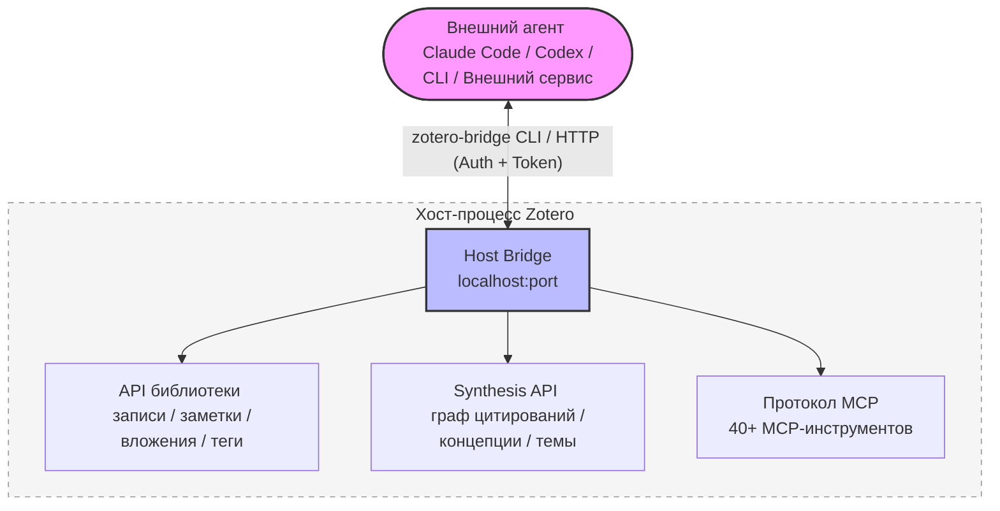
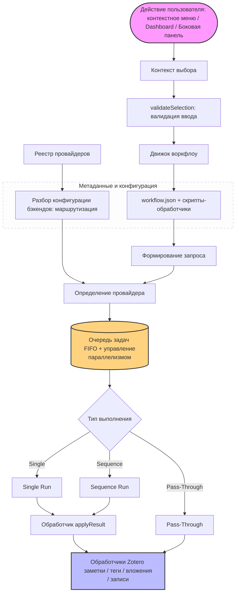

<!-- hero banner -->
<p align="center">
  
</p>

<p align="center">
  
</p>

<h1 align="center">Zotero Agents</h1>

<p align="center">
  <a href="https://github.com/leike0813/zotero-agents/releases"></a>
  
  <a href="https://github.com/leike0813/zotero-agents/blob/main/LICENSE"></a>
  
</p>

<p align="center">
  <a href="README.md">English</a> ·
  <a href="README-zhCN.md">简体中文</a> ·
  <a href="README-zhTW.md">繁體中文</a> ·
  <a href="README-jaJP.md">日本語</a> ·
  <a href="README-frFR.md">Français</a> ·
  <a href="README-de.md">Deutsch</a> ·
  <a href="README-esES.md">Español</a> ·
  <a href="README-ptBR.md">Português</a> ·
  <a href="README-koKR.md">한국어</a> ·
  <a href="README-itIT.md">Italiano</a> ·
  <strong>Русский</strong> ·
  <a href="https://leike0813.github.io/zotero-agents/">📖 Документация</a> ·
  <a href="https://github.com/leike0813/zotero-agents">GitHub</a> ·
  <a href="https://gitee.com/leike0813/zotero-agents">Gitee</a>
</p>

> 💡 Начиная с версии v0.5.0-alpha, плагин переименован из **Zotero Skills** в **Zotero Agents**.

---

<p align="center">
  <strong>Ваша библиотека Zotero теперь работает на базе ИИ-агентов.</strong><br/>
  <sub>Превратите поиск, анализ, управление, синтез и подготовку текста публикаций в проверяемую, отслеживаемую и повторно используемую исследовательскую базу знаний.</sub>
</p>

<p align="center">
  <a href="https://leike0813.github.io/zotero-agents/getting-started">
    
  </a>
  &nbsp;
  <a href="https://github.com/leike0813/zotero-agents/releases">
    
  </a>
</p>

---

Zotero Agents — это **комплексная агентская рабочая среда** для вашей библиотеки Zotero. Это не чат-бот, который отвечает на вопросы, а ИИ-агент, который напрямую работает с вашей библиотекой, превращая статьи из «прочитанных и забытых PDF» в **исследуемую, проверяемую и накапливаемую сеть исследовательских знаний**.

**Передайте литературу агенту — вам остаётся только принимать решения.** Анализ литературы — ИИ автоматически извлекает резюме, списки литературы и цитатный анализ, формируя три структурированных заметки за один запуск. Поиск и импорт литературы — агент выполняет поиск в сети, отбирает кандидатов и после вашего подтверждения добавляет каждую статью в библиотеку. Нормализация тегов — автоматическое упорядочивание тегов на основе определённого вами контролируемого словаря с автоматическим выводом новых тегов. Глубокое чтение — генерация тщательно оформленных HTML-документов для детального чтения, дополненных знаниями из вашей библиотеки. Тематический синтез — всесторонний обзор по направлению исследования: базовые работы, современные разработки, ключевые аргументы и методологические разногласия, — результатом которого становится готовый обзорный доклад.

В основе лежат три совместно работающие подсистемы: **плагируемый движок воркфлоу** (вся бизнес-логика публикуется и устанавливается в виде независимых пакетов, сам плагин не содержит жёстких привязок), **Synthesis Workbench** (граф цитирований, концептуальная база знаний, тематические графы — объединение результатов анализа отдельных работ в долгосрочный уровень знаний) и **Host Bridge** (CLI + MCP позволяют внешним агентам читать и записывать данные в вашу библиотеку Zotero, передавая исследовательские задачи в автоматизированные конвейеры, работающие в фоновом режиме).

---

| 🔧 | 💬 | 🔬 | 🔌 |
|:--:|:--:|:--:|:--:|
| **Плагируемые воркфлоу** | **Панель ассистента** | **Synthesis Workbench** | **Host Bridge** |
| Разбор статей, глубокое чтение, нормализация тегов, тематический синтез — организовано в виде расширяемых потоков | Подключение к агенту через ACP, совместная работа с литературой, записями и библиотекой | Управление сетями цитирований, концепциями, тегами и тематическим синтезом; постоянная аккумуляция слоя знаний | CLI + MCP позволяют внешним агентам читать контекст Zotero и записывать результаты анализа обратно |

---

## Быстрая навигация

| Кто вы…                                 | Начните отсюда                                                        |
| --------------------------------------- | --------------------------------------------------------------------- |
| 🔰 Новый пользователь, хотите узнать возможности | → [3 шага для быстрого старта](#3-шага-для-быстрого-старта)              |
| 📄 Быстрая обработка статей (аннотации, разбор)   | → [Основные воркфлоу](#основные-воркфлоу)                                  |
| 📊 Написываете обзор литературы, нужна систематизация | → [Рабочая среда синтеза литературы](#рабочая-среда-синтеза-литературы)   |
| 💬 Хотите вести диалог с ИИ по литературе          | → [Панель ИИ-взаимодействия](#панель-ии-взаимодействия)                  |
| 💰 Вас интересуют затраты на ИИ и выбор движка     | → [ИИ-движки и стоимость](#ии-движки-и-стоимость)                     |
| 🔌 Внешняя интеграция, доступ агента к библиотеке  | → [Host Bridge и MCP](#host-bridge--mcp-сервер)                        |
| 🛠 Разработчик, хотите расширить или внести вклад   | → [Обзор архитектуры](#обзор-архитектуры) · [Документация для разработчиков](#документация-для-разработчиков) |
| 📚 Нужна полная инструкция                          | → [Онлайн-документация](https://leike0813.github.io/zotero-agents/)   |

---

## Установка и настройка

### Системные требования

- [Zotero 9](https://www.zotero.org/download/) или [Zotero 7](https://www.zotero.org/download/) (версия ≥ 6.999)
- При использовании бэкенда ACP: на локальной машине должен быть установлен соответствующий CLI-инструмент агента (допустима автоматическая установка через `npx`)
- При использовании бэкенда Skill-Runner: развёрнут экземпляр [Skill-Runner](https://github.com/leike0813/Skill-Runner)

> **О версиях Zotero**: Плагин разрабатывается и тестируется на Zotero 9. Zotero 8 теоретически должен полностью поддерживаться (плагинные фреймворки Zotero 8/9 существенно не отличаются); Zotero 7 также предположительно поддерживается, но из-за ограничений ресурсов глубокое тестирование не проводилось — основная поддержка будет сосредоточена на Zotero 9. Если вы столкнулись с проблемами при использовании Zotero 7, сообщите об этом в [Issues](https://github.com/leike0813/zotero-agents/issues).

### Типы бэкендов

| Тип бэкенда | Рекомендация | Назначение | Способ настройки |
|-------------|-------------|------------|-----------------|
| **ACP** | 🥇 Предпочтительный | Прямое подключение к Agent CLI (Codex, OpenCode, Claude Code, Gemini CLI, Qwen Code), без дополнительных настроек | Добавьте из пресета в Backend Manager |
| **Skill-Runner (Docker)** | 🥈 Рекомендуемый | Постоянно работающий сервис, не зависит от запуска Zotero, поддерживает совместное использование в локальной сети | Docker compose up, затем укажите URL в Backend Manager |
| **Skill-Runner (быстрое развёртывание)** | 🥉 Экстренный | Запускается и останавливается вместе с плагином; при закрытии Zotero все задачи прекращаются | Одним нажатием Deploy в настройках |

> Кроме того, плагин имеет встроенные типы бэкендов **Generic HTTP** (вызов любых HTTP API, например сервиса MinerU) и **Pass-Through** (чисто локальные операции, такие как экспорт и импорт заметок), которые автоматически используются в определённых воркфлоу и не требуют дополнительного внимания.

---

## 3 шага для быстрого старта

### 1️⃣ Установите плагин

Скачайте файл `.xpi` со страницы [Releases](https://github.com/leike0813/zotero-agents/releases) → Zotero `Инструменты` → `Дополнения` → ⚙️ → `Установить дополнение из файла…` → Перезапустите Zotero.

### 2️⃣ Настройте ИИ-бэкенд

> 🥇 **Рекомендуется ACP** — если на вашей машине установлены поддерживающие ACP инструменты, такие как Codex / OpenCode / Claude Code, подключение выполняется без какой-либо дополнительной настройки.

**Вариант A — Прямое подключение к ACP-агенту (рекомендуется)**

`Инструменты` → `Backend Manager` → Вкладка ACP → Выберите ваш инструмент агента в **Add from Preset** → Сохраните. Заполнять какие-либо параметры не требуется.

**Вариант B — Развёртывание Skill-Runner в Docker (для постоянной фоновой работы)**

Разверните [Skill-Runner в Docker](https://leike0813.github.io/zotero-agents/backends/skill-runner#推荐docker-常驻部署) на вашей машине, затем добавьте экземпляр SkillRunner в менеджере бэкендов и укажите Base URL.

> Примечание: Быстрое развёртывание локального бэкенда подходит только тем пользователям, которые не могут установить Agent / Docker. При закрытии Zotero все задачи будут прекращены.

### 3️⃣ Запустите через контекстное меню

В списке литературы Zotero **щёлкните правой кнопкой мыши по статье** и выберите `Zotero Agents` → `Анализ литературы`. Через несколько минут вы увидите в панели заметок сгенерированное ИИ резюме, список литературы и цитатный анализ.

> Подробные инструкции по настройке и использованию доступны в [онлайн-документации](https://leike0813.github.io/zotero-agents/).

---

## Основные воркфлоу

Функции для ежедневного использования — запускаются щелчком правой кнопки мыши по статье.

| Функция | Описание | Способ запуска |
|---------|----------|---------------|
| 📊 **Анализ литературы** | ИИ автоматически генерирует резюме статьи, извлекает список литературы и формирует отчёт по цитатному анализу. Возможна каскадная нормализация тегов | ПКМ по статье → `Анализ литературы` |
| 💬 **Интерактивный разбор литературы** | Многораундовый диалог для глубокого понимания статьи. Ответы ИИ проходят верификационный контроль — ответы с низкой уверенностью явно помечаются, что исключает проблемы с галлюцинациями. Записи диалогов могут быть преобразованы в учебные заметки | ПКМ по статье → `Разбор литературы` |
| 📖 **Глубокое чтение** | Генерация структурированного представления для детального чтения с поддержкой посегментного перевода и разбора концепций | ПКМ по статье → `Глубокое чтение` |
| 🌱 **Инициализация словаря тегов** | Интерактивное создание контролируемого словаря тегов для вашей исследовательской области с помощью ИИ. Рекомендуется выполнить перед началом анализа литературы | Dashboard → `Tag Bootstrapper` |
| 🏷️ **Нормализация тегов** | Автоматическое упорядочивание тегов на основе контролируемого словаря; ИИ выводит новые теги и отправляет их на проверку | ПКМ по записи → `Нормализация тегов` |
| 🔎 **Поиск и импорт литературы** | Позвольте агенту быстро расширить вашу библиотеку: поиск, фильтрация, подтверждение и прямой импорт | Dashboard → `Поиск и импорт литературы` |
| 📋 **Разбор PDF** | Преобразование PDF в Markdown (через сервис MinerU) | ПКМ по PDF → `MinerU` |
| 📤 **Экспорт/импорт заметок** | Массовый экспорт резюме и заметок в формат Markdown или импорт внешних заметок | ПКМ по выбранным записям → Экспорт/импорт |

> **💡 О заметках-результатах**: Результаты анализа литературы (резюме, список литературы, цитатный анализ) добавляются к родительской записи в виде вложений-заметок. Отображаемое содержимое заметок **формируется** из внутренних данных — прямое редактирование заметок не изменяет источник данных. Для редактирования используйте «Экспорт заметок» → внесите изменения → затем «Импорт заметок» для повторного импорта.

<p align="center">
<table>
<tr>
<td width="33%" align="center"><br/><sub>Digest — резюме литературы</sub></td>
<td width="33%" align="center"><br/><sub>References — список литературы</sub></td>
<td width="33%" align="center"><br/><sub>Citation Analysis — цитатный анализ</sub></td>
</tr>
</table>
</p>

---

## Рекомендуемый рабочий процесс

От нуля до написания обзора литературы — рекомендуется выполнять следующие этапы последовательно:

### 📋 Шаг 1: Создание словаря тегов

Перед началом анализа литературы рекомендуется сначала использовать **Tag Bootstrapper** для инициализации контролируемого словаря тегов вашей исследовательской области. Это позволит автоматически упорядочивать теги для каждой статьи при последующем анализе.

```
Dashboard → Tag Bootstrapper → Интерактивное определение системы тегов вашей исследовательской области с помощью ИИ
```

### 📥 Шаг 2: Импорт и анализ

**Анализ литературы — это ядро агентского управления литературой** — каждая импортированная работа должна пройти через него.

```
Получите полнотекстовый PDF
  → ПКМ по PDF → MinerU (преобразование в Markdown, наилучший результат)
  → ПКМ по статье → Анализ литературы
     └── ИИ автоматически генерирует резюме + список литературы + цитатный анализ
     └── Одновременно автоматически выполняется нормализация тегов (включена по умолчанию, рекомендуется оставить)
```

> **💡 Расширение библиотеки**: Необходимо быстро пополнить библиотеку большим количеством релевантной литературы? Используйте **Поиск и импорт литературы**, чтобы агент выполнил поиск, фильтрацию и массовый импорт.

### 🔗 Шаг 3: Дедупликация цитирований и граф

Когда библиотека достигла определённого размера и все работы прошли анализ:

```
Откройте Synthesis Workbench → Страница Index
  → Выполните Advance Matching (алгоритм расширенного сопоставления для дедупликации цитирований)
  → Перейдите на страницу Review для обработки элементов подтверждения (сомнительные сопоставления требуют ручного подтверждения)
  → ⚠️ Не забудьте «применить» отложенные решения!
  → Откройте страницу Graph → вы увидите полный и точный граф цитирований ✨
```

> Точные связи в графе помогают рассчитать значимость каждой работы (PageRank, frontier score и др.), что напрямую влияет на качество последующего тематического синтеза.

### 📊 Шаг 4: Создание тематического синтеза

Когда вы считаете, что объём литературы достаточен и все работы прошли анализ и расширенное сопоставление:

```
Dashboard → Create Topic Synthesis → Введите затравку темы
  → Агент автоматически выполняет 3-этапный конвейер (подготовка → основное усиление → финализация)
  → Откройте Synthesis Workbench → Страница Topics
  → Просмотрите профессиональный, детальный и аккуратно оформленный обзор темы ✨
```

<p align="center">
  
</p>

### ✍️ Шаг 5: Генерация обзора литературы

Когда у вас есть исследовательская идея и вы хотите изучить и обобщить развитие исследований в соответствующей области:

```
Соберите и импортируйте литературу → Выполните анализ литературы → Создайте несколько тем
  → Dashboard → Manuscript Literature Framing
  → Определите позиционирование статьи и стиль написания в диалоге с агентом
  → Сгенерируйте черновик разделов Introduction + Related Work в формате LaTeX
  → Результаты загрузите в разделе Dashboard для артефактов
  → Разместите непосредственно в тексте LaTeX или экспортируйте для дальнейшей обработки
```

### 💡 Дополнительные сценарии

<details>
<summary><b>Есть вопросы по статье? Интерактивный разбор литературы</b></summary>

ПКМ по статье → `Разбор литературы` → Обсуждение с ИИ в интерактивном режиме на панели Dashboard. Не беспокойтесь о галлюцинациях — ответы ИИ проходят **верификационный контроль**, а сомнительные ответы явно помечаются. После завершения диалога вопросы и ответы могут быть преобразованы в учебную заметку и сохранены как вложение-заметку.

</details>

<details>
<summary><b>Свободный диалог с ИИ на основе литературы</b></summary>

Выберите статью → Откройте боковую панель ACP Chat → Выберите бэкенд → Свободный диалог по содержанию статьи. Host Bridge автоматически предоставляет контекст литературы с поддержкой переключения модели/режима.

</details>

<details>
<summary><b>Трассировка цитирований и анализ графа</b></summary>

Откройте Synthesis Workbench → Страница Graph → Найдите ключевые статьи → Переключитесь на радиальную раскладку для развёртывания вокруг выбранной статьи → Просмотрите связи цитирования/цитирования, метрики PageRank и frontier score.

</details>

<details>
<summary><b>Командная стандартизация тегов</b></summary>

Tag Bootstrapper инициализирует словарь → Выберите группу статей → Нормализация тегов → Предложенные ИИ теги проходят проверку через Staged и добавляются в словарь → Словарь синхронизируется с членами команды через WebDAV.

</details>

---

## Рабочая среда синтеза литературы

Превращает разрозненные статьи в **исследуемую сеть знаний**. Это фундаментальное отличие данного плагина от других ИИ-инструментов для Zotero.

> Основные воркфлоу помогают **читать** литературу, рабочая среда синтеза помогает **организovať** знания.

Рабочая среда — это полноценная вкладка Workspace в Zotero, содержащая 8 поверхностей:

| Поверхность | Функция |
|-------------|---------|
| **Home** | Панель мониторинга библиотеки: карточки аналитики, панель состояния синхронизации, сводка элементов на проверку, популярные темы |
| **Topics** | Управление темами (создание/обновление/просмотр), три режима отображения: граф, сетка, список |
| **Index** | Канонический индекс литературы: реестр статей + привязка цитирований + слияние/дедупликация/перенаправление |
| **Review** | Центр проверки: подтверждение сопоставлений цитирований, подтверждение концепций, проверка связей тематического графа (принять/отклонить/массовые операции) |
| **Graph** | Визуализация графа цитирований (силовая/радиальная/компонентная раскладка), фильтрация по темам и анализ метрик |
| **Tags** | Управление контролируемым словарём тегов + проверка предложений тегов от ИИ (Promote/Discard) |
| **Concepts** | Концептуальная база знаний: четырёхуровневая структура концепции/значения/синонимы/связи, может быть наложена на тематический граф и средство чтения |
| **Reader** | Углублённое чтение по теме: Overview / Taxonomy / Claims / Compare / Future Directions / Coverage / References / Report |

Рабочая среда имеет встроенную функцию **синхронизации WebDAV**, позволяющую синхронизировать структурированные данные (словари тегов, тематический синтез, концептуальную базу знаний и др.) с удалённым сервером по протоколу WebDAV для лёгкой кросс-устройственной синхронизации и резервного копирования.

<table>
<tr>
<td width="50%"></td>
<td width="50%"></td>
</tr>
</table>

---

## Панель ИИ-взаимодействия

В версии 0.5.0 добавлена полноценная боковая панель ИИ-взаимодействия с тремя режимами:

<table>
<tr>
<td width="33%" align="center"><br/><sub>💬 ACP Chat — непрерывный диалог на основе библиотеки литературы</sub></td>
<td width="33%" align="center"><br/><sub>⚙️ ACP Skills — выполнение воркфлоу через подключение к локальному агенту по протоколу ACP</sub></td>
<td width="33%" align="center"><br/><sub>🔧 SkillRunner — взаимодействие с управляемым сервисом Skill-Runner</sub></td>
</tr>
</table>

---

## Host Bridge и MCP-сервер

При запуске Zotero плагин автоматически запускает локальную службу Host Bridge. Внешние ИИ-инструменты (Codex, OpenCode и др.) получают **прямой доступ к вашей библиотеке Zotero** — чтение статей, поиск записей, управление тегами и даже запуск воркфлоу.

| Возможность | Описание |
|-------------|----------|
| 🔌 **Доступ к библиотеке** | Внешние агенты напрямую читают записи, заметки, вложения, теги и коллекции Zotero |
| ⚡ **Запуск воркфлоу** | Удалённый запуск ИИ-воркфлоу через Bridge API |
| 📊 **Запросы Synthesis** | Запросы графа цитирований, тем, концептуальной базы знаний, индекса литературы |
| 🖥 **MCP-инструменты** | Встроенный MCP-сервер, предоставляющий ACP-агентам структурированные инструменты для работы с Zotero |
| 🔒 **Безопасность** | Аутентификация по токену + подтверждение операций записи, данные не покидают локальную машину |



CLI Host Bridge (`zotero-bridge`) предоставляет более 20 подкоманд и поддерживает Windows / macOS / Linux (включая ARM).

---

## Плагируемый движок воркфлоу

Сам плагин не содержит конкретной бизнес-логики — все ИИ-возможности подключаются через **внешние пакеты воркфлоу**.

- 📦 **Подключил и используй**: Поместите пакет воркфлоу в каталог — сразу готов к работе, без пересборки
- 📝 **Декларативное описание**: Описание «что делать» через манифест `workflow.json` + несколько скриптов-обработчиков
- 🔗 **Оркестрация Sequence**: Несколько Skill выполняются последовательно, с поддержкой handoff, изоляцией рабочего пространства и досрочным завершением
- 🌐 **Маршрутизация по бэкендам**: Один и тот же воркфлоу может выполняться на Skill-Runner, ACP, HTTP и других бэкендах
- 🌍 **Многоязычность**: Встроенная поддержка i18n в воркфлоу — текст интерфейса автоматически переключается в зависимости от языка Zotero
- ✅ **Декларативная валидация ввода**: `validateSelection` — ограничение условий ввода без написания JS

> Полное руководство по разработке пользовательских воркфлоу доступно в [онлайн-документации](https://leike0813.github.io/zotero-agents/workflows/custom/).

---

## Встроенное средство чтения Markdown

Плагин содержит встроенное лёгкое средство чтения Markdown. **Дважды щёлкните по любому вложению `.md`** в Zotero, чтобы открыть его во встроенном средстве чтения без перехода во внешнее приложение.

| Функция | Описание |
|---------|----------|
| 📑 **Навигация по структуре** | Автоматический разбор иерархии заголовков (h1-h4), отображение перемещаемой структуры на боковой панели |
| 🔍 **Поиск** | Полнотекстовый поиск по ключевым словам с подсветкой найденных фрагментов |
| 📐 **Математические формулы** | Отрисовка формул LaTeX через KaTeX, поддержка встроенных и блочных формул |
| 💻 **Подсветка кода** | Подсветка синтаксиса highlight.js, поддержка основных языков программирования |
| 🔤 **Регулировка размера шрифта** | Диапазон 12px–24px, подходит для различных экранов и предпочтений чтения |
| 📏 **Переключение ширины** | Поддержка узкой (860px) и широкой (1160px) ширины чтения |
| 📋 **Копирование** | Поддержка копирования исходного текста Markdown в буфер обмена, а также копирования пути к файлу |
| 📂 **Открыть в системе** | Открытие файла в приложении по умолчанию одним нажатием |
| 🌗 **Автоматическая тема** | Адаптация к светлой/тёмной теме Zotero без необходимости ручного переключения |

Средство чтения работает на основе `markdown-it` в сочетании с встроенным очистителем HTML для безопасного отображения. Эту функцию можно отключить в настройках, вернувшись к открытию в системном приложении по умолчанию.

<p align="center">
  
</p>

---

## Основные изменения в версии 0.5.0

> От версии v0.4.0 до v0.5.0 — **42 коммита**, представляющих полную эволюцию от «фронтенда Skill-Runner» к «универсальной среде выполнения агентов».

<table>
<tr>
<td width="50%">

### ✨ Новое

- **Бэкенд ACP** — прямое подключение к Agent CLI: Codex, OpenCode, Claude Code, Gemini CLI, Qwen Code
- **Панель ACP Chat** — непрерывный диалог на основе литературы с поддержкой переключения модели/режима и визуализацией расхода токенов
- **Панель ACP Skill Runs** — мониторинг выполнения навыков в реальном времени с транскриптами, подтверждением разрешений и предварительным просмотром результатов
- **Synthesis Workbench** — полноценная рабочая среда синтеза, 8 поверхностей
- **Граф цитирований** — силовая/радиальная/компонентная раскладка с фильтрацией по темам и вычислением метрик
- **Концептуальная база знаний** — четырёхуровневая структура концепции/значения/синонимы/связи, накладываемая на тематический граф
- **Глубокое чтение** — структурированное представление для детального чтения с покрытием концепций и цитатным контекстом
- **Host Bridge + MCP-сервер** — превращение Zotero в программируемый сервис
- **Встроенное средство чтения Markdown** — открытие вложений `.md` двойным щелчком с навигацией по структуре, поиском, формулами и подсветкой кода
- **Выполнение Sequence** — последовательное串联 нескольких Skill с передачей промежуточных результатов
- **Диалог Backend Manager** — централизованное управление всеми настройками бэкендов
- **Синхронизация WebDAV** — лёгкая кросс-устройственная синхронизация данных Synthesis

</td>
<td width="50%">

### ♻️ Улучшения

- **Полная переработка Dashboard** — добавлены представления бэкендов, просмотр артефактов, обратная связь Skill, экспорт диагностических журналов
- **Декларативная валидация выбора** — `validateSelection` заменяет императивный `filterInputs`, определение ограничений ввода без JS
- **Управление подключениями SkillRunner** — оптимизация плотности подключений, визуализация состояния предварительных запросов, улучшенное восстановление при сбоях
- **Многоязычный интерфейс** — Synthesis Workbench и система воркфлоу поддерживают китайский/английский/французский/японский языки
- **Кросс-платформенный CLI** — Host Bridge CLI с новыми предкомпилированными сборками для Linux ARM/ARM64/x86
- **Управление данными среды выполнения** — просмотр использования хранилища и очистка различных кэшей в настройках
- **Обратная связь по выполнению Skill** — автоматический сбор отчётов об ИИ-выполнении после успешного запуска

</td>
</tr>
</table>

---

## Официальные воркфлоу

<details>
<summary>Развернуть полный список воркфлоу</summary>

### Обработка литературы

| Воркфлоу | Бэкенд | Описание |
|----------|--------|----------|
| **Анализ литературы** ⭐ | `skillrunner` | Генерация резюме + списка литературы + цитатного анализа. Возможна каскадная нормализация тегов (включена по умолчанию) |
| **Разбор литературы** | `skillrunner` | Многораундовый диалог для понимания литературы, ответы проходят верификационный контроль для предотвращения галлюцинаций. Записи могут быть сохранены как учебные заметки |
| **Глубокое чтение** | `acp` | Структурированное представление для детального чтения (HTML) с покрытием концепций и цитатным контекстом |
| **Поиск и импорт литературы** | `acp` | Агент выполняет поиск и фильтрацию литературы, импорт после подтверждения |
| **MinerU** | `generic-http` | Преобразование PDF → Markdown (через сервис MinerU) |

### Синтез и систематизация

| Воркфлоу | Бэкенд | Описание |
|----------|--------|----------|
| **Тематический синтез** | `acp` | 3-этапная последовательность: подготовка → основное усиление → финализация. Полностью автоматическая обработка агентом |
| **Каркас литературы рукописи** | `acp` | Интерактивная генерация черновика разделов Introduction + Related Work в формате LaTeX |
| **Инициализация словаря тегов** | `skillrunner` | Интерактивное создание контролируемого словаря тегов для исследовательской области с помощью ИИ. Рекомендуется запускать первым |
| **Нормализация тегов** | `skillrunner` | Нормализация тегов на базе LLM + упорядочивание по контролируемому словарю |

### Утилиты

| Воркфлоу | Бэкенд | Описание |
|----------|--------|----------|
| **Экспорт заметок** | `pass-through` | Массовый экспорт резюме/заметок в формат Markdown (после изменения можно повторно импортировать) |
| **Импорт заметок** | `pass-through` | Импорт внешних Markdown-файлов в заметки Zotero |
| **Debug Probe** | Различные | 13 диагностических зондов для проверки выполнения последовательностей, контрактов apply, связности Host Bridge и др. |

</details>

---

## ИИ-движки и стоимость

Плагин не привязан к какому-либо поставщику ИИ-услуг. Вы используете собственную подписку, тарифный план или API-ключ для прямого подключения к бэкенду — **без посредников, без наценки за каждый токен**.

### Беспокоитесь о стоимости токенов?

Хорошая новость: все навыки данного проекта тщательно спроектированы, и **даже менее мощные модели (в том числе модели локального развёртывания!) демонстрируют впечатляющие результаты**. Вам не нужны самые дорогие модели для получения отличных результатов.

### Ориентировочные расходы

| Вариант | Стоимость | Описание |
|---------|-----------|----------|
| **DeepSeek V4 Flash** | Около ￥2/статья | Оплата по факту использования. Анализ одной статьи стоит менее ￥2 |
| **Тарифный план (Coding Plan)** | Фиксированная ежемесячная плата | Если вам доступен тарифный план с помодельной оплатой (Bailian, Zhipu и др.), вы можете дёшево и массово обрабатывать литературу — мы вызываем через Coding Agent, **полностью соответствует правилам** |
| **[OpenCode Go](https://opencode.ai/go?ref=SZDFT9GZKW)** | $10/мес. (первый месяц $5) | Практически неограниченная квота DeepSeek V4 Flash. По [этой ссылке](https://opencode.ai/go?ref=SZDFT9GZKW) вы и автор получите по $5 на счёт |
| **Codex (бесплатная версия)** | Бесплатно | Ограниченная модель, но всё равно позволяет получать отличные результаты |

### Сравнение движков

| Движок | Лучше для | Стоимость | Рекомендация |
|--------|-----------|-----------|-------------|
| **Codex** | Лучший в целом: баланс скорости и качества. Поддержка отображения потока мышления | Бесплатная версия доступна (модель ограничена) | ⭐⭐⭐ Выбор №1 |
| **Opencode** | В сочетании с тарифным планом или [OpenCode Go](https://opencode.ai/go?ref=SZDFT9GZKW), модели Qwen3.5-Plus / Kimi-K2.5 / GLM-5 и др. отлично справляются с задачами по литературе | Низкая стоимость | ⭐⭐⭐ Настоятельно рекомендуется |
| **Qwen Code** | Для пользователей экосистемы Alibaba в сочетании с тарифным планом Bailian | Собственная квота исчерпана, зависит от тарифного плана | ⭐⭐ На выбор |
| **Gemini CLI** | Простые задачи | Бесплатная версия доступна | ⭐ Обычный |
| **Claude Code** | Высокое качество выполнения инструкций, но меньшая эффективность | Платный | По необходимости |

> Подробные руководства по развёртыванию каждого движка доступны в [онлайн-документации](https://leike0813.github.io/zotero-agents/backends/skill-runner#引擎系统).

---

## Обзор архитектуры

<details>
<summary>Развернуть схему архитектуры</summary>



Ключевая идея архитектуры: сам плагин — это **оболочка выполнения**, не содержащая бизнес-логики. Декларативный манифест `workflow.json` и скрипты-обработчики определяют «что делать», а плагин отвечает за «как выполнить».

</details>

Подробнее об архитектуре — в [онлайн-документации: пользовательские воркфлоу](https://leike0813.github.io/zotero-agents/workflows/custom/).

---

## Примечания о переходной версии

> **v0.5.0-alpha — первая значимая веха после переименования в «Zotero Agents».**** По сравнению с v0.4.0 (чистый фронтенд Skill-Runner), v0.5.0 представляет полную трансформацию в универсальную среду выполнения агентов — добавлены поддержка бэкенда ACP, Synthesis Workbench, граф цитирований, концептуальная база знаний, Host Bridge, MCP-сервер и другие ключевые возможности, что позволяет стабильно использовать плагин в повседневных исследованиях.

### ⚠️ Известные ограничения

| Ограничение | Описание | План |
|-------------|----------|------|
| **Тяжёлые вычисления Synthesis блокируют интерфейс** | Обновление индекса, перестроение графа цитирований, Advance Matching и другие ресурсоёмкие операции в архитектуре единственного хост-процесса Zotero приводят к кратковременному зависанию интерфейса. Пожалуйста, дождитесь завершения | Планируется решение в будущих версиях |
| **Синхронизация WebDAV не прошла полное тестирование** | Функция автоматической синхронизации недостаточно протестирована; по возможности используйте только ручную синхронизацию | Доработка в следующих версиях |
| **Производительность на крупных библиотеках** | Тестирование производительности на больших библиотеках ещё не проводилось в полной мере | Будет решено в будущих обновлениях |

### Дальнейшие планы

- Улучшение многоязычной поддержки и руководства пользователя
- Повышение согласованности работы с различными бэкендами
- Оптимизация отзывчивости интерфейса при ресурсоёмких вычислениях Synthesis
- Постоянное повышение стабильности и производительности

> При возникновении проблем сообщайте о них в [Issues](https://github.com/leike0813/zotero-agents/issues).

---

## Документация для разработчиков

<details>
<summary>Развернуть руководство по разработке</summary>

### Локальная разработка

```bash
npm install          # Установить зависимости
npm start            # Запустить сервер разработки
npm test             # Запустить облегчённые тесты
npm run test:full    # Запустить полные тесты
npm run build        # Продакшн-сборка
```

### Индекс документации

| Документ | Описание |
|----------|----------|
| [Архитектура и потоки](doc/architecture-flow.md) | Общий обзор конвейера выполнения (включая диаграмму Mermaid) |
| [Руководство разработчика](doc/dev_guide.md) | Ключевые компоненты, модель конфигурации, цепочка выполнения |
| [Компоненты воркфлоу](doc/components/workflows.md) | Схема манифеста, обработчики, фильтрация ввода, семантика выполнения |
| [Компоненты провайдеров](doc/components/providers.md) | Система контрактов провайдеров, типы запросов |
| [Стратегия тестирования](doc/testing-framework.md) | Две среды выполнения, режимы lite/full, контрольные точки CI |
| [Слой Synthesis](doc/synthesis-layer/README.md) | Внутреннее устройство графов знаний, графов цитирований и концептуальной базы знаний |

</details>

---

## Пользовательская документация

Полное руководство пользователя доступно на сайте онлайн-документации: [https://leike0813.github.io/zotero-agents/](https://leike0813.github.io/zotero-agents/)

Охватывает: установка, настройка бэкендов, Backend Manager, вызов воркфлоу, Dashboard, боковая панель (ACP Chat / ACP Skills / SkillRunner), Synthesis Workbench, синхронизация WebDAV, настройки, разработка пользовательских воркфлоу и все остальные функции.

---

## Лицензия

[AGPL-3.0-or-later](LICENSE)

## Благодарности

- Создано на основе [Zotero Plugin Template](https://github.com/windingwind/zotero-plugin-template)
- Используется [zotero-plugin-toolkit](https://github.com/windingwind/zotero-plugin-toolkit)
- Поддержка экосистемы плагинов от [@windingwind](https://github.com/windingwind)
