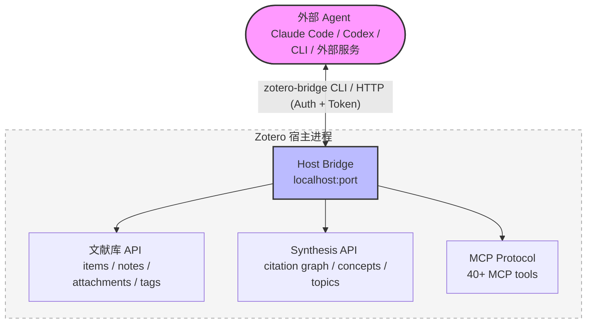
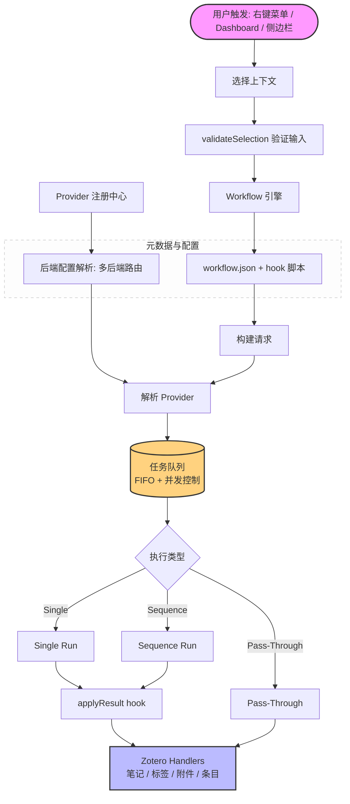

<!-- hero banner -->
<p align="center">
  
</p>

<p align="center">
  
</p>

<h1 align="center">Zotero Agents</h1>

<p align="center">
  <a href="https://github.com/leike0813/zotero-agents/releases"></a>
  
  <a href="https://github.com/leike0813/zotero-agents/blob/main/LICENSE"></a>
  
</p>

<p align="center">
  <a href="README.md">English</a> ·
  <strong>简体中文</strong> ·
  <a href="README-zhTW.md">繁體中文</a> ·
  <a href="README-jaJP.md">日本語</a> ·
  <a href="README-frFR.md">Français</a> ·
  <a href="README-de.md">Deutsch</a> ·
  <a href="README-esES.md">Español</a> ·
  <a href="README-ptBR.md">Português</a> ·
  <a href="README-koKR.md">한국어</a> ·
  <a href="README-itIT.md">Italiano</a> ·
  <a href="README-ruRU.md">Русский</a> ·
  <a href="https://leike0813.github.io/zotero-agents/">📖 在线文档站</a> ·
  <a href="https://github.com/leike0813/zotero-agents">GitHub</a> ·
  <a href="https://gitee.com/leike0813/zotero-agents">Gitee</a>
</p>

> 💡 自 v0.5.0-alpha 起，本插件由 **Zotero Skills** 更名为 **Zotero Agents**。

---

<p align="center">
  <strong>你的 Zotero 文献库，现在由 AI Agent 驱动。</strong><br/>
  <sub>让文献搜索、分析、管理、综合和写作准备沉淀为可审校、可追溯、可复用的研究知识。</sub>
</p>

<p align="center">
  <a href="https://leike0813.github.io/zotero-agents/getting-started">
    
  </a>
  &nbsp;
  <a href="https://github.com/leike0813/zotero-agents/releases">
    
  </a>
</p>

---

Zotero Agents 是 Zotero 文献库的**一站式 Agentic 工作台**——它不是你问一句、它答一句的聊天助手，而是让 AI Agent 直接在你的文献库中工作，把论文从"读过就忘的 PDF"变成**可探索、可审校、可积累的研究知识网络**。

**把文献交给 Agent，你只需要做决策。** 文献分析——AI 自动提取摘要、参考文献和引文意见，一次运行沉淀三份结构化笔记；文献搜索与入库——Agent 联网检索、筛选候选、等你确认后逐篇入库；标签规范化——基于你定义的受控词表自动规整和推断标签；深度阅读——生成精美 HTML 精读文档，叠加你的文献库知识；Topic 综合——围绕一个研究方向，梳理基础文献、前沿工作、关键论点和方法分歧，产出一劳永逸的综述报告。

这背后是三套协同运作的子系统：**可插拔 Workflow 引擎**（所有业务逻辑以独立包形式发布安装，插件本身零耦合）、**Synthesis Workbench**（引文图谱、概念知识库、主题图——把单篇分析汇聚为长期知识层）、和 **Host Bridge**（CLI + MCP 让外部 Agent 读写你的 Zotero 库，把研究任务委派给可后台持续运行的自动化流水线）。

---

| 🔧 | 💬 | 🔬 | 🔌 |
|:--:|:--:|:--:|:--:|
| **可插拔 Workflow** | **Assistant Sidebar** | **Synthesis Workbench** | **Host Bridge** |
| 论文解析、深度阅读、标签规范化、主题综合——组织为可扩展流 | 通过 ACP 连接 Agent，围绕文献、条目、库对话协作 | 管理引文网络、概念、标签和主题综合，知识层持续沉淀 | CLI + MCP 让外部 Agent 读 Zotero 上下文、写回分析结果 |

---

## 快速导航

| 我是…                           | 从这里开始                                                     |
| ------------------------------- | ------------------------------------------------------------- |
| 🔰 新用户，想了解能做什么       | → [3 步快速上手](#3-步快速上手)                                  |
| 📄 想快速处理论文（摘要、解读） | → [核心工作流](#核心工作流)                                      |
| 📊 在做文献综述，需要系统化知识 | → [文献综合工作台](#文献综合工作台)                              |
| 💬 想与 AI 围绕文献对话         | → [AI 交互面板](#ai-交互面板)                                  |
| 💰 关心 AI 费用和引擎选择       | → [AI 引擎与费用](#ai-引擎与费用)                               |
| 🔌 对外集成，让 Agent 读你的库  | → [Host Bridge 与 MCP](#host-bridge--mcp-server)               |
| 🛠 开发者，想扩展或贡献         | → [架构概览](#架构概览) · [开发者文档](#开发者文档)              |
| 📚 需要完整使用手册             | → [用户文档站](https://leike0813.github.io/zotero-agents/)     |

---

## 安装与配置

### 系统要求

- [Zotero 9](https://www.zotero.org/download/) 或 [Zotero 7](https://www.zotero.org/download/)（版本 ≥ 6.999）
- 如果使用 ACP 后端：本机已安装对应的 Agent CLI 工具（`npx` 自动安装亦可）
- 如果使用 Skill-Runner 后端：已部署 [Skill-Runner](https://github.com/leike0813/Skill-Runner) 实例

> **关于 Zotero 版本**：本插件在 Zotero 9 上开发与测试。Zotero 8 理论上可完整支持（Zotero 8/9 的插件框架没有明显改变）；Zotero 7 理论上也能支持，但受精力所限未进行深入测试，未来的维护重点将放在 Zotero 9 上。如果在 Zotero 7 使用过程中遇到问题，请在 [Issues](https://github.com/leike0813/zotero-agents/issues) 反馈。

### 后端类型

| 后端类型 | 推荐度 | 用途 | 配置方式 |
|---------|--------|------|---------|
| **ACP** | 🥇 首选 | 直连 Agent CLI（Codex、OpenCode、Claude Code、Gemini CLI、Qwen Code），零配置负担 | Backend Manager 中从预设添加 |
| **Skill-Runner (Docker)** | 🥈 推荐 | 常驻服务，不受 Zotero 启停影响，支持局域网共享 | Docker compose up，然后在 Backend Manager 中填写 URL |
| **Skill-Runner (一键部署)** | 🥉 应急 | 随插件启停，关闭 Zotero 即终止所有任务 | 偏好设置中一键 Deploy |

> 此外，插件还内置了 **Generic HTTP**（调用任意 HTTP API，如 MinerU 服务）和 **Pass-Through**（纯本地操作，如笔记导出导入）两种后端类型，在特定 Workflow 中自动使用，无需额外关注。

---

## 3 步快速上手

### 1️⃣ 安装插件

从 [Releases](https://github.com/leike0813/zotero-agents/releases) 下载 `.xpi` 文件 →  Zotero `工具` → `附加组件` → ⚙️ → `从文件安装附加组件…` → 重启 Zotero。

### 2️⃣ 配置 AI 后端

> 🥇 **首选 ACP** — 只要本机有 Codex / OpenCode / Claude Code 等支持 ACP 的 Agent 工具，直接零配置使用。

**方案 A — 直连 ACP Agent（推荐）**

`工具` → `后端管理器` → ACP Tab → 从 **Add from Preset** 选择你的 Agent 工具 → 保存。无需填写任何参数。

**方案 B — Docker 部署 Skill-Runner（需要后台常驻时）**

在机器上 [Docker 部署 Skill-Runner](https://leike0813.github.io/zotero-agents/backends/skill-runner#推荐docker-常驻部署)，然后在后端管理器中添加 SkillRunner 实例并填写 Base URL。

> 注意：一键部署本地后端仅适合完全不会安装 Agent / Docker 的用户。关闭 Zotero 即终止所有任务。

### 3️⃣ 右键运行

在 Zotero 文献列表中**右键一篇论文**，选择 `Zotero Agents` → `文献分析`。几分钟后，你会在笔记面板中看到 AI 生成的摘要、参考文献清单和引文分析。

> 详细的配置和使用说明见 [在线文档站](https://leike0813.github.io/zotero-agents/)。

---

## 核心工作流

每天都要用到的功能，右键论文即可触发。

| 功能 | 说明 | 触发方式 |
|------|------|----------|
| 📊 **文献分析** | AI 自动生成论文摘要、提取参考文献、输出引文分析报告。可级联执行标签规范化 | 右键论文 → `文献分析` |
| 💬 **交互式文献解读** | 多轮对话深入理解论文。AI 回答经过验证门禁，有疑问的答案会被显式提醒，不用担心幻觉问题。对话记录可生成为学习笔记 | 右键论文 → `文献解读` |
| 📖 **深度阅读** | 生成结构化精读视图，支持多段翻译和概念解析 | 右键论文 → `深度阅读` |
| 🌱 **标签词表初始化** | 与 AI 交互式创建研究领域的受控标签词表。建议在开始文献分析前先初始化 | Dashboard → `Tag Bootstrapper` |
| 🏷️ **标签规范化** | 基于受控词表自动规整标签，AI 推断新标签并等待审核 | 右键条目 → `标签规范化` |
| 🔎 **文献搜索与入库** | 让 Agent 帮你快速扩充文献库：搜索、筛选、确认后直接入库 | Dashboard → `文献搜索与入库` |
| 📋 **PDF 解析** | 将 PDF 转为 Markdown（调用 MinerU 服务） | 右键 PDF → `MinerU` |
| 📤 **笔记导出/导入** | 批量导出摘要和笔记为 Markdown，或导入外部笔记 | 右键选中条目 → 导出/导入 |

> **💡 关于产物笔记**：文献分析的产物（摘要、参考文献、引文分析）会以 Note 附件的形式添加到父条目。笔记中显示的内容是从后台数据**渲染**出来的，直接修改笔记内容不会改变后台数据。如需编辑，请使用「导出笔记」导出 → 修改 → 再通过「导入笔记」重新导入。

<p align="center">
<table>
<tr>
<td width="33%" align="center"><br/><sub>Digest — 文献摘要</sub></td>
<td width="33%" align="center"><br/><sub>References — 参考文献</sub></td>
<td width="33%" align="center"><br/><sub>Citation Analysis — 引文分析</sub></td>
</tr>
</table>
</p>

---

## 推荐工作流程

从零开始到写出文献综述，推荐按以下顺序推进：

### 📋 第一步：建立标签词表

在开始文献分析前，建议先用 **Tag Bootstrapper** 初始化一个研究领域的受控标签词表。这样后续的文献分析就能自动为每篇论文规整标签。

```
Dashboard → Tag Bootstrapper → 与 AI 交互定义你的研究领域标签体系
```

### 📥 第二步：入库与分析

**Literature Analysis 是 Agentic 文献管理的核心** — 所有入库文献都应该跑一次。

```
拿到原文 PDF
  → 右键 PDF → MinerU（转 Markdown，效果最佳）
  → 右键论文 → 文献分析
     └── AI 自动生成摘要 + 参考文献 + 引文分析
     └── 同时自动执行标签规范化（默认开启，建议保持）
```

> **💡 扩充文献库**：需要快速补充大量相关文献？用 **Literature Search & Ingest** 让 Agent 帮你搜索、筛选和批量入库。

### 🔗 第三步：引用去重与图谱

当文献库有一定规模且都运行过 Analysis 后：

```
打开 Synthesis Workbench → Index 页面
  → 执行 Advance Matching（高级匹配算法进行引用文献去重）
  → 前往 Review 页面处理审批项（不确定的匹配需要你手动确认）
  → ⚠️ 别忘了将 pending 的决策「应用」！
  → 打开 Graph 页面 → 你会看到一张完整、准确的引文图谱 ✨
```

> 准确的图谱关系有助于计算各文献的重要程度（PageRank、frontier score 等），这会直接影响后续 Topic 综合的质量。

### 📊 第四步：创建 Topic 综合

当你觉得文献量已足够，且都经过 Analysis 和 Advance Matching：

```
Dashboard → Create Topic Synthesis → 输入主题种子
  → Agent 自动执行 3 步流水线（准备 → 核心增强 → 定稿）
  → 打开 Synthesis Workbench → Topics 页面
  → 查看专业、细致且精美的 Topic 导览 ✨
```

<p align="center">
  
</p>

### ✍️ 第五步：生成文献综述

当你有一个研究思路，想要了解并总结相关领域的研究进展时：

```
收集并入库文献 → 执行文献分析 → 创建几个 Topic
  → Dashboard → Manuscript Literature Framing
  → 与 Agent 交互确定论文定位和写作风格
  → 生成 Introduction + Related Work 的 LaTeX 草稿
  → 产物在 Dashboard 的产物区下载
  → 直接放入 LaTeX 文稿，或导出后进一步加工
```

### 💡 更多场景

<details>
<summary><b>对某篇论文有疑问？交互式文献解读</b></summary>

右键论文 → `文献解读` → 在 Dashboard 中与 AI 交互式讨论。不用担心幻觉问题 — AI 的回答必须经过**验证门禁**，有疑问的答案会被显式提醒。对话结束后可将问答记录生成为学习笔记，以 Note 附件保存。

</details>

<details>
<summary><b>以文献为上下文与 AI 自由对话</b></summary>

选中论文 → 打开侧边栏 ACP Chat → 选择后端 → 围绕论文内容自由对话。Host Bridge 自动提供文献上下文，支持模型/模式切换。

</details>

<details>
<summary><b>引文溯源与图谱分析</b></summary>

打开 Synthesis Workbench → Graph 页面 → 搜索关键论文 → 切换到 Radial 布局以该论文为中心展开 → 查看引用/被引关系、PageRank 和 frontier score 指标。

</details>

<details>
<summary><b>团队标签规范</b></summary>

Tag Bootstrapper 初始化词表 → 选中一批论文 → 标签规范化 → AI 建议的标签通过 Staged 审核后加入词表 → 词表通过 WebDAV 同步给团队成员。

</details>

---

## 文献综合工作台

把零散的论文变成**可探索的知识网络**。这是本插件与其他 Zotero AI 工具最根本的不同。

> 核心工作流帮你**读**论文，文献综合工作台帮你**组织**知识。

工作台是 Zotero 中的一个完整 Workspace Tab，包含 8 个 Surface：

| Surface | 功能 |
|---------|------|
| **Home** | 文献库概览仪表板：库洞察卡片、同步状态面板、审核项摘要、热门主题入口 |
| **Topics** | 主题管理（创建/更新/浏览），支持图/网格/列表三种视图 |
| **Index** | 规范参考文献索引：论文注册表 + 引用绑定 + 合并/去重/重定向 |
| **Review** | 审核中心：引用匹配审核、概念审核、主题图关系审核（接受/拒绝/批量操作）|
| **Graph** | 引文图谱可视化（力导向/径向/组件布局），支持主题过滤与指标分析 |
| **Tags** | 受控标签词表管理 + AI 标签建议审批（Promote/Discard） |
| **Concepts** | 概念知识库：概念/义项/别名/关系四层结构，可叠加到主题图和阅读器 |
| **Reader** | 主题深度阅读器：Overview / Taxonomy / Claims / Compare / Future Directions / Coverage / References / Report |

工作台内置 **WebDAV 同步**功能，可将标签词表、主题综合、概念知识库等结构化数据通过 WebDAV 协议同步到远端，实现轻量级的跨设备同步与备份。

<table>
<tr>
<td width="50%"></td>
<td width="50%"></td>
</tr>
</table>

---

## AI 交互面板

v0.5.0 新增了完整的 AI 交互侧边栏，提供三种交互模式：

<table>
<tr>
<td width="33%" align="center"><br/><sub>💬 ACP Chat — 以文献库为上下文的持续对话</sub></td>
<td width="33%" align="center"><br/><sub>⚙️ ACP Skills — 使用 ACP 协议连接本地 Agent 执行工作流</sub></td>
<td width="33%" align="center"><br/><sub>🔧 SkillRunner — 与托管式的 Skill-Runner 服务后端通信</sub></td>
</tr>
</table>

---

## Host Bridge & MCP Server

Zotero 启动时，插件自动运行一个本地 Host Bridge 服务。外部 AI 工具（Codex、OpenCode 等）可以**直接访问你的 Zotero 文献库** — 读取论文、搜索条目、管理标签，甚至触发工作流。

| 能力 | 说明 |
|------|------|
| 🔌 **库访问** | 外部 Agent 直接读取 Zotero 条目、笔记、附件、标签、合集 |
| ⚡ **工作流触发** | 通过 Bridge API 远程触发 AI 工作流执行 |
| 📊 **Synthesis 查询** | 查询引文图谱、主题、概念知识库、参考文献索引 |
| 🖥 **MCP 工具** | 内嵌 MCP Server，为 ACP Agent 提供结构化的 Zotero 操作工具 |
| 🔒 **安全** | Token 认证 + 写操作审批，数据不离开本地 |



Host Bridge CLI (`zotero-bridge`) 提供 20+ 子命令，支持 Windows / macOS / Linux（含 ARM）。

---

## 可插拔的 Workflow 引擎

插件本身不包含具体业务逻辑 — 所有 AI 能力通过**外部 Workflow 包**接入。

- 📦 **即插即用**：将 workflow 包放入目录，立即可用，无需重新构建
- 📝 **声明式定义**：通过 `workflow.json` manifest + 少量 hook 脚本描述"做什么"
- 🔗 **Sequence 编排**：多个 Skill 按序串联，支持 handoff、workspace 隔离和提前终止
- 🌐 **多后端路由**：同一个 workflow 可以在 Skill-Runner、ACP、HTTP 等不同后端上执行
- 🌍 **多语言**：workflow 内置 i18n 支持，UI 文本随 Zotero 语言自动切换
- ✅ **声明式输入验证**：`validateSelection` — 无需写 JS 即可约束输入条件

> 完整的自定义 Workflow 开发指南见[用户文档站](https://leike0813.github.io/zotero-agents/workflows/custom/)。

---

## 内置 Markdown 阅读器

插件内置了一个轻量级 Markdown 阅读器。在 Zotero 中**双击任意 `.md` 附件**即可在内置阅读器中打开，无需跳转到外部应用。

| 功能 | 说明 |
|------|------|
| 📑 **大纲导航** | 自动解析标题层级（h1-h4），左侧边栏显示可跳转的大纲 |
| 🔍 **搜索** | 全文关键词搜索，命中处高亮标记 |
| 📐 **数学公式** | KaTeX 渲染 LaTeX 公式，支持行内和块级公式 |
| 💻 **代码高亮** | highlight.js 语法高亮，支持主流编程语言 |
| 🔤 **字号调节** | 12px-24px 可调，适合不同屏幕和阅读习惯 |
| 📏 **宽度切换** | 支持窄栏（860px）和宽栏（1160px）两种阅读宽度 |
| 📋 **复制** | 支持复制 Markdown 原文到剪贴板，以及复制文件路径 |
| 📂 **系统打开** | 一键使用系统默认应用打开该文件 |
| 🌗 **自动主题** | 自适应 Zotero 亮色/暗色主题，无需手动切换 |

阅读器由 `markdown-it` 驱动渲染，配合内置的 HTML 净化确保安全渲染。可在偏好设置中关闭此功能，改回系统默认打开方式。

<p align="center">
  
</p>

---

## v0.5.0 主要变化

> 从 v0.4.0 到 v0.5.0 跨越了 **42 个 commit**，是一次从"Skill-Runner 前端"到"通用 Agent 执行框架"的全面进化。

<table>
<tr>
<td width="50%">

### ✨ 新增

- **ACP 后端** — 直连 Codex、OpenCode、Claude Code、Gemini CLI、Qwen Code 等 Agent CLI
- **ACP Chat 面板** — 以文献为上下文的持续对话，支持模型/模式切换和 Token 用量可视化
- **ACP Skill Runs 面板** — 监控技能运行全程，含转写、权限审批、输出预览
- **文献综合工作台** — 完整的 Synthesis Workbench，8 大 Surface
- **引文图谱** — 力导向/径向/组件布局，支持主题过滤和指标计算
- **概念知识库** — 概念/义项/别名/关系四层结构，可叠加到主题图
- **深度阅读** — 结构化精读视图，带概念覆盖和引文上下文
- **Host Bridge + MCP Server** — 把 Zotero 变成可编程服务
- **内置 Markdown 阅读器** — 双击 `.md` 附件即打开内置阅读器，支持大纲导航、搜索、数学公式、代码高亮
- **Sequence 执行** — 多 Skill 按序串联，支持中间结果传递
- **Backend Manager 对话框** — 统一管理所有后端配置
- **WebDAV 同步** — 轻量级 Synthesis 数据跨设备同步

</td>
<td width="50%">

### ♻️ 改进

- **Dashboard 全面重构** — 新增后端视图、产物浏览器、Skill Feedback、日志诊断导出
- **声明式选择验证** — `validateSelection` 取代命令式 `filterInputs`，零 JS 即可定义输入约束
- **SkillRunner 连接治理** — 连接密度优化、预请求状态可视化、故障恢复增强
- **多语言 UI** — Synthesis Workbench 和 Workflow 系统支持中/英/法/日
- **Cross-platform CLI** — Host Bridge CLI 新增 Linux ARM/ARM64/x86 预编译
- **运行时数据管理** — 偏好设置中可查看存储用量、清理各类缓存数据
- **Skill Run Feedback** — 成功运行后可自动收集 AI 反馈报告

</td>
</tr>
</table>

---

## 官方 Workflow

<details>
<summary>展开完整 Workflow 列表</summary>

### 文献处理

| Workflow | 后端 | 说明 |
|----------|------|------|
| **文献分析** ⭐ | `skillrunner` | 生成摘要 + 参考文献 + 引文分析笔记。可级联执行标签规范化（默认开启） |
| **文献解读** | `skillrunner` | 多轮对话式文献理解，答案经验证门禁防幻觉。记录可保存为学习笔记 |
| **深度阅读** | `acp` | 结构化精读视图（HTML），含概念覆盖和引文上下文 |
| **文献搜索与入库** | `acp` | 让 Agent 帮你搜索、筛选文献，确认后直接入库 |
| **MinerU** | `generic-http` | PDF → Markdown 转换（调用 MinerU 服务） |

### 综合与整理

| Workflow | 后端 | 说明 |
|----------|------|------|
| **Topic 综合** | `acp` | 3 步 Sequence：准备 → 核心增强 → 定稿。Agent 全自动处理 |
| **文稿文献框架** | `acp` | 交互式生成 Introduction + Related Work 的 LaTeX 草稿 |
| **标签词表初始化** | `skillrunner` | 与 AI 交互创建研究领域的受控标签词表。建议首先运行 |
| **标签规范化** | `skillrunner` | LLM 驱动的标签推断 + 受控词表规整 |

### 工具

| Workflow | 后端 | 说明 |
|----------|------|------|
| **笔记导出** | `pass-through` | 批量导出摘要/笔记为 Markdown（修改后可重新导入） |
| **笔记导入** | `pass-through` | 导入外部 Markdown 为 Zotero 笔记 |
| **Debug Probe** | 多种 | 13 个调试探针，验证序列执行、apply 合约、Host Bridge 连通性等 |

</details>

---

## AI 引擎与费用

本插件不绑定任何 AI 服务商。你用自己的订阅额度、Coding Plan 或 API Key 直接连接后端 — **没有中间商，没有 per-token 加价**。

### 担心 Token 太贵？

好消息：本项目的所有 Skill 都经过精心设计，**即便是较弱的模型（甚至本地部署的模型！）也能实现很惊艳的执行效果**。你不需要最贵的模型就能获得出色的结果。

### 费用参考

| 方案 | 费用 | 说明 |
|------|------|------|
| **DeepSeek V4 Flash** | 约 ￥2/篇 | 按量付费。每篇文献的 Literature Analysis 大约只需不到 ￥2 |
| **Coding Plan** | 包月固定价 | 如果你有幸抢购到按次计费的 Coding Plan（百炼、智谱等），完全可以廉价、批量处理文献 — 我们通过 Coding Agent 调用，**完全合规** |
| **[OpenCode Go](https://opencode.ai/go?ref=SZDFT9GZKW)** | \$10/月（首月 \$5） | 几乎不限量的 DeepSeek V4 Flash 额度。通过[此链接](https://opencode.ai/go?ref=SZDFT9GZKW)订阅，你和作者各获 $5 抵扣 |
| **Codex 免费版** | 免费 | 模型受限，但依然能跑出很好的结果 |

### 引擎对比

| 引擎 | 适合场景 | 费用 | 推荐度 |
|------|---------|------|--------|
| **Codex** | 综合最佳，速度与质量兼得。支持思维流式展示 | 免费版可用（模型受限） | ⭐⭐⭐ 首选 |
| **Opencode** | 配合 Coding Plan 或 [OpenCode Go](https://opencode.ai/go?ref=SZDFT9GZKW)，Qwen3.5-Plus / Kimi-K2.5 / GLM-5 等模型在文献任务上表现优秀 | 低成本 | ⭐⭐⭐ 强推 |
| **Qwen Code** | 阿里生态用户，配合百炼 Coding Plan | 自带额度已结束，依赖 Plan | ⭐⭐ 可选 |
| **Gemini CLI** | 简单任务 | 免费版可用 | ⭐ 一般 |
| **Claude Code** | 指令执行质量高，但效率较低 | 付费 | 按需选 |

> 各引擎的详细部署指南见[用户文档站](https://leike0813.github.io/zotero-agents/backends/skill-runner#引擎系统)。

---

## 架构概览

<details>
<summary>展开架构图</summary>



核心设计理念：插件本身是一个**执行外壳**，不包含具体业务逻辑。通过声明式 `workflow.json` manifest 和 hook 脚本定义"做什么"，插件负责"怎么执行"。

</details>

更多架构细节见[用户文档站：自定义 Workflow](https://leike0813.github.io/zotero-agents/workflows/custom/)。

---

## 过渡版本说明

> **v0.5.0-alpha 是更名为"Zotero Agents"后的首个重要里程碑。** 相比 v0.4.0（纯 Skill-Runner 前端），v0.5.0 完成了向通用 Agent 执行框架的全面转型 — 新增 ACP 后端支持、文献综合工作台、引文图谱、概念知识库、Host Bridge、MCP Server 等核心能力，已可在日常研究中稳定使用。

### ⚠️ 已知限制

| 限制 | 说明 | 计划 |
|------|------|------|
| **Synthesis 重计算会阻塞 UI** | 刷新索引、重建 Citation Graph、Advance Matching 等操作计算量较大，在 Zotero 单一宿主进程的架构下会导致 UI 短暂卡顿。执行时请耐心等待 | 计划在后续重构中解决 |
| **WebDAV 同步尚未完整测试** | 自动同步功能尚未经过充分测试，若要使用请尽量只使用手动同步 | 后续版本完善 |
| **大型文献库性能** | 尚未在大规模文献库下进行充分的性能测试 | 待后续更新解决 |

### 后续计划

- 完善多语言支持和用户引导
- 提升跨后端的一致性体验
- 优化 Synthesis 重计算的 UI 响应性
- 持续打磨稳定性和性能

> 如遇到问题请在 [Issues](https://github.com/leike0813/zotero-agents/issues) 反馈。

---

## 开发者文档

<details>
<summary>展开开发指南</summary>

### 本地开发

```bash
npm install          # 安装依赖
npm start            # 启动开发服务器
npm test             # 运行 lite 测试
npm run test:full    # 运行全量测试
npm run build        # 生产构建
```

### 文档索引

| 文档 | 说明 |
|------|------|
| [架构流程](doc/architecture-flow.md) | 执行管线总览（含 Mermaid 流程图） |
| [开发指南](doc/dev_guide.md) | 核心组件、配置模型、执行链路 |
| [工作流组件](doc/components/workflows.md) | Manifest schema、hooks、输入筛选、执行语义 |
| [Provider 组件](doc/components/providers.md) | Provider 契约系统、请求类型 |
| [测试策略](doc/testing-framework.md) | 双运行环境、lite/full 模式、CI 门禁 |
| [Synthesis 层](doc/synthesis-layer/README.md) | 知识图谱、引文图谱、概念知识库的内部设计 |

</details>

---

## 用户文档

完整的使用手册见在线文档站：[https://leike0813.github.io/zotero-agents/](https://leike0813.github.io/zotero-agents/)

涵盖：安装、后端配置、Backend Manager、Workflow 调用、Dashboard、侧边栏（ACP Chat / ACP Skills / SkillRunner）、Synthesis Workbench、WebDAV 同步、偏好设置、自定义 Workflow 开发等全部功能。

---

## 许可证

[AGPL-3.0-or-later](LICENSE)

## 致谢

- 基于 [Zotero Plugin Template](https://github.com/windingwind/zotero-plugin-template) 构建
- 使用 [zotero-plugin-toolkit](https://github.com/windingwind/zotero-plugin-toolkit)
- 由 [@windingwind](https://github.com/windingwind) 的插件生态支持
