<!-- hero banner -->
<p align="center">
  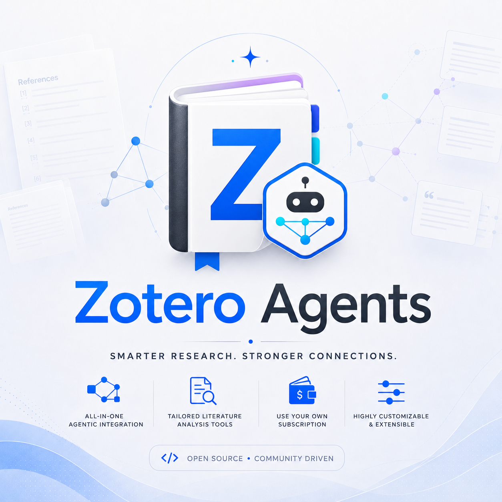
</p>

<p align="center">
  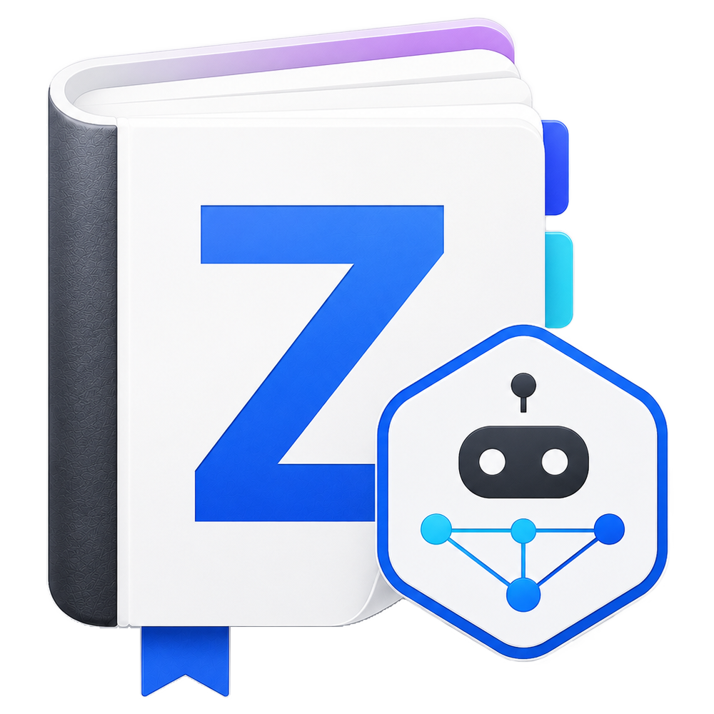
</p>

<h1 align="center">Zotero Agents</h1>

<p align="center">
  <a href="https://github.com/leike0813/zotero-agents/releases"></a>
  
  <a href="https://github.com/leike0813/zotero-agents/blob/main/LICENSE"></a>
  
</p>

<p align="center">
  <a href="README.md">English</a> ·
  <a href="README-zhCN.md">简体中文</a> ·
  <strong>繁體中文</strong> ·
  <a href="README-jaJP.md">日本語</a> ·
  <a href="README-frFR.md">Français</a> ·
  <a href="README-de.md">Deutsch</a> ·
  <a href="README-esES.md">Español</a> ·
  <a href="README-ptBR.md">Português</a> ·
  <a href="README-koKR.md">한국어</a> ·
  <a href="README-itIT.md">Italiano</a> ·
  <a href="README-ruRU.md">Русский</a> ·
  <a href="https://leike0813.github.io/zotero-agents/">📖 在線文檔站</a> ·
  <a href="https://github.com/leike0813/zotero-agents">GitHub</a> ·
  <a href="https://gitee.com/leike0813/zotero-agents">Gitee</a>
</p>

> 💡 自 v0.5.0 起，本外掛程式由 **Zotero Skills** 更名為 **Zotero Agents**。

---

<p align="center">
  <strong>你的 Zotero 文獻庫，現在由 AI Agent 驅動。</strong><br/>
  <sub>讓文獻搜尋、分析、管理、綜合與寫作準備沉澱為可審校、可追溯、可重複使用的研究知識。</sub>
</p>

<p align="center">
  <a href="https://leike0813.github.io/zotero-agents/getting-started">
    
  </a>
  &nbsp;
  <a href="https://github.com/leike0813/zotero-agents/releases">
    
  </a>
</p>

---

Zotero Agents 是 Zotero 文獻庫的**一站式 Agentic 工作台**——它不是你問一句、它答一句的聊天助手，而是讓 AI Agent 直接在你的文獻庫中工作，把論文從「讀過就忘的 PDF」變成**可探索、可審校、可累積的研究知識網路**。

**把文獻交給 Agent，你只需要做決策。** 文獻分析——AI 自動提取摘要、參考文獻與引文意見，一次執行沉澱三份結構化筆記；文獻搜尋與入库——Agent 連網檢索、篩選候選、等你確認後逐篇入库；標籤規範化——基於你定義的受控詞彙自動整理與推斷標籤；深度閱讀——生成精美 HTML 精讀文件，疊加你的文獻庫知識；Topic 綜合——圍繞一個研究方向，梳理基礎文獻、前沿工作、關鍵論點與方法分歧，產出一勞永逸的綜述報告。

這背後是三套協同運作的子系統：**可插拔 Workflow 引擎**（所有業務邏輯以獨立套件形式發佈安裝，外掛本身零耦合）、**Synthesis Workbench**（引文圖譜、概念知識庫、主題圖——把單篇分析匯聚為長期知識層）、和 **Host Bridge**（CLI + MCP 讓外部 Agent 讀寫你的 Zotero 庫，把研究任務委派給可背景持續運行的自動化流水線）。

---

| 🔧 | 💬 | 🔬 | 🔌 |
|:--:|:--:|:--:|:--:|
| **可插拔 Workflow** | **Assistant Sidebar** | **Synthesis Workbench** | **Host Bridge** |
| 論文解析、深度閱讀、標籤規範化、主題綜合——組織為可擴充流程 | 透過 ACP 連接 Agent，圍繞文獻、條目、庫對話協作 | 管理引文網路、概念、標籤與主題綜合，知識層持續沉澱 | CLI + MCP 讓外部 Agent 讀 Zotero 上下文、寫回分析結果 |

---

## 快速導覽

| 我是…                           | 從這裡開始                                                     |
| ------------------------------- | ------------------------------------------------------------- |
| 🔰 新使用者，想了解能做什麼       | → [3 步快速上手](#3-步快速上手)                                  |
| 📄 想快速處理論文（摘要、解讀） | → [核心工作流程](#核心工作流程)                                  |
| 📊 在做文獻綜述，需要系統化知識 | → [文獻綜合工作台](#文獻綜合工作台)                              |
| 💬 想與 AI 圍繞文獻對話         | → [AI 互動面板](#ai-互動面板)                                  |
| 💰 關心 AI 費用與引擎選擇       | → [AI 引擎與費用](#ai-引擎與費用)                               |
| 🔌 對外整合，讓 Agent 讀你的庫  | → [Host Bridge 與 MCP](#host-bridge--mcp-server)               |
| 🛠 開發者，想擴充或貢獻         | → [架構概覽](#架構概覽) · [開發者文件](#開發者文件)              |
| 📚 需要完整使用手冊             | → [使用者文件站](https://leike0813.github.io/zotero-agents/)     |

---

## 安裝與設定

### 系統需求

- [Zotero 9](https://www.zotero.org/download/) 或 [Zotero 7](https://www.zotero.org/download/)（版本 ≥ 6.999）
- 若使用 ACP 後端：本機已安裝對應的 Agent CLI 工具（`npx` 自動安裝亦可）
- 若使用 Skill-Runner 後端：已部署 [Skill-Runner](https://github.com/leike0813/Skill-Runner) 執行個體

> **關於 Zotero 版本**：本外掛在 Zotero 9 上開發與測試。Zotero 8 理論上可完整支援（Zotero 8/9 的外掛框架沒有明顯改變）；Zotero 7 理論上也能支援，但受限於精力未進行深入測試，未來的維護重點將放在 Zotero 9 上。如果在 Zotero 7 使用過程中遇到問題，請在 [Issues](https://github.com/leike0813/zotero-agents/issues) 回報。

### 後端類型

| 後端類型 | 推薦度 | 用途 | 設定方式 |
|---------|--------|------|---------|
| **ACP** | 🥇 首選 | 直連 Agent CLI（Codex、OpenCode、Claude Code、Gemini CLI、Qwen Code），零設定負擔 | 在 Backend Manager 中從預設新增 |
| **Skill-Runner (Docker)** | 🥈 推薦 | 常駐服務，不受 Zotero 啟停影響，支援區域網路共享 | Docker compose up，然後在 Backend Manager 中填寫 URL |
| **Skill-Runner (一鍵部署)** | 🥉 應急 | 隨外掛啟停，關閉 Zotero 即終止所有任務 | 偏好設定中一鍵 Deploy |

> 此外，外掛還內建了 **Generic HTTP**（呼叫任意 HTTP API，如 MinerU 服務）與 **Pass-Through**（純本機操作，如筆記匯出匯入）兩種後端類型，在特定 Workflow 中自動使用，無需額外關注。

---

## 3 步快速上手

### 1️⃣ 安裝外掛

從 [Releases](https://github.com/leike0813/zotero-agents/releases) 下載 `.xpi` 檔案 → Zotero `工具` → `附加元件` → ⚙️ → `從檔案安裝附加元件…` → 重新啟動 Zotero。

### 2️⃣ 設定 AI 後端

> 🥇 **首選 ACP** — 只要本機有 Codex / OpenCode / Claude Code 等支援 ACP 的 Agent 工具，直接零設定使用。

**方案 A — 直連 ACP Agent（推薦）**

`工具` → `Backend Manager` → ACP Tab → 從 **Add from Preset** 選擇你的 Agent 工具 → 儲存。無需填寫任何參數。

**方案 B — Docker 部署 Skill-Runner（需要背景常駐時）**

在機器上 [Docker 部署 Skill-Runner](https://leike0813.github.io/zotero-agents/backends/skill-runner#推荐docker-常驻部署)，然後在後端管理器中新增 SkillRunner 執行個體並填寫 Base URL。

> 注意：一鍵部署本機後端僅適合完全不會安裝 Agent / Docker 的使用者。關閉 Zotero 即終止所有任務。

### 3️⃣ 右鍵執行

在 Zotero 文獻列表中**右鍵一篇論文**，選擇 `Zotero Agents` → `文獻分析`。幾分鐘後，你會在看見 AI 產生的摘要、參考文獻清單與引文分析。

> 詳細的設定與使用說明請見[在線文件站](https://leike0813.github.io/zotero-agents/)。

---

## 核心工作流程

每天都要用到的功能，右鍵論文即可觸發。

| 功能 | 說明 | 觸發方式 |
|------|------|----------|
| 📊 **文獻分析** | AI 自動產生論文摘要、提取參考文獻、輸出引文分析報告。可串接執行標籤規範化 | 右鍵論文 → `文獻分析` |
| 💬 **互動式文獻解讀** | 多輪對話深入理解論文。AI 回答經過驗證關卡，有疑問的答案會被明確提醒，不用擔心幻覺問題。對話紀錄可產生為學習筆記 | 右鍵論文 → `文獻解讀` |
| 📖 **深度閱讀** | 產生結構化精讀視圖，支援多段翻譯與概念解析 | 右鍵論文 → `深度閱讀` |
| 🌱 **標籤詞彙初始化** | 與 AI 互動式建立研究領域的受控標籤詞彙。建議在開始文獻分析前先初始化 | Dashboard → `Tag Bootstrapper` |
| 🏷️ **標籤規範化** | 基於受控詞彙自動整理標籤，AI 推斷新標籤並等待審核 | 右鍵條目 → `標籤規範化` |
| 🔎 **文獻搜尋與入库** | 讓 Agent 幫你快速擴充文獻庫：搜尋、篩選、確認後直接入库 | Dashboard → `文獻搜尋與入库` |
| 📋 **PDF 解析** | 將 PDF 轉為 Markdown（呼叫 MinerU 服務） | 右鍵 PDF → `MinerU` |
| 📤 **筆記匯出/匯入** | 批次匯出摘要與筆記為 Markdown，或匯入外部筆記 | 右鍵選取條目 → 匯出/匯入 |

> **💡 關於產物筆記**：文獻分析的產物（摘要、參考文獻、引文分析）會以 Note 附件的形式新增到父條目。筆記中顯示的內容是從後台資料**渲染**出來的，直接修改筆記內容不會改變後台資料。如需編輯，請使用「匯出筆記」匯出 → 修改 → 再透過「匯入筆記」重新匯入。

<p align="center">
<table>
<tr>
<td width="33%" align="center">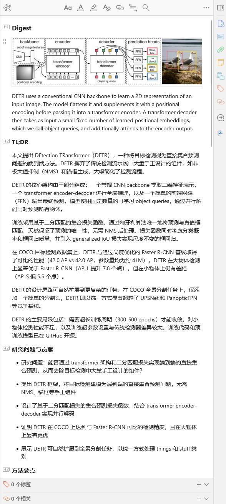<br/><sub>Digest — 文獻摘要</sub></td>
<td width="33%" align="center">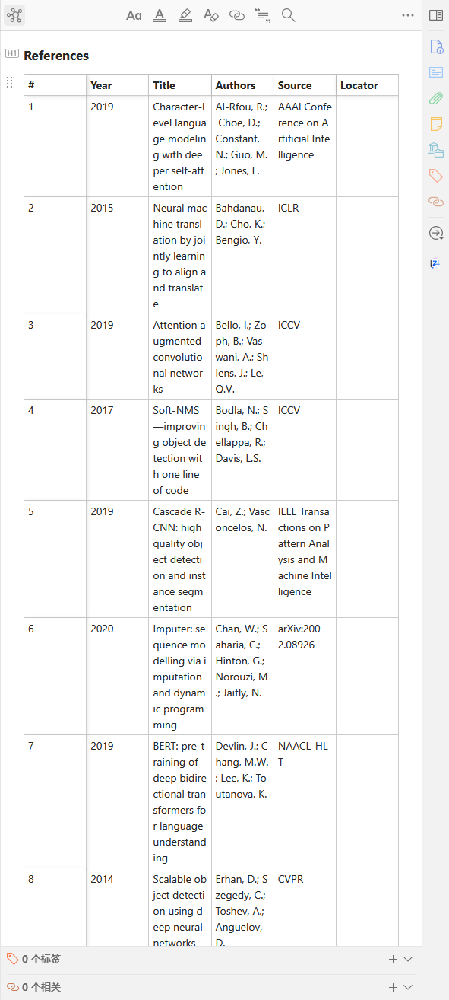<br/><sub>References — 參考文獻</sub></td>
<td width="33%" align="center">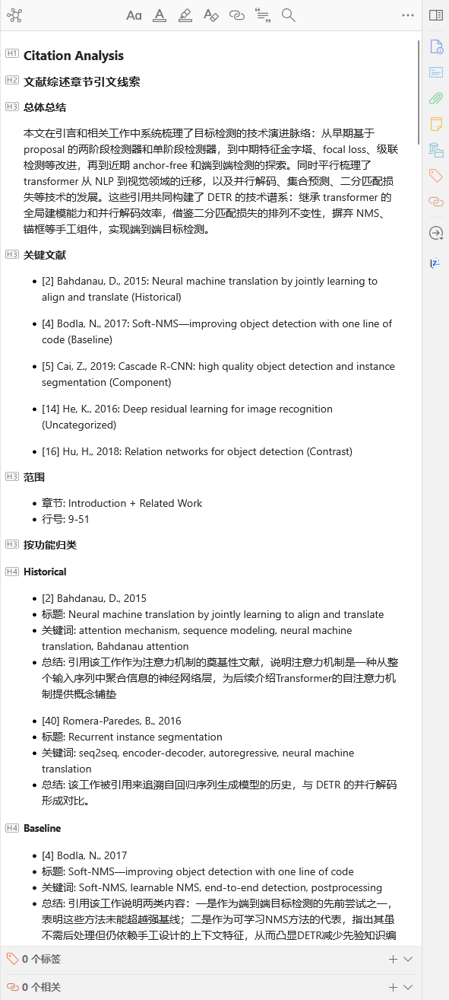<br/><sub>Citation Analysis — 引文分析</sub></td>
</tr>
</table>
</p>

---

## 推薦工作流程

從零開始到寫出文獻綜述，推薦按以下順序推進：

### 📋 第一步：建立標籤詞彙

在開始文獻分析前，建議先用 **Tag Bootstrapper** 初始化一個研究領域的受控標籤詞彙。這樣後續的文獻分析就能自動為每篇論文整理標籤。

```
Dashboard → Tag Bootstrapper → 與 AI 互動定義你的研究領域標籤體系
```

### 📥 第二步：入库與分析

**Literature Analysis 是 Agentic 文獻管理的核心** — 所有入库文獻都應該跑一次。

```
拿到原文 PDF
  → 右鍵 PDF → MinerU（轉 Markdown，效果最佳）
  → 右鍵論文 → 文獻分析
     └── AI 自動產生摘要 + 參考文獻 + 引文分析
     └── 同時自動執行標籤規範化（預設開啟，建議保持）
```

> **💡 擴充文獻庫**：需要快速補充大量相關文獻？用 **Literature Search & Ingest** 讓 Agent 幫你搜尋、篩選與批次入库。

### 🔗 第三步：引用去重與圖譜

當文獻庫有一定規模且都執行過 Analysis 後：

```
開啟 Synthesis Workbench → Index 頁面
  → 執行 Advance Matching（進階匹配演算法進行引用文獻去重）
  → 前往 Review 頁面處理審批項目（不確定的匹配需要你手動確認）
  → ⚠️ 別忘了將 pending 的決策「套用」！
  → 開啟 Graph 頁面 → 你會看到一張完整、準確的引文圖譜 ✨
```

> 準確的圖譜關係有助於計算各文獻的重要程度（PageRank、frontier score 等），這會直接影響後續 Topic 綜合的品質。

### 📊 第四步：建立 Topic 綜合

當你覺得文獻量已足夠，且都經過 Analysis 與 Advance Matching：

```
Dashboard → Create Topic Synthesis → 輸入主題種子
  → Agent 自動執行 3 步驟流水線（準備 → 核心增強 → 定稿）
  → 開啟 Synthesis Workbench → Topics 頁面
  → 檢視專業、細緻且精美的 Topic 導覽 ✨
```

<p align="center">
  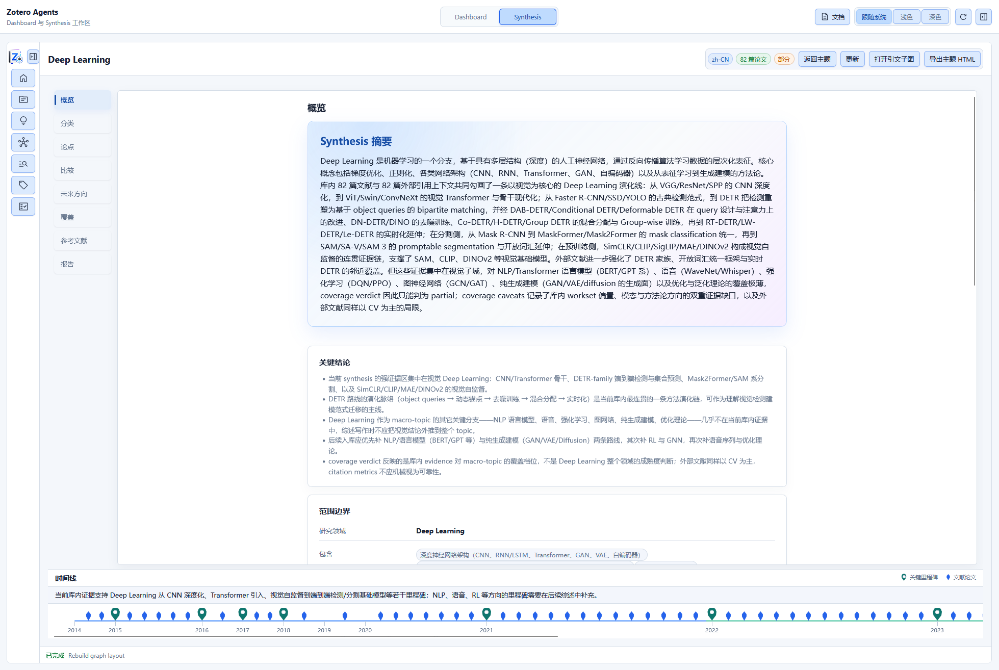
</p>

### ✍️ 第五步：產生文獻綜述

當你有一個研究思路，想要了解並總結相關領域的研究進展時：

```
蒐集並入库文獻 → 執行文獻分析 → 建立幾個 Topic
  → Dashboard → Manuscript Literature Framing
  → 與 Agent 互動確定論文定位與寫作風格
  → 產生 Introduction + Related Work 的 LaTeX 草稿
  → 產物在 Dashboard 的產物區下載
  → 直接放入 LaTeX 文稿，或匯出後進一步加工
```

### 💡 更多情境

<details>
<summary><b>對某篇論文有疑問？互動式文獻解讀</b></summary>

右鍵論文 → `文獻解讀` → 在 Dashboard 中與 AI 互動式討論。不用擔心幻覺問題 — AI 的回答必須經過**驗證關卡**，有疑問的答案會被明確提醒。對話結束後可將問答紀錄產生為學習筆記，以 Note 附件儲存。

</details>

<details>
<summary><b>以文獻為上下文與 AI 自由對話</b></summary>

選取論文 → 開啟側邊欄 ACP Chat → 選擇後端 → 圍繞論文內容自由對話。Host Bridge 自動提供文獻上下文，支援模型/模式切換。

</details>

<details>
<summary><b>引文溯源與圖譜分析</b></summary>

開啟 Synthesis Workbench → Graph 頁面 → 搜尋關鍵論文 → 切換到 Radial 版面配置以該論文為中心展開 → 檢視引用/被引關係、PageRank 與 frontier score 指標。

</details>

<details>
<summary><b>團隊標籤規範</b></summary>

Tag Bootstrapper 初始化詞彙 → 選取一批論文 → 標籤規範化 → AI 建議的標籤透過 Staged 審核後加入詞彙 → 詞彙透過 WebDAV 同步給團隊成員。

</details>

---

## 文獻綜合工作台

把零散的論文變成**可探索的知識網路**。這是本外掛與其他 Zotero AI 工具最根本的不同。

> 核心工作流程幫你**讀**論文，文獻綜合工作台幫你**組織**知識。

工作台是 Zotero 中的一個完整 Workspace Tab，包含 8 個 Surface：

| Surface | 功能 |
|---------|------|
| **Home** | 文獻庫概覽儀表板：庫洞察卡片、同步狀態面板、審核項目摘要、熱門主題入口 |
| **Topics** | 主題管理（建立/更新/瀏覽），支援圖形/網格/清單三種視圖 |
| **Index** | 規範參考文獻索引：論文註冊表 + 引用綁定 + 合併/去重/重新導向 |
| **Review** | 審核中心：引用匹配審核、概念審核、主題圖關係審核（接受/拒絕/批次操作）|
| **Graph** | 引文圖譜視覺化（力導向/徑向/元件版面配置），支援主題篩選與指標分析 |
| **Tags** | 受控標籤詞彙管理 + AI 標籤建議審批（Promote/Discard） |
| **Concepts** | 概念知識庫：概念/義項/別名/關係四層結構，可疊加到主題圖與閱讀器 |
| **Reader** | 主題深度閱讀器：Overview / Taxonomy / Claims / Compare / Future Directions / Coverage / References / Report |

工作台內建 **WebDAV 同步**功能，可將標籤詞彙、主題綜合、概念知識庫等結構化資料透過 WebDAV 通訊協定同步到遠端，實現輕量級的跨裝置同步與備份。

<table>
<tr>
<td width="50%">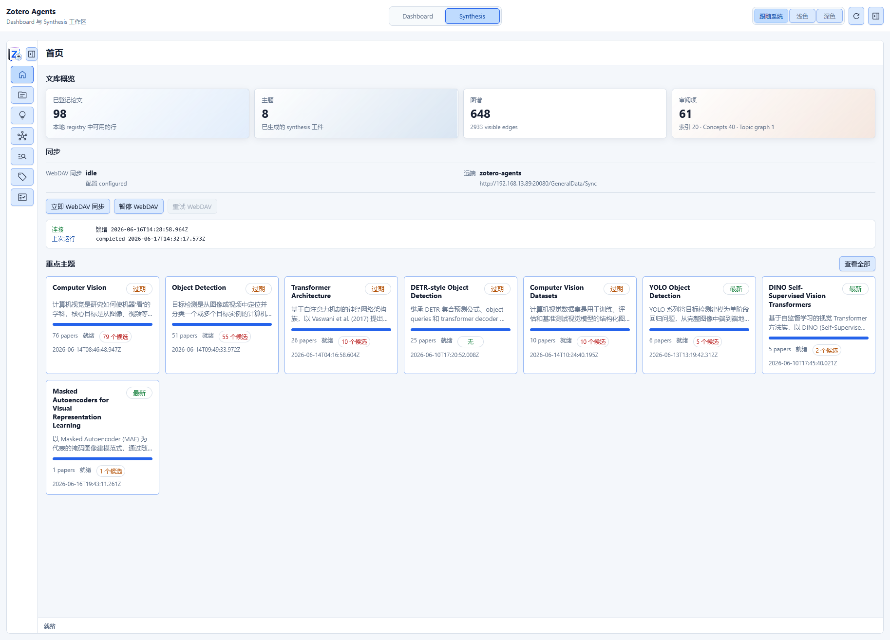</td>
<td width="50%">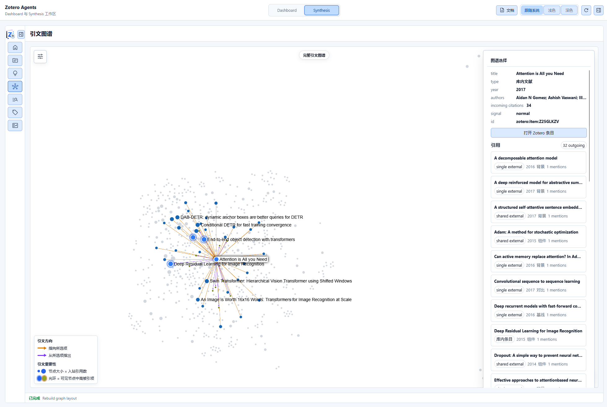</td>
</tr>
</table>

---

## AI 互動面板

v0.5.0 新增了完整的 AI 互動側邊欄，提供三種互動模式：

<table>
<tr>
<td width="33%" align="center">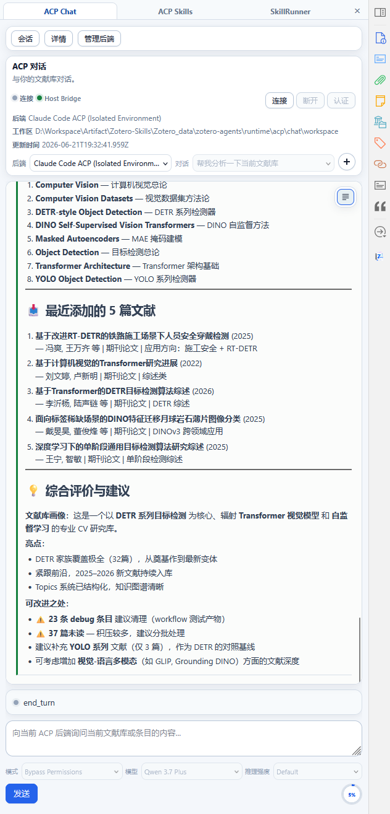<br/><sub>💬 ACP Chat — 以文獻庫為上下文的持續對話</sub></td>
<td width="33%" align="center">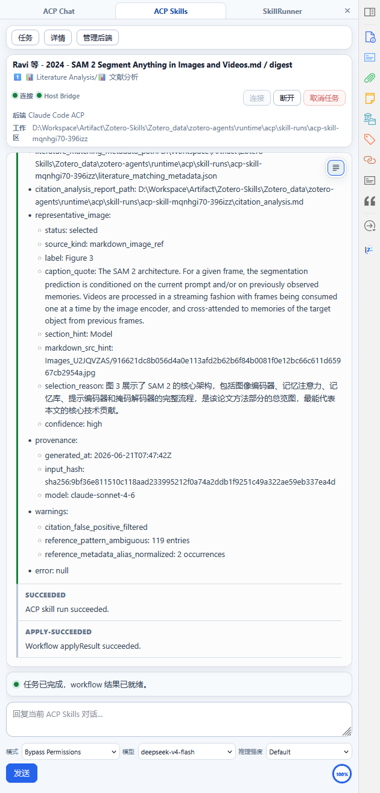<br/><sub>⚙️ ACP Skills — 使用 ACP 通訊協定連接本機 Agent 執行工作流程</sub></td>
<td width="33%" align="center">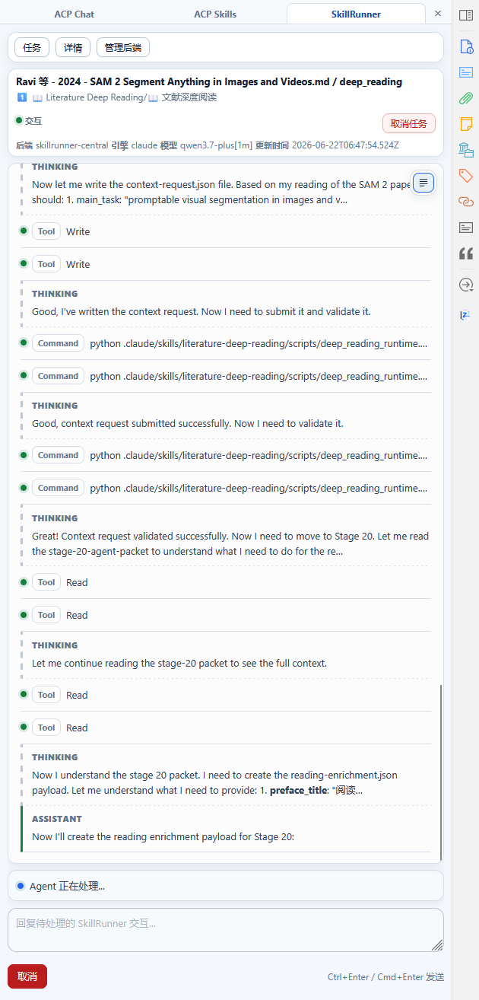<br/><sub>🔧 SkillRunner — 與託管式的 Skill-Runner 服務後端通訊</sub></td>
</tr>
</table>

---

## Host Bridge & MCP Server

Zotero 啟動時，外掛自動執行一個本機 Host Bridge 服務。外部 AI 工具（Codex、OpenCode 等）可以**直接存取你的 Zotero 文獻庫** — 讀取論文、搜尋條目、管理標籤，甚至觸發工作流程。

| 能力 | 說明 |
|------|------|
| 🔌 **庫存取** | 外部 Agent 直接讀取 Zotero 條目、筆記、附件、標籤、合集 |
| ⚡ **工作流程觸發** | 透過 Bridge API 遠端觸發 AI 工作流程執行 |
| 📊 **Synthesis 查詢** | 查詢引文圖譜、主題、概念知識庫、參考文獻索引 |
| 🖥 **MCP 工具** | 內嵌 MCP Server，為 ACP Agent 提供結構化的 Zotero 操作工具 |
| 🔒 **安全性** | Token 認證 + 寫入操作審批，資料不離開本機 |

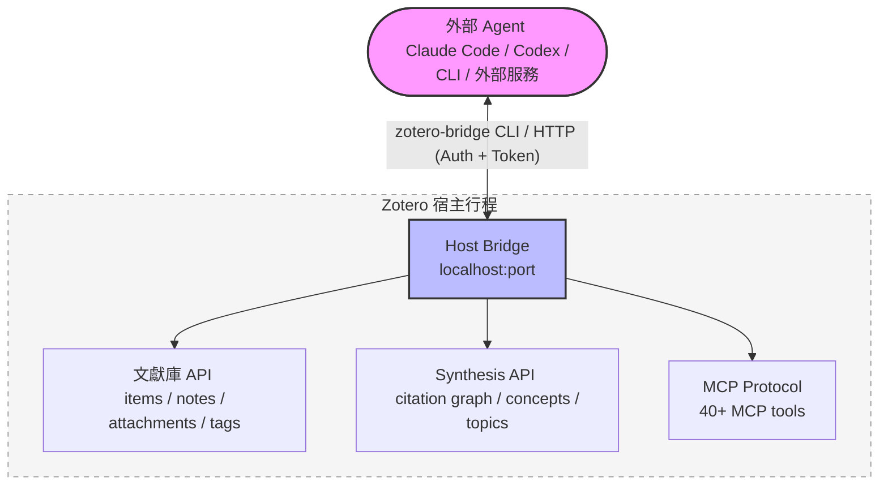

Host Bridge CLI (`zotero-bridge`) 提供 20+ 子命令，支援 Windows / macOS / Linux（含 ARM）。

---

## 可插拔的 Workflow 引擎

外掛本身不包含具體業務邏輯 — 所有 AI 能力透過**外部 Workflow 套件**接入。

- 📦 **隨插即用**：將 workflow 套件放入目錄，立即可用，無需重新建置
- 📝 **宣告式定義**：透過 `workflow.json` manifest + 少量 hook 腳本描述「做什麼」
- 🔗 **Sequence 編排**：多個 Skill 按序串聯，支援 handoff、workspace 隔離與提前終止
- 🌐 **多後端路由**：同一個 workflow 可以在 Skill-Runner、ACP、HTTP 等不同後端上執行
- 🌍 **多語言**：workflow 內建 i18n 支援，UI 文字隨 Zotero 語言自動切換
- ✅ **宣告式輸入驗證**：`validateSelection` — 無需寫 JS 即可約束輸入條件

> 完整的自訂 Workflow 開發指南請見[使用者文件站](https://leike0813.github.io/zotero-agents/workflows/custom/)。

---

## 內建 Markdown 閱讀器

外掛內建了一個輕量級 Markdown 閱讀器。在 Zotero 中**雙擊任意 `.md` 附件**即可在內建閱讀器中開啟，無需跳轉到外部應用程式。

| 功能 | 說明 |
|------|------|
| 📑 **大綱導覽** | 自動解析標題層級（h1–h4），左側邊欄顯示可跳轉的大綱 |
| 🔍 **搜尋** | 全文關鍵字搜尋，命中處高亮標記 |
| 📐 **數學公式** | KaTeX 轉譯 LaTeX 公式，支援行內與區塊級公式 |
| 💻 **程式碼 Highlight** | highlight.js 語法高亮，支援主流程式語言 |
| 🔤 **字體大小調整** | 12px–24px 可調，適合不同螢幕與閱讀習慣 |
| 📏 **寬度切換** | 支援窄欄（860px）與寬欄（1160px）兩種閱讀寬度 |
| 📋 **複製** | 支援複製 Markdown 原文到剪貼簿，以及複製檔案路徑 |
| 📂 **系統開啟** | 一鍵使用系統預設應用程式開啟該檔案 |
| 🌗 **自動主題** | 自動適應 Zotero 亮色/暗色主題，無需手動切換 |

閱讀器由 `markdown-it` 驅動轉譯，配合內建的 HTML 淨化確保安全轉譯。可在偏好設定中關閉此功能，改回系統預設開啟方式。

<p align="center">
  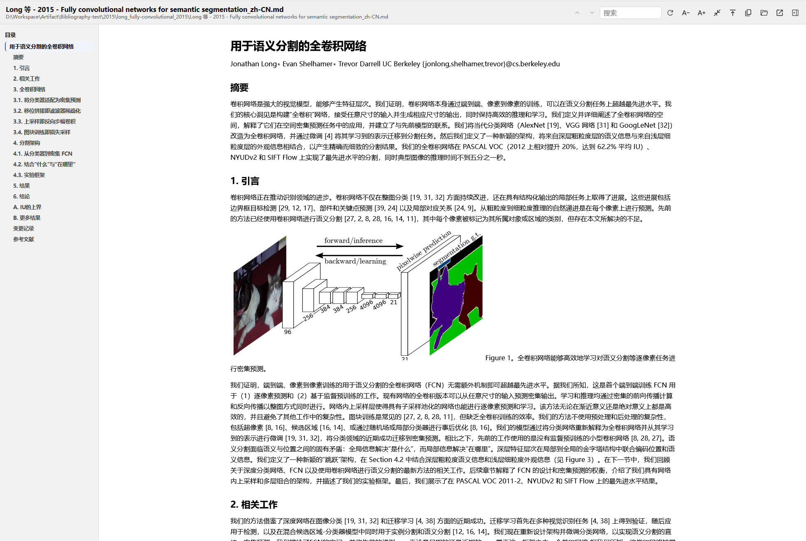
</p>

---

## v0.5.0 主要變化

> 從 v0.4.0 到 v0.5.0 跨越了 **42 個 commit**，是一次從「Skill-Runner 前端」到「通用 Agent 執行框架」的全面進化。

<table>
<tr>
<td width="50%">

### ✨ 新增

- **ACP 後端** — 直連 Codex、OpenCode、Claude Code、Gemini CLI、Qwen Code 等 Agent CLI
- **ACP Chat 面板** — 以文獻為上下文的持續對話，支援模型/模式切換與 Token 用量視覺化
- **ACP Skill Runs 面板** — 監控技能執行全程，含轉錄、權限審批、輸出預覽
- **文獻綜合工作台** — 完整的 Synthesis Workbench，8 大 Surface
- **引文圖譜** — 力導向/徑向/元件版面配置，支援主題篩選與指標計算
- **概念知識庫** — 概念/義項/別名/關係四層結構，可疊加到主題圖
- **深度閱讀** — 結構化精讀視圖，含概念覆蓋與引文上下文
- **Host Bridge + MCP Server** — 把 Zotero 變成可程式化服務
- **內建 Markdown 閱讀器** — 雙擊 `.md` 附件即開啟內建閱讀器，支援大綱導覽、搜尋、數學公式、程式碼高亮
- **Sequence 執行** — 多 Skill 按序串聯，支援中間結果傳遞
- **Backend Manager 對話方塊** — 統一管理所有後端設定
- **WebDAV 同步** — 輕量級 Synthesis 資料跨裝置同步

</td>
<td width="50%">

### ♻️ 改進

- **Dashboard 全面重構** — 新增後端視圖、產物瀏覽器、Skill Feedback、記錄診斷匯出
- **宣告式選取驗證** — `validateSelection` 取代命令式 `filterInputs`，零 JS 即可定義輸入約束
- **SkillRunner 連線治理** — 連線密度最佳化、預請求狀態視覺化、故障復原增強
- **多語言 UI** — Synthesis Workbench 與 Workflow 系統支援中/英/法/日
- **Cross-platform CLI** — Host Bridge CLI 新增 Linux ARM/ARM64/x86 預編譯
- **執行時資料管理** — 偏好設定中可檢視儲存用量、清理各類快取資料
- **Skill Run Feedback** — 成功執行後可自動蒐集 AI 回饋報告

</td>
</tr>
</table>

---

## 官方 Workflow

<details>
<summary>展開完整 Workflow 清單</summary>

### 文獻處理

| Workflow | 後端 | 說明 |
|----------|------|------|
| **文獻分析** ⭐ | `skillrunner` | 產生摘要 + 參考文獻 + 引文分析筆記。可串接執行標籤規範化（預設開啟） |
| **文獻解讀** | `skillrunner` | 多輪對話式文獻理解，答案經驗證關卡防幻覺。記錄可儲存為學習筆記 |
| **深度閱讀** | `acp` | 結構化精讀視圖（HTML），含概念覆蓋與引文上下文 |
| **文獻搜尋與入库** | `acp` | 讓 Agent 幫你搜尋、篩選文獻，確認後直接入库 |
| **MinerU** | `generic-http` | PDF → Markdown 轉換（呼叫 MinerU 服務） |

### 綜合與整理

| Workflow | 後端 | 說明 |
|----------|------|------|
| **Topic 綜合** | `acp` | 3 步驟 Sequence：準備 → 核心增強 → 定稿。Agent 全自動處理 |
| **文稿文獻框架** | `acp` | 互動式產生 Introduction + Related Work 的 LaTeX 草稿 |
| **標籤詞彙初始化** | `skillrunner` | 與 AI 互動建立研究領域的受控標籤詞彙。建議首先執行 |
| **標籤規範化** | `skillrunner` | LLM 驅動的標籤推斷 + 受控詞彙整理 |

### 工具

| Workflow | 後端 | 說明 |
|----------|------|------|
| **筆記匯出** | `pass-through` | 批次匯出摘要/筆記為 Markdown（修改後可重新匯入） |
| **筆記匯入** | `pass-through` | 匯入外部 Markdown 為 Zotero 筆記 |
| **Debug Probe** | 多種 | 13 個偵錯探針，驗證 Sequence 執行、apply 合約、Host Bridge 連通性等 |

</details>

---

## AI 引擎與費用

本外掛不綁定任何 AI 服務商。你用自己的訂閱額度、Coding Plan 或 API Key 直接連接後端 — **沒有中間商，沒有 per-token 加價**。

### 擔心 Token 太貴？

好消息：本專案的所有 Skill 都經過精心設計，**即便是較弱的模型（甚至本機部署的模型！）也能實現很驚豔的執行效果**。你不需要最貴的模型就能獲得出色的結果。

### 費用參考

| 方案 | 費用 | 說明 |
|------|------|------|
| **DeepSeek V4 Flash** | 約 ￥2/篇 | 按量付費。每篇文獻的 Literature Analysis 大約只需不到 ￥2 |
| **Coding Plan** | 包月固定價 | 如果你有幸搶購到按次計費的 Coding Plan（百煉、智譜等），完全可以低價、批次處理文獻 — 我們透過 Coding Agent 呼叫，**完全合規** |
| **[OpenCode Go](https://opencode.ai/go?ref=SZDFT9GZKW)** | \$10/月（首月 \$5） | 幾乎不限量的 DeepSeek V4 Flash 額度。透過[此連結](https://opencode.ai/go?ref=SZDFT9GZKW)訂閱，你與作者各獲 $5 抵扣 |
| **Codex 免費版** | 免費 | 模型受限，但依然能跑出很好的結果 |

### 引擎比較

| 引擎 | 適合情境 | 費用 | 推薦度 |
|------|---------|------|--------|
| **Codex** | 綜合最佳，速度與品質兼得。支援思維流式展示 | 免費版可用（模型受限） | ⭐⭐⭐ 首選 |
| **Opencode** | 配合 Coding Plan 或 [OpenCode Go](https://opencode.ai/go?ref=SZDFT9GZKW)，Qwen3.5-Plus / Kimi-K2.5 / GLM-5 等模型在文獻任務上表現優秀 | 低成本 | ⭐⭐⭐ 強推 |
| **Qwen Code** | 阿里生態使用者，配合百煉 Coding Plan | 自帶額度已結束，依賴 Plan | ⭐⭐ 可選 |
| **Gemini CLI** | 簡單任務 | 免費版可用 | ⭐ 一般 |
| **Claude Code** | 指令執行品質高，但效率較低 | 付費 | 按需選 |

> 各引擎的詳細部署指南請見[使用者文件站](https://leike0813.github.io/zotero-agents/backends/skill-runner#引擎系统)。

---

## 架構概覽

<details>
<summary>展開架構圖</summary>

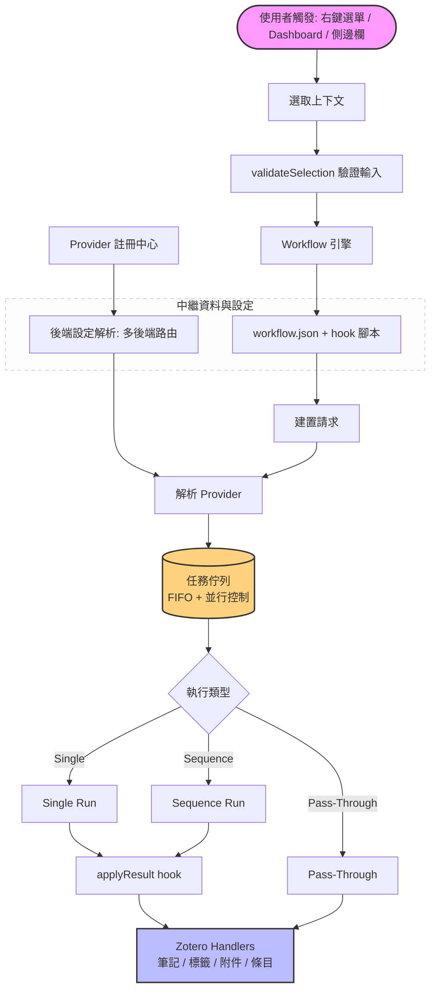

核心設計理念：外掛本身是一個**執行殼**，不包含具體業務邏輯。透過宣告式 `workflow.json` manifest 與 hook 腳本定義「做什麼」，外掛負責「怎麼執行」。

</details>

更多架構細節請見[使用者文件站：自訂 Workflow](https://leike0813.github.io/zotero-agents/workflows/custom/)。

---

## 過渡版本說明

> **v0.5.0 是更名為「Zotero Agents」後的首個重要里程碑。** 相比 v0.4.0（純 Skill-Runner 前端），v0.5.0 完成了向通用 Agent 執行框架的全面轉型 — 新增 ACP 後端支援、文獻綜合工作台、引文圖譜、概念知識庫、Host Bridge、MCP Server 等核心能力，已可在日常研究中穩定使用。

### ⚠️ 已知限制

| 限制 | 說明 | 計畫 |
|------|------|------|
| **Synthesis 重計算會阻塞 UI** | 重新整理索引、重建 Citation Graph、Advance Matching 等操作計算量較大，在 Zotero 單一宿主行程的架構下會導致 UI 短暫卡頓。執行時請耐心等待 | 計畫在後續重構中解決 |
| **WebDAV 同步尚未完整測試** | 自動同步功能尚未經過充分測試，若要使用請盡量只使用手動同步 | 後續版本完善 |
| **大型文獻庫效能** | 尚未在大規模文獻庫下進行充分的效能測試 | 待後續更新解決 |

### 後續計畫

- 完善多語言支援與使用者引導
- 提升跨後端的一致性體驗
- 最佳化 Synthesis 重計算的 UI 回應性
- 持續打磨穩定性與效能

> 如遇到問題請在 [Issues](https://github.com/leike0813/zotero-agents/issues) 回報。

---

## 開發者文件

<details>
<summary>展開開發指南</summary>

### 本機開發

```bash
npm install          # 安裝相依套件
npm start            # 啟動開發伺服器
npm test             # 執行 lite 測試
npm run test:full    # 執行全量測試
npm run build        # 生產建置
```

### 文件索引

| 文件 | 說明 |
|------|------|
| [架構流程](doc/architecture-flow.md) | 執行管線總覽（含 Mermaid 流程圖） |
| [開發指南](doc/dev_guide.md) | 核心元件、設定模型、執行鏈路 |
| [工作流程元件](doc/components/workflows.md) | Manifest schema、hooks、輸入篩選、執行語意 |
| [Provider 元件](doc/components/providers.md) | Provider 契約系統、請求類型 |
| [測試策略](doc/testing-framework.md) | 雙執行環境、lite/full 模式、CI 關卡 |
| [Synthesis 層](doc/synthesis-layer/README.md) | 知識圖譜、引文圖譜、概念知識庫的內部設計 |

</details>

---

## 使用者文件

完整的使用手冊請見線上文件站：[https://leike0813.github.io/zotero-agents/](https://leike0813.github.io/zotero-agents/)

涵蓋：安裝、後端設定、Backend Manager、Workflow 呼叫、Dashboard、側邊欄（ACP Chat / ACP Skills / SkillRunner）、Synthesis Workbench、WebDAV 同步、偏好設定、自訂 Workflow 開發等全部功能。

---

## 授權條款

[AGPL-3.0-or-later](LICENSE)

## 致謝

- 基於 [Zotero Plugin Template](https://github.com/windingwind/zotero-plugin-template) 建置
- 使用 [zotero-plugin-toolkit](https://github.com/windingwind/zotero-plugin-toolkit)
- 由 [@windingwind](https://github.com/windingwind) 的外掛生態支援
