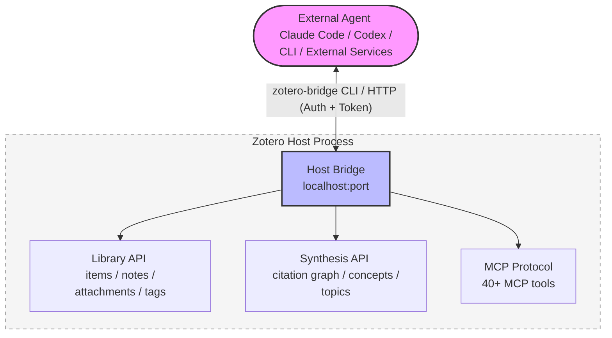
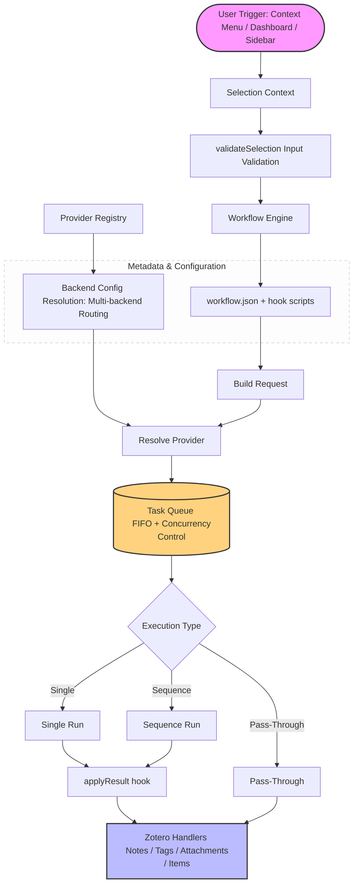

<!-- hero banner -->
<p align="center">
  
</p>

<p align="center">
  
</p>

<h1 align="center">Zotero Agents</h1>

<p align="center">
  <a href="https://github.com/leike0813/zotero-agents/releases"></a>
  
  <a href="https://github.com/leike0813/zotero-agents/blob/main/LICENSE"></a>
  
</p>

<p align="center">
  <strong>English</strong> ·
  <a href="README-zhCN.md">简体中文</a> ·
  <a href="README-zhTW.md">繁體中文</a> ·
  <a href="README-jaJP.md">日本語</a> ·
  <a href="README-frFR.md">Français</a> ·
  <a href="README-de.md">Deutsch</a> ·
  <a href="README-esES.md">Español</a> ·
  <a href="README-ptBR.md">Português</a> ·
  <a href="README-koKR.md">한국어</a> ·
  <a href="README-itIT.md">Italiano</a> ·
  <a href="README-ruRU.md">Русский</a> ·
  <a href="https://leike0813.github.io/zotero-agents/">📖 Docs</a> ·
  <a href="https://github.com/leike0813/zotero-agents">GitHub</a> ·
  <a href="https://gitee.com/leike0813/zotero-agents">Gitee</a>
</p>

> 💡 Starting from v0.5.0, this plugin has been renamed from **Zotero Skills** to **Zotero Agents**.

---

<p align="center">
  <strong>Your Zotero library, now powered by AI Agents.</strong><br/>
  <sub>Turn literature search, analysis, management, synthesis, and writing preparation into auditable, traceable, and reusable research knowledge.</sub>
</p>

<p align="center">
  <a href="https://leike0813.github.io/zotero-agents/getting-started">
    
  </a>
  &nbsp;
  <a href="https://github.com/leike0813/zotero-agents/releases">
    
  </a>
</p>

---

Zotero Agents is an **all-in-one agentic workbench** for your Zotero library — not a chatbot that trades Q&A with you, but AI Agents that work directly inside your library, transforming papers from "PDFs you read and forget" into an **explorable, auditable, and accumulable research knowledge network**.

**Hand your literature to the Agents — you just make decisions.** Literature Analysis — AI automatically extracts abstracts, references, and citation insights, producing three structured notes in a single run; Literature Search & Ingest — Agents search the web, filter candidates, and add papers to your library one by one after your confirmation; Tag Normalization — automatically organizes and infers tags based on your controlled vocabulary; Deep Reading — generates beautifully formatted HTML close-reading documents enriched with your library's knowledge; Topic Synthesis — focusing on a research direction, maps out foundational literature, cutting-edge work, key arguments, and methodological disputes, producing a once-and-for-all review report.

Behind the scenes, three subsystems work in concert: a **pluggable Workflow engine** (all business logic ships as independent packages with zero coupling in the plugin itself), the **Synthesis Workbench** (citation graph, concept knowledge base, topic graph — aggregating per-paper analysis into a long-term knowledge layer), and **Host Bridge** (CLI + MCP let external Agents read and write your Zotero library, delegating research tasks to automation pipelines that run in the background).

---

| 🔧 | 💬 | 🔬 | 🔌 |
|:--:|:--:|:--:|:--:|
| **Pluggable Workflows** | **Assistant Sidebar** | **Synthesis Workbench** | **Host Bridge** |
| Paper parsing, deep reading, tag normalization, topic synthesis — organized as extensible flows | Connect to Agents via ACP; collaborate on literature, items, and library through conversation | Manage citation networks, concepts, tags, and topic synthesis; knowledge layer accumulates over time | CLI + MCP let external Agents read Zotero context and write analysis results back |

---

## Quick Navigation

| I am...                                | Start here                                                       |
| -------------------------------------- | ---------------------------------------------------------------- |
| 🔰 A new user exploring what's possible | → [3-Step Quick Start](#3-step-quick-start)                      |
| 📄 Processing papers (abstracts, interpretations) | → [Core Workflows](#core-workflows)                     |
| 📊 Doing a literature review, need systematic knowledge | → [Synthesis Workbench](#synthesis-workbench)     |
| 💬 Want to converse with AI about literature | → [AI Interaction Panels](#ai-interaction-panels)           |
| 💰 Care about AI costs and engine choice | → [AI Engines & Costs](#ai-engines--costs)                      |
| 🔌 External integration, let Agents read your library | → [Host Bridge & MCP](#host-bridge--mcp-server)    |
| 🛠 A developer wanting to extend or contribute | → [Architecture Overview](#architecture-overview) · [Developer Docs](#developer-docs) |
| 📚 Need the full user manual          | → [Documentation Site](https://leike0813.github.io/zotero-agents/) |

---

## Installation & Configuration

### System Requirements

- [Zotero 9](https://www.zotero.org/download/) or [Zotero 7](https://www.zotero.org/download/) (version ≥ 6.999)
- If using the ACP backend: corresponding Agent CLI tools installed locally (`npx` auto-install also works)
- If using the Skill-Runner backend: a deployed [Skill-Runner](https://github.com/leike0813/Skill-Runner) instance

> **About Zotero versions**: This plugin is developed and tested on Zotero 9. Zotero 8 should be fully supported in theory (the plugin framework for Zotero 8/9 has not changed significantly); Zotero 7 should also work in theory, but due to limited bandwidth, it has not been thoroughly tested, and future maintenance will focus on Zotero 9. If you encounter issues on Zotero 7, please report them on [Issues](https://github.com/leike0813/zotero-agents/issues).

### Backend Types

| Backend Type | Recommendation | Use Case | Configuration |
|--------------|----------------|----------|---------------|
| **ACP** | 🥇 First choice | Direct connection to Agent CLI (Codex, OpenCode, Claude Code, Gemini CLI, Qwen Code), zero-config overhead | Add from preset in Backend Manager |
| **Skill-Runner (Docker)** | 🥈 Recommended | Persistent service, independent of Zotero's lifecycle, supports LAN sharing | Docker compose up, then fill in URL in Backend Manager |
| **Skill-Runner (One-click Deploy)** | 🥉 Emergency | Starts/stops with the plugin; closing Zotero terminates all tasks | One-click Deploy in Preferences |

> Additionally, the plugin includes two built-in backend types — **Generic HTTP** (calls any HTTP API, such as the MinerU service) and **Pass-Through** (purely local operations, such as note export/import) — which are used automatically by specific Workflows and require no extra attention.

---

## 3-Step Quick Start

### 1️⃣ Install the Plugin

Download the `.xpi` file from [Releases](https://github.com/leike0813/zotero-agents/releases) → Zotero `Tools` → `Add-ons` → ⚙️ → `Install Add-on From File…` → Restart Zotero.

### 2️⃣ Configure the AI Backend

> 🥇 **ACP First** — As long as you have an ACP-compatible Agent tool installed locally (Codex / OpenCode / Claude Code, etc.), use it directly with zero configuration.

**Option A — Direct ACP Agent Connection (Recommended)**

`Tools` → `Backend Manager` → ACP Tab → Select your Agent tool from **Add from Preset** → Save. No parameters needed.

**Option B — Docker-Deployed Skill-Runner (For persistent background service)**

[Deploy Skill-Runner via Docker](https://leike0813.github.io/zotero-agents/backends/skill-runner#推荐docker-常驻部署) on your machine, then add a SkillRunner instance in Backend Manager and fill in the Base URL.

> Note: The one-click local backend deployment is only suitable for users who cannot install Agent / Docker. Closing Zotero will terminate all tasks.

### 3️⃣ Right-Click to Run

In the Zotero literature list, **right-click a paper** and select `Zotero Agents` → `Literature Analysis`. In a few minutes, you'll see AI-generated abstracts, reference lists, and citation analysis in the notes pane.

> For detailed configuration and usage instructions, visit the [Documentation Site](https://leike0813.github.io/zotero-agents/).

---

## Core Workflows

The features you'll use every day — triggered by right-clicking a paper.

| Feature | Description | Trigger |
|---------|-------------|---------|
| 📊 **Literature Analysis** | AI automatically generates paper abstracts, extracts references, and produces citation analysis reports. Can cascade into Tag Normalization | Right-click paper → `Literature Analysis` |
| 💬 **Interactive Literature Explainer** | Multi-turn conversation for deep paper comprehension. AI answers go through a verification gate; uncertain answers are explicitly flagged — no hallucination worries. Conversation logs can be exported as study notes | Right-click paper → `Literature Explainer` |
| 📖 **Deep Reading** | Generates a structured close-reading view with multi-segment translation and concept explanation | Right-click paper → `Deep Reading` |
| 🌱 **Tag Vocabulary Initialization** | Interactively create a controlled tag vocabulary for your research domain with AI. Recommended before starting Literature Analysis | Dashboard → `Tag Bootstrapper` |
| 🏷️ **Tag Normalization** | Automatically organizes tags based on controlled vocabulary; AI infers new tags pending review | Right-click item → `Tag Normalization` |
| 🔎 **Literature Search & Ingest** | Let the Agent help you quickly expand your library: search, filter, confirm, and ingest directly | Dashboard → `Literature Search & Ingest` |
| 📋 **PDF Parsing** | Convert PDF to Markdown (calls the MinerU service) | Right-click PDF → `MinerU` |
| 📤 **Note Export/Import** | Batch export abstracts and notes as Markdown, or import external notes | Right-click selected items → Export/Import |

> **💡 About artifact notes**: The outputs of Literature Analysis (abstract, references, citation analysis) are added as Note attachments to the parent item. The content displayed in notes is **rendered** from backend data — directly editing the note content won't change the backend data. To edit, use "Export Notes" to export → modify → then "Import Notes" to re-import.

<p align="center">
<table>
<tr>
<td width="33%" align="center"><br/><sub>Digest — Paper Abstract</sub></td>
<td width="33%" align="center"><br/><sub>References — Bibliography</sub></td>
<td width="33%" align="center"><br/><sub>Citation Analysis — Citation Insights</sub></td>
</tr>
</table>
</p>

---

## Recommended Workflow

From scratch to writing a literature review, follow these steps in order:

### 📋 Step 1: Build a Tag Vocabulary

Before starting Literature Analysis, it's recommended to use **Tag Bootstrapper** to initialize a controlled tag vocabulary for your research domain. This way, subsequent Literature Analysis runs can automatically organize tags for each paper.

```
Dashboard → Tag Bootstrapper → Interactively define your research domain tag taxonomy with AI
```

### 📥 Step 2: Ingest & Analyze

**Literature Analysis is the core of agentic literature management** — every ingested paper should go through it.

```
Get the original PDF
  → Right-click PDF → MinerU (convert to Markdown for best results)
  → Right-click paper → Literature Analysis
     └── AI automatically generates abstract + references + citation analysis
     └── Tag Normalization runs automatically (enabled by default, recommended to keep on)
```

> **💡 Expanding your library**: Need to quickly gather a large number of related papers? Use **Literature Search & Ingest** to let the Agent search, filter, and batch-ingest papers for you.

### 🔗 Step 3: Citation Deduplication & Graph

Once your library has grown and all papers have been analyzed:

```
Open Synthesis Workbench → Index page
  → Run Advance Matching (advanced matching algorithm for citation deduplication)
  → Go to the Review page to handle approval items (uncertain matches need your manual confirmation)
  → ⚠️ Don't forget to "Apply" pending decisions!
  → Open the Graph page → You'll see a complete, accurate citation graph ✨
```

> Accurate graph relationships help calculate each paper's importance (PageRank, frontier score, etc.), which directly affects the quality of subsequent Topic Synthesis.

### 📊 Step 4: Create Topic Synthesis

When you feel the literature volume is sufficient and all papers have been analyzed and matched:

```
Dashboard → Create Topic Synthesis → Enter a topic seed
  → Agent automatically runs the 3-step pipeline (Prepare → Core Enhancement → Finalize)
  → Open Synthesis Workbench → Topics page
  → View the professional, detailed, and beautifully crafted Topic overview ✨
```

<p align="center">
  
</p>

### ✍️ Step 5: Generate Literature Review

When you have a research idea and want to understand and summarize related work:

```
Collect and ingest literature → Run Literature Analysis → Create several Topics
  → Dashboard → Manuscript Literature Framing
  → Interactively determine paper positioning and writing style with the Agent
  → Generate LaTeX drafts for Introduction + Related Work
  → Download artifacts from the Dashboard artifact area
  → Drop directly into your LaTeX manuscript, or export for further processing
```

### 💡 More Scenarios

<details>
<summary><b>Have questions about a paper? Interactive Literature Explainer</b></summary>

Right-click paper → `Literature Explainer` → Discuss interactively with AI in the Dashboard. Don't worry about hallucinations — AI answers must pass a **verification gate**, and uncertain answers are explicitly flagged. After the conversation ends, generate study notes from the Q&A log, saved as a Note attachment.

</details>

<details>
<summary><b>Chat freely with AI using literature as context</b></summary>

Select a paper → Open the sidebar ACP Chat → Choose a backend → Chat freely about the paper content. Host Bridge automatically provides literature context, with support for model/mode switching.

</details>

<details>
<summary><b>Citation tracing and graph analysis</b></summary>

Open Synthesis Workbench → Graph page → Search for key papers → Switch to Radial layout to expand around that paper → View citation/cited-by relationships, PageRank, and frontier score metrics.

</details>

<details>
<summary><b>Team tag standardization</b></summary>

Tag Bootstrapper initializes the vocabulary → Select a batch of papers → Tag Normalization → AI-suggested tags join the vocabulary after Staged review → Vocabulary is synced to team members via WebDAV.

</details>

---

## Synthesis Workbench

Turn scattered papers into an **explorable knowledge network**. This is what fundamentally sets this plugin apart from other Zotero AI tools.

> Core Workflows help you **read** papers; the Synthesis Workbench helps you **organize** knowledge.

The Workbench is a full Workspace Tab in Zotero, containing 8 Surfaces:

| Surface | Function |
|---------|----------|
| **Home** | Library overview dashboard: library insight cards, sync status panel, review item summary, hot topic entries |
| **Topics** | Topic management (create/update/browse), supporting graph/grid/list views |
| **Index** | Canonical reference index: paper registry + citation binding + merge/deduplicate/redirect |
| **Review** | Review center: citation match review, concept review, topic graph relation review (accept/reject/batch operations) |
| **Graph** | Citation graph visualization (force-directed/radial/component layouts), with topic filtering and metric analysis |
| **Tags** | Controlled tag vocabulary management + AI tag suggestion approval (Promote/Discard) |
| **Concepts** | Concept knowledge base: concept/sense/alias/relation four-layer structure, overlayable on topic graphs and the reader |
| **Reader** | Topic deep reader: Overview / Taxonomy / Claims / Compare / Future Directions / Coverage / References / Report |

The Workbench includes built-in **WebDAV sync**, which can synchronize structured data such as tag vocabularies, topic synthesis, and concept knowledge bases to a remote server via the WebDAV protocol, enabling lightweight cross-device sync and backup.

<table>
<tr>
<td width="50%"></td>
<td width="50%"></td>
</tr>
</table>

---

## AI Interaction Panels

v0.5.0 introduces a complete AI interaction sidebar with three interaction modes:

<table>
<tr>
<td width="33%" align="center"><br/><sub>💬 ACP Chat — Persistent conversation with library context</sub></td>
<td width="33%" align="center"><br/><sub>⚙️ ACP Skills — Connect to local Agents via ACP protocol to run workflows</sub></td>
<td width="33%" align="center"><br/><sub>🔧 SkillRunner — Communicate with the hosted Skill-Runner service backend</sub></td>
</tr>
</table>

---

## Host Bridge & MCP Server

When Zotero starts, the plugin automatically runs a local Host Bridge service. External AI tools (Codex, OpenCode, etc.) can **directly access your Zotero library** — read papers, search items, manage tags, and even trigger workflows.

| Capability | Description |
|------------|-------------|
| 🔌 **Library Access** | External Agents directly read Zotero items, notes, attachments, tags, and collections |
| ⚡ **Workflow Triggering** | Remotely trigger AI workflow execution via the Bridge API |
| 📊 **Synthesis Queries** | Query the citation graph, topics, concept knowledge base, and reference index |
| 🖥 **MCP Tools** | Built-in MCP Server providing structured Zotero operation tools for ACP Agents |
| 🔒 **Security** | Token authentication + write operation approval; data never leaves your machine |



The Host Bridge CLI (`zotero-bridge`) provides 20+ subcommands, supporting Windows / macOS / Linux (including ARM).

---

## Pluggable Workflow Engine

The plugin itself contains no concrete business logic — all AI capabilities are accessed through **external Workflow packages**.

- 📦 **Plug & Play**: Drop workflow packages into the directory, instantly available, no rebuild needed
- 📝 **Declarative Definition**: Describe "what to do" via `workflow.json` manifest + minimal hook scripts
- 🔗 **Sequence Orchestration**: Chain multiple Skills in order, with handoff, workspace isolation, and early termination support
- 🌐 **Multi-backend Routing**: The same workflow can execute on Skill-Runner, ACP, HTTP, and other backends
- 🌍 **Multilingual**: Workflows include built-in i18n support; UI text switches automatically based on Zotero's language
- ✅ **Declarative Input Validation**: `validateSelection` — constrain input conditions without writing JS

> For the complete custom Workflow development guide, see the [Documentation Site](https://leike0813.github.io/zotero-agents/workflows/custom/).

---

## Built-in Markdown Reader

The plugin includes a lightweight Markdown reader. **Double-click any `.md` attachment** in Zotero to open it in the built-in reader — no need to jump to an external application.

| Feature | Description |
|---------|-------------|
| 📑 **Outline Navigation** | Automatically parses heading hierarchy (h1–h4), with a jumpable outline in the left sidebar |
| 🔍 **Search** | Full-text keyword search with highlighted matches |
| 📐 **Math Formulas** | KaTeX renders LaTeX formulas, supporting both inline and block-level equations |
| 💻 **Code Highlighting** | highlight.js syntax highlighting for major programming languages |
| 🔤 **Font Size Adjustment** | Adjustable from 12px to 24px, suitable for different screens and reading habits |
| 📏 **Width Toggle** | Supports narrow (860px) and wide (1160px) reading widths |
| 📋 **Copy** | Copy Markdown source to clipboard, as well as file path |
| 📂 **Open in System** | One-click open with the system default application |
| 🌗 **Auto Theme** | Adapts to Zotero's light/dark theme automatically, no manual switching needed |

The reader is powered by `markdown-it` for rendering, with a built-in HTML sanitizer to ensure safe rendering. You can disable this feature in Preferences to revert to the system default opener.

<p align="center">
  
</p>

---

## Major Changes in v0.5.0

> From v0.4.0 to v0.5.0 spans **42 commits**, marking a comprehensive evolution from "Skill-Runner frontend" to "general-purpose Agent execution framework."

<table>
<tr>
<td width="50%">

### ✨ New

- **ACP Backend** — Direct connection to Codex, OpenCode, Claude Code, Gemini CLI, Qwen Code, and other Agent CLIs
- **ACP Chat Panel** — Persistent literature-context conversations with model/mode switching and Token usage visualization
- **ACP Skill Runs Panel** — Monitor skill runs end-to-end, with transcripts, permission approval, and output preview
- **Synthesis Workbench** — Complete Synthesis Workbench with 8 Surfaces
- **Citation Graph** — Force-directed / radial / component layouts, with topic filtering and metric computation
- **Concept Knowledge Base** — Concept/sense/alias/relation four-layer structure, overlayable on topic graphs
- **Deep Reading** — Structured close-reading view with concept coverage and citation context
- **Host Bridge + MCP Server** — Turn Zotero into a programmable service
- **Built-in Markdown Reader** — Double-click `.md` attachments to open in the built-in reader, with outline navigation, search, math formulas, and code highlighting
- **Sequence Execution** — Chain multiple Skills in order, with intermediate result passing
- **Backend Manager Dialog** — Unified management of all backend configurations
- **WebDAV Sync** — Lightweight cross-device sync for Synthesis data

</td>
<td width="50%">

### ♻️ Improvements

- **Dashboard Full Overhaul** — New backend views, artifact browser, Skill Feedback, and log diagnostic export
- **Declarative Selection Validation** — `validateSelection` replaces imperative `filterInputs`, defining input constraints with zero JS
- **SkillRunner Connection Governance** — Connection density optimization, pre-request status visualization, and enhanced fault recovery
- **Multilingual UI** — Synthesis Workbench and Workflow system support Chinese / English / French / Japanese
- **Cross-platform CLI** — Host Bridge CLI adds prebuilt binaries for Linux ARM/ARM64/x86
- **Runtime Data Management** — View storage usage and clean up various cached data in Preferences
- **Skill Run Feedback** — Automatically collect AI feedback reports after successful runs

</td>
</tr>
</table>

---

## Official Workflows

<details>
<summary>Expand full Workflow list</summary>

### Literature Processing

| Workflow | Backend | Description |
|----------|---------|-------------|
| **Literature Analysis** ⭐ | `skillrunner` | Generates abstract + references + citation analysis notes. Can cascade into Tag Normalization (enabled by default) |
| **Literature Explainer** | `skillrunner` | Multi-turn conversational literature comprehension; answers verified by gate to prevent hallucinations. Logs can be saved as study notes |
| **Deep Reading** | `acp` | Structured close-reading view (HTML) with concept coverage and citation context |
| **Literature Search & Ingest** | `acp` | Let the Agent search, filter, and ingest literature after confirmation |
| **MinerU** | `generic-http` | PDF → Markdown conversion (calls the MinerU service) |

### Synthesis & Organization

| Workflow | Backend | Description |
|----------|---------|-------------|
| **Topic Synthesis** | `acp` | 3-step Sequence: Prepare → Core Enhancement → Finalize. Fully automated by Agent |
| **Manuscript Literature Framing** | `acp` | Interactively generate LaTeX drafts for Introduction + Related Work |
| **Tag Vocabulary Initialization** | `skillrunner` | Interactively create a controlled tag vocabulary for your research domain with AI. Recommended to run first |
| **Tag Normalization** | `skillrunner` | LLM-powered tag inference + controlled vocabulary organization |

### Utilities

| Workflow | Backend | Description |
|----------|---------|-------------|
| **Note Export** | `pass-through` | Batch export abstracts/notes as Markdown (can be re-imported after editing) |
| **Note Import** | `pass-through` | Import external Markdown as Zotero notes |
| **Debug Probe** | Multiple | 13 debug probes to verify sequence execution, apply contracts, Host Bridge connectivity, etc. |

</details>

---

## AI Engines & Costs

This plugin is not tied to any AI service provider. You use your own subscription quota, Coding Plan, or API Key to connect directly to backends — **no middlemen, no per-token markup**.

### Worried about Token costs?

Good news: every Skill in this project has been carefully designed so that **even weaker models (and even locally deployed models!) deliver impressive results**. You don't need the most expensive model to get excellent output.

### Cost Reference

| Option | Cost | Description |
|--------|------|-------------|
| **DeepSeek V4 Flash** | ~￥2/paper | Pay-as-you-go. Literature Analysis for each paper costs less than ￥2 |
| **Coding Plan** | Fixed monthly price | If you're lucky enough to grab a usage-based Coding Plan (Bailian, Zhipu, etc.), you can process literature cheaply and in bulk — we call through Coding Agents, **fully compliant** |
| **[OpenCode Go](https://opencode.ai/go?ref=SZDFT9GZKW)** | $10/month ($5 first month) | Nearly unlimited DeepSeek V4 Flash quota. Subscribe via [this link](https://opencode.ai/go?ref=SZDFT9GZKW) — both you and the author get $5 credit |
| **Codex Free** | Free | Limited models, but still delivers great results |

### Engine Comparison

| Engine | Best For | Cost | Recommendation |
|--------|----------|------|----------------|
| **Codex** | Best overall — speed and quality combined. Supports thinking-stream display | Free tier available (limited models) | ⭐⭐⭐ First choice |
| **Opencode** | Paired with Coding Plan or [OpenCode Go](https://opencode.ai/go?ref=SZDFT9GZKW); Qwen3.5-Plus / Kimi-K2.5 / GLM-5 and other models excel at literature tasks | Low cost | ⭐⭐⭐ Strongly recommended |
| **Qwen Code** | Alibaba ecosystem users, paired with Bailian Coding Plan | Included quota ended; depends on Plan | ⭐⭐ Optional |
| **Gemini CLI** | Simple tasks | Free tier available | ⭐ Average |
| **Claude Code** | High instruction-following quality, but less efficient | Paid | As needed |

> For detailed deployment guides for each engine, see the [Documentation Site](https://leike0813.github.io/zotero-agents/backends/skill-runner#引擎系统).

---

## Architecture Overview

<details>
<summary>Expand architecture diagram</summary>



Core design philosophy: the plugin itself is an **execution shell** containing no concrete business logic. It defines "what to do" through declarative `workflow.json` manifests and hook scripts; the plugin handles "how to execute."

</details>

For more architecture details, see [Documentation Site: Custom Workflows](https://leike0813.github.io/zotero-agents/workflows/custom/).

---

## Transition Release Notes

> **v0.5.0 is the first major milestone after renaming to "Zotero Agents."** Compared to v0.4.0 (pure Skill-Runner frontend), v0.5.0 completes the full transformation into a general-purpose Agent execution framework — adding ACP backend support, Synthesis Workbench, citation graph, concept knowledge base, Host Bridge, MCP Server, and other core capabilities, and is now stable enough for daily research use.

### ⚠️ Known Limitations

| Limitation | Description | Plan |
|------------|-------------|------|
| **Synthesis heavy computation blocks UI** | Operations like refreshing the index, rebuilding the Citation Graph, and Advance Matching are computationally intensive; under Zotero's single host process architecture, they cause brief UI freezes. Please be patient during execution | Planned to be resolved in a future refactor |
| **WebDAV sync not fully tested** | The auto-sync feature has not been thoroughly tested; if using it, stick to manual sync as much as possible | Will be improved in a future release |
| **Large library performance** | Performance has not been sufficiently tested on large-scale libraries | To be addressed in future updates |

### Roadmap

- Improve multilingual support and user onboarding
- Enhance cross-backend consistency
- Optimize UI responsiveness during Synthesis recomputation
- Continuously refine stability and performance

> If you encounter issues, please report them on [Issues](https://github.com/leike0813/zotero-agents/issues).

---

## Developer Docs

<details>
<summary>Expand development guide</summary>

### Local Development

```bash
npm install          # Install dependencies
npm start            # Start dev server
npm test             # Run lite tests
npm run test:full    # Run full tests
npm run build        # Production build
```

### Documentation Index

| Document | Description |
|----------|-------------|
| [Architecture Flow](doc/architecture-flow.md) | Execution pipeline overview (with Mermaid flowchart) |
| [Development Guide](doc/dev_guide.md) | Core components, configuration model, execution chain |
| [Workflow Components](doc/components/workflows.md) | Manifest schema, hooks, input filtering, execution semantics |
| [Provider Components](doc/components/providers.md) | Provider contract system, request types |
| [Testing Strategy](doc/testing-framework.md) | Dual runtime environments, lite/full modes, CI gates |
| [Synthesis Layer](doc/synthesis-layer/README.md) | Internal design of knowledge graph, citation graph, and concept knowledge base |

</details>

---

## User Documentation

The full user manual is available at the documentation site: [https://leike0813.github.io/zotero-agents/](https://leike0813.github.io/zotero-agents/)

Covering: installation, backend configuration, Backend Manager, Workflow invocation, Dashboard, sidebar (ACP Chat / ACP Skills / SkillRunner), Synthesis Workbench, WebDAV sync, Preferences, custom Workflow development, and all other features.

---

## License

[AGPL-3.0-or-later](LICENSE)

## Acknowledgments

- Built on [Zotero Plugin Template](https://github.com/windingwind/zotero-plugin-template)
- Uses [zotero-plugin-toolkit](https://github.com/windingwind/zotero-plugin-toolkit)
- Supported by the plugin ecosystem by [@windingwind](https://github.com/windingwind)
