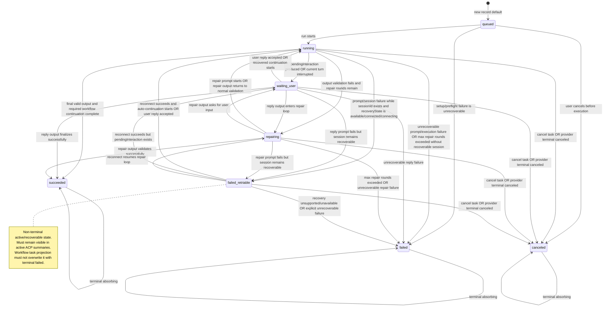

# ACP Skills State Machine Comparison

This artifact compares three ACP Skills run-status state machines for review before implementation:

1. The state machine described by the current ACP Skills SSOT document.
2. The state machine implied by the current implementation.
3. The proposed state machine after introducing `failed_retriable`.

Only the ACP Skills run-status axis is modeled as states. Conversation, recovery, connection action, and reply axes are shown only as transition guards or notes.

## 1. Current SSOT Document State Machine

Source: `doc/acp-skills-state-machine-ssot.md`.

```mermaid
stateDiagram-v2
  [*] --> queued: new record default

  queued --> running: run starts; queued -> running is the only entry path

  running --> waiting_user: prompt turn pauses for user input OR pendingInteraction is produced
  running --> repairing: output validation fails and repair rounds remain
  running --> succeeded: output validation succeeds and run completes
  running --> failed: prompt lifecycle failure OR unrecoverable execution error
  running --> canceled: cancel task OR provider terminal canceled

  waiting_user --> running: user reply accepted OR recovered reply continues workflow
  waiting_user --> repairing: reply output requires repair
  waiting_user --> succeeded: reply produces final valid output
  waiting_user --> failed: unrecoverable prompt/execution failure
  waiting_user --> canceled: cancel task OR provider terminal canceled

  repairing --> running: repair prompt starts or resumes normal execution
  repairing --> waiting_user: repair output asks for user input
  repairing --> succeeded: repair output validates successfully
  repairing --> failed: max repair rounds exceeded OR unrecoverable prompt failure
  repairing --> canceled: cancel task OR provider terminal canceled

  succeeded --> succeeded: terminal absorbing
  failed --> failed: terminal absorbing
  canceled --> canceled: terminal absorbing

  note right of failed
    SSOT says terminal failed is absorbing.
    But combined constraints also mention
    status in running | repairing | failed
    with closed + available + sessionId
    as detached recoverable.
    This is the documented contradiction.
  end note
```

## 2. Current Implementation State Machine

Sources: `src/modules/acpSkillRunStore.ts` and `src/modules/acpSkillRunnerOrchestrator.ts`.

```mermaid
stateDiagram-v2
  [*] --> queued: upsert creates missing run with default status queued

  queued --> running: requestAcpSkillRunForeground OR explicit upsert status running
  queued --> failed: startup recovery unavailable OR prompt/setup failure
  queued --> canceled: explicit cancel path

  running --> waiting_user: pendingInteraction produced OR interrupt current turn completes
  running --> repairing: output validation fails and repair rounds remain
  running --> succeeded: final output validates and apply/sequence path completes
  running --> failed: prompt lifecycle failure OR validation max rounds exceeded OR recovery continuation failure
  running --> canceled: cancel task OR terminal cancel

  waiting_user --> running: user reply accepted; upsert status running before prompt
  waiting_user --> repairing: output repair starts after invalid reply output
  waiting_user --> succeeded: final valid reply output
  waiting_user --> failed: prompt failure OR unrecoverable recovery failure
  waiting_user --> canceled: cancel task OR terminal cancel

  repairing --> running: valid output found before final settlement OR repair prompt starts
  repairing --> waiting_user: repair output requires user confirmation/input
  repairing --> succeeded: repair output finalizes
  repairing --> failed: max repair rounds exceeded OR prompt failure
  repairing --> canceled: cancel task OR terminal cancel

  failed --> running: recovery auto-continuation calls convergeRecoveredReply and shouldContinueWorkflow is true
  failed --> waiting_user: failed run has pendingInteraction and recovered reply/connection leaves user action pending
  failed --> failed: default terminal classification, retention, active-summary exclusion, or recovery failure
  failed --> canceled: cancel task on failed/recoverable session

  succeeded --> succeeded: terminal classification
  succeeded --> running: possible via recovered reply controller paths because status guard is not centralized
  succeeded --> canceled: cancel/end paths may update surrounding axes without strict transition guard

  canceled --> canceled: terminal classification
  canceled --> running: possible via recovered reply controller paths because status guard is not centralized

  note right of failed
    Actual implementation treats failed as both:
    1. terminal in store projections/retention/active filtering;
    2. recoverable in canContinueRecoveredWorkflowTask and reconnect auto-continue.
    This causes UI to keep showing failed until a later code path explicitly writes running.
  end note
```



## 3. Proposed State Machine

The proposed model adds `failed_retriable` and separates recoverable failure from terminal `failed`.



## Assumptions

- `failed_retriable` is the planned new ACP Skills run status.
- The legacy SkillRunner provider state machine is not changed by this artifact.
- This artifact is for design review and debugging only; it does not define an implementation patch by itself.
