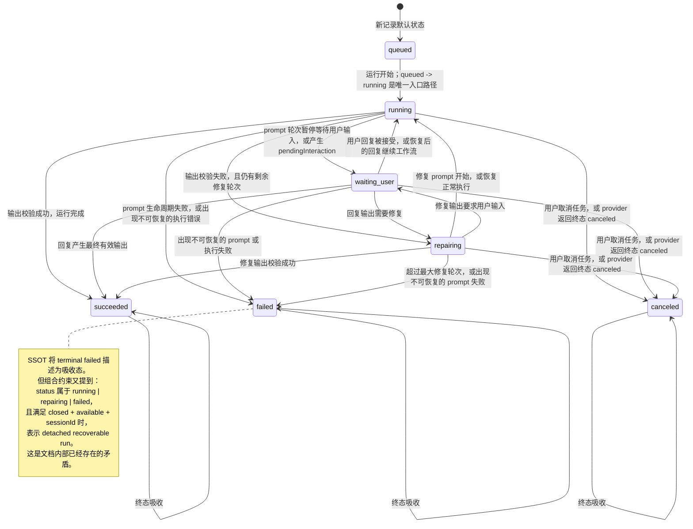
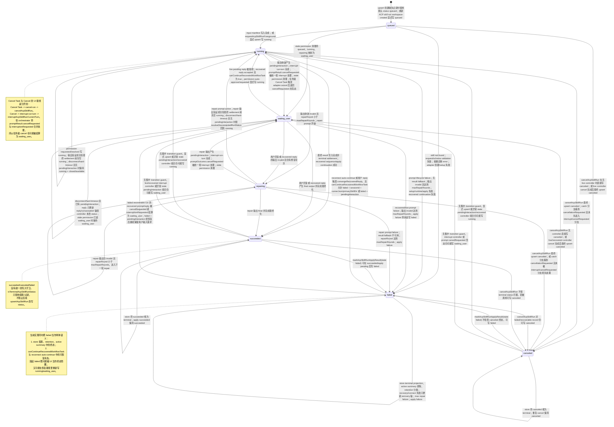
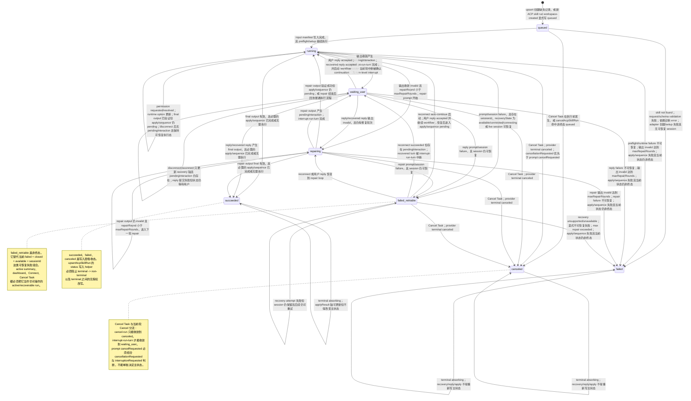

# ACP Skills 状态机对比

本文档用于在实现前评审 ACP Skills 运行状态机及其代码级落地方案：

1. 当前 ACP Skills SSOT 文档描述的状态机。
2. 当前实现实际体现出的状态机。
3. 引入 `failed_retriable` 后的计划状态机。
4. 后续实现时应采用的代码级设计。
5. 修改后的代码级目标实现状态机。

图中只把 ACP Skills 的 run status 主轴建模为状态。Conversation、recovery、connection action 和 reply 等其它状态轴只作为转换条件或注释出现。

## 1. 当前 SSOT 文档状态机

依据：`doc/acp-skills-state-machine-ssot.md`。



## 2. 当前实际实现状态机

依据：`src/modules/acpSkillRunStore.ts`、`src/modules/acpSkillRunnerOrchestrator.ts`、ACP 面板 action 接线以及现有测试夹具。

这一张图描述的是“当前实现实际允许写出的状态转换”，不是理想状态机。实现中 `upsertAcpSkillRun` 没有集中状态转换 guard；因此图中包含正常业务路径，也包含由 controller/recovery/test fixture/过期状态组合触发的漂移路径。



## 3. 计划修改后的状态机

计划模型新增 `failed_retriable`，将可恢复失败从终态 `failed` 中拆分出来。


## 4. 修改后的代码级实现方案

本方案的目标不是在若干调用点局部修补，而是让 ACP Skills run status 在代码中拥有唯一事实源。实现时应先落地状态机定义，再按状态机修正 store、orchestrator、投影和测试。

### 4.1 状态与分类 SSOT

修改 `src/modules/acpSkillRunStore.ts`：

- 将 `AcpSkillRunStatus` 扩展为 `queued | running | waiting_user | repairing | failed_retriable | succeeded | failed | canceled`。
- 新增集中分类常量或 helper：
  - `isTerminalAcpSkillRunStatus(status)`：只允许 `succeeded | failed | canceled` 为终态。
  - `isActiveAcpSkillRunStatus(status)`：包含 `queued | running | waiting_user | repairing | failed_retriable`。
  - `isRecoverableAcpSkillRunStatus(status)`：包含 `running | waiting_user | repairing | failed_retriable`。
  - `isRecoverablePromptFailure(record)`：判断 prompt/session failure 是否应进入 `failed_retriable`，条件至少包括存在 `sessionId`，且 recovery 轴为 `available | connected | connecting`，或 live controller 能保留/恢复 session。
- 在 `isActiveAcpSkillRunRecordForSummary`、retention、dashboard active projection、workflow task projection 中统一使用这些 helper，不再手写 `status !== "failed"` 这类分散判断。

### 4.2 写入层转换守卫

修改 `upsertAcpSkillRun` 的 status 写入逻辑，增加集中转换入口。推荐形态：

```ts
type AcpSkillRunStatusTransitionReason =
  | "create"
  | "start"
  | "waiting_user"
  | "interrupt_turn"
  | "cancel_task"
  | "repair_start"
  | "validation_succeeded"
  | "validation_failed"
  | "prompt_failed_retriable"
  | "prompt_failed_terminal"
  | "recovery_continue"
  | "recovery_failed"
  | "apply_succeeded"
  | "apply_failed"
  | "disconnect";
```

`upsertAcpSkillRun` 可以继续作为记录更新入口，但 status 更新必须经过 `resolveAcpSkillRunStatusTransition(current, next, reason)` 或同等 helper。该 helper 负责：

- 禁止 `succeeded | failed | canceled` 离开终态；重复写同一终态允许。
- 允许 `failed_retriable` 进入 `running | waiting_user | repairing | failed | canceled`。
- 禁止将任务级 cancel 转换为 `waiting_user`。
- 禁止 `markAcpSkillRunApplyResult(state: "failed")` 把已经 terminal 的 `succeeded/canceled` 改写成 `failed`；如果 apply 是必需流程，应在 apply 完成前保持 run status 为 `running`，由 apply 结果决定 `succeeded` 或 `failed`。
- 对违反状态机的写入抛错或至少记录结构化 violation；测试夹具应通过 reset/fixture helper 创建目标状态，不通过生产 upsert 绕开状态机。

### 4.3 Orchestrator 写入点调整

修改 `src/modules/acpSkillRunnerOrchestrator.ts`：

- `failCurrentAcpPrompt` 与 `failRecoveredAcpPrompt`：根据 `isRecoverablePromptFailure(record)` 选择 `failed_retriable` 或 terminal `failed`。当前 `status: "failed" + conversationState: "closed" + conversationRecoveryState: "available"` 的组合应改为 `failed_retriable`。
- `canContinueRecoveredWorkflowTask`：移除 `failed` 的 recoverable 语义，改为只接受 `failed_retriable`、`running`、`repairing`、`waiting_user`。
- reconnect auto-continue：`shouldAutoContinue` 的候选状态从 `running | repairing | failed` 改为 `running | repairing | failed_retriable`。
- `recovered-auto-continuation-failed`：如果 session 仍可恢复，保持或写回 `failed_retriable`；只有 recovery unsupported/unavailable 或明确不可恢复错误才写 terminal `failed`。
- `resolveDisconnectedRunStatus`：不要把 disconnected repair/retriable 状态折叠成 `running`。应按当前主状态保留：`waiting_user` 保持 `waiting_user`，`repairing` 保持 `repairing`，`failed_retriable` 保持 `failed_retriable`，其它执行中状态保持 `running`。
- live controller 的 `cancel` 与 `interruptTurn` 保持语义分离：
  - `cancel` 只表达任务级取消，最终状态必须是 `canceled`。
  - `interruptTurn` 只表达当前轮中断，最终状态可以是 `waiting_user`。
- 主 prompt 循环、detached reply 循环、recovered reply 循环中所有 `promptResult.cancelRequested`/`promptOutcome.cancelRequested` 分支都要先判断 `cancellationRequested`。任务级 cancel 命中时走 `canceled`；只有 `interruptionRequested` 或 provider 明确代表当前轮中断时才走 `waiting_user`。
- final output 写入时，如果后续 apply/sequence 是必需步骤，状态保持 `running` 且 `applyResultState: "pending"`；只有 apply/sequence 成功完成后写 `succeeded`。

### 4.4 Store controller 与用户动作

修改 `src/modules/acpSkillRunStore.ts`：

- `cancelAcpSkillRun`：若当前状态已是 `succeeded | failed | canceled`，不应再改变 status；若当前状态是 `failed_retriable` 或其它非终态，允许写 `canceled`。
- `interruptAcpSkillRunCurrentTurn`：只允许从 `running | repairing | failed_retriable` 且有 live/recovered prompt turn 时进入 `waiting_user`；如果是任务级 cancel 路径，不得调用该函数。
- `replyAcpSkillRun`：允许 `waiting_user` 和 `failed_retriable` 通过 recovery/controller 接受回复；不允许 terminal `failed/canceled/succeeded` 继续回复并隐式清除错误。
- `markAcpSkillRunApplyResult`：只允许非终态 run 被 apply failure 推到 `failed`；terminal run 只能更新 applyResult 轴，不能重写主状态。
- `clearStaleAcpSkillRunPermissionRequest`：不再把 `queued` 折叠到 `waiting_user`；只对已经进入 prompt/permission 流程的 `running | repairing` 进行等待态恢复。

### 4.5 UI、投影与测试

需要同步调整：

- `addon/content/shared/assistant/assistant-panel-model.js` 与相关 labels：为 `failed_retriable` 提供可恢复失败的展示语义；它应显示在 active ACP summaries 中，并允许 Connect/Cancel Task。
- `src/modules/dashboardActiveTasks.ts`、`src/modules/taskManagerDialog.ts`、`src/modules/hostBridgeWorkflowControl.ts`：使用 store 的状态分类 helper，而不是各自判断 terminal/active。
- `test/core/97-acp-ui-smoke.test.ts`：覆盖 `failed_retriable` 的 active panel、dashboard action、Connect/Cancel Task 按钮。
- `test/core/107-acp-skillrunner-compatible-runner.test.ts`：新增或调整以下回归：
  - live prompting 时点击 `Cancel Task`，adapter 返回 `cancelRequested: true`，最终必须是 `canceled`，不能是 `waiting_user`。
  - reply 区 `Cancel` 仍然进入 `waiting_user`，且用户回复可以继续跑。
  - recoverable prompt failure 写 `failed_retriable`，并保持 active summary 可见。
  - reconnect auto-continue 从 `failed_retriable` 进入 `running`，不再从 terminal `failed` 进入 `running`。
  - terminal `failed/canceled/succeeded` 不能被 reply/recovery/apply 重新写成非终态。

## 5. 修改后的代码级目标实现状态机

这一张图是“修改后的实现应实际允许写出的状态转换”。它与图 2 保持同等实现粒度，但去掉了当前实现中的漂移路径：terminal 状态在写入层吸收，recoverable failure 统一进入 `failed_retriable`，任务级 cancel 不再被 prompt cancelRequested 折叠成 `waiting_user`。



## Assumptions

- `failed_retriable` 是计划新增的 ACP Skills run status。
- 本工件不修改旧 SkillRunner provider 状态机。
- 本工件仅用于设计评审和问题排查，本身不包含源码实现补丁。
