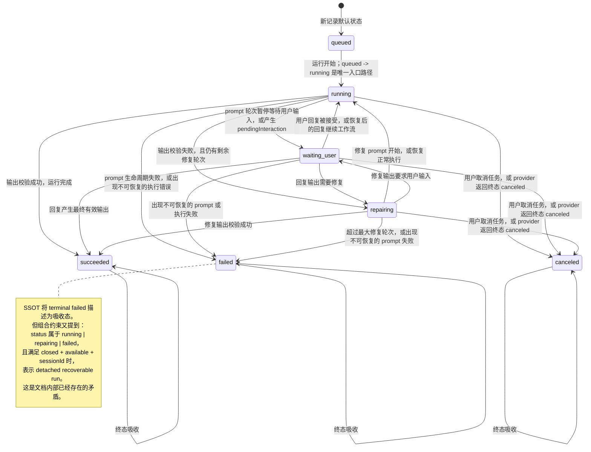
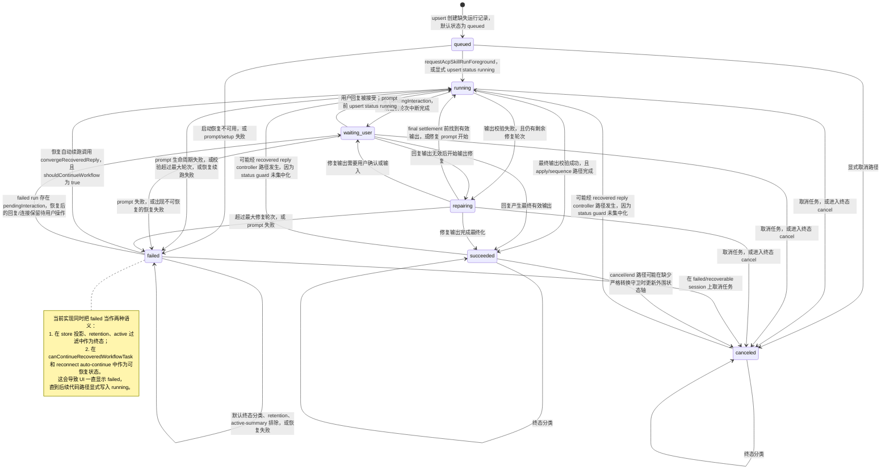
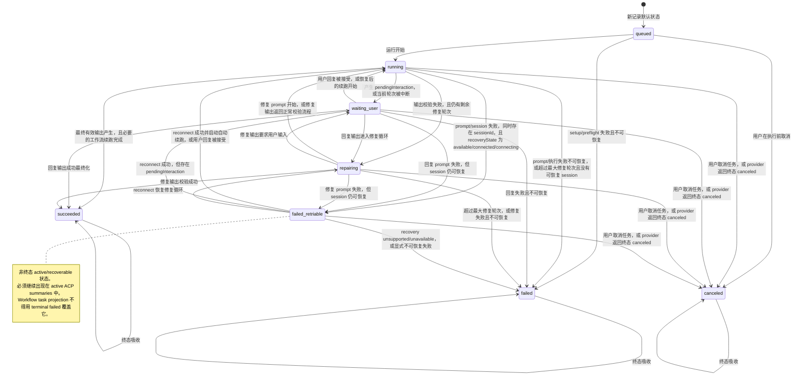

# ACP Skills 状态机对比

本文档用于在实现前评审三种 ACP Skills 运行状态机：

1. 当前 ACP Skills SSOT 文档描述的状态机。
2. 当前实现实际体现出的状态机。
3. 引入 `failed_retriable` 后的计划状态机。

图中只把 ACP Skills 的 run status 主轴建模为状态。Conversation、recovery、connection action 和 reply 等其它状态轴只作为转换条件或注释出现。

## 1. 当前 SSOT 文档状态机

依据：`doc/acp-skills-state-machine-ssot.md`。

## 2. 当前实际实现状态机

依据：`src/modules/acpSkillRunStore.ts` 和 `src/modules/acpSkillRunnerOrchestrator.ts`。

## 3. 计划修改后的状态机

计划模型新增 `failed_retriable`，将可恢复失败从终态 `failed` 中拆分出来。

## Assumptions

- `failed_retriable` 是计划新增的 ACP Skills run status。
- 本工件不修改旧 SkillRunner provider 状态机。
- 本工件仅用于设计评审和问题排查，本身不定义实现补丁。
