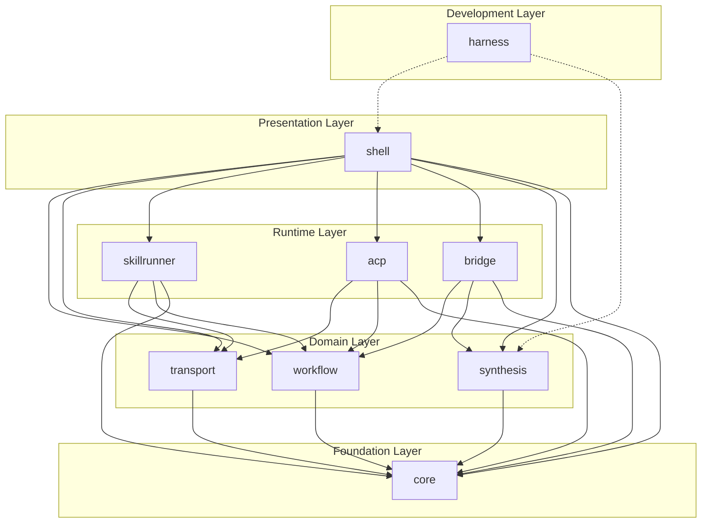
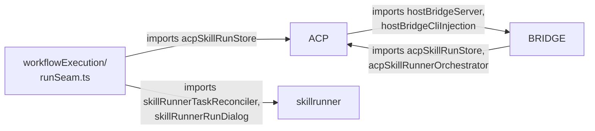

# Zotero-Skills 重构方案：Deep Module 架构

> 设计原则：[A Philosophy of Software Design](https://web.stanford.edu/~ouster/cgi-bin/cs190-winter18/lecture.php/topic/4) — **Deep Modules**
> 每个模块提供简单、窄的公开接口，将复杂实现隐藏在内部

---

## 一、设计约束

| 约束 | 影响 |
|------|------|
| Zotero 沙箱运行时 | 不能使用 Node.js 专有 API；不适合引入 DI 容器等重框架 |
| 全局 `addon` 对象 | 需要保留 Zotero 插件模板的生命周期模式 |
| Browser 嵌入 UI | `synthesisWorkbenchApp.ts` 需要单文件输出（可构建时合并） |
| 现有测试套件 | 重构必须渐进式，不能一次性破坏所有测试 |
| TypeScript 编译到沙箱 | 不能使用 barrel re-export 的装饰器或反射 |

**轻量架构方针**：
- 用纯 TypeScript 接口 + 模块级 facade 函数代替类继承和 DI
- 用简单的 `Map<string, handler>` 代替 EventEmitter
- 用显式依赖参数代替全局单例查找
- 不引入新的运行时依赖

---

## 二、Module 划分



### 模块总览

| # | 模块 | 职责 | 现有文件（估算） | 对外接口宽度 |
|---|------|------|------------------|-------------|
| 1 | **core** | 生命周期、配置、日志、i18n、事件总线、公共类型 | ~20 files / ~100 KB | ~15 函数 |
| 2 | **workflow** | 工作流加载、编译、执行、设置、菜单 | ~30 files / ~320 KB | ~10 函数 |
| 3 | **transport** | 后端注册、Provider 分发、请求契约 | ~15 files / ~100 KB | ~8 函数 |
| 4 | **skillrunner** | SR 本地运行时、任务调和、对话框、CTL bridge | ~25 files / ~500 KB | ~12 函数 |
| 5 | **acp** | ACP 会话、连接、skill run 编排、conversation store | ~25 files / ~450 KB | ~10 函数 |
| 6 | **bridge** | Host Bridge 服务器 + Zotero MCP 服务器 | ~15 files / ~350 KB | ~8 函数 |
| 7 | **synthesis** | Synthesis 领域全栈：service、repository、workbench UI | ~30 files / ~2200 KB | ~8 函数 |
| 8 | **shell** | 偏好设置 UI、工作区面板、仪表盘、侧边栏、对话框 shell | ~15 files / ~350 KB | ~10 函数 |
| 9 | **harness** | UI harness、测试探针、readonly model（开发专用） | ~15 files / ~100 KB | 内部 |

---

## 三、实际依赖关系与耦合热点

> 基于对 src/ 下所有 import 语句的全量扫描得出

### 跨切面基础设施（必须归入 core）

以下模块被全域大量引用，是所有模块的隐式共享基础设施：

| 现有文件 | 被引用次数 | 引用者分布 | 归属 |
|----------|-----------|-----------|------|
| `runtimePersistence.ts` | **32+** | 所有域 | → `core` |
| `runtimeLogManager.ts` | **22+** | 所有域（modules, providers, jobQueue, workflowExecution） | → `core` |
| `taskRuntime.ts` | **14** | skillrunner, acp, workflow, dashboard, bridge | → `core` |
| `pluginStateStore.ts` | **8** | acp, skillrunner, workflowExecution, synthesis | → `core` |
| `guardedSqlite.ts` | **3** | pluginStateStore, synthesis, bridge | → `core` |
| `persistenceIntegrity.ts` | **2** | hooks, bridge | → `core` |
| `utils/path` | **33** | 全域 | → `core` |
| `utils/runtimeBridge` | **19** | 全域 | → `core` |
| `utils/locale` | **17** | 全域 | → `core` |
| `utils/prefs` | **13** | 全域 | → `core` |

### 双向耦合（需要打破的循环依赖）



**需要解决的三个双向耦合**：

1. **ACP ↔ HostBridge**：
   - `acpSessionManager` → `hostBridgeServer`（获取 Bridge 端点状态用于 CLI 注入）
   - `hostBridgeCapabilityRegistry` → `acpSkillRunStore`, `acpSkillRunnerOrchestrator`（注册 ACP 相关能力）
   - **解决方案**：Host Bridge 的 ACP 能力通过 `core` 的 **capability 注册表** 间接暴露。ACP 模块在启动时向 core 注册能力描述，bridge 模块从 core 查询能力——二者都只依赖 core，不直接依赖对方。

2. **workflowExecution/runSeam.ts → ACP + SkillRunner**：
   - `runSeam.ts` 直接导入 `acpSkillRunStore`（推送 ACP skill run 状态）和 `skillRunnerRunDialog`（打开对话框）
   - **解决方案**：将 runSeam 中的 runtime-specific 逻辑抽为 **completion callback**，由各 runtime 模块注入。runSeam 只负责通用的 Provider 分发和 job 生命周期，不感知具体 runtime。

3. **jobQueue ↔ SkillRunner 状态机**：
   - `jobQueue/manager.ts` 直接导入 `skillRunnerProviderStateMachine` 和 `skillRunnerRecoverableState`
   - **解决方案**：将 jobQueue 泛化。状态转换校验和可恢复状态逻辑通过 **策略注入**（构造 `JobQueueManager` 时传入 `statusNormalizer` 和 `recoverableStateDetector` 回调），由 SkillRunner 模块在创建队列实例时提供。

---

## 四、各模块详细设计

### 1. `core` — 基础设施层

**职责**：插件生命周期、全局配置、结构化日志、i18n、事件总线、**运行时持久化**、**插件状态存储**、**通用任务状态**、公共工具

> [!IMPORTANT]
> `core` 的范围比最初预想的要大。依赖分析表明，`runtimePersistence`（32+ 引用）、`runtimeLogManager`（22+ 引用）、`taskRuntime`（14 引用）和 `pluginStateStore`（8 引用）是真正的跨切面基础设施，必须在最底层提供。

**目录结构**：
```
src/core/
├── index.ts              # barrel — 唯一对外出口
├── lifecycle.ts          # onStartup / onShutdown / onMainWindowLoad 骨架
├── config.ts             # 偏好读写、默认值、常量（合并 config/defaults + utils/prefs）
├── logger.ts             # 结构化日志（合并 runtimeLogManager + console 兼容）
├── eventBus.ts           # 轻量事件总线
├── locale.ts             # i18n（迁移自 utils/locale）
├── result.ts             # 统一 Result<T> 类型
├── persistence.ts        # 运行时持久化（迁移自 runtimePersistence）
├── persistenceIntegrity.ts # 持久化完整性检查
├── stateStore.ts         # 插件状态存储（迁移自 pluginStateStore）
├── sqlite.ts             # SQLite 连接守卫（迁移自 guardedSqlite）
├── taskState.ts          # 通用任务状态管理（迁移自 taskRuntime）
├── env.ts                # 运行时环境检测
├── runtimeCompat.ts      # 跨环境兼容（delay 等）
├── fileSystem.ts         # 文件系统工具
├── path.ts               # 路径工具
└── types.ts              # 全局共享类型
```

**对外接口**：
```typescript
// src/core/index.ts

// ── 生命周期 ──
export function registerModule(descriptor: ModuleDescriptor): void;
export function initializeModules(): Promise<void>;
export function shutdownModules(): Promise<void>;

// ── 配置 ──
export function getPref<K extends keyof PrefMap>(key: K): PrefMap[K];
export function setPref<K extends keyof PrefMap>(key: K, value: PrefMap[K]): void;

// ── 日志 ──
export function log(entry: LogEntry): void;
export function warn(scope: string, message: string, error?: unknown): void;

// ── 事件总线 ──
export function on<K extends keyof EventMap>(event: K, handler: (data: EventMap[K]) => void): Disposable;
export function emit<K extends keyof EventMap>(event: K, data: EventMap[K]): void;

// ── i18n ──
export function getString(key: FluentMessageId, args?: Record<string, unknown>): string;

// ── 结果类型 ──
export type OperationResult<T = void> = 
  | { ok: true; data: T }
  | { ok: false; code: string; message: string; details?: unknown };
```

**事件总线设计**（极简实现）：
```typescript
// src/core/eventBus.ts
// 不超过 60 行的完整实现

type EventMap = {
  // 工作流生命周期
  "workflow:registered":    { workflowId: string };
  "workflow:task:started":  { taskId: string; workflowId: string; backendId: string };
  "workflow:task:completed": { taskId: string; status: "succeeded" | "failed" | "canceled" };

  // 后端状态
  "backend:changed":        { backendId: string };
  "backend:health:changed": { backendId: string; healthy: boolean };

  // 运行时服务
  "bridge:status:changed":  { service: "host-bridge" | "mcp"; status: string };

  // Synthesis
  "synthesis:invalidated":  { surface?: string };
};

type Disposable = { dispose(): void };

const listeners = new Map<string, Set<Function>>();

export function on<K extends keyof EventMap>(
  event: K,
  handler: (data: EventMap[K]) => void,
): Disposable {
  if (!listeners.has(event)) listeners.set(event, new Set());
  listeners.get(event)!.add(handler);
  return { dispose: () => listeners.get(event)?.delete(handler) };
}

export function emit<K extends keyof EventMap>(event: K, data: EventMap[K]): void {
  for (const handler of listeners.get(event) ?? []) {
    try { handler(data); } catch { /* log */ }
  }
}
```

**模块注册与生命周期**：
```typescript
// src/core/lifecycle.ts

export interface ModuleDescriptor {
  id: string;
  /** 模块初始化顺序（数值越小越先执行）*/
  priority?: number;
  /** 模块启动 */
  onStartup?: () => Promise<void>;
  /** 主窗口加载 */
  onMainWindowLoad?: (win: Window) => Promise<void>;
  /** 主窗口卸载 */
  onMainWindowUnload?: (win: Window) => Promise<void>;
  /** 模块关闭 */
  onShutdown?: () => Promise<void>;
  /** 偏好设置命令注册 */
  commands?: Record<string, (data: Record<string, unknown>) => Promise<unknown>>;
}
```

> [!NOTE]
> `commands` 字段替代当前 `hooks.ts` 中的巨型 `onPrefsEvent` switch-case。每个模块在注册时声明自己处理的命令，`core` 负责分发。

---

### 2. `workflow` — 工作流引擎

**职责**：工作流清单加载与验证、声明式请求编译、执行运行时（通用部分）、Host API、设置管理、菜单构建

**吸收现有文件**：
- `src/workflows/` 全部（types, loader, runtime, hostApi, helpers, declarativeRequestCompiler, ...）
- `src/modules/workflowExecution/` 全部（seams, sequence runtime, ...）
- `src/modules/workflow*.ts`（workflowRuntime, workflowMenu, workflowSettings*, workflowDebugProbe, workflowEditorHost, workflowExecute*, workflowParameterOptions, workflowRequestKind, workflowVisibility, workflowProductStore, builtinWorkflowSync, workflowPackageDiagnostics, workflowRuntimeBridge）
- `src/handlers/index.ts`（Zotero item/note/attachment/tag/collection handlers）
- `src/modules/selectionContext.ts` + `src/modules/selectionSample.ts`
- `src/schemas/`（workflow schemas）
- `src/jobQueue/`（泛化后的任务队列，去除 SkillRunner 特定依赖）

> [!WARNING]
> **runSeam.ts 需要重构**：当前 `workflowExecution/runSeam.ts` 是一个 mega-hub，直接导入 `acpSkillRunStore`、`skillRunnerTaskReconciler`、`skillRunnerRunDialog` 等。重构时需要将 runtime-specific 逻辑抽为**回调注入**，各 runtime 模块在注册时提供自己的 completion/progress hook。

**对外接口**：
```typescript
// src/workflow/index.ts

// ── 注册与加载 ──
export function rescanWorkflowRegistry(opts?: { workflowsDir?: string }): Promise<WorkflowRegistryState>;
export function getLoadedWorkflows(): LoadedWorkflows;

// ── 执行 ──
export function executeWorkflow(args: WorkflowExecuteArgs): Promise<WorkflowExecuteResult>;
export function buildSelectionContext(): Promise<SelectionContext>;

// ── UI 支撑 ──
export function ensureWorkflowMenuForWindow(win: Window): void;
export function refreshWorkflowMenus(): void;
export function getWorkflowSettings(workflowId: string): WorkflowSettings;

// ── Host API（供工作流 hook 脚本调用）──
export function createHostApi(context: HostApiContext): WorkflowHostApi;

// ── 任务队列 ──
export function createJobQueue(config: JobQueueConfig): JobQueueManager;

// ── 类型 re-export ──
export type { WorkflowManifest, LoadedWorkflow, SelectionContext, ... };
```

---

### 3. `transport` — 传输与 Provider 抽象

**职责**：后端注册表（CRUD + 持久化）、Provider 注册与分发、请求契约验证

**吸收现有文件**：
- `src/backends/`（registry, types, identity, displayName, managementAuth）
- `src/providers/`（registry, types, contracts, requestContracts）
- `src/providers/pass-through/`
- `src/providers/generic-http/`
- `src/modules/backendManager.ts`（后端管理对话框逻辑）

> [!IMPORTANT]
> SkillRunner Provider 和 ACP Provider 的**实现**不在此模块，它们分别属于 `skillrunner` 和 `acp` 模块。`transport` 只持有 Provider 接口和注册表。各 runtime 模块在自身 `onStartup()` 中通过 `registerProvider()` 注入自己的 Provider 实现。

**对外接口**：
```typescript
// src/transport/index.ts

// ── 后端注册表 ──
export function loadBackendsRegistry(): Promise<LoadedBackends>;
export function saveBackendsRegistry(backends: BackendInstance[]): Promise<void>;
export function resolveBackendForWorkflow(workflow: LoadedWorkflow): BackendInstance | undefined;

// ── Provider 分发 ──
export function registerProvider(provider: Provider): void;
export function executeWithProvider(args: ExecuteArgs): Promise<ProviderExecutionResult>;
export function resolveProvider(args: ResolveArgs): Provider;

// ── 类型 re-export ──
export type { BackendInstance, Provider, ProviderExecutionResult, ... };
```

**依赖方向**：
- `transport` → `core`（日志、配置）
- `skillrunner` → `transport`（注册 SkillRunnerProvider）
- `acp` → `transport`（注册 AcpProvider）

---

### 4. `skillrunner` — SkillRunner 运行时

**职责**：SkillRunner Provider 实现、本地运行时管理（安装/启动/停止/卸载）、任务调和、请求账本、CTL bridge、运行对话框

**吸收现有文件**：
- `src/providers/skillrunner/`（provider, client, managementClient, modelCache, modelCatalog, ...）
- `src/modules/skillRunner*.ts` 全部
- `src/modules/pluginSkillRegistry.ts`
- `src/modules/windowsCommandResolution.ts`
- `src/modules/packagedAssetResolver.ts`

**对外接口**：
```typescript
// src/skillrunner/index.ts

// ── 生命周期（由 core 调用）──
// 自动注册为 module，通过 core.registerModule() 暴露

// ── 本地运行时 ──
export function deployLocalRuntime(args: DeployArgs): Promise<OperationResult>;
export function stopLocalRuntime(): Promise<OperationResult>;
export function uninstallLocalRuntime(args: UninstallArgs): Promise<OperationResult>;
export function getLocalRuntimeState(): LocalRuntimeStateSnapshot;

// ── 任务调和 ──
export function reconcileTaskLedger(args: ReconcileArgs): Promise<void>;
export function startTaskReconciler(): void;

// ── 运行对话框（UI 触发）──
export function openRunDialog(args: RunDialogArgs): Promise<void>;

// ── 状态查询 ──
export function listActiveTasks(): ActiveTask[];
```

---

### 5. `acp` — ACP 运行时

**职责**：ACP Provider 实现、会话管理、连接适配器、conversation store、skill run 编排、sidebar model

**吸收现有文件**：
- `src/providers/acp/`
- `src/modules/acp*.ts` 全部（acpSessionManager, acpConnectionAdapter, acpConversationStore, acpTransport, acpSkillRunStore, acpSkillRunnerOrchestrator, acpTypes, acpBackendPresets, acpBackendProbe, acpMessageStream, ...）

> [!NOTE]
> **ACP ↔ HostBridge 解耦**：`acpSessionManager` 当前直接导入 `hostBridgeServer` 和 `hostBridgeCliInjection`。重构后，ACP 模块通过 `core` 提供的 **service locator** 或事件总线获取 bridge 端点信息，不直接依赖 bridge 模块。

**对外接口**：
```typescript
// src/acp/index.ts

// ── 会话管理 ──
export function createSession(args: CreateSessionArgs): Promise<AcpSession>;
export function shutdownSessions(): Promise<void>;

// ── Skill Run ──
export function submitSkillRun(args: SkillRunArgs): Promise<SkillRunHandle>;
export function listSkillRuns(): SkillRunSnapshot[];
export function cancelSkillRun(runId: string): Promise<void>;

// ── 连接探测 ──
export function probeBackendConnection(backend: BackendInstance): Promise<ConnectionTestResult>;

// ── Sidebar Model（供 shell 消费）──
export function getAcpSidebarModel(): AcpSidebarModel;
export function getSkillRunnerSidebarModel(): SkillRunnerSidebarModel;
```

---

### 6. `bridge` — 外部服务网关

**职责**：Host Bridge HTTP 服务器（含能力注册、权限管理、CLI 安装）、Zotero MCP 服务器

**吸收现有文件**：
- `src/modules/hostBridge*.ts` 全部（hostBridgeServer, hostBridgeCapabilityRegistry, hostBridgePermissionManager, hostBridgeAuth, hostBridgeCliInstaller, hostBridgeCliResolver, hostBridgeCliInjection, hostBridgeFileRegistry, hostBridgeProtocol, hostBridgeProfileStore, hostBridgeWorkflowControl, hostBridgeWriteAutoApprovalRegistry, hostBridgeConversationPermissionRegistry）
- `src/modules/zoteroMcpProtocol.ts` + `src/modules/zoteroMcpServer.ts`
- `src/modules/zoteroHostCapabilityBroker.ts`
- `src/modules/zoteroNotePayloadResolver.ts`
- `src/modules/notePayloadCodec.ts`

> [!NOTE]
> **HostBridge ↔ ACP 解耦**：`hostBridgeCapabilityRegistry` 当前直接导入 `acpSkillRunStore` 和 `acpSkillRunnerOrchestrator` 来注册 ACP 相关的能力处理器。重构后，bridge 模块定义 **capability provider 接口**，ACP 模块在启动时向 core 注册自己的 capability provider，bridge 从 core 查询——实现依赖反转。

**对外接口**：
```typescript
// src/bridge/index.ts

// ── Host Bridge ──
export function ensureHostBridgeServer(): Promise<HostBridgeStatus>;
export function stopHostBridgeServer(): Promise<void>;
export function getHostBridgeStatus(): HostBridgeStatus;
export function rotateHostBridgeToken(): TokenRotateResult;
export function installHostBridgeCli(args: CliInstallArgs): Promise<OperationResult>;

// ── MCP 服务器 ──
export function ensureMcpServer(): Promise<void>;
export function shutdownMcpServer(): Promise<void>;
export function getMcpServerStatus(): McpServerStatus;
```

---

### 7. `synthesis` — Synthesis 领域

**职责**：Synthesis 领域的完整垂直切片 — service 层、repository 层、UI model、workbench tab、workbench app（浏览器嵌入 UI）

**吸收现有文件**：
- `src/modules/synthesis/` 全部（service, repository, uiModel, foundation, citationGraph, topicGraph, conceptKb, referenceMatcher, tagVocabulary, ...）
- `src/modules/synthesisWorkbench*.ts`（Tab, Dialog, Invalidation）
- `src/modules/tagVocabulary/`
- `src/synthesisWorkbenchApp.ts`（构建时 bundle）
- `src/synthesisWorkbenchI18n.ts`

> [!IMPORTANT]
> **内部仍需进一步拆分**（这是 P0 任务，但属于模块内部事务）：
> - `service.ts` (602KB) → 按领域拆分为 topicService, paperService, tagService, exportService, syncService 等
> - `repository.ts` (260KB) → 按实体拆分
> - `synthesisWorkbenchApp.ts` (441KB) → 按 surface 拆分源文件，构建时合并

**对外接口**：
```typescript
// src/synthesis/index.ts

// ── Service（核心 API）──
export function getDefaultSynthesisService(): SynthesisService;

// ── Workbench Tab（供 shell 调用）──
export function mountSynthesisWorkbenchTab(args: MountArgs): void;
export function notifyLibraryItemsChanged(event: LibraryChangeEvent): void;

// ── 预热 ──
export function prewarmSurfaces(args: PrewarmArgs): Promise<void>;

// ── 类型 re-export ──
export type { SynthesisService };
```

> [!NOTE]
> Synthesis 模块的对外接口**刻意保持极窄**。外部消费者只通过 `getDefaultSynthesisService()` 获取 service 引用，所有领域操作通过 service 对象完成。这正是 "deep module" 的核心思想：简单接口，复杂实现。

---

### 8. `shell` — UI 壳层

**职责**：偏好设置 UI、工作区面板/Tab、仪表盘、工具栏按钮、任务管理对话框、助手侧边栏、公共 UI 组件

**吸收现有文件**：
- `src/modules/preferenceScript.ts`
- `src/modules/workspaceTab.ts` + `src/workspaceApp.ts`
- `src/modules/taskManagerDialog.ts` + `src/modules/taskDashboard*.ts` + `src/modules/taskRuntime.ts`
- `src/modules/dashboardToolbarButton.ts` + `src/modules/dashboardActiveTasks.ts`
- `src/modules/assistantWorkspaceSidebar.ts` + `src/modules/assistantPanelLabels.ts`
- `src/modules/sidebarBrowserHost.ts`
- `src/modules/backendManager.ts`（对话框 UI 部分）
- `src/modules/acpSidebarModel.ts`（view model）
- `src/modules/skillRunnerSidebarModel.ts`（view model）
- `src/modules/pluginStateStore.ts`（UI state）
- `src/modules/runtimeLogManager.ts`

**对外接口**：
```typescript
// src/shell/index.ts

// ── 面板/Tab ──
export function openWorkspaceTab(args: WorkspaceTabArgs): Promise<void>;

// ── 对话框 ──
export function openTaskManagerDialog(args?: TaskManagerArgs): Promise<void>;
export function openBackendManagerDialog(args: BackendManagerArgs): Promise<void>;

// ── 侧边栏 ──
export function openAssistantSidebar(args: SidebarArgs): Promise<void>;
export function toggleAssistantSidebar(args: ToggleSidebarArgs): Promise<void>;

// ── 工具栏 ──
export function ensureDashboardToolbarButton(win: Window): void;
export function removeDashboardToolbarButton(win: Window): void;
```

---

### 9. `harness` — 开发辅助（可选）

**职责**：UI harness（脱离 Zotero 运行 UI 组件）、只读 model mock、测试探针

**吸收现有文件**：
- `src/modules/harness/`
- `src/modules/test*.ts`
- `src/modules/debugMode.ts`

此模块可通过构建时 tree-shaking 在生产版本中剔除。

---

## 四、依赖规则

### 允许的依赖方向

```
Presentation:  shell ──→ 所有 Domain/Runtime 模块（只通过 facade）
Runtime:       skillrunner, acp, bridge ──→ transport, workflow, core
Domain:        workflow, transport, synthesis ──→ core
Foundation:    core ──→ 无（零外部依赖）
Development:   harness ──→ 任意（仅开发构建）
```

### 禁止的依赖

| 规则 | 原因 |
|------|------|
| `core` 不得导入任何其他模块 | 防止循环依赖 |
| `workflow` 不得导入 `skillrunner` / `acp` | 工作流引擎对具体运行时无感知 |
| `transport` 不得导入 `skillrunner` / `acp` | Provider 注册由运行时模块主动注入 |
| `synthesis` 不得导入 `shell` | 领域层不依赖 UI 层 |
| 同层模块之间**避免**互相导入 | 通过事件总线或 core 提供的接口间接通信 |
| 所有模块不得导入另一模块的内部文件 | 只通过 `index.ts` facade 导入 |

> [!TIP]
> 可以通过 ESLint 的 `import/no-restricted-paths` 规则来机器化执行这些依赖约束。

---

## 五、关键设计决策

### 1. hooks.ts → 模块自注册

**当前**：hooks.ts 导入 50+ 模块，1085 行，`onPrefsEvent` 是 40+ 分支的 switch。

**目标**：hooks.ts 缩减为 < 100 行的薄壳，只做三件事：
1. 调用 `core.initializeModules()` / `core.shutdownModules()`
2. 将 Zotero 生命周期事件转发给 `core`
3. 将 `onPrefsEvent` 委托给 `core` 的命令分发

```typescript
// 重构后的 hooks.ts（概念示意）
import { initializeModules, shutdownModules, dispatchCommand } from "./core";

async function onStartup() {
  await Zotero.initializationPromise;
  await initializeModules();  // core 按 priority 顺序调用各模块的 onStartup
}

async function onShutdown() {
  await shutdownModules();    // core 逆序调用各模块的 onShutdown
}

async function onPrefsEvent(type: string, data: Record<string, any>) {
  return dispatchCommand(type, data);  // core 查找注册了该 command 的模块并调用
}
```

### 2. addon.data → 类型化模块状态

**当前**：`addon.data` 是一个松散属性包，所有模块通过全局 `addon.data.xxx` 通信。

**目标**：各模块持有自己的状态。`addon.data` 仅保留生命周期必需的最小字段：

```typescript
// 重构后的 addon.data
class Addon {
  public data: {
    alive: boolean;
    config: typeof config;
    env: "development" | "production";
    initialized: boolean;
    ztoolkit: ZToolkit;
  };
  public hooks: typeof hooks;
}
```

模块间需要共享的状态通过 facade 函数暴露（如 `workflow.getLoadedWorkflows()`），而非通过全局属性包。

### 3. Provider 注入模式

**当前**：`providers/registry.ts` 硬编码实例化 4 个 Provider。

**目标**：`transport` 模块只定义 Provider 接口和注册表。各运行时模块在启动时注入自己的 Provider：

```typescript
// src/skillrunner/startup.ts
import { registerProvider } from "../transport";
import { SkillRunnerProvider } from "./provider";

export async function onStartup() {
  registerProvider(new SkillRunnerProvider());
  // ...
}
```

```typescript
// src/acp/startup.ts
import { registerProvider } from "../transport";
import { AcpProvider } from "./provider";

export async function onStartup() {
  registerProvider(new AcpProvider());
  // ...
}
```

### 4. Synthesis 内部拆分策略

Synthesis 模块的对外接口保持极窄（`getDefaultSynthesisService()`），但内部需要进一步拆分。这属于模块内部的实现细节，不影响宏观架构：

```
src/synthesis/
├── index.ts              # facade（窄接口）
├── service/              # 按领域拆分
│   ├── topicService.ts
│   ├── paperService.ts
│   ├── tagService.ts
│   ├── exportService.ts
│   └── serviceFacade.ts  # 组合各子 service 为统一 SynthesisService
├── repository/           # 按实体拆分
│   ├── topicRepository.ts
│   ├── paperRepository.ts
│   └── ...
├── domain/               # 领域模型
│   ├── foundation.ts
│   ├── citationGraph.ts
│   ├── topicGraph.ts
│   ├── conceptKb.ts
│   └── referenceMatcher.ts
├── ui/                   # UI 层
│   ├── uiModel.ts
│   ├── workbenchTab.ts
│   └── workbenchApp/     # 构建时合并为单文件
│       ├── types.ts
│       ├── helpers.ts
│       ├── surfaces/
│       └── ...
└── i18n.ts
```

---

## 六、迁移策略

### Phase 0：准备（无功能变更）

1. 创建 `src/core/` 目录，将 `utils/`、`config/` 的内容迁入
2. 在 `core/` 中实现 `eventBus.ts`、`logger.ts`、`result.ts`
3. 实现 `core/lifecycle.ts` 的 `ModuleDescriptor` 注册机制
4. **所有现有代码不变**，只是添加新的基础设施

### Phase 1：逐模块封装（渐进式）

按以下顺序，每次处理一个模块：

| 顺序 | 模块 | 策略 | 原因 |
|------|------|------|------|
| 1 | `transport` | 将 `backends/` + `providers/` 合并，添加 index.ts facade | 依赖最少，改动最小 |
| 2 | `workflow` | 将 `workflows/` + modules 中 workflow* 合并；**泛化 jobQueue**（移除 SkillRunner 状态机依赖，改为策略注入） | 已有较好结构 |
| 3 | `bridge` | 将 hostBridge* + zoteroMcp* 合并；**定义 capability provider 接口** | 相对独立 |
| 4 | `skillrunner` | 将 skillRunner* + 相关 provider 合并；**注入 jobQueue 策略 + bridge capability** | 内部耦合强，需一次迁移 |
| 5 | `acp` | 将 acp* + 相关 provider 合并；**注入 bridge capability + runSeam 回调** | 同上 |
| 6 | `synthesis` | 将 synthesis/ + synthesisWorkbench* 合并 | 最大但最独立 |
| 7 | `shell` | 将 UI 相关文件合并 | 依赖最多，放最后 |

> [!IMPORTANT]
> **Phase 1 的关键额外工作**：在迁移 `workflow`（步骤 2）时，需要同时重构 `runSeam.ts` 和 `jobQueue/manager.ts`，将其中对 ACP/SkillRunner 的直接依赖改为注入式回调。这是打破双向耦合的必要前提，否则后续步骤 4/5 无法顺利完成。

**每个模块的迁移步骤**：
1. 创建模块目录 + `index.ts` facade
2. 将相关文件移入目录（保持内部实现不变）
3. 将 facade 函数添加到 `index.ts`
4. 更新外部导入路径（从直接文件导入改为从 `index.ts` 导入）
5. 注册 `ModuleDescriptor` 到 `core`
6. 运行测试确认无回归

### Phase 2：瘦化 hooks.ts

当所有模块都注册了 `ModuleDescriptor` 后：
1. 将 `hooks.ts` 中的启动逻辑替换为 `core.initializeModules()`
2. 将 `onPrefsEvent` 的 switch-case 逐批迁移到各模块的 `commands` 注册
3. 最终 hooks.ts 缩减为 < 100 行

### Phase 3：内部深度拆分

在宏观模块边界稳定后，处理各模块内部的巨型文件拆分（特别是 synthesis 的 service/repository/workbenchApp）。

---

## 七、预期效果

| 指标 | 现状 | 目标 |
|------|------|------|
| hooks.ts 大小 | 1085 行 / 34KB | < 100 行 / 3KB |
| hooks.ts 导入数 | 50+ 模块 | 1 个（core） |
| modules/ 平铺文件数 | 122 | 0（消除 modules/ 目录） |
| onPrefsEvent 分支数 | 40+ case | 0（各模块自注册） |
| 跨模块直接 import | 无约束 | 只允许通过 index.ts facade |
| 模块公开 API 总量 | ~无边界 | 每模块 8-15 个函数 |
| 新增运行时依赖 | — | 0 |
