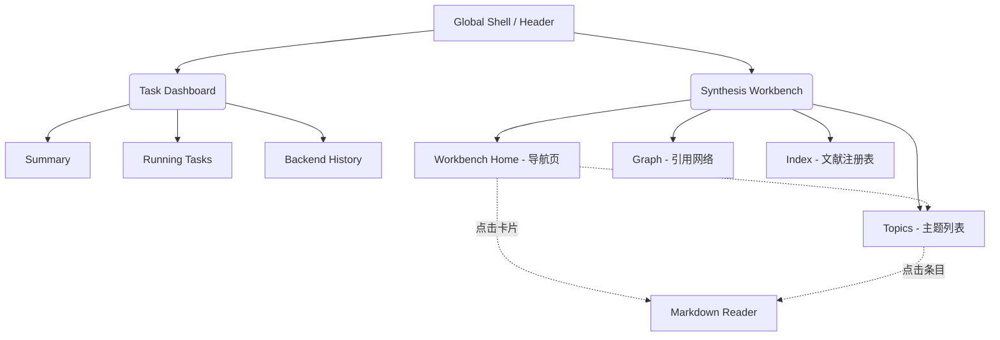

# Dashboard & Synthesis Workbench 聚合 UI/UX 设计方案

本项目旨在将 Task Dashboard 和 Synthesis Workbench 整合到一个统一的界面中，并对 Synthesis Workbench 进行大幅重构，以提供更直观、美观且高效的用户体验。

## User Review Required

> [!IMPORTANT]
> 这是重构的初步设计方案，请您审阅。确认整体的信息架构、顶层导航方式以及 Synthesis 首页卡片设计的逻辑是否符合您的预期。如果确认无误，我将在后续阶段执行具体的代码修改。

## Open Questions

> [!WARNING]
> 1. **顶层切换方式：** 目前方案推荐在顶部使用显著的“分段控制器 (Segmented Control)” 或者“顶部标签栏 (Top Navigation Tabs)”。您更偏好顶部居中的标签，还是侧边栏最上方的全局下拉菜单/图标切换？
> 2. **Markdown 浏览器形式：** 点击 Topic 并在内建浏览器打开时，您更希望它是“覆盖在当前页面上的弹窗 (Modal)”、“从右侧划出的侧边栏 (Drawer)”，还是“占据主视图的沉浸式阅读页 (取代当前列表)”？
> 3. **Topic 卡片内容：** 在 Synthesis 首页的 Topic 网格卡片中，除了显示“主题名称”和“相关文献量”外，是否还需要显示诸如“最后更新时间”、“完成度”或“摘要片段”等其他指标？

---

## 1. 整体信息架构 (Information Architecture)

合并后的 UI 将采用 **“Global Shell（全局外壳） + Sub-Views（子视图）”** 的模式。

## 2. 核心界面布局设计

### 2.1 顶层全局外壳 (Global Shell)

**布局：**
- **顶部控制区 (Top Header):**
  - **居中醒目位置：** 放置一个大的 Segmented Control (分段选择器)，例如 `[ Dashboard | Synthesis ]`。切换时有平滑的滑动动画。
  - **左侧：** 品牌标识 (如 "Zotero Skills")。
  - **右侧：** 全局操作按钮 (如刷新、全局设置/Preferences)。

### 2.2 Task Dashboard 视图

**设计策略：维持现有组织逻辑，提升视觉层级。**
- **左侧边栏 (Sidebar):** 依然保留不同 Backend 和 ACP 的导航（例如 Home, Backend A, Backend B...）。
- **主内容区 (Main Content):** 
  - **卡片化 (Card-based UI):** 将原有的 Summary 数字统计变为更加现代化的微卡片（带有柔和的阴影和背景色）。
  - **表格视图 (Tables):** 优化正在运行任务、历史任务的表格样式，采用更宽的行高、圆角表格边缘，以及颜色更清晰的状态徽章 (Status Badges)。

### 2.3 Synthesis Workbench 视图 (大幅重构)

**2.3.1 侧边栏 (Sidebar Navigation)**
- 摒弃旧的标签，采用全新的二级导航：
  - 🏠 **Home** (首页/导航页)
  - 📑 **Topics** (主题池)
  - 🕸️ **Graph** (知识图谱)
  - 🗂️ **Index** (库索引/Registry)

**2.3.2 首页 / 导航页 (Home / Overview)**
**这是用户进入 Synthesis 后看到的第一屏，需极具直观性与视觉冲击力。**
- **顶部横幅模块 - “文献库大盘” (Library Insights):**
  - 并排展示 3-4 个核心指标大卡片（例如：总注册文献数、已生成 Topic 总数、最近 7 天的活跃分析数、整体库健康度/覆盖率）。卡片采用渐变色或柔和的强调色背景。
- **核心模块 - “主要 Topics (Top Topics)”:**
  - **网格布局 (CSS Grid):** 将相关文献量排名靠前的 N 个（如 6 或 8 个）Topic 以较大的方块卡片呈现。
  - **卡片内信息：** 
    - 大标题 (Topic Name)
    - 图标或微小的数据条 (表示包含多少篇文献)
    - 一两行小字 (简短摘要，如果有的话)
  - **交互：** 鼠标悬停 (Hover) 时卡片微小上浮，点击整个卡片立即滑出 / 弹出内建 Markdown 阅读器。
- **底部 / 侧边入口：**
  - 在卡片网格的末尾，或者网格右上方放置一个醒目的 **“查看全部 Topics (View All / 显示更多)”** 按钮，点击跳转至二级页面 **Topics**。

**2.3.3 二级页面：Topics (原 Artifacts)**
- **列表与卡片视图切换：** 提供紧凑列表 (List) 与大网格 (Grid) 两种浏览模式，方便用户扫视。
- **搜索与过滤：** 顶栏包含搜索框、按字母顺序/按相关文献数排序的下拉选项。
- **交互：** 点击任意 Topic 同样唤起 Markdown 阅读器。

**2.3.4 二级页面：Graph (引用网络) & Index (原 Registry)**
- **Graph:** 保留当前的 SVG Citation Graph 渲染，但外围的控制面板将移至右侧悬浮面板 (Floating Panel) 或固定侧边栏，留给画布更大的显示空间。适配暗色模式。
- **Index:** 将原本的 Registry 表格转化为更现代的 Data Grid。高亮“缺失 (Missing)”的伪装色块，用红/绿徽章区分文献的处理阶段 (Digest / Citation Analysis 等)。

### 2.4 内建 Markdown 阅读器

- **表现形式：** 从屏幕右侧滑出的宽侧边栏 (Drawer Panel)，或者占据 80% 屏幕空间的模态居中窗口。
- **特点：**
  - 右侧提供浮动的目录大纲 (TOC)。
  - 内建 KaTeX 渲染（已在现有代码中支持），加强公式排版的对比度。
  - 顶栏包含关闭按钮、在新窗口打开、复制内容等快捷操作。

---

## 3. 实现步骤与路径 (Implementation Path)

**阶段 1: 基础框架与路由整合 (Foundation & Routing)**
- 创建一个新的入口 HTML 和主 Controller (例如 `addon/content/workspace/index.html`)。
- 在页面顶部实现基于 Segmented Control 的切换逻辑。
- 将 `dashboard/app.js` 和 `synthesis/app.js` 的核心逻辑解耦为模块或在同一个容器内通过隐藏/显示 DOM 实现子视图的挂载。

**阶段 2: Synthesis Workbench 首页重构**
- 移除原有的 status-grid，设计新的数据面板 DOM 结构。
- 获取排序后的 Topics 数据（依赖后端状态快照或排序逻辑）。
- 编写新的 CSS Grid 样式实现 Topic 卡片，并绑定点击事件触发 Markdown 浏览器。

**阶段 3: Synthesis 二级页面与阅读器重构**
- 实现 Topics 列表视图，替代旧的 Artifacts 表格。
- 重命名并微调 Registry 和 Graph 的布局样式，使其适配新的外壳样式。
- 重构内建 Markdown 浏览器容器 (Modal/Drawer)。

**阶段 4: UI 打磨与 Zotero 7 风格适配**
- 统一所有表格、按钮、选择器、输入框的 CSS 变量。
- 确保在 Zotero 的 Light / Dark 主题下，配色均符合可用性标准。
- 添加渐变、Hover 过渡动画等视觉优化 (Polish)。
