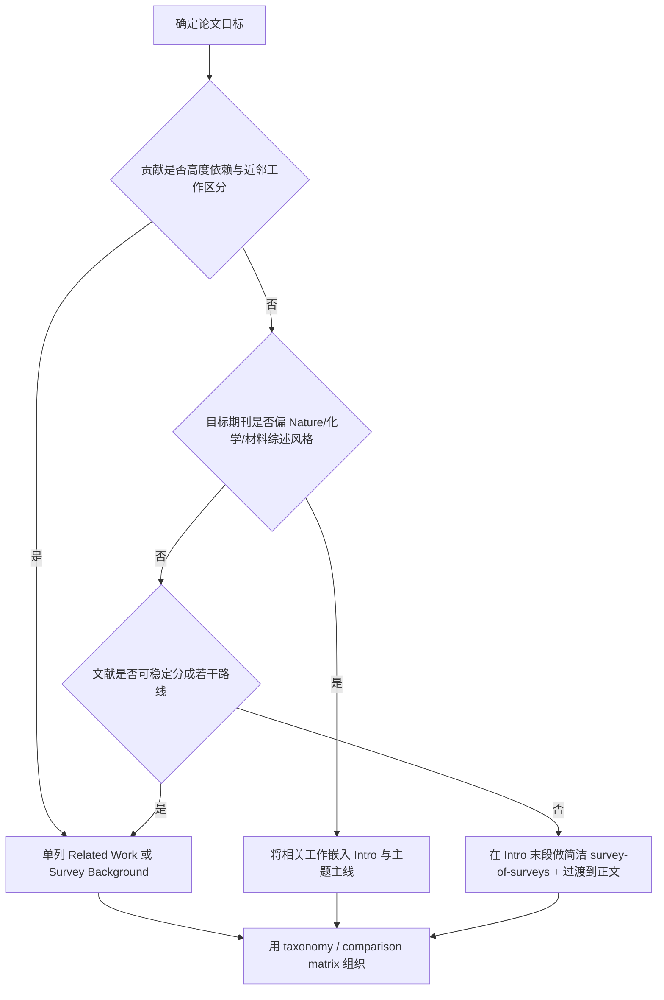
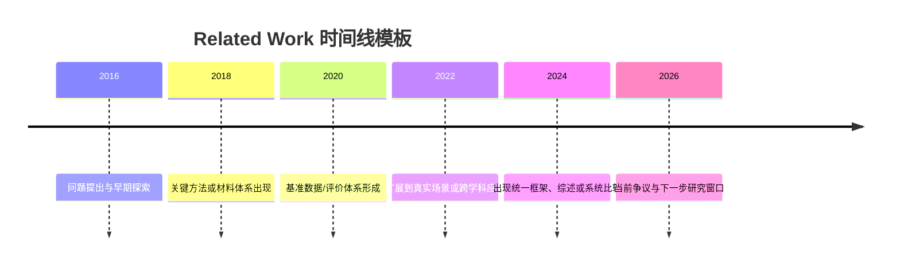
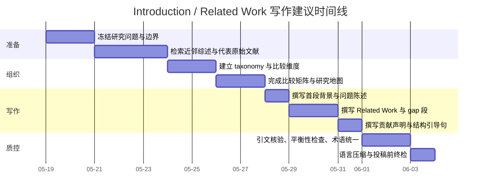

# 理工科科研论文 Introduction 与 Related Work 写作指南

## 执行摘要

对理工科论文而言，**Introduction / Related Work 不是“把背景补齐”的礼节性部分，而是决定审稿人是否迅速看懂“问题、边界、差距、定位和贡献”的关键模块**。近十年高影响理工科综述/调查期刊的官方指南虽然用词不同，但要求高度一致：引言必须交代**为什么这个主题重要、为什么现在值得写、现有工作做到哪里、哪些关键问题仍未解决、本文与已有综述或研究相比新增了什么、后文将如何展开**。Nature Reviews 明确要求引言提供关键背景、说明主题的重要性与时效性，并用一个 guiding paragraph 清楚告诉读者文章将讨论什么；Chemical Reviews 要求在引言里清楚界定主题范围与时间边界，并说明不要突出作者本人工作；IEEE COMST 要求在开头清楚说明主题、目标与读者所需背景；RSER 明确指出“书目式文献综述”并不适合该刊，综述必须体现 critique、comparison 或 analysis；ACM CSUR 则把 survey/tutorial 定义为“带领读者完成一场可读的文献导览”。这些要求共同指向一个结论：**优秀的引言/相关工作写作，本质上是“结构化定位”，而不是“背景堆砌”。** citeturn4view0turn3view5turn3view1turn3view3turn6search0turn6search1

从写作实践看，理工科作者最常见的失败点并不是英文单句不够漂亮，而是以下几类结构性问题：首段过空、问题陈述不具体、现有工作罗列没有维度、差距分析只说“仍有挑战”却没有证据、贡献声明和前文脱节、引用过度依赖二手综述、以及把 Related Work 写成“按年份排队的摘要串”。高影响期刊更看重的是**边界是否明晰、分类法是否稳定、比较维度是否统一、引用是否平衡、判断是否建立在证据而非偏好之上**。对于系统综述或范围综述，PRISMA 2020、PRISMA-S 与 PRISMA-ScR 进一步要求作者透明说明为何开展此综述、如何检索与筛选文献，以及证据如何被组织与报告。citeturn11search4turn11search21turn12search1turn11search2

下文提供的是一个**可直接拿来起草理工科论文引言/相关工作**的工作型模板：先汇总头部期刊官方建议，再比较常见组织模式，然后给出逐段写法、可套用的中英文句式、文献检索与引用策略、图表模板、常见陷阱与伦理风险，以及一个可执行时间表与投稿前终检表。需要说明的是：不同期刊并没有给出统一的“六段式”硬性规定，因此下述段落模板是基于官方规范与高质量范例所做的高可信综合，而不是所有期刊都强制使用的唯一格式。citeturn4view0turn3view5turn3view1turn6search0

## 官方期刊建议与高影响范例

### 期刊官方建议中最值得直接照搬的部分

| 期刊 | 官方页面与类型 | 对 Introduction / Related Work 最关键的原话或要求 | 直接写作启示 |
|---|---|---|---|
| **Nature Reviews 系列** | Review/Technical Review/Roadmap 格式指南 | 引言是**无小标题的开篇部分**；应提供 **vital background information**，说明主题为何重要、为何现在及时；建议在结尾用一个 **guiding paragraph** 清楚写明文章将讨论什么；参考文献大约 **每 1000 词 25 篇**，并避免过度引用作者自身工作。citeturn4view0 | 引言不要写成散文化背景；结尾一定要有“本文范围—组织—视角”收束段。引用要“新、准、平衡”，而不是越多越好。 |
| **Chemical Reviews** | ACS Author Guidelines | 综述必须是 **substantial, comprehensive, authoritative, critical, and accessible**；主题范围与时间边界必须**在引言中清楚定义**；应考虑该主题全部贡献者，且**不应强调作者本人的工作**；应提供 critical analysis、remaining challenges 与 future directions。citeturn3view5 | 引言里必须出现“范围边界”和“时间边界”；Related Work 不能只写同行、朋友或自己团队。 |
| **Chem Soc Rev** | RSC Author Guidelines | RSC 明确鼓励**优先引用原始研究，而不是二手综述**；写作应 clear and concise；Discussion 要回到引言中提出的问题；稿件应说明 impact compared with other research in its field。citeturn8view0 | Related Work 中凡是“某机制、某方法、某性能首次被证明”之类判断，应尽量回到原始论文，而不是只引综述。 |
| **Progress in Materials Science** | Elsevier Guide for Authors | 期刊定位是 **authoritative and critical reviews**；投稿 proposal 需说明**相较近期综述的独特性**；稿件应有足够内容和参考文献，让材料领域研究者理解 current state of the field。citeturn3view4 | 引言最好加入一小段“已有综述 vs 本文新增视角”的 survey-of-surveys，对材料/制造类论文尤其重要。 |
| **Renewable and Sustainable Energy Reviews** | Elsevier Guide for Authors | 期刊接收 review 和对既有文献的 critique/comparison/analysis，但**bibliographic literature review** 和 country specific reviews **不适合**；文章应用清晰编号的 section 组织。citeturn3view3turn9view0 | Related Work 不能只是“我读过很多文献”；必须围绕比较、分析或批判来组织，不可止于资料清点。 |
| **ACM Computing Surveys** | Journal Home / Author Guidelines / Editorial Charter | CSUR 发表 **comprehensive, readable tutorials and survey papers**，强调通过文章给读者一场 **guided tour through the literature**；长 survey 通常不超过 35 页。citeturn6search0turn6search1turn6search2 | CS 领域的 Related Work 要有“导览感”：术语先统一，再给 taxonomy，再解释为什么这样分类。 |
| **IEEE Communications Surveys & Tutorials** | Policies and Guidelines | 面向通信领域 **generalist**；文章应对专业外读者也可理解；在开头必须清楚说明**topic、objectives、reader background**；Survey 应覆盖从 **inception to current state and beyond** 的发展，并用**充分引用**形成权威书目。citeturn3view1 | 对 IEEE/ACM 风格论文，Intro 之后设置独立 Related Work 或 Survey Background 往往更自然，尤其当贡献必须和很多近邻工作区分时。 |

这些官方要求合起来，其实就是六个高频问题：**为什么重要、为什么现在、现有路线有哪些、它们分别卡在哪里、本文站在哪个位置、后文怎么走。** 如果你的引言没有明确回答这六个问题，通常就还没有进入“高影响论文可投稿状态”。这一结论并非来自单一期刊，而是来自 Nature Reviews、Chem Rev、RSER、ACM CSUR、IEEE COMST 等官方要求的交叉收敛。citeturn4view0turn3view5turn3view3turn6search0turn3view1

### 近十年值得精读的高质量范例

下表中的文章不一定都把章节名直接写成 “Related Work”，但它们都很好地完成了**引言/相关工作模块应承担的功能**：定界、分类、比较、定位与展望。

| 示例文章 | 最值得模仿的引言/相关工作做法 | 推荐理由 |
|---|---|---|
| **Batra R, Song L, Ramprasad R.** *Emerging materials intelligence ecosystems propelled by machine learning*. **Nature Reviews Materials.** 2021;6:655–678. DOI: 10.1038/s41578-020-00255-y. citeturn15search0turn19view0 | 从“大趋势”切入，迅速缩到材料智能生态系统，再用摘要和正文建立“数据—模型—自动化—设计”的总框架。 | 适合学习如何把“背景—范围—框架—文章路线”压缩到少量高密度段落中。 |
| **Dananjaya SAV, Chevali VS, Dear JP, Potluri P, Abeykoon C.** *3D Printing of Biodegradable Polymers and Their Composites – Current State-of-the-art, Properties, Applications, and Machine Learning for Potential Future Applications*. **Progress in Materials Science.** 2024;146:101336. DOI: 10.1016/j.pmatsci.2024.101336. citeturn16search13turn16search5 | 题目本身就展示了典型材料综述的多轴组织法：state-of-the-art、properties、applications、future。 | 适合学习“机制/材料—性能—应用—未来方向”的材料类引言展开方式。 |
| **Kulichenko M, Nebgen B, Lubbers N, et al.** *Data Generation for Machine Learning Interatomic Potentials and Beyond*. **Chemical Reviews.** 2024;124(24):13681–13714. DOI: 10.1021/acs.chemrev.4c00572. citeturn16search0turn16search8 | 不是从“模型很多”泛泛起笔，而是抓住**data generation** 这个真正瓶颈来建立综述切口。 | 非常适合学习如何用“核心瓶颈”而非“宽主题”定义引言问题。 |
| **Zha D, Bhat ZP, Lai K-H, Yang F, Jiang Z, Zhong S, Hu X.** *Data-centric Artificial Intelligence: A Survey*. **ACM Computing Surveys.** 2025;57(5):Article 129, 1–42. DOI: 10.1145/3711118. citeturn24search0turn24search2turn24search4turn24search11turn24search13 | 开头先说明为什么 data-centric AI 必要，再给三大目标与整体图景，最后把 literature 映射到 taxonomy。 | 是计算机领域“先定义术语—再立 taxonomy—再综述文献”的典型。 |
| **Nour B, Pourzandi M, Debbabi M.** *A Survey on Threat Hunting in Enterprise Networks*. **IEEE Communications Surveys & Tutorials.** 2023;25(4):2299–2324. DOI: 10.1109/COMST.2023.3299519. citeturn25search1turn25search7turn25search12turn25search11 | 从威胁演化与传统检测失效切入，进而引出 proactive defense 的必要性，再给 taxonomy 与研究缺口。 | 适合学习“安全/网络”类 survey 如何把现实驱动、概念澄清和文献分类合为一体。 |

如果你的目标更偏能源/可持续性，另一个出色范例是 **Paul D, Pechancová V, Saha N, et al.** *Life cycle assessment of lithium-based batteries: Review of sustainability dimensions*. **Renewable and Sustainable Energy Reviews.** 2024;206:114860. DOI: 10.1016/j.rser.2024.114860。它的摘要和 highlights 明确表明文章不是单纯环境影响汇总，而是把环境、经济、社会三个维度合并进统一的 sustainability frame，这正是 RSER 官方所鼓励的 critique/comparison/analysis 风格。citeturn20view0turn3view3

## 常见结构模式与组织策略

### 先决定“如何组织”，再开始写段落

在理工科论文中，Introduction/Related Work 最常见的失误，是作者一边查文献一边写，导致全文逻辑被检索顺序牵着走。更有效的做法是：**先确定组织模式，再把文献放进模式里。** 结合上述官方要求与高质量范例，下面这些结构模式最常见，也最稳定。它们并非互斥，很多优秀论文往往是“背景—问题—缺口—贡献”的主骨架，外加主题导向或方法导向的 Related Work 组织。citeturn4view0turn3view5turn3view1turn24search4turn25search7

| 模式 | 适用场景 | 优点 | 局限 | 典型段落结构 | 写作要点 | 常见句式 |
|---|---|---|---|---|---|---|
| **背景—问题陈述—知识缺口—贡献定位** | 大多数理工科原始研究论文；也是最稳妥的默认骨架。 | 逻辑清楚，审稿人最容易快速把握。 | 若现有工作很多，会显得 Related Work 太薄。 | 背景 → 具体问题 → 现有工作概览 → 差距 → 本文贡献 → 结构引导。 | 适合大多数材料、化学、工程、AI、通信论文。 | 中：**尽管……，但……仍未解决。**；英：**Despite…, … remains unresolved.** |
| **按主题/问题导向组织** | 文献跨学科、方法异质性大，或者你要回答若干子问题。 | 读者导向强，容易把复杂领域拆成问题树。 | 如果分类标准不稳定，容易重叠。 | 每段/每节对应一个研究问题。 | 主题标题最好是“问题句”而不是泛名词。 | 中：**围绕___，现有研究主要关注三个问题。**；英：**Existing work on ___ can be grouped around three questions.** |
| **按方法/路线导向组织** | 算法、工艺、实验路线、建模框架可清楚分型时。 | 便于比较优缺点，最适合 Related Work。 | 容易忽视应用场景差异。 | 路线 A → 路线 B → 路线 C → 横向比较。 | 每段都要用统一维度比较，如精度、复杂度、可扩展性。 | 中：**现有方法大致分为三类。**；英：**Existing approaches can be broadly categorized into three groups.** |
| **按时间演化组织** | 历史演化本身就是论证重点，例如材料体系代际更替、标准演进、技术范式转移。 | 适合讲清楚“为什么现在的方法长这样”。 | 纯按年份叙述最容易变成流水账。 | 早期阶段 → 转折阶段 → 当前阶段 → 下一阶段。 | 只在“历史变化解释机制或现状”时使用；否则不要把 chronology 作为唯一结构。 | 中：**该领域经历了从___到___的转变。**；英：**The field has evolved from ___ to ___.** |
| **按对比/benchmark 导向组织** | 有相对稳定的评价指标、数据集、工况或性能标准。 | 最利于突出本文位置和增量。 | 若评价条件高度不一致，比较会失真。 | 比较维度定义 → 代表文献矩阵 → 差异来源 → 本文位置。 | 要明确“可比条件”，不要把不可比实验硬放一起。 | 中：**在统一的___维度下，可见……**；英：**Under a common set of criteria, …** |
| **按批判/争议导向组织** | 领域存在明显分歧、结果冲突、概念混用或乐观宣传。 | 更有学术判断力，容易体现高水平。 | 需要作者掌握非常扎实，证据不足会显得武断。 | 共识 → 分歧 → 分歧来源 → 本文主张/定位。 | 批判必须基于证据，而不是语气强硬。 | 中：**现有结论之所以不一致，主要源于……**；英：**The inconsistency in prior findings largely stems from …** |
| **survey-of-surveys 模式** | 近三到五年内已有多篇同主题综述，需要证明你这篇为啥还值得写。 | 能快速建立新颖性与期刊匹配性。 | 写不好会像“抱怨别人综述不行”。 | 既有综述摘要 → 其边界 → 尚缺视角 → 本文增量。 | 特别适合 Chem Rev、PMatsci、RSER 这类非常重视“与近期综述区别”的期刊。 | 中：**与已有综述相比，本文新增的不是覆盖范围，而是……**；英：**Compared with prior reviews, the novelty here lies not in broader coverage but in …** |

### 什么时候单列 Related Work，什么时候放进 Intro

一个经常被忽视、但非常影响稿件“期刊气质”的问题，是 **Related Work 要不要单列成章**。综合官方指南可以得出一个很实用的判断：**如果目标期刊偏 Nature Reviews、化学/材料类综述，通常更适合把相关工作紧密嵌入引言并向主题主体自然过渡；如果目标期刊偏 ACM/IEEE 的 survey/tutorial，或你的论文需要和大量近邻方法明确区分，那么单列 Related Work 往往更清晰。** Nature Reviews 明确采用无小标题引言，并要求用 guiding paragraph 收束；IEEE COMST 和 ACM CSUR 都强调面向更广泛读者的“文学导览”和主题/目标先行，这类期刊更容纳一个较早出现的独立 literature background/related work section。citeturn4view0turn3view1turn6search0turn6search2

这个判断流程不是某单份 author guide 的直接原话，而是基于期刊对引言结构、目标读者与 survey/tutorial 定位的综合推导，因此在使用时应把它当作**高概率策略**，而不是机械模板。citeturn4view0turn3view1turn6search0turn3view5

## 逐段写作指南与中英模板

### 一个稳妥的理工科 Intro 常见是五到六段

对于绝大多数理工科原始论文，一个高成功率的写法是将引言/相关工作分成 **五到六个功能段**。其中，如果期刊或学科习惯单列 Related Work，那么第 3 段往往会扩展成 2–4 个平行段落；如果期刊不喜欢冗长引言，则把第 3–4 段压缩成一个高密度 comparative paragraph。下面给出的句数和字数，是中文写作的工作型建议；最终投稿英文稿时，仍应服从目标期刊长度限制。Nature Reviews、Chem Rev、COMST 与 CSUR 虽然对总篇幅要求不同，但对“背景—重要性—范围—相关工作—差距—本文路线”的功能性要求是相当一致的。citeturn4view0turn3view5turn3view1turn6search1

| 段落功能 | 目的 | 必须包含的信息 | 推荐句数与字数 | 中文常用句式 | 英文常用句式 |
|---|---|---|---|---|---|
| **首段背景与动机** | 让读者马上理解这是一个值得讨论的问题。 | 领域背景、现实需求、科学意义、时效性。 | 4–6 句；中文约 120–220 字；英文约 70–120 词。 | “近年来，___因___而受到广泛关注。” “随着___的发展，___的重要性日益凸显。” | “In recent years, ___ has attracted increasing attention due to ___.” “With the rapid development of ___, the importance of ___ has become increasingly evident.” |
| **问题陈述与重要性** | 把“大背景”收缩为你真正要回答的问题。 | 具体对象、场景、技术瓶颈、为什么难。 | 3–5 句；中文约 100–180 字；英文约 60–100 词。 | “然而，在___场景下，现有方法仍面临___。” “这一问题之所以关键，在于___。” | “However, under ___, existing approaches still suffer from ___.” “This problem is critical because ___.” |
| **现有工作综述** | 说明别人做到了哪里，并建立稳定分类。 | 2–4 类代表路线；每类的代表工作、共性与边界。 | 若嵌入 Intro：1–2 段，共 180–350 字；若单列 Related Work：每类 1 段。 | “现有研究大致可分为___、___和___三类。” “第一类工作主要通过___实现___。” | “Existing studies can be broadly grouped into three categories: ___, ___, and ___.” “The first line of work mainly achieves ___ through ___.” |
| **差距与局限分析** | 从“别人做了什么”过渡到“为什么还需要本文”。 | 现有工作的不足、证据不一致、评价口径不统一、范围盲区。 | 3–5 句；中文约 120–220 字；英文约 70–120 词。 | “尽管上述研究取得了进展，但它们通常……” “这些局限主要体现在___、___与___三个方面。” | “Despite these advances, prior studies generally ___.” “These limitations mainly manifest in three aspects: ___, ___, and ___.” |
| **本文定位与贡献声明** | 告诉审稿人本文的增量究竟是什么。 | 视角、方法、数据、框架、新问题、新资源中的至少一项。 | 3–6 句；中文约 120–240 字；英文约 80–140 词。 | “与已有工作不同，本文从___视角出发。” “本文的主要贡献包括：……” | “Different from prior studies, this work approaches the problem from the perspective of ___.” “The main contributions of this paper are as follows: ___.” |
| **章节结构引导句** | 给读者一个阅读地图。 | 后续章节安排；如是综述，还可说明 taxonomy 的顺序。 | 1–3 句；中文约 40–90 字；英文约 25–60 词。 | “下文首先……随后……最后……” | “The remainder of this paper is organized as follows. Section 2 …, Section 3 …, and Section 4 …” |

### 逐段写作时最该注意的细节

**首段不要写成教科书式定义堆叠。** Nature Reviews 要求开篇提供关键背景并说明主题为何重要、为何现在及时，这意味着首段最好同时包含 **背景 + 驱动 + 时效性** 这三个信息点，而不是只解释术语。一个很有效的做法是“现实驱动一句 + 技术或科学驱动一句 + 当前窗口期一句”。例如：行业应用拉动、方法论突破出现、数据/算力/实验条件成熟，三者任选两项即可。citeturn4view0turn19view0

**问题陈述段必须把抽象背景压缩成一个可操作的问题。** 很多稿子写到第二段还停留在“这个领域很重要”，却没有回答“重要的到底是什么问题”。对于理工科论文，更可取的写法是把问题**限定到特定对象、场景和约束**之下，比如“在小样本、强噪声条件下”“在高温腐蚀环境中”“在 battery life-cycle assessment 中纳入社会与经济维度时”等。这样做的好处，是你的 Related Work 之后就可以自然围绕这些约束展开，而不是在一个过大的主题里无限铺开。Paul 等在 RSER 论文中之所以有效，就是因为它没有停留在“电池可持续性重要”，而是进一步明确到**生命周期评估要纳入环境、经济和社会多维度**。citeturn20view0

**现有工作综述段最关键的是分类维度要稳定。** 如果你决定按方法分类，就不要中途跳成按应用分类；如果按主题分类，每一类内部也要保持同一层级。ACM CSUR 和 IEEE COMST 之所以经常显得“读起来很顺”，并不是因为它们引用多，而是因为它们先给读者一个能容纳后续文献的框架。对于理工科，大多数情况下最稳妥的分类维度是：**方法路线、数据来源、评价目标、作用机制、应用场景、系统层级**。Zha 等对 data-centric AI 的综述，就是先说明 data-centric AI 的必要性，再用三个 general goals 做分类容器；Nour 等则先定义 threat hunting，再给 taxonomy 和标准化问题。citeturn24search4turn25search7

**差距段不能只写“仍有挑战”。** 审稿人最敏感的空话之一，就是“although many studies have been conducted, some challenges remain”。真正有效的 gap 段至少要指出**差距发生在什么维度**，例如：评价指标不可比、实验条件不一致、数据开放不足、方法只在单一场景有效、已有综述没有横向比较、已有综述缺少对近三年关键进展的整合。Chemical Reviews 和 Progress in Materials Science 都特别强调批判性与差异化，因此 gap 段最好是“证据 + 判断”结构，而不是“判断先行、证据缺席”。citeturn3view5turn3view4

**贡献声明要和前面的 gap 一一对应。** 最好的贡献段不是“本文提出一个新方法/进行了综述”，而是“针对前文指出的 A、B、C 三个缺口，本文分别做了 X、Y、Z”。如果是 survey/review，更要避免把“系统梳理文献”当成唯一贡献；更好的表述是：建立某个 taxonomy、整合跨子领域证据、补上某个维度、澄清争议、给出 research agenda 或 benchmark/resource map。citeturn3view1turn3view5turn3view4

**章节引导句要根据期刊风格调节。** 在 IEEE/ACM 风格下，经典的 “The remainder of this paper is organized as follows” 仍然完全可用；而在 Nature Reviews 或化学/材料高端综述里，更自然的方式往往是一个**语义型引导段**，例如“下文首先讨论……随后比较……最后总结……”。Nature Reviews 明确建议用一个 guiding paragraph 收束引言，但不要求作者照搬会议论文式公式化套话。citeturn4view0turn3view1

### 可直接套用的中文与英文模板

#### 模板一：默认型 Introduction

**中文模板**

> 近年来，___因其在___中的潜在应用而受到广泛关注。随着___与___的快速发展，研究者已经在___、___和___等方面取得了显著进展。然而，在___这一关键场景下，现有研究仍面临___、___和___等问题。这些问题不仅限制了___，也导致不同研究之间的结果难以直接比较。  
> 现有工作大致可分为三类。第一类方法主要依赖___；第二类方法强调___；第三类方法则尝试通过___提升___。尽管这些路线各有优势，但它们通常建立在___假设之上，且在___方面仍存在明显不足。特别是，已有研究往往忽略了___，而这一因素恰恰决定了___。  
> 基于此，本文从___视角重新审视该问题。与已有研究不同，本文/本研究的重点不在于___，而在于___。具体而言，本文的主要贡献包括：___；___；以及___。下文首先介绍___，随后讨论___，最后总结___并提出未来方向。  

**English template**

> In recent years, ___ has attracted increasing attention because of its potential in ___. Driven by recent advances in ___ and ___, substantial progress has been made in ___, ___, and ___. However, under the critical scenario of ___, existing studies still suffer from ___, ___, and ___. These issues not only limit ___, but also make findings across studies difficult to compare directly.  
> Existing work can be broadly divided into three categories. The first line mainly relies on ___; the second emphasizes ___; and the third attempts to improve ___ through ___. Although each line has its own strengths, they are typically built upon ___ and remain limited in terms of ___. In particular, prior work has largely overlooked ___, which is crucial to ___.  
> To address this gap, this paper revisits the problem from the perspective of ___. Different from previous studies, our focus is not merely on ___, but on ___. The main contributions of this paper are threefold: ___; ___; and ___. The rest of this paper first introduces ___, then discusses ___, and finally summarizes the implications and future directions.  

这个模板最适合默认型原始研究论文，也适合多数方法论文。如果你的目标期刊偏 ACS/Nature/材料类综述，建议把最后一句的“Section 2/3/4”式结构句改成语义型引导句。citeturn4view0turn3view1

#### 模板二：单列 Related Work 的过渡段

**中文模板**

> 与本文最相关的研究主要集中在以下三个方向。其一，___类工作关注___，代表性方法包括___；这类方法在___方面表现良好，但往往依赖___。其二，___类研究强调___，适用于___，但在___方面存在不足。其三，近年的___工作开始尝试___，显示出___潜力，不过其结论仍受___限制。总体来看，现有研究尚未在统一的___框架下系统比较这些路线，这也是本文将重点解决的问题。  

**English template**

> Prior work most relevant to our study can be grouped into three streams. The first stream focuses on ___, with representative methods such as ___; these methods perform well in ___ but usually rely on ___. The second stream emphasizes ___ and is suitable for ___, yet remains limited in ___. More recently, the third stream has attempted to ___, showing promise in ___, although its conclusions are still constrained by ___. Overall, existing studies have not systematically compared these lines under a unified framework of ___, which motivates the present work.  

#### 模板三：已有综述很多时的 survey-of-surveys 段

**中文模板**

> 近三到五年内，已有若干综述分别从___、___和___角度总结了该领域的研究进展。这些综述为理解___提供了重要基础，但其重点通常放在___，较少涉及___，且对近年出现的___缺乏系统整合。因此，本文的增量并不在于简单扩大文献覆盖，而在于从___视角建立一个统一的比较框架，并据此重新审视___。  

**English template**

> Over the past three to five years, several reviews have summarized this field from the perspectives of ___, ___, and ___. These articles provide important foundations for understanding ___, but they typically focus on ___, pay limited attention to ___, and have not systematically integrated recent developments in ___. Therefore, the novelty of the present article lies not in expanding the literature coverage per se, but in establishing a unified comparative framework from the perspective of ___ and reassessing ___ accordingly.  

这类段落特别适合 Chem Rev、PMatsci、RSER 以及一切“编辑首先会问：为什么这个主题现在还要再写一篇综述？”的刊物。citeturn3view5turn3view4turn3view3

## 检索、引用与图表辅助策略

### 检索与引用不是附属工作，而是引言可信度的基础

Chem Rev 明确要求在引言中清楚界定范围与时间；Nature Reviews 要求说明主题为何 timely；PMatsci 的稿件 proposal 要突出与近期综述相比的 uniqueness；PRISMA 2020 和 PRISMA-S 则要求作者透明说明为什么开展综述、用了哪些信息源和检索方式。把这些要求放在一起，对于引言/相关工作写作可以得到一个非常实用的原则：**先做“边界—时间窗—数据库—近邻综述”四联表，再开始写第一句。** 如果你连“我到底排除了什么”“最近几年同题综述有哪些”“我为什么不重复它们”都没整理清楚，引言几乎不可能写得稳。citeturn3view5turn3view4turn4view0turn11search4turn12search1

对于大多数理工科论文，推荐用下面这个最小检索框架：

| 步骤 | 具体做法 | 为什么重要 |
|---|---|---|
| **先列边界** | 写清研究对象、方法、场景、性能指标、时间窗、排除项。 | 避免 Intro 一上来就越写越大，最后失控。 |
| **先查“近邻综述”** | 优先找近 3–5 年同题 review/survey。 | 这一步直接决定你有没有必要写 survey-of-surveys 段。 |
| **再补原始文献** | 对关键事实、方法、首次提出、性能对比，回到原始论文。 | RSC 与 ICMJE 都强调要尽量引用原始研究而非只引综述。citeturn8view0turn17view0 |
| **做前向/后向追溯** | 看代表文献引用了谁、又被谁引用。 | 可显著降低只靠关键词检索带来的偏倚。 |
| **留一份筛选日志** | 哪些文献纳入，哪些排除，排除理由是什么。 | 如果稿件升级成 systematic/scoping review，这些记录就是方法部分的基础。citeturn11search4turn12search1turn11search2 |

### 引用密度怎么控制

高影响期刊几乎都不鼓励“能引就引”的堆砌式引用。Nature Reviews 给出大致的参考文献密度信号，并要求避免过度引用作者自己工作；RSC 要求优先引原始研究；ICMJE 明确指出引用不应用来促进自我利益，应尽量直达原创研究，并由作者负责核实“引文是否真的支持相应陈述”。所以，引言/相关工作最合理的原则不是“每句几篇”，而是**每个判断都要有足够而不过量的证据支撑**。citeturn4view0turn8view0turn17view0

实务上，可采用下面这组**非硬性、但很好用的经验阈值**：

| 场景 | 建议引用方式 |
|---|---|
| 一般背景事实或领域共识 | 1–2 篇代表性综述或原始文献即可。 |
| “现有方法主要分为三类”这类分类判断 | 每类给 1–3 篇代表作，不必穷举。 |
| “某方法优于另一方法”这类比较判断 | 引可比条件下的原始论文，必要时 2–4 篇。 |
| “首次提出/首先证明/广泛采用”这类历史判断 | 尽量回到原始来源，而不是只引二手综述。 |
| 自引 | 仅在与你的贡献直接相关时使用；若一段里自引明显超过同类关键文献，应主动重平衡。 |

这里最重要的不是精确数字，而是三条底线：**不以综述代替原创、不以自引代替平衡、不以“很多文献”代替分类判断。** RSC 和 ICMJE 都明确支持这三条原则。citeturn8view0turn17view0

### 版本控制与引用管理

对于引言/相关工作密集、文献数量大的理工科稿件，最怕的不是“少看几篇”，而是**写着写着分类变了、图表和文字不一致、不同作者各自维护不同版本的参考文献库**。RSC 官方模板明确支持 Word 和 LaTeX/Overleaf 协作，并提供 EndNote 样式；ICMJE 作者责任规范又强调通讯作者和作者组对版本、引用和作者贡献负责。因此更稳妥的实践是：**文献库和正文版本分开管理，但用稳定的唯一引用键连接**。citeturn8view0turn17view1

一个实用工作流通常是：  
**文献库工具**（Zotero / EndNote / Mendeley 任选其一） + **协作文档**（Word 或 Overleaf） + **版本命名规则**（日期 + major change） + **文献标签体系**（主题、方法、年份、是否代表作、是否需原始引用）。这不是期刊强制要求，但非常符合高密度 Related Work 写作的实际需要。RSC 对模板与 Overleaf 协作的支持，也说明这种流程与主流出版实践是兼容的。citeturn8view0

### 用图表让 Related Work 变得可读

对于理工科论文，Related Work 最有效的图表通常只有三类：**比较矩阵、时间线、研究地图**。它们的作用不是“装饰”，而是把文字难以稳定传达的信息结构化。RSER 强调 critique/comparison/analysis，IEEE COMST 强调 tutorial readability，Nature Reviews 也强调对非专门读者的清晰导向，因此这些图表在高影响稿件里非常常见。citeturn3view3turn3view1turn4view0

下面给出一个可直接套用的 **Related Work 比较矩阵模板**：

| 类别 | 代表文献 | 典型对象/场景 | 核心思想 | 关键优势 | 主要局限 | 与本文关系 |
|---|---|---|---|---|---|---|
| 路线 A | [A1], [A2] | 小样本 / 单场景 | 基于___ | 精度高 / 简洁 | 泛化差 / 依赖强先验 | 本文借鉴其___，但不采用其___ |
| 路线 B | [B1], [B2], [B3] | 多场景 / 大数据 | 基于___ | 可扩展 / 鲁棒 | 代价高 / 可解释性差 | 本文将其扩展到___ |
| 路线 C | [C1] | 真实部署 / 工业应用 | 基于___ | 工程可用 | 评价口径不统一 | 本文重点回应该短板 |

如果你希望在写作初期先把“研究地图”理顺，再出最终图表，可以先用下图这样的流程图草稿来组织文献：

如果你的领域技术代际变化明显，还可以单独做一张时间线，把“问题提出—方法突破—标准形成—当前瓶颈”标出来。这里只给出一个通用模板：

## 写作注意事项、常见陷阱与伦理边界

### 最常见的问题不是“写得少”，而是“写得没有判断”

高影响期刊几乎都反复强调“critical、accessible、balanced、comprehensive, but not merely cataloguing”。这意味着审稿人真正反感的，不是引言稍长，而是**整段都是“谁做了什么”，却没有一句告诉读者这些工作之间怎么比较、哪里冲突、为什么还不够。** RSER 直接说 bibliographic literature review 不适合；Chem Rev 要求 critical analysis；Nature Reviews 要求写清为什么 timely；COMST 则要求 survey 覆盖从 inception 到 state of the art and beyond。所有这些要求都指向同一个动作：**从“列文献”升级为“做判断”。** citeturn3view3turn3view5turn4view0turn3view1

### 常见陷阱与具体规避方法

| 陷阱 | 在 Intro / Related Work 中的典型表现 | 为什么危险 | 规避方法 |
|---|---|---|---|
| **过度堆砌** | 一段里连续出现大量作者名和年份，但没有比较维度。 | 读者记不住，审稿人会觉得你没有形成自己的判断。 | 每段只回答一个比较问题，如“方法分型”“差异来源”“尚缺什么”。 |
| **没有框架** | 文献顺序跟着检索结果走，今天按年份，明天按应用，后天按方法。 | 结构不稳定，贡献段无从落地。 | 先定 taxonomy，再填文献。 |
| **过度自引** | 一段中大部分代表文献来自作者团队。 | Nature Reviews 与 ICMJE 都明确反对利用引用服务自我利益。 | 用“同类关键文献最小充分集”检查平衡性。citeturn4view0turn17view0 |
| **误用他人综述** | 具体技术结论只引综述，不引原创；甚至直接继承别人分类法却不说明来源。 | 既影响学术信用，也容易在细节上误引。 | 对首次提出、关键比较和性能结论，优先回引原始研究。citeturn8view0turn17view0 |
| **空泛 gap** | 只写“still challenging”“needs further study”，但没有指出差距发生在哪。 | 贡献段会显得凭空出现。 | gap 段至少绑定一个维度：数据、方法、场景、评价、理论。 |
| **时间演化滥用** | 按 2018、2019、2020… 机械排列文献。 | 很容易变成流水账。 | 除非“演化本身”是论点，否则 chronology 只能做辅线。 |
| **未说明与已有综述区别** | 同题已有多篇 review，但本文引言未区分。 | 对 Chem Rev、PMatsci、RSER 尤其致命。 | 加一小段 survey-of-surveys，并写清新增视角。citeturn3view5turn3view4turn3view3 |
| **文字回收或自我抄袭** | 把自己旧论文或旧综述的 Intro 直接改几个词复用。 | COPE 2024 将 text recycling / duplicated or redundant content 视为需要处理的出版伦理问题；review article 的 self-plagiarism 也可触发严重后果。 citeturn13search10turn13search13turn13search14 | 即便复用自己的观点，也要重写表达，并在需要时声明与既有文章关系。 |
| **AI 生成伪参考文献** | 用生成式 AI 草拟 Related Work 后，未逐条核验参考文献真假。 | ICMJE 明确指出 AI 生成材料不能作为 primary source，作者须对引用准确性负责。citeturn17view0 | 所有引文回到数据库或原文核验；不要让 AI 直接“编参考文献”。 |
| **图表版权与来源不清** | 直接改他人综述图或表，未申请许可、未标明来源。 | 版权与学术诚信双重风险。 | 对非原创图表申请许可并标注来源；若可行，重画并重新组织。Progress in Materials Science 等 Elsevier 期刊也要求对受版权保护材料取得许可。citeturn3view4 |

### 投稿前重点检查清单

| 检查问题 | 是/否 |
|---|---|
| 首段是否同时回答了“为什么重要”和“为什么现在”两个问题？ |  |
| 问题陈述是否限定到具体对象、场景或约束，而不是只写大主题？ |  |
| Related Work 是否按稳定维度组织，而不是按检索顺序或年份流水账展开？ |  |
| 是否存在“只引综述、不引原创”的关键技术判断？ |  |
| 是否明确说明了与近 3–5 年已有综述相比，本文新增了什么？ |  |
| 差距分析是否具体到数据、方法、评价、场景、理论中的至少一项？ |  |
| 贡献声明是否一一对应前文提出的 gap？ |  |
| 章节引导句是否符合目标期刊风格，而不是机械套话？ |  |
| 是否检查过自引是否过多、是否遗漏主要竞争路线？ |  |
| 每条关键引文是否都真正支持其后面的陈述？ |  |
| 是否存在文字回收、自我抄袭、未经许可改编图表等风险？ |  |
| 若使用了 AI 辅助写作，是否逐条核验了术语、文献和事实？ |  |

这个终检表最适合在“完成初稿之后、投稿之前”使用，因为引言的问题通常不是单句润色能解决的，而是需要回到结构层面重新整理。上述检查点与 Nature Reviews、Chem Rev、RSC、ICMJE 和 COPE 的规范是一致的。citeturn4view0turn3view5turn8view0turn17view0turn13search10turn13search13

## 写作步骤、时间表与最终示例清单

### 一个可执行的写作流程

如果你希望把 Introduction / Related Work 写得既快又稳，最可靠的顺序不是“边查边写”，而是下面这六步：

| 步骤 | 产出物 | 目标 |
|---|---|---|
| **冻结题目边界** | 1 句话问题定义 + 排除项列表 | 防止引言不断膨胀 |
| **扫描近邻综述** | 近 3–5 年 review/survey 清单 | 判断是否需要 survey-of-surveys 段 |
| **建立分类法** | 主题树 / 方法树 / 比较维度表 | 让 Related Work 先有结构 |
| **回填代表文献** | 每类 3–8 篇核心文献 | 形成最小充分证据集 |
| **撰写五到六段引言** | 首段、问题段、相关工作段、gap 段、贡献段、引导句 | 完成逻辑闭环 |
| **做终检与压缩** | 删空话、补平衡、核引文、统一术语 | 提高密度与可信度 |

如果稿件本身是 systematic review 或 scoping review，那么第 2–4 步应当更加正式，并按 PRISMA / PRISMA-S / PRISMA-ScR 的要求记录检索与筛选过程；但即便是普通原始研究，这套流程同样适用。citeturn11search4turn12search1turn11search2

### 建议时间线

### 建议优先精读的示例文章清单

下面列出一组适合直接模仿引言/相关工作写法的高质量文章。它们覆盖材料、化学、能源、计算机和通信方向，且都在近十年范围内。

| 文章 | 可重点观察什么 |
|---|---|
| **Batra R, Song L, Ramprasad R.** *Emerging materials intelligence ecosystems propelled by machine learning*. **Nat Rev Mater.** 2021;6:655–678. DOI: 10.1038/s41578-020-00255-y. citeturn15search0turn19view0 | 如何用极少段落完成“背景—时机—框架—文章路线”的高密度引言。 |
| **Kulichenko M, Nebgen B, Lubbers N, et al.** *Data Generation for Machine Learning Interatomic Potentials and Beyond*. **Chem Rev.** 2024;124(24):13681–13714. DOI: 10.1021/acs.chemrev.4c00572. citeturn16search0turn16search8 | 如何把“真正的瓶颈”放到引言中心，从而避免主题过宽。 |
| **Paul D, Pechancová V, Saha N, et al.** *Life cycle assessment of lithium-based batteries: Review of sustainability dimensions*. **Renew Sustain Energy Rev.** 2024;206:114860. DOI: 10.1016/j.rser.2024.114860. citeturn20view0 | 如何在开头就明确 multi-dimensional frame，并据此组织后文。 |
| **Zha D, Bhat ZP, Lai K-H, Yang F, Jiang Z, Zhong S, Hu X.** *Data-centric Artificial Intelligence: A Survey*. **ACM Comput Surv.** 2025;57(5):Article 129, 1–42. DOI: 10.1145/3711118. citeturn24search0turn24search4turn24search11turn24search13 | 如何先做术语澄清与 taxonomy，再系统组织 Related Work。 |
| **Nour B, Pourzandi M, Debbabi M.** *A Survey on Threat Hunting in Enterprise Networks*. **IEEE Commun Surv Tutor.** 2023;25(4):2299–2324. DOI: 10.1109/COMST.2023.3299519. citeturn25search1turn25search7turn25search12turn25search11 | 如何把现实驱动、概念界定、分类法与研究缺口组合成一个高可读的 survey 开篇。 |

### 适用边界

最后需要提醒一点：上文给出的“逐段模板”和“句数/字数建议”，是对多个高影响理工科期刊规范与范例的综合提炼，因此非常适合作为写作起点；但它们并不是每个期刊都逐字要求的固定格式。比如 Nature Reviews 倾向于更凝练、无小标题的开篇，而 ACM/IEEE survey 更容纳显式结构引导与独立 Related Work。真正投稿前，仍应回到目标期刊的最新 author guide，再根据该刊的篇幅、读者对象和文章类型做最后调整。citeturn4view0turn3view1turn6search1turn3view5turn3view4