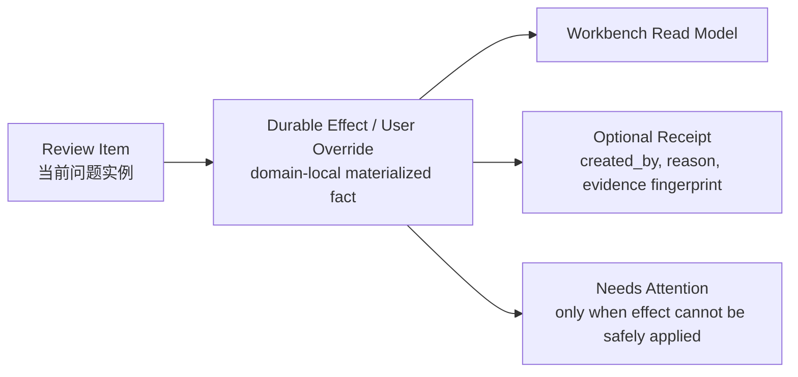

# Synthesis Review Decisions and Durable Effects

本文档定义 Synthesis Layer 中 review item、durable effect / user override、optional receipt 的生命周期。它回答一个核心问题：用户确认过的修正如何在 rebuild 后继续生效，同时避免把单用户 Zotero 插件做成企业级审计系统。

## 设计目标

- **解决信息丢失焦虑**：用户真正需要的是“rebuild 后我之前确认过的修正还在”，而不是完整审计链。
- **以 durable effect 为主事实**：redirect、tombstone、filtered hint、ignored reference、confirmed edge 等领域事实本身就是 rebuild 后应保留的状态。
- **review item 保持短生命周期**：review item 是当前问题实例；解决后可以关闭、失效或 supersede，不承担长期 policy 的全部职责。
- **receipt 只做解释和 debug**：可以记录轻量来源信息，但 receipt 不是 SSOT，不驱动复杂自动重放。
- **重新确认降级为 rare Needs Attention**：只有 durable effect 无法安全 materialize 时才提示用户；普通 evidence hash 或 digest artifact 变化不应打扰用户。
- **UI 管理 user overrides**：统一入口重点是查看、撤销、清理和处理少量失效 overrides，而不是审计所有历史选择。

## 现有实现状态

Status: `partial`。局部 review/action surface 已存在，但统一 Review & Overrides、durable effects / user overrides 和管理入口仍是目标合同。

当前实现已经有多个 review/action 表面，但尚未统一为 “durable effects / user overrides” 的轻量治理模型：

- `src/modules/synthesis/repository.ts`
  - `synt_review_item` 保存 Registry Cache/Reference Resolution 相关 review items。
  - `applyIndexReviewAction()` 会在事务中更新 domain facts、review state、dirty effects。
  - Dedupe merge、delete review 等动作已经会 materialize redirect、binding/tombstone 等领域事实。
- `src/modules/synthesis/literatureRegistry.ts`
  - `augmentRepositoryIndexStateForP0Reviews()` 在 registry/graph cache rebuild 时会保留部分已 resolved/deferred 的 P0 review item（函数名仍是历史实现名）。
- `src/synthesisWorkbenchApp.ts`
  - 目前在 Cleanup、Topic Graph、Concepts、Tags 等局部 surface 显示单张或有限 review card。

当前缺口：

- 还没有统一的 “Saved Overrides / Needs Attention” 用户入口。
- 部分 resolved review 与 durable domain facts 的关系仍不够清楚。
- Rebuild 合同需要从“重放审计记录”调整为“保留 durable effects，并只校验 orphan/hard conflict”。
- UI 目前主要展示 open review，缺少 saved overrides 的查看、撤销和清理能力。

## 三层模型

### Review Item

Review item 是某次扫描、rebuild、proposal ingestion 或 worker 发现的“待判断问题”。它可以重复出现，也可能随着 source state 变化而失效。

示例：

- Zotero item deletion candidate。
- Duplicate strong identifier candidate。
- Reference resolution candidate。
- Topic discovery candidate。
- Topic graph low-confidence relation proposal。
- Concept ambiguous merge proposal。
- Tag import conflict。

### Durable Effect / User Override

Durable effect 是用户确认后形成的领域事实。它是 rebuild 后应保留的主状态，不需要额外依赖中心化 ledger 重放。

示例：

- `synt_literature_redirect`：duplicate merge 的 survivor redirect。
- tombstoned `synt_literature_item` 或 deleted/merged `synt_zotero_binding`。
- external literature dedupe redirect，包含 external -> external 和 external -> Zotero-bound survivor。
- ignored / confirmed `synt_reference_resolution`。
- filtered / accepted `synt_topic_discovery_hint`。
- confirmed / rejected topic graph relation。
- accepted / rejected concept proposal materialized result。
- saved tag mapping 或 import conflict resolution。

### Optional Receipt

Receipt 是解释性元数据，不是运行态 SSOT。它可以嵌入 domain row，也可以放入轻量 receipt table。

建议字段：

| 字段 | 用途 |
| --- | --- |
| `created_at` / `updated_at` | 基本解释 |
| `created_by` | `human`、`system`、`import` |
| `source_review_item_id` | 溯源到当前问题实例 |
| `reason_code` | 例如 `confirm_delete`、`merge_duplicate`、`filter_candidate` |
| `source_evidence_fingerprint` | debug/stale-action guard 参考，不默认使 saved override 失效 |

不建议为第一版引入中心化审计表、supersede chain、复杂前提 JSON、effect replay summary 或跨 rebuild 重放历史。

## 数据模型

Review & Overrides 不是一个独立接管所有领域事实的中心账本。它由三类数据组成：短生命周期 review item、各领域自己的 durable effect / user override，以及可选的轻量 receipt。

### `synt_review_item`

`synt_review_item` 表示当前需要用户判断的问题实例。它可以被解决、失效或 supersede，但不是 rebuild 后长期重放的 SSOT。

建议字段：

| 字段 | 语义 |
| --- | --- |
| `review_item_id` | 稳定 review row id |
| `domain` | `registry`、`reference_resolution`、`topic_discovery`、`topic_graph`、`concept`、`tag`、`sync` |
| `kind` | 领域内 review 类型，例如 `duplicate_candidate`、`confirm_reference_match`、`filter_discovery_hint` |
| `scope_kind` / `scope_ref` | review 作用对象，例如 paper、reference instance、topic、concept |
| `status` | `open`、`deferred`、`resolved`、`rejected`、`superseded`、`blocked_by_upstream_review` |
| `severity` / `priority` | UI 排序和默认入口 |
| `title` / `summary` | 用户可读摘要；不是程序判定依据 |
| `evidence_json` | bounded 证据快照，用于解释和 action-time stale guard |
| `action_schema_json` | 当前允许的动作和必要参数 |
| `source_version` | 创建 review 时看到的 source/stale guard |
| `created_at` / `updated_at` / `resolved_at` | 生命周期时间 |
| `superseded_by` | 可选地指向替代 review item |

### Domain-local durable effect tables

用户确认后的长期状态应写入对应领域的事实表，而不是只保存在 review item 中。

示例：

| 领域 | Durable effect / override |
| --- | --- |
| Registry Cache | `synt_literature_redirect`、tombstoned literature item、deleted/merged Zotero binding |
| Reference Resolution | confirmed/ignored `synt_reference_resolution` 或专用 override row |
| Topic Discovery | `synt_topic_discovery_hint.status = filtered/accepted/rejected` 与必要的 override metadata |
| Topic Graph | confirmed/rejected relation fact 或 proposal outcome |
| Concept | accepted/rejected proposal materialized fact |
| Tag | saved mapping、import conflict resolution |

这些表的共通字段建议包括：

| 字段 | 语义 |
| --- | --- |
| `effect_id` 或领域主键 | 该 effect 的主 id |
| `status` | `active`、`needs_attention`、`revoked`、`orphaned` |
| `scope_kind` / `scope_ref` | effect 作用范围 |
| `target_kind` / `target_ref` | 可选目标对象，例如 merge survivor、matched `literature_item_id` |
| `reason_code` | 用户或系统动作原因 |
| `source_review_item_id` | 可选来源 review |
| `created_by` | `human`、`system`、`import` |
| `created_at` / `updated_at` | 生命周期时间 |
| `diagnostics_json` | bounded 解释和 debug 信息 |

### `synt_override_receipt`（可选）

Receipt 是解释性索引，不是长期事实源。可以用独立表，也可以嵌入 domain row。若实现独立表，建议字段为：

| 字段 | 语义 |
| --- | --- |
| `receipt_id` | receipt id |
| `domain` / `effect_kind` / `effect_ref` | 指向领域 effect |
| `reason_code` | 用户动作或系统动作类型 |
| `summary` | 用户可读短摘要 |
| `source_review_item_id` | 可选来源 review |
| `source_evidence_fingerprint` | debug/stale-action guard 参考，不默认触发失效 |
| `actor` | `human`、`system`、`import` |
| `created_at` | receipt 创建时间 |

### Snapshot DTO

统一 Review & Overrides UI 不应直接解释每个领域表的内部细节；service 层应聚合为四个 bounded snapshot DTO：

| UI 分区 | 数据来源 |
| --- | --- |
| Open Reviews | `synt_review_item` 中 open/deferred/blocked 的当前问题实例 |
| Saved Overrides | 各领域 durable effect / user override 中 `active` 的 row |
| Needs Attention | 各领域 effect 中 `needs_attention`、`orphaned` 或 hard conflict row |
| Recent Actions | bounded receipt rows 或 domain row 最近更新时间 |

这套模型刻意避免中心化 enterprise ledger：长期保证来自 domain-local durable effects，UI 入口负责查看、撤销、清理和处理少量异常。

## Rebuild 保留规则

| Durable effect | Rebuild 后目标行为 |
| --- | --- |
| Delete/tombstone Zotero-bound item | 如果 item 仍缺失，保留 tombstone；如果 item 重新出现，取消 tombstone 或进入 low-noise Needs Attention，取决于用户设置 |
| Dedupe merge redirect | 如果 survivor 存在，保留 redirect；如果 survivor 消失，Needs Attention |
| External literature dedupe redirect | 如果 survivor 可定位，保留 redirect 并 retarget affected resolutions/edges；如果 survivor 消失或出现硬 identity 冲突，Needs Attention |
| Ignore reference | 同一 source/reference stable fingerprint 再出现时保持 ignored；无法定位 source/reference 时清理或 Needs Attention |
| Confirm reference match | target 存在时保留；target 消失或 hard identity conflict 时 Needs Attention |
| Filter discovery candidate | 保留 filtered hint；metadata/digest 变化不默认重开，除非 topic/literature identity 发生硬变化 |
| Accept discovery candidate | 不直接改 artifact；保留为 saved intent / update hint，等待显式 topic update flow |
| Confirm topic graph relation | relation endpoints 存在时保留；endpoint 删除/合并时 Needs Attention |
| Reject concept proposal | 同一 proposal family 可不再提示；新 proposal 可以重新出现，但不需要审计旧拒绝 |
| Tag import conflict resolution | 默认只对本次 import 有效；用户显式保存 mapping 时成为 durable override |

## Needs Attention 触发边界

Needs Attention 是低频异常队列，不是普通重新确认机制。

应触发：

- durable effect 的 target object 消失。
- override scope 本身无法定位。
- import/sync 引入 hard conflict。
- confirmed reference target 出现硬 identity 冲突。
- merge survivor 被删除或合并到不可追踪对象。

不应触发：

- digest artifact 重跑但 literature identity 未变。
- matching/discovery metadata hash 改变但 durable effect 的 scope 和 target 仍可定位。
- worker 产生新的候选证据。
- registry/graph epoch 改变。

## Review & Overrides UI

目标 UI 应提供统一入口，不再只依赖各 tab 的局部 review card。

### 必备视图

- **Open Reviews**：待处理问题，按 priority/domain/source 排序。
- **Saved Overrides**：当前仍生效的 durable effects / user overrides。
- **Needs Attention**：少量无法安全 materialize 的 overrides。
- **Recent Actions**：短期操作回执，默认按时间保留有限窗口；不作为审计 ledger。

### 必备过滤

- Domain：Registry Cache、Reference Resolution、Topic Discovery、Topic Graph、Concept、Tag、Sync。
- Status：open、active override、needs_attention、recent。
- Scope：paper、literature item、reference instance、topic、concept、tag。

### 必备动作

- 查看 effect 和轻量 receipt。
- 撤销 override。
- 清理 orphan override。
- 对 Needs Attention 选择 keep、drop、retarget 或 reopen review。
- 跳转到相关 Workbench tab 和 source object。

## 当前 UI 与目标差距

| 能力 | 当前状态 | 目标 |
| --- | --- | --- |
| Open review cards | 已有局部卡片：Cleanup、Topic Graph、Concept、Tag import | 保留局部入口，同时汇总到统一入口 |
| Saved overrides | 基本缺失 | 可查看、撤销、清理 |
| Needs Attention | 基本缺失 | 只显示少量 orphan/hard conflict |
| Recent action receipt | 缺失 | 可解释最近操作，不做长期审计 |
| Rebuild confirmation | 不完整 | 说明 saved overrides 会保留，orphan overrides 可能进入 Needs Attention |

## 实现约束

- 新增 review kind 或 action 时，必须说明是否产生 durable effect / user override。
- Rebuild 不得只保留 review item；应保留 domain-local durable effect。
- Reset 必须明确是否清 user overrides。
- Import/export 可以选择是否包含 saved overrides；不要求包含完整审计历史。
- Evidence hash 用于 review action 当下 stale-action guard 和 debug 解释，不作为 rebuild 后长期失效的默认依据。
- Debug snapshot 可以暴露 receipt/override diagnostics，但普通 UI 需给用户可理解摘要。
