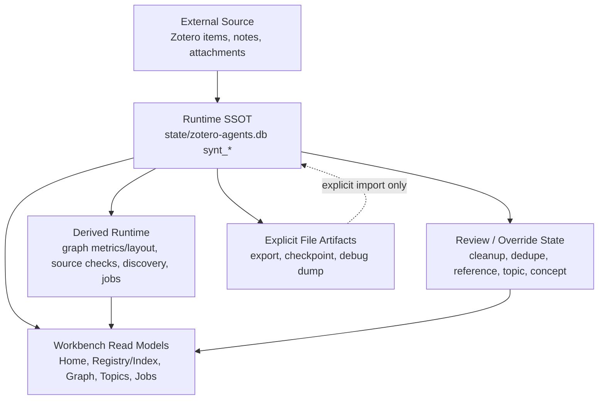
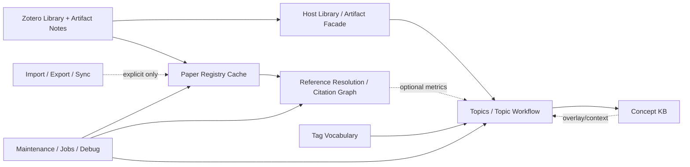

# Synthesis Layer 治理总则

本文档定义 Synthesis Layer 的治理模型：哪些对象属于哪个领域，状态应由谁拥有，触发和重建应如何跨领域传播。它是 [分域地图](./domain-map.md) 的治理版补充，重点约束后续实现，而不是复述 UI 或文件格式。

## 设计目标

Synthesis Layer 的目标状态是一个 DB-first、可重建、可诊断、可分域演进的知识工作台。治理目标包括：

- **领域所有权清晰**：Paper Registry Cache、Citation Graph、Topics、Concepts、Tags、Jobs、Import/Export 各自拥有自己的事实和动作边界。
- **依赖方向单向且稀疏**：外部事实可经 Host Library / Artifact Facade 支撑显式 topic workflow，同时进入 registry cache 支撑 Registry UI、cleanup 和 Citation Graph；下游语义不得反向污染上游基础事实。
- **热路径只读运行态**：Workbench、MCP、Host Bridge 正常读模型只读取 SQLite-backed runtime state，不隐式扫描 JSON/canonical/checkpoint 文件。
- **派生状态可丢弃重建**：Citation metrics、layout、显式 topic source check 结果、discovery hints、job progress 都是可重算状态，不应成为不可替代事实源。
- **用户覆盖事实不可静默覆盖**：durable effects / user overrides、topic artifacts、tag vocabulary、concept review outcomes 是用户或 workflow 确认过的事实，不能被 rebuild 无条件覆盖。
- **触发可解释**：每个 source event 必须通过明确 event routing / invalidation policy 变成有限 invalidation event、review item、job recommendation 或 diagnostic；worker 只消费自己负责的队列。
- **重建可控**：registry/graph cache rebuild、clean reset、import/export 等高影响动作必须有确认、队列处理、epoch/basis guard、进度和后续影响合同。

## 现有实现状态

Status: `partial`。DB-first 主骨架已建立，但治理边界、旧路径收口、review/override 管理和 rebuild 保护仍在推进中。

当前实现已经具备 DB-first 的核心骨架，但仍处在治理收口阶段：

- `src/modules/synthesis/repository.ts` 已经承载大量 `synt_*` 表：literature item、binding、artifact state、reference resolution、citation graph、topic graph、concept、tag、review、dirty event、job progress。
- `src/modules/synthesis/service.ts` 仍是主要 orchestration 中枢，包含 topic apply、registry/cache rebuild、workers、source-check diagnostics、debug facade、Workbench snapshot assembly 等跨域逻辑。
- Workbench 热读模型大体已经切到 DB-backed state，但 topic artifact/freshness 的部分实现仍存在文件 helper 和 transitional state。
- Dirty events 和 job progress 已落在 repository-backed runtime state，但 event routing / invalidation rules 仍分散在 worker 中，没有独立的薄层 policy table。
- Registry/graph cache rebuild 尚未具备完整治理合同：缺少统一 epoch/basis guard、旧任务失效规则和弹窗保护；旧文档中仍有 topic freshness 影响计划的耦合痕迹，需要迁移为显式 source check。
- `data/synthesis/**` 已被从正常 data-root 写入边界中隔离，但 legacy/canonical helper 仍存在于 runtime/export/checkpoint 冷路径。

## 分层模型

### External Source

Zotero library、artifact notes、attachments、workflow run workspaces 是外部或半外部事实源。Synthesis 可以读取并 materialize，但不应把这些路径当作热状态数据库。

外部事实源一致性策略是：**默认乐观、入口防御、大规模或可疑漂移 fail-closed**。

- 默认乐观：内部 worker 可以信任已提交的 Synthesis DB facts，不在每一步重复校验 live Zotero。
- 入口防御：Zotero item、note、attachment、artifact payload 进入 adapter/materializer 时必须做轻量结构校验，例如 item 是否存在、是否 regular top-level、`libraryId:itemKey` 是否稳定、note parent 是否一致、payload 是否可解析、hash 是否可计算。
- 小漂移：startup reconcile 在预算内发现少量安全变化时，可以生成 bounded registry cache dirty events。
- Bulk drift：如果一次启动发现大量 item update/delete/merge、删除比例异常、payload decode failure 比例异常或 fingerprint scan 超预算，应记录 bounded source drift incident，推荐显式 registry/graph cache rebuild，而不是逐条展开 dirty events。
- Structural drift：如果发现 identity collision、binding 不可能状态、Zotero DB/notes 结构异常或大面积 payload 无法解析，应停止增量 fan-out，进入 diagnostic / repair required。
- Bulk/structural drift 不得传播到 Topics；Topic source check 仍由用户或维护命令显式触发。

### Runtime SSOT

SQLite runtime DB 是 Synthesis Workbench 正常运行的事实源。任何需要被 UI、MCP、Host Bridge、worker 或 review action 高频访问的状态都应进入 `synt_*` 表。

### Derived Runtime

Derived runtime 是可重建状态：

- citation graph structure/light metrics；
- complex metrics；
- layout state；
- topic source check diagnostics；
- topic discovery hints；
- dirty events；
- job progress。

其中 dirty events 和 job progress 虽然存储在 DB 中，但生命周期是运行态，不是长期业务事实。

### Review / Override State

Review item 是用户或系统需要显式确认的当前问题实例；durable effect / user override 是已经确认并需要在 rebuild 后保留的领域事实。二者不能混在一个“resolved review”概念里，也不能被 rebuild 静默覆盖。P0 identity/binding review 优先级高于 reference resolution、topic discovery 和 low-priority cleanup。

用户可见的统一管理入口见 [Review Decision Governance](./decision-governance.md) 和 [Workbench UI Governance](./workbench-ui-governance.md)。

### Explicit File Artifacts

Checkpoint、export、debug dump 和 import bundle 是显式文件工件。它们可以从 DB 渲染，也可以作为显式 import 输入，但不得成为 Workbench 热路径 fallback。

## 领域边界

| 领域 | 拥有事实 | 可读上游 | 不允许做的事 |
| --- | --- | --- | --- |
| Platform / Workflow | workflow run、skill provider、ACP execution | Zotero selection/context | 内嵌 Synthesis 业务判断 |
| Zotero Artifact Source | item/note/attachment payload | Zotero runtime | 拥有 Synthesis review/freshness 状态 |
| Repository / Foundation | DB schema、transaction、dirty/job/review primitives | 无 | 解释 topic/citation 业务语义 |
| Paper Registry Cache | literature item cache、binding、artifact readiness、reference facts、cleanup/review surface | Zotero artifacts | 成为全域 SSOT；依赖 topic/concept/tag 下游状态 |
| Reference Resolution / Citation Graph | reference resolution、citation nodes/edges/metrics/layout | Paper Registry Cache | 使用 topic discovery metadata 做文献间引用匹配 |
| Tag Vocabulary | controlled tags、alias、abbrev、validation | DB repository | 直接改写 topic artifacts |
| Topics / Topic Graph | topic artifact、resolver/source manifest、source check diagnostics、topic relations、discovery state | Host Library / Artifact Facade、Tags、optional Graph metrics、Concept overlay | 拥有 Zotero/item/registry-cache facts；被 registry cache rebuild 或 registry dirty event 隐式驱动 |
| Concept KB | concept/sense/alias/relation/topic link/review | topic proposals | 替代 topic artifact 或 index identity |
| Maintenance / Jobs / Debug | dirty events、job state、debug inspect/run | domain services | 绕过 domain API 直接拼业务 SQL |
| Sync / Import / Export | explicit file bundles | DB/export APIs | 作为 UI 热路径事实源 |

## 依赖规则

- 上游领域可以提供 facts；下游领域可以提供 review/proposal/context；下游不能直接改写上游事实。
- Paper Registry Cache 是 Registry UI、cleanup、reference resolution 与 Citation Graph 的运行态缓存，不是 Topics/Tags/Concepts 的全局事实源。
- Topics 的主输入是 Host Library / Artifact Facade。Registry cache rebuild、startup reconcile、registry dirty events 不应成为 Topics 的正常触发器。
- Citation Graph metrics 是可选增强；缺失或过期不能阻断 topic create/update。
- Jobs 是调度层，不是事实所有者。
- Import/Export 是边界层，不是运行态主库。
- Debug 能力可以观测和推进 worker，但必须通过 service/repository API，不能成为“任意 SQL 能力”。

## 治理检查表

每个 Synthesis change 进入实现前，应回答：

1. 新状态属于哪个领域？
2. 它的 SSOT 是 SQLite、Zotero、workflow artifact，还是显式文件？
3. 它是长期事实、user override、派生状态，还是临时 job/queue？
4. 它是否需要 rebuild 后保留？
5. 它会不会让 read path 产生副作用？
6. 它是否需要进入 event routing / invalidation policy，而不是在 worker 中临时判断？
7. 它是否改变 source check、coverage 或 discovery 的语义？
8. 它是否需要 epoch/basis guard 防止旧任务污染新状态？
9. 它是否产生 durable effect / user override，并进入 Review & Overrides 管理入口？

如果无法回答，应先更新本治理文档或相关子文档，再改代码。
