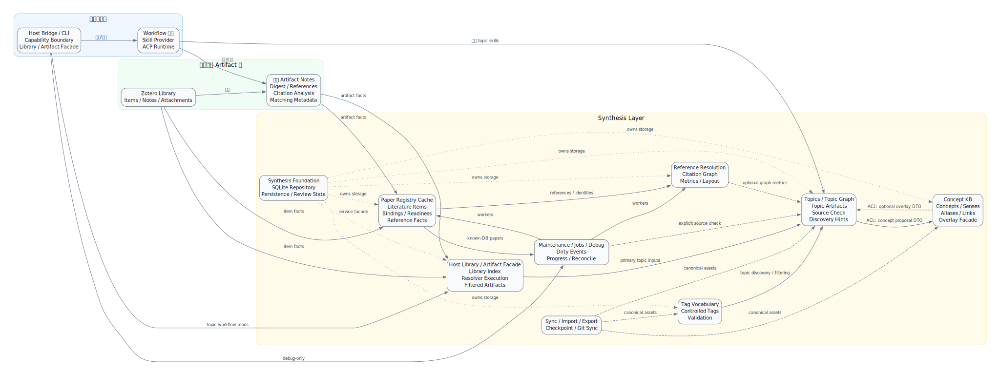
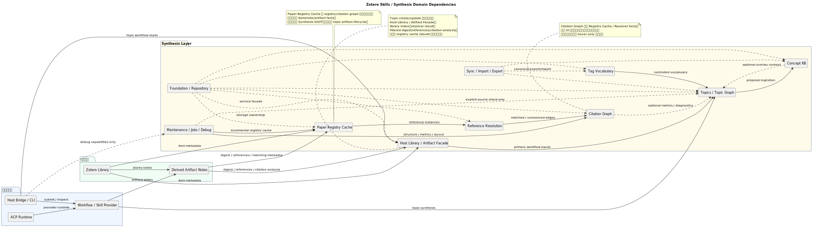

# Synthesis Layer 分域地图

本文是 Synthesis layer 后续开发的分域设计锚点。它回答三个问题：

- 哪些模块属于同一个领域边界；
- 领域之间的依赖方向是什么；
- 新功能、debug 能力、UI 读模型和持久化表应落在哪个边界内。

## 总览图



DOT 源文件：[`diagrams/synthesis-domain-context-map.dot`](./diagrams/synthesis-domain-context-map.dot)



PlantUML 源文件：[`diagrams/synthesis-domain-dependencies.puml`](./diagrams/synthesis-domain-dependencies.puml)

## 领域目录

| 领域 | 负责什么 | 不负责什么 |
| --- | --- | --- |
| 平台执行域 | Workflow 骨架、Skill Provider、ACP Runtime、任务提交与执行生命周期 | Synthesis 业务语义、topic/registry-cache/tag/citation 的领域规则 |
| Host Bridge / CLI 边界 | 对外 capability、安全审批、debug-only 入口、CLI 语义命令；topic workflow 的 library/artifact facade | 绕过 service/repository 直接拼业务 SQL；把 facade 读操作伪装成 registry cache rebuild 依赖 |
| Zotero Library + 派生 Artifact Notes | Zotero item/note/attachment 事实源，以及 digest、references、citation analysis、matching metadata 等派生 artifact 承载 | Synthesis DB 事实所有权、topic source-check state、review state |
| Synthesis Foundation / Repository | SQLite-first 运行态、事务、review state、dirty event、job progress、reset/import/export 基础设施 | 具体 topic/tag/concept/citation 业务解释 |
| Paper Registry Cache | 可重建的 `literature_item` 缓存、Zotero binding、artifact readiness、reference instances/resolutions、cleanup/review surface，是 registry UI 与 citation graph 的运行态缓存。历史实现名包括 Literature Registry。 | 成为全域 SSOT、Topic 内容生成、topic source check、tag 控制词表、concept 语义合并、graph 展示策略 |
| Reference Resolution / Citation Graph | 文献间引用匹配、citation edges、graph metrics、layout、graph UI snapshot，以及 matched library citation edge 到 Zotero native related items 的受控外部 sync | Topic discovery metadata；`literature_matching_metadata` 不参与文献间引用匹配；Zotero related items 不是 graph SSOT |
| Tag Vocabulary | 控制词表、tag normalization、validation、import preview、deprecated/replacement 规则 | 直接决定 topic artifact 内容；它只提供 topic/discovery 可消费的词表语义 |
| Topics / Topic Graph | topic synthesis artifacts、topic graph、显式 source check diagnostics、discovery hints、review workflow 入口；通过 proposal DTO 向 Concept KB 提交候选 | 拥有 Zotero item/note/registry-cache facts、重算 citation graph、维护 tag vocabulary、被 registry cache rebuild 隐式驱动、直接读取 Concept KB 内部表 |
| Concept KB | concept、sense、alias、relation、topic-concept links、overlay 展示；通过只读 overlay DTO 向 Topics 提供可选上下文 | 替代 Topics；把 concept merge/review 决策写回 topic artifact；要求 Topic 功能依赖 Concept KB 可用 |
| Maintenance / Jobs / Debug | dirty events、startup reconcile、workers、job progress、debug snapshot/inspect/run | 直接修改领域事实而不走对应 service/repository API |
| Sync / Import / Export | canonical assets 的 checkpoint、Git Sync、显式导入导出 | UI 热路径读模型、SQLite 运行态事实的替代来源 |

## 依赖方向

核心方向是：外部事实经 Host Library / Artifact Facade 支撑显式 topic workflow，同时进入 Paper Registry Cache 形成 registry/citation graph 所需的可重建运行态缓存。Topics 不是 registry cache 的连续下游状态；registry cache 维护 registry/graph，Topic artifact 生命周期由显式 workflow apply/update 控制。

```text
Workflow / ACP / Skill Execution
        |
        v
Zotero Library + Derived Artifact Notes
        +--> Host Library / Artifact Facade --> Topics / Topic Graph <--> Concept KB
        |
        +--> Paper Registry Cache --> Reference Resolution / Citation Graph
                                             |
                                             +-- optional metrics --> Topics / Topic Graph

Tags ---------------------------------------> Topics / Topic Graph
```

更严格的规则：

- Host Library / Artifact Facade 可以读取 Zotero item、artifact notes、filtered artifacts 和 resolver 结果，作为 topic create/update 的主输入边界。
- Paper Registry Cache 可以知道 Zotero item、artifact notes、reference payload、binding、artifact readiness、hash；它不知道 topic synthesis 的章节、UI 布局或概念 overlay，也不驱动 topic artifact 更新。
- Citation Graph 只消费 registry cache / Reference Resolution facts；它不读取 `literature_matching_metadata` 做文献间引用匹配。
- Zotero native related items 是 Citation Graph 的可选外部 sync：只从已确认的库内 matched citation edges 补齐 Zotero 关系，不反向作为 reference resolution 或 graph 的事实源。
- Tags 是独立词表域；Topics 强依赖 Tags，但 Tags 不依赖 Topics。
- Topics 强依赖 Host Library / Artifact Facade 和派生 artifacts，通常依赖 Tags；可选读取 Citation Graph metrics 作为增强诊断。Topics 不应依赖 registry cache rebuild 或 registry dirty events 维持自身状态。
- Concepts 与 Topics 是相关域，但必须通过 anti-corruption layer 交互：Topics 只向 Concept KB 提交 proposal/link DTO，Concept KB 只向 Topics 暴露只读 overlay/context DTO；二者不能共享同一事实表所有权。
- Maintenance/Jobs/Debug 是横切运行态域；它只能调度领域 service，不能成为新的业务事实所有者。
- Sync/Import/Export 是冷路径；Workbench 正常 UI 热路径不得从 canonical JSON 或 checkpoint 文件隐式 fallback。

## Topics ↔ Concepts Anti-Corruption

Topics 与 Concept KB 之间存在双向信息流，但这不是双向事实依赖。两个方向必须通过明确 DTO 边界：

| 方向 | 协议 | 写入方 | 读取方 | 语义 |
| --- | --- | --- | --- | --- |
| Topics -> Concept KB | `concept_card_proposal` / `topic_concept_link_proposal` | topic synthesis apply | Concept KB proposal ingestion | Topic workflow 产出候选概念、aliases、topic link evidence；Concept KB 负责验证、合并、review 和 materialization |
| Concept KB -> Topics | `concept_overlay_context` | Concept KB read facade | Topics UI / topic workflow context builder | 只读上下文，用于显示 overlay、提供可选语义提示或生成时参考；不得改变 topic artifact、source manifest 或 topic graph facts |

### Proposal Ingestion 边界

- Topic apply 可以提交 concept proposals，但不能直接写 concept canonical facts。
- Concept KB ingestion 必须把 proposal 转换为 concept facts、review items 或 diagnostics；失败只影响 Concept KB proposal ingestion，不回滚已成功提交的 topic artifact，除非 host apply 在同一显式事务中声明 all-or-nothing。
- Concept review action 属于 Concept KB。它可以 materialize concept/sense/alias/topic-link facts，但不能自动改写 topic artifact 正文或 topic graph relation。
- 同一 topic 再次 apply 产生的新 concept proposal 可以被 Concept KB 去重、合并或进入 review；不能覆盖用户已确认的 concept merge/reject 决策。

### Overlay Context 边界

- Overlay 是 best-effort snapshot DTO。Topics UI 和 topic workflow context builder 可以请求 overlay，但不得要求 overlay 可用。
- Concept KB 不可用、为空、过期或返回 diagnostics 时，Topic List/Detail/Create/Update 必须继续可用；UI 最多显示 “concept overlay unavailable/stale” 这类非阻塞状态。
- Overlay 读取应有界：按 topic id、concept ids、selected topic neighborhood 或请求 limit 返回，不能在普通 topic snapshot 中扫描完整 Concept KB。
- Overlay 结果不得被写入 topic artifact 的 source manifest/freshness baseline；如果 agent 在 update workflow 中使用了 overlay 作为参考，它只能进入 workflow 输入 receipt 或 diagnostics。
- Overlay 失败不 enqueue topic source-check / freshness diagnostic 或 concept rebuild；只有显式 refresh/repair/debug command 才能启动 Concept KB 维护任务。

### 失败语义

| 场景 | Topics 行为 | Concept KB 行为 |
| --- | --- | --- |
| Concept KB empty | Topic 功能正常，overlay 区域显示空状态 | 无需创建概念 |
| Concept KB read failed | Topic 功能正常，记录 bounded diagnostic | 可提供 retry/rebuild recommendation |
| Concept proposal ingestion failed | Topic artifact apply 默认保持成功，sidecar ingestion failure 进入 diagnostics/review | 不产生部分 concept facts；失败 proposal 可重试 |
| Concept review action failed | Topic artifact 不变 | review item 保持 open/failed_retryable |
| Concept merge/delete 导致 overlay target 消失 | Topic artifact 不变；下次 overlay read 显示 updated/empty context | Concept KB 维护自己的 redirect/Needs Attention |

## 领域不变量

### 平台执行域

- Workflow/ACP 只表达执行协议，不内嵌 Synthesis 领域判断。
- Skill Provider 的输出必须经 host apply / synthesis service 验证后才能进入 Synthesis 状态。
- Debug capability 可以观测和推进 worker，但不能绕过 capability gate 或 service API。

### Source Artifact 域

- Zotero Library 是外部事实源，不是 Synthesis 内部状态。
- 派生 Artifact Notes 是桥接 artifact 的承载格式；Synthesis 可以读取和写回受控 payload，但不能把 Zotero note 当作热状态数据库。
- Artifact note 协议变化应先影响 adapter/ingest，再由 registry cache materialize 成 DB facts。

### Paper Registry Cache 域

- Paper Registry Cache 是 anti-corruption cache 和 runtime facts，不是全局 Synthesis SSOT。
- `literature_item` 是 registry/cache 与 citation graph 内的统一文献实体；Zotero-bound 与 external/referenced literature 不应分裂成两套模型。
- Paper Registry Cache 支撑 citation graph、registry UI 和 cleanup review，不应依赖下游 topic/concept/tag 业务状态，也不应作为 topic source-check 的后台驱动。

### Reference Resolution / Citation Graph 域

- Reference resolution 负责文献间引用匹配；topic discovery 的 `literature_matching_metadata` 不进入该匹配算法。
- 自动 `matched` 必须 precision-first；低置信结果应进入 suggestion/review，不污染 citation graph。
- Graph UI 默认表达库内互引和共享外部引用；单入度外部引用属于 hover-only 或局部探索层。
- Metrics、structure、layout 是分层派生状态；layout 不能反向改变 graph structure。
- Zotero native related items sync 属于 graph-to-library bridge side effect：它只补充缺失的 Zotero related link，不自动删除用户已有 related link，也不读取旧 `reference-matching` baseline/citeKey payload。

### Tags 域

- Tags 维护控制词表和验证规则，提供 topic/discovery 可消费的语义约束。
- Tag import/review action 必须留在 Tag Vocabulary 边界内。
- Topics 可以依赖 Tags 做过滤、scope、discovery，但不能把 topic 状态写回 tag canonical facts。

### Topics / Concepts 域

- Topic artifact 是 synthesis 内容产物，依赖 Host Library / Artifact Facade、Tags、派生 artifacts，可选依赖 Citation Graph metrics。
- Topic source check 是显式诊断，不是由 registry cache facts 和 background events 持续驱动的 freshness invariant。
- Concept KB 消费 concept proposal，并维护 concept/sense/alias/relation/link facts。
- Concept overlay 是展示增强，不应改写 source artifact 正文。
- Topics 与 Concept KB 之间必须经由 proposal ingestion DTO 和 read-only overlay DTO；任一方不可直接读取或写入另一方内部表作为普通业务逻辑。
- Concept KB 不可用时，Topic 正常列表、详情、create/update 和 source check 不应被阻断；只允许降级 overlay/context。

## 改动归属检查表

做任何 Synthesis 相关改动前，先回答：

1. 这个改动新增或修改的是哪个领域的事实？
2. 它是否把下游业务状态写回了上游基础事实？
3. UI 热路径是否只读 SQLite-backed repository/runtime state？
4. 若涉及文件 JSON，它是显式 import/export/checkpoint/debug，还是错误的隐式 fallback？
5. 若涉及 worker/debug capability，是否仍通过对应 domain service/repository API？
6. 若涉及 topic 生成，是否以 Host Library / Artifact Facade 为主输入，并只把 Citation Graph/Tags/Concepts 当作输入上下文，而不是混淆事实所有权？
7. 若涉及 Topics/Concepts 交互，是否通过 proposal DTO 或 overlay DTO，而不是共享表、隐式 join 或跨域直接写？

如果无法明确回答这些问题，应先更新本分域文档或新增更细的领域文档，再实施代码变更。
