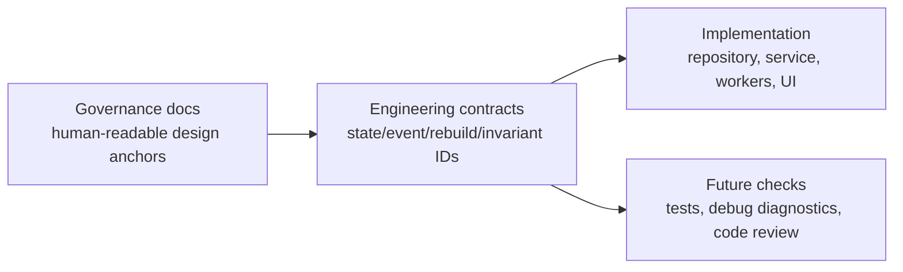

# Synthesis Engineering Contracts

本目录是 Synthesis Layer 的工程化合同层。它面向实现、测试、debug diagnostics 和 future agent work，而不是普通用户说明。

## 定位

治理文档解释“为什么有这些边界”；工程合同解释“系统允许什么状态、什么事件、什么顺序、什么不变量”。二者关系如下：

Status: `target contract only` / `partial`。本目录的 Markdown 与 YAML 是实现、测试、debug 的合同锚点，不表示所有机制已经实现，也不要求一次性实现。具体实现状态以 [Synthesis Layer README](../README.md) 的 Phase 实现状态表为准。

## 文档集合

| 文档 | 用途 |
| --- | --- |
| [State Machines](./state-machines.md) | 关键对象生命周期、允许转移、禁止转移 |
| [Sequences](./sequences.md) | 跨域流程的时序合同 |
| [Concurrency Control](./concurrency-control.md) | 协作式异步运行模型、短事务、in-progress marker、stale-action guard、epoch/basis guard |
| [Failure Recovery](./failure-recovery.md) | rebuild run、after-commit effect、interrupted task 恢复 |
| [Invariants](./invariants.md) | 不变量目录、严重级别、验证口径 |
| [Event Contracts](./event-contracts.md) | source event、invalidation event、job progress 的工程语义 |
| [Rebuild Runbooks](./rebuild-runbooks.md) | full rebuild、incremental、reset、import/export 的执行骨架 |
| [Performance and Scale Model](../performance-scale-model.md) | 数据规模、查询预算、worker budget、分页和 drift 阈值 |

## 机器可读合同

| YAML | 用途 |
| --- | --- |
| [state-machines.yaml](./schemas/state-machines.yaml) | 状态机 ID、状态、转移、禁止转移 |
| [events.yaml](./schemas/events.yaml) | 事件 ID、owner、scope、consumer、progress |
| [concurrency.yaml](./schemas/concurrency.yaml) | 事务、in-progress marker、stale-action guard、epoch/basis guard、冲突处理 |
| [recovery.yaml](./schemas/recovery.yaml) | 失败分类、恢复动作、rebuild run、interrupted task recovery |
| [invariants.yaml](./schemas/invariants.yaml) | 稳定 invariant ID、严重级别、适用面、证据 |
| [rebuild-contracts.yaml](./schemas/rebuild-contracts.yaml) | rebuild/reset/import runbook 的确认、队列、进度、override policy |
| [performance.yaml](./schemas/performance.yaml) | 规模分层、查询预算、worker budget、drift 阈值、分页限制 |
| [discovery-policy.yaml](./schemas/discovery-policy.yaml) | Topic Discovery apply-time 打分 policy、阈值、限流、停词和 filtered suppression |

## 使用规则

- 后续 change 如果新增状态、事件、job source、review action、rebuild/reset/import 行为，应先确认是否已有 contract ID。
- 后续 change 如果引入长任务、review action、epoch/basis guard 或 after-commit side effect，必须检查并更新并发与恢复合同。
- 后续 change 如果改变查询形状、batch size、time budget、分页上限、graph slice 或 startup reconcile drift 阈值，必须检查并更新性能规模模型和 `performance.yaml`。
- 后续 change 如果改变 Topic Discovery 权重、阈值、top-k、停词或 filtered hint 重新打开条件，必须更新 `discovery-policy.yaml` 和对应实验/审阅依据。
- 修改实现时，如果违反某个 invariant，应更新设计并解释为什么 invariant 需要改变，而不是只绕过测试。
- UI 行为应引用状态机和 invariant，而不是在组件里重新发明状态含义。
- Debug 能力可以展示 contract ID，帮助判断问题属于数据污染、旧 epoch/basis、saved override Needs Attention 还是 worker 失败。
- 本目录第一版是文档和 YAML 合同，不代表已有自动执行器；自动校验应作为后续 change 接入。
- 工程合同的实现必须按 phase gate 推进。新增自动校验、worker guard 或 UI 行为时，应同步更新总 README 的 Phase 状态，标明该合同是已实现、partial 还是仍为 target contract。

## 命名约定

- 状态机：`sm.<domain>.<object>`
- 序列：`seq.<domain>.<flow>`
- 事件：`evt.<domain>.<name>`
- 不变量：`inv.<domain>.<property>`
- Runbook：`run.<domain>.<operation>`

稳定 ID 可以被测试、OpenSpec 任务、debug 输出和 code review 引用。
