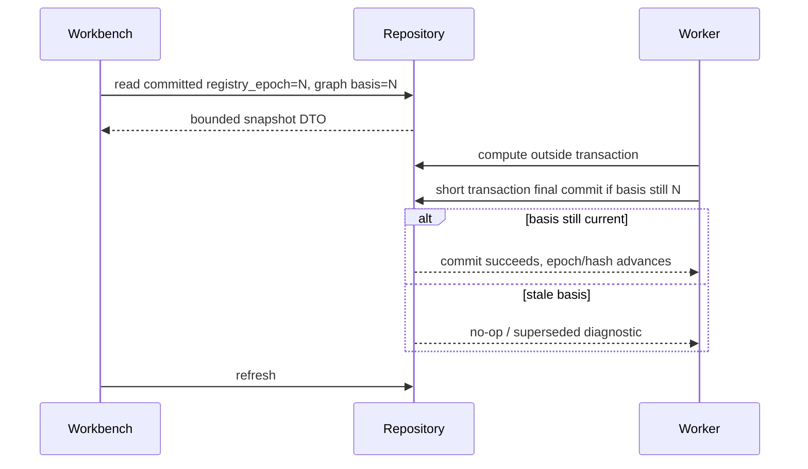

# Synthesis Local Async Consistency

本文档定义 Synthesis Layer 在 Zotero 插件运行环境中的一致性合同。这里的运行环境是单进程、单 JavaScript event loop 的协作式 `async/await` 模型；没有分布式 worker、多线程写入、lease、heartbeat、reaper、锁排序或死锁预防协议。

真正需要防止的是：某个 worker、Host Bridge 调用或 UI action 在 `await` 之后继续提交旧结果，覆盖用户刚完成的操作或新的 registry/graph 状态。因此，本合同只保留本地插件需要的轻量机制：短事务、in-progress marker、stale-action guard 和 epoch/source check。

机器可读版本见 [concurrency.yaml](./schemas/concurrency.yaml)。Markdown 描述冲突语义和操作边界；完整 conflict id 枚举以 YAML 为准，新增或重命名 conflict 时必须同步本文件。

## 设计目标

- UI 只读取 committed SQLite state，不展示半个事务写入的中间态。
- 写入使用短事务；Zotero IO、文件 IO、网络 IO、layout/metrics 计算和 workflow/LLM 调用不得放进写事务。
- Worker 是协作式异步任务；同 scope 的重复任务应合并、保持 queued，或让后提交的旧结果 no-op。
- Review action 使用用户点击时看到的 evidence/source version 做 stale-action guard，不引入中心化 OCC 子系统。
- Registry/graph cache rebuild 使用轻量 epoch 或 source hash 防止旧 worker final commit 污染当前状态；不要求 staging generation / promote 架构。

## SQLite 事务期望

当前 repository 写事务使用 `BEGIN IMMEDIATE` 语义。工程合同要求如下：

| 操作 | 事务边界 |
| --- | --- |
| 单个 domain fact 更新 | 一个短写事务 |
| review action materialization | review state、durable effect、domain facts、dirty effects 同一短写事务 |
| dirty event start | 短写事务标记 `running`，写入 `run_id`、`scope`、可选 `basis_epoch/source_hash`、`started_at`、`updated_at`、`attempt_count` |
| worker final commit | 短写事务，校验 run marker 仍当前、source/basis 仍当前；失败则 no-op 或 superseded |
| UI snapshot | 单次 API 调用读取 committed state；发现 registry/graph basis 不一致时 retry 或返回 bounded diagnostic |
| registry/graph cache rebuild final commit | 显式 rebuild 完成后用短事务替换相关 cache facts、推进 epoch，并清理旧任务 |

写事务内不得做 Zotero IO、文件 IO、网络 IO、长时间 layout/metrics 计算或 LLM/skill 调用。

## 快照读取语义

Workbench snapshot 的目标是 committed-state DTO：它从当前 DB 状态组装 bounded UI 数据，而不是维护一套独立 CQRS read model 或投影 SSOT。

UI 可以显示旧 snapshot 加 running job，但不能把不同 basis 的 registry/cache rows 与 graph rows 混合解释为 ready state。发现 basis 不一致时，UI 应显示旧图加“refreshing/rebuild running”诊断，或 retry 一次 bounded snapshot assembly。

## Worker In-Progress Marker 与 Scope

Worker start 只需要写入一个本地 in-progress marker：

- `run_id`
- `worker_id`
- `scope_kind`
- `scope_ref`
- optional `basis_epoch` / `source_hash`
- `started_at`
- `updated_at`
- `attempt_count`

同一 scope 的写入遵循本地协作式规则：

- duplicate dirty events 优先合并为一个 bounded scope；
- 如果同 scope 已 running，新 worker 不启动或保持 queued；
- final commit 必须幂等，或者在 source/basis 变化时 no-op；
- 插件重启后，startup maintenance 清理上一轮遗留的 running rows。

协作式 runtime 不需要持续 heartbeat。`updated_at` 只用于 UI diagnostics 和启动恢复，不作为 lease。

## Review Action Stale Guard

Review action 必须基于用户看到的 evidence 执行。最低 guard 条件：

| Review 类型 | Guard 字段 |
| --- | --- |
| reference resolution | `reference_instance_id` + `evidence_hash` + `target_version` |
| deletion review | `literature_item_id` + binding state/version |
| dedupe review | source/survivor literature IDs + identifier/evidence hash |
| discovery override | `topic_id` + `literature_item_id` + hint state/version |
| topic/concept/tag proposal | proposal evidence hash |

Guard 失败时返回 `conflict_requires_attention`，并打开新的 review 或 Needs Attention item。不得用用户旧 action 直接覆盖新 facts。Evidence hash 只保护用户点击确认的当下，不作为 rebuild 后长期失效依据。

### Review Action 冲突语义

Review action 的冲突处理按领域优先级解释，不引入分布式锁：

| Conflict ID | 冲突 | 事务结果 |
| --- | --- | --- |
| `overlapping_p0_identity_action` | 两个 P0 identity action 作用同一 literature/binding scope | 先提交者写 durable effect；后提交者 guard 失败，返回 `conflict_requires_attention` |
| `p1_reference_target_changed_by_p0` | P1 reference resolution action 的 target 被 P0 merge/delete 改写 | P1 action 不写 resolution/edge，旧 review supersede 或 Needs Attention |
| `stale_worker_candidate_after_user_action` | Worker 在用户 action 后提交旧候选结果 | final commit 校验 source/evidence/basis；旧结果 no-op 或 superseded |
| `discovery_filter_vs_apply_match` | Discovery filter 与 digest apply-time matcher 同时命中同一 pair | filtered override 优先；matcher 只更新 diagnostics，不重开 open hint |
| `import_apply_vs_open_review_action` | Import apply 与 open review action 作用同一 domain fact | import policy/stale guard 决定；失败时 review/action 返回 conflict，而不是 silent overwrite |

这类冲突都应在一个短写事务内判定并返回结构化结果。UI 的默认处理是刷新相关 snapshot DTO，不自动重放旧 action。

## Epoch Compatibility

Epoch 是本地版本计数器，不是业务事实，不是分布式 generation，也不是 Topics 与 Registry/Graph 重新耦合的入口。

| Track | 语义 | 独立性 |
| --- | --- | --- |
| `registry_epoch` | Paper Registry Cache 当前 committed basis；full rebuild 或结构性 registry/cache 替换后推进 | 会使旧 registry/cache worker 结果与 graph work stale |
| `graph_epoch` | Citation graph committed basis；记录 `basis_registry_epoch` 或等价 graph input hash | 可独立推进，但不得基于旧 registry basis 提交为 ready |
| topic artifact version/hash | Topic domain 自己的 artifact version/hash | 只随显式 topic apply/update/delete 推进，不受 registry/graph epoch 推进 |

Graph worker 只需在 final commit 时校验 `basis_registry_epoch` 或 graph input hash 仍当前。如果 registry/cache 在计算期间发生结构性替换，旧 graph 结果 no-op，并把 job/event 标记为 `stale_basis` / `superseded`。

Topic writer 不受 registry/graph epoch guard 影响。Topic 与 Zotero/library/artifact 的一致性只通过显式 topic source check 或 topic workflow update 处理；registry/cache rebuild 不能用 epoch 机制隐式推进 topic 状态。

## 冲突类型

| Conflict ID | Scope | 处理 |
| --- | --- | --- |
| `stale_basis_commit` | Worker final commit | final commit no-op，标记 superseded 或 stale_basis |
| `interrupted_run_detected` | Startup maintenance | 启动恢复转为 queued、failed_retryable 或 superseded |
| `review_evidence_changed` | Review action | 拒绝 action，创建 Needs Attention 或新 review |
| `scope_run_conflict` | Worker start / dirty queue | 后到 worker 不启动或保持 queued |
| `snapshot_basis_changed` | Workbench snapshot | UI read retry 或显示旧 snapshot + running job |
| `overlapping_p0_identity_action` | P0 identity review action | first commit wins；后提交 action 返回 `conflict_requires_attention` |
| `p1_reference_target_changed_by_p0` | P1 reference resolution action | 拒绝 P1 action，旧 review supersede 或 Needs Attention |
| `stale_worker_candidate_after_user_action` | Worker candidate/review update | 旧候选 final commit no-op 或 superseded |
| `discovery_filter_vs_apply_match` | Topic discovery hint | 保留 filtered override，只更新 diagnostics |
| `import_apply_vs_open_review_action` | Import apply / open review | 由 import policy 和 stale guard 判定；不得 silent overwrite |

## 当前实现状态

Status: `partial`。Repository transaction 和部分 job state 已可用；in-progress marker、epoch/basis stale guard 和 snapshot basis diagnostics 仍未统一。

当前实现已有 repository transaction 封装和部分 job 状态，但尚未形成完整轻量一致性合同：

- dirty event in-progress marker、startup interrupted-run cleanup 需要进一步统一。
- review action 的 stale-action guard 需要明确落表。
- registry/graph cache rebuild 的 epoch/source-hash guard 与旧任务清理尚未完整实现。
- Workbench snapshot 需要统一返回 basis/diagnostic，而不是暴露 legacy derived file 状态。
