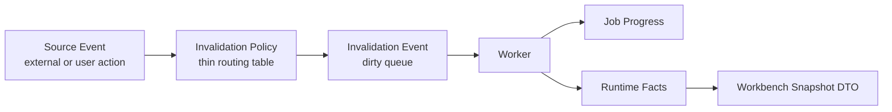

# Synthesis Event Contracts

本文档定义 Synthesis Layer 的工程事件合同。机器可读版本见 [events.yaml](./schemas/events.yaml)。Markdown 表格是人类可读规范摘要；完整事件枚举、字段和 policy 以 YAML 为准，修改一处时必须同步另一处。

## 事件分层

## Source Event

Source event 表示外部事实或用户动作发生变化。它不等于 worker queue item。

示例：

- Zotero item created/updated/deleted。
- Artifact note payload changed。
- User confirmed review action that materializes durable effect。
- Topic artifact applied。
- Import apply completed。
- Full rebuild requested。

## Invalidation Event

Invalidation event 是可被 worker 消费的 dirty work。它必须具备：

- stable event ID；
- domain owner；
- scope；
- optional epoch/basis；
- status；
- run marker ownership；
- consumer；
- retry/supersede policy。

## Progress Event

Progress event 写入 `synt_job_state` 或等价 job state。它必须声明 progress mode：

- `determinate`：真实 item count。
- `phase`：固定 phase list。
- `indeterminate`：不可计算，不显示 percent。

## Canonical Event Families

| Event ID | 类型 | Owner | Consumer | 说明 |
| --- | --- | --- | --- | --- |
| `evt.index.paper_dirty` | invalidation | Registry Cache | paper registry incremental worker | 历史 `index.*` 名称；语义是 Zotero item/artifact 需要进入 paper registry cache |
| `evt.index.digest_applied` | source | Registry Cache | event routing policy | literature-digest apply 更新 artifact/matching metadata；只触发该 literature 的 registry refresh 和 apply-time discovery |
| `evt.index.full_rebuild_requested` | source | Service/UI | registry/graph cache rebuild runbook | 历史 `index.*` 名称；语义是受保护 registry/graph cache rebuild 请求 |
| `evt.external_source.drift_detected` | source | Startup Reconcile | drift classifier | Zotero 外部事实源与 DB state 发生差异 |
| `evt.external_source.rebuild_required` | invalidation | Registry Cache Maintenance | explicit rebuild runbook | bulk/structural drift 不允许增量 fan-out |
| `evt.graph.structure_dirty` | invalidation | Citation Graph | graph structure worker | reference facts 改变 |
| `evt.graph.layout_dirty` | invalidation | Citation Graph UI | layout worker | graph hash/preset 需要 layout |
| `evt.graph.related_items_sync_dirty` | invalidation | Citation Graph / Zotero Library Bridge | related items sync worker | matched library citation edges 需要同步为 Zotero native related links |
| `evt.identity.external_dedupe_review` | invalidation | Registry Cache Identity | external literature dedupe review worker | 库外文献潜在重复需要 benchmark-backed auto-merge 或 review，不得用未验证 fuzzy 规则直接合并 |
| `evt.identity.literature_redirect_materialized` | source | Registry Cache Identity | event routing policy | literature redirect / merge durable effect 已写入，需要有界 retarget reference resolutions、citation edges 和 related-items sync |
| `evt.topic.source_check_requested` | invalidation | Topics | topic source-check worker | 用户或维护命令显式请求检查 topic source manifest |
| `evt.topic.discovery_apply_match` | invalidation | Topics | digest apply-time discovery matcher | 单篇 literature digest metadata 已更新，需要与 active topics 做 best-effort matching |
| `evt.topic.discovery_repair_requested` | invalidation | Topics | discovery repair worker | 显式 debug/maintenance repair 要求重算有界 hints |
| `evt.review.override_materialized` | source | Review/Override | event routing policy | 用户 review action materialized durable effect |
| `evt.import.applied` | source | Import | event routing policy | 显式 import 改变 DB facts |
| `evt.reset.clean_install_completed` | source | Reset | Workbench refresh | 清空 Synthesis runtime/file residue |
| `evt.queue.interrupted_run_detected` | invalidation | Startup Maintenance | recovery policy | 上次 Zotero/plugin 会话遗留 running event/job |
| `evt.review.conflict_requires_attention` | source | Review/Override | Review & Overrides | review action stale guard 失败 |

## 禁止项

- 不得把 legacy reference matching workflow 作为 canonical source event。
- 不得让 UI snapshot 读取旧 task rows 生成 active events。
- Dirty events 是 transient work queue，不是 event sourcing 日志；不得设计全局 event replay。
- 不得让 worker 直接伪造 downstream domain facts；必须通过 owner service/repository API。
- 不得让 source event 绕过 event routing / invalidation policy 直接污染多个领域队列。
- Invalidation policy 不得做 semantic matching、graph computation、topic source-check / freshness diagnostic inference、file scanning、cross-domain direct writes 或 unbounded fan-out。
- 不得让上次会话遗留的 running event/job 永久显示为 active。
- 不得让 topic apply、registry cache rebuild、Workbench snapshot 或 metadata hash 微变触发全库 discovery backscan。
- 不得让 registry cache dirty events、startup reconcile 或 registry/graph cache rebuild fan out 成 topic source-check / freshness diagnostic jobs。
- 不得让 startup reconcile 的 bulk/structural Zotero drift 展开成无界 per-item dirty events、review items 或 graph jobs。
- 不得把 Zotero native related items 当作 Citation Graph 或 reference resolution 的输入事实；related items sync 只能从 DB matched library edges 向 Zotero 补缺失 link。
- 不得通过新 related items sync 复用 legacy `reference-matching` workflow 的 citeKey baseline。
