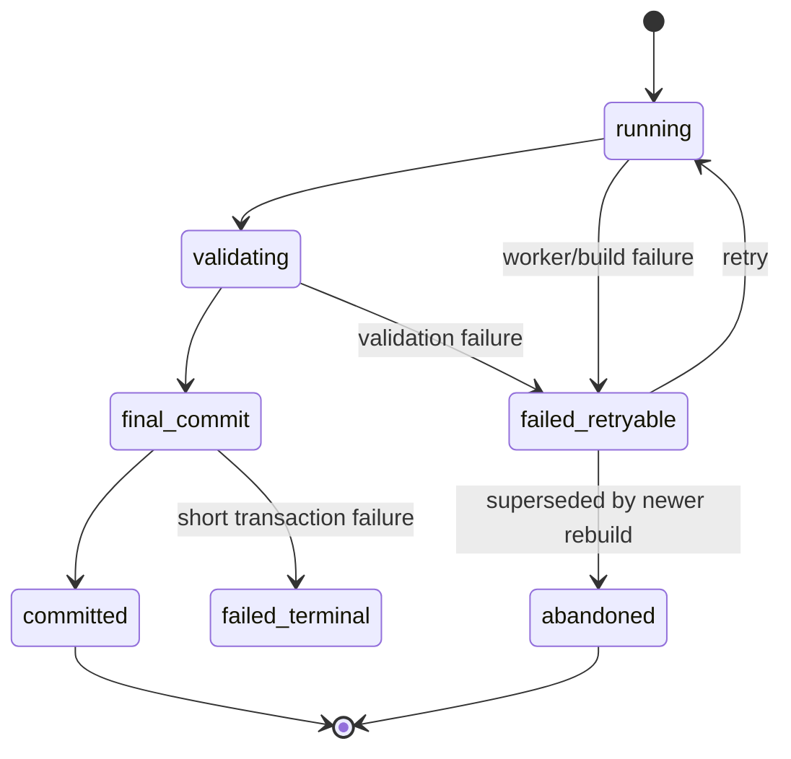
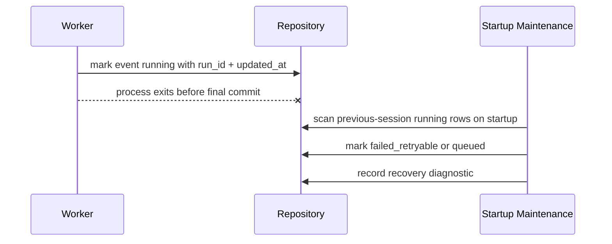
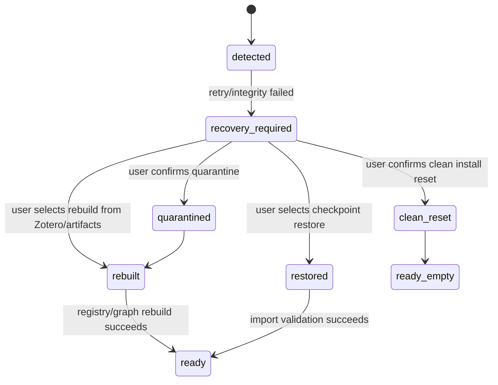

# Synthesis Failure Recovery

本文档定义 Synthesis Layer 的部分失败与恢复合同。它回答：多步骤流程失败时，已经写入的状态是否可见、是否回滚、谁负责恢复、用户看到什么。

机器可读版本见 [recovery.yaml](./schemas/recovery.yaml)。

## 设计目标

- 多步骤流程必须区分 atomic commit、rebuild run、after-commit side effect。
- 失败不得让 UI 看到半完成 rebuild/cache replacement 作为 ready state。
- Zotero/plugin 进程中断后，遗留 running event/job 必须能由 startup maintenance 恢复。
- Topic/workflow apply 的核心 artifact commit 与派生 proposal ingestion 要有明确边界。
- SQLite 运行态损坏必须 fail-closed，进入显式 recover 流程，而不是静默 reset。
- 每个 failed state 必须有 retry、Needs Attention、rollback、abandon 或 manual repair 之一。

## 恢复语义分类

| 类型 | 含义 | 示例 |
| --- | --- | --- |
| `atomic_transaction` | 同一事务内全部成功或全部回滚 | review action materialization |
| `rebuild_run` | 显式 rebuild 在完成前保持旧 committed state 可见；完成时短事务替换相关 cache facts / 推进 epoch | registry/graph cache rebuild |
| `after_commit_effect` | 核心提交完成后的派生动作，失败不回滚核心事实 | concept proposal ingestion |
| `retryable_worker` | 可根据 run marker / attempt 重试 | graph layout、explicit topic source check |
| `needs_attention` | 需要用户处理少量异常 | override target disappeared |
| `source_drift_incident` | 外部 Zotero source 漂移过大或结构异常，禁止增量 fan-out | startup reconcile bulk/structural drift |
| `database_corruption` | SQLite runtime 无法可信读写，需要 quarantine/rebuild/restore/reset | integrity check failed、schema meta mismatch、WAL corruption |

## Registry/Graph Cache Rebuild 失败合同

Registry/graph cache rebuild 不应直接覆盖当前 UI 可见状态。目标流程：

如果在 `preserve durable effects / user overrides` 阶段失败：

- rebuild run 标记为 `failed_retryable` 或 `needs_attention`；
- 临时/中间 rows 不得作为 ready state 暴露；可保留 bounded diagnostics；
- `registry_epoch` / graph basis 不推进；
- Workbench 继续读旧 committed state，并显示 failed rebuild job；
- 用户可以 retry 或进入 Review & Overrides。

## Topic Apply 与 Sidecar Ingestion

Topic apply 需要区分 hard contract 与 after-commit ingestion：

| 步骤 | 失败语义 |
| --- | --- |
| result bundle schema validation | 提交前失败，整个 apply 拒绝 |
| topic artifact core state write | atomic transaction |
| topic interest metadata write | 如果是 hard contract，和 core 同事务 |
| concept proposal ingestion | after-commit effect；失败写 retryable job，不回滚 topic artifact |
| topic graph relation proposal ingestion | after-commit effect；失败写 retryable review/proposal job |
| source manifest baseline update | after-commit effect；失败标记 source-check diagnostic unknown |

## Interrupted Task Recovery

Zotero 插件没有独立 worker 进程。现实中的“worker 崩溃”主要是 Zotero/plugin 进程终止、插件重载、未处理异常导致本轮任务提前退出，或任务被新 epoch/basis supersede。Dirty event/job 被标记 running 后，不需要 heartbeat/lease；需要的是启动时清理上次遗留的 running rows。

恢复策略：

- `attempt_count < max_attempts`：转回 `queued` 或 `failed_retryable`；
- `attempt_count >= max_attempts`：`failed_terminal`，需要用户/debug 介入；
- old epoch/basis：直接 `superseded`；
- 如果旧 async continuation 在新 epoch/basis 后尝试 final commit：stale guard 必须使其 no-op 或拒绝。

## External Source Drift Recovery

Startup reconcile 如果发现 bulk 或 structural Zotero drift，应生成 bounded incident，而不是继续展开增量修复：

| Drift | Recovery |
| --- | --- |
| `bulk` | 保留 committed DB state；显示 drift summary；推荐 explicit registry/graph cache rebuild |
| `structural` | 暂停增量 fan-out；要求 inspect/repair；必要时建议 clean reset 或 full rebuild |

Incident 可见性：

- 普通 UI 显示 severity、counts、examples、recommended commands。
- Debug UI 可显示 bounded raw rows。
- Statusbar/popover 不显示每个漂移 item 的 queued job。
- Topics 不接收 source drift fan-out。

## Database Corruption Recovery

SQLite runtime corruption 必须与普通 reset 分开处理。触发条件包括：

- DB open failed 且 retry 后仍失败；
- `PRAGMA integrity_check` 非 `ok`；
- schema meta 缺失、版本倒退或 migration checksum 不一致；
- WAL/SHM 无法恢复；
- 核心 `synt_*` table 缺失或 foreign-key/invariant 检查大面积失败。

恢复流程：

Recovery-required 状态下：

- Workbench 只能显示 bounded recovery panel 和 diagnostics；
- normal Synthesis workers、startup reconcile fan-out、review action 和 import apply 暂停；
- debug/prefs 可以读取 bounded persistence snapshot；
- 系统不得静默删除、覆盖或导入旧 JSON；
- 如果 DB 部分可读，可 best-effort 导出 durable effects / user overrides。

恢复动作语义：

| Action | 语义 |
| --- | --- |
| `retry_open` | 重试 DB open/integrity，不改变文件 |
| `quarantine` | 保留原 DB 到隔离位置，写 recovery receipt |
| `rebuild_from_zotero_artifacts` | 从 Zotero library 和 artifact notes 重建 Synthesis runtime，并重建 registry/graph |
| `restore_from_checkpoint` | 用户选择 checkpoint/import bundle，经 preview/apply 恢复 |
| `clean_install_reset` | 双重确认后清空 runtime 和 residue，进入 empty state |

Recover 完成后，旧 running jobs 和 dirty events 不得复活。无法证明仍有效的 durable effect 进入 Needs Attention，而不是被静默应用。

## 用户可见失败状态

| 状态 | UI 行为 |
| --- | --- |
| `failed_retryable` | 显示 retry，保留 diagnostics |
| `failed_terminal` | 显示 inspect/debug，不能自动重试 |
| `needs_attention` | 打开 Review & Overrides |
| `incomplete_rebuild` | 不作为 ready snapshot，显示旧 committed state |
| `after_commit_failed` | 核心状态已提交，显示派生任务失败 |
| `recovery_required` | Synthesis 进入只读/暂停 worker 的恢复面板 |

## 当前实现状态

Status: `partial`。Job progress、dirty event、reset 和部分 retry path 已存在；corruption recovery、quarantine/restore UI、interrupted-run cleanup 仍是目标合同。

当前实现已有 job progress、dirty event、reset 和部分 worker retry 形态，但恢复语义仍不完整：

- registry/graph cache rebuild 还没有轻量 epoch/source-hash guard 和 final commit 合同。
- after-commit side effect 的失败边界没有统一文档化。
- interrupted running rows 的 startup maintenance 责任需要实现收口。
- UI 对 incomplete rebuild 与 after-commit failure 的表达还需要补齐。
- SQLite corruption detection、quarantine、restore/rebuild UI 尚未实现。
