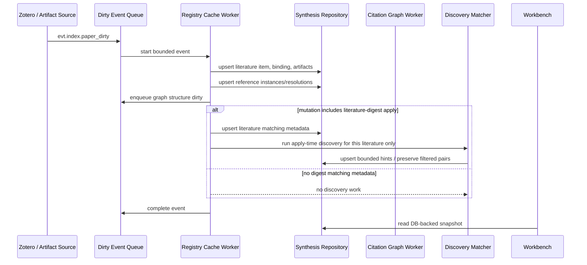
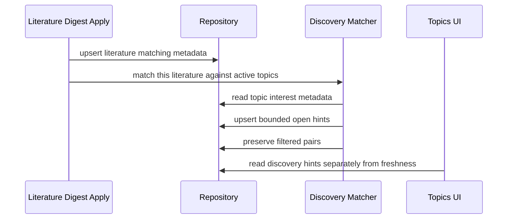
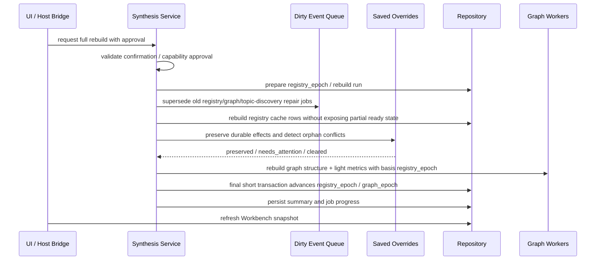
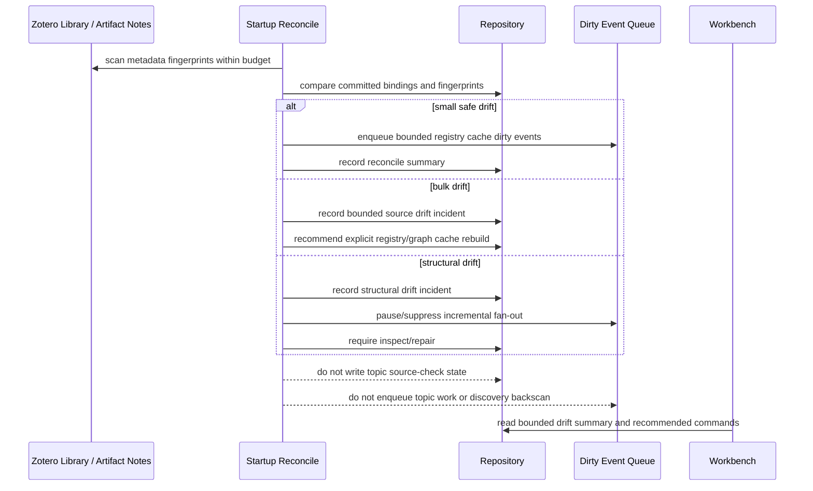
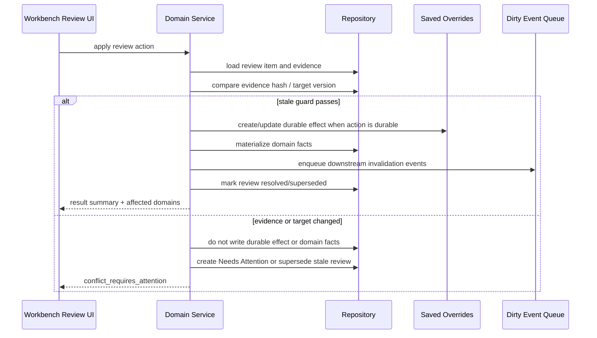
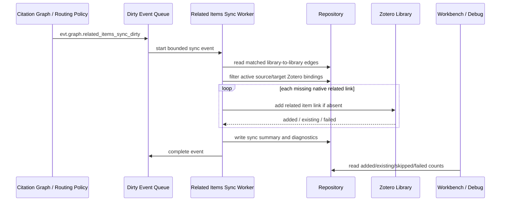
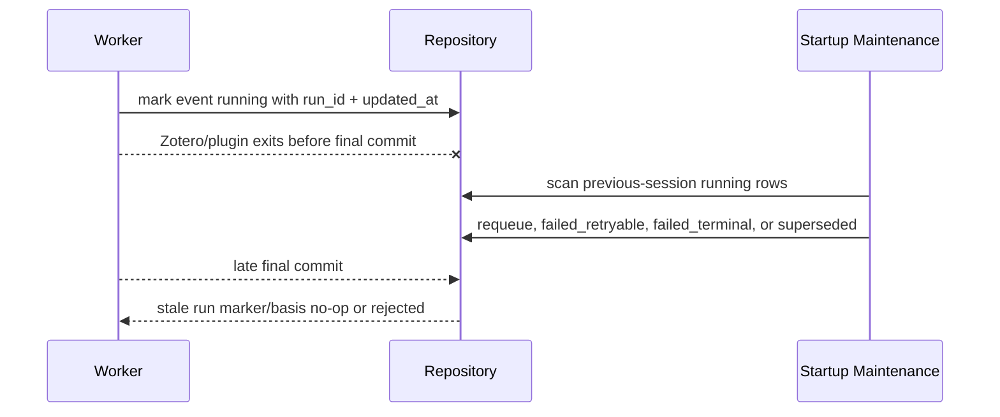
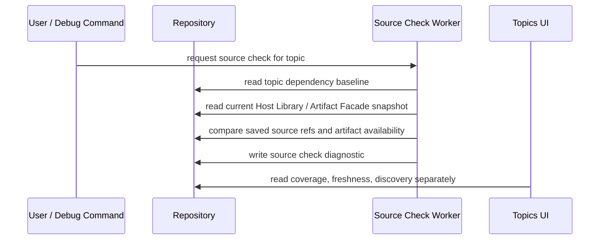
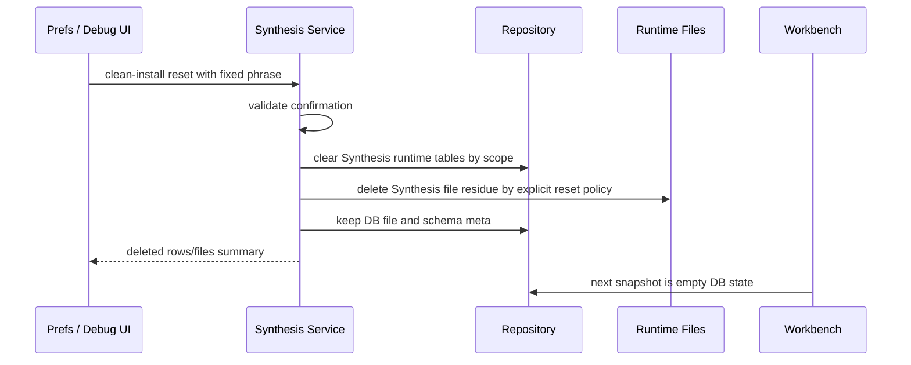
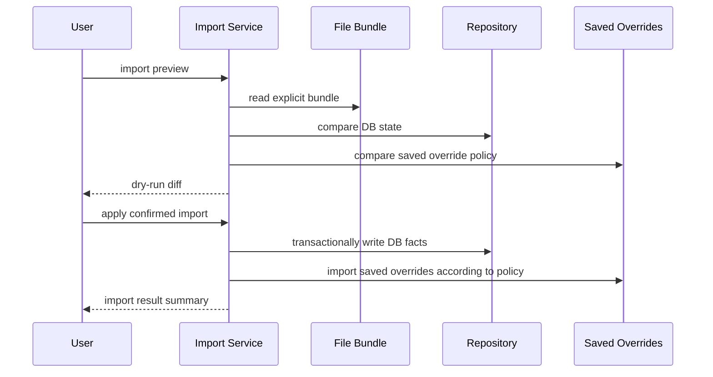

# Synthesis Sequences

本文档定义跨领域流程的 canonical 时序。YAML rebuild 合同见 [rebuild-contracts.yaml](./schemas/rebuild-contracts.yaml)，事件合同见 [events.yaml](./schemas/events.yaml)。

## `seq.index.incremental_item_update`

当前 sequence ID 保留历史 `index` 名称；目标语义是增量 paper registry cache update。新 Zotero 条目或 artifact note 变化进入增量 registry cache。未 materialize 到 registry cache 的条目不得触发 topic freshness；没有 literature-digest apply 的条目也不得触发 discovery。

## `seq.topic.discovery_apply_time_match`

Discovery 是 literature-digest apply 后的单篇 best-effort 匹配，不是全库后台检索。

## `seq.index.full_rebuild`

当前 sequence ID 保留历史 `index` 名称；目标语义是 full registry/graph cache rebuild。它是受保护动作，必须处理旧 epoch/basis、saved override preservation、graph rebuild 和 progress。

## `seq.startup.external_source_reconcile`

Startup reconcile 是 bounded detector。它先分类 Zotero external source drift，再决定是否允许增量入队。

## `seq.review.apply_action`

Review action 必须 materialize domain facts，并产生后续 dirty events，而不是只改 review 状态。

Stale guard 失败时返回 `conflict_requires_attention`，不得继续 materialize 旧 evidence 的 action。Evidence hash 只保护 action moment，不会让 saved override 在 rebuild 后失效。

## `seq.graph.related_items_sync`

Zotero native related items sync 是 Citation Graph 的外部副作用，不是 graph 输入事实。该 worker 只补缺失 link，不删除用户已有 related links。

约束：

- Worker 不得读取 Zotero related items 作为 reference resolution 或 citation graph 输入。
- Worker 不得删除 Zotero native related links。
- Zotero API 写入失败只影响 sync diagnostic/job state，不回滚 graph facts。

## `seq.worker.interrupted_run_recovery`

Zotero/plugin 进程中断后，running event/job 不得永久残留。

## `seq.topic.source_check`

Topic source check 是显式诊断，不由 registry cache dirty events 自动触发，也不把 discovery candidate 当作 stale。

## `seq.reset.clean_install`

Clean-install reset 是危险操作，必须明确是否清 saved overrides 和 file residue。

## `seq.import.preview_apply`

Import 必须 preview-first，不得把文件 bundle 当 Workbench 热路径。

