# Synthesis State Machines

本文档定义 Synthesis Layer 的 canonical 状态机。YAML 版本见 [state-machines.yaml](./schemas/state-machines.yaml)。

## 状态机总览

| Machine ID | 对象 | Owner | 主要风险 |
| --- | --- | --- | --- |
| `sm.identity.literature_item` | Literature item identity | registry cache identity service | merge/delete 后旧 identity 继续污染 graph/review |
| `sm.identity.zotero_binding` | Zotero binding | registry cache identity service | Zotero 外部状态变化覆盖用户确认的 binding decision |
| `sm.reference.resolution` | Reference resolution | reference resolution service | suggested/ignored/confirmed 状态混用导致错误 graph edge |
| `sm.topic.discovery_hint` | Topic discovery hint | topic discovery service | filtered/rejected 语义不清导致候选反复出现 |
| `sm.review.item` | Review item | repository + domain service | 把当前问题实例误当长期 override |
| `sm.override.durable_effect` | Durable effect / user override | domain service | rebuild 静默丢失用户覆盖事实 |
| `sm.queue.dirty_event` | Dirty event | update queue | 旧 epoch/basis 任务污染新 registry cache |
| `sm.job.progress` | Job progress | worker/service | 永久 running/queued 残留 |
| `sm.rebuild.run` | Rebuild run | rebuild service | 失败 rebuild 被 UI 当作 ready |
| `sm.topic.source_check` | Topic source check diagnostic | explicit source check worker | Registry cache event 被误判为 topic source-check changed diagnostic |
| `sm.graph.layout` | Citation graph layout | graph layout worker + UI | layout missing 阻断已有 graph structure |
| `sm.import.lifecycle` | Import run | import/export service | 文件 bundle 未 preview 就写入 DB |
| `sm.external_source.drift_incident` | External source drift incident | startup reconcile / debug scan | bulk/structural drift 被展开成无界增量任务 |

## `sm.identity.literature_item`

Literature item identity 是 Registry Cache / Citation Graph 内部的统一实体状态。它不同于 Zotero binding：一个 literature item 可以是 Zotero-bound，也可以是 external-only；一个 binding merge/delete 不等于立即删除 canonical literature identity。

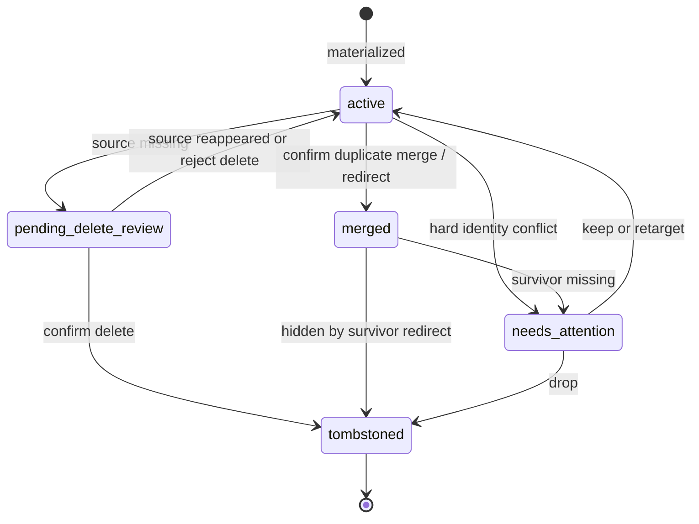

约束：

- `merged` 必须有 survivor / redirect target；graph materialization 必须先解析 redirect，再生成 edge。
- `tombstoned` literature item 不得作为新的 reference resolution target。历史 review/evidence 可以保留为解释性数据。
- Zotero item 重新出现时，不得静默撤销用户确认的 tombstone；只能进入 Needs Attention 或由明确策略恢复。

## `sm.identity.zotero_binding`

Zotero binding 是 `(library_id, item_key)` 与 literature item 的外部事实绑定状态。它表达 Zotero Library 中的 item 是否仍可定位、是否被合并、是否被用户确认删除。

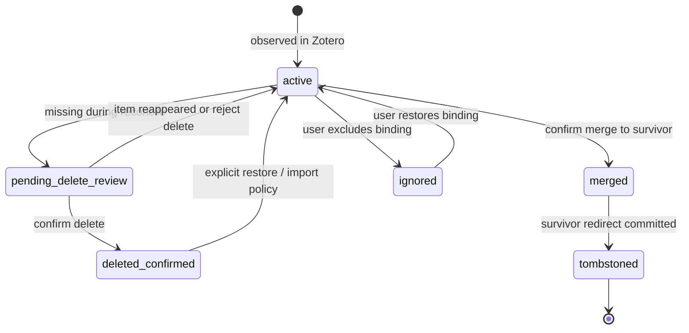

约束：

- `active` binding 才能参与 library-to-library related-items sync。
- `merged/deleted_confirmed/tombstoned` binding 不得被 startup reconcile 直接恢复为 active；需要 explicit restore、import policy 或 Needs Attention。
- Binding 状态改变只影响 Registry Cache / Citation Graph；不得直接推进 topic artifact version/hash。

## `sm.reference.resolution`

Reference resolution 表示某个 `reference_instance` 到 canonical literature item 的解析结果。只有 confirmed 或高置信 auto matched resolution 可以生成 matched citation edge；suggestion 和 ambiguity 不能污染 graph facts。

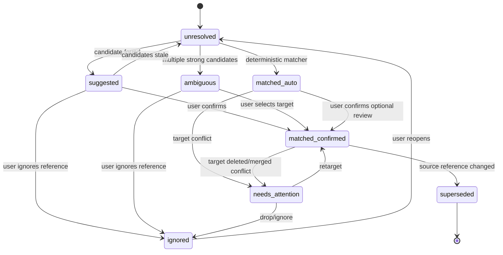

约束：

- `matched_auto` 必须来自 deterministic/high-confidence policy；低置信候选只能进入 `suggested` 或 `ambiguous`。
- `ignored` 是 reference-resolution override，不删除 raw reference instance。
- target literature item 进入 `tombstoned` 或 binding 失效时，confirmed resolution 必须进入 `needs_attention`、`superseded` 或 retarget；不得继续生成 ready graph edge。

## `sm.topic.discovery_hint`

Discovery hint 是 topic-literature pair 的 best-effort 提醒，不是 topic dependency。`filtered` 与 `rejected` 必须区分：

- `filtered` 是长期 suppression override；digest rerun、metadata hash drift、registry rebuild 默认不重新打开。
- `rejected` 是当前候选的一次性否决；同一 pair 可在 explicit repair 或用户清理历史后重新生成。

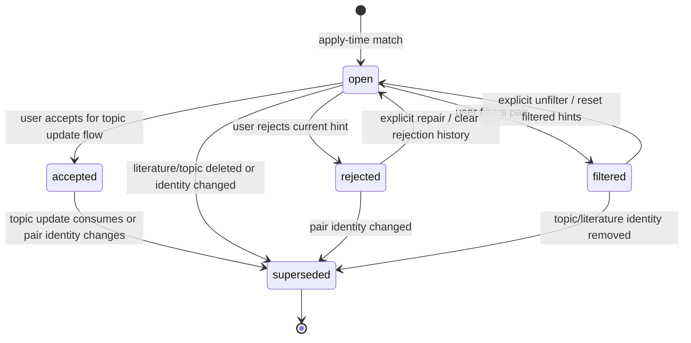

约束：

- `accepted` 不自动改写 topic artifact；它只是 topic update flow 的候选输入。
- `filtered` 是 durable effect / user override，必须进入 Saved Overrides 管理入口。
- Discovery 状态不得写入 topic source check / freshness state。

## `sm.review.item`

Review item 表示“当前发现的问题实例”。它不是长期 user override。

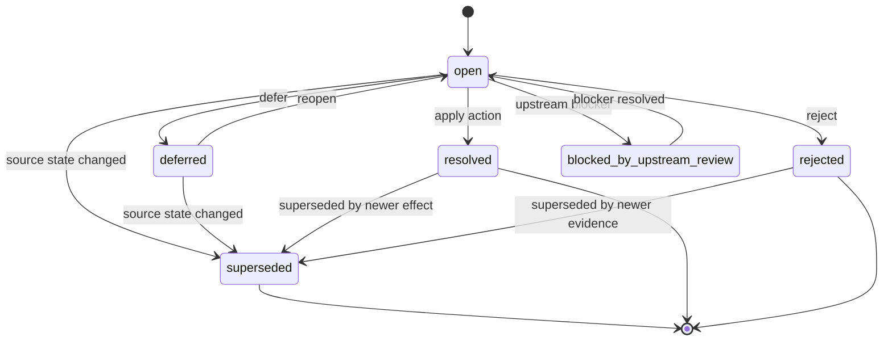

禁止转移：

- `resolved -> open` 不应直接发生；需要创建新 review item 或 Needs Attention item。
- `superseded -> resolved` 不应发生；superseded 表示旧问题实例已失效。

## `sm.override.durable_effect`

Durable effect / user override 是用户或系统确认后 materialize 的领域事实。它不需要审计式重放；rebuild 应保留它，并只在 orphan 或 hard conflict 时提示用户。

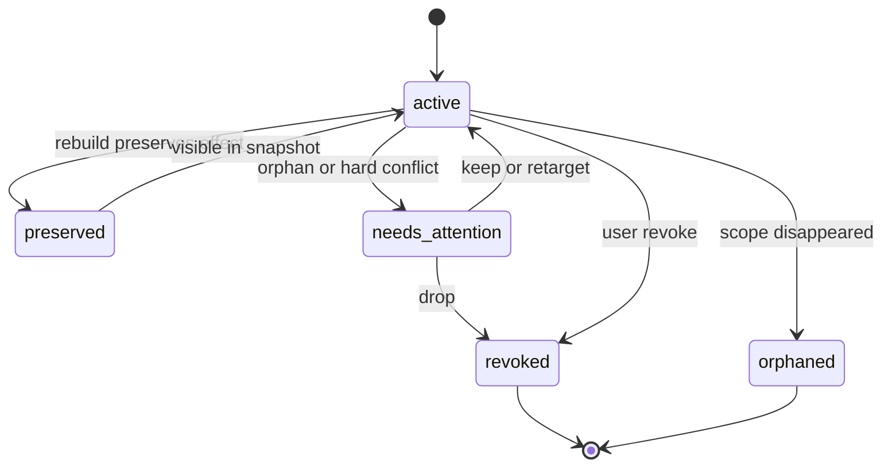

禁止转移：

- `active -> deleted` 不存在；即使 reset 清除 override，也必须由 reset contract 显式声明。
- 普通 evidence hash / digest metadata 变化不得触发 `needs_attention`。

## `sm.queue.dirty_event`

Dirty event 是 worker 消费的运行态任务单元，必须能被 epoch/basis/scope 失效。

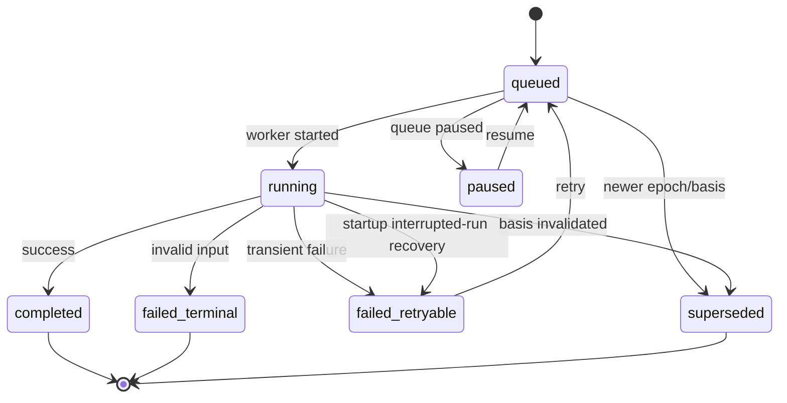

禁止转移：

- `completed -> queued` 不允许；需要创建新 event。
- 旧 epoch/basis 的 `running` 不得长期保留为 UI active job。
- `running` 必须有当前 run marker；Zotero/plugin 重启后由 startup maintenance 转成 `failed_retryable`、`queued` 或 `superseded`。

## `sm.job.progress`

Job progress 是用户可见任务状态。它可以滞后于 dirty event，但不能伪造百分比。

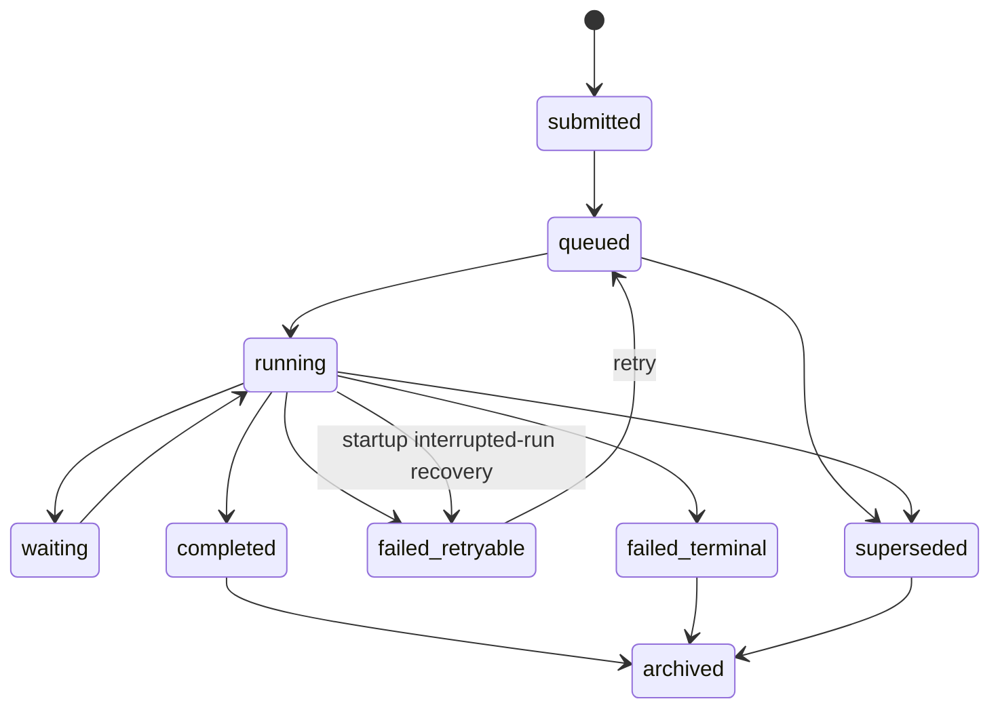

进度模式：

- `determinate`：必须有真实 `current/total`。
- `phase`：必须有固定 phase 列表和当前 phase。
- `indeterminate`：不得显示百分比。
- 上次会话遗留的 `running` 不得继续显示为 active running；必须由 startup maintenance 进入恢复路径。

## `sm.rebuild.run`

Rebuild run 是 full rebuild 的受保护执行边界。它不要求独立 staged generation 架构；rebuild 完成前，Workbench 继续读取旧 committed state，只有 final short transaction 成功后才替换相关 cache facts / 推进 epoch。

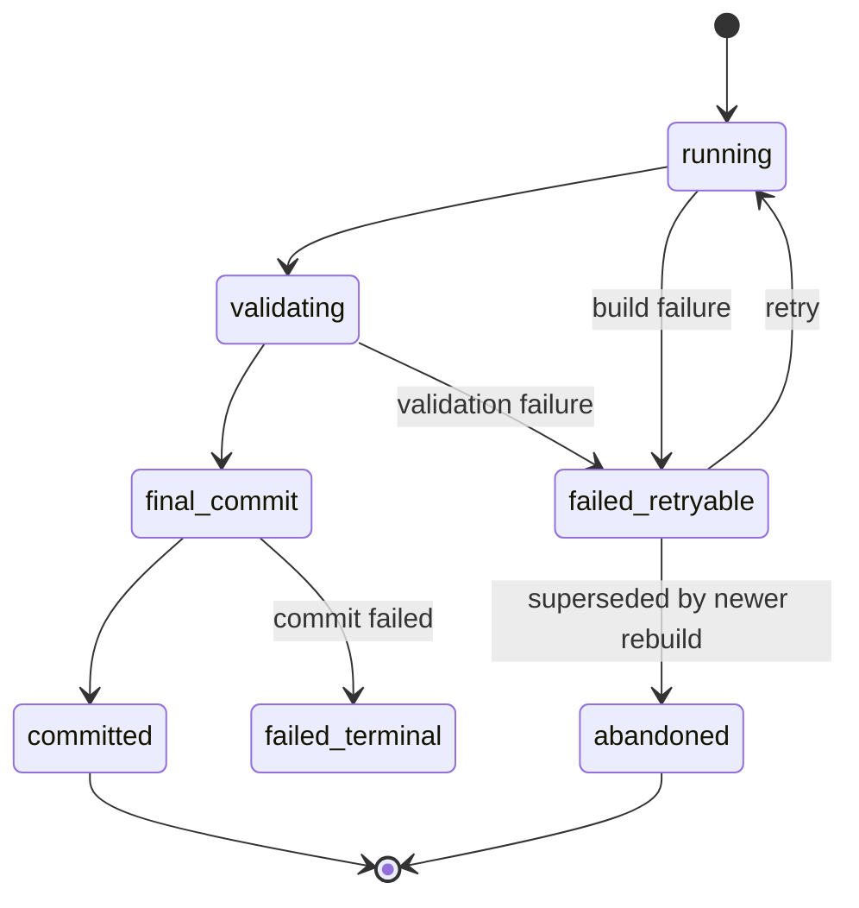

禁止转移：

- `running -> committed` 不允许跳过 validation/final commit。
- `failed_retryable -> committed` 不允许；必须 retry 并重新进入 running/validation。
- `failed_terminal -> committed` 不允许；需要 manual repair 或新 rebuild。

## `sm.topic.source_check`

Topic source check 描述显式检查时保存的 topic source manifest 是否与当前 Host Library / Artifact Facade 输出存在差异。它不由 registry cache dirty events 自动触发，也不表达 discovery candidate。

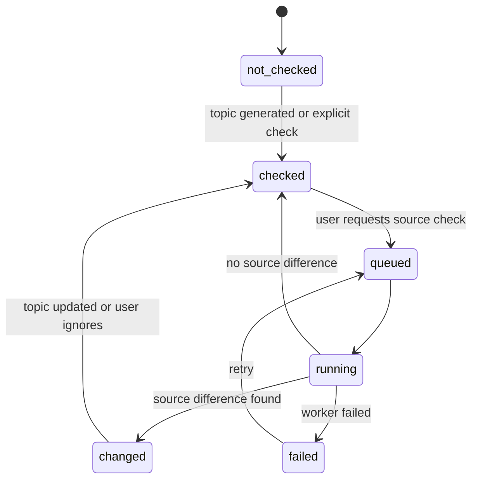

禁止转移：

- `checked -> changed` 不能由 registry cache dirty event、startup reconcile 或 registry/graph cache rebuild 直接触发。
- `discovery candidates` 不能写入 source check state。

## `sm.graph.layout`

Citation graph layout 是 UI 派生状态。Graph structure 存在时，layout 缺失不应阻断 graph 可视化。

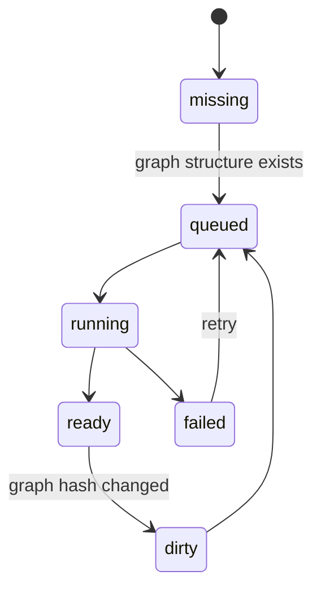

UI 规则：

- `missing/queued/running` 且 graph structure 非空时，显示 drawing/refreshing。
- `ready` 但 graph hash stale 时，可以先用旧 layout，再异步刷新。
- 只有 graph structure 为空时，才提示需要构建 graph。

## `sm.import.lifecycle`

Import run 是显式文件边界，必须 preview-first。任何导入都不能把文件 bundle 当作 Workbench 热路径，也不能跳过用户确认直接写 DB。

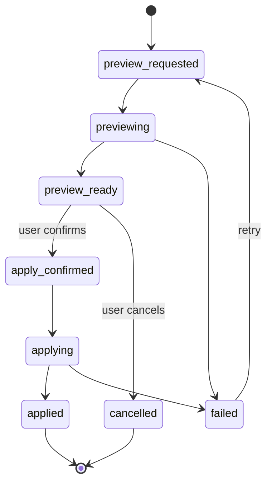

约束：

- `apply_confirmed` 必须基于当前 preview diff；preview 过期后需要重新 preview。
- Import apply 写入 DB facts 和 saved overrides 时必须遵循 import policy；不得 silent overwrite。
- 失败的 import 不得留下半可见 Workbench snapshot；要么事务回滚，要么以 explicit diagnostic 暴露部分失败。

## `sm.external_source.drift_incident`

Drift incident 描述 Zotero Library / Artifact Notes 与 committed DB facts 的外部 source drift。它不是 per-item dirty event 的替代品；bulk/structural drift 必须聚合处理。

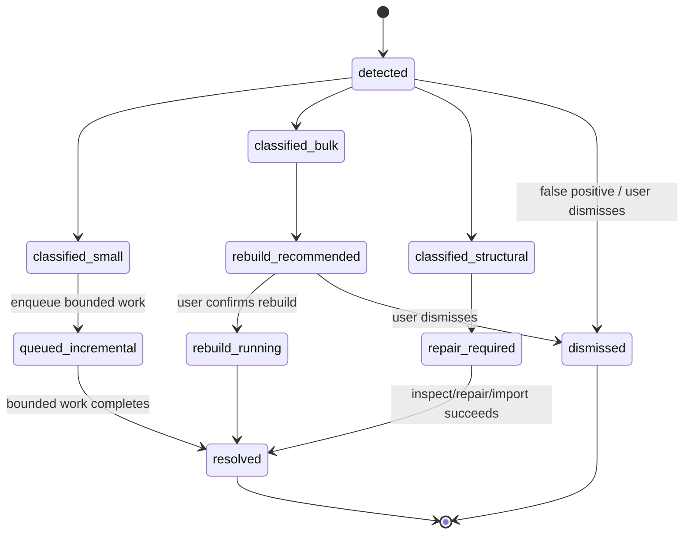

约束：

- `classified_bulk` 和 `classified_structural` 不得展开为无界 dirty events、review items、graph jobs 或 topic work。
- Structural drift 必须 fail closed：暂停相关 incremental fan-out，要求 inspect/repair。
- Topics 只在显式 source check/update 中观察 drift 后果；startup reconcile 不写 topic source-check state。

## 正交状态机组合规则

State Catalog 中的状态族是正交状态机，不是一个对象上的单一枚举。实现和 UI 不能把所有状态笛卡尔积展开成临时组合态，而应按 owner 解释：

| 状态族 | Owner | 组合规则 |
| --- | --- | --- |
| identity/binding | Registry Cache identity service | 优先级最高；terminal 或 redirect 状态会使下游 resolution/graph 进入 retarget、supersede 或 Needs Attention |
| reference resolution | Reference Resolution service | 只能引用 active canonical target；target 失效时不得继续生成 ready edge |
| discovery | Topic Discovery service | 只影响 hint/review，不改变 topic source check 或 topic artifact |
| review | Review service | 当前问题实例；不能替代 durable effect 状态 |
| override | Domain service | 长期 user override；rebuild 默认保留，除非 orphan/hard conflict |
| queue/job | Worker/service | 执行态；不得成为 domain truth |
| epoch/basis | Rebuild/worker service | stale guard；不得作为 topic/index 重新耦合通道 |

典型冲突处理：

- `reference_resolution=matched_confirmed` 但 target `literature_item=tombstoned`：resolution 进入 `needs_attention` 或 `superseded`，graph edge 不可 ready。
- `discovery_hint=filtered` 且 digest apply 重新命中：保留 `filtered`，只更新 bounded diagnostics，不重新打开 `open`。
- `review_item=open` 但同 scope P0 identity action 已提交：旧 review 进入 `superseded` 或 `blocked_by_upstream_review`。
- `job=running` 但 epoch/basis 已旧：job/event 进入 `superseded`，UI active jobs 不展示。
