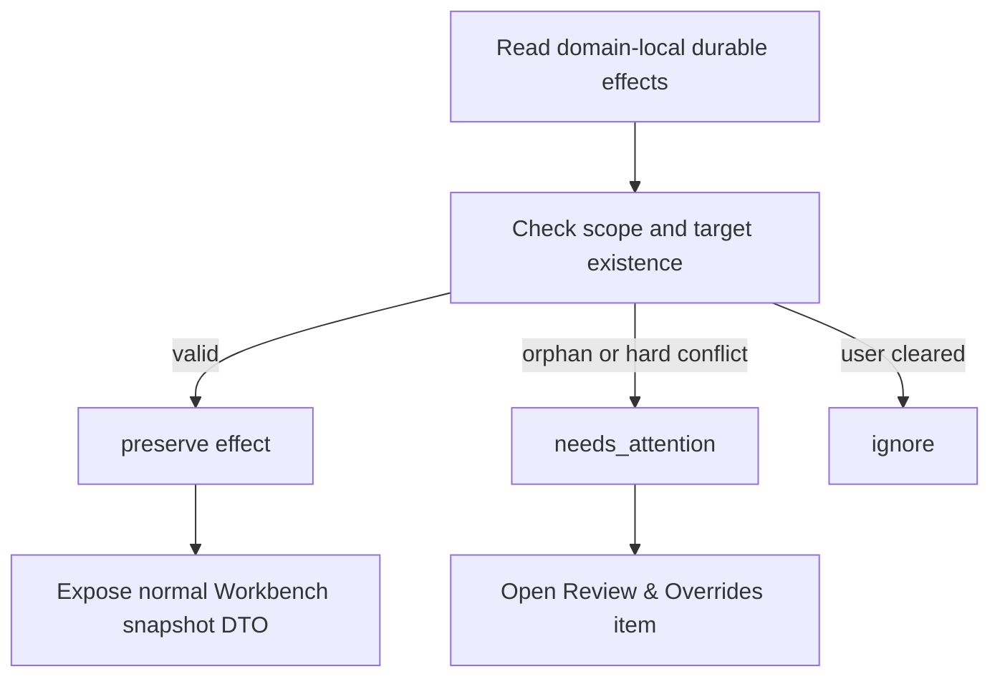

# Synthesis Rebuild Contracts

本文档定义 Synthesis Layer 中重建、重算、reset、import/export 的合同。它回答：哪些操作需要确认、是否清理队列、是否推进 epoch/basis、是否影响 graph/topic/discovery，以及如何报告进度。

## 设计目标

- Full rebuild 必须是可解释的受保护动作，不是普通按钮或隐式 fallback。
- Rebuild 开始前必须处理旧 queue/job，避免旧 registry/cache 相关任务污染新状态。
- Rebuild 输出必须进入对应领域的 SSOT 或派生 runtime state。
- Rebuild 进度必须真实：有 item count 就按 item，只有 phase 就按固定 phase。Batch/time budget 见 [Performance and Scale Model](./performance-scale-model.md)。
- Rebuild 不得覆盖用户确认过的 durable effects / user overrides，除非用户明确选择 reset/clean install；它只应在 orphan 或 hard conflict 时提示 Needs Attention。
- Import/export/checkpoint 是显式文件边界，不是 Workbench 运行态。

## 现有实现状态

Status: `partial`。Registry/cache rebuild、worker progress 和 reset 已有实现基础；确认保护、epoch/basis guard、旧任务清理和 durable effects 保留仍是未完成 gate。

当前实现状态：

- `runLiteratureRegistryJobNow` 已有 phase-level progress，并会重建 registry cache 和 citation graph state。
- Paper incremental worker、citation graph workers、transitional topic freshness/source-check worker 已有 batch/time budget。
- Clean-install reset 已能清 Synthesis DB runtime state，并删除 data/runtime Synthesis file residues。
- Workbench graph layout 已分离为 UI-driven layout worker。
- 当前缺口：
  - Registry/graph cache rebuild 缺少弹窗保护合同。
  - Registry/graph cache rebuild 没有统一 `registry_epoch`，citation graph 也尚未以 `basis_registry_epoch` 或 graph input hash 约束提交。
  - Rebuild 开始时没有统一终止/清理旧 dirty events/jobs。
  - Startup reconcile 对 bulk/structural Zotero drift 的 fail-closed 合同尚未完整实现。
  - Topic freshness 对 registry cache rebuild 后的影响还没有彻底从实现中移除；目标合同是显式 source check。
  - Review item 与 durable effect / user override 的边界仍需收口；saved overrides 管理入口和 orphan/hard conflict 处理仍需实现。
  - Topic artifact state 仍有 transitional file-backed helper。

## Rebuild 类型矩阵

| 操作 | 触发 | 确认 | 旧任务处理 | Epoch / basis | 下游影响 | 进度 |
| --- | --- | --- | --- | --- | --- | --- |
| Paper incremental update | source dirty event | 否 | 只消费同 scope event | 不变 | graph scoped dirty | item count |
| Full registry/graph cache rebuild | explicit command | 是 | 清理/supersede registry/graph/topic-discovery repair 旧 events | 推进 `registry_epoch`；旧 graph basis stale | full graph rebuild；不规划 topic work；不做 discovery full backscan；不推进 topic artifact version/hash | item count + phase；分 tick 写入 |
| External source drift rebuild | startup bulk/structural drift incident -> explicit command | 是 | 不展开旧 drift incident 的 per-item work；清理相关 registry/graph queue | 推进 `registry_epoch` | full graph rebuild；preserve committed state until final commit | item count + phase；分 tick 写入 |
| Citation graph structure rebuild | graph dirty or explicit | 通常否 | 清 graph structure/layout stale jobs | 推进 `graph_epoch`，必须记录 `basis_registry_epoch` 或 input hash | complex metrics/layout stale；不驱动 topic source check；不推进 topic artifact version/hash | edge/node count；默认 1000 reference instances / 2000 ms |
| Complex metrics rebuild | graph changed or explicit | 否 | 清旧 metrics jobs | graph epoch scoped | metrics rows | phase/time |
| Layout rebuild | Graph UI or explicit | 否 | 清同 preset stale layout job | layout key scoped | layout state only | node count or phase |
| Topic source check | explicit user/debug/maintenance action | 否 | 清同 topic source-check job | topic state scoped | source manifest diagnostic / coverage check | topic count 或 saved source count |
| Topic discovery apply-time match | literature-digest apply | 否 | 合并同 literature 未完成匹配 | literature scope；不依赖 registry epoch 做全量回扫 | 该 literature 的 best-effort hints | active topic count |
| Topic discovery repair | explicit debug/maintenance | 否 | 清同 bounded repair job | repair run scoped | bounded hints repair | bounded topic * literature count |
| Topic artifact rebuild/update | workflow apply | workflow confirmation by run | supersede old topic apply conflicts | topic artifact version/hash | topic graph/concepts/freshness baseline；不依赖 registry epoch | workflow progress |
| Synthesis DB reset | prefs/debug protected action | 双重确认 | 清 Synthesis queue/job | reset epoch | empty runtime | table counts |
| Clean-install reset | debug protected action | 固定短语 | 清全部 Synthesis runtime/file residue | reset epoch | empty runtime | table counts |
| Checkpoint export | explicit command | 可选 | 不影响 queue | none | file output | file count |
| JSON import | explicit dry-run/apply | apply 确认 | import scope events | import run id | DB facts | file/row count |

## Full Registry/Graph Cache Rebuild 合同

目标行为：

1. UI/Host Bridge/CLI 触发 registry/graph cache rebuild 前必须显示确认，说明：
   - 将重建 Synthesis paper registry cache；
   - 将清理旧 registry/graph/topic-discovery repair 队列；
   - 将重算 citation graph；
   - 不会自动使 topic source check/freshness 重新评估，也不会自动全量重算 discovery。
2. 后端再次校验确认来源或 capability approval。
3. 创建或读取当前 rebuild run，并准备新的 `registry_epoch`（当前实现可继续映射到历史 `index_generation` 字段名）。
4. Supersede 或 clear 旧 epoch/basis 的：
   - paper registry dirty events；
   - citation graph structure/metrics/layout jobs；
   - topic source-check jobs whose basis was old explicit check run；
   - topic discovery repair events whose basis was old registry cache。
5. Rebuild paper registry cache from Zotero + artifact notes into DB.
6. Rebuild citation graph structure and lightweight metrics into a new `graph_epoch` whose `basis_registry_epoch` or input hash matches the new registry epoch.
7. Mark complex metrics/layout stale, not inline compute everything unless explicitly requested.
8. Do not plan topic work from the rebuild:
   - unchanged paper set/artifact hashes: no topic action；
   - changed known dependencies: reported only by future explicit source check；
   - new candidate literature: no automatic discovery until literature-digest apply；
   - deleted/merged dependencies: handled by Registry/Graph review first, then surfaced to topic only through explicit source check/update。
9. Preserve durable effects / user overrides:
   - delete/merge/reference/discovery/topic/concept overrides whose scope and target still exist remain materialized；
   - overrides whose target or scope disappeared enter `needs_attention`；
   - revoked/cleared overrides are not applied。
10. Do not advance topic artifact version/hash; existing complete/fresh topics remain unchanged unless user runs explicit topic source check/update.
11. Report progress with item count when source size is known.

当前实现只完成其中一部分：registry cache rebuild 能运行并有 phase progress，但 epoch/basis guard、确认、旧任务清理、graph `basis_registry_epoch` 校验、saved overrides 管理和 Needs Attention summary 仍待实现；旧 topic impact planning 思路应替换为显式 source check，registry/graph rebuild 只通过薄 event routing policy 产生 registry/graph 范围内的 invalidation。

## External Source Drift 合同

Startup reconcile 面对 Zotero 外部事实源漂移时，应先分类再决定是否入队：

| Drift | 示例 | 行为 |
| --- | --- | --- |
| `small` | changed/deleted/updated items <= 50 且 <= 5% active library，payload decode failure ratio < 2%，扫描在预算内 | 可生成 bounded registry cache dirty events |
| `bulk` | changed/deleted/updated items > 50 或 > 5%，批量 duplicate merge/delete/update，扫描超过 soft budget 但没有结构异常 | 记录 source drift incident，推荐 explicit registry/graph cache rebuild，不逐条 fan-out |
| `structural` | binding impossible collision、item/note parent 异常、decode failure ratio >= 2%、fingerprint scan hard timeout、Zotero API/DB 不一致 | fail-closed，暂停增量处理，要求 inspect/repair |

Bulk/structural drift 期间：

- 不生成无界 per-item deletion review；
- 不生成无界 graph structure jobs；
- 不生成 topic source-check / freshness diagnostic / discovery work；
- 不让 statusbar/popover 永久显示大量 queued jobs；
- Workbench 只显示 bounded incident summary 和 recommended commands；
- committed Synthesis DB state 在 explicit rebuild final commit 前保持可读。

## Durable Effects 保留合同

Rebuild 的用户修正处理应明确区分“历史 review item”与“仍然有效的 durable effect / user override”。Full rebuild 不应把所有 resolved review 简单丢弃，也不应建立复杂审计式重放机制；它应保留领域事实本身。

| Outcome | 含义 | UI 表达 |
| --- | --- | --- |
| `preserved` | domain-local durable effect 仍有效 | Rebuild summary 计数，可展开 |
| `needs_attention` | scope/target 消失或 hard conflict | Review & Overrides 的低频异常队列 |
| `cleared` | 用户已撤销/清除 override | 不再影响 rebuild |
| `ignored_out_of_scope` | 当前 rebuild scope 不涉及 | 不提示用户 |

Reset 规则：

- Normal registry/graph cache rebuild 不清 durable effects / user overrides。
- Synthesis DB reset 若清空 user overrides，UI 必须在确认文案中明确说明。
- Clean-install reset 清空 Synthesis runtime/file residue，不自动从 legacy JSON 恢复 overrides。
- 未来 override export/import 必须先 dry-run preview，再由用户确认 apply。

## Incremental Update 合同

目标行为：

- 只处理 bounded paper/Zotero/artifact scope。
- 对新 paper：
  - 写 registry cache；
  - 如果本次事件来自 literature-digest apply 且有 matching metadata，对该单篇 literature 执行 apply-time discovery matching；
  - 不直接让所有 existing topics stale。
- 对已有 dependent paper artifact 变化：
  - 更新 registry cache；
  - graph structure dirty；
  - 不生成 topic source-check / freshness diagnostic dirty。
- 对 deleted/merged paper：
  - 打开或执行 P0 review；
  - retarget/supersede dependent reviews；
  - 不自动改写或标记 topic；topic 侧差异由显式 source check 发现。

当前实现已经处理常见 paper dirty event；deleted/merged 不应自动传播为 topic impact，topic 侧差异应由显式 source check/update 处理。

## Citation Graph Rebuild 合同

- Structure rebuild 是 registry cache 派生，不读取 topic metadata。
- Light metrics 跟随 structure 同步更新。
- Complex metrics 可以异步滞后。
- Layout 是 UI-driven，不由 MCP/普通 snapshot 隐式计算。
- Graph hash 改变不应自动改变 topic source-check state；当前实现的 baseline 仍可能包含 graph hash，因此后续需把该行为收敛为显式 check diagnostic。

## Topic Source Check 合同

- Source check 只重算诊断，不改写 topic artifact 正文。
- Coverage 只描述 saved dependencies 的 artifact 完整度。
- Discovery candidate 不等于 topic dependency。
- 新文献进入 registry cache 不触发 discovery，也不直接写 topic source-check changed diagnostic；literature-digest apply 后才生成 best-effort candidates。
- 已保存依赖 artifact hash 变化、缺失、可用性变化只在显式 source check 或 topic update 中影响诊断。
- Registry/graph cache rebuild 不触发 topic source check 或全量 discovery；需要修复 discovery hints 时必须走显式 debug/maintenance repair。

## Reset 合同

| Reset | 范围 | 保留 | 删除 |
| --- | --- | --- | --- |
| Synthesis DB reset | Synthesis `synt_*` runtime tables | DB file、schema meta、非 Synthesis state、file exports | Synthesis runtime rows |
| Clean-install reset | Synthesis runtime + Synthesis file residue | 非 Synthesis state | Synthesis runtime rows、data/runtime Synthesis file roots |
| Import apply reset | import scope | unrelated state | 由 import policy 决定 |

Reset 不是 migration。Reset 后不得自动从 legacy JSON 导入。

## Import / Export / Checkpoint 合同

- Export/checkpoint 从 DB 渲染 file bundle。
- Import 必须显式 dry-run/apply。
- File bundle 不参与 Workbench 热路径。
- Git Sync/mirror 只能使用显式 bundle 或 DB-rendered temporary bundle，不应复制 `data/synthesis` 作为运行态事实。

## 验收清单

实现任何 rebuild/reset/import 相关 change 前，应检查：

1. 是否需要用户确认或 fixed confirmation phrase？
2. 是否创建或校验 epoch/basis？
3. 是否清理旧 dirty events/job progress？
4. 是否保留 durable effects / user overrides，并只在 orphan/hard conflict 时提示 Needs Attention？
5. 是否只写对应领域的 SSOT？
6. 是否报告真实 progress？
7. 是否避免 read path 副作用？
8. 是否更新 [Event 与 Impact 合同](./event-and-impact-contract.md)？
