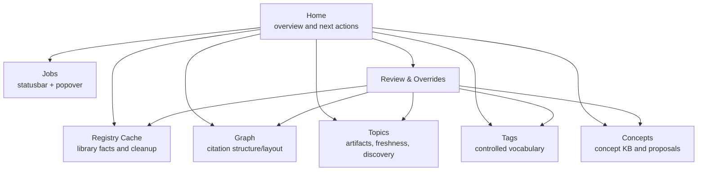

# Synthesis Workbench UI Governance

本文档定义 Synthesis Workbench 的 UI 行为治理。它补充 domain/state/rebuild 文档，明确用户在界面中应该如何理解状态、任务、review、saved override、rebuild 和 debug 信息。

## 设计目标

- **UI 是状态解释层，不是状态来源**：Workbench 只解释 DB-backed snapshot DTO，不读取 legacy files，不触发隐式 migration/rebuild。
- **状态可解释**：每个 empty、stale、dirty、queued、running、failed、review-blocked 状态都应说明来源、影响和下一步动作。
- **动作可预期**：危险动作必须确认；长任务必须显示真实 progress；review action 必须说明会改变哪些领域事实。
- **候选与事实分离**：discovery candidate、suggested match、review proposal 不等于已纳入 topic/registry/graph 的事实。
- **局部工作流与全局治理并存**：各 tab 可以显示局部 review card，但必须有统一 Review & Overrides 入口。
- **Debug 不污染正式 UI**：debug-only 能力可以暴露深层诊断，但普通用户 UI 只展示可操作摘要。

## 现有实现状态

Status: `partial`。Workbench 主要页面、Graph、statusbar/popover 和局部 review cards 已有实现；统一 Review & Overrides、source-check/discovery 管理和部分危险动作 UX 仍待落地。

当前 Workbench 已经有较丰富的 tab 和局部 review UI：

- `src/modules/synthesis/uiModel.ts`
  - 规范化 Home、Topics、Registry/Index、Graph、Tags、Concepts、background jobs 等 snapshot DTO。
- `src/synthesisWorkbenchApp.ts`
  - 渲染 statusbar/job popover、Graph、Topics、Registry/Index/Cleanup、Tags、Concepts、Topic Graph 等界面。
  - 已有局部 review card：Cleanup/Registry review、Topic Graph relation review、Concept review、Tag import preview、Sync review。
- `addon/content/synthesis/styles.css`
  - 已有 review card、statusbar、popover、graph 等样式。

当前缺口：

- 没有统一 Review & Overrides 入口。
- UI 行为合同没有独立文档，状态解释散落在实现中。
- Registry/graph cache rebuild、reset、import 等高影响动作的确认模型还不完整。
- Saved overrides、orphan overrides、Needs Attention 没有用户可见入口。
- 各 tab 的 empty/stale/dirty/discovery 文案和动作还没有统一状态语义表。

## 信息架构

目标 Workbench 应保持领域分区，同时提供横切治理入口。

### 必备主入口

| 入口 | 主要问题 | 不应承担 |
| --- | --- | --- |
| Home | 当前系统健康、下一步动作、重要 blockers | 深层调试表格 |
| Registry/Index | Zotero-bound literature、artifact readiness、identity/binding cleanup | Topic discovery 管理；成为全域事实源 |
| Graph | 库内互引、共享外部引用、layout 状态 | reference matching 审阅主入口 |
| Topics | topic artifacts、source check diagnostics、coverage、discovery candidates | Registry cache rebuild 控制台 |
| Tags | tag vocabulary、validation、import preview | Topic artifact 正文编辑 |
| Concepts | concept KB、proposal/review、topic overlay | Citation graph 结构修改 |
| Jobs | active/queued/running/failed tasks | 历史审计主入口 |
| Review & Overrides | open reviews、saved overrides、needs attention、recent actions | 普通内容浏览 |
| Debug | bounded diagnostics、worker run、diff | 正式用户 workflow |

## 状态表达规则

| 状态 | UI 表达 | 主动作 | 禁止行为 |
| --- | --- | --- | --- |
| Empty DB | “No Synthesis data yet” | Rebuild/Import explicit action | 从 legacy JSON 自动填充 |
| Ready | 简洁摘要 | 可选 refresh/export | 制造无意义 warning |
| Missing artifact | coverage warning | run digest / complete artifact | 把 topic 直接标为 stale |
| Source check changed | explicit check found source differences | update topic / ignore for now | 自动改写 topic artifact；把 registry cache rebuild 当作 stale 触发 |
| Discovery candidates | literature-digest apply-time best-effort hints | review candidates | 暗示 topic 已过时或候选集合完整 |
| Queued job | queued with source/scope | wait/pause/retry | 永久显示无来源 queue |
| Running job | progress or indeterminate | view jobs | 伪造百分比 |
| Failed retryable | error + retry | retry / inspect | 隐藏 diagnostics |
| External source drift | bounded Zotero drift summary | inspect / rebuild registry cache | 展开成大量 queued jobs 或 topic source-check changed diagnostic |
| Review blocked | upstream review/override needed | open review center | 在局部卡片里无解释禁用 |
| Needs attention | saved override orphaned or hard-conflicted | keep/drop/retarget/reopen | 用普通 evidence hash 变化打扰用户 |
| Debug-only state | hidden by default | enable debug tools | 暴露给普通 UI |

## Review & Overrides UI 合同

Workbench 必须提供统一入口管理 open reviews 和 saved overrides。

### Open Reviews

- 默认按 priority、domain、updated time 排序。
- 每个 review 显示 source、target、reason、confidence、scope、blocking status。
- Action label 必须描述真实效果，例如 `Confirm delete`、`Merge into target`、`Ignore reference`、`Accept candidate`。
- 不使用泛化 `Approve` 掩盖领域后果。

### Saved Overrides

- 展示 active durable effects / user overrides。
- 显示它们属于哪个 domain fact，例如 redirect、tombstone、filtered hint、ignored reference。
- 提供 revoke、clear orphan、retarget、reopen review。

### Recent Actions

- 展示短期 action receipt，用于解释用户刚刚做了什么。
- 不作为长期审计历史。

### Needs Attention

- 仅当 saved override 的 scope/target 消失或出现 hard conflict 时集中提示。
- 用户可以 keep、drop、retarget 或打开新 review。

## Rebuild / Reset / Import UI

### Registry/Graph Cache Rebuild

触发前必须显示确认，至少说明：

- 将重建 Paper Registry Cache 和 Citation Graph。
- 将清理旧 epoch/basis 的 queued/running Synthesis jobs。
- 已保存 overrides 会保留。
- orphan 或 hard-conflicted overrides 可能进入 Needs Attention。
- Topic source check 不会因 registry cache rebuild 自动运行；Discovery 不做 full backscan，只保留已有 hints 和之后 digest apply-time 产生的新 hints。

运行中必须显示：

- phase；
- current/total，如果可计算；
- active epoch/basis；
- 已完成/失败/跳过数量。

完成后必须显示：

- registry cache row count；
- graph node/edge count；
- open review count；
- preserved override count；
- needs-attention count；
- recommended next actions。

### Reset

- Synthesis DB reset 与 clean-install reset 必须明确范围。
- 危险 reset 需要双重确认。
- UI 必须说明是否删除 saved overrides。

### Import / Export

- Import 必须 preview-first。
- Preview 应显示将新增/覆盖/保留/冲突的 state 和 saved overrides。
- Export/checkpoint 应说明是否包含 saved overrides；不要求包含完整审计历史。

## Graph UI 行为

- 库内文献必须全量展示。
- 入度大于 1 的外部文献默认展示。
- 入度等于 1 的外部文献默认 hover-only。
- Layout missing/running 时，如果 graph structure 存在，应显示 drawing/refreshing，而不是要求 rebuild graph。
- Search 命中 hover-only external 时可以临时显示。
- Graph layout 状态不应改变 topic source-check / freshness diagnostic。

## Topic UI 行为

- Coverage、freshness、discovery 必须分开显示。
- `coverage != complete` 表示 saved dependencies artifact 不完整。
- `source_check == changed` 或 transitional `freshness == stale` 表示最近一次显式 source check 发现 source manifest 差异，不表示后台持续监控发现了变化。
- `discovery_status == candidates` 表示已有 best-effort 候选文献，不表示 topic 已过时，也不表示系统已经完整扫描过全库。
- Accept discovery candidate 不应后台直接改 topic artifact；应进入显式 topic update flow。
- Filter discovery candidate 是用户 override；digest 重跑、metadata hash 微变和 registry cache rebuild 不应把同一 topic-literature pair 自动重新打开。
- Registry cache rebuild、startup reconcile、registry dirty events 不应在 Topics UI 里制造 stale/dirty/queued 状态；用户需要时通过 `Check sources` 或 `Update topic` 显式动作检查。

## Jobs UI 行为

- Statusbar 展示最重要 active job。
- Popover 展示 bounded active/recent job rows。
- Backend job progress 优先于 frontend local in-flight action。
- 无真实 `current/total` 时显示 indeterminate。
- Completed/failed transient toast 可以短暂显示，但不能长期污染 job list。
- Old epoch/basis jobs 默认隐藏，debug 视图可查。
- Bulk/structural external source drift 不应显示为大量 queued tasks；普通 UI 只显示 drift severity、bounded counts、示例和 recommended commands。

## Debug UI 边界

- Debug capability 关闭时，debug UI 不显示入口。
- Debug read 默认隐藏本地绝对路径。
- Debug worker run 可以推进状态，但危险操作仍需确认。
- Debug 输出不应成为普通 Workbench snapshot 的事实来源。

## 实现约束

- 新增 UI 状态前必须在本文档状态表中登记。
- 新增 destructive action 前必须定义 confirmation copy、后端校验和 result summary。
- 新增 review card 前必须说明它是否也进入 Review & Overrides。
- 新增 job row 前必须说明 progress 是 determinate、phase-based 还是 indeterminate。
- 新增 graph/topic/discovery UI 行为前必须保持候选、事实、派生状态分离。
