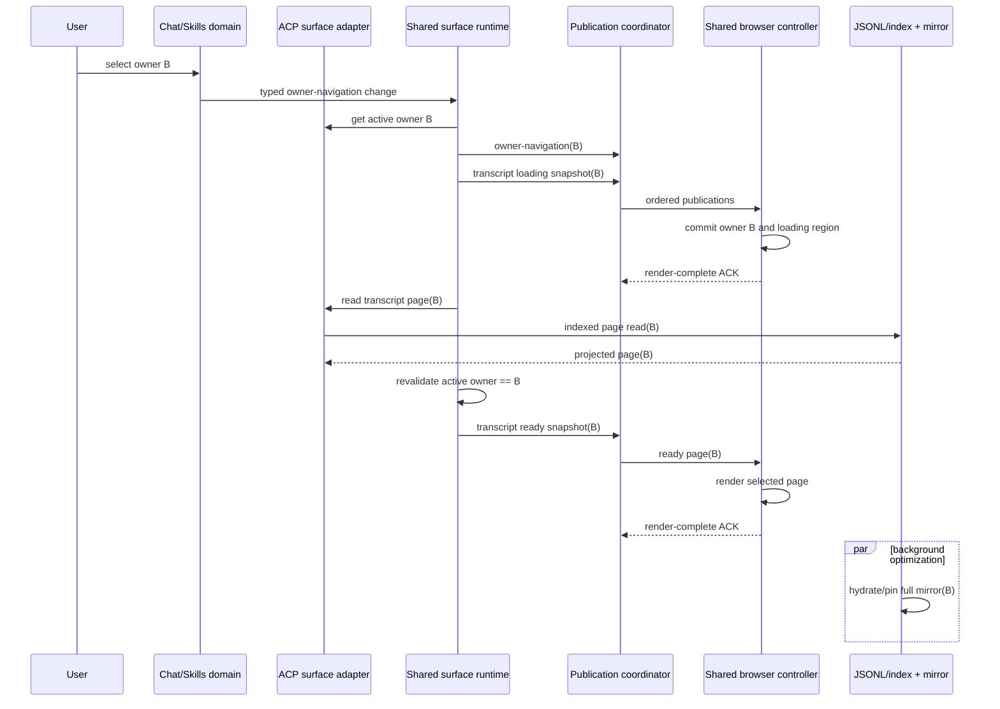
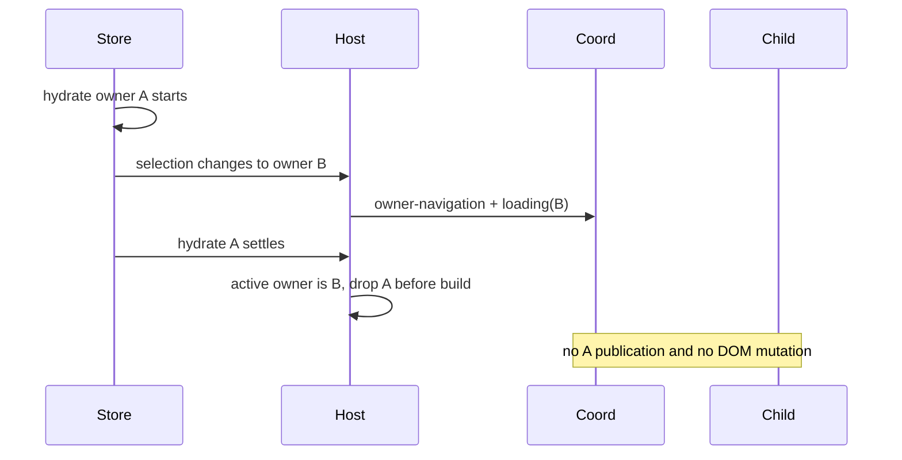

# Assistant Workspace Transcript Owner Transition and Hydration Sequence

本文档定义 ACP Chat 与 ACP Skills 在 Assistant Workspace 中切换 transcript
owner、读取 indexed page、后台 hydrate full mirror，以及向共享浏览器 surface
发布结果的统一时序。

完整的数据面模型见
[`components/assistant-workspace-acp-surface-ssot.md`](components/assistant-workspace-acp-surface-ssot.md)。
本文只描述 owner transition 与 cold hydration。

## 统一词汇

| 名称 | 含义 |
| --- | --- |
| `owner` | 当前 surface 选择的 transcript 所有者。Chat 为 `backendId + "\n" + conversationId`，Skills 为 `requestId`。 |
| `owner-navigation` | owner 列表、分组与当前选择；不承载运行状态。 |
| transcript region | `{ owner, status, error, page, transcriptRevision }`，是两侧唯一的浏览器 transcript 状态。 |
| `page` | 当前选中 owner 的 indexed display-projected page。 |
| `totalVisibleItemCount` | 当前显示模式下完整可见 transcript universe 的 item 数量。 |
| `sourceEventSeq` | source transcript event 的单调位置，可因 held/hidden event 前进。 |
| `transcriptRevision` | UI-visible transcript 的连续性版本。 |
| full mirror | owner 的完整内存 mirror，仅用于加速后续读取，不是首屏正确性的前提。 |
| indexed page read | 从 JSONL/index 或已存在 mirror 读取当前页，是 cold 首屏的正确性路径。 |

ACP Skills 的 selection SSOT 是 `getSelectedAcpSkillRunRequestId()`；ACP Chat
的 selection SSOT 是 `getActiveAcpChatOwner()`。共享 surface 不复制第二套
selection 状态。

## 不变量

1. owner 切换必须 owner-first。Host 先发布 `owner-navigation` 与新 owner 的
   loading transcript snapshot，再读取 ready page。
2. ready page 必须 page-first。cold full mirror hydrate 不得阻塞 indexed page
   的首屏发布。
3. page request 只读取请求中的 owner，不得改变 Chat conversation 或 Skills run
   selection。
4. Host 在 page read 完成后必须再次校验 active source 和 active owner。旧 owner
   的结果不得进入 coordinator。
5. Shell 与 child 只接受 canonical publication；owner、`deliverySequence`、
   `regionRevision` 与 `transcriptRevision` 分别校验，不能互相替代。
6. loading、ready、failed 都属于 transcript region。相同 owner 的重复 loading
   不得反复清空已经提交的 ready DOM。
7. cold full mirror LRU 按 owner 隔离。live、prompting 或 lifecycle-open mirror
   必须 pinned。
8. historical page 收到 tail delta 时只更新 page metadata，不插入 tail row，也不
   跳回尾页。
9. 自动 rebase 只能由 Host coordinator 发起。Child 只为用户显式分页发送 page
   request。
10. Chat 与 Skills 使用相同的 publication form、字段语义、receiver transaction、
    renderer effect 和 ACK 状态机。

## 通用 owner-first 时序



没有 owner 时，初始化发布 unowned `owner-navigation` 和 unowned idle
transcript snapshot。不得构造虚假的 owner 或复用上一个 owner 的 page。

## ACP Skills cold selection

Skills selection 的 domain operation 只负责选择 run。共享 surface 的后续步骤是：

1. `selection` change 映射为 `owner-navigation`。
2. shared runtime 从 store 重新读取 active `requestId`。
3. coordinator 清理旧 request 的 publication lane、signature 与 transcript
   projection。
4. 初始化链发布 loading-first。
5. adapter 调用 `readAcpSkillRunTranscriptRegion()` 读取 selected page。
6. indexed page 可用后发布 ready snapshot；full mirror hydrate 在后台继续。
7. hydrate 完成只为其原 owner 发布 request-scoped transcript change。若该 owner
   已不再 active，shared runtime 在 build 前丢弃。

archive、global list change 或默认 selection 变化同样走 `owner-navigation`，不得
伪装成 `baseline-status`，也不得回退到整面板 snapshot。

## ACP Chat cold conversation selection

Chat backend/conversation 切换遵循同一链：

1. `active-scope`、`session-list`、`backend` 或 `global` change 映射为
   `owner-navigation`。
2. shared runtime 读取 active `backendId` 与 `conversationId`，形成 canonical
   owner。
3. coordinator 清理旧 conversation lane。
4. loading-first publication 先使 child 进入新 owner scope。
5. adapter 优先读取已有 mirror page，否则调用 indexed conversation page read。
6. ready page 到达后发布 snapshot；cold full mirror hydrate 只负责后续加速。

backend 只有选择、尚无 conversation 时，owner-navigation 可以显示 backend，但
transcript region 必须保持 unowned idle，不能拼出不完整 owner key。

## 显式分页

Child 发送的 page request 只有一种结构：

```text
{
  owner,
  request: {
    cursor: number | null,
    limit: number
  }
}
```

Host 必须校验：

- owner 结构与 `ownerKey` 一致；
- owner source 等于发出 action 的 child source；
- owner 等于当前 active owner；
- cursor 为 `null` 或非负整数；
- limit 为正整数。

校验通过后，Host 通过对应 adapter 读取该 owner 的 page，并以
`publicationCause=page-request` 发布 transcript snapshot。该操作不修改 selection。

## Hydrate 晚到



如果 hydrate A 的结果已经进入异步 page read，完成回调仍需执行相同的 active-owner
复验。generation、revision 或 renderer page key 不能代替这次 owner guard。

## Rebase

Gap、transaction validation failure、render failure或 mutation buffer overflow
只产生一个 coordinator-owned rebase：

1. Child 以同 publication identity 返回 terminal rejection ACK。
2. Coordinator 标记当前 owner lane `rebasePending`，清空未提交 mutation。
3. Host 通过 adapter 读取当前 page 一次。
4. Coordinator 在同 lane 发布 `publicationCause=rebase` 的 forced snapshot。
5. ready snapshot 成功 ACK 后 lane 才恢复 delta 发布。

Child 不因 gap 自动发送 page request；协议中没有 rebase control publication。

## 代码责任

| 层 | 关键文件 | 责任 |
| --- | --- | --- |
| Domain | `src/modules/acpSessionManager.ts`、`src/modules/acpSkillRunStore.ts` | selection、持久化、JSONL/index、mirror 与 domain change。 |
| Adapter | `src/modules/acpChatWorkspaceSurface.ts`、`src/modules/acpSkillsWorkspaceSurface.ts` | owner lookup、change mapping、region/page read 与 canonical projection。 |
| Shared runtime | `src/modules/assistantWorkspacePublicationRuntime.ts` | initialization 与 source-neutral change scheduling。 |
| Coordinator | `src/modules/assistantWorkspacePublicationCoordinator.ts` | signature、revision、transcript lane、ACK 与 rebase。 |
| Host/Shell | `src/modules/assistantWorkspaceSidebar.ts`、`addon/content/sidebar/assistant-workspace.js` | lifecycle、child delivery、document generation 与 retained forwarding。 |
| Child controller | `addon/content/shared/assistant/assistant-workspace-acp-child.js` | canonical state、plan-render-commit transaction 与 ACK。 |
| Renderer | `addon/content/shared/assistant/assistant-transcript-renderer.js` | targeted row/text effects、virtual window 与 scroll anchoring。 |

## 校验重点

- 首次打开 Workspace 时，默认前台 owner 无需切换即可显示 transcript。
- owner A 的 loading、ready、delta 在切换到 B 后均不能修改 DOM。
- ready page 不依赖 full mirror hydrate 完成。
- 同一 owner 的 snapshot-upsert-followup patch/append 连续成功，不触发 rebase。
- empty/unknown change 不触发整面板 snapshot fallback。
- Chat 与 Skills 的等价 normalized change 产生相同 publication form、revision 与
  rejection/rebase 决策。
