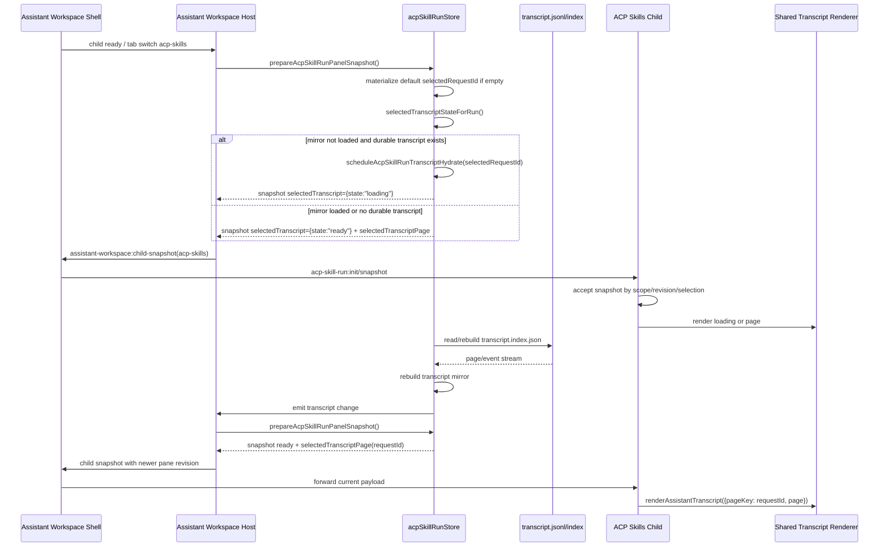
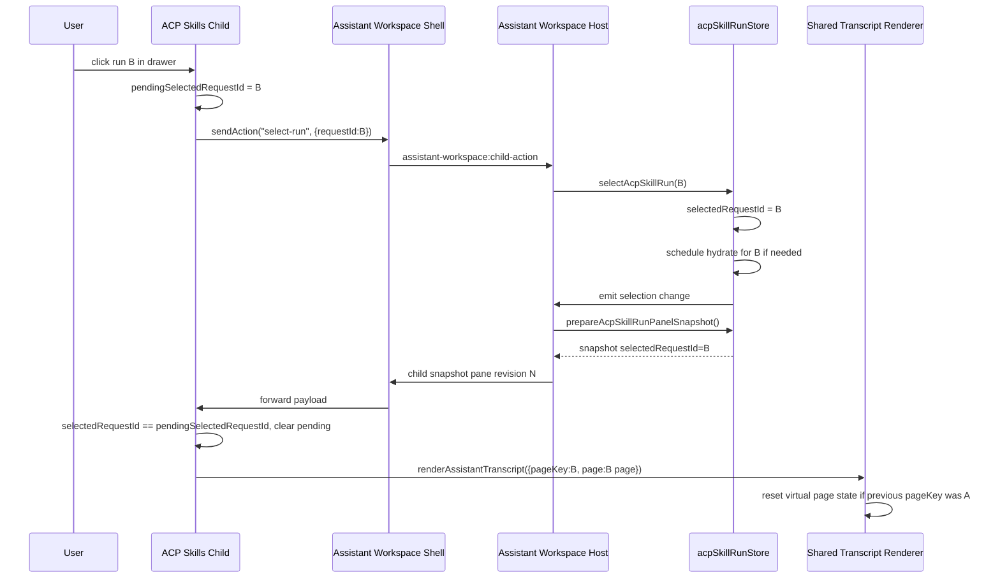
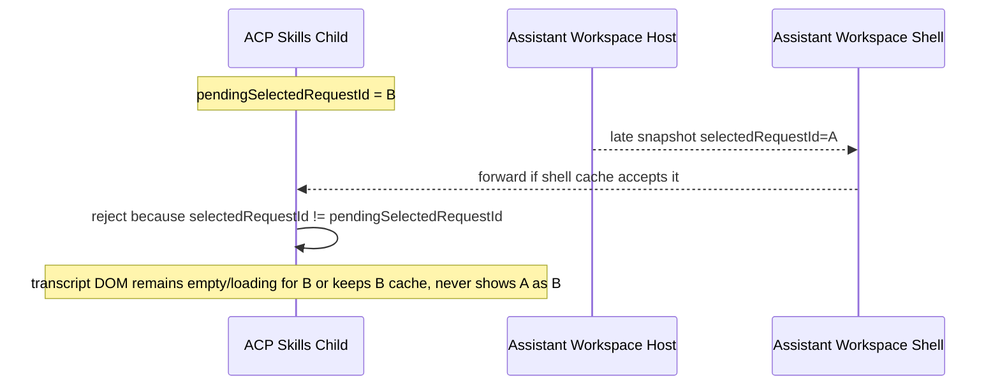
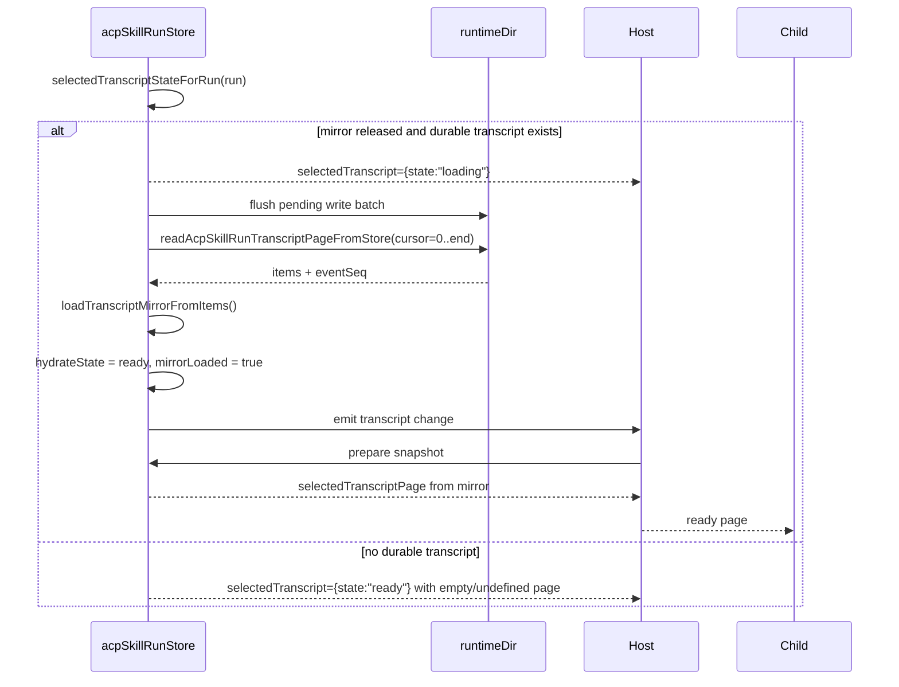
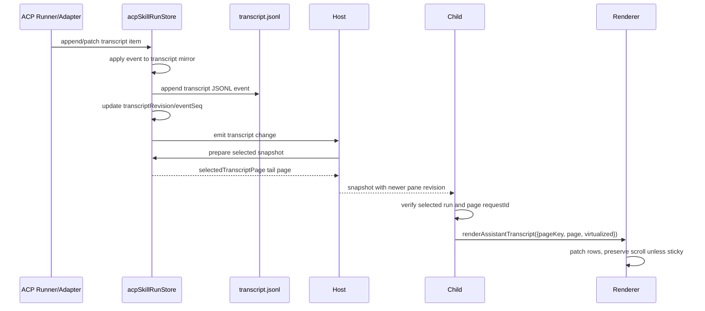
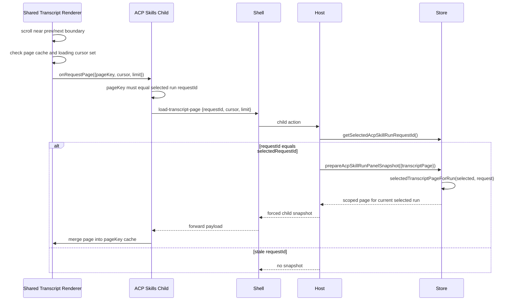
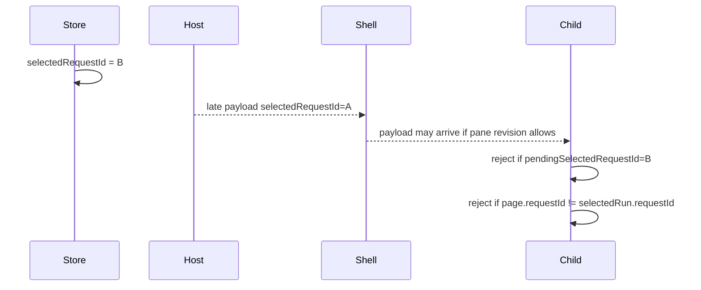
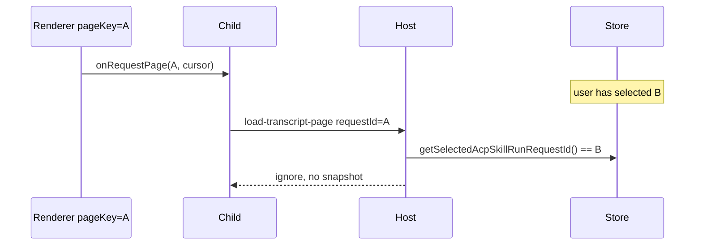
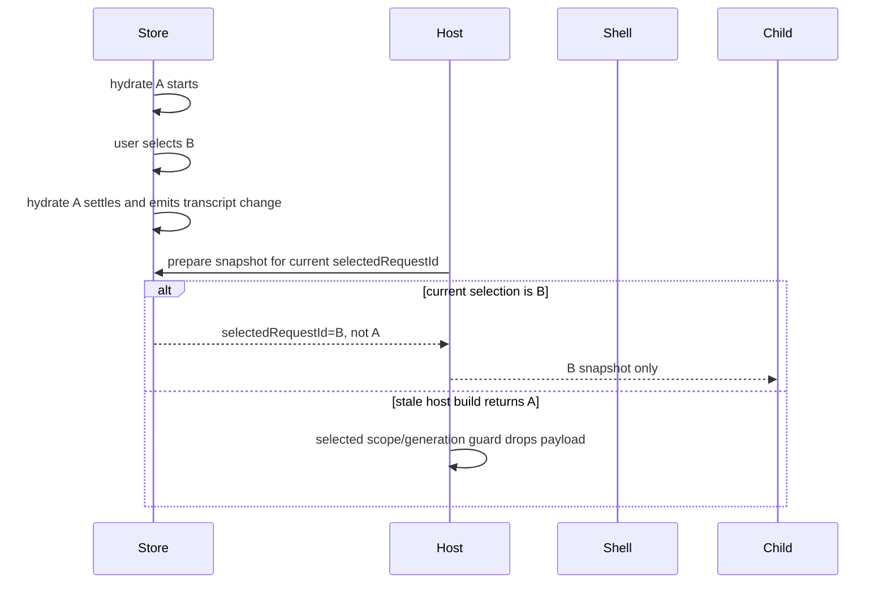

# ACP Skills Transcript Selection and Hydration Sequence

本文档是 ACP Skills 对话任务切换、`transcript.jsonl` hydrate、transcript
mirror 重建、transcript page 加载与共享 renderer 渲染的实现校对基准。

它描述目标时序和必须满足的不变量。代码实现若与本文档不一致，应优先判断是
代码缺陷还是本文档需要随设计更新。

## 术语与所有权

| 名称 | 所有者 | 含义 |
| --- | --- | --- |
| `selectedRequestId` | `src/modules/acpSkillRunStore.ts` | ACP Skills 当前选中 run 的唯一 SSOT。 |
| `transcript.jsonl` | run runtime directory | 持久化 transcript SSOT，按事件追加。 |
| `transcript.index.json` | run runtime directory | 可重建索引，用于分页读取 `transcript.jsonl`。 |
| transcript mirror | `acpSkillRunStore.ts` | 活动会话或当前选中 run 的内存读模型，用于 UI page 投影。 |
| `selectedTranscriptPage` | host -> child snapshot DTO | 当前 selected run 的 request-scoped transcript page。 |
| `transcriptRevision` | 单个 run transcript | 单个 run 的内容版本，来自 mirror/index `eventSeq`。不能用于跨 run snapshot 排序。 |
| `sidebar.panes["acp-skills"].revision` | Assistant Workspace host/shell | workspace child snapshot 时序版本，用于丢弃同一 shell scope 下的旧 payload。 |
| renderer `pageKey` | `AssistantTranscriptRenderer` | shared renderer page cache scope。ACP Skills 必须使用 `requestId`。 |

## 核心不变量

1. `selectedRequestId` 是唯一选中 SSOT。除显式选择 action 和首次 panel
   materialize 默认选择外，page request、hydrate 完成、snapshot 构造都不能改变
   selection。
2. `load-transcript-page` 只能服务当前 store-selected run。payload 中的
   `requestId` 必须等于 `getSelectedAcpSkillRunRequestId()`。
3. `selectedTranscriptPage.requestId` 必须等于 snapshot 的
   `selectedRequestId` / `selectedRun.requestId`。不匹配时 child 不得渲染该
   page。
4. hydrate 状态变化由 hydrate 执行者负责发布。`loading -> ready/failed`
   落定后必须发布 request-scoped transcript change。
5. child 在 `pendingSelectedRequestId` 未被目标 run snapshot 确认前，不得渲染
   旧 selected run 的 transcript。
6. `transcriptRevision` 只比较同一个 run 的 transcript 内容。跨 run 切换必须先
   按 `requestId` / `pageKey` 分区，再比较 revision。
7. 同一 run 已渲染 ready page 后，同 revision 或更旧的 loading snapshot 不得
   清空 transcript DOM。
8. shared renderer 的 virtual page cache 必须以 `pageKey=requestId` 隔离。切换
   run 时，旧 run page cache 不能用于新 run。
9. transcript DOM scroll stickiness 只能由 shared renderer 管理。ACP Skills
   panel 不直接设置 `scrollTop = scrollHeight`，也不安装业务私有 scroll
   virtualization handler。
10. shell cache replay 只能 replay 当前 `scopeKey` 下单调不降的 child
    payload。scope 变化必须清空 child payload cache 和 child revision cache。

## Snapshot 层级

ACP Skills transcript 经过五层状态：

1. **Store**：维护 `selectedRequestId`、run record、transcript mirror。
2. **Host**：调用 `prepareAcpSkillRunPanelSnapshot()` 构造 child payload。
3. **Shell**：缓存并转发 child payload，按 `scopeKey` 和 pane revision 做基本时序
   过滤。
4. **Child**：按 pending selection、selected run、transcript revision 判断是否
   接受并渲染 snapshot。
5. **Renderer**：按 `pageKey` 维护 page cache、virtual window、scroll
   stickiness 和 page request 去重。

这些层级的职责不能互相替代。特别是：

- Host generation guard 只能解决 host 内部异步构造乱序，不能替代 child 的
  pending selection guard。
- Pane `revision` 只能解决同一 shell scope 下 snapshot 新旧顺序，不能替代
  `requestId` scope check。
- Renderer `pageKey` 只能隔离 page cache，不能决定 store selection。

## 初次打开 ACP Skills tab

目标：初次打开时，如果 store 尚无 selection，则 materialize 最近可见 run 为
`selectedRequestId`，先发布 loading snapshot，再由 hydrate 完成者发布 ready
snapshot。

校对点：

- 第一次默认 selection materialize 是允许的运行路径，但它与当前
  `assistant-workspace-ui-refresh-governance` 中“selection 只由显式 action
  改变”的表述存在疑似漂移。
- `prepareAcpSkillRunPanelSnapshot()` 可以触发 hydrate，但 hydrate 完成通知必须由
  `hydrateAcpSkillRunTranscriptMirror()` 负责。
- loading snapshot 没有 `selectedTranscriptPage` 时，child 可以显示 loading；但
  不能用旧 run 的 page 填充当前 transcript。

## 用户从 run A 切换到 run B

目标：点击 run B 后，child 先进入 pending selection 状态；只有 selected run 为
B 的 snapshot 可以解除 pending 并渲染 transcript。

非法乱序必须被丢弃：

校对点：

- `select-run` handler 不应立即 `render(state.snapshot)`，否则会把旧 A snapshot
  再刷一次。
- Host 对 snapshot build 的 generation guard 只能丢弃较早完成的 host build；child
  仍必须按 pending selected run 拒绝旧 selected run。
- 切换 run 时，renderer 必须看到新的 `pageKey`。如果没有新 page，不能继续使用 A 的
  virtual cache 作为 B 的内容。

## 历史 run mirror 已释放后的 hydrate

目标：历史 run 的完整 transcript 不常驻内存。重新选中时，从
`transcript.jsonl` 和 `transcript.index.json` 重建 mirror，再从 mirror 输出
request-scoped page。

校对点：

- `transcript.jsonl` 是真源；`transcript.index.json` 可以重建。
- hydrate 当前会重建完整 mirror。面板 payload 仍必须只发送
  `selectedTranscriptPage`，不能恢复 `selectedRun.transcriptItems`。
- hydrate 失败应落到 `selectedTranscript={state:"failed"}`，不能无限
  `loading`。

## 正在运行 run 的 live transcript

目标：live 事件同时更新持久化 JSONL 和当前 mirror；UI snapshot 发布可以被合并或节流，
但 structural transcript 事件和允许发布的 text chunk 最终必须进入 selected run 的
page。

校对点：

- `transcriptRevision` 增长代表单个 run 的 content version。
- 非 transcript 更新不应强制 transcript renderer 工作；但 runtime options、logs、
  details 可通过 panel render key 更新非 transcript 区域。
- 当用户不在底部时，live update 不能强制吸底。

## 用户滚动触发 page loading

目标：page loading 是 renderer-owned 行为。业务 child 只把 renderer 的 request 转发
为 `load-transcript-page` action，不维护第二套 page cache。

校对点：

- page request 不能传 `selectedRequestId` 来临时改变 selection。
- `selectedTranscriptPageForRun()` 必须拒绝 requestId 与 selected record 不一致的
  request。
- renderer 的 loading cursor 去重是前端优化，不是安全边界；host 仍必须做 selected
  run 校验。

## 旧 snapshot 与 late hydrate 的丢弃规则

### 旧 run snapshot 晚到

### 旧 page request 晚到

### hydrate ready 晚到

校对点：

- hydrate completion event may name run A, but snapshot publication must still use current store
  selection unless the caller is a non-UI diagnostic path.
- late ready for A must not publish A as selected if user already selected B.

## 代码映射

| 层 | 关键文件 | 责任 |
| --- | --- | --- |
| Store | `src/modules/acpSkillRunStore.ts` | `selectedRequestId`、run records、transcript live states、hydrate、snapshot builder。 |
| Transcript persistence | `src/modules/acpSkillRunTranscriptStore.ts` | `transcript.jsonl` append、index rebuild、indexed page read。 |
| Host | `src/modules/assistantWorkspaceSidebar.ts` | child snapshot 发布、host build generation guard、`load-transcript-page` selected guard。 |
| Shell | `addon/content/sidebar/assistant-workspace.js` | child frame bridge、payload cache、`scopeKey` / pane revision gate。 |
| Child | `addon/content/sidebar/acp-skill-run.js` | pending selection、snapshot acceptance、transcript revision guard、renderer invocation。 |
| Renderer | `addon/content/shared/assistant/assistant-transcript-renderer.js` | page cache、virtual window、scroll stickiness、page request 去重。 |

## 当前需要校对的风险点

1. `prepareAcpSkillRunPanelSnapshot()` 会 materialize 默认 selection。若规范坚持
   “selection 只能由显式 action 改变”，则应调整实现；若默认 selection 是目标行为，
   则应更新 OpenSpec。
2. `transcriptRevision`、`sidebar.panes["acp-skills"].revision` 和 renderer
   `pageKey` 解决的是不同问题。任一层把它们混用，都可能导致旧 transcript 覆盖新
   selection。
3. Shell cache replay 与 child pending selection guard 必须同时存在。只依赖其中一层，
   在 iframe reload、tab switch、host async build 乱序时仍可能显示旧 run transcript。
4. `selectedTranscriptPage` 是 page DTO，不是 selection DTO。任何 page request 通过
   `selectedRequestId` 或 snapshot option 改变 selection，都会重新打开串台路径。
5. Loading snapshot 是状态提示，不是内容版本。它不得清空同 run 已渲染的 ready
   transcript，也不得让旧 run transcript 作为当前 run 的 fallback。
6. 如果 shared renderer 收到 `virtualized=true` 但 page 不属于当前 `pageKey`，应拒绝
   merge，而不是保留旧 cache 继续渲染。
7. Scroll 默认位置由 renderer 根据 sticky 状态决定。成功加载 tail page 时通常应位于
   底部；若切换后显示旧 transcript 且 scroll 位于顶部，优先排查旧 page cache 或旧
   snapshot 被接受。

## 后续修复校对清单

- Store：确认所有 UI snapshot 路径都基于当前 `selectedRequestId`，page request 不改变
  selection。
- Host：确认 async snapshot build 完成后仍校验当前 selected run 和 build generation。
- Shell：确认 `scopeKey` 变化清空 cache，pane revision 只在同 scope 下比较。
- Child：确认 `select-run` 到目标 snapshot 到达期间不会渲染旧 selected run。
- Renderer：确认切换 `pageKey` 时清空 virtual state，scroll handler 不触发业务层重绘。
- Tests：回归测试应覆盖旧 run snapshot 晚到、旧 page request 晚到、hydrate ready 晚到、
  iframe/shell replay 四类时序，而不是只断言源码字符串。
