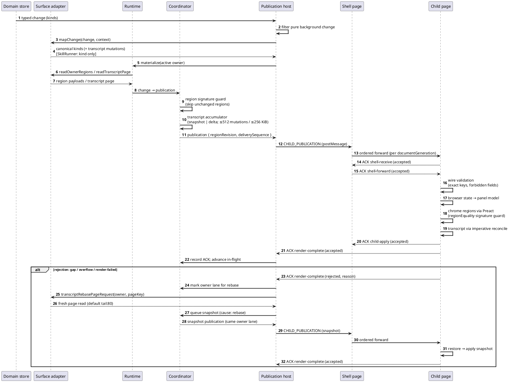

# Assistant Workspace Module Overview

This document is the module-level map of the Assistant Workspace after the
publication-plane refactor: what the module exposes to the rest of the plugin,
how its internals are layered, and how a domain change travels from a store to
rendered DOM and back through the acknowledgement loop.

It is deliberately not a second SSOT. Two companion documents own the normative
contracts:

- `doc/components/assistant-workspace-acp-surface-ssot.md` owns the runtime
  surface boundary shared by ACP Chat and ACP Skills: canonical surface model,
  field semantics, adapter contract, ordering, transcript transaction, rebase
  ownership, and rendering invariants.
- `doc/components/assistant-sidebar-panel-ui-ssot.md` owns the visible UI/UX
  model: shell contract, the six-region panel layout, per-panel mapping, and
  visual alignment rules.

This overview points at both where their rules apply and only describes module
organization, public entry points, and data flow. When prose here and an SSOT
disagree, the SSOT wins.

## Architecture at a Glance

The Assistant Workspace is a four-plane pipeline shared by all three tabs
(`acp-chat`, `acp-skills`, `skillrunner`; type `AssistantWorkspaceTab`):

1. **Domain data layer** — the per-backend stores that own conversations, runs,
   and transcript history. They emit typed changes; they know nothing about
   publication.
2. **Surface adapters** — one adapter per tab that maps domain changes onto the
   canonical publication vocabulary and answers owner-scoped reads.
3. **Publication runtime** — a stateless materialization runtime plus a
   coordinator holding region revisions, signature guards, and per-owner
   transcript accumulators.
4. **Host delivery plane** — subscription, scheduling, postMessage delivery to
   the Shell, ACK bookkeeping, and automatic rebase.

Below the host boundary, the Shell page (one iframe per tab) forwards
publications in order, and each child page validates the wire payload, updates
its canonical browser state, renders chrome regions through Preact and the
transcript through an imperative renderer, then acknowledges each stage.

```plantuml
@startuml assistant-workspace-layers
skinparam componentStyle rectangle
skinparam linetype ortho

package "Shared wire contract (src/shared/)" {
  [assistantWireContract.ts] as Wire
  [assistantActionContract.ts] as ActionContract
  [assistantInteractionContract.ts] as Interaction
}

package "Domain data layer (src/modules/)" {
  [acpSessionManager.ts\n+ acpChatTranscriptMirror.ts] as ChatStore
  [acpSkillRunStore.ts\n+ acpSkillRunTranscriptMirror.ts] as SkillsStore
  [skillRunnerRunDialog.ts] as RunnerStore
  [assistantTranscriptMirrorStore.ts] as Mirror
}

package "Surface adapters (src/modules/)" {
  [acpChatWorkspaceSurface.ts] as ChatAdapter
  [acpSkillsWorkspaceSurface.ts] as SkillsAdapter
  [skillRunnerWorkspaceSurface.ts] as RunnerAdapter
  [assistantWorkspaceSurfaceSkeleton.ts] as Skeleton
}

package "Publication runtime (src/modules/)" {
  [assistantWorkspacePublication.ts\n(domain model SSOT)] as Model
  [assistantWorkspacePublicationRuntime.ts\n(stateless funnel)] as Runtime
  [assistantWorkspacePublicationCoordinator.ts\n(signatures, revisions, accumulator)] as Coordinator
  [assistantWorkspaceTranscriptPublication.ts] as TranscriptModel
  [assistantTranscriptPageProjection.ts] as PageProjection
}

package "Host plane (src/modules/)" {
  [assistantWorkspacePublicationHost.ts\n(delivery, ACK, rebase)] as PubHost
  [assistantWorkspaceSidebar.ts\n(panel host, public facade)] as Sidebar
  [assistantWorkspaceActionRouter.ts] as ActionRouter
}

package "Shell page (src/sidebar/, iframe host)" {
  [assistantWorkspaceShell.js] as Shell
}

package "Child pages (src/sidebar/, one per tab)" {
  [assistantWorkspaceAcpChild.js\n(wire validation, browser state)] as Child
  [components/chromeRenderer.ts\n+ regionEquality.ts] as Chrome
  [assistantTranscriptRenderer.js\n(imperative, virtual scroll)] as TranscriptRenderer
  [assistantPanelModel.js /\nassistantPanelRenderer.js] as PanelModel
}

ChatStore --> ChatAdapter : typed change
SkillsStore --> SkillsAdapter : typed change
RunnerStore --> RunnerAdapter : typed change
ChatAdapter ..> Skeleton
SkillsAdapter ..> Skeleton
RunnerAdapter ..> Skeleton
ChatAdapter --> Runtime : AssistantWorkspacePublicationAdapter
SkillsAdapter --> Runtime
RunnerAdapter --> Runtime
Runtime --> Model : readOwnerRegions /\nreadTranscriptPage
Runtime --> Coordinator : materialized change
Coordinator --> TranscriptModel : snapshot / delta
TranscriptModel ..> PageProjection
Coordinator --> PubHost : sequenced publication
PubHost --> Sidebar : shell postMessage
Sidebar --> Shell : CHILD_PUBLICATION
Shell --> Child : ordered forward
Child --> Chrome : chrome regions (Preact)
Child --> TranscriptRenderer : transcript region (imperative)
Child ..> PanelModel
Child --> Shell : PUBLICATION_ACK\n(shell-receive / shell-forward /\nchild-apply / render-complete)
Shell --> PubHost : ACK
PubHost --> Runtime : transcriptRebasePageRequest\n(on gap / overflow / render-failed)
ActionRouter --> ChatStore : dispatched actions
ActionRouter --> SkillsStore
ActionRouter --> RunnerStore
Shell --> ActionRouter : CHILD_ACTION
Wire <.. PubHost : envelope / forbidden fields
Wire <.. Child : wire validation
Model ..> ActionContract : tsc drift guard
Model ..> Interaction : pending interaction DTO
Mirror <.. ChatStore
Mirror <.. SkillsStore
@enduml
```

Notes on the diagram:

- `src/shared/` is the only layer importable from both the privileged plugin
  process and the sidebar pages. It must not import from `src/modules/**`.
- The SkillRunner adapter is the deliberate exception on the transcript lane:
  it reports transcript changes by kind only (no mutation events), so the
  runtime re-reads a snapshot instead of applying a delta.
- The ActionRouter arrow runs in the opposite direction of publication: child
  pages send actions up, the router validates scope and dispatches into the
  domain stores.

## External Public Interface

`src/modules/assistantWorkspaceSidebar.ts` is the only public facade of the
module. Everything outside the Workspace (lifecycle hooks, menus, dialogs,
tabs, replay tooling) enters through these functions:

| Export | Signature | Purpose / callers |
|---|---|---|
| `installAssistantWorkspaceSidebarShell(win)` | `(win: _ZoteroTypes.MainWindow) => AssistantWorkspaceHostRuntime` | Create or return the per-window host runtime: mounts the shell into the library and reader sidebar docks, starts the shell handshake and message listener. Called by `hooks.ts` on startup and lazily by the open/toggle paths. |
| `removeAssistantWorkspaceSidebarShell(win)` | `(win) => void` | Tear down the host on window close/unload (`hooks.ts`). |
| `openAssistantWorkspaceSidebar(args?)` | `async (args?: { window?; tab?; backend?; requestId?; runKey?; target? }) => Promise<boolean>` | Open the sidebar, optionally switch tab and select a specific run (`requestId` for ACP Skills, `runKey` for SkillRunner). Callers: hooks menus, `taskManagerDialog`, `workspaceTab`, `acpSkillRunForeground`. |
| `closeAssistantWorkspaceSidebar(args?)` | `(args?: { window? }) => boolean` | Close the active dock. Callers: hooks, `workspaceTab`, `markdownAttachmentTab`. |
| `isAssistantWorkspaceSidebarOpen(args?)` | `(args?: { window? }) => boolean` | Open-state query for the same callers. |
| `toggleAssistantWorkspaceSidebar(args?)` | `async (args?: { window?; tab?; target? }) => Promise<boolean>` | Toggle command; a tab switch on an already-open sidebar re-publishes a state pulse instead of closing. |
| `getAssistantWorkspaceReplayState(args?)` | `(args?: { window? }) => { open: boolean; tab: AssistantWorkspaceTab; target?: AcpSidebarTarget }` | Replay/diagnostic snapshot of the host state. |

The facade also re-exports a compatibility layer so existing consumers keep a
single import site:

- Action routing: `handleAcpChatAction`, `handleAcpSkillRunAction`,
  `createSkillRunnerHostActionHandler` (from
  `assistantWorkspaceActionRouter.ts`).
- Diagnostics and replay ports: `forceAssistantWorkspaceDiagnosticsPublication`,
  `inspectAssistantWorkspaceDiagnosticsPublication`,
  `inspectAssistantWorkspaceDiagnosticsPublicationLanes`,
  `inspectAssistantWorkspaceReplayPostSnapshotTimer`,
  `postInitialSnapshotForActiveTab`, `scheduleSkillRunnerPublications` (from
  `assistantWorkspacePublicationHost.ts`), plus
  `dispatchSkillRunnerWorkspaceAction` and `getAcpSkillRunDiagnostics`. These
  exist for tests and the Replay harness; they are not part of the user-facing
  panel API.

One adjacent public surface lives outside the facade on purpose:
`src/modules/assistantExecutionDisplayPolicy.ts` exports
`getAssistantExecutionDisplayMode`, `isAssistantExecutionDisplayMode`,
`setAssistantExecutionDisplayMode`, and
`subscribeAssistantExecutionDisplayMode`, consumed by the settings commands in
`hooks.ts`. The display mode governs which transcript items are UI-visible; its
semantics are defined by the ACP surface SSOT.

Everything else in the module — runtime, coordinator, adapters, mirrors — is
internal. Other plugin code must not import them directly.

## Internal Implementation

### Shared contract layer (`src/shared/`)

These modules cross the privileged/content process boundary and therefore may
only import other `src/shared` modules or relative paths.

- `assistantWireContract.ts` is the wire SSOT. It owns the publication schema
  id (`zotero-agents.assistant-workspace-publication.v1`), the envelope and
  per-kind payload key whitelists, the forbidden-field set
  (`ASSISTANT_WORKSPACE_FORBIDDEN_WIRE_FIELDS`), the message type vocabulary
  (`ASSISTANT_WORKSPACE_MESSAGE_TYPES` — host→shell `INIT` / `SURFACE_CONFIG` /
  `CHILD_SNAPSHOT` / `CHILD_PUBLICATION`, shell→host `ACTION` / `CHILD_ACTION`
  / `PUBLICATION_ACK`, shell→child `ACP_PUBLICATION` / `SURFACE_BOOTSTRAP` /
  `CLOSE_DRAWERS` / ready requests), the structural wire types
  (`AssistantWorkspaceTab`, `AssistantWorkspaceOwner`,
  `AssistantWorkspacePublicationAck` with stages `shell-receive`,
  `shell-forward`, `child-apply`, `render-complete`), the bridge globals
  (`__zsAssistantWorkspaceBridge`, `__zsAssistantWorkspaceAcpBridge`), and the
  out-of-band action vocabularies.
- `assistantActionContract.ts` is the compile-time mirror of action payload
  shapes; `tsc` fails if it drifts from `ASSISTANT_WORKSPACE_ACTION_REGISTRY`.
- `assistantInteractionContract.ts` parses and projects pending interactions
  (`open_text`, `choose_one`, `confirm`, `upload_files`) into the strict
  `AssistantPendingInteraction` DTO.

### Host-side publication core (`src/modules/`)

- `assistantWorkspacePublication.ts` is the publication domain model SSOT:
  `ASSISTANT_WORKSPACE_REGION_REGISTRY` (publication kind → scope / form /
  `browserStateKey` / managed regions / supported sources — ten kinds from
  `owner-navigation` and `service-status` down to `owner-details`),
  `ASSISTANT_WORKSPACE_ACTION_REGISTRY` with its scope vocabulary (local,
  target-owner, selected-owner, navigation-group, global), the three domain
  mappings (`ACP_CHAT_WORKSPACE_DOMAIN_MAPPING`,
  `ACP_SKILLS_WORKSPACE_DOMAIN_MAPPING`,
  `SKILLRUNNER_WORKSPACE_DOMAIN_MAPPING`), owner factories
  (`createAcpChatWorkspaceOwner`, `createAcpSkillsWorkspaceOwner`,
  `createSkillRunnerWorkspaceOwner`), transcript region factories
  (`createIdleTranscriptRegion`, `createLoadingTranscriptRegion`,
  `createReadyTranscriptRegion`, `createFailedTranscriptRegion`), and the
  validators `assertAssistantWorkspacePublication` /
  `assertAssistantWorkspacePublicationAck`.
- `assistantWorkspacePublicationRuntime.ts` is a stateless funnel. It defines
  the `AssistantWorkspacePublicationAdapter` interface each surface implements
  (`selectedOwner`, `readOwnerNavigation`, `mapChange`, `readOwnerRegions`,
  `readTranscriptPage`, plus `source` and `supportedKinds`), turns adapter
  changes into materialized publications for the active owner, drives the
  owner-first baseline sequence, and records transcript page-read timing.
  `defineAssistantWorkspacePublicationAdapter` is the typed registration
  helper.
- `assistantWorkspacePublicationCoordinator.ts` holds the mutable publication
  state: per-region revision and signature maps (the host-side signature guard
  that suppresses unchanged regions), publication sequence numbers, per-owner
  transcript state (accumulator, in-flight publication, pending snapshot), and
  the rebase callback surface. It is the only automatic-rebase initiator.
- `assistantWorkspaceTranscriptPublication.ts` owns the transcript item and
  mutation model: `AssistantWorkspaceTranscriptItem` (message, thought,
  tool-call, plan, status, permission), `AssistantWorkspaceTranscriptMutation`
  (`upsert_item`, `append_text`, `patch_item`, `delete_item`),
  `AssistantWorkspaceTranscriptAccumulator` and
  `AssistantWorkspaceTranscriptProjection`, page-request parsing, and the
  mutation ceilings `MAX_ASSISTANT_WORKSPACE_TRANSCRIPT_MUTATIONS = 512` and
  `MAX_ASSISTANT_WORKSPACE_TRANSCRIPT_BYTES = 256 KiB` that force a rebase when
  exceeded.
- `assistantTranscriptMirrorStore.ts` is the shared Chat/Skills transcript
  mirror: streaming append/patch, per-owner LRU of cold full mirrors, and
  hydration. It may specialize by source only — never by backend, provider, or
  agent family.
- `assistantTranscriptPageProjection.ts` projects the mirror into UI-visible
  pages (execution display mode filter, cursor/limit normalization).
- Supporting modules: `assistantTranscriptRenderingPreference.ts`,
  `assistantExecutionDisplayPolicy.ts` (live/boundary/silent publish policy),
  `assistantMessageCounts.ts`, `assistantPanelLabels.ts`,
  `assistantSidebarViewModel.ts`, `assistantWorkspacePublicationLabels.ts`.

### Host delivery plane (`src/modules/`)

- `assistantWorkspacePublicationHost.ts` subscribes to the three domain change
  streams, filters pure background changes
  (`isPureAcpSkillRunBackgroundChange`), schedules publications per source
  (`scheduleAcpChatPublications`, `scheduleAcpSkillRunPublications`,
  `scheduleSkillRunnerPublications`), delivers sequenced publications to the
  Shell via postMessage, records ACKs (`recordWorkspacePublicationAck`), and
  owns the rebase path (`transcriptRebasePageRequest` decodes an owner page key
  into a fresh page read, defaulting to a tail page of 80 items).
  `configureAssistantWorkspacePublicationShellHost` injects the shell service
  so the module stays testable without a live window. It also hosts the
  diagnostics/replay inspection functions re-exported by the facade.
- `assistantWorkspaceSidebar.ts` is the panel host: it mounts the XUL sidebar
  dock for both targets (`library` and `reader`), runs the shell handshake with
  retry, owns the message listener and the per-tab child document generations,
  and exposes the public API listed above. `AssistantWorkspaceHostRuntime` is
  the per-window runtime record (active tab/target, docks, subscription
  removers, timers, child init deliveries, publication lifecycles).
- `assistantWorkspaceActionRouter.ts` routes child-originated actions:
  `handleChildAction` validates and dispatches by action scope into
  `handleAcpChatAction`, `handleAcpSkillRunAction`, or the handler built by
  `createSkillRunnerHostActionHandler`.

### Surface adapters (`src/modules/`, one per tab)

All three adapters share `assistantWorkspaceSurfaceSkeleton.ts`, which provides
the change-kind → publication-kind mapping scaffold, region-read dispatch,
owner-control DTO assembly, and navigation grouping. Each adapter supplies only
its domain specifics:

- `acpChatWorkspaceSurface.ts` — owner identity is `backendId + "\n" +
  conversationId` (see `createAcpChatWorkspaceOwner`).
- `acpSkillsWorkspaceSurface.ts` — owner identity is `requestId`.
- `skillRunnerWorkspaceSurface.ts` — owner identity is `requestId`, falling
  back to `runKey` for local runs without an assigned request id. SkillRunner
  has no incremental channel: its transcript publications never carry mutation
  events, so the runtime re-reads a snapshot. Correspondingly it keeps no cold
  full-mirror cache — its bounded in-memory session history is the mirror.

### Domain data layer (`src/modules/`)

- `acpSessionManager.ts` (+ `acpChatTranscriptMirror.ts`): Chat conversations,
  connection lifecycle, prompt/cancel, transcript persistence.
- `acpSkillRunStore.ts` (+ `acpSkillRunTranscriptMirror.ts`): Skills requests,
  run lifecycle, output, retention.
- `skillRunnerRunDialog.ts`: SkillRunner run sessions; the workspace-facing
  surface reads it through `getSkillRunnerWorkspaceReadModel` and writes back
  through `dispatchSkillRunnerWorkspaceAction`.

These stores own their data only. Publication revision, delivery, child
readiness, rebase, and DOM state belong to the planes above.

### Page side (`src/sidebar/`, bundled by esbuild)

- `assistantWorkspaceShell.js` — the Shell page: tab bar, three iframes,
  loading masks, the child-publication cache, ordered forwarding across child
  document generations, and installation of the
  `__zsAssistantWorkspaceBridge` global.
- `assistantWorkspaceAcpChild.js` — the child page runtime shared by all three
  tabs: strict wire validation (exact keys plus recursive forbidden-field
  checks), canonical browser state updates, chrome render scheduling, and the
  ACK/rebase receipts.
- `assistantPanelModel.js` — projects canonical browser state into the panel
  view model consumed by the renderers.
- `assistantPanelRenderer.js` — `adoptPanelRegions` / `managedMount` glue; the
  chrome rendering itself has migrated to Preact.
- `assistantTranscriptRenderer.js` — the imperative transcript renderer:
  virtual scrolling, paged reconcile, and the node map that gives streaming
  appends stable row/text-node identity.
- `components/chromeRenderer.ts` and the per-region Preact components
  (`ToolbarRegion`, `BannerRegion`, `MessageCountsRegion`, `PlanRegion`,
  `HintRegion`, `ReplyRegion`, `PermissionDrawerRegion`,
  `DetailsDrawerRegion`, `ContextDrawerRegion`, `TranscriptRegion`,
  `EmptyStateRegion`, …). `components/regionEquality.ts` is the page-side
  signature guard SSOT: `stableRegionSignature` / `equalBySignature` plus the
  per-region equality inputs, with an explicit comment that transcript
  revision, streaming chunks, and item counts must never enter a non-transcript
  selector.

### Static assets (`addon/content/sidebar/`)

`assistant-workspace.html` / `assistant-workspace.css` host the Shell. The
three child documents — `acp-chat.html`, `acp-skill-run.html`,
`skillrunner.html` — are isomorphic skeletons that differ only in their
`data-source` attribute; all load the same bundled child runtime.

## Publication Flow, ACK, and Rebase

The end-to-end path of one domain change:

1. A domain store emits a typed change. The publication host's per-source
   subscription receives it; pure background changes are filtered out.
2. The surface adapter's `mapChange` maps it onto canonical publication kinds.
   Transcript changes carry mutation events — except SkillRunner, which marks
   the kind only and lets the runtime re-read a snapshot.
3. The runtime reads the active owner's regions (`readOwnerRegions`) and
   transcript page (`readTranscriptPage`). The coordinator computes each
   region's signature and skips unchanged regions; the transcript accumulator
   produces a snapshot or delta and the coordinator assigns `regionRevision`
   and `deliverySequence`.
4. The host posts `CHILD_PUBLICATION` to the Shell, which forwards it in order
   to the matching tab's iframe, caching per document generation.
5. The child validates the wire payload, updates canonical browser state,
   projects the panel model, renders chrome regions through Preact (guarded by
   `regionEquality` signatures) and the transcript through the imperative
   renderer. A transcript-only update touches no other managed region.
6. The child acknowledges each stage (`shell-receive`, `shell-forward`,
   `child-apply`, `render-complete`). A rejection with reason `gap`, buffer
   overflow, or `render-failed` triggers exactly one rebase: the host reads the
   current page through the adapter (`transcriptRebasePageRequest`) and queues
   a snapshot with the rebase cause in the same owner lane.

Rebase rules worth restating here because they shape the module boundaries: the
coordinator is the only automatic-rebase initiator; child page requests are
reserved for explicit user navigation; rebase state is idempotent per owner,
page, and rejected revision; and there is no resync control publication. The
full rebase ownership contract is in the ACP surface SSOT.

## Design Invariants

These invariants are hard constraints on any change to this module (they mirror
the project `AGENTS.md`; the rendering rules are normatively owned by the two
SSOT documents):

- Transcript rendering is decoupled from toolbar, banner, plan, hint, reply,
  and every drawer. A transcript-only update renders only the transcript
  region.
- Transcript revision, page signature, streaming chunk, item/event counts,
  prompting event tails, and log tails never enter a whole-panel chrome render
  key — on either the host side (coordinator signatures) or the page side
  (`regionEquality` selectors).
- Every non-transcript managed region refreshes only through its own stable
  signature, containing only that region's user-visible content and
  open/collapsed state.
- Cold transcript foreground rendering is page-first: `transcript page ready`
  and `full mirror ready` are independent states. Owner switches are
  owner-first — the new owner's loading/empty snapshot publishes before any
  indexed page read or full mirror hydration.
- Live, prompting, and lifecycle-open transcript mirrors are pinned and never
  participate in cold-mirror LRU eviction; the cold full-mirror cache is a
  performance cache, never a correctness requirement.
- Owner identity rules: ACP Skills = `requestId`; ACP Chat =
  `backendId + "\n" + conversationId`; SkillRunner = `requestId` (fallback
  `runKey`), with no cold mirror cache and snapshot-only publication.
- ACP transcript projection does not assume the backend has rectified assistant
  message chunks; side-channel updates (`tool_call_update`, usage, status,
  workspace activity) are not message boundaries; coalescing must never
  special-case a backend, provider, or agent family.

## Test Anchors

- `test/core/184-assistant-workspace-publication-data-plane.test.ts` —
  publication data plane: materialization, ordering, accumulator behavior.
- `test/core/190-assistant-workspace-wire-drift.test.ts` — wire drift guard:
  envelope/payload keys, forbidden fields, action registry parity.
- `test/core/192-assistant-workspace-chrome-components.test.ts` — chrome region
  node identity across transcript-only and equivalent publications.
- `test/core/193-skillrunner-workspace-surface.test.ts` — SkillRunner surface:
  snapshot-only transcript publication and run-key owner fallback.
- `test/core/97-acp-ui-smoke.test.ts` — end-to-end smoke across tabs.

Changes that touch transcript rendering, prompting, snapshots, or drawer/details
behavior are expected to extend the identity-locking tests rather than add
parallel coverage.
