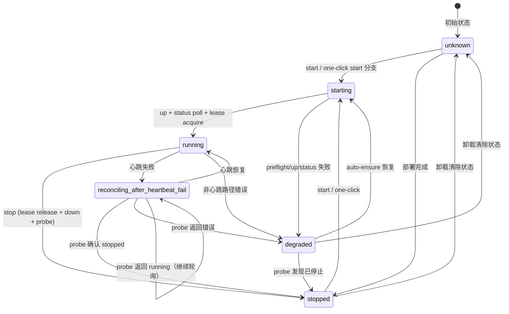
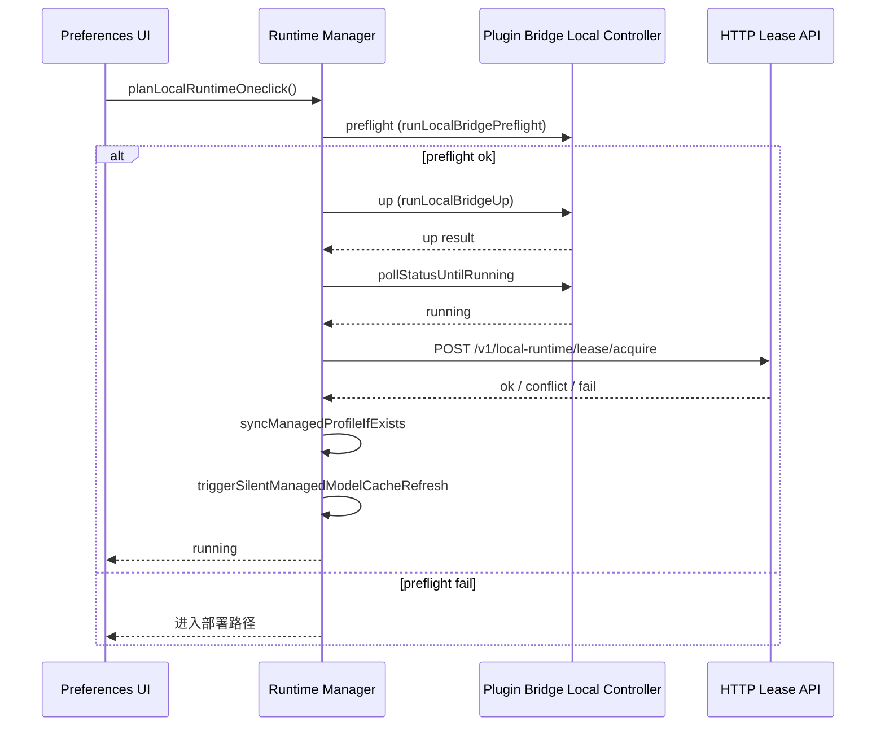
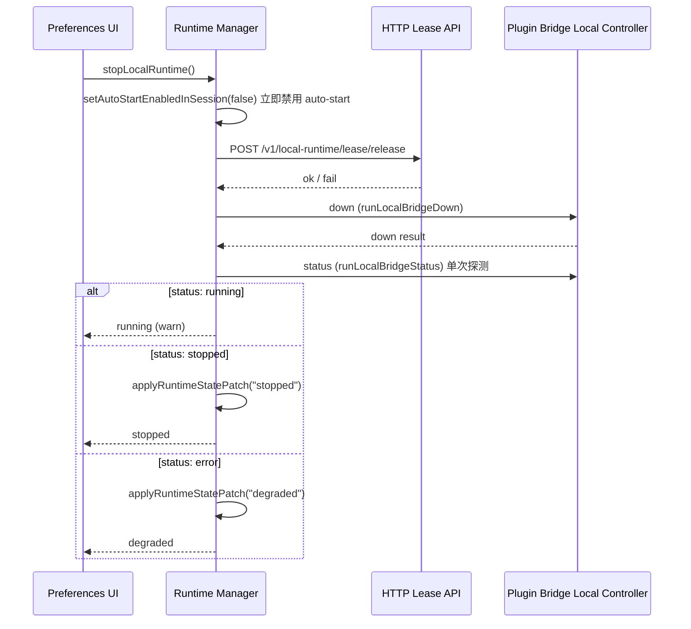
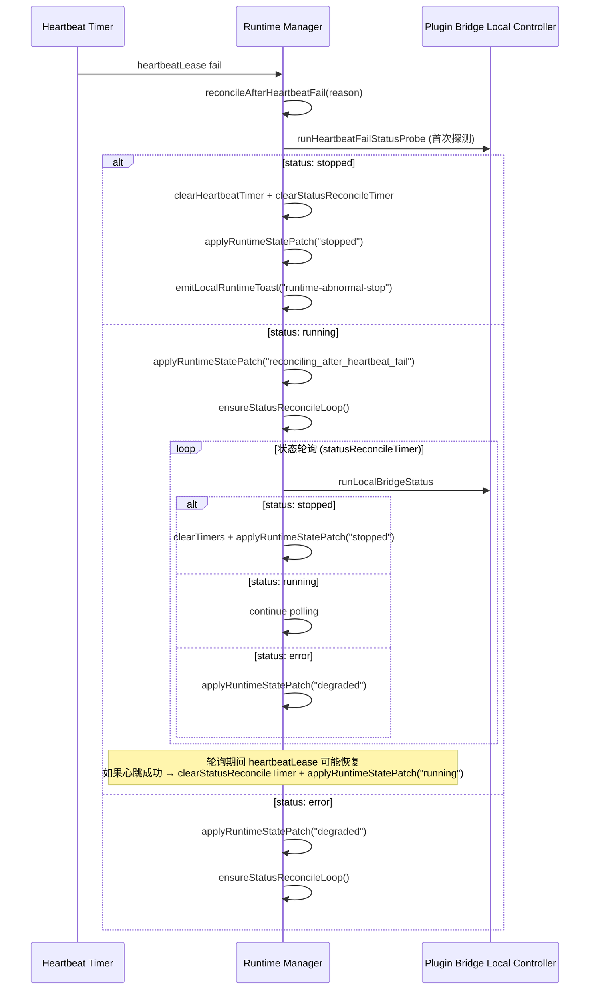
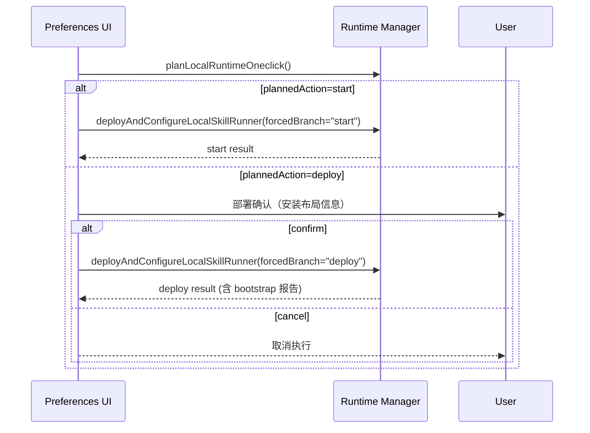
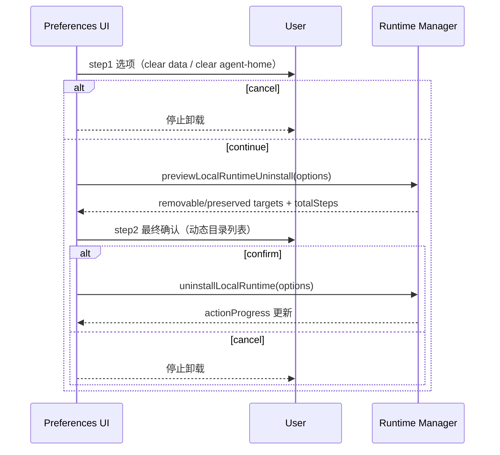

# SkillRunner Local Runtime One-Click State Machine SSOT

## Purpose

本文档作为 SkillRunner 本地一键部署/启动能力的状态机 SSOT，约束运行时状态模型、按钮动作、监测启停与不变量守护。  
该文档只定义行为合同，不包含业务实现代码。

当前实现约束：本地控制面由插件桥接器原生动作实现（`bootstrap/preflight/up/down/status/doctor`），运行期不再依赖 `skill_runnerctl` 返回作为真源。

## State Model

### States

运行时状态由 `RuntimeState` 类型定义，代码位置：`src/modules/skillRunnerLocalRuntimeManager.ts:59-65`。

| 状态 | 描述 | 典型写点 |
|------|------|---------|
| `unknown` | 初始/回退状态。无运行时信息，或部署失败/卸载后的默认状态。 | 初始默认值；部署失败时写 `stopped` 而非 `unknown`，但 info 被清除 |
| `starting` | 运行时正在启动中（preflight → up → status poll 流程中）。 | `ensureManagedLocalRuntimeForBackend` |
| `running` | 运行时已正常启动且持有租约。 | 启动成功后的状态探测确认 |
| `stopped` | 运行时已停止。 | `stopLocalRuntime`、`reconcileAfterHeartbeatFail`（probe 确认 stopped） |
| `degraded` | 运行时不可达或非预期状态。与 `unknown` 的区别在于运行时信息（installDir 等）仍然存在，但无法正常通信。 | preflight/up 失败、status probe 失败 |
| `reconciling_after_heartbeat_fail` | 心跳失败后的诊断/恢复循环中。插件正在轮询状态探测，试图确认运行时实际状况。 | `reconcileAfterHeartbeatFail` 当首次 probe 返回 running |

状态的写入统一通过 `applyRuntimeStatePatch()`（约第 2821 行）完成，该函数将新的 `RuntimeState` 写入持久化的 `ManagedLocalRuntimeState` 并通知监听器。

### 旧状态等价映射

旧版本文档定义了 12 个形式化状态，以下映射表说明它们在当前实现中的等价位置：

| 旧状态（已移除） | 新等价物 | 说明 |
|-----------------|---------|------|
| `no_runtime_info` | `unknown` | 无运行时信息时默认为 `unknown` |
| `runtime_info_ready` | `unknown` + `hasRuntimeInfo()===true` | 运行时信息存在性是谓词 `hasRuntimeInfo()`，非独立状态 |
| `preflighting` | `starting` | Preflight 只在启动序列中作为同步步骤发生 |
| `deploying` | `unknown` 或 `stopped` | 部署是 `deployAndConfigureLocalSkillRunner` 内的同步操作，结束状态为 `stopped` |
| `acquiring_lease` | `running` + `lease.acquired` | 租约获取是 up 后的子步骤，运行时已处于 `running` |
| `stopping` | `starting`（反向） | Stop 是同步操作链，无持久中间状态 |
| `uninstalling` | `unknown` | 卸载清除所有状态 |
| `error` | `degraded` | `degraded` 是实际的故障状态 |

### Transition Diagram

注：与形式化事件驱动状态机不同，实际代码中每个状态转换由命令式控制流中的 `applyRuntimeStatePatch()` 调用触发。上图中的箭头标注了实际的写点和触发条件。

### State Persistence

`RuntimeState` 作为 `ManagedLocalRuntimeState.runtimeState` 可选字段持久化到 Zotero 首选项（KEY = `skillRunnerLocalRuntimeStateJson`）。读取时通过 `readManagedLocalRuntimeState()` 加载，写入时通过 `writeManagedLocalRuntimeState()` 持久化。

持久化状态包含 25 个字段（完整类型见代码第 86-108 行），其中与状态机相关的关键字段：

- `runtimeState: RuntimeState` — 当前运行时状态
- `lease: LeaseState` — 租约信息（acquired、stoppedByConflict、leaseId、heartbeatIntervalSeconds 等）
- `autoStartPaused: boolean | undefined` — 自动启动暂停标记
- `runtimeFailureCount: number` — 运行时连续失败计数

## Action Model

运行时管理器不使用形式化事件系统。动作通过命令式函数调用分发，并发控制通过动作互斥锁实现。

### Actions

| 动作字符串 | 入口函数 | 描述 |
|-----------|---------|------|
| `"oneclick-deploy-start"` | `deployAndConfigureLocalSkillRunner` | 一键部署或启动 |
| `"stop"` | `stopLocalRuntime` | 停止正在运行的运行时 |
| `"uninstall"` | `uninstallLocalRuntime` | 卸载运行时 |

后台动作（不受用户动作互斥锁限制）：

| 后台动作 | 入口函数 | 描述 |
|---------|---------|------|
| `"ensure"` | `ensureManagedLocalRuntimeForBackend` | 自动确保运行时运行（auto-ensure tick / startup preflight） |

### Mutex Mechanism

- `runtimeActionInFlight: string`（第 2196 行）— 非空字符串表示用户面动作正在执行中
- `backgroundInFlightAction: string`（第 2197 行）— 非空字符串表示后台动作正在执行中
- `getEffectiveInFlightAction()`（第 2199 行）— 返回 `runtimeActionInFlight`（若已设置）或 `backgroundInFlightAction`
- `withRuntimeActionMutex(action, runner)`（第 2254 行）— 守卫用户面动作入口。若 `getEffectiveInFlightAction()` 非空，立即返回 `conflict: true` 结果
- `withRuntimeControlLock(runner)`（第 2304 行）— 基于 promise 链的串行化锁，确保所有运行时操作顺序执行
- `setBackgroundInFlightAction(action)`（第 2203 行）— 设置后台动作指示器，跳过 mutex

### Button Enablement

按钮启用逻辑在偏好设置 UI 层临时计算，无中心化的 `ManagedLocalRuntimeButtonEnablement` 类型。

实际规则：

- **一键部署/启动**：`getEffectiveInFlightAction()` 非空时禁用
- **停止**：`getEffectiveInFlightAction()` 非空时禁用；`runtimeState` 不为 `running` 时禁用
- **卸载**：`getEffectiveInFlightAction()` 非空时禁用
- **调试控制台**：始终可用，不受运行时动作互斥锁门控

### One-Click Branching

一键操作通过 `planLocalRuntimeOneclick()` 先规划，再由 `deployAndConfigureLocalSkillRunner()` 执行。

- **有运行时信息（installDir 等存在）：**
  - `planLocalRuntimeOneclick` 执行 preflight
  - preflight 成功 → forcedBranch=`"start"` → `up → pollStatusUntilRunning → syncManagedProfile → tryAcquireLeaseOnRunning`
  - preflight 失败 → forcedBranch=`"deploy"` → 进入部署路径
- **无运行时信息：**
  - 直接部署
- **部署返回值合同：**
  - `post_deploy_preflight` 在部署后同步执行
  - 成功 → 返回 `deploy-complete` 并异步触发 `triggerManagedRuntimeAutoEnsureTickAsync`
  - 失败 → 返回失败且不触发 auto-ensure

## Sequence Diagrams

### One-Click With Runtime Info

### Manual Stop (Release → Down → Status Probe)

### Heartbeat Fail Reconciliation

### One-Click Deploy Confirm (Plan Then Execute)

### Uninstall Two-Step Confirm and Progress

## Invariants

1. **Action Mutex** — At most one runtime action (`runtimeActionInFlight`) may be in-flight at a time. Background actions (`backgroundInFlightAction`) are also tracked and block new user-facing actions via `getEffectiveInFlightAction()`.

2. **Startup Policy** — Startup must hydrate auto-start switch from persisted `autoStartPaused` via `hydrateLocalRuntimeAutoStartSessionStateFromPersistedState()`. Missing persisted flag defaults to `autoStartEnabledInSession = false` (auto-start disabled). Startup preflight (`runManagedRuntimeStartupPreflightProbe`) runs only when hydrated auto-start is enabled. No runtime info on startup means skip preflight.

3. **Auto-Start Toggle Policy** — Any preflight success with runtime info enables auto-start (via `setAutoStartEnabledInSession(true)`). Any preflight failure with runtime info disables auto-start (`setAutoStartEnabledInSession(false)`). Without runtime info, auto-start stays disabled. Applies to both manual and automatic paths. Manual `stop` always disables auto-start immediately. All auto-start toggle mutations must be persisted to runtime state via `setPersistedAutoStartPaused()`.

4. **Monitoring Lifecycle** — Monitoring (`heartbeatTimer`) starts only after `up` completes successfully. Monitoring stops when state becomes `stopped` (both timers cleared). Monitoring restarts only after next successful up. `monitoringState` tracks the current monitoring phase: `"inactive" | "heartbeat" | "reconciling"`.

5. **Heartbeat Fail Reconciliation** — Heartbeat fail always triggers one immediate status probe via `reconcileAfterHeartbeatFail()`. If first status is running, `ensureStatusReconcileLoop()` activates a `statusReconcileTimer` for ongoing polling. Heartbeat success during reconciliation (detected in `heartbeatLease`) clears `statusReconcileTimer` and restores state to `running`. Heartbeat failure during reconciliation emits warning and continues polling.

6. **Preferences Refresh Consistency** — Runtime state changes from manual actions and background auto-ensure must emit the same state-change signal via `notifyManagedLocalRuntimeStateChanged()`. Preferences page subscribes via `subscribeManagedLocalRuntimeStateChange` and refreshes snapshot from `getManagedLocalRuntimeStateSnapshot()`.

7. **Runtime Info Lifecycle** — Runtime info is persisted via Zotero pref key `skillRunnerLocalRuntimeStateJson`. New deploy overwrites existing runtime info. Uninstall clears runtime info immediately at entry via `clearManagedLocalRuntimeState()` (before any file deletion). Runtime info is bound to managed backend context (id=`"managed-local"`) and isolated from normal backend overwrite flow.

8. **Script Existence Rule** — With runtime info present, missing `installDir` must raise visible error. This is enforced by `resolveEffectiveInstallDir()` returning empty string, which causes downstream operations to return failure.

9. **Interactive Confirm and Progress Rule** — One-click shall only show deploy confirmation when `planLocalRuntimeOneclick()` returns `plannedAction=deploy`. Uninstall shall execute only after options (`previewLocalRuntimeUninstall`) + final confirm. Runtime snapshot (`getManagedLocalRuntimeStateSnapshot`) shall expose `actionProgress` during deploy/uninstall in-flight.

10. **Action Mutex Is Not a Lock Hierarchy** — `withRuntimeActionMutex` guards user-facing actions only. Auto-ensure and background operations use `setBackgroundInFlightAction` and `withRuntimeControlLock` without the mutex, allowing background operations to proceed when no user action is in-flight. This is enforced by `getEffectiveInFlightAction()` checking both variables.

## Out of Scope

- Business code implementation.
- Poll timeout and retry budget policy.
- Warning aggregation policy.

## Implementation Mapping

| SSOT Contract | Runtime Entry |
| --- | --- |
| one-click entry point | `deployAndConfigureLocalSkillRunner` |
| one-click planning | `planLocalRuntimeOneclick` |
| stop chain | `stopLocalRuntime` |
| uninstall | `uninstallLocalRuntime` |
| uninstall preview | `previewLocalRuntimeUninstall` |
| explicit start | `startLocalRuntime` |
| startup preflight | `runManagedRuntimeStartupPreflightProbe` |
| auto ensure tick | `runManagedRuntimeAutoEnsureTick` |
| backend ensure | `ensureManagedLocalRuntimeForBackend` |
| heartbeat | `heartbeatLease` |
| heartbeat fail reconcile | `reconcileAfterHeartbeatFail` |
| heartbeat fail status probe | `runHeartbeatFailStatusProbe` |
| status reconcile tick | `runStatusReconcileTick` |
| lease release on shutdown | `releaseManagedLocalRuntimeLeaseOnShutdown` |
| UI gate snapshot | `getManagedLocalRuntimeStateSnapshot` |

### Debug Console Exception

- `openSkillRunnerLocalDeployDebugConsole` remains always available in preferences UI.
- This action is intentionally outside runtime action gate and does not participate in one-click/stop/uninstall mutex.
- This action must not write runtime status-bar working/success/fail text.
