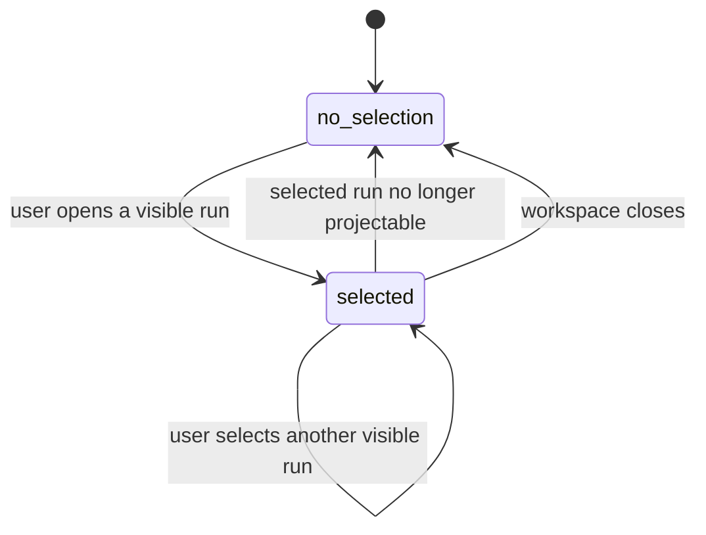
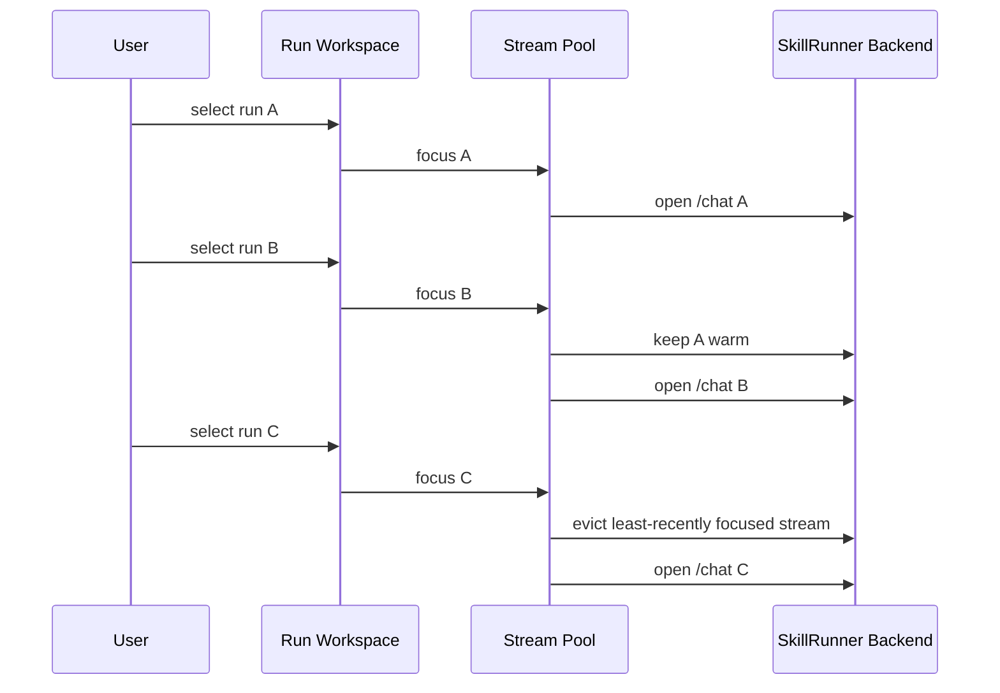
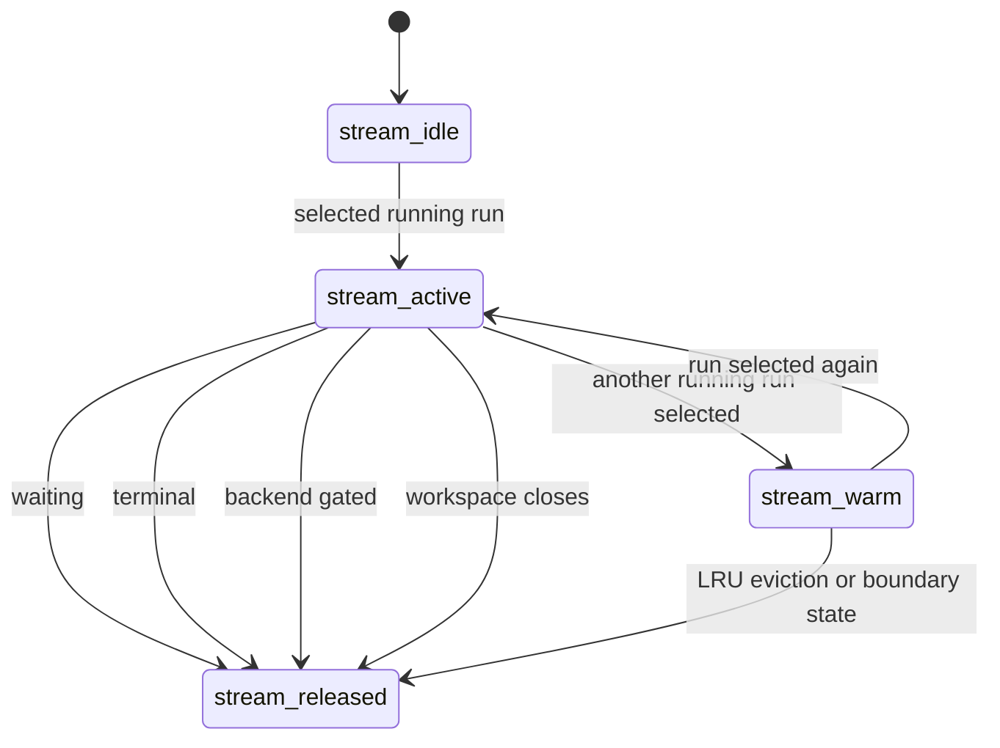
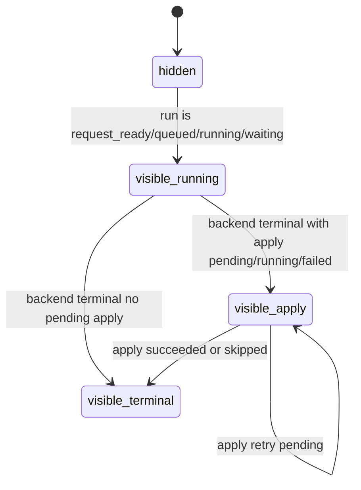

# SkillRunner Run Workspace SSOT

This document defines SkillRunner RunDialog and workspace behavior. The
workspace renders `SkillRunnerRunStore` projections and owns UI stream sessions;
it does not own run truth, terminal settlement, or apply.

## Data Sources

Status source:

- `SkillRunnerRunStore` projection for projectable single runs and sequence
  steps.

Chat source:

- selected or warm UI `/chat` stream session.
- explicit chat history catch-up for cursor gaps, stream errors, and refresh
  actions.

Pending source:

- selected waiting run pending/auth endpoints.
- last-good pending state for the selected waiting run when a transient refresh
  fails.

Apply source:

- apply state projected from the owning SkillRunner run record.

## Workspace Selection

Workspace selection is user-driven.

Rules:

- Provider progress, `request-created`, `request-ready`, reconciler settlement,
  and session sync do not select a run.
- Newly submitted SkillRunner runs do not steal focus.
- If the selected run remains visible after refresh, it remains selected.
- If the selected run is gone, the workspace shows no selected run rather than
  selecting a fallback.
- The workspace never synthesizes temporary rows for request ids that are not
  projected by `SkillRunnerRunStore`.

Invariant IDs: `INV-WS-STATE-RENDER-FROM-LEDGER`,
`INV-WS-FIRST-FRAME-NO-FORCED-RUNNING`.

## UI Stream Pool

Each backend has a bounded MRU pool for UI foreground chat streams.

Rules:

- One backend may keep at most two active UI foreground chat streams.
- A request id may own at most one UI foreground chat stream on a backend.
- The selected running run must have an active or starting stream.
- The most recently selected previous running run may remain warm.
- Repeated switching between the same two running runs reuses streams.
- Selecting a third running run evicts the least-recently focused stream.
- Warm streams update their own session state and cursor but do not replace the
  selected transcript.

Invariant IDs: `INV-WS-CHAT-SSE-SINGLE-OWNER`,
`INV-WS-RUN-DIALOG-SINGLETON`.

## State Boundaries

Rules:

- Waiting, terminal, backend-gated, and workspace-close boundaries release or
  downgrade the owning stream session.
- Stream disconnect does not mark a backend unreachable.
- Backend reachability is governed by maintenance health probes.
- A clean stream close uses lightweight reconnect backoff when the run remains
  selected and running.
- Full metadata, pending, and history refresh is reserved for explicit refresh,
  cursor gaps, stream errors, or waiting-state observation.

Invariant IDs: `INV-WS-BACKEND-FLAGGED-GROUP-DISABLED`,
`INV-WS-PENDING-EDGE-RULES`, `INV-WS-STREAM-POOL-MRU`.

## Deferred Apply Display

Run terminal state and apply state are separate display axes.

Rules:

- A terminal run with apply `pending`, `running`, or `failed` remains visible in
  task projections.
- Deferred apply indicators read apply state from the owning run record.
- Sequence root apply indicators are summaries only; step rows remain the
  authoritative visible owners.
- Apply failure never clears the transcript, pending diagnostics, or task row.

Invariant ID: `INV-WS-DEFERRED-APPLY-VISIBLE`.

## Backend Gating

For a backend with health gating active:

- backend group is disabled
- run opening is blocked
- UI streams owned by that backend are released
- stored task projections remain preserved
- submit selection excludes the gated backend until health recovery

## Debug Connection Audit

Dashboard exposes a debug-only `skillrunner-connection-audit` tab for
SkillRunner connection governor diagnostics.

Rules:

- The tab exists only when debug mode is enabled.
- When debug mode is disabled, Dashboard tab normalization rejects the audit
  tab and snapshot construction does not read governor audit data.
- The audit tab is read-only. It can copy the already-rendered JSON snapshot,
  but it does not abort connections, clear buffers, retry runs, or change
  connection scheduling.
- The snapshot contains only redacted connection metadata: backend id, lane,
  request id, operation label, timestamps, timeout, duration, reason, and error
  name.
- The audit snapshot is diagnostic data only. It is not a source of run truth,
  terminal settlement, backend health, or UI stream ownership.

Invariant ID: `INV-WS-CONNECTION-AUDIT-DEBUG-ONLY`.

## Invariant Catalog

### INV-WS-RUN-DIALOG-SINGLETON

There is one SkillRunner run workspace context. It may render different
selected runs, but parallel workspace instances must not compete for stream
ownership.

### INV-WS-CHAT-SSE-SINGLE-OWNER

Chat stream ownership is bounded by a per-backend two-stream MRU pool. The ID is
the stable invariant identifier for workspace chat stream ownership.

### INV-WS-STATE-RENDER-FROM-LEDGER

Workspace render state comes from `SkillRunnerRunStore` projection.

### INV-WS-BACKEND-FLAGGED-GROUP-DISABLED

Backend-gated groups are disabled and release stream sessions while preserving
stored projections.

### INV-WS-FIRST-FRAME-NO-FORCED-RUNNING

The first frame renders the stored run projection. Refresh failure must not
force the selected run back to running.

### INV-WS-PENDING-EDGE-RULES

Pending/auth UI is refreshed only for selected waiting runs and keeps last-good
state on transient refresh failures.

### INV-WS-STREAM-POOL-MRU

UI foreground streams use a per-backend MRU pool with at most two active
request ids.

### INV-WS-DEFERRED-APPLY-VISIBLE

Terminal runs with pending, running, or failed apply remain visible until apply
state settles.

### INV-WS-CONNECTION-AUDIT-DEBUG-ONLY

SkillRunner connection audit is available only in debug mode, reads governor
diagnostic metadata only when selected, and never mutates connection state.
