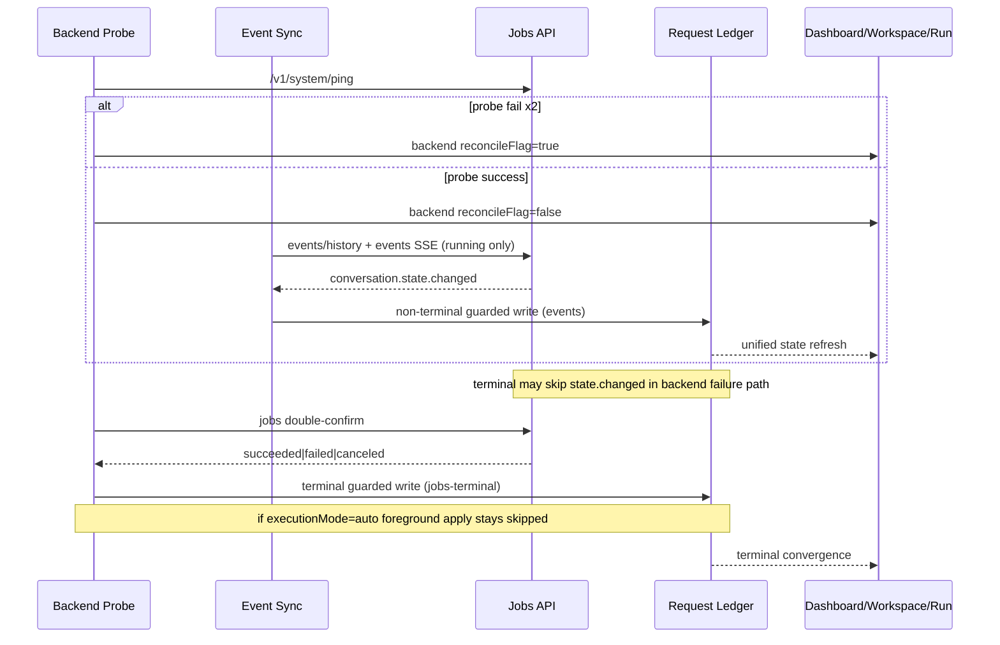

# SkillRunner Provider State Machine SSOT (Lockdown v4)

## 1. Scope

This document is the provider-side SSOT for SkillRunner task observation in plugin runtime.
It defines behavior invariants that are also machine-checked by YAML guardrails.

- Backend jobs semantics are SSOT.
- Plugin is observer-only for non-terminal states.
- Backend-level reconcile gating controls stream and UI access.
- Runtime writes are constrained by explicit source guards.

## 2. Canonical States

- `queued`
- `running`
- `waiting_user`
- `waiting_auth`
- `succeeded`
- `failed`
- `canceled`

Terminal states:

- `succeeded`
- `failed`
- `canceled`

## 3. Truth Inputs

State channel:

- `/v1/jobs/{request_id}/events/history`
- `/v1/jobs/{request_id}/events` SSE

Terminal override channel:

- `/v1/jobs/{request_id}` (double-confirm terminal convergence only)

Display channel:

- `/v1/jobs/{request_id}/chat/history`
- `/v1/jobs/{request_id}/chat` SSE

## 4. Invariant Catalog (Provider)

Each invariant below is normative and machine-referenced by ID.

### INV-PROV-STATE-SETS

- Trigger: any state parse/normalize path.
- Allowed: provider states are exactly the seven canonical states.
- Forbidden: introducing/removing provider state without updating SSOT+YAML+spec+facts export.
- Observability: state-machine guard logs and invariant script mismatch.

### INV-PROV-WRITE-NONTERMINAL-EVENTS

- Trigger: write attempt to `queued/running/waiting_user/waiting_auth`.
- Allowed: write source `events` only.
- Forbidden: reconciler/probe/jobs polling rewriting non-terminal state.
- Observability: guarded write path in request ledger + invariant check.

### INV-PROV-WRITE-TERMINAL-JOBS

- Trigger: write attempt to `succeeded/failed/canceled`.
- Allowed: events terminal or jobs-terminal double-confirm path.
- Forbidden: non-terminal-only sources forcing terminal without confirm path.
- Observability: terminal reconcile logs and guarded ledger writes.

### INV-PROV-BACKEND-HEALTH-BACKOFF

- Trigger: backend health probe failures/success.
- Allowed: backoff cadence `5s -> 15s -> 60s`.
- Forbidden: cadence drift without contract update.
- Observability: health registry state (`backoffLevel`, `nextProbeAt`) + logs.

### INV-PROV-BACKEND-HEALTH-THRESHOLDS

- Trigger: consecutive failures/successes.
- Allowed:
  - enter reconcile flag on 2 consecutive failures
  - recover on 1 success
- Forbidden:
  - single failure directly flagging backend
  - requiring multiple successes to recover.
- Observability: health registry transitions + probe logs.

### INV-PROV-STREAM-EVENT-RUNNING-ONLY

- Trigger: session sync connect/disconnect checks.
- Allowed:
  - auto-connect candidates are `snapshot=running`
  - disconnect event stream on `waiting_user`, `waiting_auth`, or terminal.
- Forbidden:
  - long-lived event streams for waiting/terminal snapshots
  - startup auto-connect for non-running snapshots.
- Observability: `events-stream-disconnected` logs and active session map.

### INV-PROV-STARTUP-RUNNING-ONLY-RECONNECT

- Trigger: plugin startup reconcile/sync bootstrap.
- Allowed: reconnect candidates from ledger snapshot `running` only.
- Forbidden: startup reconnect sweep over waiting/terminal entries.
- Observability: reconnect candidate query and startup sync behavior.

### INV-PROV-UI-GATING-BACKEND-FLAG

- Trigger: backend `reconcileFlag=true`.
- Allowed:
  - block run dialog open
  - hide backend tasks in dashboard home list
  - disable backend tab
  - disable workspace backend group with no bubbles
  - filter backend from submit dialog profile selector.
- Forbidden: flagged backend entering interactive run paths.
- Observability: dashboard/workspace snapshots + open-run guard branch.

### INV-PROV-NO-LEGACY-ID

- Trigger: backend config load/startup normalization.
- Allowed: plugin runtime only treats `local-skillrunner-backend` as managed local backend ID.
- Forbidden: keeping `skillrunner-local` as valid runtime backend id or compat alias.
- Observability: registry sanitation warning + startup purge path for legacy id.

### INV-PROV-MANAGED-LOCAL-REGISTER-ONLY-AFTER-DEPLOY

- Trigger: local managed backend profile creation/sync.
- Allowed:
  - create `local-skillrunner-backend` profile only after deploy success.
  - startup/ensure/start flows may sync existing profile but must not create it.
- Forbidden:
  - auto-injecting managed local backend during initialization.
  - probing managed local backend when it is absent from registry.
- Observability: local runtime deploy/start stages + backend health probe target set.

### INV-PROV-APPLY-OWNER-AUTO

- Trigger: SkillRunner `auto` request reaches terminal `succeeded`.
- Allowed: reconciler is the only `applyResult` executor.
- Forbidden: foreground execution path calling `applyResult` for recoverable `auto`.
- Observability: `foreground-apply-skipped-auto` and reconciler terminal-apply logs.

### INV-PROV-APPLY-OWNER-INTERACTIVE

- Trigger: SkillRunner `interactive` request reaches terminal `succeeded`.
- Allowed: reconciler is the only `applyResult` executor.
- Forbidden: any non-reconciler path applying terminal result.
- Observability: deferred terminal apply logs and context cleanup path.

### INV-PROV-FOREGROUND-APPLY-SKIP-AUTO

- Trigger: foreground apply seam handles a SkillRunner `auto` job after queue idle.
- Allowed: mark request as reconciler-owned pending and defer final summary.
- Forbidden: executing real foreground apply or immediate final summary for that request.
- Observability: apply seam summary payload, runtime log stage `foreground-apply-skipped-auto`, deferred summary tracker state.

## 5. Ledger and Persistence Contract

Ledger persistence is plugin-scope SQLite:

- DB path: `<Zotero.DataDirectory>/zotero-agents/state/zotero-agents.db`
- Store entry: `pluginStateStore`
- Tables:
  - `plugin_task_requests`
  - `plugin_task_contexts`
  - `plugin_task_rows`

Ledger minimum semantics:

- identity: `requestId`
- snapshot: canonical state
- display metadata: backend/workflow/run/task identifiers
- no local chat message persistence

Legacy JSON prefs are migration input only and not runtime truth after migration.

## 6. Reconciler Boundary

Allowed:

1. backend health probing and gating transitions
2. resume eligible running session sync after backend recovery
3. terminal double-confirm
4. terminal side effects:
   - `succeeded` -> apply once
   - `failed/canceled` -> terminal toast

Forbidden:

- non-terminal state driving
- chat stream ownership
- speculative status rewrites while backend is unreachable

## 7. Failure Boundaries

Backend unreachable:

- preserve last-known snapshot
- set backend reconcile flag
- apply backend-level UI/entry gating
- do not clear tasks
- do not downgrade/guess status

Legacy managed local ID:

- any persisted `skillrunner-local` reference is dropped on startup cleanup.
- dropped legacy records are not migrated to `local-skillrunner-backend`.

Backend terminal without terminal `state.changed`:

- converge via jobs terminal double-confirm

Missing recoverable context on terminal success:

- converge state
- skip apply
- emit explicit warning with `missing-context`

Recoverable context with valid terminal success:

- reconciler is the only apply owner for both `auto` and `interactive`
- foreground `auto` success is downgraded to reconciler-owned pending instead of real apply

## 8. Sequence (Simplified)

