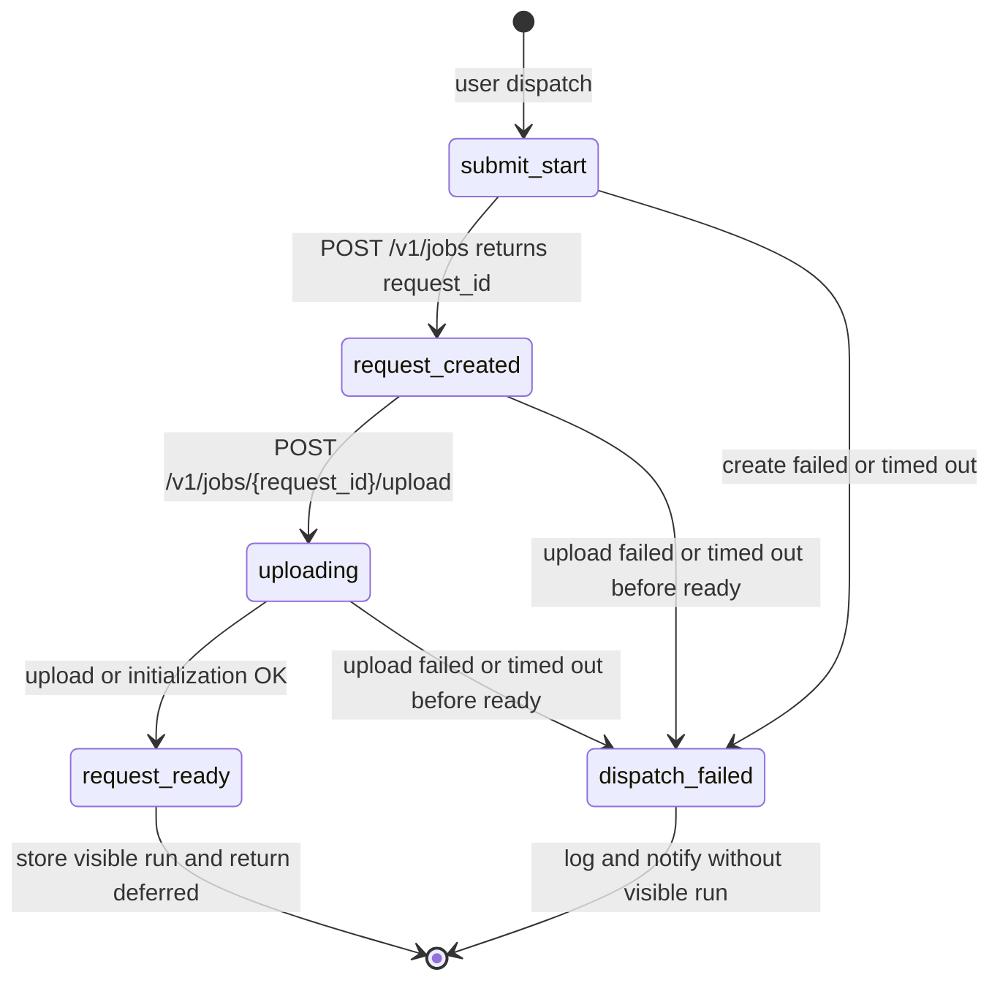
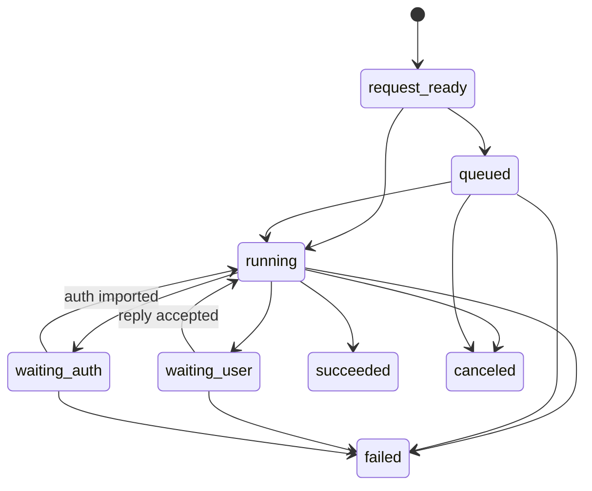
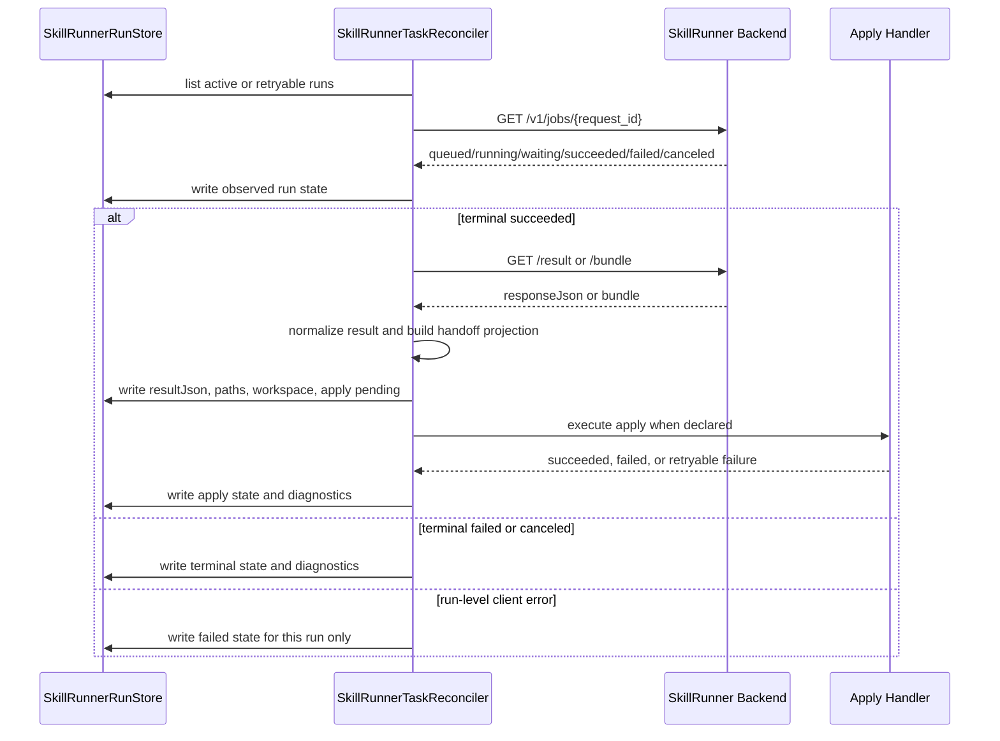
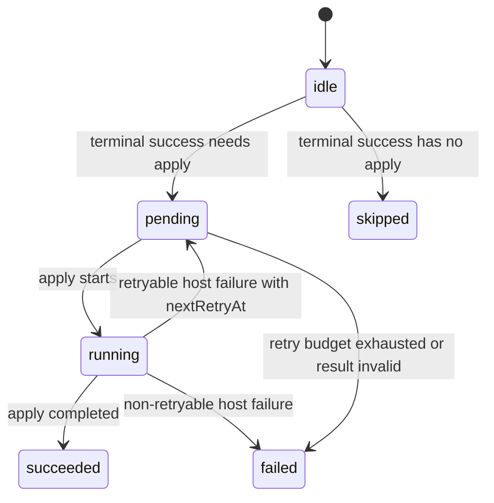
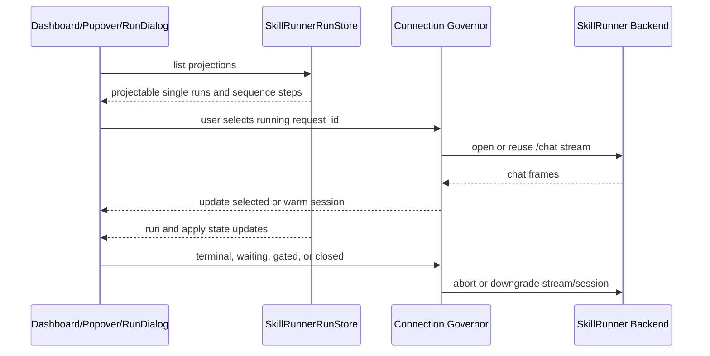

# SkillRunner Frontend Run Settlement SSOT

This document is the current-state source of truth for SkillRunner frontend run
settlement. It defines the Host-side protocol around `/v1/jobs`, local
projection, reconciler settlement, deferred apply, and UI observation.

ACP Skills has its own conversation-owned run model. ACP behavior may be used
as a comparison point, but it is not the execution path for SkillRunner
terminal settlement, apply, or sequence continuation.

## Scope

SkillRunner frontend state has five independent axes:

- Submit lifecycle: request creation, upload, and `request-ready`.
- Backend run lifecycle: backend-owned queued/running/waiting/terminal state.
- Reconciler settlement: terminal confirmation, result or bundle fetch, result
  normalization, and retry scheduling.
- Deferred apply lifecycle: Host-side apply state and failure visibility.
- UI and connection lifecycle: projection, selection, chat streams, and
  backend health gating.

`SkillRunnerRunStore` is the local source of truth for SkillRunner run
projection and settlement state. Task rows, dashboard lists, popovers, and run
workspace views consume projections derived from this store.

## Canonical Backend States

Backend-observed states are:

- `queued`
- `running`
- `waiting_user`
- `waiting_auth`
- `succeeded`
- `failed`
- `canceled`

Terminal backend states are:

- `succeeded`
- `failed`
- `canceled`

The local `request_ready` state is not a backend state. It means the frontend
has created a backend request, uploaded or initialized the skill payload, and
registered a projectable `SkillRunnerRunStore` record.

## Submit Lifecycle

`request-created` and upload are local audit stages. They do not create a
user-visible run row. `request-ready` is the first visible projection point.

Rules:

- `POST /v1/jobs` and `/upload` run in the `submit` lane with bounded request
  timeouts.
- A failure before `request_ready` settles the workflow job as failed and emits
  a request-scoped audit log when a request id exists.
- The provider returns a deferred provider result after `request_ready`.
- The provider does not continue to backend terminal polling after
  `request_ready`.
- The provider does not fetch `/result` or `/bundle`.

Invariant IDs: `INV-PROV-SUBMIT-ONLY-REQUEST-READY`,
`INV-PROV-FIRST-VISIBLE-REQUEST-READY`.

## Backend Run Lifecycle

The plugin observes backend state without inventing non-terminal transitions.

Error classification:

- `400`, `404`, `410`, and `422` after `request_ready` settle only that run as
  failed.
- `401` and `403` remain auth/config errors and are not missing-run states.
- Network failures, timeouts, `429`, and `5xx` are recoverable backend or
  transport failures with backoff.
- A single run-level client error must not mark the backend unreachable.
- Backend health gating is driven by independent maintenance probes.

Invariant IDs: `INV-PROV-STATE-SETS`,
`INV-PROV-WRITE-NONTERMINAL-EVENTS`,
`INV-PROV-WRITE-TERMINAL-JOBS`,
`INV-PROV-BACKEND-HEALTH-BACKOFF`,
`INV-PROV-BACKEND-HEALTH-THRESHOLDS`,
`INV-PROV-UI-GATING-BACKEND-FLAG`.

## Reconciler Settlement

The reconciler is the only owner of SkillRunner terminal fetch, result
normalization, deferred apply, apply retry, and sequence continuation.

Settlement rules:

- Terminal success is not final completion while apply is pending, running, or
  failed.
- `/result` and `/bundle` run in the `settlement` lane.
- Result normalization unwraps SkillRunner response JSON when the actual result
  is under `data`.
- Bundle normalization prefers `result/<skillId>.<n>/result.json` for sequence
  steps and falls back to the flat `result/result.json` only when the namespaced
  result is absent.
- Settlement failure cannot block later submit requests.

Invariant IDs: `INV-PROV-APPLY-OWNER-AUTO`,
`INV-PROV-APPLY-OWNER-INTERACTIVE`,
`INV-PROV-FOREGROUND-APPLY-SKIP-AUTO`,
`INV-PROV-RESULT-NORMALIZATION-OWNER`.

## Deferred Apply Lifecycle

Run state and apply state are separate.

Run states:

- `request_ready`
- `queued`
- `running`
- `waiting_user`
- `waiting_auth`
- `succeeded`
- `failed`
- `canceled`

Apply states:

- `idle`
- `pending`
- `running`
- `succeeded`
- `failed`
- `skipped`

Host-side failures must never leave a run silently suspended:

- Transient fetch, network, or timeout failure records retry state and
  `nextRetryAt`.
- Result JSON parse failure records visible failed apply.
- Missing bundle artifact required by output schema records visible failed
  apply.
- Apply hook failure records visible failed apply.
- Host Bridge failure records visible failed apply.
- Store write failure emits runtime diagnostics and user feedback; if the store
  remains writable, it records failed or retry state.

Invariant IDs: `INV-PROV-HOST-FAILURE-VISIBLE`,
`INV-PROV-APPLY-STATE-SEPARATE`.

## UI And Connection Lifecycle

UI does not own SkillRunner truth. UI selection only chooses what to display and
which UI chat streams are warm.

Rules:

- Dashboard, popover, and RunDialog read projections derived from
  `SkillRunnerRunStore`.
- Newly submitted SkillRunner runs do not steal focus.
- Selection changes only from explicit user UI actions.
- Each backend may keep at most two UI foreground chat streams.
- The selected running run must have a stream; the most recently selected
  previous running run may remain warm.
- Terminal, waiting, backend-gated, and workspace-close paths release or
  downgrade stream sessions.
- Stream disconnect does not mark a backend unreachable.
- Deferred apply indicators read apply state; terminal runs with pending,
  running, or failed apply remain visible.

Invariant IDs: `INV-PROV-STREAM-EVENT-RUNNING-ONLY`,
`INV-PROV-STARTUP-RUNNING-ONLY-RECONNECT`.

## Invariant Catalog

### INV-PROV-STATE-SETS

Provider backend state parsing uses the seven canonical backend states and the
three canonical terminal states listed above.

### INV-PROV-WRITE-NONTERMINAL-EVENTS

Non-terminal backend observations are accepted only from backend observation
channels and must not be invented by UI or apply code.

### INV-PROV-WRITE-TERMINAL-JOBS

Terminal backend convergence may be confirmed by the jobs state endpoint and is
then written through reconciler settlement.

### INV-PROV-BACKEND-HEALTH-BACKOFF

Backend health probes use the configured backoff cadence and are independent of
single-run client errors.

### INV-PROV-BACKEND-HEALTH-THRESHOLDS

Backend gating uses configured failure and recovery thresholds. A single
run-level failure is not a backend outage.

### INV-PROV-STREAM-EVENT-RUNNING-ONLY

Background event observation is limited to running snapshots and must stop at
waiting or terminal boundaries.

### INV-PROV-STARTUP-RUNNING-ONLY-RECONNECT

Startup observation reconnects only active running records. Waiting, terminal,
and apply-retry records are restored by short reconciler work.

### INV-PROV-UI-GATING-BACKEND-FLAG

Backend health gating blocks interactive backend access consistently across
submit selection, dashboard, and run workspace entry points.

### INV-PROV-NO-LEGACY-ID

The managed local backend id is `local-skillrunner-backend`; no alternate
runtime id is valid.

### INV-PROV-MANAGED-LOCAL-REGISTER-ONLY-AFTER-DEPLOY

The managed local backend profile is created only after a successful deploy
operation and is probed only when present in backend configuration.

### INV-PROV-APPLY-OWNER-AUTO

SkillRunner auto jobs are applied only by the reconciler.

### INV-PROV-APPLY-OWNER-INTERACTIVE

SkillRunner interactive jobs are applied only by the reconciler.

### INV-PROV-FOREGROUND-APPLY-SKIP-AUTO

The workflow summary path records SkillRunner jobs as deferred when the
reconciler owns terminal settlement; it does not execute apply for the job.

### INV-PROV-SUBMIT-ONLY-REQUEST-READY

SkillRunner provider execution ends at `request_ready` after successful upload
or initialization.

### INV-PROV-FIRST-VISIBLE-REQUEST-READY

`request_ready` is the first user-visible projection point for a SkillRunner
run.

### INV-PROV-RESULT-NORMALIZATION-OWNER

Result and bundle normalization are reconciler-owned settlement operations.

### INV-PROV-HOST-FAILURE-VISIBLE

Host-side parse, artifact, apply, Host Bridge, and store failures must settle
to visible failed or retry state.

### INV-PROV-APPLY-STATE-SEPARATE

Apply state is tracked separately from backend run state and remains visible
after terminal backend success.
