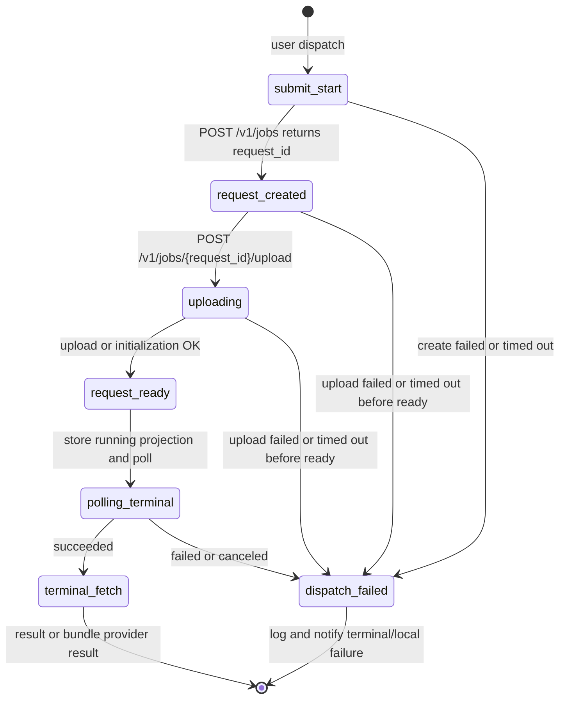
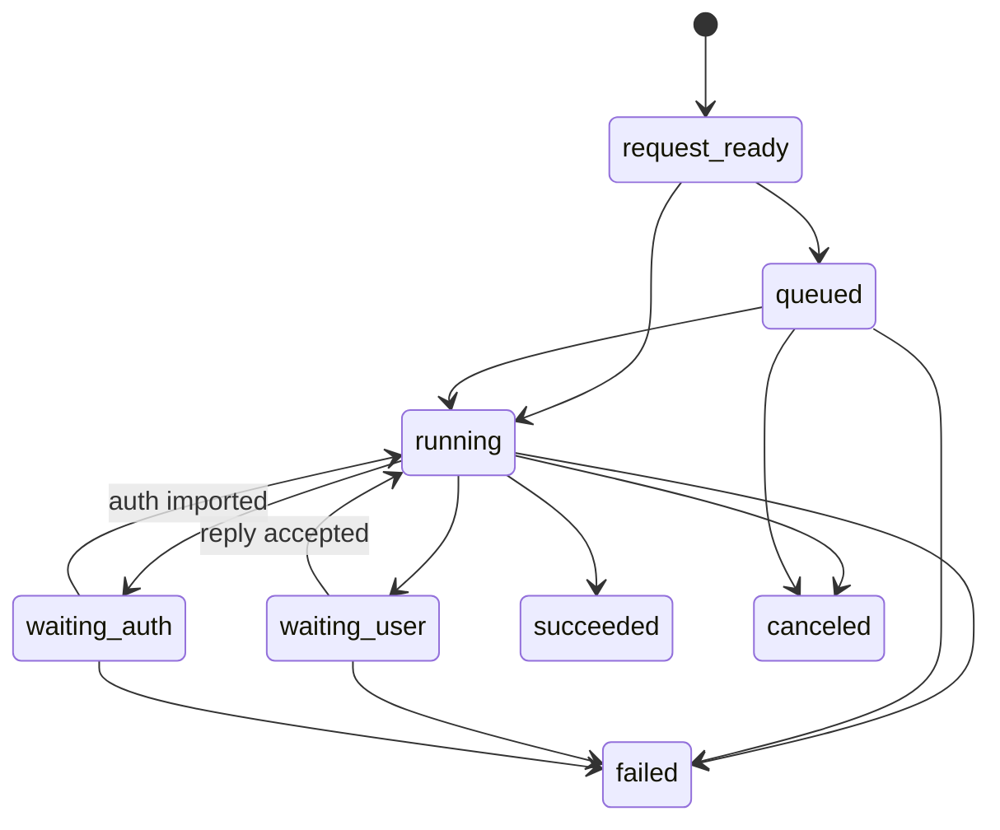
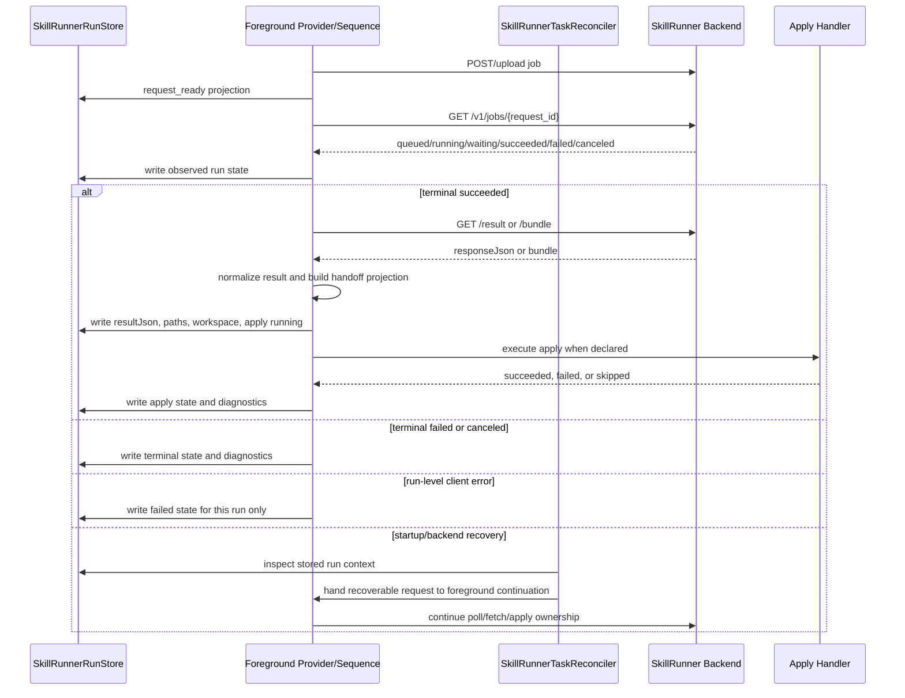
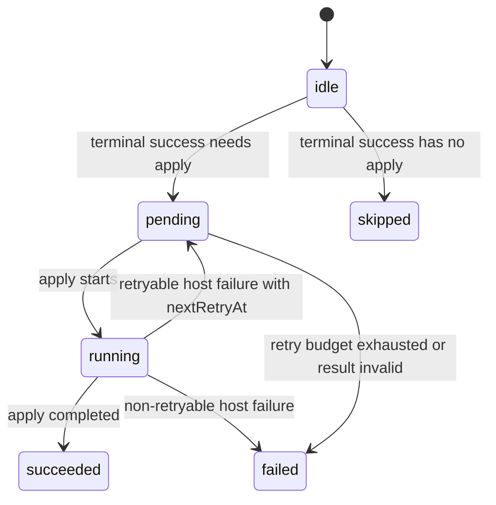
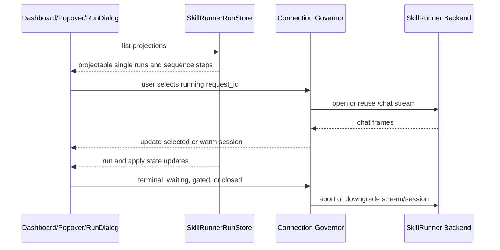

# SkillRunner Frontend Run Settlement SSOT

This document is the current-state source of truth for SkillRunner frontend run
settlement. It defines the Host-side protocol around `/v1/jobs`, local
projection, foreground settlement, recovery reconciliation, apply, and UI
observation.

ACP Skills has its own conversation-owned run model. ACP behavior may be used
as a comparison point, but it is not the execution path for SkillRunner
terminal settlement, apply, or sequence continuation.

## Scope

SkillRunner frontend state has five independent axes:

- Submit lifecycle: request creation, upload, and `request-ready`.
- Backend run lifecycle: backend-owned queued/running/waiting/terminal state.
- Foreground settlement: terminal confirmation, result or bundle fetch, result
  normalization, apply, and recovered-run continuation.
- Deferred apply lifecycle: Host-side apply state and failure visibility.
- UI and connection lifecycle: projection, selection, chat streams, and
  backend enabled/reachable gating.

`SkillRunnerRunStore` is the local source of truth for SkillRunner run
projection and settlement state. Task rows, dashboard lists, popovers, and run
workspace views consume projections derived from this store.

## Canonical Backend States

Backend-observed states are:

- `queued`
- `running`
- `waiting_user`
- `waiting_auth`
- `succeeded`
- `failed`
- `canceled`

Terminal backend states are:

- `succeeded`
- `failed`
- `canceled`

The local `request_ready` phase is not a backend or visible lifecycle state. It
means the frontend has created a backend request, uploaded or initialized the
skill payload, and can project the run as `running` while foreground polling
continues.

## Submit Lifecycle

`request-created` and upload are local audit stages. They do not create a
user-visible run row. `request-ready` is the submit phase that enables the
first visible `running` projection.

Rules:

- `POST /v1/jobs` and `/upload` run in the `submit` lane with bounded request
  timeouts.
- A failure before `request_ready` settles the workflow job as failed and emits
  a request-scoped audit log when a request id exists.
- For `skillrunner.job.v1`, the provider continues after `request_ready`,
  polls `/v1/jobs/{request_id}` to a backend terminal state, then fetches
  `/result` or `/bundle` for terminal success.
- Backend `failed` and `canceled` terminal states return local terminal
  provider results without foreground apply.
- Sequence steps use the foreground step loop for terminal settlement.
  Recovery may only hand stored runs back to foreground continuation.

Invariant IDs: `INV-PROV-SUBMIT-REQUEST-READY-THEN-POLL`,
`INV-PROV-FIRST-VISIBLE-RUNNING`.

## Backend Run Lifecycle

The plugin observes backend state without inventing non-terminal transitions.

Error classification:

- `400`, `404`, `410`, and `422` after `request_ready` settle only that run as
  failed.
- `401` and `403` remain auth/config errors and are not missing-run states.
- Network failures, timeouts, `429`, and `5xx` are recoverable backend or
  transport failures with backoff.
- A single run-level client error must not mark the backend unreachable.
- Backend reachability gating is driven by idle-only health probes and
  successful active SkillRunner connections.

Invariant IDs: `INV-PROV-STATE-SETS`,
`INV-PROV-WRITE-NONTERMINAL-EVENTS`,
`INV-PROV-WRITE-TERMINAL-JOBS`,
`INV-PROV-BACKEND-HEALTH-BACKOFF`,
`INV-PROV-BACKEND-REACHABILITY-POLICY`,
`INV-PROV-UI-GATING-BACKEND-FLAG`.

## Foreground Settlement And Recovery Handoff

Single `skillrunner.job.v1` runs and normal `skillrunner.sequence.v1` runs are
settled by the foreground provider, sequence runtime, and workflow apply path.
Recovered runs are handed to the same foreground continuation path.

Settlement rules:

- Single `skillrunner.job.v1` terminal success fetches and normalizes
  `/result` or `/bundle` in the provider, then `workflowApplySeam` executes
  `applyResult` in the foreground.
- Single `skillrunner.job.v1` terminal failure or cancellation is a local
  terminal provider result and is not foreground-applied.
- Foreground settlement owns normal `skillrunner.sequence.v1`, including step
  apply hooks, handoff, continuation after reply/auth, and root final apply.
- Recovery owns only startup/backend-recovery/local-runtime-up scanning. It
  hands recoverable stored runs to foreground continuation and fails
  unrecoverable missing-context tasks locally.
- Normal interval reconciliation does not poll jobs. Recovery does not fetch
  `/result` or `/bundle`, does not execute apply hooks, and does not write
  `apply.skipped`.
- Terminal success is not final completion while apply is pending, running, or
  failed.
- Recovered `/result` and `/bundle` fetches run through foreground
  continuation.
- Result normalization unwraps SkillRunner response JSON when the actual result
  is under `data`.
- Bundle normalization prefers `result/<skillId>.<n>/result.json` for sequence
  steps and falls back to the flat `result/result.json` only when the namespaced
  result is absent.
- Settlement failure cannot block later submit requests.

Invariant IDs: `INV-PROV-APPLY-OWNER-AUTO`,
`INV-PROV-APPLY-OWNER-INTERACTIVE`,
`INV-PROV-FOREGROUND-APPLY-SINGLE`,
`INV-PROV-RESULT-NORMALIZATION-OWNER`,
`INV-PROV-RECONCILER-ONE-SHOT-MISSING-CONTEXT`.

## Deferred Apply Lifecycle

Run state and apply state are separate.

Run states:

- `request_ready`
- `queued`
- `running`
- `waiting_user`
- `waiting_auth`
- `succeeded`
- `failed`
- `canceled`

Apply states:

- `idle`
- `pending`
- `running`
- `succeeded`
- `failed`
- `skipped`

Host-side failures must never leave a run silently suspended:

- Transient fetch, network, or timeout failure records retry state and
  `nextRetryAt`.
- Result JSON parse failure records visible failed apply.
- Missing bundle artifact required by output schema records visible failed
  apply.
- Apply hook failure records visible failed apply.
- Host Bridge failure records visible failed apply.
- Store write failure emits runtime diagnostics and user feedback; if the store
  remains writable, it records failed or retry state.

Invariant IDs: `INV-PROV-HOST-FAILURE-VISIBLE`,
`INV-PROV-APPLY-STATE-SEPARATE`.

## UI And Connection Lifecycle

UI does not own SkillRunner truth. UI selection only chooses what to display and
which UI chat streams are warm.

Rules:

- Dashboard, popover, and RunDialog read projections derived from
  `SkillRunnerRunStore`.
- Newly submitted SkillRunner runs do not steal focus.
- Selection changes only from explicit user UI actions.
- Each backend may keep at most two UI foreground chat streams.
- The selected running run must have a stream; the most recently selected
  previous running run may remain warm.
- Terminal, waiting, backend-gated, and workspace-close paths release or
  downgrade stream sessions.
- Stream disconnect does not mark a backend unreachable.
- Deferred apply indicators read apply state; terminal runs with pending,
  running, or failed apply remain visible.

Invariant IDs: `INV-PROV-STREAM-EVENT-RUNNING-ONLY`,
`INV-PROV-STARTUP-RUNNING-ONLY-RECONNECT`.

## Invariant Catalog

### INV-PROV-STATE-SETS

Provider backend state parsing uses the seven canonical backend states and the
three canonical terminal states listed above.

### INV-PROV-WRITE-NONTERMINAL-EVENTS

Non-terminal backend observations are accepted only from backend observation
channels and must not be invented by UI or apply code.

### INV-PROV-WRITE-TERMINAL-JOBS

Terminal backend convergence may be confirmed by the jobs state endpoint and is
then written through foreground single-job, sequence, or foreground
continuation settlement. Recovery does not own terminal apply.

### INV-PROV-BACKEND-HEALTH-BACKOFF

Backend health probes use the configured backoff cadence and are independent of
single-run client errors.

### INV-PROV-BACKEND-REACHABILITY-POLICY

SkillRunner submit visibility requires `enabled && reachable`. Reachability
uses idle-only probes with capped backoff, recent successful active connections
skip redundant probes, and unavailable-to-reachable transitions trigger
foreground recovery handoff.

### INV-PROV-STREAM-EVENT-RUNNING-ONLY

Background event observation is limited to running snapshots and must stop at
waiting or terminal boundaries.

### INV-PROV-STARTUP-RUNNING-ONLY-RECONNECT

Startup recovery hands active running records to foreground continuation.
Waiting records stay detached, and apply-retry records are not retried by
recovery.

### INV-PROV-UI-GATING-BACKEND-FLAG

Backend reachability gating blocks interactive backend access consistently
across submit selection, dashboard, and run workspace entry points.

### INV-PROV-NO-LEGACY-ID

The managed local backend id is `local-skillrunner-backend`; no alternate
runtime id is valid.

### INV-PROV-MANAGED-LOCAL-REGISTER-ONLY-AFTER-DEPLOY

The managed local backend profile is created only after a successful deploy
operation and is probed only when present in backend configuration.

### INV-PROV-APPLY-OWNER-AUTO

SkillRunner auto ownership stays with the foreground orchestrator for normal
and recovered execution.

### INV-PROV-APPLY-OWNER-INTERACTIVE

SkillRunner interactive ownership stays with the foreground orchestrator for
normal execution, waiting continuation, and recovered execution.

### INV-PROV-FOREGROUND-APPLY-SINGLE

The workflow summary path applies SkillRunner single-job terminal success in
the foreground. Recovery may only hand work to foreground continuation.

### INV-PROV-SUBMIT-REQUEST-READY-THEN-POLL

SkillRunner single-job provider execution continues after `request_ready` to
poll terminal state and fetch `/result` or `/bundle`.

### INV-PROV-FIRST-VISIBLE-RUNNING

`request_ready` is stored as submit phase only; the first user-visible
lifecycle projection after submit readiness is `running` unless the backend has
already reached waiting or terminal state.

### INV-PROV-RESULT-NORMALIZATION-OWNER

Result and bundle normalization are provider-owned for normal single and
sequence terminal success, and foreground-continuation-owned for recovered
success. Recovery does not fetch or normalize results.

### INV-PROV-RECONCILER-ONE-SHOT-MISSING-CONTEXT

Recovery scans do not run during normal interval reconciliation. They run only
at startup, backend recovery, or managed local runtime post-up boundaries, hand
recoverable work to foreground continuation, and fail missing-context tasks
locally without result fetch or apply.

### INV-PROV-HOST-FAILURE-VISIBLE

Host-side parse, artifact, apply, Host Bridge, and store failures must settle
to visible failed or retry state.

### INV-PROV-APPLY-STATE-SEPARATE

Apply state is tracked separately from backend run state and remains visible
after terminal backend success.
