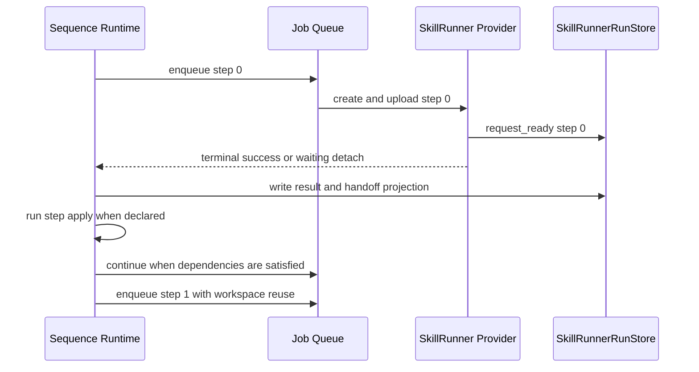

# Workflow Execution Seams

`src/modules/workflowExecution/` implements the workflow execution pipeline as
small seams with explicit contracts and dependency injection. This document
describes the current boundaries that matter for provider execution, sequence
orchestration, result resolution, and apply.

## Pipeline

```text
Preparation -> Duplicate Guard -> Run -> Provider Dispatch -> Apply Summary -> Feedback
                                      |
                                      +-> deferred completion tracker
                                      +-> SkillRunner sequence orchestration
                                      +-> result context and bundle I/O
```

## Preparation Seam

Preparation builds `SelectionContext`, executes workflow `buildRequests`,
resolves backend/profile/runtime options, adapts request shape for the selected
backend, and returns either a ready execution or a halted workflow.

Request adaptation is limited to the selected backend context. Workflow
`provider` remains the backend compatibility source; `request.kind` describes
payload shape after a backend is selected.

## Run Seam

Run seam creates the job queue, computes dispatch concurrency, enqueues
requests, and returns the run state with the queue idle promise.

For ordinary requests, the queue calls the selected provider. For
`skillrunner.sequence.v1`, the sequence runtime orchestrates multiple step
requests. Provider execution never receives the sequence request as a native
SkillRunner backend payload.

SkillRunner job progress:

- `request-created` is request-scoped audit metadata.
- `request-ready` is the first point where a SkillRunner run becomes visible
  through `SkillRunnerRunStore`.
- `skillrunner.job.v1` provider dispatch continues after `request-ready` to
  poll terminal state and fetch `/result` or `/bundle`.
- `skillrunner.job.v1` terminal success is applied by the foreground workflow
  apply seam.
- `skillrunner.sequence.v1` steps use the foreground sequence loop;
  recovery-owned runs use deferred reconciler settlement.

## Apply Summary Seam

Apply summary inspects job outcomes and reports workflow-level completion.

For single SkillRunner jobs, terminal provider success is final workflow
business completion only after foreground `applyResult` succeeds. Backend
terminal failure and cancellation settle as local terminal job outcomes. Normal
SkillRunner sequence work is foreground-owned; only
recovery-owned SkillRunner work is recorded as reconciler-owned pending work and
reflected through deferred completion tracking.

For ACP skill runs, ACP's conversation path continues to own its foreground
result and apply behavior.

## Deferred Completion Tracker

The deferred completion tracker records workflow jobs whose terminal outcome is
not known when the queue goes idle. It receives later settlement events from
SkillRunner reconciler paths and finalizes workflow feedback after all pending
jobs are resolved.

The tracker is summary state only. It is not the source of truth for
SkillRunner run state, sequence state, or apply state.

## SkillRunner Sequence Runtime

`skillrunner.sequence.v1` is a Host-orchestrated sequence of ordinary
SkillRunner step jobs.



Rules:

- Sequence root is non-projectable orchestration state.
- Each step is a projectable SkillRunner run with its own request id.
- Step 0 does not send workspace reuse.
- Step N reuses the previous successful SkillRunner step's backend
  `request_id`.
- Sequence continuation depends on execution success, workspace reuse, and
  required handoff availability.
- Sequence continuation does not depend on Host-side apply success.

## Result And Handoff

Result context is the single entry point for workflow apply hooks and sequence
handoff resolution.

For SkillRunner settlement:

- `/result` responses may contain a response envelope where `data` is the
  business result.
- `/bundle` settlement prefers `result/<skillId>.<n>/result.json` for sequence
  steps.
- Flat `result/result.json` is only a fallback.
- Handoff projection is a JSON object derived from normalized step output.
- Handoff projection is independent from apply.

If handoff projection fails, the sequence continues only when the next step does
not require that handoff.

## Apply Ownership

Single SkillRunner apply is foreground workflow work:

- terminal success triggers provider result or bundle fetch
- provider settlement writes result metadata
- foreground apply state moves through `running` and terminal apply states
- apply failure is visible on the owning run

Normal sequence SkillRunner apply is foreground sequence runtime work:

- terminal success triggers result or bundle settlement
- settlement writes result projection
- step/root apply state moves through `running` and terminal apply states
- apply failure is visible on the owning run

Recovery-owned SkillRunner apply is deferred reconciler work:

- terminal success triggers result or bundle settlement
- settlement writes result projection
- apply state moves through `pending`, `running`, and terminal apply states
- apply failure is visible on the owning run
- retryable failure records retry timing

ACP Skills apply is conversation-path work and writes only ACP run state.

The two models must not share persistence ownership. Shared code may normalize
result shape or construct result context, but it must not decide which store owns
terminal or apply state.

## Bundle I/O

Bundle readers normalize entry paths, reject traversal, and expose a common read
interface to workflow apply hooks.

SkillRunner bundle settlement records:

- normalized result JSON
- result JSON path or bundle entry
- workspace directory when available
- extracted bundle directory when available
- diagnostics for missing artifacts

Missing artifacts required by apply produce visible apply failure or retry
state; they do not leave a hidden in-flight workflow.

## Result Context

`WorkflowResultContext` exposes:

- `resultJson`
- `resultJsonSource`
- `workspaceDir`
- `resultJsonPath`
- `bundleReader`
- warnings and errors
- artifact resolution helpers

Result resolution order is:

1. inline `runResult.resultJson`
2. explicit `resultJsonPath`
3. backend-specific bundle entry chosen by the settlement owner
4. unavailable result with diagnostics

The settlement owner is responsible for choosing the correct backend-specific
bundle entry before apply sees the context.

## Failure Semantics

Host-side failures are ordinary workflow outcomes and must be visible:

- submit failure before `request-ready`: workflow job failed, no visible
  SkillRunner row
- run-level client error after `request-ready`: current run failed
- transient backend failure: backoff or retry without blocking submit
- result parse failure: failed result projection or failed apply
- bundle artifact failure: failed apply when the artifact is required
- apply hook failure: failed apply on the owning run
- Host Bridge failure: failed apply on the owning run
- store write failure: runtime diagnostics and user feedback

No failure path may leave later submit requests waiting on an unbounded
in-flight SkillRunner operation.
