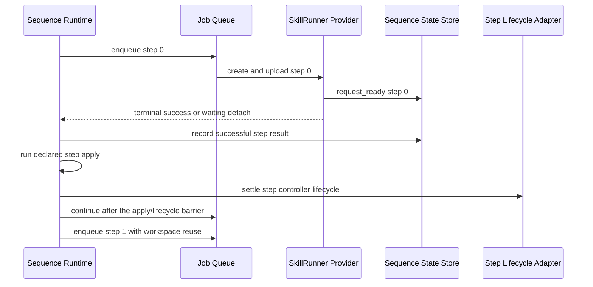

# Workflow Execution Seams

`src/modules/workflowExecution/` implements the workflow execution pipeline as
small seams with explicit contracts and dependency injection. This document
describes the current boundaries that matter for provider execution, sequence
orchestration, result resolution, and apply.

## Pipeline

```text
Preparation -> Duplicate Guard -> Run -> Provider Dispatch -> Apply Summary -> Feedback
                                      |
                                      +-> deferred completion tracker
                                      +-> SkillRunner sequence orchestration
                                      +-> result context and bundle I/O
```

## Preparation Seam

Preparation builds `SelectionContext`, runs the v2 input planner once, executes
workflow request construction for the resulting immutable prepared units,
resolves backend/profile/runtime options, adapts request shape for the selected
backend, and returns either a ready execution or a halted workflow.

Request adaptation is limited to the selected backend context. Workflow
`provider` remains the backend compatibility source; `request.kind` describes
payload shape after a backend is selected.

## Input Planning Phases

`planWorkflowExecutionUnits()` distinguishes availability preview from
confirmed execution:

- availability planning applies only filters declared with
  `phase: "availability"`;
- execute planning reapplies availability filters and also applies
  `phase: "execute"` filters after settings are confirmed;
- parameter-dependent `artifact-absent` filters must declare
  `phase: "execute"` and read only their named workflow parameter.

The planner validates raw selection requirements once, then selects ordered
candidates, applies member/MIME compatibility, filters, candidate cardinality,
and grouping. Candidate skips and top-level unit outcomes remain separate
statistics.

`buildPreparedWorkflowUnitExecution()` consumes an already prepared unit and
must not invoke selection planning again. This preserves global requirements
such as `parents.min: 2` after `grouping: each`. Preflight runs after grouping
and may expand requests inside the unit, but all resulting requests retain one
top-level queue/admission slot.

## Run Seam

Run seam creates the job queue, computes dispatch concurrency, enqueues
requests, and returns the run state with the queue idle promise.

For ordinary requests, the queue calls the selected provider. For
`skillrunner.sequence.v1`, the sequence runtime orchestrates multiple step
requests. Provider execution never receives the sequence request as a native
SkillRunner backend payload.

SkillRunner job progress:

- `request-created` is request-scoped audit metadata.
- `request-ready` is the first point where a SkillRunner run becomes visible
  through `SkillRunnerRunStore`.
- `skillrunner.job.v1` provider dispatch continues after `request-ready` to
  poll terminal state and fetch `/result` or `/bundle`.
- `skillrunner.job.v1` terminal success is applied by the foreground workflow
  apply seam.
- `skillrunner.sequence.v1` steps use the foreground sequence loop;
  recovery-owned runs use deferred reconciler settlement.

## Workflow Job Terminal Resolution

`terminalResolution.ts` owns the synchronous, read-only interpretation of one
workflow job's local queue and canonical lifecycle facts. Its interface accepts
the queue, workflow run id, and job id, then derives request identity and
returns one of four decisions plus a normalized slot status:

- `missing`: the admitted queue job can no longer be read;
- `pending`: local or canonical terminal evidence is incomplete;
- `local-ready`: non-deferred queue execution is terminal and remains owned by
  the apply reducer;
- `canonical-ready`: sequence, SkillRunner, or ACP lifecycle facts already
  provide the terminal outcome and terminal apply evidence.

Slot status uses one vocabulary across queue and canonical facts: `missing`,
`unobserved`, `queued`, `running`, `waiting_user`, `waiting_auth`,
`failed_retriable`, `repairing`, `succeeded`, `failed`, or `canceled`.
Canonical terminal outcomes own the slot status for `canonical-ready`. Pending
and local-ready resolutions sample the same canonical records as the terminal
interpretation; backend canonical paths return `unobserved` when no record
resolves instead of inventing a local fallback. Local job state remains the
fallback only for paths that previously used it, such as pass-through and
SkillRunner sequences without a materialized step request. Sequence state
resolves request identity and does not project its own status into the slot
vocabulary.

Sequence root failure or cancellation owns its terminal class. A running or
missing root keeps the workflow pending. A completed root selects its last
materialized step, but completion alone is not success: missing or non-terminal
step evidence remains pending. Canonical failed or canceled records take
precedence over stale apply-failure evidence, while apply failure after backend
success produces a failed workflow outcome. Canonical success does not bypass
the apply reducer for a locally succeeded, non-deferred result; this preserves
sequence step-owned apply summaries and ordinary foreground apply behavior.

The run and apply seams receive the complete resolver through their dependency
objects. The run seam retains lifecycle subscriptions and settle-once cleanup;
it maps each returned slot status to the submission-slot coordinator actions
without reading lifecycle stores itself. It waits only for `pending`; a missing
admitted job settles observation so the apply seam can report its existing
explicit failure. The apply seam consumes the terminal class and retains local
reduction, apply hooks, lifecycle writes, runtime logs, and bundle cleanup.

The resolution module does not own lifecycle persistence or subscriptions.
Existing store getters can still perform lazy hydration or legacy migration, so
the resolver is not treated as a pure function and does not hide read failures
as pending evidence.

## Apply Summary Seam

Apply summary inspects job outcomes and reports workflow-level completion.

For `skillrunner.sequence.v1` on both ACP and SkillRunner backends, the
sequence root exclusively owns workflow terminal settlement. Terminal or
applied child-step records remain step lifecycle facts while the root is
running; they cannot complete the submission, invoke outer `applyResult`, or
emit the workflow finish summary. Once the root is `completed`, settlement
uses `terminal_step_id` to identify the step that actually ended the sequence.
This keeps short-circuited sequences attached to their real terminal result. A
`failed` or `canceled` root skips outer apply.

The runtime marks the sequence root `completed` before returning a terminal
result to the outer apply seam. A later outer-apply failure may fail the
workflow task and its owning run's apply state, but it does not rewrite the
already completed sequence root.

For single SkillRunner jobs, terminal provider success is final workflow
business completion only after foreground `applyResult` succeeds. Backend
terminal failure and cancellation settle as local terminal job outcomes. Normal
SkillRunner sequence work is foreground-owned; only
recovery-owned SkillRunner work is recorded as reconciler-owned pending work and
reflected through deferred completion tracking.

For ACP skill runs, ACP's conversation path continues to own its foreground
result and apply behavior. Directly valid and output-repaired final results
enter the same pending-apply state, and repair metadata does not change
sequence terminal ownership.

## Deferred Completion Tracker

The deferred completion tracker records workflow jobs whose terminal outcome is
not known when the queue goes idle. It receives later settlement events from
SkillRunner reconciler paths and finalizes workflow feedback after all pending
jobs are resolved.

The tracker is summary state only. It is not the source of truth for
SkillRunner run state, sequence state, or apply state.

## SkillRunner Sequence Runtime

`skillrunner.sequence.v1` is a Host-orchestrated sequence of ordinary
SkillRunner step jobs.


```mermaid
sequenceDiagram
  participant Seq as Sequence Runtime
  participant Queue as Job Queue
  participant Provider as SkillRunner Provider
  participant Store as Sequence State Store
  participant Life as Step Lifecycle Adapter

  Seq->>Queue: enqueue step 0
  Queue->>Provider: create and upload step 0
  Provider->>Store: request_ready step 0
  Provider-->>Seq: terminal success or waiting detach
  Seq->>Store: record successful step result
  Seq->>Seq: run declared step apply
  Seq->>Life: settle step controller lifecycle
  Seq->>Queue: continue after the apply/lifecycle barrier
  Seq->>Queue: enqueue step 1 with workspace reuse
```

Rules:

- Sequence root is non-projectable orchestration state.
- Each step is a projectable SkillRunner run with its own request id.
- Step 0 does not send workspace reuse.
- Step N reuses the previous successful SkillRunner step's backend
  `request_id`.
- Normal provider success and externally observed success enter the same
  advancement path.
- Step apply and lifecycle settlement finish before the next step is launched.
- A failed step apply follows its declared `on_failure` policy: `continue`
  proceeds only after lifecycle settlement; `fail_sequence` settles lifecycle
  and then stops the sequence.
- Replaying the same persisted step/request identity resumes completed phases;
  a different request identity for the same step is rejected.

## Result And Handoff

Result context is the single entry point for workflow apply hooks and sequence
handoff resolution.

For SkillRunner settlement:

- `/result` responses may contain a response envelope where `data` is the
  business result.
- `/bundle` settlement prefers `result/<skillId>.<n>/result.json` for sequence
  steps.
- Flat `result/result.json` is only a fallback.
- Handoff projection is a JSON object derived from normalized step output.
- Handoff projection is independent from apply.

If handoff projection fails, the sequence continues only when the next step does
not require that handoff.

## Apply Ownership

Single SkillRunner apply is foreground workflow work:

- terminal success triggers provider result or bundle fetch
- provider settlement writes result metadata
- foreground apply state moves through `running` and terminal apply states
- apply failure is visible on the owning run

Normal and externally resumed sequence step apply use the shared sequence
runtime:

- terminal success triggers result or bundle settlement
- settlement writes result projection
- step/root apply state moves through `running` and terminal apply states
- apply failure is visible on the owning run
- lifecycle cleanup is an explicit barrier after step apply
- backend-specific cleanup is provided through a lifecycle adapter; the step
  apply seam itself has no controller side effects

Recovery-owned non-sequence SkillRunner apply is deferred reconciler work:

- terminal success triggers result or bundle settlement
- settlement writes result projection
- apply state moves through `pending`, `running`, and terminal apply states
- apply failure is visible on the owning run
- retryable failure records retry timing

ACP Skills apply is conversation-path work and writes only ACP run state.

The two models must not share persistence ownership. Shared code may normalize
result shape or construct result context, but it must not decide which store owns
terminal or apply state.

## Bundle I/O

Bundle readers normalize entry paths, reject traversal, and expose a common read
interface to workflow apply hooks.

`openRunResultBundleReader` owns the run-result-to-reader policy and the temp
zip lifecycle. Non-empty `bundleBytes` write a temp zip and return a handle
whose `dispose()` removes that temp file; `bundleDir` opens a directory reader
without a temp file; anything else opens an unavailable reader. Callers keep
handles open through apply and dispose them in `finally`. Extracted zip
directories remain `ZipBundleReader` state and are not removed by `dispose()`.

SkillRunner bundle settlement records:

- normalized result JSON
- result JSON path or bundle entry
- workspace directory when available
- extracted bundle directory when available
- diagnostics for missing artifacts

Missing artifacts required by apply produce visible apply failure or retry
state; they do not leave a hidden in-flight workflow.

## Result Context

`WorkflowResultContext` exposes:

- `resultJson`
- `resultJsonSource`
- `workspaceDir`
- `resultJsonPath`
- `bundleReader`
- warnings and errors
- artifact resolution helpers

Result resolution order is:

1. inline `runResult.resultJson`
2. explicit `resultJsonPath`
3. backend-specific bundle entry chosen by the settlement owner
4. unavailable result with diagnostics

The settlement owner is responsible for choosing the correct backend-specific
bundle entry before apply sees the context.

## Failure Semantics

Host-side failures are ordinary workflow outcomes and must be visible:

- submit failure before `request-ready`: workflow job failed, no visible
  SkillRunner row
- run-level client error after `request-ready`: current run failed
- transient backend failure: backoff or retry without blocking submit
- result parse failure: failed result projection or failed apply
- bundle artifact failure: failed apply when the artifact is required
- apply hook failure: failed apply on the owning run
- Host Bridge failure: failed apply on the owning run
- store write failure: runtime diagnostics and user feedback

No failure path may leave later submit requests waiting on an unbounded
in-flight SkillRunner operation.

## Execution-unit admission

Preparation produces one ordered `WorkflowRequestBuildPlan`; each
`PreparedWorkflowUnit` is one legal top-level selection unit and the Host queue
outcome boundary. Declarative planning and settings preview do not run provider
preflight, request builders, duplicate prompts, file mutations, or apply hooks.

For ACP Skills and SkillRunner, admission occurs before unit-local provider
preflight and request construction. The admitted unit owns provider fan-out,
sequence execution, aggregate/short-circuit apply, and remains active through
waiting states until provider terminal state and required Host apply settle.
Unit activity and slot ownership are separate: `waiting_user`, `waiting_auth`,
and `failed_retriable` yield the held slot without settling the unit. Reply,
authorization, retry, autonomous local continuation, and Host apply reacquire
the original submission's slot before local or backend work continues.

Resumption admission is a per-submission priority lane. It preserves resumption
request order and runs ahead of untouched initial units after the currently
held work releases a slot; it never competes with another submission. Cancel
does not wait for admission. Shutdown, cancellation, or terminal observation
while yielded cancels any unsent continuation, and slot release and settlement
remain idempotent.

Submission creation also freezes the safe provider/model display labels used by
task projections. ACP reads only `acpModelProvider` and `acpModelId`;
SkillRunner reads only `provider_id`/`engine` and `model`. Missing labels use an
explicit default and arbitrary provider options never cross this seam.
Generic HTTP remains full-parallel outside the Host queue; pass-through remains
serialized outside it.
