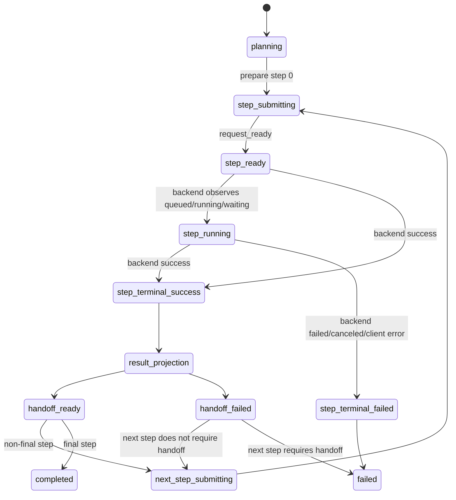
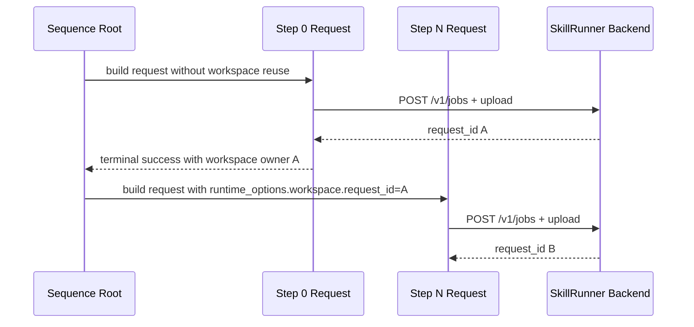
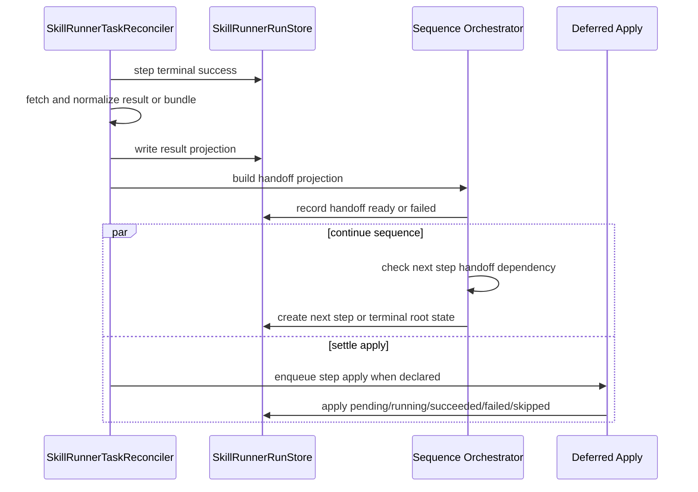

# SkillRunner Sequence State Machine

This document defines the current SkillRunner `skillrunner.sequence.v1`
frontend orchestration contract.

SkillRunner sequence execution is Host-orchestrated. The backend receives
ordinary single-run `/v1/jobs` requests. It does not receive a native sequence
request. ACP Skills may execute sequence steps through their own conversation
model, but ACP foreground step apply is not the SkillRunner model.

## Entities

- Sequence root: non-projectable orchestration record stored in
  `SkillRunnerRunStore`.
- Sequence step: one projectable SkillRunner run with its own backend
  `request_id`.
- Step result projection: normalized JSON output and paths recovered from
  `/result` or `/bundle`.
- Handoff projection: JSON object built from step result projection for later
  step request construction.
- Step apply task: Host-side deferred apply owned by the reconciler.

Root records do not appear as task rows. Step records appear independently in
Dashboard, popover, and RunDialog projections.

## Sequence State

The sequence state machine does not wait for apply success before starting the
next step.

## Step Workspace Rules

Rules:

- Step 0 starts a new backend workspace and must not send a fabricated
  `runtime_options.workspace.request_id`.
- Step N reuses the previous successful SkillRunner step's backend
  `request_id`.
- Each step has its own task identity, request id, result projection, and apply
  state.
- Workspace reuse is independent of whether the previous step's Host-side apply
  has succeeded.

## Result, Handoff, And Apply Split

Rules:

- Execution success enables result projection.
- Result projection enables handoff projection.
- Handoff projection is a JSON input to later request construction.
- Apply is a Host-side side effect and does not gate sequence continuation.
- A step with failed apply remains visible with failed apply state.

## Handoff Failure Policy

If result or handoff projection fails:

- The step remains terminal-success from the backend perspective.
- The projection error is recorded on the step and sequence root.
- If the next step declares that it requires the failed handoff, the sequence
  stops failed.
- If the next step does not require that handoff, the sequence continues using
  workspace reuse and available defaults.
- Apply failure is not handoff failure unless the workflow explicitly uses
  apply output as handoff input, which SkillRunner sequence does not do by
  default.

## Deferred Apply Policy

Step apply states are:

- `idle`
- `pending`
- `running`
- `succeeded`
- `failed`
- `skipped`

Deferred apply may complete after later steps have already started. UI must show
the step apply state on the owning step, not on the sequence root alone.

Host-side failures:

- result parse failure: visible failed projection or failed apply depending on
  where it is detected
- bundle artifact missing: visible failed apply when the apply hook requires the
  artifact
- apply hook failure: visible failed apply
- Host Bridge failure: visible failed apply
- transient settlement fetch failure: retry state with `nextRetryAt`
- store write failure: runtime diagnostics and user feedback; if the store is
  writable again, failed or retry state is recorded

## Terminal Rules

- A failed or canceled step stops the sequence unless the step contract
  explicitly supports non-terminal continuation for that failure class.
- A final step with successful result projection completes the sequence root.
- Final step apply may still be pending, running, failed, or succeeded after
  root completion.
- A sequence root is not a task row. The user's visible work is represented by
  projectable step records.

## Invariants

- Sequence continuation is Host orchestration state, not backend skill state.
- SkillRunner sequence state is stored in `SkillRunnerRunStore`.
- Step result and handoff projection are independent from Host-side apply.
- Downstream execution depends on step execution, workspace reuse, and required
  handoff availability.
- Downstream execution does not depend on apply success.
- Each step owns its request id, result projection, apply state, and visible
  task row.
