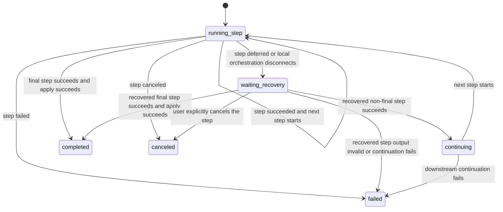

# SkillRunner Sequence Recovery State Machine

## Scope

This document defines Host orchestration behavior for
`skillrunner.sequence.v1` workflows executed through ACP SkillRunner-compatible
steps. The state machine belongs to the Host orchestrator. It does not change
skill-facing `input`, `parameter`, `runtime_options`, workspace files, payload
schemas, or final result contracts.

ACP Skills prompt-turn controls are defined by
`doc/acp-skills-state-machine-ssot.md`. In this sequence document, `canceled`
means terminal task cancellation or provider terminal cancellation. It does not
mean current-turn cancel or local disconnect.

## Entities

- Sequence run: one workflow job executing a `skillrunner.sequence.v1` request.
- Step run: one ACP skill run launched for a sequence step.
- Sequence state: Host-persisted orchestration state keyed by
  `workflowRunId`.
- ACP run record: Host-persisted step record keyed by the step `requestId`.

Each ACP step run record stores:

- `workflowId`: parent workflow id.
- `workflowLabel`: parent workflow label.
- `runId`: parent workflow run id.
- `jobId`: parent workflow job id.
- `skillId`: current step skill id.
- `sequenceStepId`: current sequence step id.
- `sequenceFinalStepId`: declared final sequence step id.

The sequence state stores the original sequence request, backend id,
provider options, current step index, final step id, root request id, and the
completed step outputs needed for downstream handoff mapping.

## States

### `running_step`

The Host has launched a step or is about to launch it. Before launching, the
Host records the current step index. When ACP creates the step request, the
Host records the step `requestId` in sequence state.

### `waiting_recovery`

The current step has a recoverable ACP request and the local sequence loop is
not continuing. The Host must not launch downstream steps while this state is
active.

### `continuing`

A non-final step recovered successfully. The Host records the recovered output
as that step result, rebuilds handoff context from persisted sequence state,
and starts the next step.

### `completed`

The final step has succeeded and the workflow apply path has completed.

### `failed` / `canceled`

The sequence is terminal. Downstream steps must not start after a failed or
explicitly canceled step.

## Events

### Step Request Created

When the ACP provider reports `request-created`, Host records the step
`requestId`. The first step request id becomes `rootRequestId`, which is used to
keep the parent workflow task row connected to the sequence.

### Step Succeeded

Host records the step output and provider result. If the step is not final, the
next step starts with normal handoff mapping. If the step is final, workflow
apply runs once.

### Step Deferred

Host records the current step result and moves the sequence to
`waiting_recovery`. Downstream steps are not started.

### Step Failed Or Task Canceled

Host marks the sequence `failed` or `canceled` and stops. Current-turn cancel
and local disconnect keep the step recoverable and do not trigger sequence
terminal cancellation.

### Recovered Step Output Succeeded

If the recovered ACP run is a non-final sequence step, Host locates the sequence
state by step `requestId`, records the recovered result, and continues from the
next step. If the recovered ACP run is the final step, Host uses the existing
workflow apply path with the parent workflow id stored in the ACP run record.

If no sequence state exists for a recovered non-final step, Host returns a
structured error that includes `requestId`, `workflowId`, `skillId`, and
`sequenceStepId`.

## Invariants

- Sequence continuation is Host orchestration state, not skill state.
- No sequence recovery file is written into the ACP workspace.
- Step `skillId` remains the current skill id; parent workflow ownership is
  recorded separately in `workflowId`.
- Intermediate recovered steps never run workflow apply.
- A failed or task-canceled step terminates the sequence.
- Current-turn cancel and local disconnect do not terminate the sequence.
- Downstream handoff mapping uses only persisted completed step outputs.
