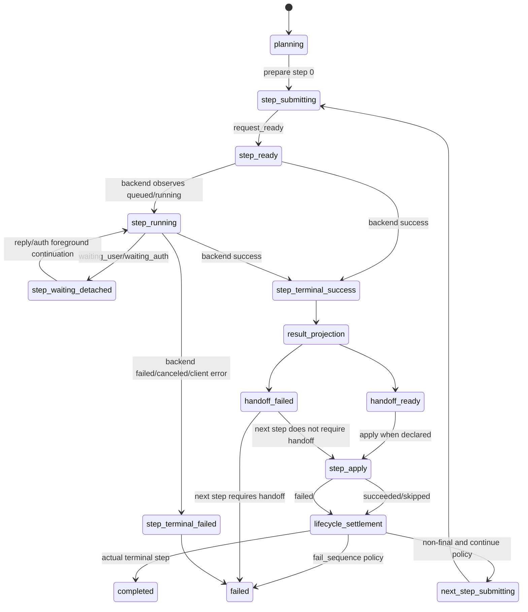
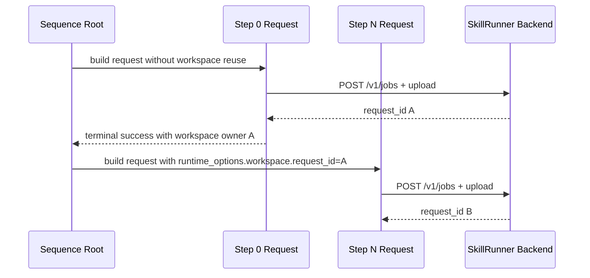
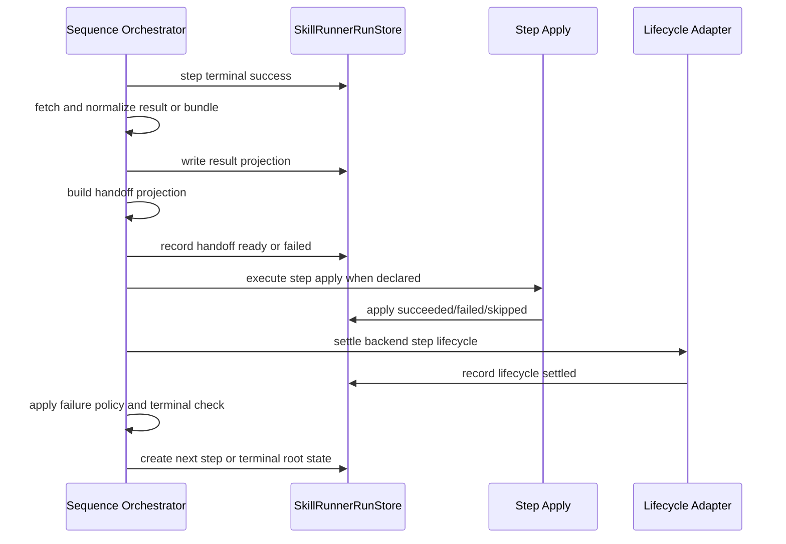

# SkillRunner Sequence State Machine

This document defines the current SkillRunner `skillrunner.sequence.v1`
frontend orchestration contract.

SkillRunner sequence execution is Host-orchestrated. The backend receives
ordinary single-run `/v1/jobs` requests. It does not receive a native sequence
request. ACP Skills may execute sequence steps through their own conversation
model, but ACP foreground step apply is not the SkillRunner model.

## Entities

- Sequence root: non-projectable orchestration record stored in
  `SkillRunnerRunStore`.
- Sequence step: one projectable SkillRunner run with its own backend
  `request_id`.
- Step result projection: normalized JSON output and paths recovered from
  `/result` or `/bundle`.
- Handoff projection: JSON object built from step result projection for later
  step request construction.
- Step apply task: Host-side apply owned by the sequence runtime for both
  normal provider completion and externally observed completion.
- Step lifecycle adapter: backend-specific cleanup invoked by the sequence
  runtime after step apply. ACP uses it to settle and detach controllers;
  SkillRunner does not need a controller adapter.

Root records do not appear as task rows. Step records appear independently in
Dashboard, popover, and RunDialog projections.

## Sequence State

```mermaid
stateDiagram-v2
  [*] --> planning
  planning --> step_submitting: prepare step 0
  step_submitting --> step_ready: request_ready
  step_ready --> step_running: backend observes queued/running
  step_running --> step_waiting_detached: waiting_user/waiting_auth
  step_waiting_detached --> step_running: reply/auth foreground continuation
  step_ready --> step_terminal_success: backend success
  step_running --> step_terminal_success: backend success
  step_running --> step_terminal_failed: backend failed/canceled/client error

  step_terminal_success --> result_projection
  result_projection --> handoff_ready
  result_projection --> handoff_failed

  handoff_ready --> step_apply: apply when declared
  handoff_failed --> step_apply: next step does not require handoff
  step_apply --> lifecycle_settlement: succeeded/skipped
  step_apply --> lifecycle_settlement: failed
  lifecycle_settlement --> next_step_submitting: non-final and continue policy
  lifecycle_settlement --> completed: actual terminal step
  lifecycle_settlement --> failed: fail_sequence policy
  handoff_failed --> failed: next step requires handoff

  step_terminal_failed --> failed
  next_step_submitting --> step_submitting
```

The next step starts only after result projection, any declared step apply, and
backend lifecycle settlement have finished. Apply success itself is governed
by the step's `on_failure` policy.

## Step Workspace Rules

```mermaid
sequenceDiagram
  participant Root as Sequence Root
  participant Step0 as Step 0 Request
  participant StepN as Step N Request
  participant Backend as SkillRunner Backend

  Root->>Step0: build request without workspace reuse
  Step0->>Backend: POST /v1/jobs + upload
  Backend-->>Step0: request_id A
  Step0-->>Root: terminal success with workspace owner A

  Root->>StepN: build request with runtime_options.workspace.request_id=A
  StepN->>Backend: POST /v1/jobs + upload
  Backend-->>StepN: request_id B
```

Rules:

- Step 0 starts a new backend workspace and must not send a fabricated
  `runtime_options.workspace.request_id`.
- Step N reuses the previous successful SkillRunner step's backend
  `request_id`.
- Each step has its own task identity, request id, result projection, and apply
  state.
- Workspace reuse remains available when a failed step apply declares
  `on_failure: "continue"`; continuation still waits for apply and lifecycle
  settlement first.

## Result, Handoff, And Apply Split

```mermaid
sequenceDiagram
  participant Seq as Sequence Orchestrator
  participant Store as SkillRunnerRunStore
  participant Apply as Step Apply
  participant Life as Lifecycle Adapter

  Seq->>Store: step terminal success
  Seq->>Seq: fetch and normalize result or bundle
  Seq->>Store: write result projection
  Seq->>Seq: build handoff projection
  Seq->>Store: record handoff ready or failed
  Seq->>Apply: execute step apply when declared
  Apply->>Store: apply succeeded/failed/skipped
  Seq->>Life: settle backend step lifecycle
  Life->>Store: record lifecycle settled
  Seq->>Seq: apply failure policy and terminal check
  Seq->>Store: create next step or terminal root state
```

Rules:

- Execution success enables result projection.
- Result projection enables handoff projection.
- Handoff projection is a JSON input to later request construction.
- Apply and lifecycle settlement form a barrier before continuation.
- A step with failed apply remains visible with failed apply state.
- `on_failure: "continue"` preserves that failed state and advances after the
  barrier. `on_failure: "fail_sequence"` preserves it and fails the root.

## Handoff Failure Policy

If result or handoff projection fails:

- The step remains terminal-success from the backend perspective.
- The projection error is recorded on the step and sequence root.
- If the next step declares that it requires the failed handoff, the sequence
  stops failed.
- If the next step does not require that handoff, the sequence continues using
  workspace reuse and available defaults.
- Apply failure is not handoff failure. Its continuation behavior comes from
  the step apply policy.

## Apply Policy

Step apply states are:

- `idle`
- `pending`
- `running`
- `succeeded`
- `failed`
- `skipped`

The runtime records step apply before it starts a later step. UI must show a
failed step apply on the owning step even when `on_failure: "continue"` allows
the sequence to advance.

Host-side failures:

- result parse failure: visible failed projection or failed apply depending on
  where it is detected
- bundle artifact missing: visible failed apply when the apply hook requires the
  artifact
- apply hook failure: visible failed apply
- Host Bridge failure: visible failed apply
- transient settlement fetch failure: retry state with `nextRetryAt`
- store write failure: runtime diagnostics and user feedback; if the store is
  writable again, failed or retry state is recorded

## Terminal Rules

- A failed or canceled step stops the sequence unless the step contract
  explicitly supports non-terminal continuation for that failure class.
- A final or short-circuiting step completes the sequence root after its step
  apply and lifecycle responsibilities settle.
- Sequence results record both the declared `final_step_id` and the actual
  `terminal_step_id`.
- If the actual terminal step does not own step-level apply, the runtime marks
  the root completed before the caller performs outer workflow apply.
- Outer apply failure updates the workflow task and owning run apply state; it
  does not reopen or fail an already completed root.
- A terminal root cannot be reopened, and an already bound step request id
  cannot be replaced by a conflicting completion.
- A sequence root is not a task row. The user's visible work is represented by
  projectable step records.

## Invariants

- Sequence continuation is Host orchestration state, not backend skill state.
- SkillRunner sequence state is stored in `SkillRunnerRunStore`.
- Step result and handoff projection are independent from Host-side apply.
- Downstream execution depends on step execution, workspace reuse, and required
  handoff availability, then crosses the apply/lifecycle barrier.
- Step apply failure follows its explicit policy after cleanup completes.
- Each step owns its request id, result projection, apply state, and visible
  task row.
