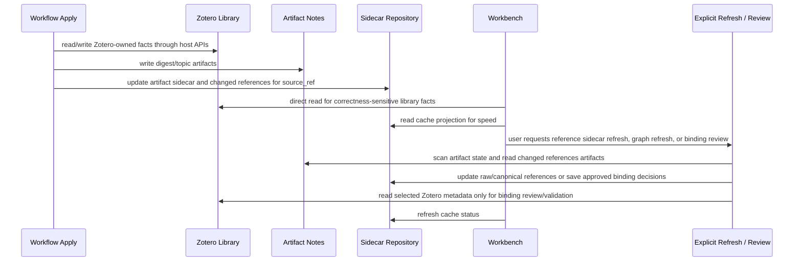

# Synthesis Layer Documentation

This directory is the canonical design anchor for the Synthesis Layer. It replaces the previous split governance/engineering document set, now archived under `doc/deprecated/synthesis-layer-legacy-20260531/`.

## Reading Order

1. [Glossary](./glossary.md) defines terms and IDs. Use it before changing code, docs, debug output, or UI copy.
2. [Library SSOT and Sidecar Cache](./library-ssot-and-sidecar-cache.md) defines the new boundary: Zotero Library is the source of truth and Synthesis persistence is a stale-tolerant sidecar cache plus user-approved derived decisions.
3. [Domain Model](./domain-model.md) defines ownership, dependency direction, and coupling limits.
4. [Reference Sidecar and Citation Graph](./registry-and-citation-graph.md) defines artifact sidecar, raw/canonical references, binding review, related items sync, and graph view semantics.
5. [Reference Resolution](./reference-resolution.md) defines the executable citation matcher and external dedupe policy.
6. [Topics and Discovery](./topics-and-discovery.md) defines topic artifacts, source check, coverage, best-effort discovery, and user review/override behavior.
7. [Concepts](./concepts.md) defines Concept KB proposal ingestion, overlay context, review actions, and failure semantics.
8. [Runtime and Rebuild](./runtime-and-rebuild.md) defines explicit cache refresh/review operations, reset/import/export, and failure recovery.
9. [Git Sync Durable State](./git-sync-durable-state.md) defines Git as the first-class cross-device durable-state exchange store and SQLite as the local materialized store.
10. [Performance and Scale](./performance-and-scale.md) defines scale tiers, p95 targets, explicit operation budgets, and degraded-cache behavior.
11. [State Machines](./state-machines.md) defines canonical object lifecycle transitions and forbidden transitions.
12. [Sequences](./sequences.md) defines canonical cross-domain runtime flows.
13. [Persistence and Files](./persistence-and-files.md) defines sidecar runtime state and the file write boundary.
14. [Workbench UI](./workbench-ui.md) defines user-facing cache state, graph, review, explicit refresh, and dangerous action behavior.

Related active contracts outside this directory:

- [Synthesis Review Input](../../openspec/specs/synthesis-review-input-contract/spec.md) defines the downstream review workflow DTO.
- [Topic Synthesis Manifest Sidecars](../../openspec/changes/archive/2026-05-31-strengthen-topic-synthesis-skill-contracts/specs/topic-synthesis-runtime-contract/spec.md) defines the runtime manifest sidecar contract.

Machine-readable contracts are intentionally small:

- [states-and-events.yaml](./contracts/states-and-events.yaml) contains stable state machine, sequence, and event IDs.
- [invariants.yaml](./contracts/invariants.yaml) contains invariant IDs that tests/debug output may reference.

## Context Map

```mermaid
flowchart LR
  platform["Workflow / Skill Provider / Host Bridge"]
  zotero["Zotero Library"]
  artifacts["Derived Artifact Notes"]
  artifactSidecar["Artifact Sidecar"]
  refs["Raw / Canonical References"]
  bindings["Reference Bindings"]
  graph["Citation Graph Cache"]
  tags["Tags"]
  topics["Topics"]
  concepts["Concepts"]
  ui["Synthesis Workbench"]

  platform --> zotero
  zotero --> artifacts
  artifacts --> artifactSidecar
  artifacts --> refs
  refs --> bindings
  refs --> graph
  bindings --> graph
  zotero -. direct read / SSOT .-> topics
  artifacts -. direct read .-> topics
  artifacts --> topics
  tags --> topics
  graph -. optional metrics .-> topics
  topics --> concepts
  concepts -. overlay context .-> topics
  artifactSidecar --> ui
  refs --> ui
  bindings --> ui
  graph --> ui
  topics --> ui
  tags --> ui
  concepts --> ui
```

## Runtime Flow



Dirty events, WorkItems, WorkRuns, startup reconcile, queue drain, and Registry rebuild are removed implementation targets. Active code must not retain them as compatibility mechanisms.

## Target Rules

- Zotero Library is the SSOT for library facts.
- Derived artifact notes and embedded payload attachments are the SSOT for workflow artifacts.
- Synthesis sidecar storage is a cache projection unless the row is an explicit user-approved reference/binding/dedupe decision.
- Artifact sidecar rows record artifact existence/hash/locator only; they do not copy Zotero item metadata.
- Raw references are keyed by `source_ref` and `references_artifact_hash`; canonical references and bindings are Synthesis sidecar facts.
- Index/cache state may be stale, missing, or partially refreshed without blocking literature digest or topic synthesis.
- Library-wide synchronization is not automatic. Broad cache refresh, reference binding review, and graph rebuild are explicit user/debug operations.
- Topic freshness reads the topic source manifest against current Zotero/artifact state; it does not depend on Reference/Graph cache freshness.
- Git Sync is the first-class cross-device durable-state exchange mechanism; it exports deterministic assets and never synchronizes the live SQLite file.

## Maintenance Rules

- Prefer updating one canonical document rather than copying definitions across files.
- Any new term must first be added to [Glossary](./glossary.md).
- Any new stable state machine, sequence, event, or invariant ID must be added to the matching contract YAML and referenced from one Markdown document.
- Do not reintroduce automatic library-wide synchronization, dirty events, WorkItems, WorkRuns, startup reconcile, queue drain, or Registry rebuild unless the runtime model is explicitly redesigned through a new change.
- Archive historical alternatives under `doc/deprecated/`; do not mix them into active design docs.

## Implementation Status

| Area | Status | Notes |
| --- | --- | --- |
| Library SSOT boundary | hard-cut target | Zotero Library/artifacts are SSOT and Synthesis is sidecar cache plus explicit decisions. |
| SQLite sidecar repository | hard-cut target | Replace Registry-as-fact-source and all queue/job tables with sidecar cache, decision, and explicit operation tables. |
| Reference and binding cache | hard-cut target | Artifact sidecar, raw references, canonical references, redirects, and binding decisions replace Registry-as-library-index. |
| Citation Graph cache | hard-cut target | Structure, metrics, and layout are cache projections refreshed explicitly. |
| Topics | hard-cut target | Topic source check/discovery read Zotero/artifacts directly and remain soft-coupled from graph cache. |
| Concepts | unchanged target | Concept KB remains a sibling domain; proposal ingestion and overlay remain bounded and optional. |
| Discovery | hard-cut target | Normal discovery is digest-apply-time token/phrase overlap, not global n x m matching. |
| Reference Resolution | hard-cut target | Matcher output becomes graph-affecting only through deterministic safe apply or explicit decisions. |
| Explicit Operations | hard-cut target | User/debug-triggered operations replace dirty events, WorkItems, WorkRuns, startup reconcile, queue drain, and Registry rebuild. |
| Workbench UI | hard-cut target | UI presents cache status, explicit operations, and Review & Overrides management. |
