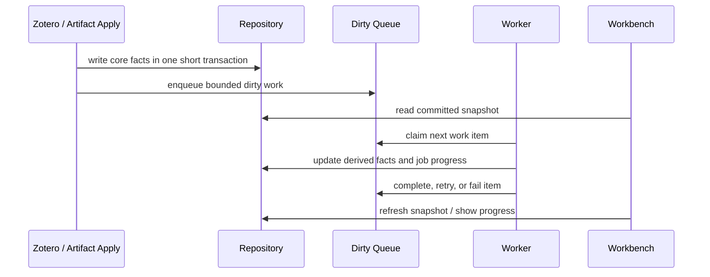

# Synthesis Layer Documentation

This directory is the canonical design anchor for the Synthesis Layer. It replaces the previous split governance/engineering document set, now archived under `doc/deprecated/synthesis-layer-legacy-20260531/`.

## Reading Order

1. [Glossary](./glossary.md) defines terms and IDs. Use it before changing code, docs, debug output, or UI copy.
2. [Domain Model](./domain-model.md) defines ownership, dependency direction, and coupling limits.
3. [Registry and Citation Graph](./registry-and-citation-graph.md) defines the Registry Cache, reference resolution, external work dedupe, related items sync, and graph view semantics.
4. [Reference Resolution](./reference-resolution.md) defines the executable citation matcher and external dedupe policy.
5. [Topics and Discovery](./topics-and-discovery.md) defines topic artifacts, source check, coverage, best-effort discovery, and user review/override behavior.
6. [Concepts](./concepts.md) defines Concept KB proposal ingestion, overlay context, review actions, and failure semantics.
7. [Runtime and Rebuild](./runtime-and-rebuild.md) defines events, dirty queue, workers, epochs, rebuild/reset/import/export, and failure recovery.
8. [Performance and Scale](./performance-and-scale.md) defines scale tiers, p95 targets, worker budgets, and drift thresholds.
9. [State Machines](./state-machines.md) defines canonical object lifecycle transitions and forbidden transitions.
10. [Sequences](./sequences.md) defines canonical cross-domain runtime flows.
11. [Persistence and Files](./persistence-and-files.md) defines SQLite-first runtime state and the `data/synthesis` file write boundary.
12. [Workbench UI](./workbench-ui.md) defines user-facing state, jobs, graph, review, and dangerous action behavior.

Related active contracts outside this directory:

- [Synthesis Review Input](../../openspec/specs/synthesis-review-input-contract/spec.md) defines the downstream review workflow DTO.
- [Topic Synthesis Manifest Sidecars](../../openspec/changes/strengthen-topic-synthesis-skill-contracts/specs/topic-synthesis-runtime-contract/spec.md) defines the runtime manifest sidecar contract.

Machine-readable contracts are intentionally small:

- [states-and-events.yaml](./contracts/states-and-events.yaml) contains stable state machine, sequence, and event IDs.
- [invariants.yaml](./contracts/invariants.yaml) contains invariant IDs that tests/debug output may reference.

## Context Map

```mermaid
flowchart LR
  platform["Workflow / Skill Provider / Host Bridge"]
  zotero["Zotero Library"]
  artifacts["Derived Artifact Notes"]
  registry["Paper Registry Cache"]
  graph["Citation Graph"]
  tags["Tags"]
  topics["Topics"]
  concepts["Concepts"]
  ui["Synthesis Workbench"]

  platform --> zotero
  zotero --> artifacts
  zotero --> registry
  artifacts --> registry
  registry --> graph
  artifacts --> topics
  tags --> topics
  graph -. optional metrics .-> topics
  topics --> concepts
  concepts -. overlay context .-> topics
  registry --> ui
  graph --> ui
  topics --> ui
  tags --> ui
  concepts --> ui
```

## Runtime Flow



## Maintenance Rules

- Prefer updating one canonical document rather than copying definitions across files.
- Any new term must first be added to [Glossary](./glossary.md).
- Any new stable state machine, sequence, event, or invariant ID must be added to the matching contract YAML and referenced from one Markdown document.
- Do not reintroduce distributed-system queue or audit machinery unless the runtime model changes.
- Archive historical alternatives under `doc/deprecated/`; do not mix them into active design docs.

## Implementation Status

| Area | Status | Notes |
| --- | --- | --- |
| SQLite-first repository | partial | Main Registry/Graph paths are DB-backed; file write boundary still needs tightening. |
| Registry Cache | partial | Core facts exist; rebuild protection and related-items sync are still being finalized. |
| Citation Graph | mostly implemented | Structure, metrics, layout, and Workbench graph exist; display semantics are being refined. |
| Topics | partial | Topic artifacts exist; source check/discovery should remain soft-coupled from Registry. |
| Concepts | partial | Concept KB exists as a sibling domain; proposal ingestion and overlay remain bounded and optional. |
| Discovery | target contract only | Latest target is digest-apply-time token/phrase overlap, not global n x m matching. |
| Reference Resolution | partial | Matcher exists and must be governed by fixture/gold-label evaluation before policy changes. |
| Runtime jobs | partial | Dirty events and progress exist; worker contracts should remain simple local async. |
| Workbench UI | partial | Main views exist; Review & Overrides management remains incomplete. |
