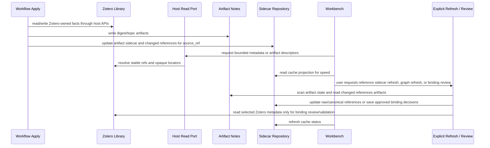

# Synthesis Layer Documentation

This directory is the canonical design anchor for the Synthesis Layer. It replaces the previous split governance/engineering document set, now archived under `doc/deprecated/synthesis-layer-legacy-20260531/`.

## Reading Order

1. [Glossary](./glossary.md) defines terms and IDs. Use it before changing code, docs, debug output, or UI copy.
2. [Library SSOT and Sidecar Cache](./library-ssot-and-sidecar-cache.md) defines the new boundary: Zotero Library is the source of truth and Synthesis persistence is a stale-tolerant sidecar cache plus user-approved derived decisions.
3. [Domain Model](./domain-model.md) defines ownership, dependency direction, and coupling limits.
4. [Reference Sidecar and Citation Graph](./registry-and-citation-graph.md) defines artifact sidecar, raw/canonical references, binding review, related items sync, and graph view semantics.
5. [Reference Resolution](./reference-resolution.md) defines the executable citation matcher and external dedupe policy.
6. [Topics and Discovery](./topics-and-discovery.md) defines topic artifacts, source check, coverage, best-effort discovery, and user review/override behavior.
7. [Concepts](./concepts.md) defines Concept KB proposal ingestion, overlay context, review actions, and failure semantics.
8. [Runtime and Rebuild](./runtime-and-rebuild.md) defines explicit cache refresh/review operations, reset/import/export, and failure recovery.
9. [Durable Bundle Sync](./git-sync-durable-state.md) defines WebDAV as the current visible manual durable-state exchange transport, Git Sync as retained hidden/deprecated code, and SQLite as the local materialized store.
10. [Performance and Scale](./performance-and-scale.md) defines scale tiers, p95 targets, explicit operation budgets, and degraded-cache behavior.
11. [State Machines](./state-machines.md) defines canonical object lifecycle transitions and forbidden transitions.
12. [Sequences](./sequences.md) defines canonical cross-domain runtime flows.
13. [Persistence and Files](./persistence-and-files.md) defines sidecar runtime state and the file write boundary.
14. [Workbench UI](./workbench-ui.md) defines user-facing cache state, graph, review, explicit refresh, and dangerous action behavior.

Related active contracts outside this directory:

- [Synthesis Review Input](../../openspec/specs/synthesis-review-input-contract/spec.md) defines the downstream review workflow DTO.
- [Topic Synthesis Manifest Sidecars](../../openspec/changes/archive/2026-05-31-strengthen-topic-synthesis-skill-contracts/specs/topic-synthesis-runtime-contract/spec.md) defines the runtime manifest sidecar contract.

Machine-readable contracts are intentionally small:

- [states-and-events.yaml](./contracts/states-and-events.yaml) contains stable state machine, sequence, and event IDs.
- [invariants.yaml](./contracts/invariants.yaml) contains invariant IDs that tests/debug output may reference.
- [service-api-migration.yaml](./contracts/service-api-migration.yaml) is the current public-service disposition and direct-consumer inventory for the staged sidecar migration.

## Context Map

```mermaid
flowchart LR
  platform["Workflow / Skill Provider / Host Bridge"]
  zotero["Zotero Library"]
  hostRead["Library / Artifact Read Port"]
  imageRead["Representative Image Read Port"]
  hostEffects["Bounded Host Effect Port"]
  artifacts["Derived Artifact Notes"]
  artifactSidecar["Artifact Sidecar"]
  refs["Raw / Canonical References"]
  bindings["Reference Bindings"]
  graph["Citation Graph Cache"]
  tags["Tags"]
  topics["Topics"]
  concepts["Concepts"]
  ui["Synthesis Workbench"]

  platform --> zotero
  zotero --> hostRead
  zotero --> imageRead
  hostEffects --> zotero
  hostRead --> artifacts
  artifacts --> artifactSidecar
  artifacts --> refs
  refs --> bindings
  refs --> graph
  bindings --> graph
  hostRead -. metadata / SSOT .-> topics
  artifacts -. locator + hash read .-> topics
  artifacts --> topics
  tags --> topics
  graph -. optional metrics .-> topics
  topics --> concepts
  concepts -. overlay context .-> topics
  artifactSidecar --> ui
  refs --> ui
  bindings --> ui
  graph --> ui
  topics --> ui
  tags --> ui
  concepts --> ui
  imageRead -. bounded image DTO .-> ui
```

## Runtime Flow

```mermaid
sequenceDiagram
  participant W as Workflow Apply
  participant Z as Zotero Library
  participant H as Host Read Port
  participant A as Artifact Notes
  participant S as Sidecar Repository
  participant U as Workbench
  participant R as Explicit Refresh / Review

  W->>Z: read/write Zotero-owned facts through host APIs
  W->>A: write digest/topic artifacts
  W->>S: update artifact sidecar and changed references for source_ref
  U->>H: request bounded metadata or artifact descriptors
  H->>Z: resolve stable refs and opaque locators
  U->>S: read cache projection for speed
  U->>R: user requests reference sidecar refresh, graph refresh, or binding review
  R->>A: scan artifact state and read changed references artifacts
  R->>S: update raw/canonical references or save approved binding decisions
  R->>Z: read selected Zotero metadata only for binding review/validation
  U->>S: refresh cache status
```

Dirty events, WorkItems, WorkRuns, startup reconcile, queue drain, and Registry rebuild are removed implementation targets. Active code must not retain them as compatibility mechanisms.

## Target Rules

- Zotero Library is the SSOT for library facts.
- Derived artifact notes and embedded payload attachments are the SSOT for literature workflow artifacts.
- Synthesis application reads cross the JSON-safe `SynthesisHostReadPort`: metadata is paged or looked up by at most 100 stable refs, artifact scans return descriptors only, and one payload read is guarded by the scanned hash.
- Topic digest representative images cross the independent `SynthesisHostRepresentativeImageReadPort`: the request contains only library/note identity, decoded content is limited to 2 MiB, and the result never exposes note HTML, Zotero objects, local paths, callbacks, or raw Host errors. Missing configuration or image data does not block digest markdown.
- Staged Tag parent bindings use canonical `{ libraryId, itemKey }` refs. Legacy numeric rows are resolved in batches of at most 100 before staged operations continue; missing targets drop only their binding, while resolver failure leaves stored rows unchanged and blocks staged access with a stable unavailable result.
- Bound-parent Tag writes cross `SynthesisHostTagEffectPort` in batches of at most 50 as idempotent ensure-present effects with provenance, precondition, permission, and receipts. Canonical vocabulary promotion commits first and is not rolled back by a later Host failure.
- Topic canonical current files are the only runtime SSOT for applied Topic content. Legacy Zotero Topic anchor/shard items are inert historical data: normal runtime does not discover, read, update, delete, or recover from them.
- Synthesis sidecar storage is a cache projection unless the row is an explicit user-approved reference/binding/dedupe decision.
- Artifact sidecar rows record artifact existence/hash/locator only; they do not copy Zotero item metadata.
- Raw references are keyed by `source_ref` and `references_artifact_hash`; canonical references and bindings are Synthesis sidecar facts.
- Index/cache state may be stale, missing, or partially refreshed without blocking literature digest or topic synthesis.
- Library-wide synchronization is not automatic. Broad cache refresh, reference binding review, and graph rebuild are explicit user/debug operations.
- Topic freshness reads the topic source manifest against current Zotero/artifact state; it does not depend on Reference/Graph cache freshness.
- WebDAV durable bundle sync is the current visible manual cross-device exchange mechanism; sync exports deterministic assets and never synchronizes the live SQLite file. Git Sync code is retained but hidden/deprecated.

## Maintenance Rules

- Prefer updating one canonical document rather than copying definitions across files.
- Any new term must first be added to [Glossary](./glossary.md).
- Any new stable state machine, sequence, event, or invariant ID must be added to the matching contract YAML and referenced from one Markdown document.
- Do not reintroduce automatic library-wide synchronization, dirty events, WorkItems, WorkRuns, startup reconcile, queue drain, or Registry rebuild unless the runtime model is explicitly redesigned through a new change.
- Archive historical alternatives under `doc/deprecated/`; do not mix them into active design docs.

## Implementation Status

| Area | Status | Notes |
| --- | --- | --- |
| Library SSOT boundary | hard-cut target | Zotero Library/artifacts are SSOT and Synthesis is sidecar cache plus explicit decisions. |
| SQLite sidecar repository | hard-cut target | Replace Registry-as-fact-source and all queue/job tables with sidecar cache, decision, and explicit operation tables. |
| Reference and binding cache | hard-cut target | Artifact sidecar, raw references, canonical references, redirects, and binding decisions replace Registry-as-library-index. |
| Citation Graph cache | hard-cut target | Structure, metrics, and layout are cache projections refreshed explicitly. |
| Citation Graph layout engine | process-ready in-process boundary | Force, radial, and components kernels run through the bounded environment-neutral `packages/synthesis-engine` contract. Application orchestration computes outside the library write lock and promotes only after rechecking the current graph hash; production does not yet use a worker process. |
| Topics | hard-cut target | Topic source check/discovery read Zotero/artifacts directly and remain soft-coupled from graph cache. |
| Concepts | unchanged target | Concept KB remains a sibling domain; proposal ingestion and overlay remain bounded and optional. |
| Discovery | hard-cut target | Normal discovery is digest-apply-time token/phrase overlap, not global n x m matching. |
| Reference Resolution | hard-cut target | Matcher output becomes graph-affecting only through deterministic safe apply or explicit decisions. |
| Explicit Operations | hard-cut target | User/debug-triggered operations replace dirty events, WorkItems, WorkRuns, sidecar startup replay, queue drain, and Registry rebuild. Explicit startup lifecycle cancels persisted `running` rows left by a prior process; ordinary reads never mutate operation state. |
| Workbench UI | hard-cut target | UI presents cache status, explicit operations, and Review & Overrides management. |
| Client boundary | migration slices active | Workflow Topic options, startup/maintenance lifecycle, default invalidation, related-items notifier echo classification, the twelve-method Workflow Host facade, production plus read-only Workbench reads, Topic Report export, progress polling, Citation Graph, Reference, Concept, Topic, Topic Graph, Tag, Git/WebDAV Sync, and all Host Bridge Synthesis capabilities use grouped `SynthesisClient` capabilities. Host Bridge routes twenty-three normal and eight debug capabilities through Topics, Graph, References, Artifacts, Concepts, Maintenance, Library Index, Workflow Review, and Debug clients; MCP mirrors the Host Bridge catalog and has no separate registry. Topic Context and filtered artifact export carry local/remote delivery mode outside request JSON. Sync commands alone acquire a fresh default client after invalidating the legacy service; ordinary Host/debug calls retain cached-client composition. Strict request DTOs and opaque JSON-safe results keep UI callbacks and domain internals outside the boundary. The reverse library/artifact seam is `SynthesisHostReadPort`: pages default to 50 and cap at 100, ref lookups cap at 100, scans are payload-free, and reads require the scanned hash. Topic digest images use the separate `SynthesisHostRepresentativeImageReadPort`, whose canonical `absent | unavailable | available` result carries at most 2 MiB of decoded image content and no note HTML or path. Related Items writes use `SynthesisHostRelatedItemsEffectPort`; staged parent identity upgrade uses `SynthesisHostStagedTagBindingMigrationPort`; bound-parent Tag writes use `SynthesisHostTagEffectPort`. These bounded DTO/receipt seams keep Zotero item objects and raw errors outside the service. Dormant Topic mirror methods, codecs, recovery, and Zotero adapter are retired rather than ported. The legacy composition root owns all production Host adapters plus the default service cache and invalidation; the readonly harness supplies only grouped library/artifact read capability and omits representative-image file reads, legacy binding resolution, and Host writes. That composition root is the only production direct consumer of the complete 125-method service. |
| Remote export delivery | Host port active | Remote Topic Context and filtered paper-artifact exports pass bounded text entries through `SynthesisHostExportDeliveryPort`. The Host adapter alone owns temporary ZIP materialization, SHA-256, `bridge-export` registration, TTL-backed opaque descriptors, and failure cleanup. Local output-path/run-root writes remain application behavior. The default legacy composition injects the port; readonly composition omits it. |
| Process topology | current in-process state | The plugin currently owns Synthesis application execution, `synthesis.db`, and Topic canonical writes. The approved sidecar migration has not cut over production ownership. |
