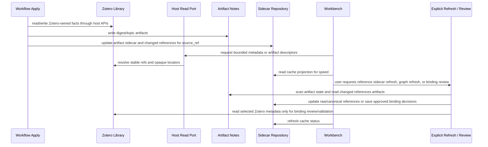

# Synthesis Layer Documentation

This directory is the canonical design anchor for the Synthesis Layer. It replaces the previous split governance/engineering document set, now archived under `doc/deprecated/synthesis-layer-legacy-20260531/`.

## Reading Order

1. [Glossary](./glossary.md) defines terms and IDs. Use it before changing code, docs, debug output, or UI copy.
2. [Library SSOT and Sidecar Cache](./library-ssot-and-sidecar-cache.md) defines the new boundary: Zotero Library is the source of truth and Synthesis persistence is a stale-tolerant sidecar cache plus user-approved derived decisions.
3. [Domain Model](./domain-model.md) defines ownership, dependency direction, and coupling limits.
4. [Reference Sidecar and Citation Graph](./registry-and-citation-graph.md) defines artifact sidecar, raw/canonical references, binding review, related items sync, and graph view semantics.
5. [Reference Resolution](./reference-resolution.md) defines the executable citation matcher and external dedupe policy.
6. [Topics and Discovery](./topics-and-discovery.md) defines topic artifacts, source check, coverage, best-effort discovery, and user review/override behavior.
7. [Concepts](./concepts.md) defines Concept KB proposal ingestion, overlay context, review actions, and failure semantics.
8. [Runtime and Rebuild](./runtime-and-rebuild.md) defines explicit cache refresh/review operations, reset/import/export, and failure recovery.
9. [Sidecar Runtime Packaging](./sidecar-runtime-packaging.md) defines native Rust manifest v3 packaging, managed installation, size, signature, expiry, and rollback boundaries.
10. [Sidecar Runtime Supervision](./sidecar-runtime-supervision.md) defines profile lifecycle, low-interference monitoring, bounded layout compute, fault isolation, and shutdown.
11. [Citation Graph Build Large Transfer](./citation-graph-large-transfer.md) records the authenticated paged-transfer contract used by the Rust production graph-build path.
12. [Durable Bundle Sync](./webdav-durable-sync.md) defines WebDAV as the sole durable-state exchange transport and SQLite as the local materialized store.
13. [Performance and Scale](./performance-and-scale.md) defines scale tiers, p95 targets, explicit operation budgets, and degraded-cache behavior.
14. [State Machines](./state-machines.md) defines canonical object lifecycle transitions and forbidden transitions.
15. [Sequences](./sequences.md) defines canonical cross-domain runtime flows.
16. [Persistence and Files](./persistence-and-files.md) defines sidecar runtime state and the file write boundary.
17. [Workbench UI](./workbench-ui.md) defines user-facing cache state, graph, review, explicit refresh, and dangerous action behavior.

Related active contracts outside this directory:

- [Synthesis Review Input](../../openspec/specs/synthesis-review-input-contract/spec.md) defines the downstream review workflow DTO.
- [Topic Synthesis Manifest Sidecars](../../openspec/changes/archive/2026-05-31-strengthen-topic-synthesis-skill-contracts/specs/topic-synthesis-runtime-contract/spec.md) defines the runtime manifest sidecar contract.

Machine-readable contracts are intentionally small:

- [states-and-events.yaml](./contracts/states-and-events.yaml) contains stable state machine, sequence, and event IDs.
- [invariants.yaml](./contracts/invariants.yaml) contains invariant IDs that tests/debug output may reference.
- [service-api-migration.yaml](./contracts/service-api-migration.yaml) is the current public-service disposition and direct-consumer inventory for the staged sidecar migration.

## Context Map

```mermaid
flowchart LR
  platform["Workflow / Skill Provider / Host Bridge"]
  zotero["Zotero Library"]
  hostRead["Library / Artifact Read Port"]
  imageRead["Representative Image Read Port"]
  hostEffects["Bounded Host Effect Port"]
  artifacts["Derived Artifact Notes"]
  artifactSidecar["Artifact Sidecar"]
  refs["Raw / Canonical References"]
  bindings["Reference Bindings"]
  graph["Citation Graph Cache"]
  tags["Tags"]
  topics["Topics"]
  concepts["Concepts"]
  ui["Synthesis Workbench"]

  platform --> zotero
  zotero --> hostRead
  zotero --> imageRead
  hostEffects --> zotero
  hostRead --> artifacts
  artifacts --> artifactSidecar
  artifacts --> refs
  refs --> bindings
  refs --> graph
  bindings --> graph
  hostRead -. metadata / SSOT .-> topics
  artifacts -. locator + hash read .-> topics
  artifacts --> topics
  tags --> topics
  graph -. optional metrics .-> topics
  topics --> concepts
  concepts -. overlay context .-> topics
  artifactSidecar --> ui
  refs --> ui
  bindings --> ui
  graph --> ui
  topics --> ui
  tags --> ui
  concepts --> ui
  imageRead -. bounded image DTO .-> ui
```

## Runtime Flow

```mermaid
sequenceDiagram
  participant W as Workflow Apply
  participant Z as Zotero Library
  participant H as Host Read Port
  participant A as Artifact Notes
  participant S as Sidecar Repository
  participant U as Workbench
  participant R as Explicit Refresh / Review

  W->>Z: read/write Zotero-owned facts through host APIs
  W->>A: write digest/topic artifacts
  W->>S: update artifact sidecar and changed references for source_ref
  U->>H: request bounded metadata or artifact descriptors
  H->>Z: resolve stable refs and opaque locators
  U->>S: read cache projection for speed
  U->>R: user requests reference sidecar refresh, graph refresh, or binding review
  R->>A: scan artifact state and read changed references artifacts
  R->>S: update raw/canonical references or save approved binding decisions
  R->>Z: read selected Zotero metadata only for binding review/validation
  U->>S: refresh cache status
```

Dirty events, WorkItems, WorkRuns, startup reconcile, queue drain, and Registry rebuild are removed implementation targets. Active code must not retain them as compatibility mechanisms.

## Target Rules

- Zotero Library is the SSOT for library facts.
- Derived artifact notes and embedded payload attachments are the SSOT for literature workflow artifacts.
- Synthesis application reads cross the JSON-safe `SynthesisHostReadPort`: metadata is paged or looked up by at most 100 stable refs, artifact scans return descriptors only, and one payload read is guarded by the scanned hash.
- Topic digest representative images cross the independent `SynthesisHostRepresentativeImageReadPort`: the request contains only library/note identity, decoded content is limited to 2 MiB, and the result never exposes note HTML, Zotero objects, local paths, callbacks, or raw Host errors. Missing configuration or image data does not block digest markdown.
- Staged Tag parent bindings use canonical `{ libraryId, itemKey }` refs. Legacy numeric rows are resolved in batches of at most 100 before staged operations continue; missing targets drop only their binding, while resolver failure leaves stored rows unchanged and blocks staged access with a stable unavailable result.
- Bound-parent Tag writes cross `SynthesisHostTagEffectPort` in batches of at most 50 as idempotent ensure-present effects with provenance, precondition, permission, and receipts. Canonical vocabulary promotion commits first and is not rolled back by a later Host failure.
- Topic canonical current files are the only runtime SSOT for applied Topic content. Legacy Zotero Topic anchor/shard items are inert historical data: normal runtime does not discover, read, update, delete, or recover from them.
- Synthesis sidecar storage is a cache projection unless the row is an explicit user-approved reference/binding/dedupe decision.
- Artifact sidecar rows record artifact existence/hash/locator only; they do not copy Zotero item metadata.
- Raw references are keyed by `source_ref` and `references_artifact_hash`; canonical references and bindings are Synthesis sidecar facts.
- Index/cache state may be stale, missing, or partially refreshed without blocking literature digest or topic synthesis.
- Library-wide synchronization is not automatic. Broad cache refresh, reference binding review, and graph rebuild are explicit user/debug operations.
- Topic freshness reads the topic source manifest against current Zotero/artifact state; it does not depend on Reference/Graph cache freshness.
- WebDAV durable bundle sync is the cross-device exchange mechanism; sync exports deterministic assets and never synchronizes the live SQLite file.
- Sync configuration, encrypted credentials, URL construction, and default WebDAV HTTP belong to the production composition adapter. The application service receives only the secret-free `SynthesisHostWebDavSyncPort`; missing and readonly bindings are explicitly disabled.

## Maintenance Rules

- Prefer updating one canonical document rather than copying definitions across files.
- Any new term must first be added to [Glossary](./glossary.md).
- Any new stable state machine, sequence, event, or invariant ID must be added to the matching contract YAML and referenced from one Markdown document.
- Do not reintroduce automatic library-wide synchronization, dirty events, WorkItems, WorkRuns, startup reconcile, queue drain, or Registry rebuild unless the runtime model is explicitly redesigned through a new change.
- Archive historical alternatives under `doc/deprecated/`; do not mix them into active design docs.

## Implementation Status

The only production owner is the Rust native runtime bundled in the installed
XPI and selected by manifest v3. Rust owns the application services, SQLite
repository, canonical Topic store, and bounded workers. TypeScript owns the
grouped client and UI orchestration plus reverse-Host adapters for Zotero,
credentials, file delivery, and network authority; the retained Node and
TypeScript implementations are differential oracles and cannot serve a normal
production request.

The fixed functional baseline is
`main@e210997a11e0054a3cb4ae0656e5cfb96102a09c`: 131 public service methods are
reconciled to 95 baseline wire operations, the approved
`client.controlPublicMaintenanceOperation` extension, explicit Host ownership,
or the closed 23-method retirement authorization in
`contracts/service-api-migration.yaml`. The resulting production manifest has
96 operations. The historical `isolated_*` blocks in that audit remain as
fixed migration evidence; `production_native_route` is the current ownership
record.

Repository foundation v2 has 53 tables and 46 indexes. Production serializes
writes through one owner and uses at most four read-only connections. Ordinary
control/page DTOs target 768 KiB and cannot exceed 1 MiB; large Topic assets,
artifact/review bodies, and exports use authenticated transfer, locator, or
delivery paths. Full-library and worker-backed mutations return the existing
maintenance-operation receipt and continue through bounded phases with explicit
progress, cancellation, retry, and one terminal.

Local domain parity and production-route candidate evidence are complete for
the closed operation inventory. Acceptance is still blocked on the governed
seven-platform build, production/performance gates, and representative Zotero 7
and Zotero 9 real-machine checks. R9b deletion changes remain blocked until
those gates pass; no signing, XPI publication, release, or synchronization is
authorized by the current evidence.

| Area | Status | Notes |
| --- | --- | --- |
| Library and artifact truth | current | Zotero Library and literature artifacts remain Host-owned SSOTs; Synthesis stores bounded projections and durable approved decisions. |
| Native runtime and repository | production owner | Manifest v3 selects the XPI-bundled Rust runtime. Its application/repository/canonical layers own 53 tables, 46 indexes, Topic current files, migrations, and bounded workers. |
| Workbench and domain surfaces | production Rust route | Home, Topics, Review, Tags, Concepts, Reader, Index, Graph, maintenance, sync, and debug capabilities use typed Rust application projections through `SynthesisClient`; read-only paths do not mutate readiness or operation state. |
| Reference and Citation Graph | production Rust route | Reference refresh performs one Host identity scan and bounded changed-source projection; Graph pages, metrics, and layouts use repository windows and basis-guarded promotion. |
| Topic, Tag, Concept, and Topic Graph | production Rust route | Rust owns DTO validation, domain rules, repository transactions, canonical coordination, and worker promotion. Host effects cross explicit reverse-Host ports. |
| Durable bundle and WebDAV | split Rust/Host ownership | Rust owns bundle/import/sync application state. The plugin adapter owns preferences, credentials, remote URL construction, HTTP, and abort authority. |
| Client and transfer boundary | current | TypeScript composes the grouped client, stages large content through authenticated transfer/locator contracts, resolves export delivery, and never exposes paths, credentials, or runtime internals. |
| Remote export delivery | Host-owned authority | Rust builds bounded canonical entries; the Host adapter alone materializes temporary ZIP bytes, registers opaque exports, and cleans them up. |
| Differential oracle | retained, non-production | Node/TypeScript packages and frozen corpora remain only for differential evidence. They use isolated roots in tests and have no fallback, live owner, or release role. |
| Migration acceptance | candidate evidence | Local parity and production-route evidence are present; seven-platform, governed performance, Zotero 7/9, packaging, signing, and release gates remain incomplete. |
