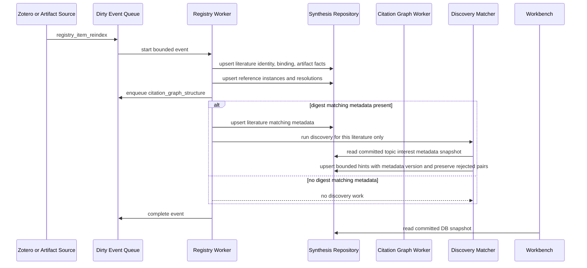
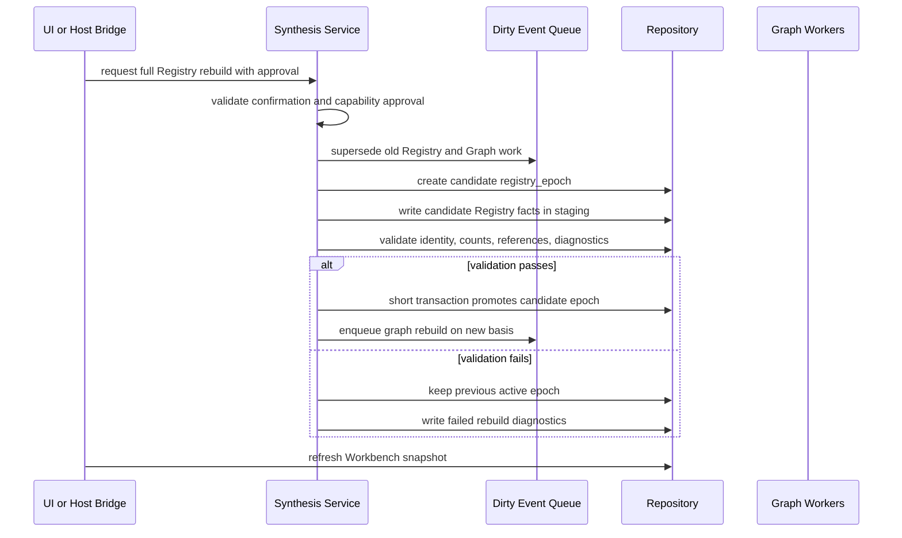
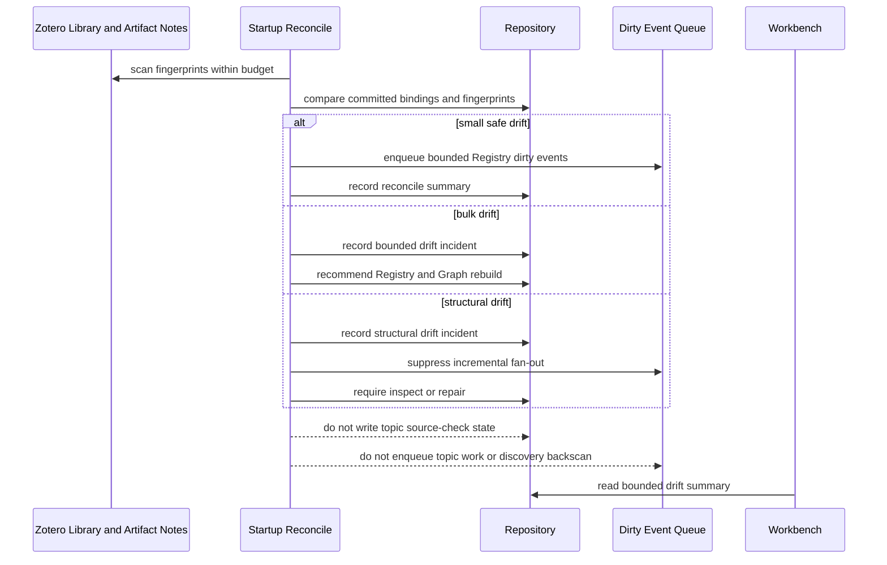
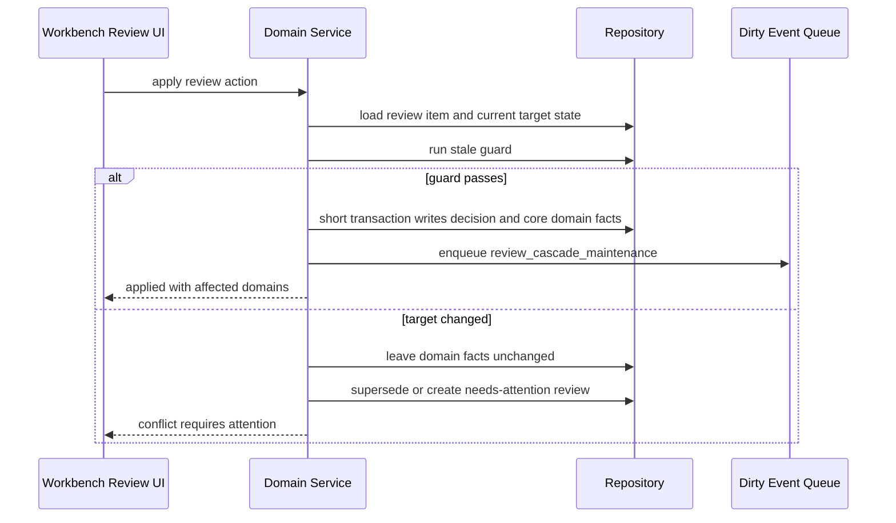
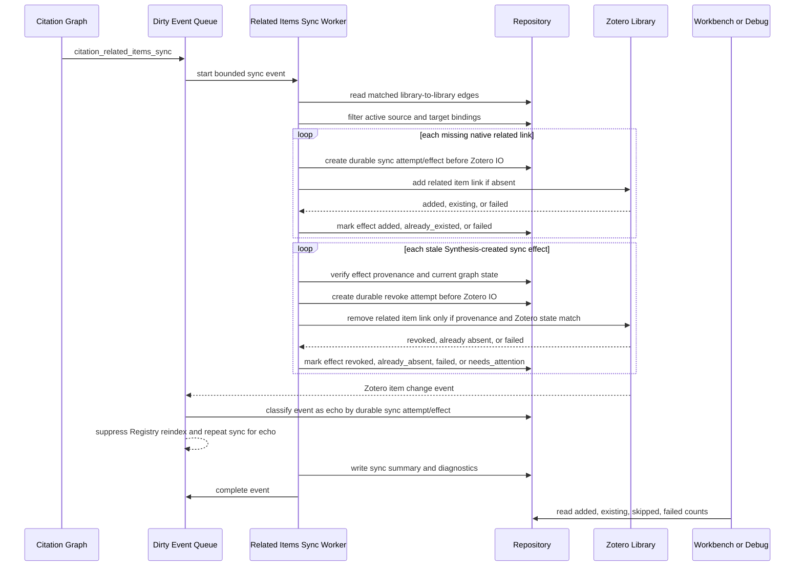
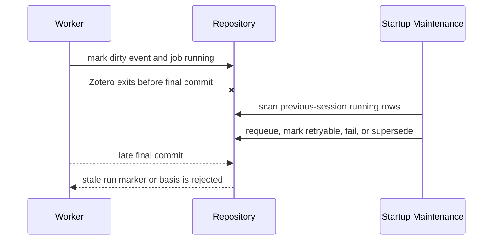
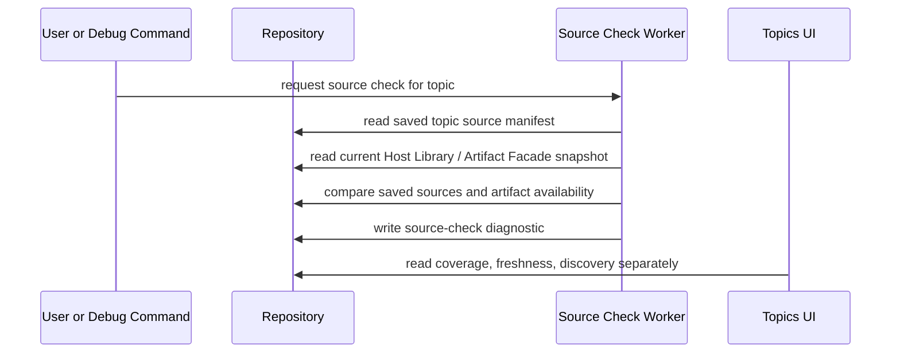
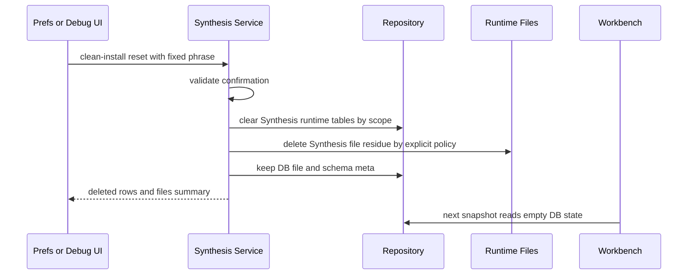
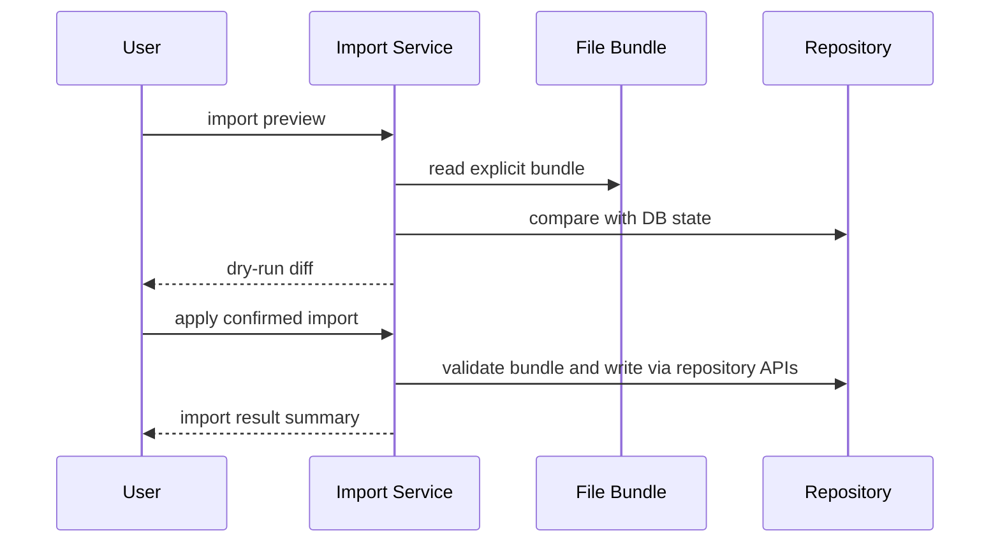

# Synthesis Sequences

This document defines the active cross-domain Synthesis sequences. It is the human-readable companion to the `sequences` section in `contracts/states-and-events.yaml`.

Sequence IDs use current domain names. Historical `index` wording remains deprecated; use Registry Cache for new docs and code.

## `seq.registry.incremental_item_update`

Incremental Registry update handles Zotero item or artifact-note changes. It must not trigger topic source checks, and it triggers discovery only when the mutation includes literature-digest matching metadata.

Key constraints:

- New Zotero item without digest metadata does not create discovery hints.
- Registry dirty work does not enqueue topic source check.
- Citation graph is downstream of Registry facts.

## `seq.discovery.digest_apply_match`

Discovery is a single-literature apply-time best-effort matcher.

Key constraints:

- Normal path complexity is `O(T)` for one applied literature item.
- Explicit repair may be `O(T * N)`, but it is debug/maintenance work.
- Discovery hints do not route to topic update by themselves. Topic update uses its own source-selection and workflow apply mechanism.

## `seq.registry.staged_full_rebuild`

Registry full rebuild is a protected staged operation. Workbench reads the previous committed Registry until candidate validation and promotion succeed.

Key constraints:

- Failed candidate state never replaces last-known-good Registry facts.
- Graph work records `graph_basis_registry_epoch`.
- Topics are not marked source-check changed by Registry rebuild alone.
- Downstream graph workers must write run-scoped staging output and promote it only through a transaction that rereads the current Registry basis.

## `seq.startup.external_source_reconcile`

Startup reconcile is a bounded detector. It classifies source drift before deciding whether work can be safely enqueued.

Key constraints:

- Bulk and structural drift do not expand into per-item review cards, graph jobs, or topic work.
- Structural drift fails closed until explicit inspect/repair.

## `seq.review.apply_action`

Review action commits core durable facts first and schedules expensive cascade work after commit.

Key constraints:

- Expensive dependent review refresh, graph rebuild, related-items sync, and broad diagnostics run later in bounded batches.
- Failed cascade does not roll back the applied decision.

## `seq.graph.related_items_sync`

Zotero related-items sync is a one-way external side effect from accepted library-to-library citation edges.

Key constraints:

- Worker never reads Zotero related items as reference-resolution input.
- Worker never deletes user-created Zotero related links or links that merely pre-existed before sync.
- Worker may revoke only Synthesis-created links with recorded provenance when the backing citation edge is rejected, retargeted, superseded, or no longer has active source/target bindings.
- If provenance is missing or current Zotero related-item state diverged, the effect becomes `needs_attention` and Zotero state is left untouched.
- The durable sync attempt/effect row must be written before Zotero IO. Recent write markers may speed up echo classification, but they are not a correctness mechanism.
- Startup recovery must inspect pending external write attempts. If Zotero state already reflects the intended effect, mark it observed after restart; otherwise retry or fail according to the attempt policy.
- Zotero write failures affect sync diagnostics only.
- Zotero change events caused by this worker are sync echoes only when they match durable sync attempt/effect state. They must be filtered before Registry reindex routing.

## `seq.worker.interrupted_run_recovery`

Previous-session running rows must be cleaned before they reach the UI as active jobs.

Key constraints:

- Old running jobs cannot remain in statusbar/popover.
- Late final commit must be no-op or rejected by a transaction-local run marker/basis check.
- Derived worker output must remain invisible unless the final promotion transaction succeeds against the current basis.

## `seq.topic.source_check`

Topic source check is explicit diagnostic work.

Key constraints:

- Registry dirty events do not trigger source check.
- Discovery hints do not mark source check changed.

## `seq.reset.clean_install`

Clean-install reset is dangerous and must be explicit.

Key constraints:

- Reset scope must state whether saved overrides and file residue are cleared.
- Reset must not silently import legacy JSON.

## `seq.import.preview_apply`

Import is preview-first and DB-first.

Key constraints:

- Import cannot make a file bundle a Workbench hot path.
- Apply requires preview plus explicit confirmation.
