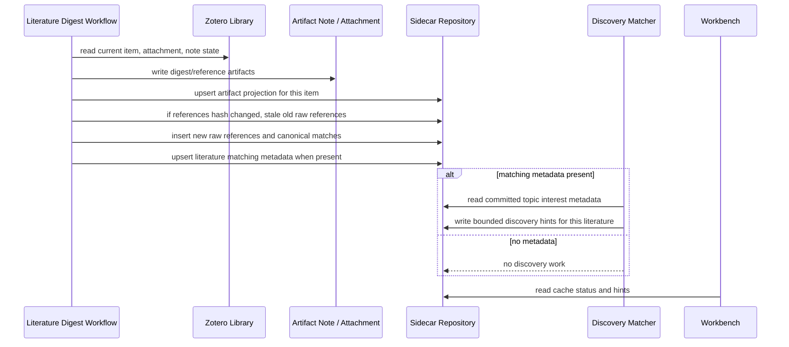
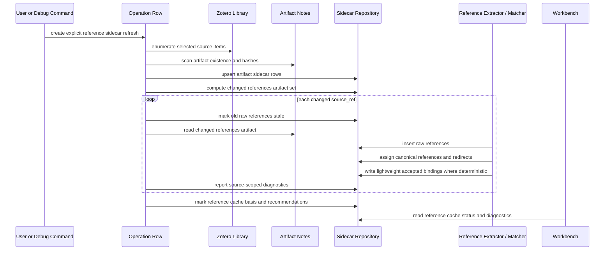
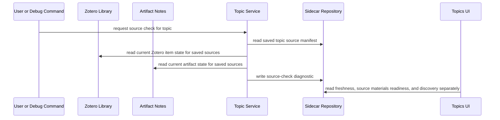
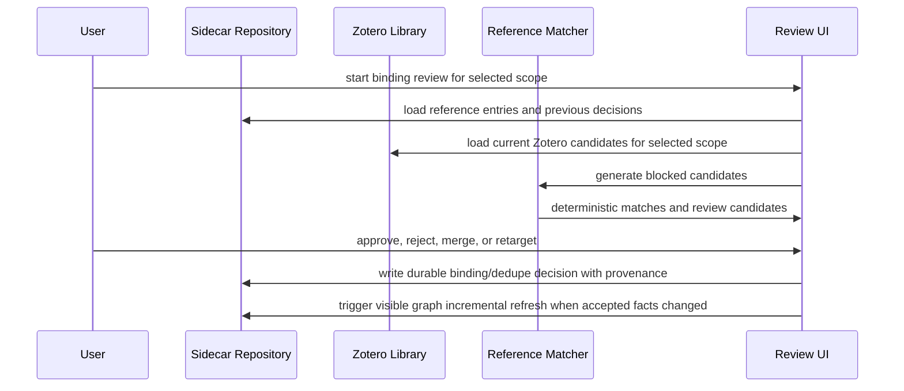
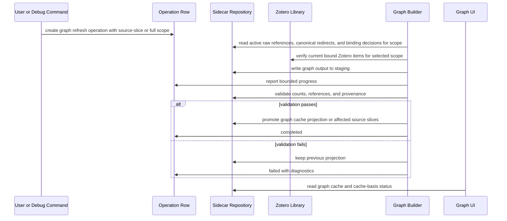
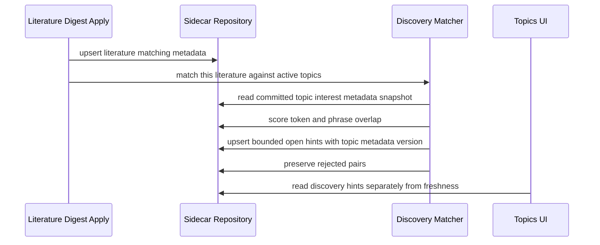
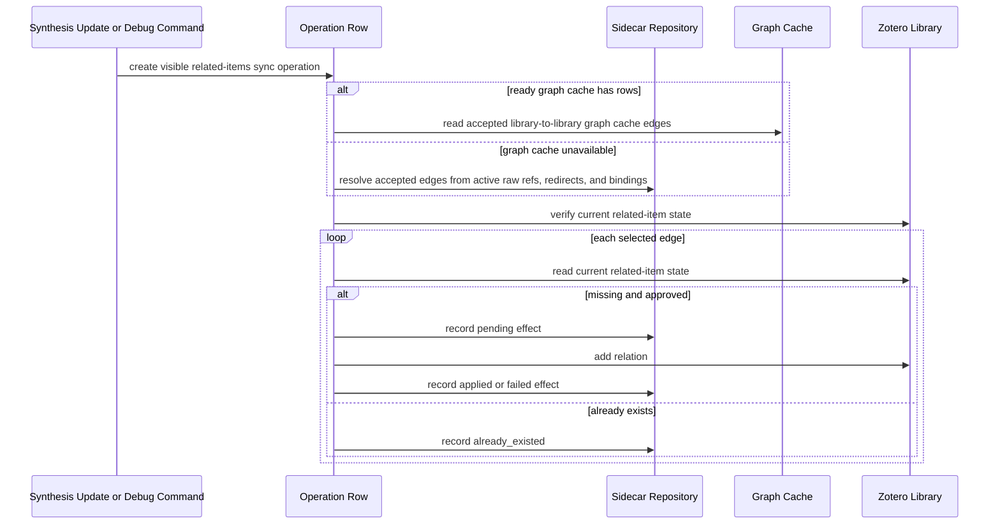
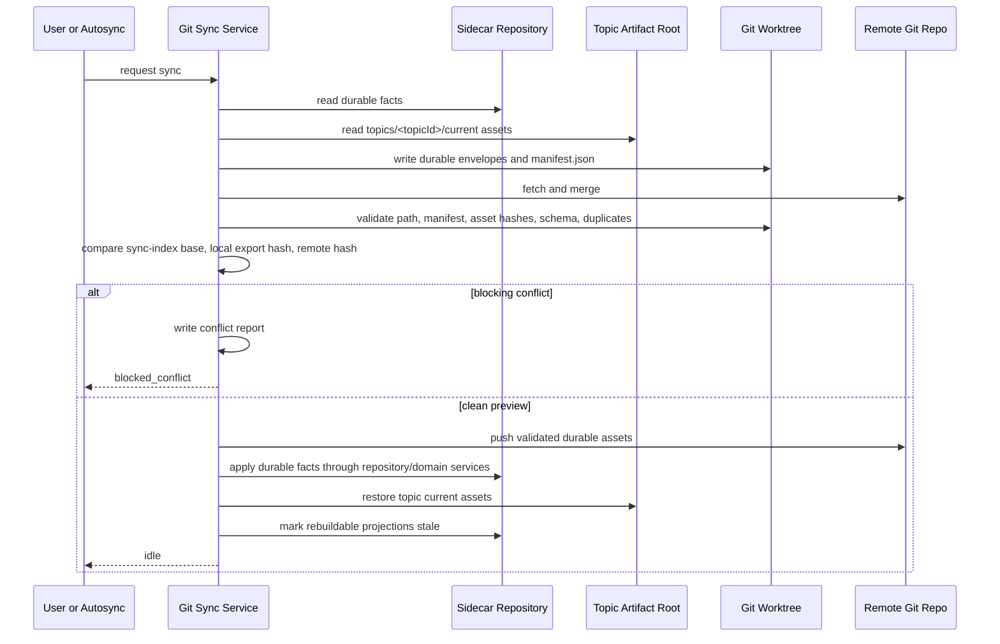
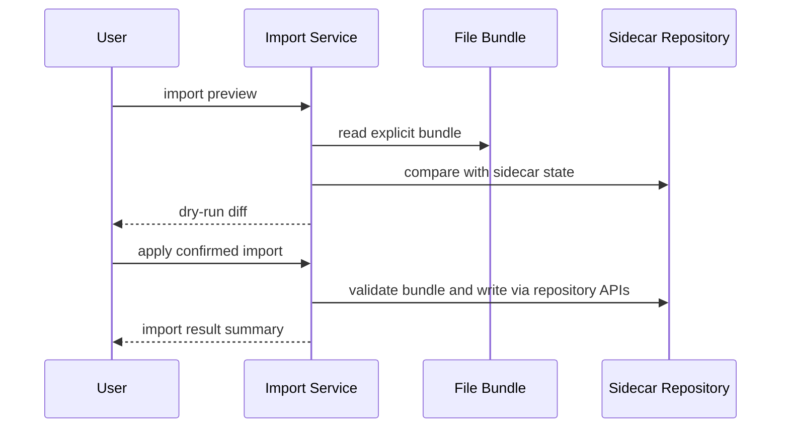

# Synthesis Sequences

This document defines the active cross-domain Synthesis sequences. It is the human-readable companion to the `sequences` section in `contracts/states-and-events.yaml`.

Historical index sync, dirty-event drain, startup reconcile, WorkItem/WorkRun worker execution, and full Registry rebuild sequences are removed implementation targets. New behavior uses direct Zotero/artifact reads, workflow apply sidecar sync, and explicit operations.

## `seq.sidecar.digest_apply_sync`

Digest apply is the normal automatic sidecar update path for one literature item.

Constraints:

- Scope is one applied item/artifact bundle.
- No library-wide backscan is started.
- No dirty event or WorkItem is created.
- Topic source-check state is not written.

## `seq.reference.sidecar_refresh`

Reference sidecar refresh is an explicit two-stage operation over selected source scope.

Constraints:

- Stage 1 scans artifact sidecar state only; it does not persist Zotero item metadata.
- Stage 2 reads only changed references artifacts.
- Ambiguous binding review is recommended, not silently applied.
- Graph refresh is not started automatically.

## `seq.topic.source_check`

Topic source check is explicit diagnostic work over current sources.

Constraints:

- Cache freshness is not topic freshness.
- Missing graph cache does not make a topic changed.
- Discovery hints do not mark source check changed.

## `seq.reference.binding_review`

Reference binding review is explicit because incorrect matches can create wrong graph edges.

Constraints:

- Ambiguous candidates require user review.
- User decisions are durable sidecar facts.
- Zotero Library metadata is not rewritten by binding review.

## `seq.graph.cache_refresh`

Graph cache refresh is a visible operation over current sidecar inputs and Zotero bindings. It may refresh affected source slices or run a full rebuild when explicitly requested or when heavy reference operations are allowed to bootstrap a missing graph cache.

Constraints:

- Failed refresh keeps the previous graph projection.
- Graph cache refresh does not scan artifacts or extract references.
- Graph cache refresh does not mark topic source-check state changed.
- Graph metrics are optional enrichment for topic workflows.

## `seq.discovery.digest_apply_match`

Discovery is a single-literature apply-time best-effort matcher.

## `seq.graph.related_items_sync`

Zotero related-items sync is a visible external side effect from accepted library-to-library citation edges. It may follow digest apply, Reference Sidecar refresh, Advanced Matching fact changes, or an explicit/debug command. Graph cache is a fast path only; sidecar facts provide the fallback edge source.

## `seq.git_sync.export_import`

Git Sync exchanges durable Synthesis state through Git assets. It does not synchronize the live SQLite file.

Constraints:

- Validation and dry-run happen before any SQLite write.
- Same-entity local and remote edits block import.
- Projection rows are not imported as durable facts; they become stale after durable import.
- `zotero-agents.db`, `synthesis.db`, WAL/SHM, operations, logs, locks, credentials, and temp workspaces never enter Git.

Constraints:

- Related-items sync never starts from graph refresh automatically.
- It never deletes user-created Zotero related links.
- Current Zotero relation state is authoritative.

## `seq.import.preview_apply`

Import is preview-first and sidecar-scoped.

Constraints:

- Apply requires preview plus explicit confirmation.
- Import scope must state whether user-approved binding/dedupe decisions are overwritten.
