# Synthesis Sequences

This document defines the active cross-domain Synthesis sequences. It is the human-readable companion to the `sequences` section in `contracts/states-and-events.yaml`.

Historical index sync, dirty-event drain, startup reconcile, WorkItem/WorkRun worker execution, and full Registry rebuild sequences are removed implementation targets. New behavior uses direct Zotero/artifact reads, workflow apply sidecar sync, and explicit operations.

## `seq.topic.apply_structured_artifact`

Topic create/update keeps pure materialization separate from application-owned
IO and durable promotion.

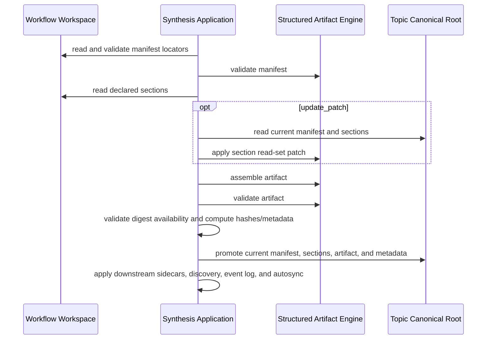
```mermaid
sequenceDiagram
  participant W as Workflow Workspace
  participant A as Synthesis Application
  participant E as Structured Artifact Engine
  participant C as Topic Canonical Root
  A->>W: read and validate manifest locators
  A->>E: validate manifest
  A->>W: read declared sections
  opt update_patch
    A->>C: read current manifest and sections
    A->>E: apply section read-set patch
  end
  A->>E: assemble artifact
  A->>E: validate artifact
  A->>A: validate digest availability and compute hashes/metadata
  A->>C: promote current manifest, sections, artifact, and metadata
  A->>A: apply downstream sidecars, discovery, event log, and autosync
```

Engine throw, cancellation, bounds failure, malformed result, or patch conflict
stops before canonical promotion and downstream durable effects.

## `seq.sidecar.digest_apply_sync`

Digest apply is the normal automatic sidecar update path for one literature item.

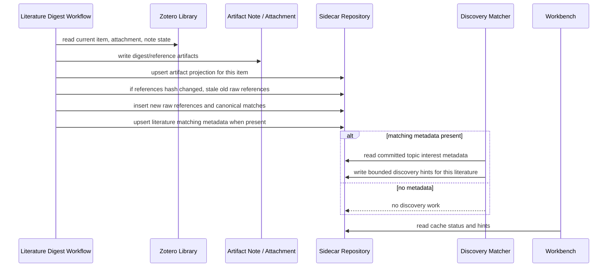
```mermaid
sequenceDiagram
  participant W as Literature Digest Workflow
  participant Z as Zotero Library
  participant A as Artifact Note / Attachment
  participant S as Sidecar Repository
  participant M as Discovery Matcher
  participant UI as Workbench

  W->>Z: read current item, attachment, note state
  W->>A: write digest/reference artifacts
  W->>S: upsert artifact projection for this item
  W->>S: if references hash changed, stale old raw references
  W->>S: insert new raw references and canonical matches
  W->>S: upsert literature matching metadata when present
  alt matching metadata present
    M->>S: read committed topic interest metadata
    M->>S: write bounded discovery hints for this literature
  else no metadata
    M-->>S: no discovery work
  end
  UI->>S: read cache status and hints
```

Constraints:

- Scope is one applied item/artifact bundle.
- No library-wide backscan is started.
- No dirty event or WorkItem is created.
- Topic source-check state is not written.

## `seq.reference.sidecar_refresh`

Reference sidecar refresh is an explicit two-stage operation over selected source scope.

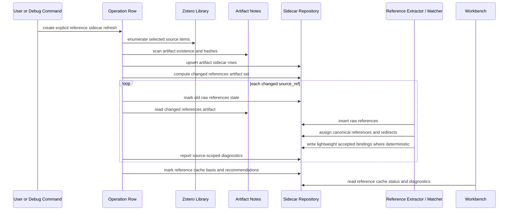
```mermaid
sequenceDiagram
  participant U as User or Debug Command
  participant O as Operation Row
  participant Z as Zotero Library
  participant A as Artifact Notes
  participant S as Sidecar Repository
  participant R as Reference Extractor / Matcher
  participant UI as Workbench

  U->>O: create explicit reference sidecar refresh
  O->>Z: enumerate selected source items
  O->>A: scan artifact existence and hashes
  O->>S: upsert artifact sidecar rows
  O->>S: compute changed references artifact set
  loop each changed source_ref
    O->>S: mark old raw references stale
    O->>A: read changed references artifact
    R->>S: insert raw references
    R->>S: assign canonical references and redirects
    R->>S: write lightweight accepted bindings where deterministic
    O->>S: report source-scoped diagnostics
  end
  O->>S: mark reference cache basis and recommendations
  UI->>S: read reference cache status and diagnostics
```

Constraints:

- Stage 1 scans artifact sidecar state only; it does not persist Zotero item metadata.
- Stage 2 reads only changed references artifacts.
- Ambiguous binding review is recommended, not silently applied.
- Graph refresh is not started automatically.

## `seq.topic.source_check`

Topic source check is explicit diagnostic work over current sources.

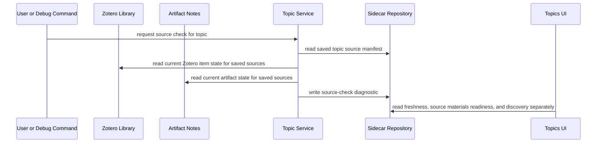
```mermaid
sequenceDiagram
  participant U as User or Debug Command
  participant Z as Zotero Library
  participant A as Artifact Notes
  participant T as Topic Service
  participant S as Sidecar Repository
  participant UI as Topics UI

  U->>T: request source check for topic
  T->>S: read saved topic source manifest
  T->>Z: read current Zotero item state for saved sources
  T->>A: read current artifact state for saved sources
  T->>S: write source-check diagnostic
  UI->>S: read freshness, source materials readiness, and discovery separately
```

Constraints:

- Cache freshness is not topic freshness.
- Missing graph cache does not make a topic changed.
- Discovery hints do not mark source check changed.

## `seq.reference.binding_review`

Reference binding review is explicit because incorrect matches can create wrong graph edges.

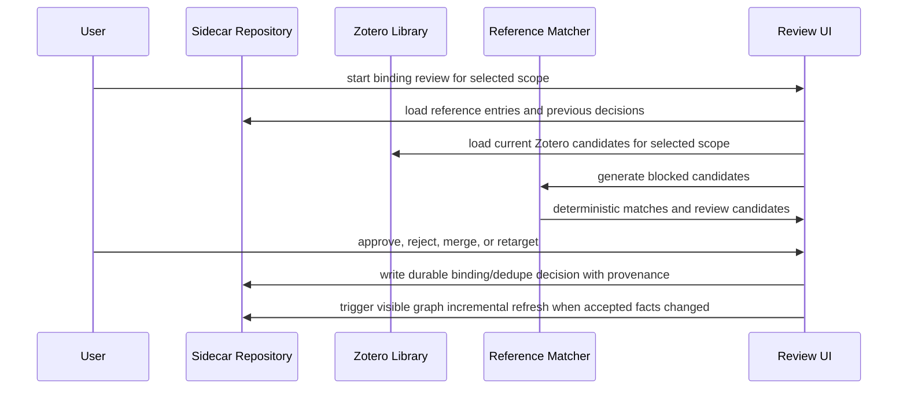
```mermaid
sequenceDiagram
  participant U as User
  participant S as Sidecar Repository
  participant Z as Zotero Library
  participant R as Reference Matcher
  participant UI as Review UI

  U->>UI: start binding review for selected scope
  UI->>S: load reference entries and previous decisions
  UI->>Z: load current Zotero candidates for selected scope
  UI->>R: generate blocked candidates
  R->>UI: deterministic matches and review candidates
  U->>UI: approve, reject, merge, or retarget
  UI->>S: write durable binding/dedupe decision with provenance
  UI->>S: trigger visible graph incremental refresh when accepted facts changed
```

Constraints:

- Ambiguous candidates require user review.
- User decisions are durable sidecar facts.
- Zotero Library metadata is not rewritten by binding review.

## `seq.graph.cache_refresh`

Graph cache refresh is a visible operation over current sidecar inputs and Zotero bindings. It may refresh affected source slices or run a full rebuild when explicitly requested or when heavy reference operations are allowed to bootstrap a missing graph cache.

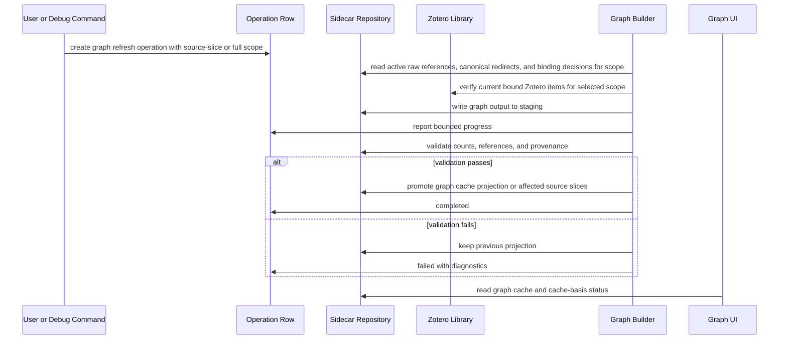
```mermaid
sequenceDiagram
  participant U as User or Debug Command
  participant O as Operation Row
  participant S as Sidecar Repository
  participant Z as Zotero Library
  participant G as Graph Builder
  participant UI as Graph UI

  U->>O: create graph refresh operation with source-slice or full scope
  G->>S: read active raw references, canonical redirects, and binding decisions for scope
  G->>Z: verify current bound Zotero items for selected scope
  G->>S: write graph output to staging
  G->>O: report bounded progress
  G->>S: validate counts, references, and provenance
  alt validation passes
    G->>S: promote graph cache projection or affected source slices
    G->>O: completed
  else validation fails
    G->>S: keep previous projection
    G->>O: failed with diagnostics
  end
  UI->>S: read graph cache and cache-basis status
```

Constraints:

- Failed refresh keeps the previous graph projection.
- Graph cache refresh does not scan artifacts or extract references.
- Graph cache refresh does not mark topic source-check state changed.
- Graph metrics are optional enrichment for topic workflows.

## `seq.graph.transfer_worker`

The Rust production transfer path executes large graph-build compute without
giving the worker repository, canonical, or Host authority.

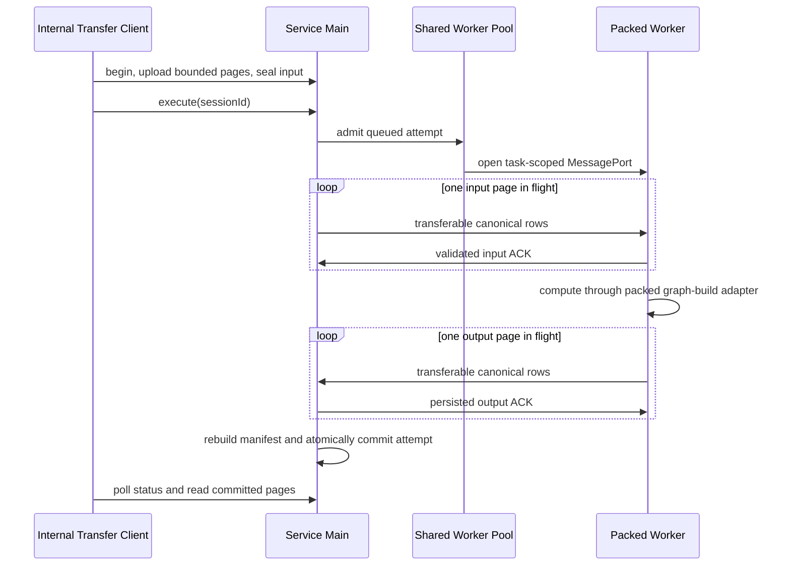
```mermaid
sequenceDiagram
  participant C as Internal Transfer Client
  participant M as Service Main
  participant P as Shared Worker Pool
  participant W as Packed Worker

  C->>M: begin, upload bounded pages, seal input
  C->>M: execute(sessionId)
  M->>P: admit queued attempt
  P->>W: open task-scoped MessagePort
  loop one input page in flight
    M->>W: transferable canonical rows
    W->>M: validated input ACK
  end
  W->>W: compute through packed graph-build adapter
  loop one output page in flight
    W->>M: transferable canonical rows
    M->>W: persisted output ACK
  end
  M->>M: rebuild manifest and atomically commit attempt
  C->>M: poll status and read committed pages
```

Constraints:

- The worker receives no staging path, DB, canonical-file, Host, Zotero, or
  subprocess capability.
- A failed attempt returns to sealed input; session cancel destroys all state.
- After the attempt commits, the Rust application recaptures the durable basis and promotes through the single repository writer.

## `seq.discovery.digest_apply_match`

Discovery is a single-literature apply-time best-effort matcher.

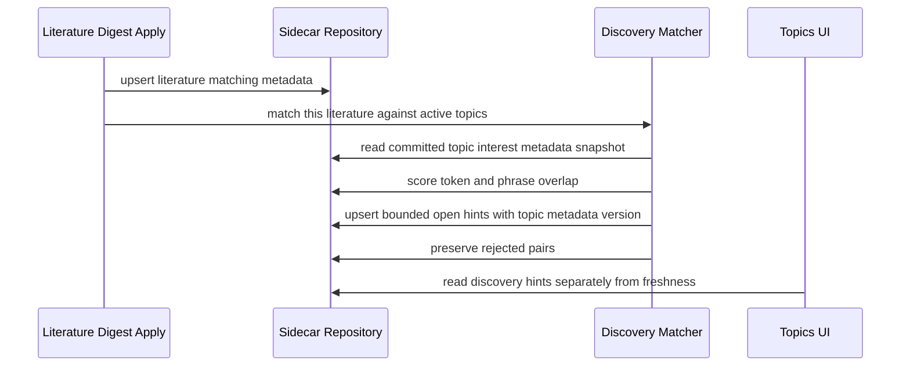
```mermaid
sequenceDiagram
  participant A as Literature Digest Apply
  participant S as Sidecar Repository
  participant M as Discovery Matcher
  participant UI as Topics UI

  A->>S: upsert literature matching metadata
  A->>M: match this literature against active topics
  M->>S: read committed topic interest metadata snapshot
  M->>S: score token and phrase overlap
  M->>S: upsert bounded open hints with topic metadata version
  M->>S: preserve rejected pairs
  UI->>S: read discovery hints separately from freshness
```

## `seq.graph.related_items_sync`

Zotero related-items sync is a visible external side effect from accepted library-to-library citation edges. It may follow digest apply, Reference Sidecar refresh, Advanced Matching fact changes, or an explicit/debug command. Graph cache is a fast path only; sidecar facts provide the fallback edge source.

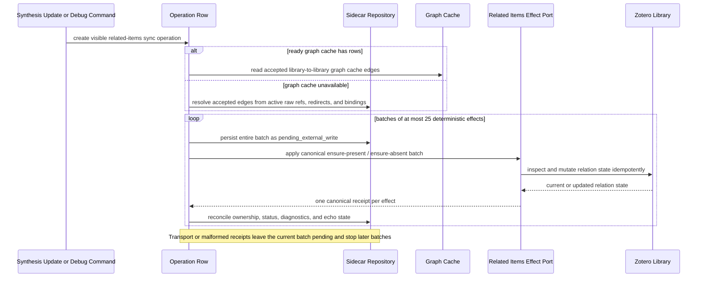
```mermaid
sequenceDiagram
  participant U as Synthesis Update or Debug Command
  participant O as Operation Row
  participant S as Sidecar Repository
  participant G as Graph Cache
  participant H as Related Items Effect Port
  participant Z as Zotero Library

  U->>O: create visible related-items sync operation
  alt ready graph cache has rows
    O->>G: read accepted library-to-library graph cache edges
  else graph cache unavailable
    O->>S: resolve accepted edges from active raw refs, redirects, and bindings
  end
  loop batches of at most 25 deterministic effects
    O->>S: persist entire batch as pending_external_write
    O->>H: apply canonical ensure-present / ensure-absent batch
    H->>Z: inspect and mutate relation state idempotently
    Z-->>H: current or updated relation state
    H-->>O: one canonical receipt per effect
    O->>S: reconcile ownership, status, diagnostics, and echo state
  end
  Note over O,S: Transport or malformed receipts leave the current batch pending and stop later batches
```

Constraints:

- Related-items sync never starts from graph refresh automatically.
- It never deletes user-created Zotero related links.
- Current Zotero relation state is authoritative.

## `seq.webdav_sync.export_import`

WebDAV Sync exchanges durable Synthesis state through deterministic bundle assets. It does not synchronize the live SQLite file.

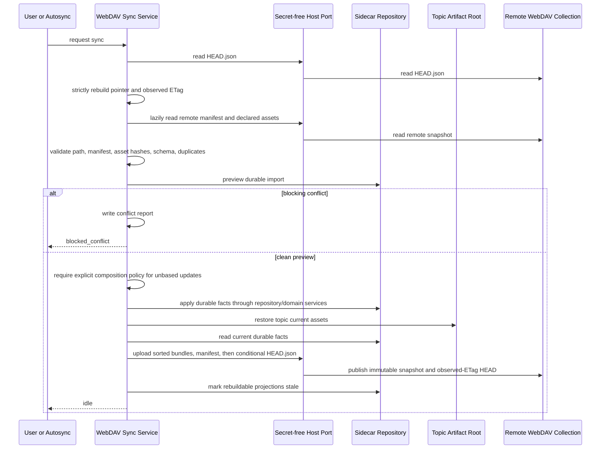
```mermaid
sequenceDiagram
  participant U as User or Autosync
  participant W as WebDAV Sync Service
  participant H as Secret-free Host Port
  participant S as Sidecar Repository
  participant A as Topic Artifact Root
  participant R as Remote WebDAV Collection

  U->>W: request sync
  W->>H: read HEAD.json
  H->>R: read HEAD.json
  W->>W: strictly rebuild pointer and observed ETag
  W->>H: lazily read remote manifest and declared assets
  H->>R: read remote snapshot
  W->>W: validate path, manifest, asset hashes, schema, duplicates
  W->>S: preview durable import
  alt blocking conflict
    W->>W: write conflict report
    W-->>U: blocked_conflict
  else clean preview
    W->>W: require explicit composition policy for unbased updates
    W->>S: apply durable facts through repository/domain services
    W->>A: restore topic current assets
    W->>S: read current durable facts
    W->>H: upload sorted bundles, manifest, then conditional HEAD.json
    H->>R: publish immutable snapshot and observed-ETag HEAD
    W->>S: mark rebuildable projections stale
    W-->>U: idle
  end
```

Constraints:

- Validation and dry-run happen before any SQLite write.
- Same-entity local and remote edits block import.
- Unbased remote updates block unless the composition explicitly acknowledges them.
- A second HEAD observation or conditional write conflict fails retryably; it never overwrites a changed pointer.
- Projection rows are not imported as durable facts; they become stale after durable import.
- `zotero-agents.db`, `synthesis.db`, WAL/SHM, operations, logs, locks, credentials, and temp workspaces never enter WebDAV bundles.

## `seq.import.preview_apply`

Import is preview-first and sidecar-scoped. The Rust production durable
application owns validation, repository CAS, and canonical promotion; remote
WebDAV credentials and HTTP remain in the secret-free Host adapter.

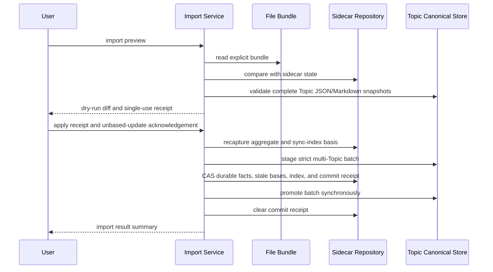
```mermaid
sequenceDiagram
  participant U as User
  participant I as Import Service
  participant B as File Bundle
  participant S as Sidecar Repository
  participant C as Topic Canonical Store

  U->>I: import preview
  I->>B: read explicit bundle
  I->>S: compare with sidecar state
  I->>C: validate complete Topic JSON/Markdown snapshots
  I-->>U: dry-run diff and single-use receipt
  U->>I: apply receipt and unbased-update acknowledgement
  I->>S: recapture aggregate and sync-index basis
  I->>C: stage strict multi-Topic batch
  I->>S: CAS durable facts, stale bases, index, and commit receipt
  I->>C: promote batch synchronously
  I->>S: clear commit receipt
  I-->>U: import result summary
```

Constraints:

- Apply consumes the receipt even when acknowledgement or basis checks fail.
- Conflicts and tombstones never receive an apply receipt.
- Restart rolls a batch forward only when its manifest/receipt matches SQLite;
  an uncommitted batch is discarded and a mismatch requires repair.
