# Synthesis State Machines

This document defines the active Synthesis state machines. It is the human-readable companion to `contracts/states-and-events.yaml`.

Each machine is intentionally local and repository-oriented. These state machines are not a distributed protocol; they describe valid lifecycle transitions inside the Zotero plugin runtime.

## Machine Index

| Machine ID | Owner | Object | Main Risk |
| --- | --- | --- | --- |
| `sm.identity.literature_item` | Registry identity service | Literature item | Rebuild creates new IDs for recognized works |
| `sm.identity.zotero_binding` | Registry identity service | Zotero binding | External Zotero drift overrides user decisions |
| `sm.reference.resolution` | Reference resolution service | Reference instance resolution | Suggestions become graph facts too early |
| `sm.topic.discovery_hint` | Topic discovery service | Topic-literature hint | Rejected pairs reopen unexpectedly |
| `sm.review.item` | Domain services | Current review item | Current issue is mistaken for durable override |
| `sm.override.durable_effect` | Domain services | Durable user effect | Rebuild silently drops user decisions |
| `sm.queue.dirty_event` | Runtime queue | Dirty event | Old basis work pollutes new state |
| `sm.job.progress` | Runtime workers | Job progress row | Old running jobs remain visible forever |
| `sm.rebuild.registry_run` | Registry rebuild service | Registry rebuild run | Failed rebuild replaces active Registry |
| `sm.topic.source_check` | Topic source-check worker | Source-check diagnostic | Registry dirty event marks topic changed |
| `sm.graph.layout` | Graph layout worker | Citation graph layout | Missing layout blocks existing graph structure |
| `sm.external_source.drift_incident` | Startup reconcile | Drift incident | Bulk drift expands into unbounded work |
| `sm.import.lifecycle` | Import/export service | Import run | Bundle writes DB before preview |

## `sm.identity.literature_item`

Owner: Registry identity service.

Object: Synthesis-owned `literature_item_id` row.

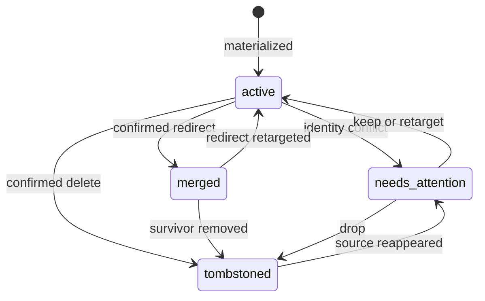

Allowed transitions:

- `active -> merged` only after confirmed duplicate or redirect decision.
- `active -> tombstoned` only after confirmed delete/drop decision.
- `needs_attention -> active` only after explicit keep or retarget.

Forbidden transitions:

- `tombstoned -> active` through startup reconcile alone.
- `merged -> active` without a redirect retarget decision.

Implementation risk: rebuild must resolve accepted redirects and unique strong work identifiers before falling back to current Zotero bindings or allocating a new provisional `literature_item_id`.

## `sm.identity.zotero_binding`

Owner: Registry identity service.

Object: `(libraryId, itemKey)` binding to a literature item.

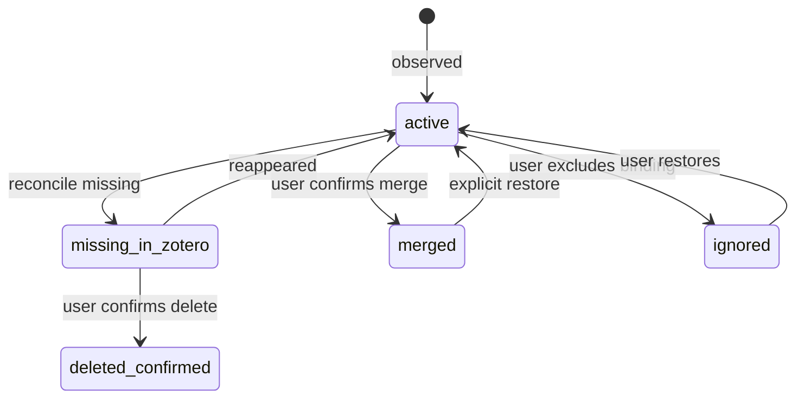

Allowed transitions:

- `active -> missing_in_zotero` from bounded reconcile.
- `missing_in_zotero -> deleted_confirmed` from explicit user action.
- `active -> merged` from explicit merge decision.

Forbidden transitions:

- `deleted_confirmed -> active` through reconcile alone.
- `merged -> active` without explicit restore or import policy.

Implementation risk: binding state changes must not directly advance topic artifact version or source-check state.

## `sm.reference.resolution`

Owner: Reference resolution service.

Object: One reference instance resolution.

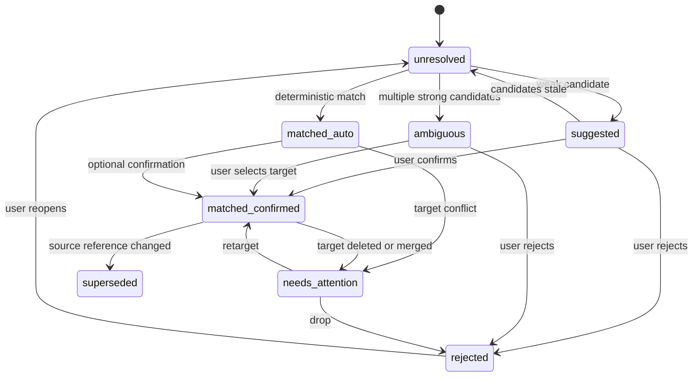

Allowed transitions:

- `unresolved -> matched_auto` only from deterministic high-confidence policy.
- `suggested/ambiguous -> matched_confirmed` only from review action.
- `matched_confirmed -> needs_attention` when target identity becomes invalid.

Forbidden transitions:

- `suggested -> graph edge` without confirmation.
- `ambiguous -> matched_auto`.

Implementation risk: only `matched_auto` and `matched_confirmed` may materialize matched citation edges.

## `sm.topic.discovery_hint`

Owner: Topic discovery service.

Object: One topic-literature discovery hint.

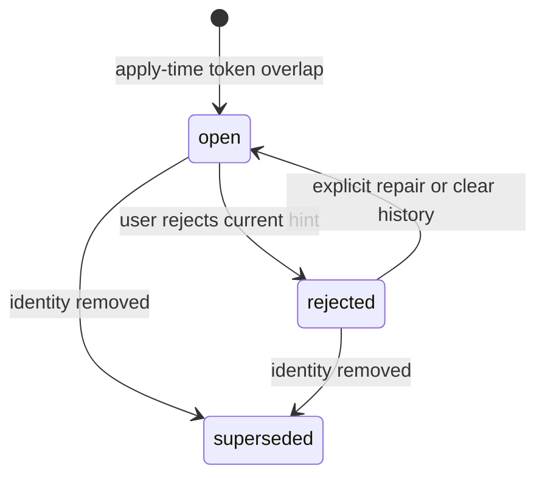

Allowed transitions:

- `open -> rejected` creates durable suppression for that topic-literature pair.
- `rejected -> open` requires explicit restore, reset, or force repair.

Forbidden transitions:

- `rejected -> open` from digest rerun, metadata hash drift, or Registry rebuild.
- Any discovery state transition writing topic source-check state.

Implementation risk: discovery is best-effort nudging and must remain separate from freshness and topic update consumption.

## `sm.review.item`

Owner: Domain services.

Object: Current review item.

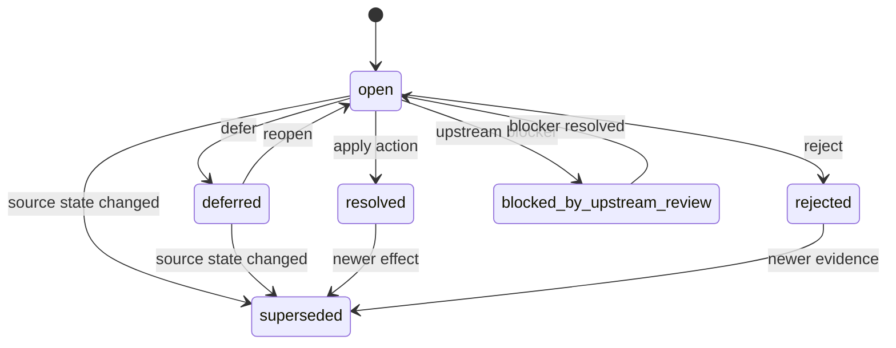

Allowed transitions:

- `open -> resolved/rejected/deferred` from user action.
- `blocked_by_upstream_review -> open` after upstream blocker resolves.
- `open/deferred -> superseded` when source evidence changes.

Forbidden transitions:

- `resolved -> open`; create a new review item instead.
- `superseded -> resolved`.

Implementation risk: review item status records whether the current issue instance is open or closed. The accepted/confirmed domain outcome belongs in domain-local durable effect rows, not in the review item status enum.

## `sm.override.durable_effect`

Owner: Domain services.

Object: Durable user decision or saved effect.

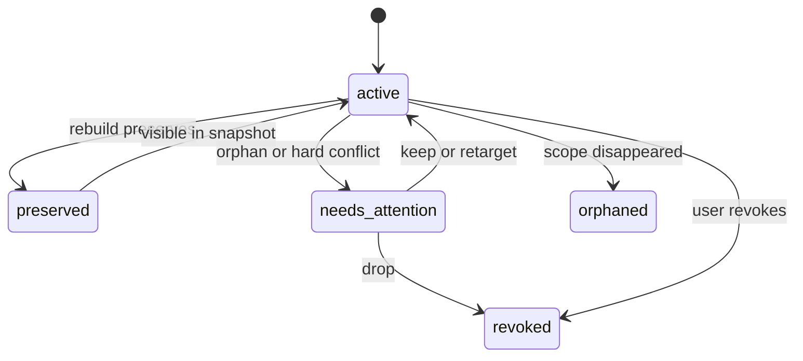

Allowed transitions:

- `active -> preserved -> active` during rebuild.
- `active -> needs_attention` only for orphan or hard conflict.
- `active -> revoked` from explicit user action.

Forbidden transitions:

- `active -> revoked` from ordinary digest metadata change.
- `preserved -> revoked` without reset/import/user action.

Implementation risk: rebuild should preserve practical user decisions without enterprise-style audit replay.

## `sm.queue.dirty_event`

Owner: Runtime queue.

Object: Repository-backed dirty event.

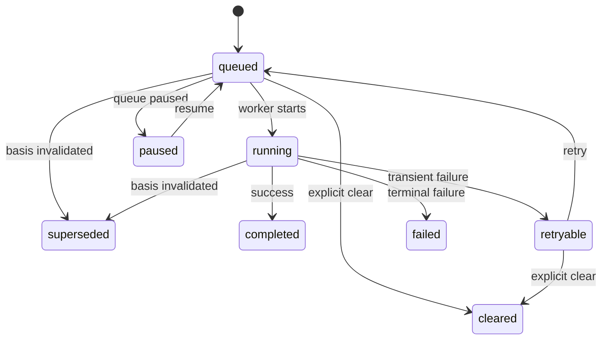

Allowed transitions:

- `running -> retryable` on transient failure or startup interrupted-run recovery.
- `queued/running -> superseded` when epoch/basis is invalidated.
- `queued/retryable -> cleared` from explicit queue clear/reset.

Forbidden transitions:

- `completed -> queued`; create a new event.
- Previous-session `running` remaining active after startup cleanup.

Implementation risk: `running -> superseded` does not mean the JavaScript worker was physically stopped. It means the repository commit gate rejected or will reject the stale run, leaving active derived state unchanged.

## `sm.job.progress`

Owner: Runtime workers.

Object: User-visible job progress row.

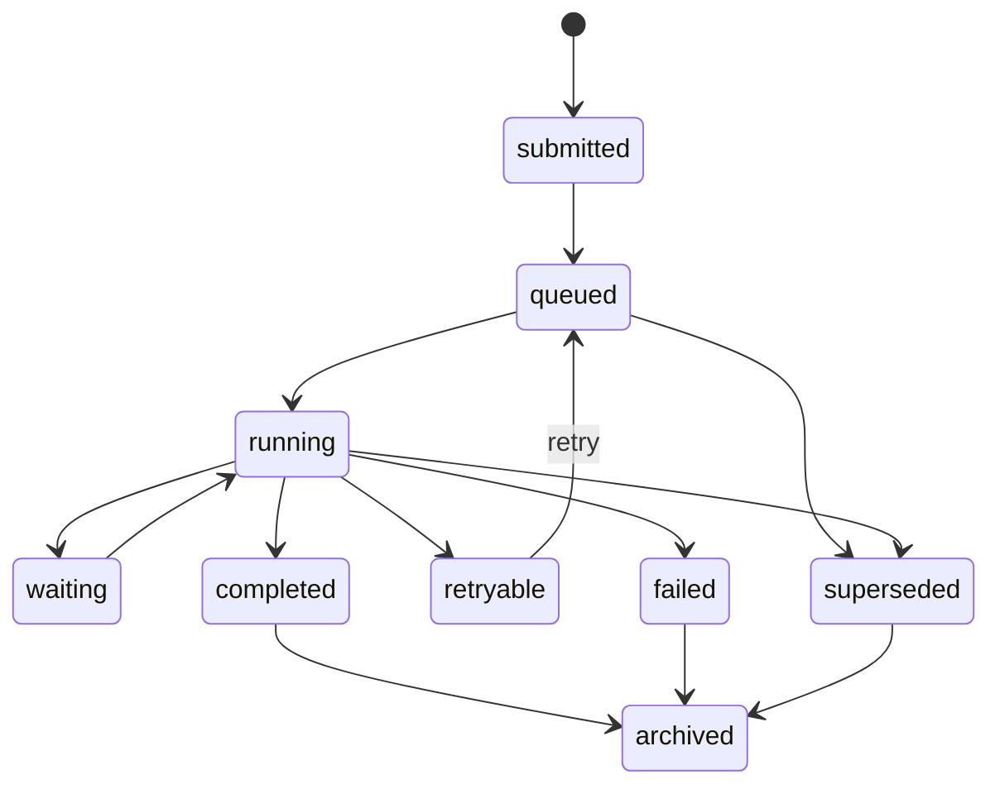

Allowed transitions:

- `running -> waiting -> running` for blocked local async work.
- `running -> retryable` for transient failure.
- `queued/running -> superseded` when basis is invalidated.

Forbidden transitions:

- Displaying previous-session `running` as active after startup cleanup.
- Showing determinate percent without real `current/total` or phase count.

Implementation risk: statusbar/popover must not invent progress. A running job with an old basis must be hidden or shown as superseded only after repository state says the final promotion was rejected or the basis is no longer current.

## `sm.rebuild.registry_run`

Owner: Registry rebuild service.

Object: One staged Registry rebuild run.

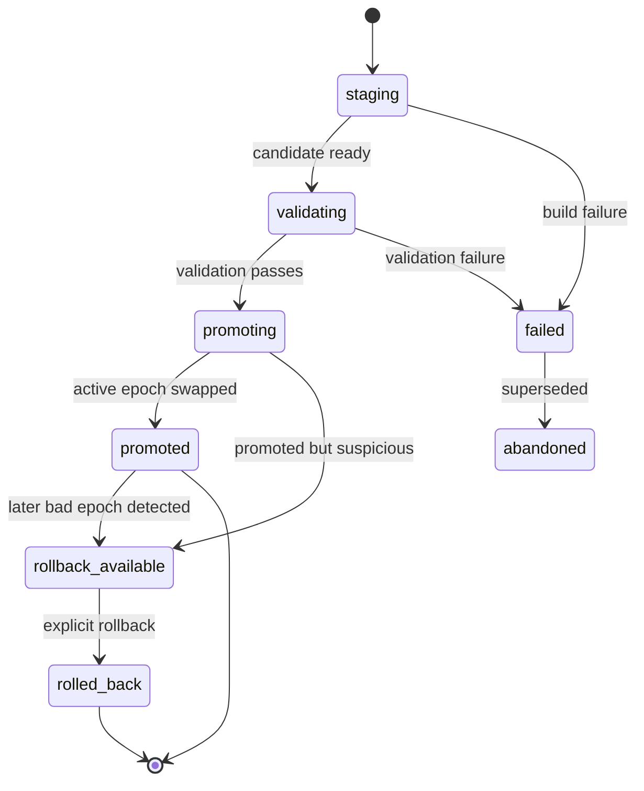

Allowed transitions:

- `validating -> promoting -> promoted` only after validation passes.
- `promoted -> rollback_available -> rolled_back` only through explicit rollback.
- `failed -> abandoned` when a newer run supersedes it.

Forbidden transitions:

- `staging -> promoted`.
- Advancing `registry_epoch` before promotion.

Implementation risk: failed candidate state must not replace last-known-good Registry facts.

## `sm.topic.source_check`

Owner: Topic source-check worker.

Object: Topic source-check diagnostic.

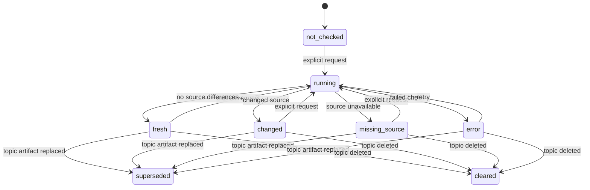

Allowed transitions:

- Any check run starts from explicit user, maintenance, or debug request.
- `running -> fresh/changed/missing_source/error` after comparing saved source manifest to current Host Library / Artifact Facade output.
- Terminal cleanup is explicit: topic artifact replacement supersedes old diagnostics; topic deletion clears them.

Forbidden transitions:

- Registry dirty event directly entering `running`.
- Discovery hint writing `changed`.

Implementation risk: source check is diagnostic and must not be confused with discovery.

## `sm.graph.layout`

Owner: Graph layout worker.

Object: Citation graph layout state.

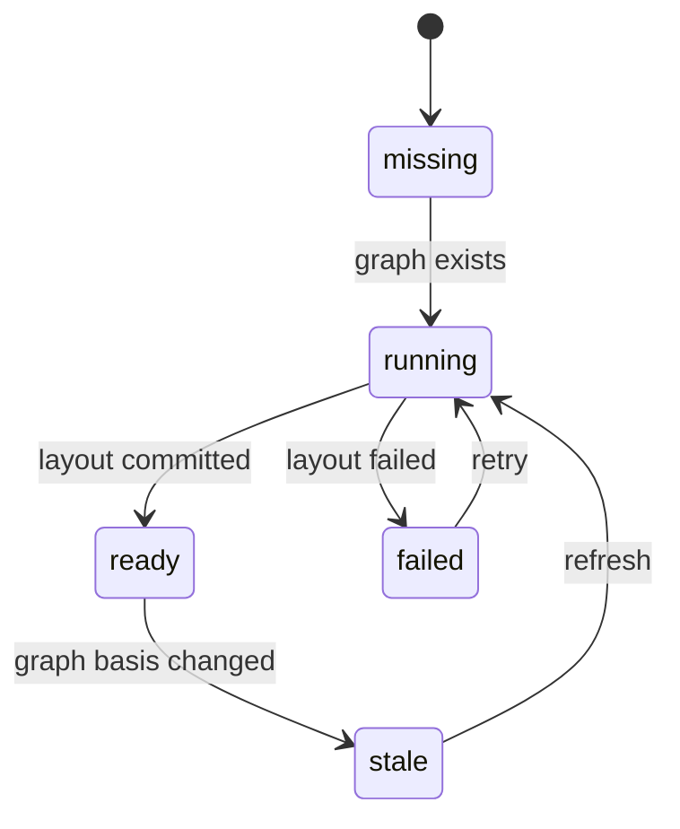

Allowed transitions:

- `missing -> running` when DB graph structure exists.
- `ready -> stale` when graph hash or basis changes.
- `stale -> running` through async layout refresh.

Forbidden transitions:

- Blocking graph drawing only because layout is missing if graph structure exists.
- Treating hover-only external changes as mandatory full-layout invalidation.

Implementation risk: UI should draw existing graph structure and show layout refresh state.

## `sm.external_source.drift_incident`

Owner: Startup reconcile and debug scan.

Object: External source drift incident.

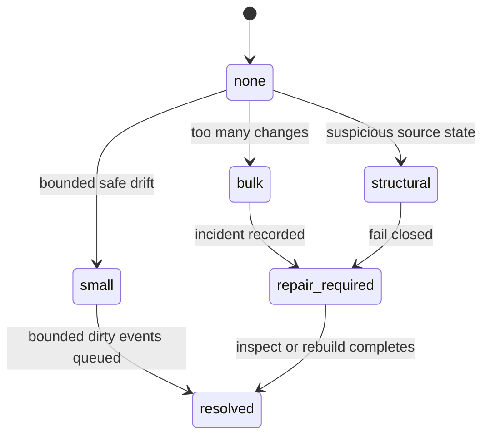

Allowed transitions:

- `small -> resolved` after bounded Registry dirty events are queued or processed.
- `bulk/structural -> repair_required` with bounded incident diagnostics.
- `repair_required -> resolved` only after explicit inspect, repair, reset, or rebuild.

Forbidden transitions:

- `bulk/structural -> per-item fan-out`.
- `structural -> small` without explicit inspection.

Implementation risk: startup reconcile must not create thousands of jobs or topic checks.

## `sm.import.lifecycle`

Owner: Import/export service.

Object: Import run.

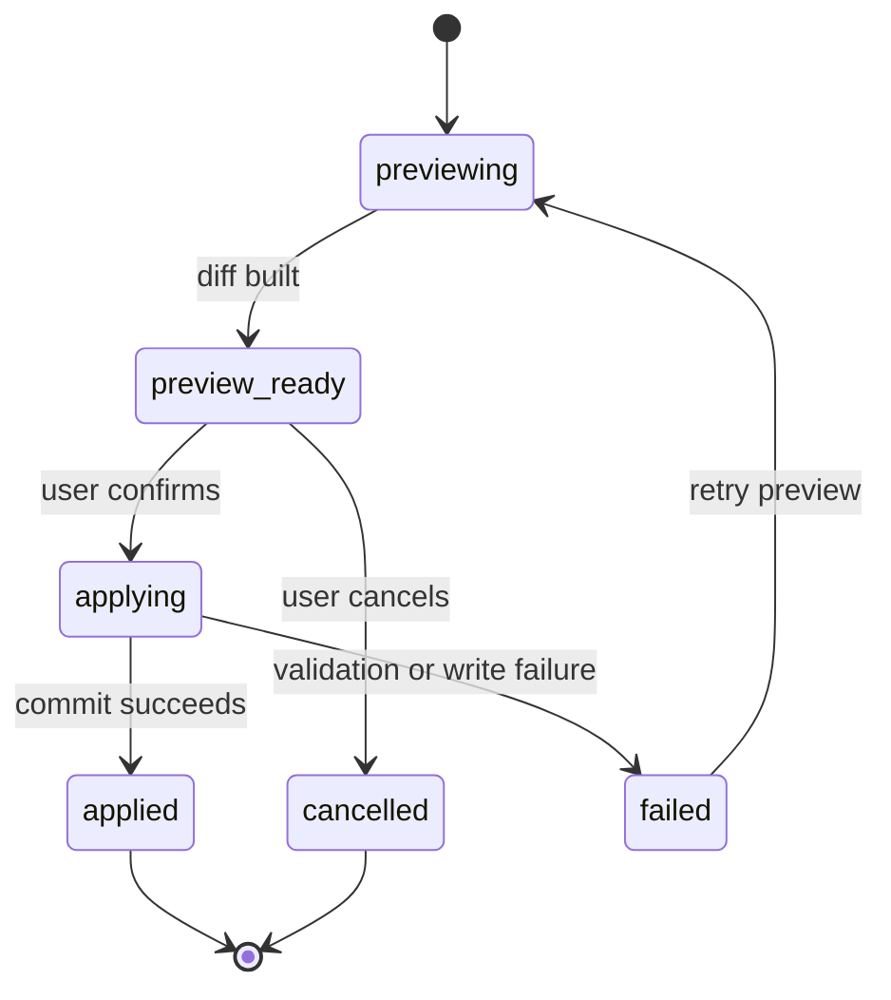

Allowed transitions:

- `preview_ready -> applying` only after explicit confirmation.
- `applying -> applied` through repository APIs.
- `failed -> previewing` to recompute a fresh diff.

Forbidden transitions:

- `previewing -> applying` without preview result.
- Importing a file bundle by making it a Workbench hot path.

Implementation risk: import must be preview-first and DB-first.

## State Combination Governance

These machines are orthogonal. Do not collapse identity, review, durable effect, queue/job, and epoch/basis into one giant object status.

Combination priority:

1. Identity/binding terminal state wins: `merged`, `tombstoned`, and `deleted_confirmed` retarget, supersede, or move dependent reference resolutions, graph edges, and review items to Needs Attention.
2. Durable effect wins over review item: review item is the current problem instance; confirmed redirect, tombstone, rejected hint, or confirmed relation is the rebuild-preserved fact.
3. Queue/job is never a domain fact: `running`, `queued`, and `retryable` cannot make a half-computed result appear committed.
4. Epoch/basis is only a technical guard: stale graph/job basis can supersede work, but it must not become topic source-check `changed`.
5. Discovery and source check are separate: `discovery_hint=open/rejected/superseded` never changes topic source-check state.

Invalid or downgraded combinations:

| Combination | Handling |
| --- | --- |
| confirmed reference resolution points to tombstoned literature item | resolution enters `needs_attention` / `superseded`; graph edge is not ready |
| related-items sync points to a non-active Zotero binding | skip sync and record diagnostic |
| rejected discovery hint is hit again by digest apply | keep `rejected`; update bounded diagnostics only |
| open review item scope is rewritten by P0 merge/delete action | old review becomes `superseded` or `blocked_by_upstream_review` |
| running job basis is older than committed basis | final promotion is rejected by the repository commit gate; job/event becomes `superseded`; normal UI hides it as active |
| bulk/structural drift plus per-item fan-out | fan-out is forbidden; keep bounded drift incident and explicit repair/rebuild recommendation |
