# Synthesis State Machines

This document defines the active Synthesis state machines. It is the human-readable companion to `contracts/states-and-events.yaml`.

The hard-cut model does not keep background synchronization state machines. Dirty events, WorkItems, WorkRuns, startup reconcile, queue drain, and Registry rebuild runs are removed implementation targets, not active lifecycle objects.

Runtime state has two active sources:

- `synt_operation` records explicit command progress and terminal diagnostics.
- `synt_cache_basis` records data readiness for Reference Sidecar, Citation Graph cache, layout, and other regenerable projections.

Terminal operation state does not imply data readiness. A completed operation is only history unless the corresponding cache basis was promoted; a failed operation must not override a previous ready cache basis. Legacy state/projection files are not state machines.

## Machine Index

| Machine ID | Owner | Object | Main Risk |
| --- | --- | --- | --- |
| `sm.reference.canonical` | Reference sidecar service | Canonical reference | Refresh fragments or merges referenced works incorrectly |
| `sm.reference.binding` | Reference binding review | Canonical reference binding | Cached binding overrides current Zotero truth |
| `sm.topic.discovery_hint` | Topic discovery service | Topic-literature hint | Rejected pairs reopen unexpectedly |
| `sm.review.item` | Domain services | Current review item | Current issue is mistaken for durable override |
| `sm.override.durable_effect` | Domain services | Durable user decision | Cache refresh silently drops user decisions |
| `sm.cache.projection` | Sidecar cache service | Cache projection | Stale cache is mistaken for Zotero Library truth |
| `sm.operation.explicit` | Explicit operation service | User/debug-triggered operation | Operation becomes a hidden worker queue |
| `sm.topic.source_check` | Topic source-check service | Source-check diagnostic | Cache refresh marks topic changed |
| `sm.sync.git` | Git Sync service | Durable exchange run | Live SQLite or conflicting durable facts are imported unsafely |
| `sm.import.lifecycle` | Import/export service | Import run | Bundle writes sidecar state before preview |

## `sm.reference.canonical`

Owner: Reference sidecar service.

Object: Synthesis-owned canonical reference row.

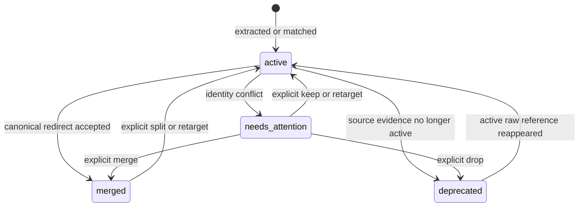

Allowed transitions:

- `active -> merged` from deterministic safe dedupe or explicit review.
- `active -> deprecated` when no active raw reference or binding decision still needs that canonical row.
- `needs_attention -> active/merged/deprecated` only after explicit review, repair, or import policy.

Forbidden transitions:

- Refresh silently deleting a canonical reference that still has active raw references or durable binding decisions.
- `merged -> active` without explicit split, retarget, or import policy.

## `sm.reference.match_proposal`

Owner: Reference matching review.

Object: Advanced matcher proposal for a Zotero binding or canonical merge.

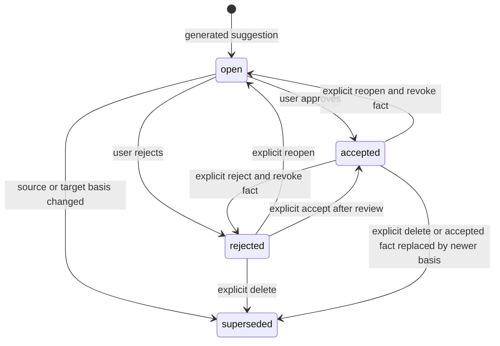

Allowed transitions:

- `open -> accepted/rejected` requires explicit review.
- `open -> superseded` is allowed when source or target basis changed.
- `rejected -> open/accepted/superseded` requires explicit user action or a new basis.
- `accepted -> open/rejected/superseded` requires explicit user action and revokes
  the accepted binding/redirect fact when that fact was created from the proposal.

Forbidden transitions:

- Cache refresh silently accepting or deleting a proposal.
- Refresh/rebuild changing accepted or rejected proposal decisions without an
  explicit user action.
- Proposal state changing topic artifact freshness by itself.

## `sm.topic.discovery_hint`

Owner: Topic discovery service.

Object: One topic-literature discovery hint.

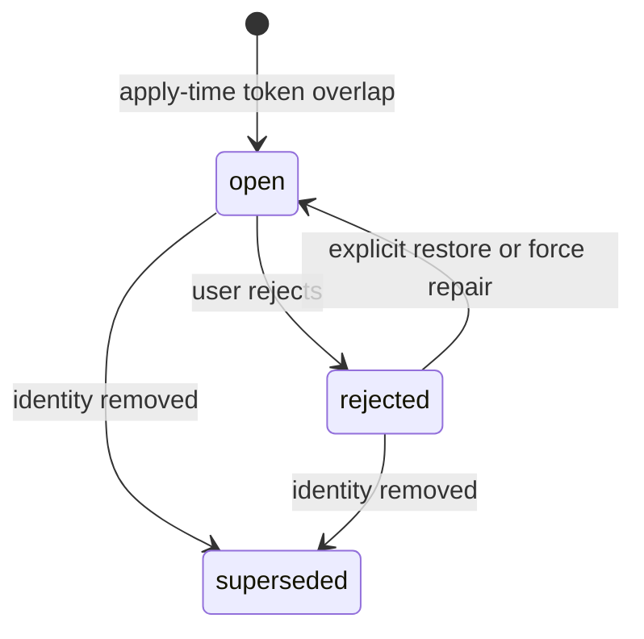

Forbidden transitions:

- `rejected -> open` from digest rerun, metadata hash drift, cache refresh, or graph cache rebuild.
- Any discovery state transition writing topic source-check state.

## `sm.review.item`

Owner: Domain services.

Object: Current review item.

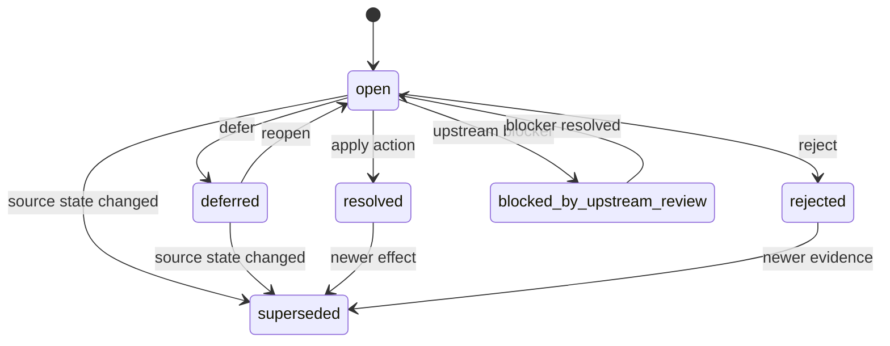

Forbidden transitions:

- `resolved -> open`; create a new review item instead.
- `superseded -> resolved`.

## `sm.override.durable_effect`

Owner: Domain services.

Object: Durable user decision or saved effect.

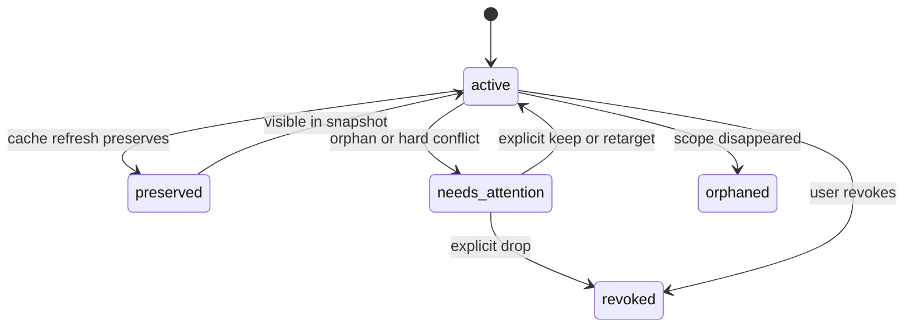

Forbidden transitions:

- `active -> revoked` from ordinary digest metadata change or cache refresh.
- `preserved -> revoked` without reset, import, or explicit action.

## `sm.cache.projection`

Owner: Sidecar cache service.

Object: A regenerable sidecar projection, such as artifact existence summary, reference cache, graph structure, graph metrics, or layout. Runtime status is stored in `synt_cache_basis`.

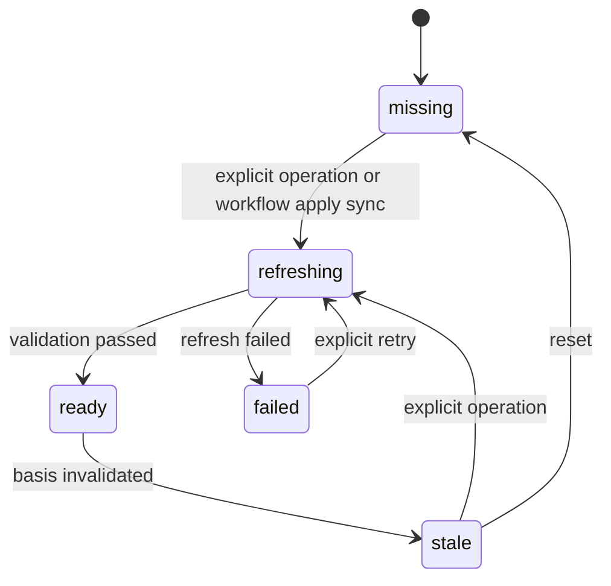

Allowed transitions:

- `missing/stale -> refreshing` only from workflow apply sync, explicit cache refresh, explicit graph incremental refresh, explicit repair, protected import, or scoped debug command.
- `refreshing -> ready` only after validation for the recorded basis.

Forbidden transitions:

- `stale -> topic source changed`.
- `missing -> block literature-analysis`.
- `refreshing -> mutate Zotero Library metadata`.

## `sm.operation.explicit`

Owner: Explicit operation service.

Object: A user/debug-triggered or workflow-triggered visible operation such as reference sidecar refresh, citation graph cache incremental refresh, citation graph cache rebuild, citation graph layout rebuild, reference binding review, related-items sync, import, export, or reset. Runtime progress is stored in `synt_operation`.

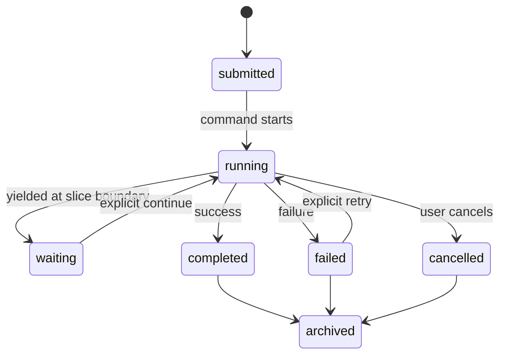

Allowed transitions:

- `running -> waiting` stores bounded progress and returns control to Zotero UI.
- `waiting -> running` requires an explicit continue/retry command or operation-local controlled loop.

Forbidden transitions:

- Operation rows being claimed by owner workers.
- Global queue pause/resume/drain controlling operations.
- Startup replaying old operations as hidden work.
- Terminal operation rows becoming cache readiness without a matching `synt_cache_basis` promotion.

## `sm.ui.workbench_surface`

Owner: Synthesis Workbench UI.

Object: Shell/Chrome/Surface read model for one Workbench area.

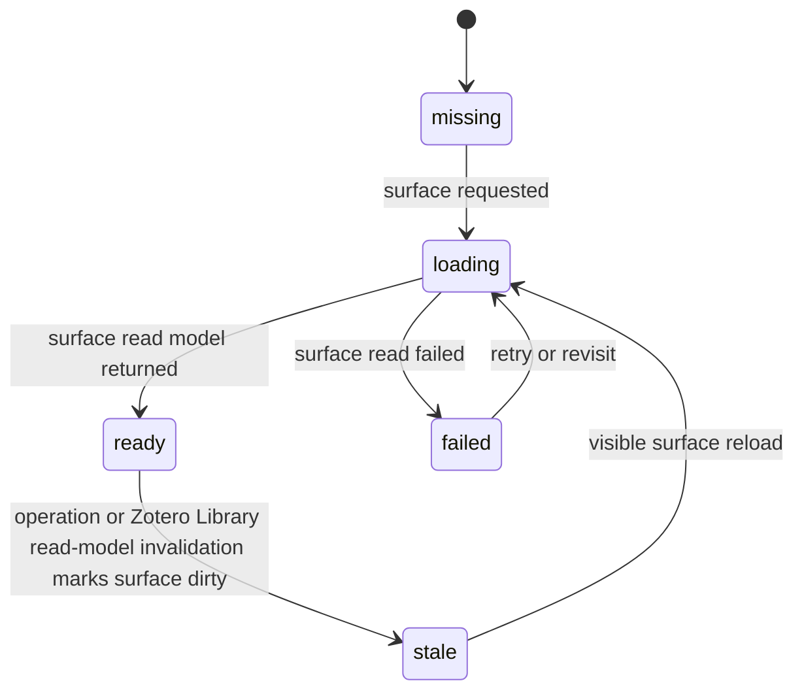

Allowed transitions:

- `ready -> stale` from a completed operation that invalidates the surface.
- `ready -> stale` from a Zotero item notification that invalidates the direct-read library metadata shown by a surface, such as Index rows.
- `missing/stale/failed -> loading` from startup warmup, visible tab selection, or explicit refresh.

Forbidden transitions:

- `loading -> full snapshot refresh`.
- Chrome progress update refreshing a content surface.
- Surface-local UI state clearing the Workbench root DOM.
- Zotero Library metadata dirty changing Reference Sidecar or Citation Graph `synt_cache_basis` readiness.

## `sm.topic.source_check`

Owner: Topic source-check service.

Object: Topic source-check diagnostic.

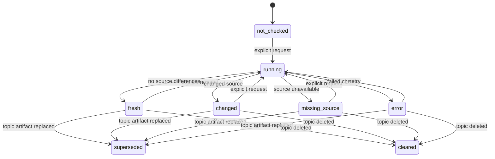

Forbidden transitions:

- Cache refresh directly entering `running`.
- Discovery hint writing `changed`.

## `sm.import.lifecycle`

Owner: Import/export service.

Object: Import run.

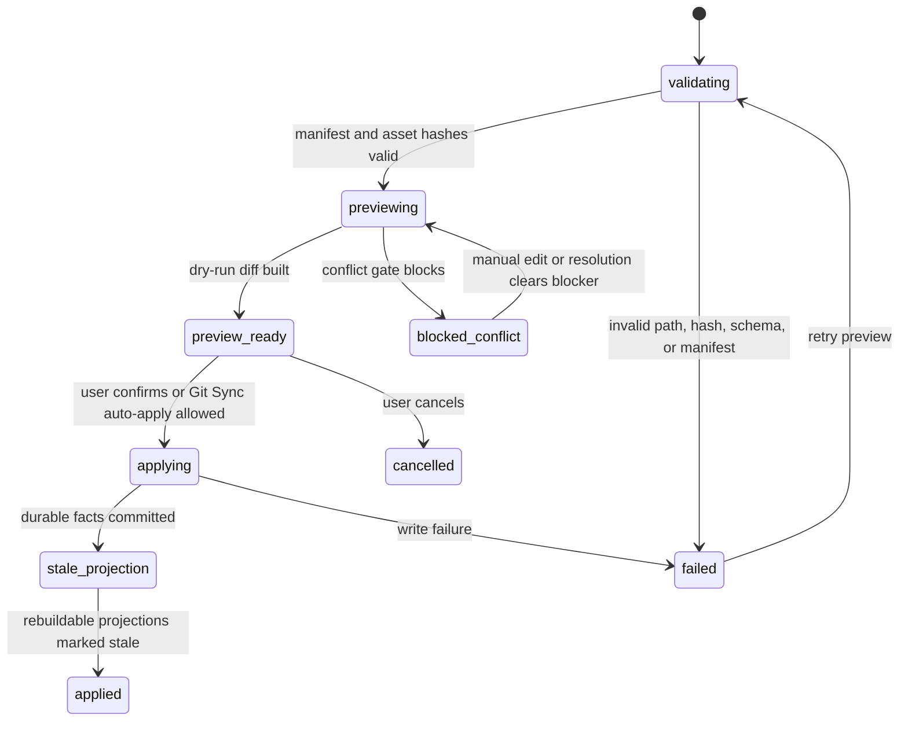

Forbidden transitions:

- `validating -> applying` without preview result.
- `blocked_conflict -> applying` without an explicit resolution action.
- Importing a file bundle by making it a Workbench hot path.

## `sm.sync.git`

Owner: Git Sync service.

Object: One Git durable-state exchange run.

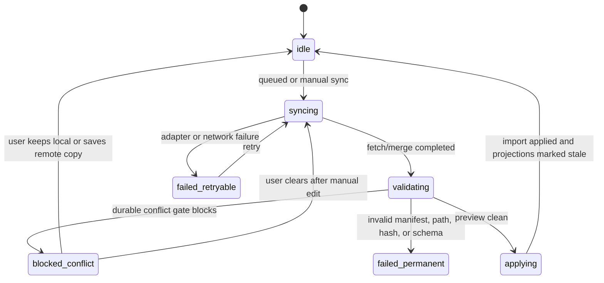

Forbidden transitions:

- `validating -> applying` when durable preview reports conflicts.
- `applying -> import live SQLite`.
- `blocked_conflict -> idle` by silently choosing last-writer-wins.

## State Combination Governance

These machines are orthogonal. Do not collapse identity, review, durable effect, cache, operation, and import state into one giant status.

Rules:

1. Cache state is never a Zotero fact: `ready`, `stale`, `missing`, `refreshing`, and `failed` describe sidecar projections only.
2. Explicit operation state is never a domain fact: `running`, `waiting`, and `failed` cannot make a half-computed result appear committed.
3. Discovery and source check are separate: discovery hints never change topic source-check state.
4. Durable user decisions win over transient review items and cache refresh output.
5. Current Zotero Library reads win over cached Zotero metadata whenever correctness matters.
6. Reference sidecar refresh, citation graph cache incremental refresh, and citation graph cache rebuild are different operations; layout rebuild is a fourth operation scoped to coordinates only.
